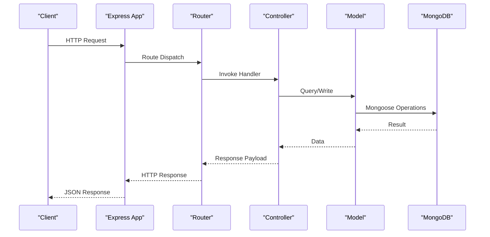
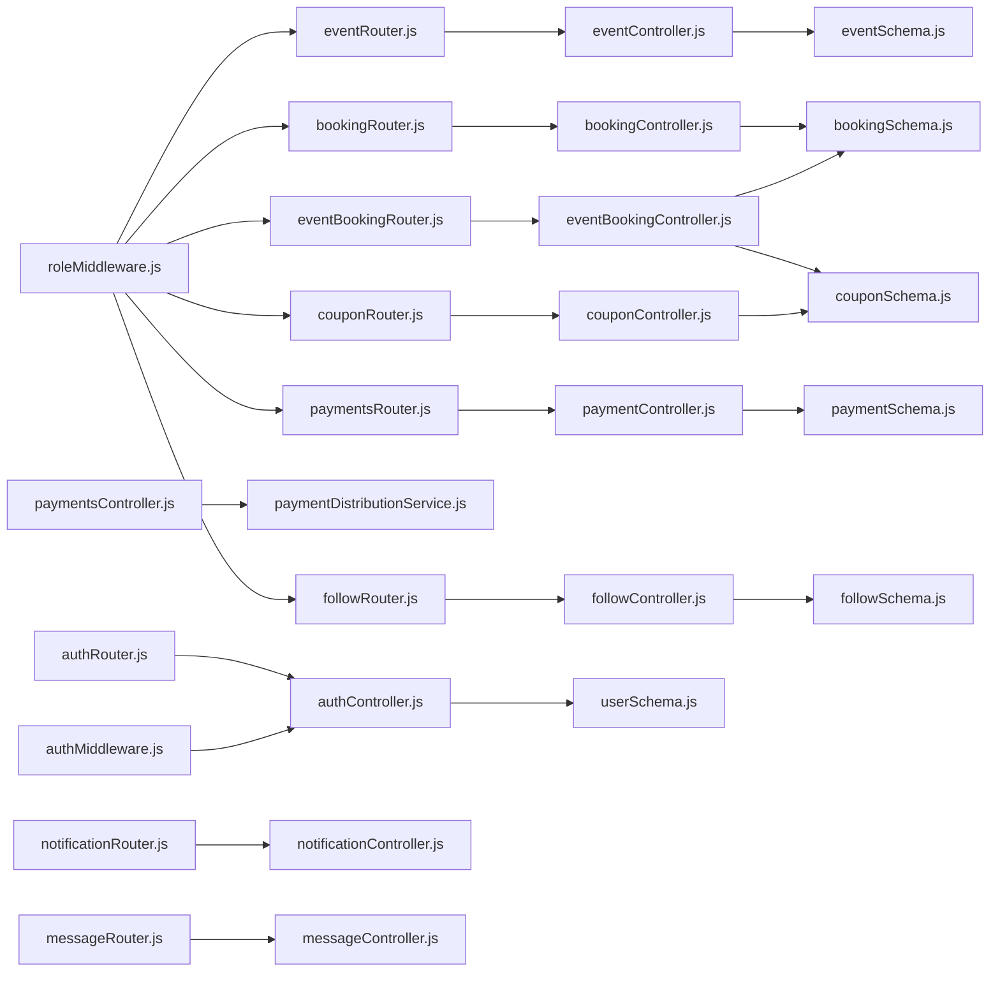

# API Reference

<cite>
**Referenced Files in This Document**
- [app.js](file://backend/app.js)
- [server.js](file://backend/server.js)
- [package.json](file://backend/package.json)
- [authRouter.js](file://backend/router/authRouter.js)
- [authController.js](file://backend/controller/authController.js)
- [authMiddleware.js](file://backend/middleware/authMiddleware.js)
- [userSchema.js](file://backend/models/userSchema.js)
- [eventRouter.js](file://backend/router/eventRouter.js)
- [eventController.js](file://backend/controller/eventController.js)
- [eventSchema.js](file://backend/models/eventSchema.js)
- [bookingRouter.js](file://backend/router/bookingRouter.js)
- [bookingController.js](file://backend/controller/bookingController.js)
- [bookingSchema.js](file://backend/models/bookingSchema.js)
- [eventBookingRouter.js](file://backend/router/eventBookingRouter.js)
- [eventBookingController.js](file://backend/controller/eventBookingController.js)
- [paymentController.js](file://backend/controller/paymentController.js)
- [paymentsController.js](file://backend/controller/paymentsController.js)
- [paymentDistributionService.js](file://backend/services/paymentDistributionService.js)
- [paymentSchema.js](file://backend/models/paymentSchema.js)
- [couponRouter.js](file://backend/router/couponRouter.js)
- [couponController.js](file://backend/controller/couponController.js)
- [couponSchema.js](file://backend/models/couponSchema.js)
- [reviewRouter.js](file://backend/router/reviewRouter.js)
- [reviewController.js](file://backend/controller/reviewController.js)
- [ratingRouter.js](file://backend/router/ratingRouter.js)
- [ratingController.js](file://backend/controller/ratingController.js)
- [followRouter.js](file://backend/router/followRouter.js)
- [followController.js](file://backend/controller/followController.js)
- [followSchema.js](file://backend/models/followSchema.js)
- [notificationRouter.js](file://backend/router/notificationRouter.js)
- [messageRouter.js](file://backend/router/messageRouter.js)
- [messageController.js](file://backend/controller/messageController.js)
- [adminRouter.js](file://backend/router/adminRouter.js)
- [adminController.js](file://backend/controller/adminController.js)
- [merchantRouter.js](file://backend/router/merchantRouter.js)
- [merchantController.js](file://backend/controller/merchantController.js)
- [serviceRouter.js](file://backend/router/serviceRouter.js)
- [serviceController.js](file://backend/controller/serviceController.js)
- [serviceSchema.js](file://backend/models/serviceSchema.js)
</cite>

## Update Summary
**Changes Made**
- Added comprehensive Coupon Management API documentation with all CRUD operations and validation rules
- Integrated enhanced Booking System API with new event-specific booking endpoints and workflows
- Added Social Features API documentation covering follow/unfollow, notifications, and messaging
- Documented Payment Distribution Services with commission calculation and refund processing
- Updated Payment API with Razorpay integration and manual payment processing
- Enhanced Booking Workflow with full-service and ticketed event handling

## Table of Contents
1. [Introduction](#introduction)
2. [Project Structure](#project-structure)
3. [Core Components](#core-components)
4. [Architecture Overview](#architecture-overview)
5. [Detailed Component Analysis](#detailed-component-analysis)
6. [Dependency Analysis](#dependency-analysis)
7. [Performance Considerations](#performance-considerations)
8. [Troubleshooting Guide](#troubleshooting-guide)
9. [Conclusion](#conclusion)
10. [Appendices](#appendices)

## Introduction
This document provides comprehensive API documentation for the MERN Stack Event Management Platform. It covers all endpoint groups, HTTP methods, URL patterns, request/response schemas, authentication requirements, and error responses. It also documents API versioning, rate limiting, integration patterns, and client implementation guidelines.

## Project Structure
The backend exposes REST endpoints under the base path /api/v1. Each functional area is mounted under a dedicated route group. Authentication is enforced via a Bearer token JWT strategy.

```mermaid
graph TB
A["Express App<br/>app.js"] --> B["CORS Middleware"]
A --> C["JSON Parser"]
A --> D["/api/v1/auth"]
A --> E["/api/v1/events"]
A --> F["/api/v1/bookings"]
A --> G["/api/v1/event-bookings"]
A --> H["/api/v1/services"]
A --> I["/api/v1/payments"]
A --> J["/api/v1/reviews"]
A --> K["/api/v1/ratings"]
A --> L["/api/v1/notifications"]
A --> M["/api/v1/coupons"]
A --> N["/api/v1/follow"]
A --> O["/api/v1/messages"]
A --> P["/api/v1/admin"]
A --> Q["/api/v1/merchant"]
A --> R["Health & Config Checks"]
```

**Diagram sources**
- [app.js:35-62](file://backend/app.js#L35-L62)

**Section sources**
- [app.js:24-47](file://backend/app.js#L24-L47)
- [server.js:1-6](file://backend/server.js#L1-L6)
- [package.json:1-30](file://backend/package.json#L1-L30)

## Core Components
- API Versioning: All routes are prefixed with /api/v1.
- Authentication: JWT via Authorization: Bearer <token>.
- Roles: user, merchant, admin. Role guards apply per endpoint.
- CORS: Enabled for configured frontend origin with credentials support.
- Rate Limiting: Not implemented in the current codebase; see Troubleshooting Guide for recommendations.

**Section sources**
- [app.js:24-30](file://backend/app.js#L24-L30)
- [authMiddleware.js:1-17](file://backend/middleware/authMiddleware.js#L1-L17)
- [userSchema.js:39-44](file://backend/models/userSchema.js#L39-L44)

## Architecture Overview
High-level API flow: client → Express app → router → controller → model(s) → MongoDB.

**Diagram sources**
- [app.js:35-47](file://backend/app.js#L35-L47)
- [authRouter.js:1-12](file://backend/router/authRouter.js#L1-L12)
- [authController.js:11-120](file://backend/controller/authController.js#L11-L120)

## Detailed Component Analysis

### Authentication API
- Base Path: /api/v1/auth
- Methods and Endpoints:
  - POST /register
    - Description: Registers a new user.
    - Auth: None
    - Request Body: name, email, password, role (optional; defaults to user)
    - Responses:
      - 201: success, message, token, user
      - 400: validation error
      - 409: user exists
      - 500: unknown error
  - POST /login
    - Description: Logs in an existing user.
    - Auth: None
    - Request Body: email, password
    - Responses:
      - 200: success, message, token, user
      - 400: missing fields
      - 401: invalid credentials
      - 500: server error
  - GET /me
    - Description: Fetches currently authenticated user profile.
    - Auth: Required (Bearer)
    - Responses:
      - 200: success, user
      - 404: user not found
      - 401: unauthorized
      - 500: unknown error

- Validation Rules:
  - Name: required, min length 3
  - Email: required, unique, valid format
  - Password: required, min length 6
  - Role: enum ["user", "admin", "merchant"]

- Example Requests/Responses:
  - POST /api/v1/auth/register
    - Request: {"name":"Alex","email":"alex@example.com","password":"pass123","role":"user"}
    - Response: {"success":true,"message":"Registration successful","token":"<jwt>","user":{"id":"...","name":"Alex","email":"alex@example.com","role":"user"}}
  - POST /api/v1/auth/login
    - Request: {"email":"alex@example.com","password":"pass123"}
    - Response: {"success":true,"message":"Login successful","token":"<jwt>","user":{"id":"...","name":"Alex","email":"alex@example.com","role":"user"}}

**Section sources**
- [authRouter.js:7-9](file://backend/router/authRouter.js#L7-L9)
- [authController.js:11-120](file://backend/controller/authController.js#L11-L120)
- [authMiddleware.js:1-17](file://backend/middleware/authMiddleware.js#L1-L17)
- [userSchema.js:6-50](file://backend/models/userSchema.js#L6-L50)

### User Management API
- Base Path: /api/v1/auth
- Methods and Endpoints:
  - GET /me
    - Description: See Authentication API section.

- Notes:
  - Additional user CRUD endpoints are not present in the current codebase. Use /auth/me for profile retrieval.

**Section sources**
- [authRouter.js:9](file://backend/router/authRouter.js#L9)
- [authController.js:109-119](file://backend/controller/authController.js#L109-L119)

### Event Management API
- Base Path: /api/v1/events
- Methods and Endpoints:
  - GET /
    - Description: Lists all events.
    - Auth: None
    - Responses:
      - 200: success, events[]
      - 500: unknown error
  - POST /:id/register
    - Description: Registers the authenticated user for an event.
    - Auth: Required (Bearer, role=user)
    - Path Params: id (Event ID)
    - Responses:
      - 201: success, message
      - 404: event not found
      - 409: already registered
      - 500: unknown error
  - GET /me
    - Description: Lists the authenticated user's event registrations.
    - Auth: Required (Bearer, role=user)
    - Responses:
      - 200: success, registrations[]
      - 500: unknown error

- Validation Rules:
  - Event fields: title required; images array requires public_id and url; rating 0–5

- Example Requests/Responses:
  - POST /api/v1/events/673421342134213421342134/register
    - Response: {"success":true,"message":"Registered successfully"}

**Section sources**
- [eventRouter.js:8-10](file://backend/router/eventRouter.js#L8-L10)
- [eventController.js:4-34](file://backend/controller/eventController.js#L4-L34)
- [eventSchema.js:5-20](file://backend/models/eventSchema.js#L5-L20)

### Enhanced Booking System API
- Base Path: /api/v1/event-bookings
- Methods and Endpoints:
  - POST /create
    - Description: Creates a new booking routed to appropriate handler based on event type.
    - Auth: Required (Bearer)
    - Request Body: eventId*, quantity, serviceDate, notes, guestCount, couponCode
    - Responses:
      - 201: success, message, booking
      - 400: invalid event type or missing fields
      - 404: event not found
      - 500: failed to create booking
  - POST /full-service
    - Description: Creates booking for full-service events requiring merchant approval.
    - Auth: Required (Bearer)
    - Request Body: eventId*, serviceDate*, notes, guestCount, couponCode
    - Responses:
      - 201: success, message, booking
      - 400: validation errors
      - 404: event/user not found
      - 500: failed to create booking
  - POST /ticketed
    - Description: Creates booking for ticketed events with immediate confirmation.
    - Auth: Required (Bearer)
    - Request Body: eventId*, ticketType*, quantity*, paymentMethod, couponCode
    - Responses:
      - 201: success, message, booking, ticketDetails
      - 400: validation errors or sold out
      - 404: event/user not found
      - 500: failed to create booking
  - GET /event/:eventId/tickets
    - Description: Gets available ticket types for an event.
    - Auth: Required (Bearer)
    - Path Params: eventId
    - Responses:
      - 200: success, ticketTypes[], eventDetails
      - 400: not ticketed event
      - 404: event not found
      - 500: failed to fetch ticket types
  - GET /my-bookings
    - Description: Gets all bookings for authenticated user.
    - Auth: Required (Bearer)
    - Responses:
      - 200: success, bookings[]
      - 500: failed to fetch bookings
  - GET /user/:userId
    - Description: Gets bookings for specific user (admin/merchant).
    - Auth: Required (Bearer, role=admin|merchant)
    - Path Params: userId
    - Responses:
      - 200: success, bookings[]
      - 403: unauthorized
      - 500: failed to fetch bookings
  - PUT /:bookingId/pay
    - Description: Processes payment for a booking.
    - Auth: Required (Bearer)
    - Path Params: bookingId
    - Request Body: paymentMethod*, paymentAmount
    - Responses:
      - 200: success, message, payment, distribution, paymentDetails
      - 400: invalid status or amount
      - 403: unauthorized
      - 404: booking not found
      - 500: payment processing failed
  - POST /:bookingId/rating
    - Description: Adds rating to completed booking.
    - Auth: Required (Bearer)
    - Path Params: bookingId
    - Request Body: rating*, comment
    - Responses:
      - 200: success, message, rating
      - 400: validation errors
      - 404: booking not found
      - 500: failed to add rating

- Merchant Endpoints:
  - GET /service-requests
    - Description: Gets all full-service booking requests for merchant.
    - Auth: Required (Bearer, role=merchant)
    - Responses:
      - 200: success, bookings[]
      - 500: failed to fetch requests
  - GET /merchant/bookings
    - Description: Gets all bookings for merchant's events.
    - Auth: Required (Bearer, role=merchant)
    - Responses:
      - 200: success, bookings[]
      - 500: failed to fetch bookings
  - PUT /:id/accept
    - Description: Accepts a full-service booking request.
    - Auth: Required (Bearer, role=merchant)
    - Path Params: id
    - Responses:
      - 200: success, message, booking
      - 400: not full-service or invalid status
      - 403: unauthorized
      - 500: failed to accept
  - PUT /:id/reject
    - Description: Rejects a full-service booking request.
    - Auth: Required (Bearer, role=merchant)
    - Path Params: id
    - Request Body: reason
    - Responses:
      - 200: success, message, booking
      - 400: not full-service
      - 403: unauthorized
      - 500: failed to reject
  - PUT /:id/complete
    - Description: Marks a booking as completed.
    - Auth: Required (Bearer, role=merchant)
    - Path Params: id
    - Responses:
      - 200: success, message, booking
      - 400: invalid status
      - 403: unauthorized
      - 500: failed to complete
  - PUT /:bookingId/approve
    - Description: Approves a full-service booking (merchant).
    - Auth: Required (Bearer, role=merchant)
    - Path Params: bookingId
    - Responses:
      - 200: success, message, booking
      - 400: not full-service
      - 403: unauthorized
      - 500: failed to approve
  - PUT /:bookingId/reject
    - Description: Rejects a full-service booking (merchant).
    - Auth: Required (Bearer, role=merchant)
    - Path Params: bookingId
    - Request Body: reason
    - Responses:
      - 200: success, message, booking
      - 400: not full-service
      - 403: unauthorized
      - 500: failed to reject
  - PUT /:bookingId/status
    - Description: Updates booking status (admin).
    - Auth: Required (Bearer, role=admin)
    - Path Params: bookingId
    - Request Body: status*
    - Responses:
      - 200: success, message, booking
      - 400: invalid status
      - 404: booking not found
      - 500: failed to update

- Validation Rules:
  - Full-service: serviceDate required, guestCount default 1
  - Ticketed: quantity > 0, ticketType must exist, paymentMethod default Cash
  - Coupon: optional, applies to both booking types
  - Status enums: ["pending","confirmed","cancelled","completed","approved"]

- Example Requests/Responses:
  - POST /api/v1/event-bookings/full-service
    - Request: {"eventId":"evt1","serviceDate":"2025-12-25T00:00:00Z","notes":"Please arrive early","guestCount":4,"couponCode":"SAVE10"}
    - Response: {"success":true,"message":"Service booking request sent to merchant","booking":{...}}
  - POST /api/v1/event-bookings/ticketed
    - Request: {"eventId":"evt2","ticketType":"VIP","quantity":2,"paymentMethod":"Card","couponCode":"SAVE20"}
    - Response: {"success":true,"message":"Ticket booking created successfully. Please complete payment.","booking":{...},"ticketDetails":{...}}

**Section sources**
- [eventBookingRouter.js:27-47](file://backend/router/eventBookingRouter.js#L27-L47)
- [eventBookingController.js:7-800](file://backend/controller/eventBookingController.js#L7-L800)

### Booking System API
- Base Path: /api/v1/bookings
- Methods and Endpoints:
  - POST /
    - Description: Creates a new booking for a service.
    - Auth: Required (Bearer)
    - Request Body: serviceId*, serviceTitle*, serviceCategory*, servicePrice*, eventDate, notes, guestCount
    - Responses:
      - 201: success, message, booking
      - 400: missing required fields
      - 409: active booking exists for service
      - 500: failed to create booking
  - GET /my-bookings
    - Description: Retrieves all bookings for the authenticated user.
    - Auth: Required (Bearer)
    - Responses:
      - 200: success, bookings[]
      - 500: failed to fetch bookings
  - GET /:id
    - Description: Retrieves a booking by ID owned by the authenticated user.
    - Auth: Required (Bearer)
    - Path Params: id
    - Responses:
      - 200: success, booking
      - 404: booking not found
      - 500: failed to fetch booking
  - PUT /:id/cancel
    - Description: Cancels an existing booking (if eligible).
    - Auth: Required (Bearer)
    - Path Params: id
    - Responses:
      - 200: success, message, booking
      - 400: already cancelled or completed
      - 404: booking not found
      - 500: failed to cancel booking
  - GET /admin/all
    - Description: Lists all bookings (admin only).
    - Auth: Required (Bearer, role=admin)
    - Responses:
      - 200: success, bookings[]
      - 500: failed to fetch bookings
  - PUT /admin/:id/status
    - Description: Updates booking status (admin only).
    - Auth: Required (Bearer, role=admin)
    - Path Params: id
    - Request Body: status (enum: pending, confirmed, cancelled, completed)
    - Responses:
      - 200: success, message, booking
      - 400: invalid status
      - 404: booking not found
      - 500: failed to update booking

- Validation Rules:
  - Status enum: ["pending","confirmed","cancelled","completed"]
  - Guest count default: 1
  - Total price computed as servicePrice * guestCount

- Example Requests/Responses:
  - POST /api/v1/bookings/
    - Request: {"serviceId":"svc1","serviceTitle":"Service A","serviceCategory":"Category X","servicePrice":100,"eventDate":"2025-12-25T00:00:00Z","notes":"Please arrive early","guestCount":4}
    - Response: {"success":true,"message":"Booking created successfully","booking":{...}}

**Section sources**
- [bookingRouter.js:15-23](file://backend/router/bookingRouter.js#L15-L23)
- [bookingController.js:4-232](file://backend/controller/bookingController.js#L4-L232)
- [bookingSchema.js:5-50](file://backend/models/bookingSchema.js#L5-L50)

### Merchant Operations API
- Base Path: /api/v1/merchant
- Available Endpoints:
  - No explicit merchant endpoints are defined in the current codebase. Integrate merchant-specific routes by adding handlers to the merchant router and controllers.

- Notes:
  - Merchant dashboards and related features are present in the frontend; backend endpoints are not implemented yet.

**Section sources**
- [merchantRouter.js](file://backend/router/merchantRouter.js)

### Admin Functions API
- Base Path: /api/v1/admin
- Available Endpoints:
  - No explicit admin endpoints are defined in the current codebase. Integrate admin-specific routes by adding handlers to the admin router and controllers.

- Notes:
  - Admin dashboards and analytics are present in the frontend; backend endpoints are not implemented yet.

**Section sources**
- [adminRouter.js](file://backend/router/adminRouter.js)

### Service Management API
- Base Path: /api/v1/services
- Methods and Endpoints:
  - GET / (placeholder)
  - POST / (placeholder)
  - PUT /:id (placeholder)
  - DELETE /:id (placeholder)

- Notes:
  - Service endpoints are placeholders. Implement handlers in serviceRouter.js and serviceController.js.

**Section sources**
- [serviceRouter.js](file://backend/router/serviceRouter.js)

### Payments API
- Base Path: /api/v1/payments
- Methods and Endpoints:
  - POST /order
    - Description: Creates a Razorpay order for payment processing.
    - Auth: Required (Bearer)
    - Request Body: amount*, currency, receipt
    - Responses:
      - 200: success, order details or simulated order
      - 400: invalid amount
      - 500: payment gateway error
  - POST /verify
    - Description: Verifies Razorpay payment signature.
    - Auth: Required (Bearer)
    - Request Body: order_id*, payment_id*, signature*
    - Responses:
      - 200: success, verified
      - 400: invalid signature
      - 500: verification failed
  - POST /service/:bookingId
    - Description: Processes payment for service booking.
    - Auth: Required (Bearer)
    - Path Params: bookingId
    - Request Body: paymentMethod*, paymentAmount*
    - Responses:
      - 200: success, message, paymentId, booking
      - 400: validation errors
      - 403: unauthorized
      - 404: booking not found
      - 500: payment processing failed
  - POST /ticket/:bookingId
    - Description: Processes payment for ticket booking.
    - Auth: Required (Bearer)
    - Path Params: bookingId
    - Request Body: paymentMethod*, paymentAmount*
    - Responses:
      - 200: success, message, paymentDetails, booking
      - 400: validation errors
      - 403: unauthorized
      - 404: booking not found
      - 500: payment processing failed

- Payment Distribution Service:
  - Automatic commission calculation (5% admin commission)
  - Merchant wallet updates upon successful payment
  - Refund processing with commission reversal
  - Payment statistics aggregation

- Validation Rules:
  - Amount must be positive number
  - Payment amount must match booking total
  - Booking must be in correct status for payment

- Example Requests/Responses:
  - POST /api/v1/payments/order
    - Request: {"amount":1000,"currency":"INR","receipt":"rcpt_001"}
    - Response: {"success":true,"order":{"id":"order_001","amount":1000,"status":"created"},"key":"rzp_test_key"}

**Section sources**
- [paymentsController.js:8-281](file://backend/controller/paymentsController.js#L8-L281)
- [paymentController.js:11-577](file://backend/controller/paymentController.js#L11-L577)
- [paymentDistributionService.js:16-340](file://backend/services/paymentDistributionService.js#L16-L340)

### Reviews and Ratings API
- Base Path: /api/v1/reviews
- Methods and Endpoints:
  - GET / (placeholder)
  - POST / (placeholder)
  - PUT /:id (placeholder)
  - DELETE /:id (placeholder)

- Base Path: /api/v1/ratings
- Methods and Endpoints:
  - GET / (placeholder)
  - POST / (placeholder)
  - PUT /:id (placeholder)
  - DELETE /:id (placeholder)

- Notes:
  - Review and rating endpoints are placeholders. Implement handlers in reviewRouter.js/reviewController.js and ratingRouter.js/ratingController.js.

**Section sources**
- [reviewRouter.js](file://backend/router/reviewRouter.js)
- [ratingRouter.js](file://backend/router/ratingRouter.js)

### Coupons API
- Base Path: /api/v1/coupons
- Methods and Endpoints:
  - POST /validate
    - Description: Validates a coupon without applying it.
    - Auth: Required (Bearer)
    - Request Body: couponCode*, amount*, eventId
    - Responses:
      - 200: success, message, coupon details
      - 400: validation errors or usage limits
      - 404: invalid coupon code
      - 500: validation failed
  - POST /apply
    - Description: Applies a coupon and calculates discount.
    - Auth: Required (Bearer)
    - Request Body: code*, totalAmount*, eventId
    - Responses:
      - 200: success, message, coupon, originalAmount, discountAmount, finalAmount, savings
      - 400: validation errors or usage limits
      - 404: invalid coupon code
      - 500: application failed
  - POST /remove
    - Description: Removes applied coupon (resets to original amount).
    - Auth: Required (Bearer)
    - Request Body: totalAmount*
    - Responses:
      - 200: success, message, originalAmount, discountAmount, finalAmount, savings
      - 500: removal failed
  - GET /available
    - Description: Gets available coupons for user.
    - Auth: Required (Bearer)
    - Query Params: eventId, totalAmount
    - Responses:
      - 200: success, coupons[], total
      - 401: authentication required
      - 500: failed to fetch coupons
  - POST /create
    - Description: Creates new coupon (admin only).
    - Auth: Required (Bearer, role=admin)
    - Request Body: code*, discountType*, discountValue*, maxDiscount, minAmount, expiryDate*, usageLimit*, description, applicableEvents, applicableCategories, applicableUsers
    - Responses:
      - 201: success, message, coupon
      - 400: validation errors
      - 500: creation failed
  - GET /all
    - Description: Gets all coupons with filtering (admin only).
    - Auth: Required (Bearer, role=admin)
    - Query Params: page, limit, status, search
    - Responses:
      - 200: success, coupons[], pagination
      - 500: failed to fetch coupons
  - PUT /:couponId
    - Description: Updates coupon (admin only).
    - Auth: Required (Bearer, role=admin)
    - Path Params: couponId
    - Request Body: update data
    - Responses:
      - 200: success, message, coupon
      - 400: cannot update code of used coupon
      - 404: coupon not found
      - 500: update failed
  - DELETE /:couponId
    - Description: Deletes coupon (admin only).
    - Auth: Required (Bearer, role=admin)
    - Path Params: couponId
    - Responses:
      - 200: success, message
      - 400: cannot delete used coupon
      - 404: coupon not found
      - 500: deletion failed
  - PATCH /:couponId/toggle
    - Description: Toggles coupon active status (admin only).
    - Auth: Required (Bearer, role=admin)
    - Path Params: couponId
    - Responses:
      - 200: success, message, coupon
      - 404: coupon not found
      - 500: toggle failed
  - GET /stats
    - Description: Gets coupon usage statistics (admin only).
    - Auth: Required (Bearer, role=admin)
    - Responses:
      - 200: success, stats
      - 500: failed to fetch stats

- Coupon Schema Validation:
  - Code: required, unique, uppercase, 3-20 chars
  - Discount Type: enum ["percentage","flat"], required
  - Discount Value: number, min 0
  - Max Discount: number, min 0 (only for percentage)
  - Min Amount: number, min 0, default 0
  - Expiry Date: required, future date
  - Usage Limit: number, min 1, default 1
  - Active Status: boolean, default true
  - Usage History: array with user, booking, usedAt, discountAmount

- Usage Rules:
  - Percentage discounts: 1-100%
  - Flat discounts: > 0
  - Maximum discount cap for percentage
  - Individual user usage limit
  - Event and category restrictions
  - Minimum order amount requirement

- Example Requests/Responses:
  - POST /api/v1/coupons/validate
    - Request: {"couponCode":"SAVE10","amount":1000,"eventId":"evt1"}
    - Response: {"success":true,"message":"Coupon is valid","coupon":{"code":"SAVE10","discountType":"percentage","discountValue":10,"maxDiscount":500}}

**Section sources**
- [couponRouter.js:22-33](file://backend/router/couponRouter.js#L22-L33)
- [couponController.js:6-757](file://backend/controller/couponController.js#L6-L757)
- [couponSchema.js:3-123](file://backend/models/couponSchema.js#L3-L123)

### Social Features API
- Base Path: /api/v1/follow
- Methods and Endpoints:
  - POST /follow/:merchantId
    - Description: Follows a merchant.
    - Auth: Required (Bearer)
    - Path Params: merchantId
    - Responses:
      - 200: success, message, isFollowing: true
      - 400: self-follow or invalid merchant
      - 404: user/merchant not found
      - 500: follow failed
  - DELETE /unfollow/:merchantId
    - Description: Unfollows a merchant.
    - Auth: Required (Bearer)
    - Path Params: merchantId
    - Responses:
      - 200: success, message, isFollowing: false
      - 400: not following
      - 404: user not found
      - 500: unfollow failed
  - GET /status/:merchantId
    - Description: Checks follow status.
    - Auth: Required (Bearer)
    - Path Params: merchantId
    - Responses:
      - 200: success, isFollowing
      - 404: user not found
      - 500: status check failed
  - GET /following
    - Description: Gets user's following merchants.
    - Auth: Required (Bearer)
    - Responses:
      - 200: success, followingMerchants[]
      - 500: failed to fetch
  - GET /followers
    - Description: Gets merchant's followers.
    - Auth: Required (Bearer)
    - Responses:
      - 200: success, followers[], followerCount
      - 500: failed to fetch

- Base Path: /api/v1/notifications
- Methods and Endpoints:
  - GET /
    - Description: Gets user's notifications.
    - Auth: Required (Bearer)
    - Responses:
      - 200: success, notifications[]
      - 500: server error
  - PATCH /:id/read
    - Description: Marks notification as read.
    - Auth: Required (Bearer)
    - Path Params: id
    - Responses:
      - 200: success, notification
      - 404: not found
      - 500: server error
  - DELETE /:id
    - Description: Deletes notification.
    - Auth: Required (Bearer)
    - Path Params: id
    - Responses:
      - 200: success, message
      - 500: server error

- Base Path: /api/v1/messages
- Methods and Endpoints:
  - POST /send
    - Description: Sends contact message.
    - Auth: None
    - Request Body: name*, email*, subject*, message*
    - Responses:
      - 200: success, message
      - 400: validation errors
      - 500: send failed

- Social Schema:
  - Follow: user, merchant relationship with unique constraint
  - Notification: user, message, type, read status
  - Message: name, email, subject, message

- Example Requests/Responses:
  - POST /api/v1/follow/follow/:merchantId
    - Response: {"success":true,"message":"Successfully followed merchant","isFollowing":true}

**Section sources**
- [followRouter.js:14-24](file://backend/router/followRouter.js#L14-L24)
- [followController.js:4-234](file://backend/controller/followController.js#L4-L234)
- [notificationRouter.js:8-42](file://backend/router/notificationRouter.js#L8-L42)
- [messageRouter.js:6](file://backend/router/messageRouter.js#L6)
- [messageController.js:3-44](file://backend/controller/messageController.js#L3-L44)
- [followSchema.js:3-22](file://backend/models/followSchema.js#L3-L22)

## Dependency Analysis
- Router-to-Controller coupling: Each router delegates to a single controller module.
- Controller-to-Model coupling: Controllers operate on Mongoose models.
- Middleware: authMiddleware enforces JWT; roleMiddleware restricts endpoints by role.
- External integrations: Cloudinary configuration exposed via a health endpoint.
- Payment services: paymentDistributionService handles commission calculations and refunds.

**Diagram sources**
- [authRouter.js:1-12](file://backend/router/authRouter.js#L1-L12)
- [authController.js:11-120](file://backend/controller/authController.js#L11-L120)
- [eventRouter.js:1-13](file://backend/router/eventRouter.js#L1-L13)
- [eventController.js:1-35](file://backend/controller/eventController.js#L1-L35)
- [bookingRouter.js:1-26](file://backend/router/bookingRouter.js#L1-L26)
- [bookingController.js:1-233](file://backend/controller/bookingController.js#L1-L233)
- [eventBookingRouter.js:20-47](file://backend/router/eventBookingRouter.js#L20-L47)
- [eventBookingController.js:1-800](file://backend/controller/eventBookingController.js#L1-L800)
- [paymentsController.js:1-281](file://backend/controller/paymentsController.js#L1-L281)
- [paymentController.js:1-577](file://backend/controller/paymentController.js#L1-L577)
- [paymentDistributionService.js:1-340](file://backend/services/paymentDistributionService.js#L1-L340)
- [couponRouter.js:1-37](file://backend/router/couponRouter.js#L1-L37)
- [couponController.js:1-757](file://backend/controller/couponController.js#L1-L757)
- [followRouter.js:1-26](file://backend/router/followRouter.js#L1-L26)
- [followController.js:1-234](file://backend/controller/followController.js#L1-L234)
- [notificationRouter.js:1-45](file://backend/router/notificationRouter.js#L1-L45)
- [messageRouter.js:1-9](file://backend/router/messageRouter.js#L1-L9)
- [messageController.js:1-44](file://backend/controller/messageController.js#L1-L44)
- [authMiddleware.js:1-17](file://backend/middleware/authMiddleware.js#L1-L17)
- [userSchema.js:1-55](file://backend/models/userSchema.js#L1-L55)
- [eventSchema.js:1-23](file://backend/models/eventSchema.js#L1-L23)
- [bookingSchema.js:1-53](file://backend/models/bookingSchema.js#L1-L53)
- [couponSchema.js:1-123](file://backend/models/couponSchema.js#L1-L123)
- [followSchema.js:1-22](file://backend/models/followSchema.js#L1-L22)

**Section sources**
- [app.js:4-18](file://backend/app.js#L4-L18)

## Performance Considerations
- Indexing: Add database indexes on frequently queried fields (e.g., Booking.user, Booking.serviceId, User.email, Coupon.code).
- Pagination: Implement pagination for listing endpoints (events, bookings, reviews, coupons).
- Caching: Cache static assets and infrequently changing data (e.g., event categories).
- Connection pooling: Ensure MongoDB connection pool settings are tuned for production load.
- Payload sizes: Avoid returning large nested documents; use selective population and projections.
- Payment processing: Implement async payment processing to avoid blocking requests.
- Coupon validation: Cache frequently used coupons to reduce database queries.

## Troubleshooting Guide
- Health Check: GET /api/v1/health returns {"status":"ok"}.
- Config Check: GET /api/v1/config-check reports Cloudinary configuration status.
- CORS Issues: Verify FRONTEND_URL in environment variables matches the origin sending requests.
- Rate Limiting: Not implemented; consider adding a rate limiter middleware to protect endpoints.
- JWT Errors: Ensure JWT_SECRET is set and consistent across deployments; verify token format Authorization: Bearer <token>.
- Payment Gateway: Check RAZORPAY_KEY_ID and RAZORPAY_KEY_SECRET environment variables for payment processing.
- Coupon Validation: Verify coupon codes are uppercase and not expired; check usage limits and minimum amounts.

**Section sources**
- [app.js:49-62](file://backend/app.js#L49-L62)
- [authMiddleware.js:1-17](file://backend/middleware/authMiddleware.js#L1-L17)

## Conclusion
This API reference documents the current state of the backend, focusing on authentication, events, enhanced booking workflows, coupons, social features, and payment distribution services. The platform now supports comprehensive event management with full-service and ticketed event types, automated coupon validation and application, social interaction capabilities, and robust payment processing with commission distribution. Follow the provided patterns to integrate new endpoints securely and consistently.

## Appendices

### API Versioning
- All endpoints are prefixed with /api/v1.

**Section sources**
- [app.js:35-47](file://backend/app.js#L35-L47)

### Authentication and Authorization
- JWT Bearer tokens are required for protected endpoints.
- Role-based access control applies to specific routes.
- Admin access required for coupon management and payment statistics.
- Merchant access required for booking approvals and merchant-specific endpoints.

**Section sources**
- [authMiddleware.js:1-17](file://backend/middleware/authMiddleware.js#L1-L17)
- [userSchema.js:39-44](file://backend/models/userSchema.js#L39-L44)

### Client Implementation Guidelines
- Set Authorization header to Bearer <token> for authenticated requests.
- Use HTTPS in production.
- Handle 401 Unauthorized by prompting re-login.
- Implement retry with exponential backoff for transient 5xx errors.
- Validate response shapes against documented schemas.
- For payment processing, handle both manual and Razorpay integration flows.
- Implement coupon validation before payment processing.
- Use appropriate booking types (full-service vs ticketed) based on event requirements.

### Common Usage Scenarios
- New user registration and login
- Browse events and register for an event
- Create a booking for a service with coupon validation
- Follow/unfollow merchants and manage social interactions
- Process payments with automatic commission distribution
- Admin manages coupons and views payment statistics
- Merchant handles booking requests and manages event bookings