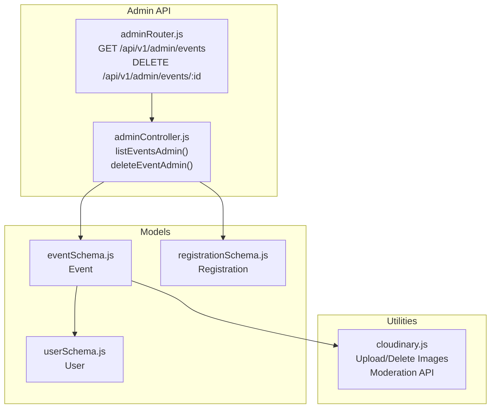
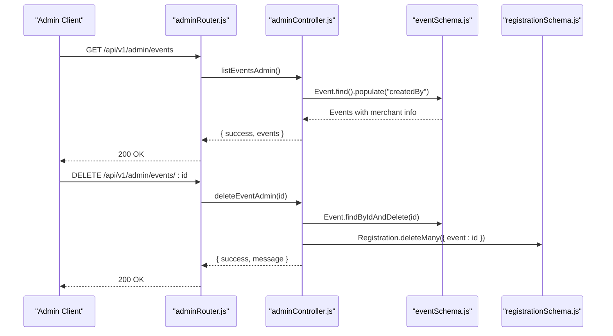
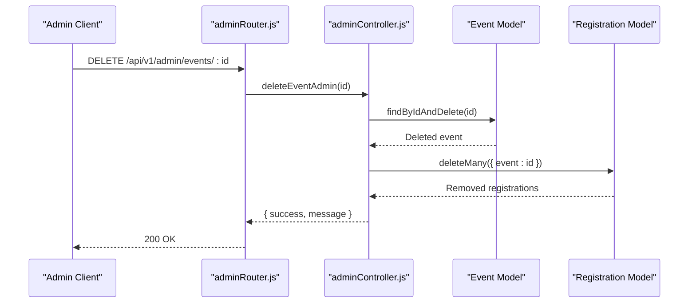
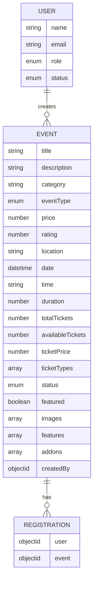
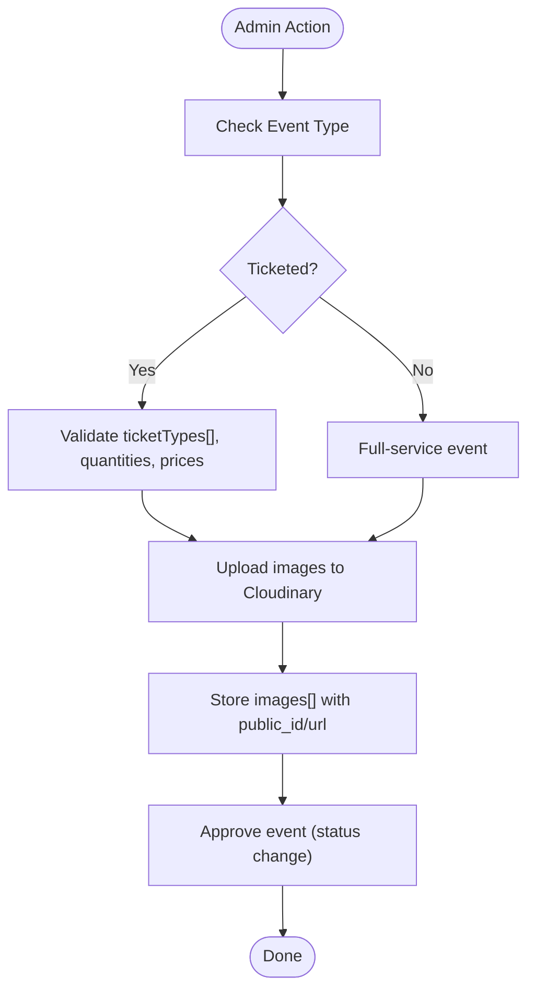
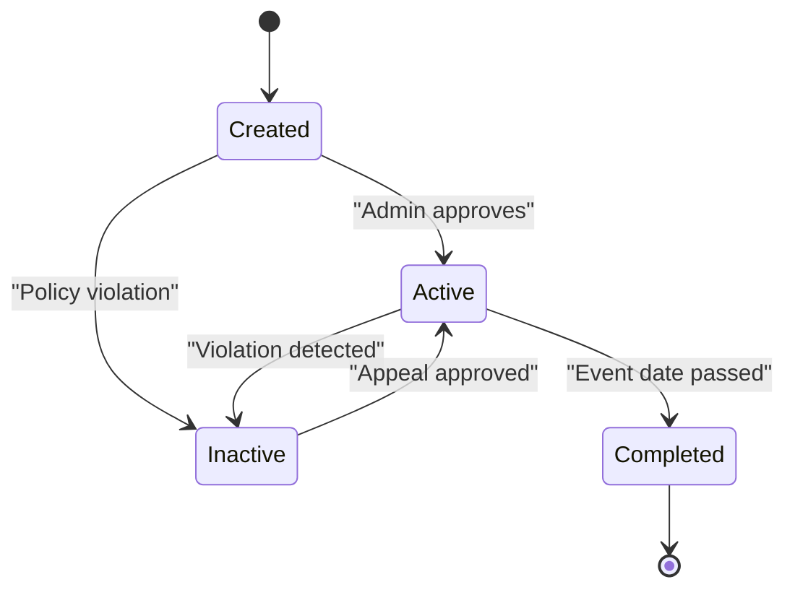
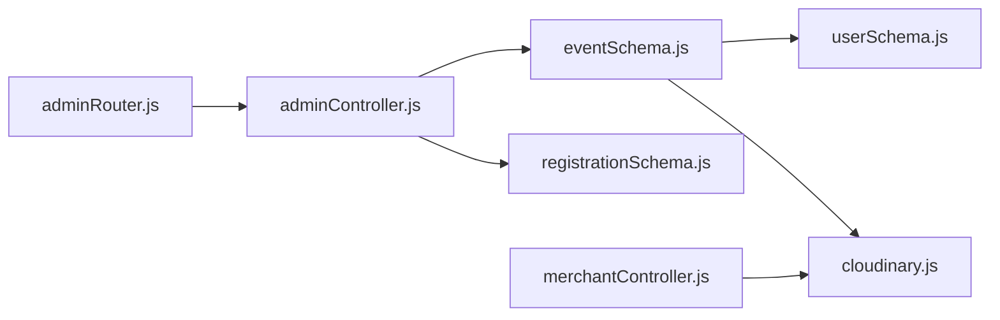

# Admin Event Management API

<cite>
**Referenced Files in This Document**
- [adminController.js](file://backend/controller/adminController.js)
- [adminRouter.js](file://backend/router/adminRouter.js)
- [eventSchema.js](file://backend/models/eventSchema.js)
- [userSchema.js](file://backend/models/userSchema.js)
- [registrationSchema.js](file://backend/models/registrationSchema.js)
- [cloudinary.js](file://backend/util/cloudinary.js)
- [merchantController.js](file://backend/controller/merchantController.js)
- [eventBookingController.js](file://backend/controller/eventBookingController.js)
</cite>

## Table of Contents
1. [Introduction](#introduction)
2. [Project Structure](#project-structure)
3. [Core Components](#core-components)
4. [Architecture Overview](#architecture-overview)
5. [Detailed Component Analysis](#detailed-component-analysis)
6. [Dependency Analysis](#dependency-analysis)
7. [Performance Considerations](#performance-considerations)
8. [Troubleshooting Guide](#troubleshooting-guide)
9. [Conclusion](#conclusion)

## Introduction
This document describes the Admin Event Management API, focusing on:
- Listing all events with moderation status and event details
- Removing events and associated registrations
- Event oversight workflows, content moderation procedures, and lifecycle management
- Event data schemas, merchant information, booking statistics, and moderation status
- Filtering options for event status, date ranges, and merchant associations
- Moderation policies and automated content screening integration via Cloudinary

The admin endpoints are protected and require admin role access. The event model supports both full-service and ticketed event types, with optional moderation metadata and image hosting via Cloudinary.

## Project Structure
The admin event management functionality spans routers, controllers, models, and utilities:
- Router defines admin-only endpoints for listing and deleting events
- Controller implements admin-specific logic for listing and removing events
- Models define event, user, and registration schemas
- Utilities integrate Cloudinary for image moderation and storage

**Diagram sources**
- [adminRouter.js:1-29](file://backend/router/adminRouter.js#L1-L29)
- [adminController.js:89-107](file://backend/controller/adminController.js#L89-L107)
- [eventSchema.js:1-51](file://backend/models/eventSchema.js#L1-L51)
- [userSchema.js:1-55](file://backend/models/userSchema.js#L1-L55)
- [registrationSchema.js:1-12](file://backend/models/registrationSchema.js#L1-L12)
- [cloudinary.js:1-112](file://backend/util/cloudinary.js#L1-L112)

**Section sources**
- [adminRouter.js:1-29](file://backend/router/adminRouter.js#L1-L29)
- [adminController.js:89-107](file://backend/controller/adminController.js#L89-L107)
- [eventSchema.js:1-51](file://backend/models/eventSchema.js#L1-L51)
- [userSchema.js:1-55](file://backend/models/userSchema.js#L1-L55)
- [registrationSchema.js:1-12](file://backend/models/registrationSchema.js#L1-L12)
- [cloudinary.js:1-112](file://backend/util/cloudinary.js#L1-L112)

## Core Components
- Admin Router
  - GET /api/v1/admin/events → listEventsAdmin
  - DELETE /api/v1/admin/events/:id → deleteEventAdmin
  - Both endpoints are protected by authentication and admin role middleware

- Admin Controller
  - listEventsAdmin: Returns all events with populated merchant creator info
  - deleteEventAdmin: Deletes an event and all associated registrations

- Event Model
  - Fields include title, description, category, eventType, pricing, scheduling, ticketing, addons, status, images, and createdBy
  - Supports moderation via Cloudinary image uploads and deletion

- User and Registration Models
  - Users include role and status
  - Registrations link users to events

**Section sources**
- [adminRouter.js:23-24](file://backend/router/adminRouter.js#L23-L24)
- [adminController.js:89-107](file://backend/controller/adminController.js#L89-L107)
- [eventSchema.js:3-48](file://backend/models/eventSchema.js#L3-L48)
- [userSchema.js:39-49](file://backend/models/userSchema.js#L39-L49)
- [registrationSchema.js:3-8](file://backend/models/registrationSchema.js#L3-L8)

## Architecture Overview
The admin event management API follows a layered architecture:
- Router enforces authentication and role checks
- Controller orchestrates data retrieval and deletions
- Models define domain structures and relationships
- Utilities handle external integrations (Cloudinary)

**Diagram sources**
- [adminRouter.js:23-24](file://backend/router/adminRouter.js#L23-L24)
- [adminController.js:89-107](file://backend/controller/adminController.js#L89-L107)
- [eventSchema.js:45](file://backend/models/eventSchema.js#L45)
- [registrationSchema.js:5-6](file://backend/models/registrationSchema.js#L5-L6)

## Detailed Component Analysis

### Admin Endpoints: GET /api/v1/admin/events and DELETE /api/v1/admin/events/:id
- Endpoint: GET /api/v1/admin/events
  - Purpose: List all events with moderation status and event details
  - Behavior: Retrieves all events and populates the createdBy field with merchant name and email
  - Response: { success: boolean, events: Event[] }
  - Notes: Does not currently support filtering by status/date/merchant

- Endpoint: DELETE /api/v1/admin/events/:id
  - Purpose: Remove an event and clean up related registrations
  - Behavior: Deletes the event by ID, then removes all registrations associated with that event
  - Response: { success: boolean, message: string }
  - Notes: Does not currently enforce event status preconditions or notify users

**Diagram sources**
- [adminRouter.js:24](file://backend/router/adminRouter.js#L24)
- [adminController.js:98-107](file://backend/controller/adminController.js#L98-L107)
- [eventSchema.js:45](file://backend/models/eventSchema.js#L45)
- [registrationSchema.js:5-6](file://backend/models/registrationSchema.js#L5-L6)

**Section sources**
- [adminRouter.js:23-24](file://backend/router/adminRouter.js#L23-L24)
- [adminController.js:89-107](file://backend/controller/adminController.js#L89-L107)

### Event Data Schema
The Event model captures event details, merchant association, and moderation-relevant fields:
- Identity: title, description, category
- Type and pricing: eventType ("full-service" | "ticketed"), price, addons
- Schedule: location, date, time, duration
- Ticketing (ticketed events): totalTickets, availableTickets, ticketPrice, ticketTypes[]
- Moderation: images[] with public_id/url; status ("active" | "inactive" | "completed")
- Association: createdBy (User ObjectId)

**Diagram sources**
- [eventSchema.js:3-48](file://backend/models/eventSchema.js#L3-L48)
- [userSchema.js:39-49](file://backend/models/userSchema.js#L39-L49)
- [registrationSchema.js:3-8](file://backend/models/registrationSchema.js#L3-L8)

**Section sources**
- [eventSchema.js:3-48](file://backend/models/eventSchema.js#L3-L48)
- [userSchema.js:39-49](file://backend/models/userSchema.js#L39-L49)
- [registrationSchema.js:3-8](file://backend/models/registrationSchema.js#L3-L8)

### Merchant Information and Booking Statistics
- Merchant info: Events are populated with createdBy merchant details (name, email)
- Booking statistics: While not directly exposed by the admin endpoints, the system maintains registrations linking users to events

**Section sources**
- [adminController.js:89-96](file://backend/controller/adminController.js#L89-L96)
- [registrationSchema.js:5-6](file://backend/models/registrationSchema.js#L5-L6)

### Content Moderation Procedures and Automated Screening
- Cloudinary integration supports image upload, deletion, and moderation workflows
- The system uploads event images to Cloudinary and can delete them during event updates/deletions
- Moderation APIs exist in the Cloudinary SDK for retrieving and managing moderation statuses

**Diagram sources**
- [merchantController.js:5-98](file://backend/controller/merchantController.js#L5-L98)
- [cloudinary.js:61-109](file://backend/util/cloudinary.js#L61-L109)

**Section sources**
- [cloudinary.js:1-112](file://backend/util/cloudinary.js#L1-L112)
- [merchantController.js:5-98](file://backend/controller/merchantController.js#L5-L98)

### Event Lifecycle Management
- Creation: Merchants create events; images are uploaded to Cloudinary
- Approval: Events are approved by admins; moderation status can be inferred from images and content
- Operation: Active events appear to users; completed events are marked accordingly
- Removal: Admins can delete events and associated registrations

[No sources needed since this diagram shows conceptual workflow, not actual code structure]

### Event Oversight Workflows
- Event listing: Admins can review all events and merchant details
- Violation handling: Admins can remove events and associated registrations
- Content screening: Images are stored in Cloudinary; moderation can be integrated via Cloudinary’s moderation APIs

**Section sources**
- [adminController.js:89-107](file://backend/controller/adminController.js#L89-L107)
- [cloudinary.js:1-112](file://backend/util/cloudinary.js#L1-L112)

### Filtering Options
Current admin endpoints do not expose filtering parameters for:
- Event status
- Date ranges
- Merchant associations

Future enhancements could add query parameters to GET /api/v1/admin/events to support:
- status: active | inactive | completed
- dateFrom/dateTo
- merchantId

[No sources needed since this section provides enhancement ideas]

## Dependency Analysis
- Router depends on middleware for authentication and role checks
- Controller depends on models for data access
- Event model references User via createdBy
- Registration model links users to events
- Cloudinary utility integrates with merchant event creation/update flows

**Diagram sources**
- [adminRouter.js:1-29](file://backend/router/adminRouter.js#L1-L29)
- [adminController.js:1-107](file://backend/controller/adminController.js#L1-L107)
- [eventSchema.js:1-51](file://backend/models/eventSchema.js#L1-L51)
- [userSchema.js:1-55](file://backend/models/userSchema.js#L1-L55)
- [registrationSchema.js:1-12](file://backend/models/registrationSchema.js#L1-L12)
- [cloudinary.js:1-112](file://backend/util/cloudinary.js#L1-L112)
- [merchantController.js:1-3](file://backend/controller/merchantController.js#L1-L3)

**Section sources**
- [adminRouter.js:1-29](file://backend/router/adminRouter.js#L1-L29)
- [adminController.js:1-107](file://backend/controller/adminController.js#L1-L107)
- [eventSchema.js:1-51](file://backend/models/eventSchema.js#L1-L51)
- [userSchema.js:1-55](file://backend/models/userSchema.js#L1-L55)
- [registrationSchema.js:1-12](file://backend/models/registrationSchema.js#L1-L12)
- [cloudinary.js:1-112](file://backend/util/cloudinary.js#L1-L112)
- [merchantController.js:1-3](file://backend/controller/merchantController.js#L1-L3)

## Performance Considerations
- Populate usage: The current listing endpoint populates createdBy for all events. For large datasets, consider pagination and selective population.
- Image operations: Cloudinary uploads/deletes are network-bound; batch operations and caching can improve throughput.
- Aggregation: For richer reporting (e.g., counts by status or date ranges), consider aggregations similar to those used elsewhere in the admin controller.

[No sources needed since this section provides general guidance]

## Troubleshooting Guide
- Authentication failures: Ensure requests include proper admin credentials and roles.
- Event not found: Verify the event ID exists before attempting deletion.
- Image deletion failures: Confirm Cloudinary credentials and that public IDs are valid.
- Registration cleanup: Deletion of an event should cascade removal of registrations; confirm the operation succeeded.

**Section sources**
- [adminController.js:89-107](file://backend/controller/adminController.js#L89-L107)
- [cloudinary.js:93-109](file://backend/util/cloudinary.js#L93-L109)

## Conclusion
The Admin Event Management API provides essential capabilities for reviewing and removing events, with built-in support for merchant association and image moderation via Cloudinary. To enhance operational effectiveness, consider adding filtering, status transitions, and automated moderation hooks. The current architecture cleanly separates concerns across router, controller, models, and utilities, enabling straightforward extensions for advanced moderation workflows and analytics.