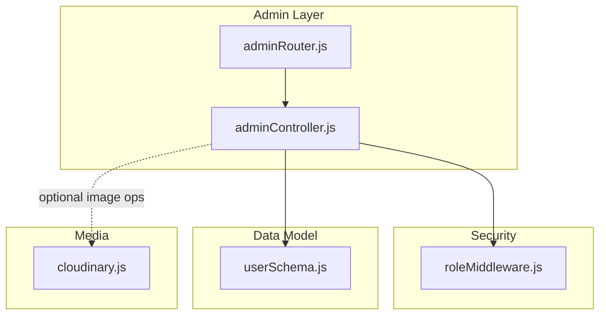
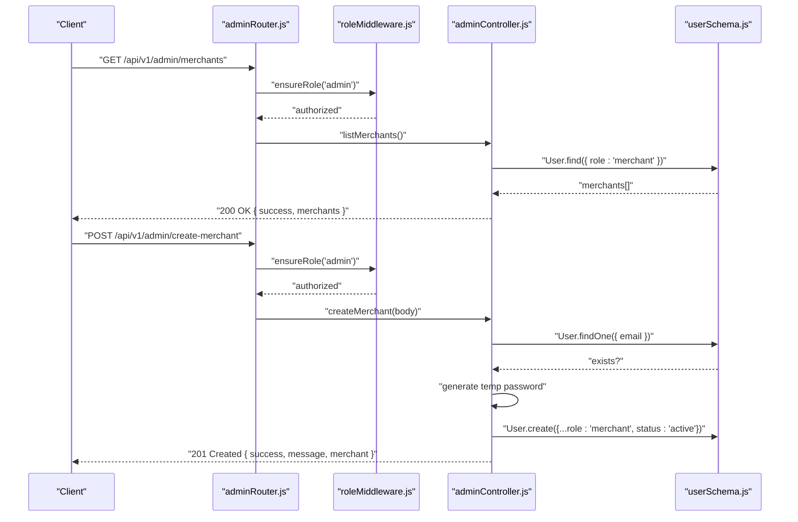
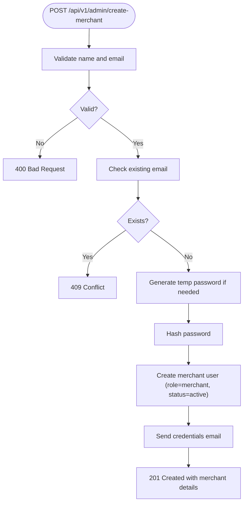
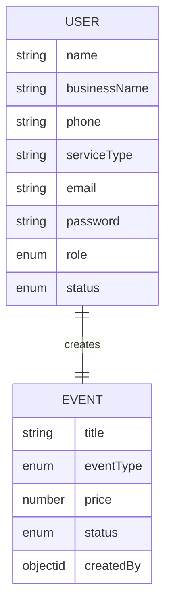
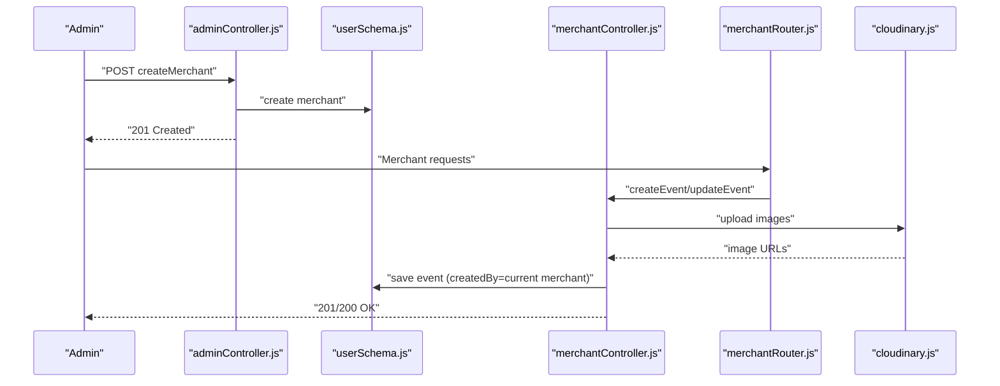
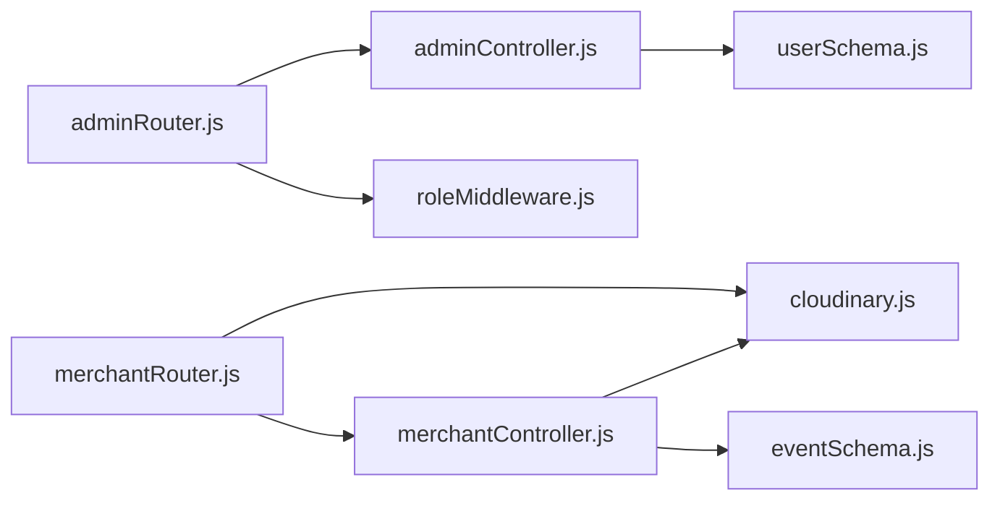

# Admin Merchant Management API

<cite>
**Referenced Files in This Document**
- [adminController.js](file://backend/controller/adminController.js)
- [adminRouter.js](file://backend/router/adminRouter.js)
- [userSchema.js](file://backend/models/userSchema.js)
- [roleMiddleware.js](file://backend/middleware/roleMiddleware.js)
- [cloudinary.js](file://backend/util/cloudinary.js)
- [merchantRouter.js](file://backend/router/merchantRouter.js)
- [merchantController.js](file://backend/controller/merchantController.js)
- [eventSchema.js](file://backend/models/eventSchema.js)
</cite>

## Table of Contents
1. [Introduction](#introduction)
2. [Project Structure](#project-structure)
3. [Core Components](#core-components)
4. [Architecture Overview](#architecture-overview)
5. [Detailed Component Analysis](#detailed-component-analysis)
6. [Dependency Analysis](#dependency-analysis)
7. [Performance Considerations](#performance-considerations)
8. [Troubleshooting Guide](#troubleshooting-guide)
9. [Conclusion](#conclusion)

## Introduction
This document provides comprehensive API documentation for admin merchant management endpoints. It covers:
- Listing all registered merchants with role and status
- Creating merchant accounts via admin
- Merchant onboarding workflows and account administration
- Business details and account status fields
- Validation rules and error handling
- Integration points with authentication, role-based access control, and media storage

## Project Structure
The merchant management functionality spans controllers, routers, models, middleware, and utilities:
- Admin routes expose merchant listing and creation endpoints
- Admin controller implements business logic for listing and creating merchants
- User model defines merchant fields including role and status
- Role middleware enforces admin-only access
- Media utilities integrate with Cloudinary for image handling

**Diagram sources**
- [adminRouter.js:1-29](file://backend/router/adminRouter.js#L1-L29)
- [adminController.js:1-194](file://backend/controller/adminController.js#L1-L194)
- [roleMiddleware.js:1-9](file://backend/middleware/roleMiddleware.js#L1-L9)
- [userSchema.js:1-55](file://backend/models/userSchema.js#L1-L55)
- [cloudinary.js:1-112](file://backend/util/cloudinary.js#L1-L112)

**Section sources**
- [adminRouter.js:1-29](file://backend/router/adminRouter.js#L1-L29)
- [adminController.js:1-194](file://backend/controller/adminController.js#L1-L194)
- [userSchema.js:1-55](file://backend/models/userSchema.js#L1-L55)
- [roleMiddleware.js:1-9](file://backend/middleware/roleMiddleware.js#L1-L9)
- [cloudinary.js:1-112](file://backend/util/cloudinary.js#L1-L112)

## Core Components
- Admin Router: Declares endpoints for merchant listing and creation under admin-only protection
- Admin Controller: Implements listing and creation logic, including password generation and email notifications
- User Schema: Defines merchant-specific fields such as role, status, and business details
- Role Middleware: Ensures only admin users can access admin endpoints
- Cloudinary Utility: Provides image upload capabilities used by merchant-related operations

Key endpoints:
- GET /api/v1/admin/merchants
- POST /api/v1/admin/create-merchant

Validation and error handling:
- Missing required fields return 400
- Duplicate emails return 409
- Unknown errors return 500
- Role enforcement returns 403

**Section sources**
- [adminRouter.js:18-26](file://backend/router/adminRouter.js#L18-L26)
- [adminController.js:18-77](file://backend/controller/adminController.js#L18-L77)
- [userSchema.js:39-49](file://backend/models/userSchema.js#L39-L49)
- [roleMiddleware.js:1-9](file://backend/middleware/roleMiddleware.js#L1-L9)

## Architecture Overview
The admin merchant management flow integrates routing, middleware, controller logic, and data modeling.

**Diagram sources**
- [adminRouter.js:19-21](file://backend/router/adminRouter.js#L19-L21)
- [adminController.js:18-77](file://backend/controller/adminController.js#L18-L77)
- [userSchema.js:39-49](file://backend/models/userSchema.js#L39-L49)
- [roleMiddleware.js:1-9](file://backend/middleware/roleMiddleware.js#L1-L9)

## Detailed Component Analysis

### Endpoint: GET /api/v1/admin/merchants
Purpose:
- Retrieve a list of all registered merchants excluding sensitive fields

Behavior:
- Filters users by role "merchant"
- Excludes password field from response
- Returns success flag and array of merchants

Response shape:
- success: boolean
- merchants: array of merchant objects with fields: id, name, email, phone, role, status

Error handling:
- 500 on internal failure

Security:
- Requires admin role via middleware

**Section sources**
- [adminRouter.js:20](file://backend/router/adminRouter.js#L20)
- [adminController.js:18-25](file://backend/controller/adminController.js#L18-L25)
- [userSchema.js:39-49](file://backend/models/userSchema.js#L39-L49)
- [roleMiddleware.js:1-9](file://backend/middleware/roleMiddleware.js#L1-L9)

### Endpoint: POST /api/v1/admin/create-merchant
Purpose:
- Admin creates a merchant account and sends credentials via email

Request body fields:
- name: required
- email: required
- phone: optional
- password: optional (auto-generated if missing or too short)

Processing steps:
- Validate presence of name and email
- Check for existing email conflict
- Generate temporary password if needed (minimum length enforced)
- Hash password and create merchant user with role "merchant" and status "active"
- Send email with login credentials

Response payload:
- success: boolean
- message: informational text
- merchant: object containing id, name, email, phone, role, status

Error handling:
- 400 for missing required fields
- 409 for duplicate email
- 500 for unknown errors

Security:
- Requires admin role via middleware

**Diagram sources**
- [adminController.js:27-77](file://backend/controller/adminController.js#L27-L77)

**Section sources**
- [adminRouter.js:21](file://backend/router/adminRouter.js#L21)
- [adminController.js:27-77](file://backend/controller/adminController.js#L27-L77)
- [userSchema.js:39-49](file://backend/models/userSchema.js#L39-L49)
- [roleMiddleware.js:1-9](file://backend/middleware/roleMiddleware.js#L1-L9)

### Merchant Data Schemas
Merchant account fields (from user model):
- role: enum ["user", "admin", "merchant"], default "user"
- status: enum ["active", "inactive"], default "active"
- businessName: string, optional
- phone: string, optional
- serviceType: string, optional
- email: unique, validated
- name: required, minimum length enforced
- password: required, minimum length enforced

Event schema highlights (merchant-related):
- createdBy: references User
- status: enum ["active", "inactive", "completed"]

**Diagram sources**
- [userSchema.js:4-52](file://backend/models/userSchema.js#L4-L52)
- [eventSchema.js:3-48](file://backend/models/eventSchema.js#L3-L48)

**Section sources**
- [userSchema.js:4-52](file://backend/models/userSchema.js#L4-L52)
- [eventSchema.js:3-48](file://backend/models/eventSchema.js#L3-L48)

### Merchant Onboarding and Administration Workflows
- Admin creates merchant account with auto-generated credentials
- Merchant receives email with login details and is marked as active
- Merchant can manage events (create/update/delete/list) via merchant endpoints
- Media uploads handled via Cloudinary integration

**Diagram sources**
- [adminController.js:27-77](file://backend/controller/adminController.js#L27-L77)
- [userSchema.js:39-49](file://backend/models/userSchema.js#L39-L49)
- [merchantController.js:5-98](file://backend/controller/merchantController.js#L5-L98)
- [merchantRouter.js:9-14](file://backend/router/merchantRouter.js#L9-L14)
- [cloudinary.js:75-91](file://backend/util/cloudinary.js#L75-L91)

**Section sources**
- [adminController.js:27-77](file://backend/controller/adminController.js#L27-L77)
- [merchantController.js:5-98](file://backend/controller/merchantController.js#L5-L98)
- [merchantRouter.js:9-14](file://backend/router/merchantRouter.js#L9-L14)
- [cloudinary.js:75-91](file://backend/util/cloudinary.js#L75-L91)

## Dependency Analysis
- adminRouter depends on adminController and roleMiddleware
- adminController depends on userSchema and email utility
- merchantRouter depends on merchantController and cloudinary upload
- merchantController depends on eventSchema and cloudinary utility

**Diagram sources**
- [adminRouter.js:1-29](file://backend/router/adminRouter.js#L1-L29)
- [adminController.js:1-194](file://backend/controller/adminController.js#L1-L194)
- [roleMiddleware.js:1-9](file://backend/middleware/roleMiddleware.js#L1-L9)
- [merchantRouter.js:1-17](file://backend/router/merchantRouter.js#L1-L17)
- [merchantController.js:1-209](file://backend/controller/merchantController.js#L1-L209)
- [cloudinary.js:1-112](file://backend/util/cloudinary.js#L1-L112)
- [eventSchema.js:1-51](file://backend/models/eventSchema.js#L1-L51)

**Section sources**
- [adminRouter.js:1-29](file://backend/router/adminRouter.js#L1-L29)
- [merchantRouter.js:1-17](file://backend/router/merchantRouter.js#L1-L17)

## Performance Considerations
- Merchant listing queries all users with role filter; consider pagination for large datasets
- Password hashing occurs during creation; ensure adequate hashing cost for production
- Image uploads to Cloudinary are asynchronous; batch operations can improve throughput
- Aggregation queries in admin controller are parallelized using Promise.all

[No sources needed since this section provides general guidance]

## Troubleshooting Guide
Common issues and resolutions:
- 400 Bad Request: Ensure name and email are provided in request body
- 409 Conflict: Email already exists; use a different email address
- 403 Forbidden: Authentication required or insufficient role
- 500 Internal Server Error: Unexpected failures; check server logs

Validation and error handling:
- Missing required fields: 400
- Duplicate email: 409
- Role mismatch: 403
- General failures: 500

**Section sources**
- [adminController.js:35-41](file://backend/controller/adminController.js#L35-L41)
- [adminController.js:74-76](file://backend/controller/adminController.js#L74-L76)
- [roleMiddleware.js:3-5](file://backend/middleware/roleMiddleware.js#L3-L5)

## Conclusion
The admin merchant management API provides secure, role-protected endpoints to list and create merchant accounts. It leverages robust validation, role enforcement, and email notifications to streamline onboarding. Integration with Cloudinary supports media handling for merchant-related operations. Extending the system to include business verification and approval workflows would involve adding verification document fields and status transitions to the user model and corresponding admin controls.