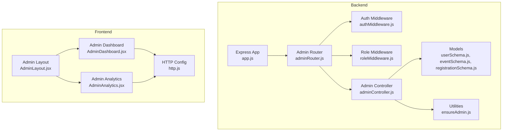
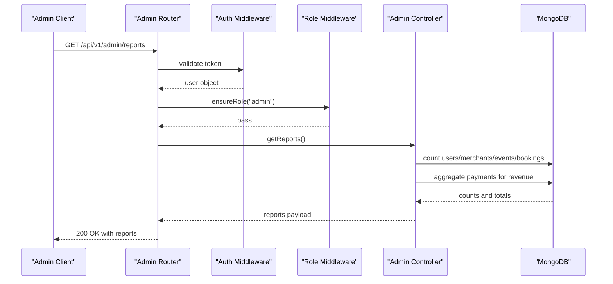
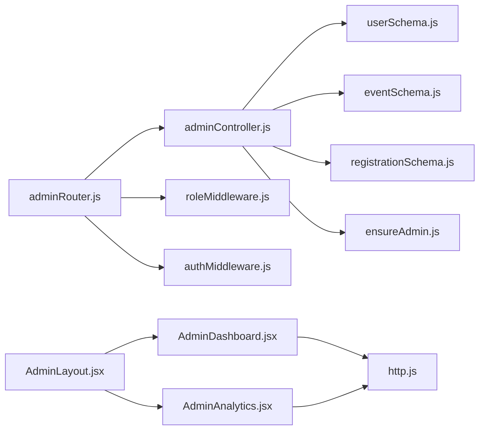

# Admin Operations API

<cite>
**Referenced Files in This Document**
- [adminRouter.js](file://backend/router/adminRouter.js)
- [adminController.js](file://backend/controller/adminController.js)
- [roleMiddleware.js](file://backend/middleware/roleMiddleware.js)
- [ensureAdmin.js](file://backend/util/ensureAdmin.js)
- [userSchema.js](file://backend/models/userSchema.js)
- [eventSchema.js](file://backend/models/eventSchema.js)
- [registrationSchema.js](file://backend/models/registrationSchema.js)
- [app.js](file://backend/app.js)
- [AdminDashboard.jsx](file://frontend/src/pages/dashboards/AdminDashboard.jsx)
- [AdminAnalytics.jsx](file://frontend/src/pages/dashboards/AdminAnalytics.jsx)
- [AdminLayout.jsx](file://frontend/src/components/admin/AdminLayout.jsx)
- [http.js](file://frontend/src/lib/http.js)
- [resetAdmin.js](file://backend/scripts/resetAdmin.js)
</cite>

## Table of Contents
1. [Introduction](#introduction)
2. [Project Structure](#project-structure)
3. [Core Components](#core-components)
4. [Architecture Overview](#architecture-overview)
5. [Detailed Component Analysis](#detailed-component-analysis)
6. [Dependency Analysis](#dependency-analysis)
7. [Performance Considerations](#performance-considerations)
8. [Troubleshooting Guide](#troubleshooting-guide)
9. [Conclusion](#conclusion)
10. [Appendices](#appendices)

## Introduction
This document provides comprehensive API documentation for Admin-level endpoints and system management operations. It covers user management, merchant moderation, event oversight, system analytics, and configuration management. It also documents admin dashboard APIs, reporting endpoints, system monitoring, and administrative tools. Administrative permissions, audit trails, and system-wide operations are explained, along with moderation workflows, user verification processes, and system maintenance procedures. Examples for admin dashboard integrations and system administration tasks are included.

## Project Structure
The admin functionality spans backend routes, controllers, middleware, models, and frontend dashboards. The backend exposes REST endpoints under /api/v1/admin, protected by authentication and role checks. The frontend integrates these endpoints into admin dashboards for users, events, registrations, analytics, and settings.

**Diagram sources**
- [app.js:1-91](file://backend/app.js#L1-L91)
- [adminRouter.js:1-29](file://backend/router/adminRouter.js#L1-L29)
- [adminController.js:1-194](file://backend/controller/adminController.js#L1-L194)
- [roleMiddleware.js:1-9](file://backend/middleware/roleMiddleware.js#L1-L9)
- [userSchema.js:1-55](file://backend/models/userSchema.js#L1-L55)
- [eventSchema.js:1-51](file://backend/models/eventSchema.js#L1-L51)
- [registrationSchema.js:1-12](file://backend/models/registrationSchema.js#L1-L12)
- [AdminLayout.jsx:1-29](file://frontend/src/components/admin/AdminLayout.jsx#L1-L29)
- [AdminDashboard.jsx:1-91](file://frontend/src/pages/dashboards/AdminDashboard.jsx#L1-L91)
- [AdminAnalytics.jsx:1-94](file://frontend/src/pages/dashboards/AdminAnalytics.jsx#L1-L94)
- [http.js:1-5](file://frontend/src/lib/http.js#L1-L5)

**Section sources**
- [app.js:35-47](file://backend/app.js#L35-L47)
- [adminRouter.js:18-26](file://backend/router/adminRouter.js#L18-L26)

## Core Components
- Admin Router: Defines admin endpoints for users, merchants, events, registrations, reports, and public stats.
- Admin Controller: Implements business logic for listing/deleting users, listing/deleting events, listing registrations, creating merchants, generating reports, and fetching public stats.
- Role Middleware: Ensures requests are made by users with the admin role.
- Models: Define data structures for User, Event, and Registration used by admin operations.
- Frontend Dashboards: Integrate with admin endpoints to present users, events, registrations, and analytics.

Key responsibilities:
- Enforce admin-only access via middleware.
- Aggregate system metrics and expose them through reports.
- Provide CRUD-like operations for users and events with cascading cleanup for registrations.
- Support merchant creation with secure password hashing and email notifications.

**Section sources**
- [adminRouter.js:18-26](file://backend/router/adminRouter.js#L18-L26)
- [adminController.js:9-193](file://backend/controller/adminController.js#L9-L193)
- [roleMiddleware.js:1-9](file://backend/middleware/roleMiddleware.js#L1-L9)
- [userSchema.js:39-49](file://backend/models/userSchema.js#L39-L49)
- [eventSchema.js:29-36](file://backend/models/eventSchema.js#L29-L36)
- [registrationSchema.js:5-6](file://backend/models/registrationSchema.js#L5-L6)

## Architecture Overview
The admin API follows a layered architecture:
- HTTP Layer: Express routes under /api/v1/admin.
- Authentication and Authorization: Auth middleware validates tokens; role middleware enforces admin role.
- Controller Layer: Orchestrates data retrieval, aggregation, and persistence operations.
- Data Access: Uses Mongoose models for User, Event, Registration, and Payment collections.
- Frontend Integration: Dashboards consume admin endpoints and render aggregated data.

**Diagram sources**
- [adminRouter.js:26](file://backend/router/adminRouter.js#L26)
- [adminController.js:118-177](file://backend/controller/adminController.js#L118-L177)
- [roleMiddleware.js:1-9](file://backend/middleware/roleMiddleware.js#L1-L9)

## Detailed Component Analysis

### Admin Endpoints
- Base Path: /api/v1/admin
- Authentication: Required for all endpoints.
- Authorization: Admin role required for all endpoints.

Endpoints:
- GET /public-stats
  - Purpose: Retrieve public platform statistics (total events, users, merchants).
  - Response: Stats object with counts.
  - Security: No role requirement.
  - Example usage: Public landing page stats.

- GET /users
  - Purpose: List all users excluding passwords.
  - Response: Array of users.
  - Security: Admin role required.

- DELETE /users/:id
  - Purpose: Remove a user by ID.
  - Response: Deletion confirmation.
  - Security: Admin role required.

- GET /merchants
  - Purpose: List all merchant users excluding passwords.
  - Response: Array of merchants.
  - Security: Admin role required.

- POST /create-merchant
  - Purpose: Create a new merchant with auto-generated secure password and notify via email.
  - Request Body: name, email, phone (optional), password (optional).
  - Response: Created merchant details and message.
  - Security: Admin role required.
  - Notes: Sends email with login credentials.

- GET /events
  - Purpose: List all events with creator info.
  - Response: Array of events.
  - Security: Admin role required.

- DELETE /events/:id
  - Purpose: Remove an event and cascade-delete associated registrations.
  - Response: Deletion confirmation.
  - Security: Admin role required.

- GET /registrations
  - Purpose: List all registrations with populated user and event details.
  - Response: Array of registrations.
  - Security: Admin role required.

- GET /reports
  - Purpose: Generate system reports including totals, activity, revenue, and ratios.
  - Response: Reports object with computed metrics.
  - Security: Admin role required.

Example request/response patterns are derived from the route definitions and controller implementations.

**Section sources**
- [adminRouter.js:18-26](file://backend/router/adminRouter.js#L18-L26)
- [adminController.js:9-193](file://backend/controller/adminController.js#L9-L193)

### Admin Controller Implementation
Key functions and behaviors:
- listUsers: Returns all users without password fields.
- deleteUser: Deletes a user by ID.
- listMerchants: Returns all users with role merchant.
- createMerchant: Validates inputs, checks uniqueness, hashes password, creates merchant, and emails credentials.
- listEventsAdmin: Returns all events with populated creator.
- deleteEventAdmin: Deletes an event and associated registrations.
- listRegistrationsAdmin: Returns all registrations with populated user and event.
- getReports: Computes aggregates for users, merchants, events, bookings, active events, recent activity, confirmed/pending bookings, and revenue.
- getPublicStats: Computes totalEvents, totalUsers, totalMerchants.

Error handling:
- Centralized try/catch blocks return structured JSON with success flag and message.
- Specific validation errors return 400/409 statuses where applicable.

**Section sources**
- [adminController.js:9-193](file://backend/controller/adminController.js#L9-L193)

### Role-Based Access Control
- ensureRole: Middleware that checks if the authenticated user has one of the required roles. Denies access with 403 if role mismatch.
- Applied to all admin endpoints via route definitions.

**Section sources**
- [roleMiddleware.js:1-9](file://backend/middleware/roleMiddleware.js#L1-L9)
- [adminRouter.js:19-26](file://backend/router/adminRouter.js#L19-L26)

### Data Models Used by Admin Operations
- User: Includes name, email, password, role, status, and timestamps. Roles include user, admin, merchant.
- Event: Includes title, description, category, eventType, pricing, scheduling, tickets, addons, status, and createdBy.
- Registration: Links a user to an event.

These models support admin operations such as listing users/events, deleting events (and cascading registrations), and computing reports.

**Section sources**
- [userSchema.js:39-49](file://backend/models/userSchema.js#L39-L49)
- [eventSchema.js:29-36](file://backend/models/eventSchema.js#L29-L36)
- [registrationSchema.js:5-6](file://backend/models/registrationSchema.js#L5-L6)

### Frontend Admin Dashboard Integration
- AdminDashboard:
  - Loads users, events, and registrations concurrently.
  - Provides delete actions for users and events.
  - Uses authHeaders for authenticated requests.
- AdminAnalytics:
  - Fetches reports and renders cards for platform metrics.
  - Uses AdminLayout for consistent navigation and logout.
- AdminLayout:
  - Wraps dashboard pages with sidebar and topbar.
  - Handles logout and navigation.
- HTTP Configuration:
  - API base URL and Authorization header builder.

Integration highlights:
- Concurrent loading of admin data for responsive UI.
- Consistent Bearer token usage for protected endpoints.
- Structured rendering of reports and metrics.

**Section sources**
- [AdminDashboard.jsx:12-40](file://frontend/src/pages/dashboards/AdminDashboard.jsx#L12-L40)
- [AdminAnalytics.jsx:13-18](file://frontend/src/pages/dashboards/AdminAnalytics.jsx#L13-L18)
- [AdminLayout.jsx:7-23](file://frontend/src/components/admin/AdminLayout.jsx#L7-L23)
- [http.js:1-5](file://frontend/src/lib/http.js#L1-L5)

### Admin Initialization and Maintenance
- ensureAdmin: Creates or resets the admin user based on environment variables, hashing the password securely.
- resetAdmin script: CLI tool to recreate the admin user with provided credentials.

Operational guidance:
- Use environment variables to configure admin credentials during deployment.
- Reset admin credentials using the provided script when needed.

**Section sources**
- [ensureAdmin.js:4-34](file://backend/util/ensureAdmin.js#L4-L34)
- [resetAdmin.js:8-47](file://backend/scripts/resetAdmin.js#L8-L47)

## Dependency Analysis
The admin module exhibits clear separation of concerns:
- Router depends on controller functions.
- Controller depends on models and utilities.
- Frontend dashboards depend on backend endpoints and shared HTTP utilities.
- Role enforcement ensures only admins can access sensitive endpoints.

**Diagram sources**
- [adminRouter.js:1-29](file://backend/router/adminRouter.js#L1-L29)
- [adminController.js:1-194](file://backend/controller/adminController.js#L1-L194)
- [userSchema.js:1-55](file://backend/models/userSchema.js#L1-L55)
- [eventSchema.js:1-51](file://backend/models/eventSchema.js#L1-L51)
- [registrationSchema.js:1-12](file://backend/models/registrationSchema.js#L1-L12)
- [roleMiddleware.js:1-9](file://backend/middleware/roleMiddleware.js#L1-L9)
- [AdminDashboard.jsx:1-91](file://frontend/src/pages/dashboards/AdminDashboard.jsx#L1-L91)
- [AdminAnalytics.jsx:1-94](file://frontend/src/pages/dashboards/AdminAnalytics.jsx#L1-L94)
- [AdminLayout.jsx:1-29](file://frontend/src/components/admin/AdminLayout.jsx#L1-L29)
- [http.js:1-5](file://frontend/src/lib/http.js#L1-L5)

**Section sources**
- [adminRouter.js:18-26](file://backend/router/adminRouter.js#L18-L26)
- [adminController.js:118-177](file://backend/controller/adminController.js#L118-L177)

## Performance Considerations
- Aggregation Queries: Reports use MongoDB aggregation and count operations. Consider indexing frequently queried fields (e.g., createdAt, role, status) to improve report generation performance.
- Concurrency: Frontend dashboards fetch multiple resources concurrently to reduce load time.
- Pagination: For large datasets (users, events, registrations), consider adding pagination to reduce payload sizes.
- Caching: Implement caching for public stats and infrequently changing reports to reduce database load.

## Troubleshooting Guide
Common issues and resolutions:
- Authentication Failures:
  - Symptom: 401 Unauthorized on admin endpoints.
  - Resolution: Ensure a valid Bearer token is included in Authorization header.
  - Reference: [http.js:2-4](file://frontend/src/lib/http.js#L2-L4)

- Forbidden Access:
  - Symptom: 403 Forbidden on admin endpoints.
  - Resolution: Confirm the user has role admin; verify role middleware enforcement.
  - Reference: [roleMiddleware.js:3-6](file://backend/middleware/roleMiddleware.js#L3-L6)

- Merchant Creation Errors:
  - Symptom: 400/409 on POST /create-merchant.
  - Resolution: Provide required fields (name, email) and ensure email uniqueness; check password length.
  - Reference: [adminController.js:35-41](file://backend/controller/adminController.js#L35-L41)

- Report Generation Failures:
  - Symptom: 500 error on GET /reports.
  - Resolution: Verify database connectivity and collection availability; check aggregation pipeline.
  - Reference: [adminController.js:174-176](file://backend/controller/adminController.js#L174-L176)

- Admin Initialization Issues:
  - Symptom: Admin user missing or incorrect credentials.
  - Resolution: Use ensureAdmin or resetAdmin script to create/update admin.
  - References: [ensureAdmin.js:4-34](file://backend/util/ensureAdmin.js#L4-L34), [resetAdmin.js:8-47](file://backend/scripts/resetAdmin.js#L8-L47)

**Section sources**
- [roleMiddleware.js:3-6](file://backend/middleware/roleMiddleware.js#L3-L6)
- [adminController.js:35-41](file://backend/controller/adminController.js#L35-L41)
- [adminController.js:174-176](file://backend/controller/adminController.js#L174-L176)
- [ensureAdmin.js:4-34](file://backend/util/ensureAdmin.js#L4-L34)
- [resetAdmin.js:8-47](file://backend/scripts/resetAdmin.js#L8-L47)

## Conclusion
The Admin Operations API provides a robust foundation for managing users, merchants, events, and system analytics. It enforces strict role-based access control, offers comprehensive reporting capabilities, and integrates seamlessly with frontend dashboards. By following the documented endpoints, permissions, and operational procedures, administrators can efficiently oversee the platform and maintain system health.

## Appendices

### Endpoint Reference Summary
- GET /api/v1/admin/public-stats
  - Description: Public platform stats.
  - Auth: Optional.
  - Response: Stats object.

- GET /api/v1/admin/users
  - Description: List all users.
  - Auth: Required, Admin role.
  - Response: Array of users.

- DELETE /api/v1/admin/users/:id
  - Description: Delete a user.
  - Auth: Required, Admin role.
  - Response: Deletion confirmation.

- GET /api/v1/admin/merchants
  - Description: List all merchants.
  - Auth: Required, Admin role.
  - Response: Array of merchants.

- POST /api/v1/admin/create-merchant
  - Description: Create a merchant and email credentials.
  - Auth: Required, Admin role.
  - Request: name, email, phone (optional), password (optional).
  - Response: Created merchant and message.

- GET /api/v1/admin/events
  - Description: List all events with creators.
  - Auth: Required, Admin role.
  - Response: Array of events.

- DELETE /api/v1/admin/events/:id
  - Description: Delete an event and associated registrations.
  - Auth: Required, Admin role.
  - Response: Deletion confirmation.

- GET /api/v1/admin/registrations
  - Description: List all registrations with user and event details.
  - Auth: Required, Admin role.
  - Response: Array of registrations.

- GET /api/v1/admin/reports
  - Description: System reports and metrics.
  - Auth: Required, Admin role.
  - Response: Reports object.

**Section sources**
- [adminRouter.js:18-26](file://backend/router/adminRouter.js#L18-L26)
- [adminController.js:118-177](file://backend/controller/adminController.js#L118-L177)