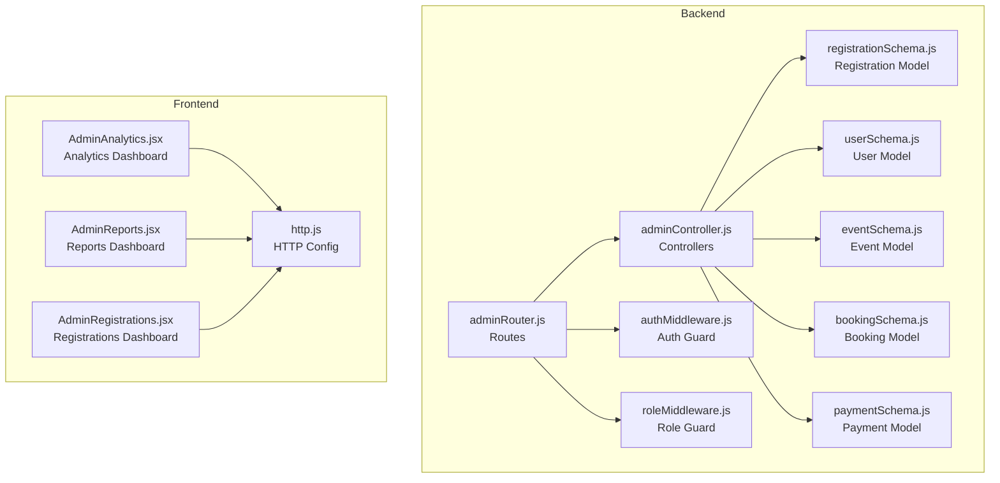
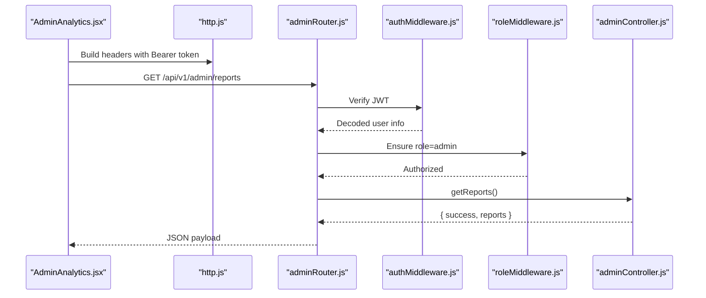
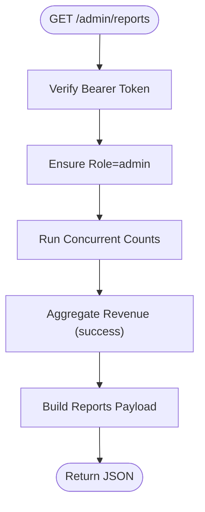
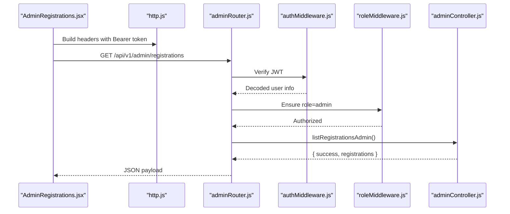
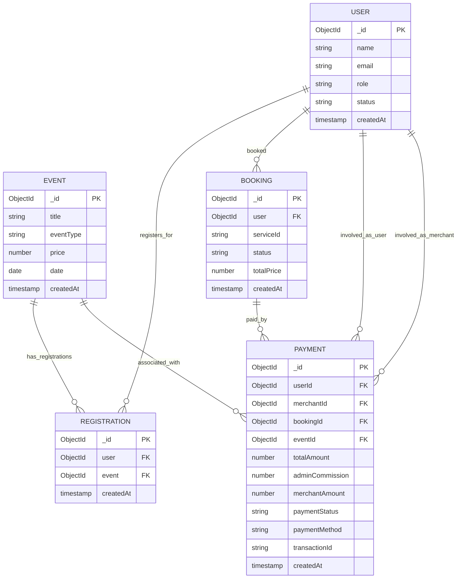
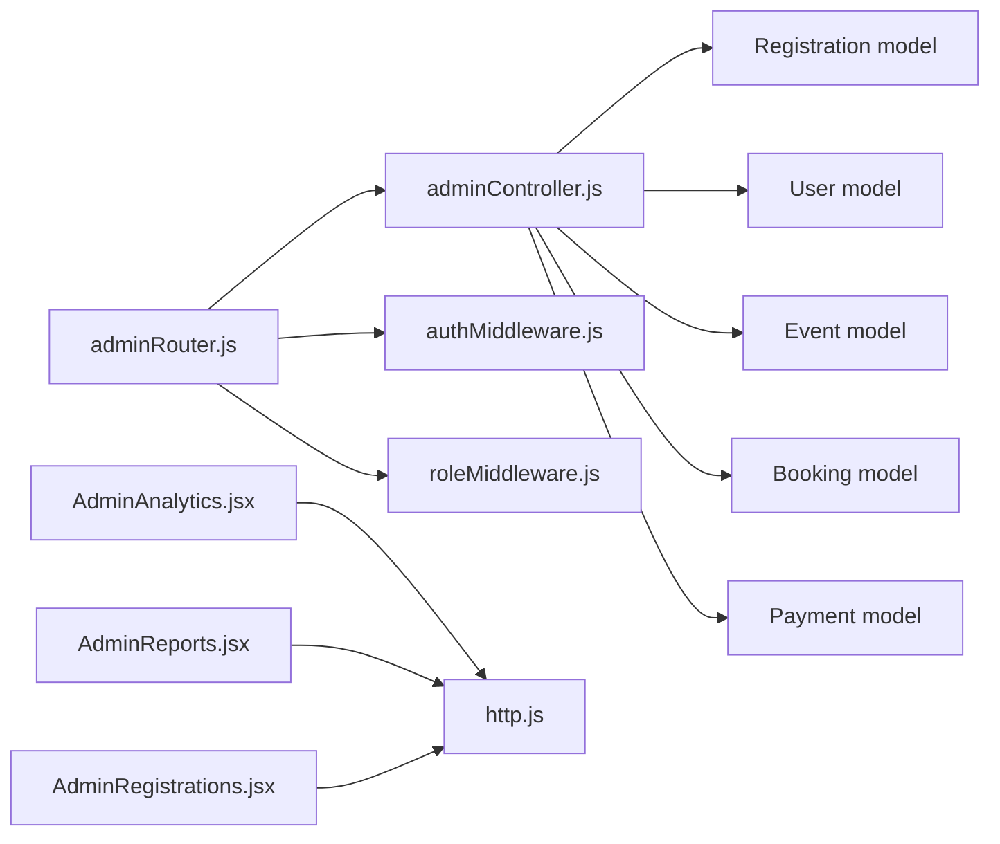

# Admin Registration and Analytics API

<cite>
**Referenced Files in This Document**
- [adminRouter.js](file://backend/router/adminRouter.js)
- [adminController.js](file://backend/controller/adminController.js)
- [registrationSchema.js](file://backend/models/registrationSchema.js)
- [userSchema.js](file://backend/models/userSchema.js)
- [eventSchema.js](file://backend/models/eventSchema.js)
- [bookingSchema.js](file://backend/models/bookingSchema.js)
- [paymentSchema.js](file://backend/models/paymentSchema.js)
- [authMiddleware.js](file://backend/middleware/authMiddleware.js)
- [roleMiddleware.js](file://backend/middleware/roleMiddleware.js)
- [AdminAnalytics.jsx](file://frontend/src/pages/dashboards/AdminAnalytics.jsx)
- [AdminReports.jsx](file://frontend/src/pages/dashboards/AdminReports.jsx)
- [AdminRegistrations.jsx](file://frontend/src/pages/dashboards/AdminRegistrations.jsx)
- [http.js](file://frontend/src/lib/http.js)
- [test-admin-endpoints.js](file://backend/test-admin-endpoints.js)
</cite>

## Table of Contents
1. [Introduction](#introduction)
2. [Project Structure](#project-structure)
3. [Core Components](#core-components)
4. [Architecture Overview](#architecture-overview)
5. [Detailed Component Analysis](#detailed-component-analysis)
6. [Dependency Analysis](#dependency-analysis)
7. [Performance Considerations](#performance-considerations)
8. [Troubleshooting Guide](#troubleshooting-guide)
9. [Conclusion](#conclusion)
10. [Appendices](#appendices)

## Introduction
This document provides API documentation for admin registration tracking and analytics endpoints. It focuses on:
- Retrieving registration analytics and user engagement metrics via GET /api/v1/admin/reports
- Understanding registration data aggregation and user activity tracking
- Explaining system usage analytics derived from platform data
- Defining response schemas for registration trends, user demographics, event participation statistics, and revenue analytics
- Providing examples for generating registration reports, analyzing user engagement patterns, and monitoring system performance metrics
- Addressing filtering options for date ranges, user segments, and geographic regions
- Outlining data privacy considerations and analytics data protection requirements

## Project Structure
The admin analytics and registration tracking functionality spans backend routes, controllers, models, and middleware, with frontend dashboards consuming the endpoints.

**Diagram sources**
- [adminRouter.js:1-29](file://backend/router/adminRouter.js#L1-L29)
- [adminController.js:1-194](file://backend/controller/adminController.js#L1-L194)
- [authMiddleware.js:1-17](file://backend/middleware/authMiddleware.js#L1-L17)
- [roleMiddleware.js:1-9](file://backend/middleware/roleMiddleware.js#L1-L9)
- [registrationSchema.js:1-12](file://backend/models/registrationSchema.js#L1-L12)
- [userSchema.js:1-55](file://backend/models/userSchema.js#L1-L55)
- [eventSchema.js:1-51](file://backend/models/eventSchema.js#L1-L51)
- [bookingSchema.js:1-53](file://backend/models/bookingSchema.js#L1-L53)
- [paymentSchema.js:1-142](file://backend/models/paymentSchema.js#L1-L142)
- [AdminAnalytics.jsx:1-94](file://frontend/src/pages/dashboards/AdminAnalytics.jsx#L1-L94)
- [AdminReports.jsx:1-284](file://frontend/src/pages/dashboards/AdminReports.jsx#L1-L284)
- [AdminRegistrations.jsx:1-53](file://frontend/src/pages/dashboards/AdminRegistrations.jsx#L1-L53)
- [http.js:1-5](file://frontend/src/lib/http.js#L1-L5)

**Section sources**
- [adminRouter.js:1-29](file://backend/router/adminRouter.js#L1-L29)
- [adminController.js:118-177](file://backend/controller/adminController.js#L118-L177)
- [AdminAnalytics.jsx:13-18](file://frontend/src/pages/dashboards/AdminAnalytics.jsx#L13-L18)
- [AdminReports.jsx:23-44](file://frontend/src/pages/dashboards/AdminReports.jsx#L23-L44)
- [AdminRegistrations.jsx:11-18](file://frontend/src/pages/dashboards/AdminRegistrations.jsx#L11-L18)
- [http.js:1-5](file://frontend/src/lib/http.js#L1-L5)

## Core Components
- Admin route endpoints:
  - GET /api/v1/admin/reports: Returns aggregated platform analytics including user counts, event counts, booking counts, revenue, and activity metrics.
  - GET /api/v1/admin/registrations: Returns all registrations with populated user and event details.
  - GET /api/v1/admin/public-stats: Public stats endpoint for non-admin access.
- Controllers:
  - getReports: Aggregates counts and revenue using MongoDB queries and aggregation pipelines.
  - listRegistrationsAdmin: Retrieves registrations with user and event population.
  - getPublicStats: Provides basic platform statistics.
- Middleware:
  - auth: Validates JWT bearer tokens.
  - ensureRole: Enforces admin role.
- Models involved:
  - Registration, User, Event, Booking, Payment.

Key implementation references:
- Endpoint registration and routing: [adminRouter.js:18-26](file://backend/router/adminRouter.js#L18-L26)
- Reports controller logic: [adminController.js:118-177](file://backend/controller/adminController.js#L118-L177)
- Registrations controller logic: [adminController.js:109-116](file://backend/controller/adminController.js#L109-L116)
- Authentication guard: [authMiddleware.js:3-16](file://backend/middleware/authMiddleware.js#L3-L16)
- Role guard: [roleMiddleware.js:1-8](file://backend/middleware/roleMiddleware.js#L1-L8)

**Section sources**
- [adminRouter.js:18-26](file://backend/router/adminRouter.js#L18-L26)
- [adminController.js:109-177](file://backend/controller/adminController.js#L109-L177)
- [authMiddleware.js:3-16](file://backend/middleware/authMiddleware.js#L3-L16)
- [roleMiddleware.js:1-8](file://backend/middleware/roleMiddleware.js#L1-L8)

## Architecture Overview
The admin analytics pipeline integrates frontend dashboards with backend controllers secured by authentication and role middleware. The reports endpoint performs efficient aggregations across related collections.

**Diagram sources**
- [AdminAnalytics.jsx:13-18](file://frontend/src/pages/dashboards/AdminAnalytics.jsx#L13-L18)
- [http.js:1-5](file://frontend/src/lib/http.js#L1-L5)
- [adminRouter.js:26](file://backend/router/adminRouter.js#L26)
- [authMiddleware.js:3-16](file://backend/middleware/authMiddleware.js#L3-L16)
- [roleMiddleware.js:1-8](file://backend/middleware/roleMiddleware.js#L1-L8)
- [adminController.js:118-177](file://backend/controller/adminController.js#L118-L177)

## Detailed Component Analysis

### GET /api/v1/admin/reports
Purpose:
- Provide comprehensive analytics for platform health, user growth, event activity, booking performance, and revenue.

Response Schema (reports):
- totalUsers: number
- totalMerchants: number
- totalEvents: number
- totalBookings: number
- activeEvents: number
- recentUsers: number (last 30 days)
- recentEvents: number (last 30 days)
- paidBookings: number (confirmed)
- pendingBookings: number
- totalRevenue: number (sum of successful payments)
- monthlyRevenue: number (last 30 days of successful payments)

Processing Logic:
- Uses concurrent counts for user, merchant, event, booking, and active event metrics.
- Computes recent user and event counts within the last 30 days.
- Aggregates total and monthly revenue from Payment collection where paymentStatus equals success.
- Calculates derived ratios and percentages client-side in dashboards.

Filtering Options:
- Current implementation filters by date windows (e.g., last 30 days) and status fields (e.g., confirmed bookings, successful payments).
- No explicit query parameters for date ranges, user segments, or geographic regions are present in the current implementation.

Security and Access:
- Requires Bearer token and admin role.

Example Usage:
- Frontend dashboards call this endpoint and render cards and charts based on the returned metrics.

References:
- Endpoint definition: [adminRouter.js:26](file://backend/router/adminRouter.js#L26)
- Controller logic: [adminController.js:118-177](file://backend/controller/adminController.js#L118-L177)
- Frontend consumption: [AdminAnalytics.jsx:13-18](file://frontend/src/pages/dashboards/AdminAnalytics.jsx#L13-L18), [AdminReports.jsx:23-44](file://frontend/src/pages/dashboards/AdminReports.jsx#L23-L44)

**Diagram sources**
- [adminRouter.js:26](file://backend/router/adminRouter.js#L26)
- [authMiddleware.js:3-16](file://backend/middleware/authMiddleware.js#L3-L16)
- [roleMiddleware.js:1-8](file://backend/middleware/roleMiddleware.js#L1-L8)
- [adminController.js:118-177](file://backend/controller/adminController.js#L118-L177)

**Section sources**
- [adminRouter.js:26](file://backend/router/adminRouter.js#L26)
- [adminController.js:118-177](file://backend/controller/adminController.js#L118-L177)
- [AdminAnalytics.jsx:13-18](file://frontend/src/pages/dashboards/AdminAnalytics.jsx#L13-L18)
- [AdminReports.jsx:23-44](file://frontend/src/pages/dashboards/AdminReports.jsx#L23-L44)

### GET /api/v1/admin/registrations
Purpose:
- Retrieve all event registrations with associated user and event details for administrative oversight.

Response Schema (registrations):
- Array of registration objects with:
  - user: populated user object (name, email)
  - event: populated event object (title)
  - createdAt: timestamp of registration

Processing Logic:
- Queries Registration collection and populates user and event references.

Filtering Options:
- No query parameters for date range, user segment, or region are currently supported.

Security and Access:
- Requires Bearer token and admin role.

Frontend Usage:
- Admin dashboard fetches and displays a table of registrations.

References:
- Endpoint definition: [adminRouter.js:25](file://backend/router/adminRouter.js#L25)
- Controller logic: [adminController.js:109-116](file://backend/controller/adminController.js#L109-L116)
- Frontend usage: [AdminRegistrations.jsx:11-18](file://frontend/src/pages/dashboards/AdminRegistrations.jsx#L11-L18)

**Diagram sources**
- [AdminRegistrations.jsx:11-18](file://frontend/src/pages/dashboards/AdminRegistrations.jsx#L11-L18)
- [http.js:1-5](file://frontend/src/lib/http.js#L1-L5)
- [adminRouter.js:25](file://backend/router/adminRouter.js#L25)
- [authMiddleware.js:3-16](file://backend/middleware/authMiddleware.js#L3-L16)
- [roleMiddleware.js:1-8](file://backend/middleware/roleMiddleware.js#L1-L8)
- [adminController.js:109-116](file://backend/controller/adminController.js#L109-L116)

**Section sources**
- [adminRouter.js:25](file://backend/router/adminRouter.js#L25)
- [adminController.js:109-116](file://backend/controller/adminController.js#L109-L116)
- [AdminRegistrations.jsx:11-18](file://frontend/src/pages/dashboards/AdminRegistrations.jsx#L11-L18)

### Data Models Involved

**Diagram sources**
- [registrationSchema.js:1-12](file://backend/models/registrationSchema.js#L1-L12)
- [userSchema.js:1-55](file://backend/models/userSchema.js#L1-L55)
- [eventSchema.js:1-51](file://backend/models/eventSchema.js#L1-L51)
- [bookingSchema.js:1-53](file://backend/models/bookingSchema.js#L1-L53)
- [paymentSchema.js:1-142](file://backend/models/paymentSchema.js#L1-L142)

**Section sources**
- [registrationSchema.js:1-12](file://backend/models/registrationSchema.js#L1-L12)
- [userSchema.js:1-55](file://backend/models/userSchema.js#L1-L55)
- [eventSchema.js:1-51](file://backend/models/eventSchema.js#L1-L51)
- [bookingSchema.js:1-53](file://backend/models/bookingSchema.js#L1-L53)
- [paymentSchema.js:1-142](file://backend/models/paymentSchema.js#L1-L142)

## Dependency Analysis
- Route to Controller: adminRouter.js delegates to adminController.js for /admin/reports and /admin/registrations.
- Controller to Models: adminController.js uses Registration, User, Event, Booking, and Payment models for analytics.
- Security: Both endpoints require authMiddleware.js and ensureRole("admin").
- Frontend to Backend: Dashboards AdminAnalytics.jsx and AdminReports.jsx consume /admin/reports; AdminRegistrations.jsx consumes /admin/registrations.

**Diagram sources**
- [adminRouter.js:1-29](file://backend/router/adminRouter.js#L1-L29)
- [adminController.js:1-194](file://backend/controller/adminController.js#L1-L194)
- [authMiddleware.js:1-17](file://backend/middleware/authMiddleware.js#L1-L17)
- [roleMiddleware.js:1-9](file://backend/middleware/roleMiddleware.js#L1-L9)
- [AdminAnalytics.jsx:1-94](file://frontend/src/pages/dashboards/AdminAnalytics.jsx#L1-L94)
- [AdminReports.jsx:1-284](file://frontend/src/pages/dashboards/AdminReports.jsx#L1-L284)
- [AdminRegistrations.jsx:1-53](file://frontend/src/pages/dashboards/AdminRegistrations.jsx#L1-L53)
- [http.js:1-5](file://frontend/src/lib/http.js#L1-L5)

**Section sources**
- [adminRouter.js:1-29](file://backend/router/adminRouter.js#L1-L29)
- [adminController.js:109-177](file://backend/controller/adminController.js#L109-L177)
- [AdminAnalytics.jsx:13-18](file://frontend/src/pages/dashboards/AdminAnalytics.jsx#L13-L18)
- [AdminReports.jsx:23-44](file://frontend/src/pages/dashboards/AdminReports.jsx#L23-L44)
- [AdminRegistrations.jsx:11-18](file://frontend/src/pages/dashboards/AdminRegistrations.jsx#L11-L18)

## Performance Considerations
- Aggregation Efficiency: The reports endpoint uses concurrent count operations and aggregation pipelines to minimize round-trips and leverage database indexing.
- Indexing: Payment schema defines indexes on frequently queried fields (userId, merchantId, bookingId, transactionId, paymentStatus) to improve query performance.
- Population Overhead: The registrations endpoint populates user and event references; consider pagination or limiting fields if datasets grow large.
- Client-Side Computation: Derived metrics (ratios, percentages) are computed in frontend dashboards to reduce server load.

[No sources needed since this section provides general guidance]

## Troubleshooting Guide
Common Issues and Resolutions:
- Unauthorized Access:
  - Symptom: 401 Unauthorized.
  - Cause: Missing or invalid Bearer token.
  - Resolution: Ensure a valid JWT is included in Authorization header.
  - Reference: [authMiddleware.js:7-14](file://backend/middleware/authMiddleware.js#L7-L14)
- Forbidden Access:
  - Symptom: 403 Forbidden.
  - Cause: Non-admin user attempting to access admin endpoint.
  - Resolution: Authenticate as an admin user.
  - Reference: [roleMiddleware.js:3-6](file://backend/middleware/roleMiddleware.js#L3-L6)
- Endpoint Not Found:
  - Symptom: 404 Not Found.
  - Cause: Incorrect route or missing trailing slash.
  - Resolution: Verify route matches backend definitions.
  - References: [adminRouter.js:18-26](file://backend/router/adminRouter.js#L18-L26)
- Empty or Missing Data:
  - Symptom: Empty reports or registrations arrays.
  - Cause: No records in the database or insufficient activity.
  - Resolution: Trigger platform activity or seed test data.
  - References: [adminController.js:118-177](file://backend/controller/adminController.js#L118-L177), [adminController.js:109-116](file://backend/controller/adminController.js#L109-L116)
- Testing Admin Endpoints:
  - Use the provided test script to validate endpoint responses and payloads.
  - Reference: [test-admin-endpoints.js:1-72](file://backend/test-admin-endpoints.js#L1-L72)

**Section sources**
- [authMiddleware.js:7-14](file://backend/middleware/authMiddleware.js#L7-L14)
- [roleMiddleware.js:3-6](file://backend/middleware/roleMiddleware.js#L3-L6)
- [adminRouter.js:18-26](file://backend/router/adminRouter.js#L18-L26)
- [adminController.js:109-177](file://backend/controller/adminController.js#L109-L177)
- [test-admin-endpoints.js:1-72](file://backend/test-admin-endpoints.js#L1-L72)

## Conclusion
The admin analytics and registration tracking endpoints provide a solid foundation for monitoring platform growth, user engagement, and revenue. The current implementation offers essential metrics and straightforward access patterns. Future enhancements could include:
- Query parameters for date range filtering, user segments, and geographic regions.
- Enhanced pagination for large registration datasets.
- Additional demographic breakdowns and cohort analytics.
- Improved audit logging and data retention policies aligned with privacy requirements.

[No sources needed since this section summarizes without analyzing specific files]

## Appendices

### API Definitions
- Base URL: http://localhost:5000/api/v1
- Headers:
  - Authorization: Bearer <token>
- Endpoints:
  - GET /admin/reports
    - Description: Platform analytics including totals, activity, and revenue.
    - Response: { success: boolean, reports: object }
  - GET /admin/registrations
    - Description: List of registrations with user and event details.
    - Response: { success: boolean, registrations: array }

**Section sources**
- [http.js:1-5](file://frontend/src/lib/http.js#L1-L5)
- [adminRouter.js:18-26](file://backend/router/adminRouter.js#L18-L26)
- [adminController.js:109-177](file://backend/controller/adminController.js#L109-L177)

### Examples

- Generating Registration Reports:
  - Fetch /admin/reports and render summary cards for total users, merchants, events, bookings, revenue, and activity.
  - Reference: [AdminAnalytics.jsx:13-18](file://frontend/src/pages/dashboards/AdminAnalytics.jsx#L13-L18), [AdminReports.jsx:23-44](file://frontend/src/pages/dashboards/AdminReports.jsx#L23-L44)

- Analyzing User Engagement Patterns:
  - Use recentUsers and recentEvents to track growth trends over the last 30 days.
  - Reference: [adminController.js:118-177](file://backend/controller/adminController.js#L118-L177)

- Monitoring System Performance Metrics:
  - Track paidBookings vs pendingBookings to assess conversion rates.
  - Compute monthlyRevenue share against totalRevenue for growth insights.
  - Reference: [adminController.js:118-177](file://backend/controller/adminController.js#L118-L177)

- Viewing Registration Details:
  - Fetch /admin/registrations and display a table of user-event registrations.
  - Reference: [AdminRegistrations.jsx:11-18](file://frontend/src/pages/dashboards/AdminRegistrations.jsx#L11-L18)

**Section sources**
- [AdminAnalytics.jsx:13-18](file://frontend/src/pages/dashboards/AdminAnalytics.jsx#L13-L18)
- [AdminReports.jsx:23-44](file://frontend/src/pages/dashboards/AdminReports.jsx#L23-L44)
- [adminController.js:109-177](file://backend/controller/adminController.js#L109-L177)
- [AdminRegistrations.jsx:11-18](file://frontend/src/pages/dashboards/AdminRegistrations.jsx#L11-L18)

### Filtering Options
- Current Implementation:
  - Date range: last 30 days for recentUsers and recentEvents.
  - Status-based: paidBookings (confirmed), pendingBookings, successful payments.
- Future Enhancements (Proposed):
  - Query parameters for dateFrom/dateTo, userSegment, region, eventCategory.
  - Pagination support for /admin/registrations.

[No sources needed since this section proposes future enhancements]

### Data Privacy and Analytics Protection
- Data Minimization:
  - Avoid returning sensitive fields in analytics payloads; current reports exclude passwords and minimal PII.
- Access Control:
  - Enforce Bearer token and admin role for all analytics endpoints.
- Audit Logging:
  - Log admin analytics requests for compliance and monitoring.
- Data Retention:
  - Define policies for retaining analytics logs and personal data.
- GDPR/Privacy Compliance:
  - Ensure anonymization of user identifiers in aggregated reports.
  - Provide opt-out mechanisms for analytics collection where applicable.

[No sources needed since this section provides general guidance]