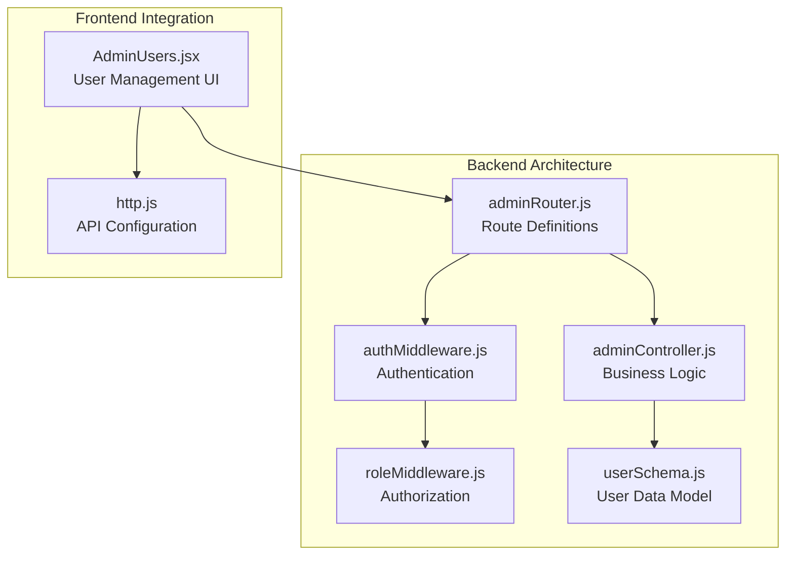
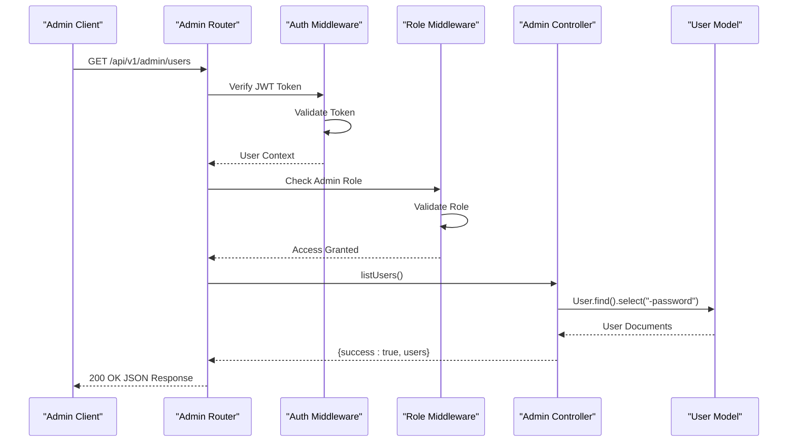
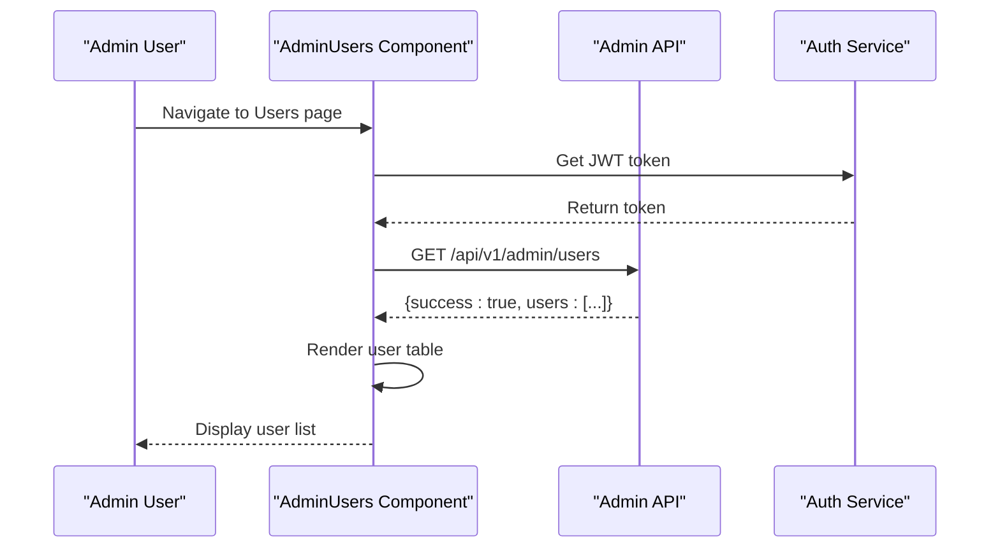
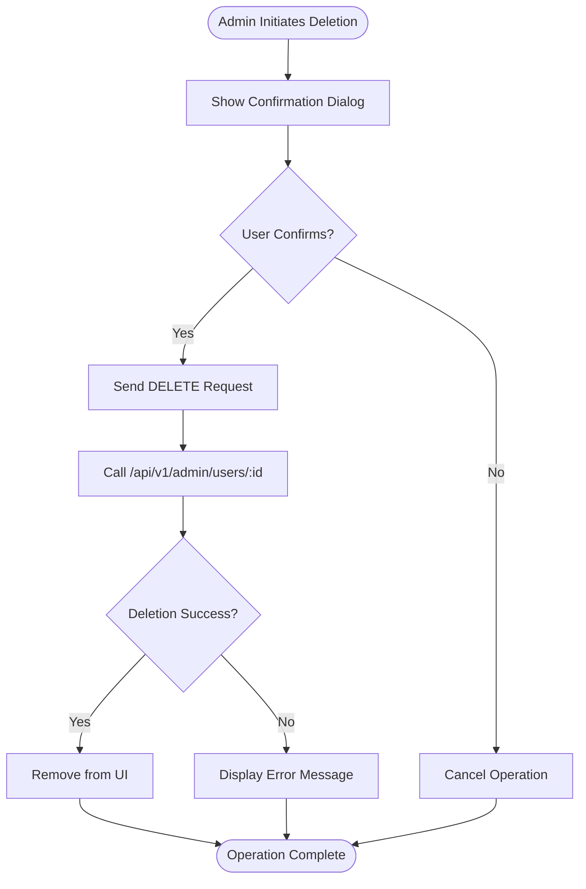

# Admin User Management API

<cite>
**Referenced Files in This Document**
- [adminController.js](file://backend/controller/adminController.js)
- [adminRouter.js](file://backend/router/adminRouter.js)
- [userSchema.js](file://backend/models/userSchema.js)
- [authMiddleware.js](file://backend/middleware/authMiddleware.js)
- [roleMiddleware.js](file://backend/middleware/roleMiddleware.js)
- [AdminUsers.jsx](file://frontend/src/pages/dashboards/AdminUsers.jsx)
- [AdminDashboard.jsx](file://frontend/src/pages/dashboards/AdminDashboard.jsx)
- [http.js](file://frontend/src/lib/http.js)
</cite>

## Table of Contents
1. [Introduction](#introduction)
2. [Project Structure](#project-structure)
3. [Core Components](#core-components)
4. [Architecture Overview](#architecture-overview)
5. [Detailed Component Analysis](#detailed-component-analysis)
6. [API Specifications](#api-specifications)
7. [Response Schemas](#response-schemas)
8. [User Management Workflows](#user-management-workflows)
9. [Error Handling](#error-handling)
10. [Performance Considerations](#performance-considerations)
11. [Troubleshooting Guide](#troubleshooting-guide)
12. [Conclusion](#conclusion)

## Introduction
This document provides comprehensive API documentation for admin user management endpoints in the Event Management System. It covers the administrative interface for managing users, including listing all users, deleting user accounts, and understanding user data structures. The documentation focuses on the GET `/api/v1/admin/users` endpoint for retrieving user profiles and the DELETE `/api/v1/admin/users/:id` endpoint for account deletion, along with related middleware and data models.

## Project Structure
The admin user management functionality is implemented using a modular backend architecture with clear separation of concerns:



**Diagram sources**
- [adminRouter.js:1-29](file://backend/router/adminRouter.js#L1-L29)
- [adminController.js:1-194](file://backend/controller/adminController.js#L1-L194)
- [userSchema.js:1-55](file://backend/models/userSchema.js#L1-L55)

**Section sources**
- [adminRouter.js:1-29](file://backend/router/adminRouter.js#L1-L29)
- [adminController.js:1-194](file://backend/controller/adminController.js#L1-L194)
- [userSchema.js:1-55](file://backend/models/userSchema.js#L1-L55)

## Core Components
The admin user management system consists of several key components working together:

### Backend Components
- **Router Layer**: Defines REST endpoints with authentication and authorization middleware
- **Controller Layer**: Implements business logic for user operations
- **Middleware Layer**: Handles JWT authentication and role-based authorization
- **Model Layer**: Defines user data structure and validation rules

### Frontend Components
- **AdminUsers Page**: Displays user listings and integrates with admin APIs
- **HTTP Configuration**: Manages API base URLs and authentication headers

**Section sources**
- [adminRouter.js:18-22](file://backend/router/adminRouter.js#L18-L22)
- [adminController.js:9-87](file://backend/controller/adminController.js#L9-L87)
- [AdminUsers.jsx:11-14](file://frontend/src/pages/dashboards/AdminUsers.jsx#L11-L14)

## Architecture Overview
The admin user management follows a layered architecture pattern with clear separation between presentation, business logic, and data access layers:



**Diagram sources**
- [adminRouter.js:19](file://backend/router/adminRouter.js#L19)
- [authMiddleware.js:3-16](file://backend/middleware/authMiddleware.js#L3-L16)
- [roleMiddleware.js:1-9](file://backend/middleware/roleMiddleware.js#L1-L9)
- [adminController.js:9-16](file://backend/controller/adminController.js#L9-L16)

## Detailed Component Analysis

### Authentication and Authorization Middleware
The system implements robust security measures through two middleware layers:

#### Authentication Middleware (`authMiddleware.js`)
- Validates Bearer token format in Authorization header
- Verifies JWT signature using server secret
- Extracts user context (userId, role) for downstream processing
- Returns 401 Unauthorized for invalid or missing tokens

#### Role-Based Authorization (`roleMiddleware.js`)
- Ensures only admin users can access protected endpoints
- Supports multiple role validation through variadic arguments
- Returns 403 Forbidden for unauthorized access attempts

**Section sources**
- [authMiddleware.js:3-16](file://backend/middleware/authMiddleware.js#L3-L16)
- [roleMiddleware.js:1-9](file://backend/middleware/roleMiddleware.js#L1-L9)

### User Data Model (`userSchema.js`)
The user model defines the complete user profile structure:

```mermaid
classDiagram
class User {
+string _id
+string name
+string email
+string phone
+string businessName
+string serviceType
+string role
+string status
+string createdAt
+string updatedAt
+boolean password (select : false)
}
class UserRole {
<<enumeration>>
"user"
"admin"
"merchant"
}
class UserStatus {
<<enumeration>>
"active"
"inactive"
}
User --> UserRole : "enum"
User --> UserStatus : "enum"
```

**Diagram sources**
- [userSchema.js:4-52](file://backend/models/userSchema.js#L4-L52)

**Section sources**
- [userSchema.js:4-52](file://backend/models/userSchema.js#L4-L52)

### Admin Controller Operations
The admin controller provides essential user management operations:

#### List Users Operation
- Retrieves all user documents from MongoDB
- Excludes sensitive password field using projection
- Returns paginated results (MongoDB default behavior)
- Handles database errors gracefully

#### Delete User Operation
- Accepts user ID as URL parameter
- Performs immediate database deletion
- Returns confirmation message upon successful deletion
- No cascading effects to dependent records

**Section sources**
- [adminController.js:9-16](file://backend/controller/adminController.js#L9-L16)
- [adminController.js:79-87](file://backend/controller/adminController.js#L79-L87)

## API Specifications

### GET /api/v1/admin/users
Retrieves a list of all registered users with basic profile information.

**Authentication Required**: Yes
**Authorization Required**: Admin role only
**Response Format**: JSON

**Request Headers:**
- Authorization: Bearer {jwt_token}

**Response Body:**
```javascript
{
  "success": true,
  "users": [
    {
      "_id": "string",
      "name": "string",
      "email": "string",
      "phone": "string",
      "businessName": "string",
      "serviceType": "string",
      "role": "string",
      "status": "string",
      "createdAt": "datetime",
      "updatedAt": "datetime"
    }
  ]
}
```

**Error Responses:**
- 401 Unauthorized: Invalid or missing authentication token
- 403 Forbidden: Non-admin user attempting access
- 500 Internal Server Error: Database query failure

### DELETE /api/v1/admin/users/:id
Deletes a user account permanently from the system.

**Authentication Required**: Yes
**Authorization Required**: Admin role only
**URL Parameters:**
- id: User ID to delete

**Request Headers:**
- Authorization: Bearer {jwt_token}

**Response Body:**
```javascript
{
  "success": true,
  "message": "User deleted"
}
```

**Error Responses:**
- 401 Unauthorized: Invalid or missing authentication token
- 403 Forbidden: Non-admin user attempting access
- 500 Internal Server Error: Database deletion failure

**Section sources**
- [adminRouter.js:19](file://backend/router/adminRouter.js#L19)
- [adminRouter.js:22](file://backend/router/adminRouter.js#L22)
- [adminController.js:9-16](file://backend/controller/adminController.js#L9-L16)
- [adminController.js:79-87](file://backend/controller/adminController.js#L79-L87)

## Response Schemas

### User Profile Schema
The user response includes comprehensive profile information:

| Field | Type | Description | Required |
|-------|------|-------------|----------|
| `_id` | string | Unique user identifier | Yes |
| `name` | string | User's full name | Yes |
| `email` | string | User's email address | Yes |
| `phone` | string | Contact phone number | No |
| `businessName` | string | Merchant business name | No |
| `serviceType` | string | Service offering type | No |
| `role` | string | User role (user/admin/merchant) | Yes |
| `status` | string | Account status (active/inactive) | Yes |
| `createdAt` | datetime | Account creation timestamp | Yes |
| `updatedAt` | datetime | Last update timestamp | Yes |

**Section sources**
- [userSchema.js:6-49](file://backend/models/userSchema.js#L6-L49)

### Response Wrapper Schema
All API responses follow a consistent wrapper structure:

```javascript
{
  "success": boolean,
  "message": string,
  "users": array,
  "user": object
}
```

**Section sources**
- [adminController.js:11](file://backend/controller/adminController.js#L11)
- [adminController.js:83](file://backend/controller/adminController.js#L83)

## User Management Workflows

### User Listing Workflow
The frontend integration demonstrates the complete user listing process:



**Diagram sources**
- [AdminUsers.jsx:11-14](file://frontend/src/pages/dashboards/AdminUsers.jsx#L11-L14)
- [http.js:1-5](file://frontend/src/lib/http.js#L1-L5)

### User Deletion Workflow
The deletion process follows a straightforward confirmation pattern:



**Diagram sources**
- [AdminDashboard.jsx:28-32](file://frontend/src/pages/dashboards/AdminDashboard.jsx#L28-L32)

**Section sources**
- [AdminUsers.jsx:11-14](file://frontend/src/pages/dashboards/AdminUsers.jsx#L11-L14)
- [AdminDashboard.jsx:28-32](file://frontend/src/pages/dashboards/AdminDashboard.jsx#L28-L32)

## Error Handling
The system implements comprehensive error handling across all layers:

### Authentication Errors
- **401 Unauthorized**: Missing, invalid, or expired JWT tokens
- **Cause**: Missing Authorization header or invalid token format
- **Response**: `{ success: false, message: "Unauthorized" }`

### Authorization Errors  
- **403 Forbidden**: Non-admin users attempting admin operations
- **Cause**: Valid token but insufficient role privileges
- **Response**: `{ success: false, message: "Forbidden" }`

### Database Errors
- **500 Internal Server Error**: Database query or connection failures
- **Cause**: MongoDB connectivity issues or query errors
- **Response**: `{ success: false, message: "Unknown Error" }`

### Validation Errors
- **400 Bad Request**: Missing required fields in requests
- **409 Conflict**: Duplicate resource conflicts (e.g., existing email)
- **404 Not Found**: Resource not found during operations

**Section sources**
- [authMiddleware.js:7-15](file://backend/middleware/authMiddleware.js#L7-L15)
- [roleMiddleware.js:3-6](file://backend/middleware/roleMiddleware.js#L3-L6)
- [adminController.js:35-41](file://backend/controller/adminController.js#L35-L41)

## Performance Considerations
The current implementation has several performance characteristics:

### Current Implementation
- **No Pagination**: The `listUsers` endpoint retrieves all users without pagination
- **Memory Usage**: Full result set loaded into memory for all users
- **Database Load**: Single query operation with field projection

### Recommended Optimizations
1. **Add Pagination Support**:
   ```javascript
   // Example pagination parameters
   const page = parseInt(req.query.page) || 1;
   const limit = parseInt(req.query.limit) || 10;
   const skip = (page - 1) * limit;
   ```

2. **Add Filtering Options**:
   - Role-based filtering: `GET /api/v1/admin/users?role=user`
   - Status-based filtering: `GET /api/v1/admin/users?status=active`
   - Date range filtering: `GET /api/v1/admin/users?createdAfter=2024-01-01`

3. **Add Sorting Support**:
   - Sort by creation date: `GET /api/v1/admin/users?sortBy=createdAt&order=desc`
   - Sort by name: `GET /api/v1/admin/users?sortBy=name&order=asc`

4. **Add Indexing**:
   - Create indexes on frequently queried fields: `email`, `role`, `status`, `createdAt`

**Section sources**
- [adminController.js:11](file://backend/controller/adminController.js#L11)

## Troubleshooting Guide

### Common Issues and Solutions

#### Authentication Failures
**Problem**: Receiving 401 Unauthorized responses
**Causes**:
- Missing Authorization header
- Invalid JWT token format
- Expired authentication token

**Solutions**:
1. Verify Bearer token format: `Authorization: Bearer {token}`
2. Check token expiration and refresh if needed
3. Validate JWT_SECRET environment variable

#### Authorization Failures  
**Problem**: Receiving 403 Forbidden responses
**Causes**:
- Valid token but non-admin user role
- Role not properly set in JWT payload

**Solutions**:
1. Verify admin user credentials
2. Check user role in database: `db.users.find({email: "admin@example.com"})`
3. Ensure proper JWT payload includes role claim

#### Database Connection Issues
**Problem**: Receiving 500 Internal Server Error
**Causes**:
- MongoDB connection failures
- Database query timeouts
- Network connectivity issues

**Solutions**:
1. Verify MongoDB connection string in environment
2. Check database server availability
3. Monitor database query performance

#### User Deletion Issues
**Problem**: User not being deleted
**Causes**:
- Invalid user ID format
- User ID not found in database
- Database write permissions issues

**Solutions**:
1. Validate ObjectId format: `^[0-9a-fA-F]{24}$`
2. Check user existence before deletion
3. Verify database write permissions

**Section sources**
- [authMiddleware.js:7-15](file://backend/middleware/authMiddleware.js#L7-L15)
- [roleMiddleware.js:3-6](file://backend/middleware/roleMiddleware.js#L3-L6)
- [adminController.js:82](file://backend/controller/adminController.js#L82)

## Conclusion
The admin user management API provides a solid foundation for administrative user operations with strong security measures and clear data structures. While the current implementation focuses on essential CRUD operations, future enhancements should include pagination, filtering, sorting capabilities, and comprehensive error handling to support production-scale usage.

The modular architecture ensures maintainability and extensibility, allowing for easy addition of new features such as bulk operations, user verification workflows, and advanced reporting capabilities. The frontend integration demonstrates practical usage patterns that can serve as templates for implementing similar administrative interfaces.