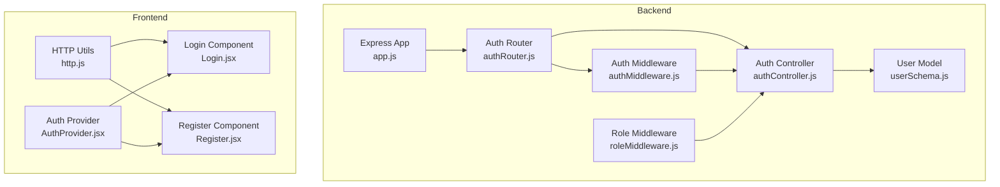
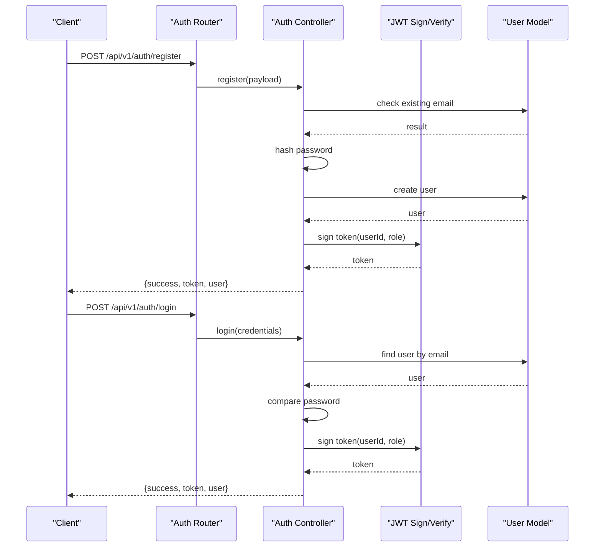
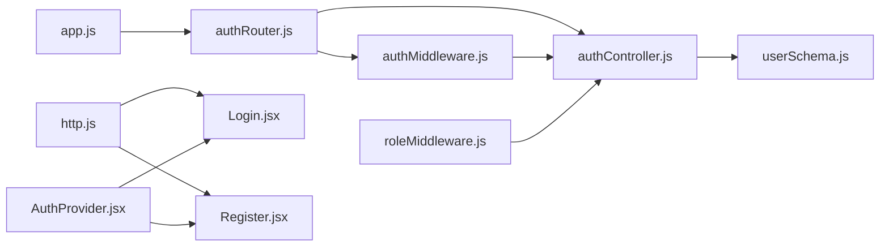
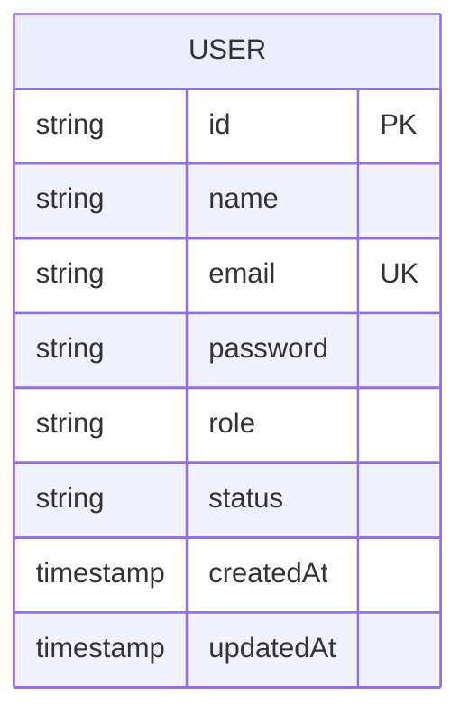
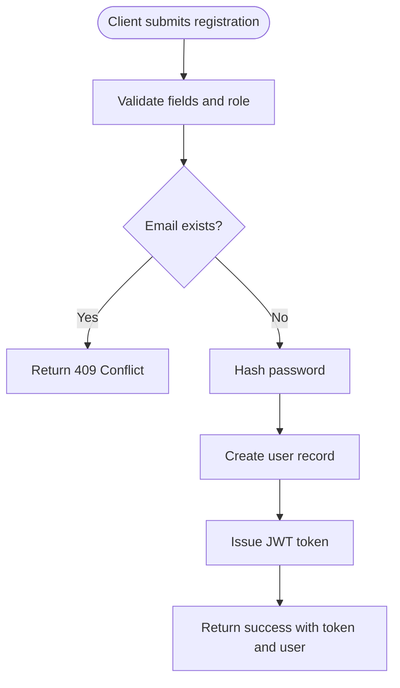
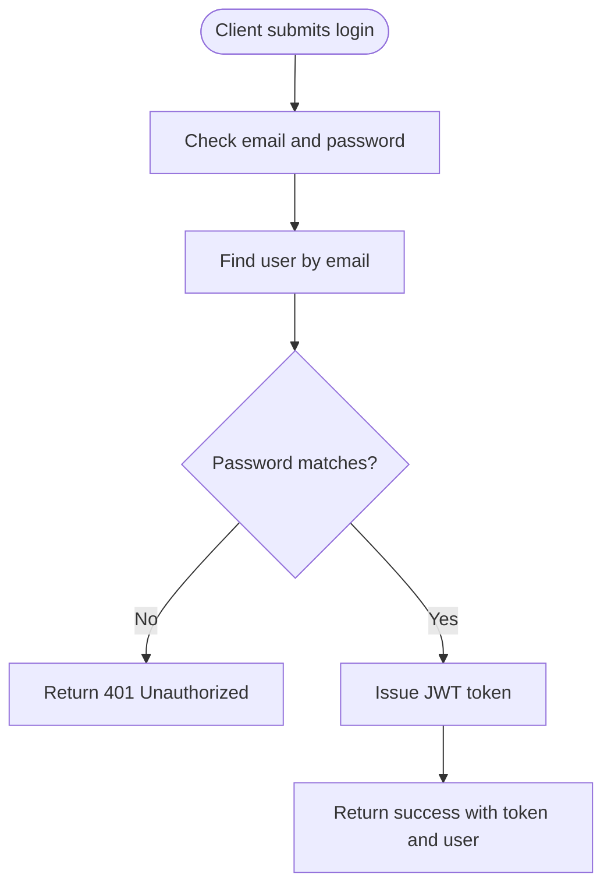
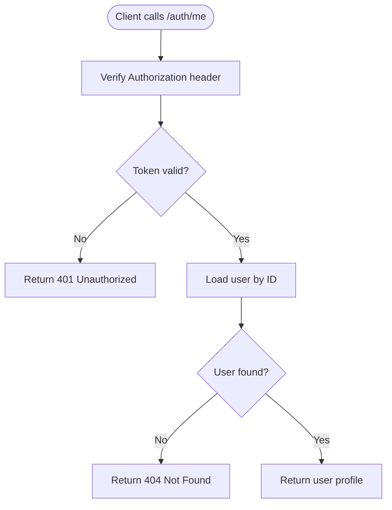

# Authentication API

<cite>
**Referenced Files in This Document**
- [authRouter.js](file://backend/router/authRouter.js)
- [authController.js](file://backend/controller/authController.js)
- [authMiddleware.js](file://backend/middleware/authMiddleware.js)
- [roleMiddleware.js](file://backend/middleware/roleMiddleware.js)
- [userSchema.js](file://backend/models/userSchema.js)
- [app.js](file://backend/app.js)
- [http.js](file://frontend/src/lib/http.js)
- [AuthProvider.jsx](file://frontend/src/context/AuthProvider.jsx)
- [Login.jsx](file://frontend/src/components/Login.jsx)
- [Register.jsx](file://frontend/src/components/Register.jsx)
- [mailer.js](file://backend/util/mailer.js)
</cite>

## Table of Contents
1. [Introduction](#introduction)
2. [Project Structure](#project-structure)
3. [Core Components](#core-components)
4. [Architecture Overview](#architecture-overview)
5. [Detailed Component Analysis](#detailed-component-analysis)
6. [Dependency Analysis](#dependency-analysis)
7. [Performance Considerations](#performance-considerations)
8. [Troubleshooting Guide](#troubleshooting-guide)
9. [Conclusion](#conclusion)
10. [Appendices](#appendices)

## Introduction
This document provides comprehensive API documentation for the Authentication system endpoints. It covers user registration, login, and profile retrieval. It also outlines JWT token handling, session management, role-based access patterns, and client-side integration patterns used by the frontend. Notably, logout and password reset endpoints are not present in the current codebase; therefore, this document focuses on the available endpoints and provides guidance for extending the system with logout and password reset capabilities.

## Project Structure
The authentication system spans backend routes, controllers, middleware, models, and frontend integration:
- Backend routing mounts the authentication endpoints under /api/v1/auth.
- Controllers implement registration, login, and profile retrieval logic.
- Middleware enforces JWT-based authentication and role-based access control.
- The user model defines schema-level validations and roles.
- Frontend integrates tokens via Authorization headers and persists them in local storage.

**Diagram sources**
- [app.js:35-36](file://backend/app.js#L35-L36)
- [authRouter.js:1-12](file://backend/router/authRouter.js#L1-L12)
- [authController.js:1-120](file://backend/controller/authController.js#L1-L120)
- [authMiddleware.js:1-17](file://backend/middleware/authMiddleware.js#L1-L17)
- [roleMiddleware.js:1-9](file://backend/middleware/roleMiddleware.js#L1-L9)
- [userSchema.js:1-55](file://backend/models/userSchema.js#L1-L55)
- [http.js:1-5](file://frontend/src/lib/http.js#L1-L5)
- [AuthProvider.jsx:1-38](file://frontend/src/context/AuthProvider.jsx#L1-L38)
- [Login.jsx:1-108](file://frontend/src/components/Login.jsx#L1-L108)
- [Register.jsx:1-93](file://frontend/src/components/Register.jsx#L1-L93)

**Section sources**
- [app.js:35-36](file://backend/app.js#L35-L36)
- [authRouter.js:1-12](file://backend/router/authRouter.js#L1-L12)

## Core Components
- Authentication Router: Defines endpoints for registration, login, and profile retrieval.
- Authentication Controller: Implements business logic for registration, login, and profile retrieval, including JWT issuance and bcrypt password hashing.
- Authentication Middleware: Validates Authorization headers and verifies JWT tokens.
- Role Middleware: Enforces role-based access control for protected routes.
- User Model: Enforces schema-level validations for name, email, password, role, and status.
- Frontend HTTP Utilities and Auth Provider: Manage base API URL, Authorization headers, and token persistence.

**Section sources**
- [authRouter.js:7-9](file://backend/router/authRouter.js#L7-L9)
- [authController.js:11-119](file://backend/controller/authController.js#L11-L119)
- [authMiddleware.js:3-16](file://backend/middleware/authMiddleware.js#L3-L16)
- [roleMiddleware.js:1-9](file://backend/middleware/roleMiddleware.js#L1-L9)
- [userSchema.js:4-52](file://backend/models/userSchema.js#L4-L52)
- [http.js:1-5](file://frontend/src/lib/http.js#L1-L5)
- [AuthProvider.jsx:5-32](file://frontend/src/context/AuthProvider.jsx#L5-L32)

## Architecture Overview
The authentication flow follows a standard JWT-based pattern:
- Registration hashes passwords and issues a signed JWT.
- Login validates credentials and issues a JWT.
- Profile retrieval requires a valid JWT.
- Role middleware can be applied to enforce role-based access.

**Diagram sources**
- [authRouter.js:7-8](file://backend/router/authRouter.js#L7-L8)
- [authController.js:11-107](file://backend/controller/authController.js#L11-L107)
- [authMiddleware.js:10](file://backend/middleware/authMiddleware.js#L10)
- [userSchema.js:33-37](file://backend/models/userSchema.js#L33-L37)

## Detailed Component Analysis

### Endpoint: POST /api/v1/auth/register
- Method: POST
- URL: /api/v1/auth/register
- Purpose: Registers a new user with validated credentials and role.
- Request body:
  - name: string, required
  - email: string, required, must be a valid email
  - password: string, required, minimum length enforced by model
  - role: string, optional, allowed values include "user", "merchant"; defaults to "user" if unspecified or invalid
- Response:
  - success: boolean
  - message: string
  - token: string (JWT)
  - user: object containing id, name, email, role
- Validation rules:
  - Name must be at least 3 characters.
  - Email must be unique and valid.
  - Password must be at least 6 characters.
  - Role must be one of "user", "merchant", "admin".
- Error responses:
  - 400 Bad Request: Missing required fields.
  - 409 Conflict: Email already registered.
  - 500 Internal Server Error: Unknown error during registration.
- Security:
  - Passwords are hashed using bcrypt before storage.
  - JWT issued with configured expiration.

**Section sources**
- [authRouter.js:7](file://backend/router/authRouter.js#L7)
- [authController.js:11-52](file://backend/controller/authController.js#L11-L52)
- [userSchema.js:6-10](file://backend/models/userSchema.js#L6-L10)
- [userSchema.js:26-32](file://backend/models/userSchema.js#L26-L32)
- [userSchema.js:33-37](file://backend/models/userSchema.js#L33-L37)
- [userSchema.js:39-44](file://backend/models/userSchema.js#L39-L44)

### Endpoint: POST /api/v1/auth/login
- Method: POST
- URL: /api/v1/auth/login
- Purpose: Authenticates an existing user and issues a JWT.
- Request body:
  - email: string, required
  - password: string, required
- Response:
  - success: boolean
  - message: string
  - token: string (JWT)
  - user: object containing id, name, email, role
- Validation rules:
  - Email must exist in the database.
  - Password must match the stored hash.
- Error responses:
  - 400 Bad Request: Missing email or password.
  - 401 Unauthorized: Invalid credentials.
  - 500 Internal Server Error: Server error during login.
- Security:
  - Password comparison uses bcrypt.
  - JWT issued with configured expiration.

**Section sources**
- [authRouter.js:8](file://backend/router/authRouter.js#L8)
- [authController.js:54-107](file://backend/controller/authController.js#L54-L107)
- [userSchema.js:33-37](file://backend/models/userSchema.js#L33-L37)

### Endpoint: GET /api/v1/auth/me
- Method: GET
- URL: /api/v1/auth/me
- Purpose: Retrieves the authenticated user’s profile.
- Authentication:
  - Requires a valid Authorization header with a Bearer token.
- Response:
  - success: boolean
  - user: object containing id, name, email, role (password excluded)
- Error responses:
  - 401 Unauthorized: Missing or invalid token.
  - 404 Not Found: User not found.
  - 500 Internal Server Error: Unknown error.
- Notes:
  - Token verification is performed by authentication middleware.

**Section sources**
- [authRouter.js:9](file://backend/router/authRouter.js#L9)
- [authController.js:109-119](file://backend/controller/authController.js#L109-L119)
- [authMiddleware.js:3-16](file://backend/middleware/authMiddleware.js#L3-L16)

### JWT Token Handling
- Issuance:
  - A signed JWT is generated upon successful registration and login.
  - Token payload includes userId and role.
  - Expiration is configurable via environment variable.
- Verification:
  - Authorization header must be present and start with "Bearer ".
  - Token signature is verified against the configured secret.
  - On success, request.user is populated with userId and role.
- Frontend usage:
  - Authorization header is constructed using the token utility.
  - Tokens are persisted in local storage by the Auth Provider.

**Section sources**
- [authController.js:5-9](file://backend/controller/authController.js#L5-L9)
- [authController.js:84](file://backend/controller/authController.js#L84)
- [authMiddleware.js:5-15](file://backend/middleware/authMiddleware.js#L5-L15)
- [http.js:2-4](file://frontend/src/lib/http.js#L2-L4)
- [AuthProvider.jsx:16-28](file://frontend/src/context/AuthProvider.jsx#L16-L28)

### Session Management
- Client-side:
  - Token and user data are stored in local storage.
  - Login updates context state and persists credentials.
  - Logout clears token and user from state and local storage.
- Server-side:
  - No server-managed session store is used; authentication relies solely on JWT validity.

**Section sources**
- [AuthProvider.jsx:5-32](file://frontend/src/context/AuthProvider.jsx#L5-L32)
- [Login.jsx:21-31](file://frontend/src/components/Login.jsx#L21-L31)
- [Register.jsx:17-25](file://frontend/src/components/Register.jsx#L17-L25)

### Role-Based Access Patterns
- Supported roles:
  - user, merchant, admin (as per model enum).
- Enforcement:
  - Use the role middleware to restrict routes to specific roles.
  - The middleware checks req.user.role against allowed roles and responds with 403 if unauthorized.
- Example usage:
  - Apply ensureRole("admin") to admin-only routes.
  - Apply ensureRole("merchant", "admin") to routes accessible to merchants and admins.

**Section sources**
- [userSchema.js:39-44](file://backend/models/userSchema.js#L39-L44)
- [roleMiddleware.js:1-9](file://backend/middleware/roleMiddleware.js#L1-L9)

### Password Security Requirements
- Minimum length: 6 characters.
- Hashing: Passwords are hashed using bcrypt before being stored.
- Retrieval: Password fields are excluded from queries by default.

**Section sources**
- [userSchema.js:33-37](file://backend/models/userSchema.js#L33-L37)
- [authController.js:31](file://backend/controller/authController.js#L31)
- [authController.js:66](file://backend/controller/authController.js#L66)

### Email Verification Workflow
- Current state:
  - No email verification endpoint or workflow is implemented in the codebase.
- Recommended approach:
  - Add a POST /api/v1/auth/request-email-verification endpoint to resend verification emails.
  - Add a GET /api/v1/auth/verify-email/:token endpoint to mark users as verified.
  - Integrate with the mailing utility for sending templated emails.

[No sources needed since this section provides recommended extensions]

### Logout Implementation
- Current state:
  - No logout endpoint exists in the backend; frontend logout removes tokens locally but does not invalidate tokens on the server.
- Recommended approach:
  - Add a POST /api/v1/auth/logout endpoint that accepts the current token and adds it to a server-side blacklist (revocation list) until token expiration.
  - Alternatively, reduce token TTL and refresh tokens periodically to limit exposure.

[No sources needed since this section provides recommended extensions]

### Password Reset Implementation
- Current state:
  - No password reset endpoint exists in the backend.
- Recommended approach:
  - Add a POST /api/v1/auth/reset-password-request endpoint to generate and email a secure reset token.
  - Add a POST /api/v1/auth/reset-password endpoint to validate the token and update the user’s password after hashing.
  - Use the mailing utility for sending reset emails.

[No sources needed since this section provides recommended extensions]

### Client Implementation Examples
- Base URL and headers:
  - Use the API base constant and auth headers utility to construct requests.
- Login flow:
  - Submit email and password to /api/v1/auth/login.
  - On success, persist token and user, then redirect based on role.
- Registration flow:
  - Submit name, email, password, and role to /api/v1/auth/register.
  - On success, persist token and user, then redirect based on role.
- Protected profile retrieval:
  - Call /api/v1/auth/me with Authorization: Bearer <token>.

**Section sources**
- [http.js:1-5](file://frontend/src/lib/http.js#L1-L5)
- [Login.jsx:21-31](file://frontend/src/components/Login.jsx#L21-L31)
- [Register.jsx:17-25](file://frontend/src/components/Register.jsx#L17-L25)
- [authRouter.js:9](file://backend/router/authRouter.js#L9)

### Common Usage Scenarios
- New user registration:
  - Client posts registration data; server responds with token and user info.
- Returning user login:
  - Client posts credentials; server responds with token and user info.
- Accessing protected profile:
  - Client includes Authorization header; server validates token and returns user profile.
- Role-based redirection:
  - After login, client redirects to appropriate dashboard based on user role.

**Section sources**
- [authController.js:42-47](file://backend/controller/authController.js#L42-L47)
- [authController.js:88-98](file://backend/controller/authController.js#L88-L98)
- [Login.jsx:34-53](file://frontend/src/components/Login.jsx#L34-L53)
- [Register.jsx:26-29](file://frontend/src/components/Register.jsx#L26-L29)

## Dependency Analysis

**Diagram sources**
- [authRouter.js:1-12](file://backend/router/authRouter.js#L1-L12)
- [authController.js:1-120](file://backend/controller/authController.js#L1-L120)
- [authMiddleware.js:1-17](file://backend/middleware/authMiddleware.js#L1-L17)
- [roleMiddleware.js:1-9](file://backend/middleware/roleMiddleware.js#L1-L9)
- [userSchema.js:1-55](file://backend/models/userSchema.js#L1-L55)
- [app.js:35-36](file://backend/app.js#L35-L36)
- [http.js:1-5](file://frontend/src/lib/http.js#L1-L5)
- [AuthProvider.jsx:1-38](file://frontend/src/context/AuthProvider.jsx#L1-L38)
- [Login.jsx:1-108](file://frontend/src/components/Login.jsx#L1-L108)
- [Register.jsx:1-93](file://frontend/src/components/Register.jsx#L1-L93)

**Section sources**
- [authRouter.js:1-12](file://backend/router/authRouter.js#L1-L12)
- [authController.js:1-120](file://backend/controller/authController.js#L1-L120)
- [authMiddleware.js:1-17](file://backend/middleware/authMiddleware.js#L1-L17)
- [roleMiddleware.js:1-9](file://backend/middleware/roleMiddleware.js#L1-L9)
- [userSchema.js:1-55](file://backend/models/userSchema.js#L1-L55)
- [app.js:35-36](file://backend/app.js#L35-L36)
- [http.js:1-5](file://frontend/src/lib/http.js#L1-L5)
- [AuthProvider.jsx:1-38](file://frontend/src/context/AuthProvider.jsx#L1-L38)
- [Login.jsx:1-108](file://frontend/src/components/Login.jsx#L1-L108)
- [Register.jsx:1-93](file://frontend/src/components/Register.jsx#L1-L93)

## Performance Considerations
- Token expiration: Configure JWT expiration to balance security and user experience.
- Password hashing cost: Keep bcrypt salt rounds reasonable to avoid excessive CPU usage during registration/login.
- Database queries: Ensure email indexing is enabled to optimize findOne operations.
- Middleware overhead: Avoid redundant token verification by applying auth middleware only where necessary.

[No sources needed since this section provides general guidance]

## Troubleshooting Guide
- Missing Authorization header:
  - Symptom: 401 Unauthorized on /api/v1/auth/me.
  - Resolution: Ensure Authorization: Bearer <token> is included in the request.
- Invalid or expired token:
  - Symptom: 401 Unauthorized on protected routes.
  - Resolution: Re-authenticate the user to obtain a new token.
- Invalid credentials:
  - Symptom: 401 Unauthorized on login.
  - Resolution: Verify email and password correctness; ensure the user exists.
- Email already exists:
  - Symptom: 409 Conflict on registration.
  - Resolution: Prompt the user to log in or use a different email.
- Unknown server errors:
  - Symptom: 500 Internal Server Error.
  - Resolution: Check server logs for stack traces and environment configuration.

**Section sources**
- [authMiddleware.js:7-15](file://backend/middleware/authMiddleware.js#L7-L15)
- [authController.js:70-81](file://backend/controller/authController.js#L70-L81)
- [authController.js:28](file://backend/controller/authController.js#L28)
- [authController.js:49-51](file://backend/controller/authController.js#L49-L51)

## Conclusion
The authentication system provides secure registration, login, and profile retrieval using JWT-based stateless sessions. Role-based access control is supported via a dedicated middleware. While logout and password reset are not currently implemented, the existing JWT and middleware infrastructure offers a solid foundation for adding these features. Client-side integration is straightforward using Authorization headers and local storage persistence.

[No sources needed since this section summarizes without analyzing specific files]

## Appendices

### Data Models Diagram

**Diagram sources**
- [userSchema.js:4-52](file://backend/models/userSchema.js#L4-L52)

### Registration Flow

**Diagram sources**
- [authController.js:17-31](file://backend/controller/authController.js#L17-L31)
- [authController.js:31-38](file://backend/controller/authController.js#L31-L38)
- [authController.js:38](file://backend/controller/authController.js#L38)

### Login Flow

**Diagram sources**
- [authController.js:60-66](file://backend/controller/authController.js#L60-L66)
- [authController.js:74-75](file://backend/controller/authController.js#L74-L75)
- [authController.js:84](file://backend/controller/authController.js#L84)

### Profile Retrieval Flow

**Diagram sources**
- [authMiddleware.js:5-15](file://backend/middleware/authMiddleware.js#L5-L15)
- [authController.js:110-115](file://backend/controller/authController.js#L110-L115)