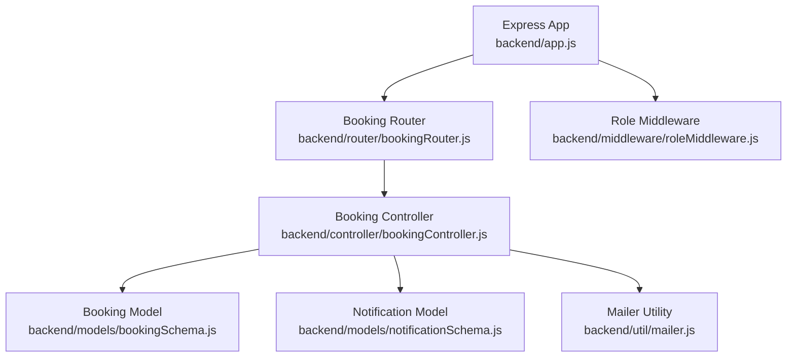
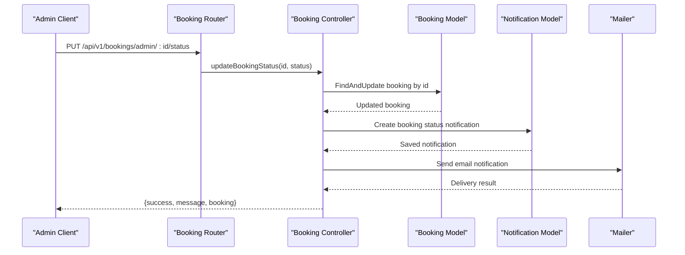
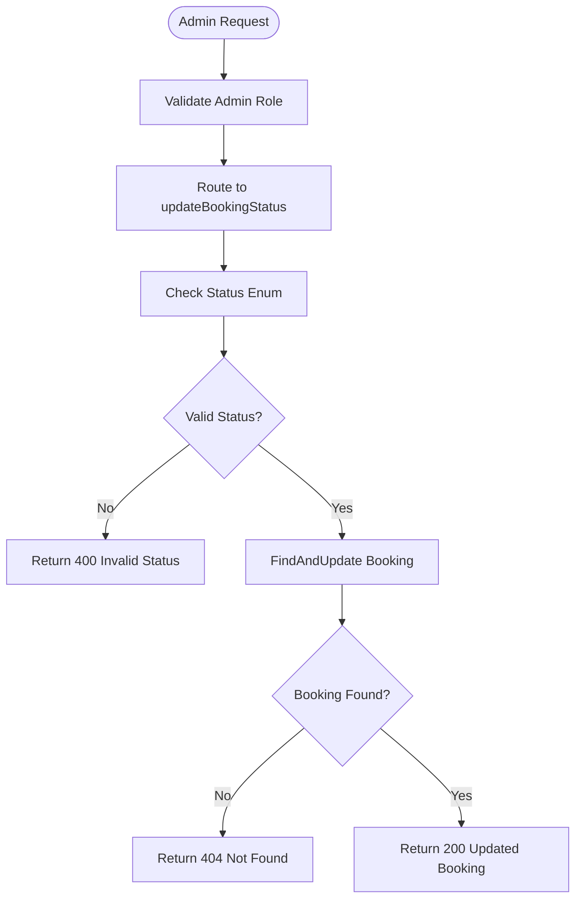
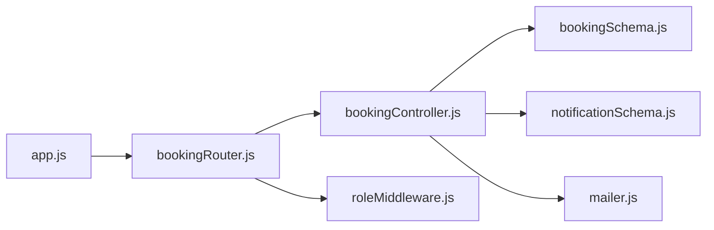

# Booking Management API

<cite>
**Referenced Files in This Document**
- [app.js](file://backend/app.js)
- [bookingRouter.js](file://backend/router/bookingRouter.js)
- [bookingController.js](file://backend/controller/bookingController.js)
- [bookingSchema.js](file://backend/models/bookingSchema.js)
- [notificationSchema.js](file://backend/models/notificationSchema.js)
- [mailer.js](file://backend/util/mailer.js)
- [roleMiddleware.js](file://backend/middleware/roleMiddleware.js)
- [BOOKING_WORKFLOW_IMPLEMENTATION.md](file://BOOKING_WORKFLOW_IMPLEMENTATION.md)
- [BOOKING_WORKFLOW_VERIFICATION.md](file://BOOKING_WORKFLOW_VERIFICATION.md)
</cite>

## Table of Contents
1. [Introduction](#introduction)
2. [Project Structure](#project-structure)
3. [Core Components](#core-components)
4. [Architecture Overview](#architecture-overview)
5. [Detailed Component Analysis](#detailed-component-analysis)
6. [Dependency Analysis](#dependency-analysis)
7. [Performance Considerations](#performance-considerations)
8. [Troubleshooting Guide](#troubleshooting-guide)
9. [Conclusion](#conclusion)
10. [Appendices](#appendices)

## Introduction
This document provides comprehensive API documentation for booking management operations with a focus on administrative oversight. It covers admin-only endpoints for viewing all bookings and updating booking statuses, along with the broader booking workflow, status transitions, approval processes, and integration with the notification system for confirmations, cancellations, and status changes. It also outlines bulk operations capabilities and audit trail considerations.

## Project Structure
The booking management API is organized around routers, controllers, models, middleware, and supporting utilities. The primary entry point mounts the booking router under the base path for API v1.

**Diagram sources**
- [app.js:35-47](file://backend/app.js#L35-L47)
- [bookingRouter.js:13-25](file://backend/router/bookingRouter.js#L13-L25)
- [bookingController.js:1-233](file://backend/controller/bookingController.js#L1-L233)
- [bookingSchema.js:1-53](file://backend/models/bookingSchema.js#L1-L53)
- [notificationSchema.js:1-36](file://backend/models/notificationSchema.js#L1-L36)
- [mailer.js:1-42](file://backend/util/mailer.js#L1-L42)
- [roleMiddleware.js:1-9](file://backend/middleware/roleMiddleware.js#L1-L9)

**Section sources**
- [app.js:35-47](file://backend/app.js#L35-L47)
- [bookingRouter.js:13-25](file://backend/router/bookingRouter.js#L13-L25)

## Core Components
- Booking Router: Defines user and admin endpoints for booking operations, including admin-only routes for listing all bookings and updating booking statuses.
- Booking Controller: Implements business logic for creating, retrieving, canceling, listing, and updating booking statuses, with admin-specific handlers.
- Booking Model: Defines the booking schema with status enumeration and related fields.
- Notification Model: Supports booking-related notifications with contextual fields for events and bookings.
- Mailer Utility: Provides email delivery abstraction for sending notifications.
- Role Middleware: Enforces admin-only access for sensitive endpoints.

Key endpoints:
- GET /api/v1/bookings/admin/all: Admin-only endpoint to retrieve all bookings with user population.
- PUT /api/v1/bookings/admin/:id/status: Admin-only endpoint to update booking status.

**Section sources**
- [bookingRouter.js:21-23](file://backend/router/bookingRouter.js#L21-L23)
- [bookingController.js:173-232](file://backend/controller/bookingController.js#L173-L232)
- [bookingSchema.js:36-40](file://backend/models/bookingSchema.js#L36-L40)
- [notificationSchema.js:18-30](file://backend/models/notificationSchema.js#L18-L30)
- [mailer.js:37-41](file://backend/util/mailer.js#L37-L41)
- [roleMiddleware.js:1-9](file://backend/middleware/roleMiddleware.js#L1-L9)

## Architecture Overview
The booking management API follows a layered architecture:
- HTTP Layer: Express routes define the API surface.
- Authentication and Authorization: Auth middleware ensures requests are authenticated; role middleware restricts endpoints to admins.
- Controller Layer: Orchestrates data retrieval, validation, persistence, and notification dispatch.
- Persistence Layer: Mongoose models represent bookings and notifications.
- Integration Layer: Mailer utility integrates with SMTP for email notifications.

**Diagram sources**
- [bookingRouter.js:22-23](file://backend/router/bookingRouter.js#L22-L23)
- [bookingController.js:193-232](file://backend/controller/bookingController.js#L193-L232)
- [bookingSchema.js:36-40](file://backend/models/bookingSchema.js#L36-L40)
- [notificationSchema.js:18-30](file://backend/models/notificationSchema.js#L18-L30)
- [mailer.js:37-41](file://backend/util/mailer.js#L37-L41)

## Detailed Component Analysis

### Admin Endpoints: Viewing and Updating Bookings
- GET /api/v1/bookings/admin/all
  - Purpose: Retrieve all bookings, sorted by recency, with user details populated.
  - Access Control: Requires authentication and admin role.
  - Response: Array of bookings with user, service, and status fields.
  - Notes: Useful for administrative oversight and reporting.

- PUT /api/v1/bookings/admin/:id/status
  - Purpose: Update the status of a specific booking.
  - Access Control: Requires authentication and admin role.
  - Request Body: { status: "pending" | "confirmed" | "cancelled" | "completed" }
  - Validation: Rejects invalid statuses.
  - Response: Updated booking object.
  - Notes: Admins can enforce policy compliance and resolve disputes.

**Diagram sources**
- [bookingRouter.js:22-23](file://backend/router/bookingRouter.js#L22-L23)
- [bookingController.js:193-232](file://backend/controller/bookingController.js#L193-L232)
- [roleMiddleware.js:1-9](file://backend/middleware/roleMiddleware.js#L1-L9)

**Section sources**
- [bookingRouter.js:21-23](file://backend/router/bookingRouter.js#L21-L23)
- [bookingController.js:173-232](file://backend/controller/bookingController.js#L173-L232)
- [roleMiddleware.js:1-9](file://backend/middleware/roleMiddleware.js#L1-L9)

### Booking Status Transitions and Approval Workflows
The booking system supports a clear set of statuses and transitions:
- Status Enumeration: pending, confirmed, cancelled, completed.
- Transition Rules:
  - pending → confirmed (approval by authorized party)
  - pending → cancelled (rejection)
  - confirmed → completed (after payment or event completion)
  - cancelled bookings cannot be reactivated
  - completed bookings can be rated

These transitions are enforced by the controller and reflected in the model schema.

**Section sources**
- [bookingSchema.js:36-40](file://backend/models/bookingSchema.js#L36-L40)
- [bookingController.js:193-232](file://backend/controller/bookingController.js#L193-L232)
- [BOOKING_WORKFLOW_IMPLEMENTATION.md:11-20](file://BOOKING_WORKFLOW_IMPLEMENTATION.md#L11-L20)

### Administrative Controls and Audit Trail
Administrative controls:
- Role-based access: Only users with the admin role can access admin endpoints.
- Data visibility: Admins can view all bookings with user context.
- Status enforcement: Admins can override or correct booking statuses.

Audit trail considerations:
- Timestamps: Created and updated timestamps are maintained by the model.
- Populated user context: Admin listings include user names and emails for traceability.
- Notification context: Notifications include booking and event identifiers for linkage.

**Section sources**
- [roleMiddleware.js:1-9](file://backend/middleware/roleMiddleware.js#L1-L9)
- [bookingController.js:173-191](file://backend/controller/bookingController.js#L173-L191)
- [bookingSchema.js:49](file://backend/models/bookingSchema.js#L49)
- [notificationSchema.js:18-30](file://backend/models/notificationSchema.js#L18-L30)

### Integration with Notification Systems
The notification system supports booking-related events:
- Fields: user, message, read flag, optional eventId, bookingId, and type.
- Type enum: booking, payment, general.
- Integration points:
  - Admin updates can trigger notifications.
  - Email delivery via mailer utility supports confirmation and status change alerts.

Note: The current booking controller focuses on status updates and does not explicitly create notifications or send emails on status changes. Enhancements can be made to integrate notification creation and email dispatch during admin actions.

**Section sources**
- [notificationSchema.js:18-30](file://backend/models/notificationSchema.js#L18-L30)
- [mailer.js:37-41](file://backend/util/mailer.js#L37-L41)
- [bookingController.js:193-232](file://backend/controller/bookingController.js#L193-L232)

### Bulk Booking Management Operations
Current implementation:
- Admin listing endpoint retrieves all bookings, enabling bulk filtering and reporting.
- Status updates operate on individual bookings via the PUT endpoint.

Recommended enhancements for true bulk operations:
- Batch status update endpoint accepting an array of booking IDs and target status.
- Bulk cancellation or completion workflows with transactional safety.
- Export capabilities for audit and compliance reporting.

[No sources needed since this section provides enhancement recommendations]

### Admin Booking Management Scenarios
- Scenario 1: Investigate discrepancies
  - Admin GET /api/v1/bookings/admin/all to review all bookings.
  - Identify problematic entries and update status via PUT /api/v1/bookings/admin/:id/status.

- Scenario 2: Correct system errors
  - Admin discovers bookings stuck in pending due to payment failures.
  - Admin updates status to cancelled or completed as appropriate.

- Scenario 3: Compliance oversight
  - Admin reviews recent bookings and ensures proper approvals and completions.

[No sources needed since this section describes operational scenarios]

## Dependency Analysis
The booking module depends on:
- Authentication and role middleware for access control.
- Mongoose models for data persistence.
- Notification and mailer utilities for communication.

**Diagram sources**
- [bookingRouter.js:13-25](file://backend/router/bookingRouter.js#L13-L25)
- [bookingController.js:1-233](file://backend/controller/bookingController.js#L1-L233)
- [bookingSchema.js:1-53](file://backend/models/bookingSchema.js#L1-L53)
- [notificationSchema.js:1-36](file://backend/models/notificationSchema.js#L1-L36)
- [mailer.js:1-42](file://backend/util/mailer.js#L1-L42)
- [roleMiddleware.js:1-9](file://backend/middleware/roleMiddleware.js#L1-L9)
- [app.js:35-47](file://backend/app.js#L35-L47)

**Section sources**
- [bookingRouter.js:13-25](file://backend/router/bookingRouter.js#L13-L25)
- [bookingController.js:1-233](file://backend/controller/bookingController.js#L1-L233)
- [bookingSchema.js:1-53](file://backend/models/bookingSchema.js#L1-L53)
- [notificationSchema.js:1-36](file://backend/models/notificationSchema.js#L1-L36)
- [mailer.js:1-42](file://backend/util/mailer.js#L1-L42)
- [roleMiddleware.js:1-9](file://backend/middleware/roleMiddleware.js#L1-L9)
- [app.js:35-47](file://backend/app.js#L35-L47)

## Performance Considerations
- Indexing: Consider adding indexes on frequently queried fields such as status, user, and timestamps to improve listing and filtering performance.
- Pagination: For large datasets, implement pagination in the admin listing endpoint to limit response sizes.
- Population: Populate only necessary fields to reduce payload size and improve response times.
- Caching: Cache static aggregates (e.g., counts by status) to reduce repeated aggregation queries.

[No sources needed since this section provides general guidance]

## Troubleshooting Guide
Common issues and resolutions:
- 403 Forbidden: Ensure the requester has the admin role and is authenticated.
- 400 Invalid Status: Confirm the status value matches the allowed enum.
- 404 Not Found: Verify the booking ID exists.
- 500 Internal Server Error: Check server logs for controller and model errors.

Operational checks:
- Verify route mounting in the application entry point.
- Confirm middleware order and presence for authentication and role checks.
- Validate model field definitions and enums.

**Section sources**
- [bookingController.js:193-232](file://backend/controller/bookingController.js#L193-L232)
- [roleMiddleware.js:1-9](file://backend/middleware/roleMiddleware.js#L1-L9)
- [bookingSchema.js:36-40](file://backend/models/bookingSchema.js#L36-L40)
- [app.js:35-47](file://backend/app.js#L35-L47)

## Conclusion
The booking management API provides robust admin capabilities for overseeing bookings, enforcing status transitions, and integrating with notifications and email systems. While current admin endpoints support listing and individual status updates, future enhancements can introduce true bulk operations and tighter notification/email integrations for comprehensive administrative control and auditability.

## Appendices

### API Reference Summary
- GET /api/v1/bookings/admin/all
  - Description: List all bookings with user details.
  - Authentication: Required.
  - Authorization: Admin only.
  - Response: Array of bookings.

- PUT /api/v1/bookings/admin/:id/status
  - Description: Update booking status.
  - Authentication: Required.
  - Authorization: Admin only.
  - Request Body: { status: enum["pending","confirmed","cancelled","completed"] }.
  - Response: Updated booking object.

**Section sources**
- [bookingRouter.js:21-23](file://backend/router/bookingRouter.js#L21-L23)
- [bookingController.js:173-232](file://backend/controller/bookingController.js#L173-L232)

### Workflow Context References
- Booking status transitions and workflow details are documented in the project's workflow implementation and verification documents.

**Section sources**
- [BOOKING_WORKFLOW_IMPLEMENTATION.md:11-20](file://BOOKING_WORKFLOW_IMPLEMENTATION.md#L11-L20)
- [BOOKING_WORKFLOW_VERIFICATION.md:254-268](file://BOOKING_WORKFLOW_VERIFICATION.md#L254-L268)