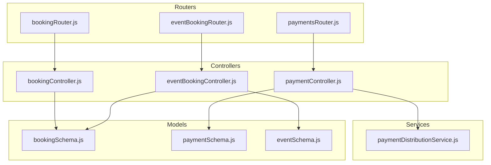
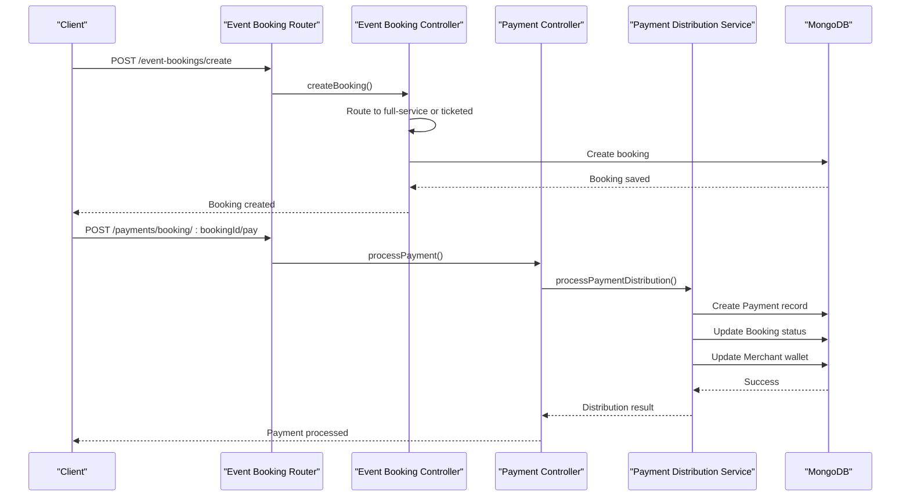
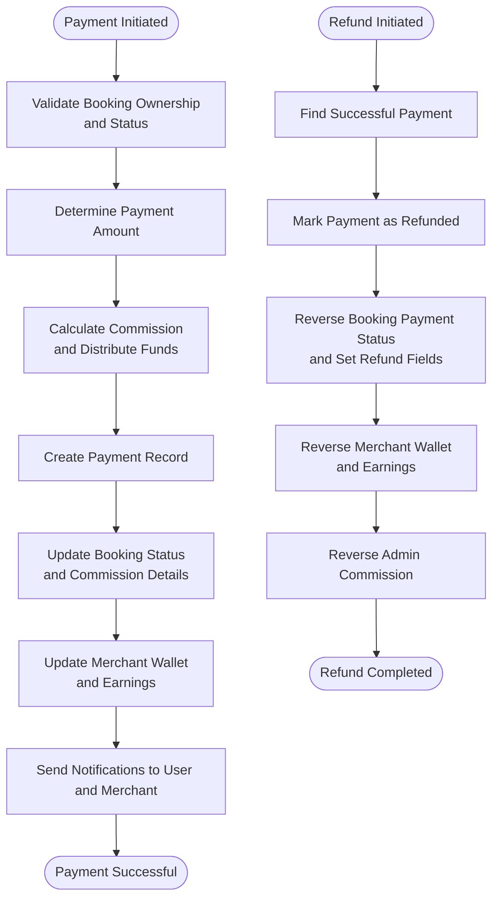
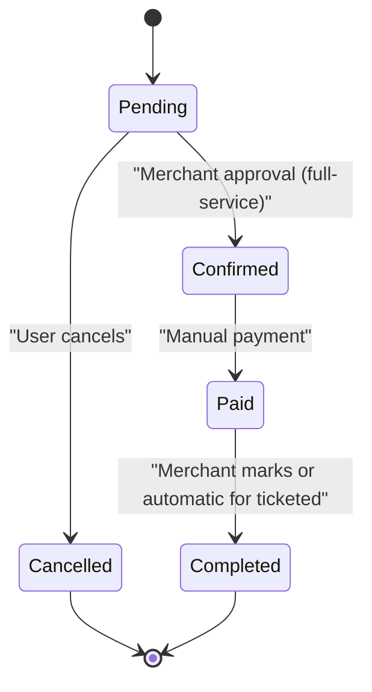
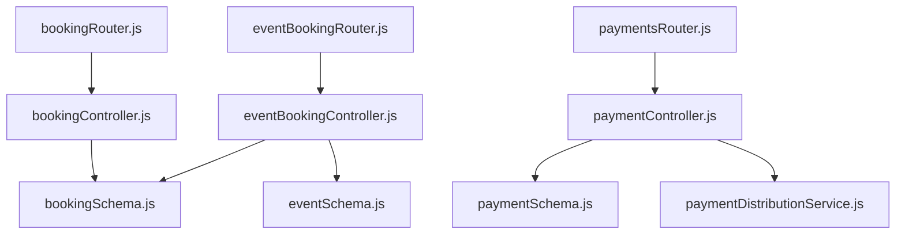

# Booking and Payment API

<cite>
**Referenced Files in This Document**
- [bookingRouter.js](file://backend/router/bookingRouter.js)
- [eventBookingRouter.js](file://backend/router/eventBookingRouter.js)
- [paymentsRouter.js](file://backend/router/paymentsRouter.js)
- [bookingController.js](file://backend/controller/bookingController.js)
- [eventBookingController.js](file://backend/controller/eventBookingController.js)
- [paymentController.js](file://backend/controller/paymentController.js)
- [paymentDistributionService.js](file://backend/services/paymentDistributionService.js)
- [bookingSchema.js](file://backend/models/bookingSchema.js)
- [paymentSchema.js](file://backend/models/paymentSchema.js)
- [eventSchema.js](file://backend/models/eventSchema.js)
</cite>

## Table of Contents
1. [Introduction](#introduction)
2. [Project Structure](#project-structure)
3. [Core Components](#core-components)
4. [Architecture Overview](#architecture-overview)
5. [Detailed Component Analysis](#detailed-component-analysis)
6. [Dependency Analysis](#dependency-analysis)
7. [Performance Considerations](#performance-considerations)
8. [Troubleshooting Guide](#troubleshooting-guide)
9. [Conclusion](#conclusion)

## Introduction
This document provides comprehensive API documentation for the Booking and Payment system endpoints. It covers:
- Booking creation for service-based bookings and ticketed events
- Booking management and status updates
- Payment processing workflows for both service and ticketed events
- Refund processing and cancellation policies
- Merchant notification systems and user communication flows
- Booking status transitions and payment confirmation flows
- Examples for different booking types and payment scenarios

## Project Structure
The Booking and Payment system is organized around routers, controllers, services, and models:
- Routers define the HTTP endpoints and apply authentication/authorization middleware
- Controllers implement business logic for bookings, event bookings, and payments
- Services encapsulate payment distribution and refund logic
- Models define the data structures for bookings, payments, and events

**Diagram sources**
- [bookingRouter.js:1-26](file://backend/router/bookingRouter.js#L1-L26)
- [eventBookingRouter.js:1-47](file://backend/router/eventBookingRouter.js#L1-L47)
- [paymentsRouter.js:1-44](file://backend/router/paymentsRouter.js#L1-L44)
- [bookingController.js:1-233](file://backend/controller/bookingController.js#L1-L233)
- [eventBookingController.js:1-1607](file://backend/controller/eventBookingController.js#L1-L1607)
- [paymentController.js:1-577](file://backend/controller/paymentController.js#L1-L577)
- [paymentDistributionService.js:1-340](file://backend/services/paymentDistributionService.js#L1-L340)
- [bookingSchema.js:1-53](file://backend/models/bookingSchema.js#L1-L53)
- [paymentSchema.js:1-142](file://backend/models/paymentSchema.js#L1-L142)
- [eventSchema.js:1-23](file://backend/models/eventSchema.js#L1-L23)

**Section sources**
- [bookingRouter.js:1-26](file://backend/router/bookingRouter.js#L1-L26)
- [eventBookingRouter.js:1-47](file://backend/router/eventBookingRouter.js#L1-L47)
- [paymentsRouter.js:1-44](file://backend/router/paymentsRouter.js#L1-L44)

## Core Components
- Booking Router: Handles service-based booking creation and user booking management
- Event Booking Router: Routes to appropriate handlers for full-service and ticketed events, manages approvals and notifications
- Payments Router: Provides payment initiation, verification, and refund endpoints
- Booking Controller: Manages service-based bookings (pending, confirmed, cancelled, completed)
- Event Booking Controller: Implements full-service and ticketed booking workflows, availability checks, coupon application, and status transitions
- Payment Controller: Processes manual payments, refunds, and provides statistics and merchant earnings
- Payment Distribution Service: Calculates commission, distributes funds, and reverses payments during refunds
- Models: Define schemas for bookings, payments, and events

**Section sources**
- [bookingController.js:1-233](file://backend/controller/bookingController.js#L1-L233)
- [eventBookingController.js:1-1607](file://backend/controller/eventBookingController.js#L1-L1607)
- [paymentController.js:1-577](file://backend/controller/paymentController.js#L1-L577)
- [paymentDistributionService.js:1-340](file://backend/services/paymentDistributionService.js#L1-L340)
- [bookingSchema.js:1-53](file://backend/models/bookingSchema.js#L1-L53)
- [paymentSchema.js:1-142](file://backend/models/paymentSchema.js#L1-L142)
- [eventSchema.js:1-23](file://backend/models/eventSchema.js#L1-L23)

## Architecture Overview
The system integrates user actions with merchant approvals and payment distributions:
- Users create bookings via routers mapped to controllers
- Event booking controller routes to full-service or ticketed handlers
- Payment controller orchestrates manual payment processing and refund workflows
- Payment distribution service ensures accurate commission and merchant payouts
- Notifications are generated for user and merchant communications

**Diagram sources**
- [eventBookingRouter.js:27-33](file://backend/router/eventBookingRouter.js#L27-L33)
- [eventBookingController.js:7-73](file://backend/controller/eventBookingController.js#L7-L73)
- [paymentController.js:11-141](file://backend/controller/paymentController.js#L11-L141)
- [paymentDistributionService.js:33-159](file://backend/services/paymentDistributionService.js#L33-L159)

## Detailed Component Analysis

### Service-Based Booking Endpoints
- Endpoint: POST /api/v1/bookings
  - Purpose: Create a service-based booking
  - Request body: serviceId, serviceTitle, serviceCategory, servicePrice, eventDate, notes, guestCount
  - Authentication: Required
  - Behavior:
    - Validates required fields
    - Prevents duplicate pending/confirmed bookings for the same service
    - Calculates totalPrice based on guestCount
    - Creates booking with status pending
  - Response: 201 with booking details or 400/409/500 on errors

- Endpoint: GET /api/v1/bookings/my-bookings
  - Purpose: Retrieve user’s service-based bookings
  - Authentication: Required
  - Response: 200 with array of bookings sorted by newest

- Endpoint: GET /api/v1/bookings/:id
  - Purpose: Retrieve a specific service-based booking by ID
  - Authentication: Required
  - Response: 200 with booking or 404 if not found

- Endpoint: PUT /api/v1/bookings/:id/cancel
  - Purpose: Cancel a service-based booking
  - Authentication: Required
  - Constraints: Cannot cancel if already cancelled or completed
  - Response: 200 with updated booking or 400/404/500

- Endpoint: Admin GET /api/v1/bookings/admin/all
  - Purpose: Fetch all service-based bookings
  - Authentication: Required + Admin role
  - Response: 200 with bookings

- Endpoint: Admin PUT /api/v1/bookings/admin/:id/status
  - Purpose: Update booking status (pending, confirmed, cancelled, completed)
  - Authentication: Required + Admin role
  - Response: 200 with updated booking or 400/404/500

**Section sources**
- [bookingRouter.js:15-23](file://backend/router/bookingRouter.js#L15-L23)
- [bookingController.js:4-70](file://backend/controller/bookingController.js#L4-L70)
- [bookingController.js:72-91](file://backend/controller/bookingController.js#L72-L91)
- [bookingController.js:93-122](file://backend/controller/bookingController.js#L93-L122)
- [bookingController.js:124-171](file://backend/controller/bookingController.js#L124-L171)
- [bookingController.js:173-191](file://backend/controller/bookingController.js#L173-L191)
- [bookingController.js:193-232](file://backend/controller/bookingController.js#L193-L232)

### Event Booking Workflows (Full-Service and Ticketed)
- Endpoint: POST /api/v1/event-bookings/create
  - Purpose: Generic booking creation that routes to full-service or ticketed handlers
  - Request body: eventId, quantity, plus additional fields for each type
  - Authentication: Required
  - Behavior:
    - Validates eventId and routes based on event.eventType
    - Logs and handles errors for missing or invalid event types

- Endpoint: POST /api/v1/event-bookings/full-service
  - Purpose: Create a full-service booking requiring merchant approval
  - Request body: eventId, serviceDate, notes, guestCount, couponCode
  - Authentication: Required
  - Availability and validation:
    - Checks for existing pending/confirmed bookings for the user and event
    - Applies coupon if provided with validation (expiry, usage limits, min amount)
  - Behavior:
    - Creates booking with status pending and paymentStatus pending
    - Updates coupon usage history if applicable
    - Sends notification to merchant

- Endpoint: POST /api/v1/event-bookings/ticketed
  - Purpose: Create a ticketed booking with immediate confirmation after payment
  - Request body: eventId, ticketType, quantity, paymentMethod, couponCode
  - Authentication: Required
  - Availability and validation:
    - Validates quantity > 0
    - Finds selected ticket type and checks availability
    - Applies coupon if provided with validation
  - Behavior:
    - Updates ticket availability (quantitySold and availableTickets)
    - Creates booking with status confirmed and paymentStatus pending
    - Generates paymentId and ticketId
    - Sends notification to user

- Endpoint: GET /api/v1/event-bookings/event/:eventId/tickets
  - Purpose: List ticket types with availability for a ticketed event
  - Authentication: Required
  - Response: 200 with ticket types and event details

- Endpoint: Merchant GET /api/v1/event-bookings/service-requests
  - Purpose: View full-service booking requests requiring approval
  - Authentication: Required + Merchant role
  - Response: 200 with bookings

- Endpoint: Merchant PUT /api/v1/event-bookings/:bookingId/approve
  - Purpose: Approve a full-service booking
  - Authentication: Required + Merchant role
  - Behavior: Updates bookingStatus to confirmed and notifies user

- Endpoint: Merchant PUT /api/v1/event-bookings/:bookingId/reject
  - Purpose: Reject a full-service booking
  - Authentication: Required + Merchant role
  - Behavior: Updates bookingStatus to cancelled and notifies user

- Endpoint: Merchant PUT /api/v1/event-bookings/:bookingId/complete
  - Purpose: Mark a full-service booking as completed (after payment)
  - Authentication: Required + Merchant role
  - Behavior: Updates status to completed and notifies user

- Endpoint: PUT /api/v1/event-bookings/:bookingId/pay
  - Purpose: Process manual payment for a booking
  - Authentication: Required
  - Behavior: Marks booking paymentStatus as paid and notifies merchant

- Endpoint: GET /api/v1/event-bookings/my-bookings
  - Purpose: Retrieve user’s event bookings
  - Authentication: Required
  - Response: 200 with formatted bookings including canPay and isConfirmed flags

- Endpoint: PUT /api/v1/event-bookings/:bookingId/status
  - Purpose: Update booking status (pending, processing, completed) for merchant
  - Authentication: Required + Merchant role
  - Behavior: Updates status and sends notifications

**Section sources**
- [eventBookingRouter.js:27-46](file://backend/router/eventBookingRouter.js#L27-L46)
- [eventBookingController.js:7-73](file://backend/controller/eventBookingController.js#L7-L73)
- [eventBookingController.js:75-319](file://backend/controller/eventBookingController.js#L75-L319)
- [eventBookingController.js:321-589](file://backend/controller/eventBookingController.js#L321-L589)
- [eventBookingController.js:591-633](file://backend/controller/eventBookingController.js#L591-L633)
- [eventBookingController.js:635-761](file://backend/controller/eventBookingController.js#L635-L761)
- [eventBookingController.js:795-892](file://backend/controller/eventBookingController.js#L795-L892)
- [eventBookingController.js:1095-1159](file://backend/controller/eventBookingController.js#L1095-L1159)
- [eventBookingController.js:1366-1413](file://backend/controller/eventBookingController.js#L1366-L1413)
- [eventBookingController.js:1415-1499](file://backend/controller/eventBookingController.js#L1415-L1499)

### Payment Processing Endpoints
- Endpoint: POST /api/v1/payments/booking/:bookingId/pay
  - Purpose: Process manual payment for a booking
  - Request body: paymentMethod, paymentAmount (optional)
  - Authentication: Required
  - Behavior:
    - Verifies booking ownership and status (must be pending/confirmed)
    - Prevents duplicate payments
    - Uses finalAmount or totalPrice if paymentAmount not provided
    - Generates transactionId and ticketId
    - Calls processPaymentDistribution to allocate funds and update records
    - Creates notifications for user and merchant
  - Response: 200 with payment details and distribution

- Endpoint: GET /api/v1/payments/user/bookings
  - Purpose: Retrieve user’s event bookings with payment eligibility
  - Authentication: Required
  - Response: 200 with formatted bookings including canPay and isConfirmed

- Endpoint: GET /api/v1/payments/booking/:bookingId
  - Purpose: Fetch booking details for payment
  - Authentication: Required
  - Response: 200 with booking and event details

- Endpoint: POST /api/v1/payments/booking/:bookingId/refund
  - Purpose: Process refund for a paid booking
  - Request body: refundReason
  - Authentication: Required
  - Authorization: Booking owner or admin
  - Behavior:
    - Validates paymentStatus is paid and not already refunded
    - Calls processRefund to reverse payment distribution
    - Updates booking and payment records
    - Creates notifications for user and merchant
  - Response: 200 with refund details

- Endpoint: GET /api/v1/payments/admin/statistics
  - Purpose: Admin dashboard payment statistics
  - Authentication: Required + Admin role
  - Response: 200 with revenue, commission, payouts, refunds, and monthly stats

- Endpoint: GET /api/v1/payments/merchant/earnings
  - Purpose: Merchant earnings summary and recent transactions
  - Authentication: Required + Merchant or Admin role
  - Response: 200 with wallet balance, lifetime earnings, total earnings, transactions, and monthly earnings

- Endpoint: GET /api/v1/payments/admin/all
  - Purpose: Admin view of all payments with pagination and filters
  - Authentication: Required + Admin role
  - Response: 200 with payments and pagination metadata

**Section sources**
- [paymentsRouter.js:27-42](file://backend/router/paymentsRouter.js#L27-L42)
- [paymentController.js:11-141](file://backend/controller/paymentController.js#L11-L141)
- [paymentController.js:143-219](file://backend/controller/paymentController.js#L143-L219)
- [paymentController.js:221-315](file://backend/controller/paymentController.js#L221-L315)
- [paymentController.js:317-399](file://backend/controller/paymentController.js#L317-L399)
- [paymentController.js:401-517](file://backend/controller/paymentController.js#L401-L517)
- [paymentController.js:519-577](file://backend/controller/paymentController.js#L519-L577)

### Payment Distribution and Refund Logic
- Commission Calculation:
  - Default admin commission percentage is applied to totalAmount
  - Merchant receives remaining amount after commission deduction

- Payment Distribution:
  - Creates Payment record with status success
  - Updates Booking with paymentStatus paid, status completed, and commission details
  - Updates Merchant walletBalance and totalEarnings
  - Updates Admin totalCommissionEarned

- Refund Processing:
  - Marks Payment as refunded and stores refund details
  - Reverses Booking paymentStatus and status to cancelled
  - Reverses Merchant walletBalance and totalEarnings
  - Reverses Admin totalCommissionEarned

**Diagram sources**
- [paymentDistributionService.js:33-159](file://backend/services/paymentDistributionService.js#L33-L159)
- [paymentDistributionService.js:167-251](file://backend/services/paymentDistributionService.js#L167-L251)

**Section sources**
- [paymentDistributionService.js:7-26](file://backend/services/paymentDistributionService.js#L7-L26)
- [paymentDistributionService.js:33-159](file://backend/services/paymentDistributionService.js#L33-L159)
- [paymentDistributionService.js:167-251](file://backend/services/paymentDistributionService.js#L167-L251)

### Booking Status Transitions
- Service-based bookings:
  - pending → confirmed → completed
  - pending → cancelled (via cancel endpoint)

- Event bookings:
  - Full-service: pending → confirmed (merchant approval) → completed (merchant marks)
  - Ticketed: confirmed → paid → completed (automatic after payment)

**Diagram sources**
- [bookingController.js:194-232](file://backend/controller/bookingController.js#L194-L232)
- [eventBookingController.js:635-761](file://backend/controller/eventBookingController.js#L635-L761)
- [eventBookingController.js:1095-1159](file://backend/controller/eventBookingController.js#L1095-L1159)

**Section sources**
- [bookingController.js:194-232](file://backend/controller/bookingController.js#L194-L232)
- [eventBookingController.js:635-761](file://backend/controller/eventBookingController.js#L635-L761)
- [eventBookingController.js:1095-1159](file://backend/controller/eventBookingController.js#L1095-L1159)

### Merchant Notification and User Communication
- Notifications are created for:
  - Booking creation (user and merchant)
  - Approval/rejection (full-service)
  - Payment received (merchant)
  - Status updates (pending, processing, completed)
  - Refund processed (user and merchant)

**Section sources**
- [eventBookingController.js:287-300](file://backend/controller/eventBookingController.js#L287-L300)
- [eventBookingController.js:671-683](file://backend/controller/eventBookingController.js#L671-L683)
- [eventBookingController.js:733-745](file://backend/controller/eventBookingController.js#L733-L745)
- [eventBookingController.js:1130-1143](file://backend/controller/eventBookingController.js#L1130-L1143)
- [eventBookingController.js:1454-1483](file://backend/controller/eventBookingController.js#L1454-L1483)
- [paymentController.js:89-114](file://backend/controller/paymentController.js#L89-L114)
- [paymentController.js:269-294](file://backend/controller/paymentController.js#L269-L294)

### Examples and Error Handling Patterns
- Service-based booking creation:
  - Example request: Provide serviceId, serviceTitle, serviceCategory, servicePrice, eventDate, notes, guestCount
  - Expected response: 201 with booking details
  - Error patterns: 400 (missing fields), 409 (duplicate active booking), 500 (server error)

- Ticketed booking creation:
  - Example request: eventId, ticketType, quantity, paymentMethod, couponCode (optional)
  - Expected response: 201 with booking and ticket details
  - Error patterns: 400 (invalid quantity, sold out, invalid ticket type), 404 (event not found), 500 (server error)

- Manual payment processing:
  - Example request: bookingId, paymentMethod, paymentAmount (optional)
  - Expected response: 200 with payment details and distribution
  - Error patterns: 403 (not authorized), 400 (invalid status, already paid), 404 (booking not found), 500 (server error)

- Refund processing:
  - Example request: bookingId, refundReason
  - Expected response: 200 with refund details
  - Error patterns: 403 (not authorized), 400 (not paid, already refunded), 404 (booking not found), 500 (server error)

**Section sources**
- [bookingController.js:4-70](file://backend/controller/bookingController.js#L4-L70)
- [eventBookingController.js:321-589](file://backend/controller/eventBookingController.js#L321-L589)
- [paymentController.js:11-141](file://backend/controller/paymentController.js#L11-L141)
- [paymentController.js:221-315](file://backend/controller/paymentController.js#L221-L315)

## Dependency Analysis
- Routers depend on controllers for request handling
- Controllers depend on models for data persistence
- Payment controller depends on payment distribution service for financial operations
- Event booking controller depends on event model for ticket availability and pricing
- Controllers rely on middleware for authentication and role-based authorization

**Diagram sources**
- [bookingRouter.js:1-26](file://backend/router/bookingRouter.js#L1-L26)
- [eventBookingRouter.js:1-47](file://backend/router/eventBookingRouter.js#L1-L47)
- [paymentsRouter.js:1-44](file://backend/router/paymentsRouter.js#L1-L44)
- [bookingController.js:1-233](file://backend/controller/bookingController.js#L1-L233)
- [eventBookingController.js:1-1607](file://backend/controller/eventBookingController.js#L1-L1607)
- [paymentController.js:1-577](file://backend/controller/paymentController.js#L1-L577)
- [paymentDistributionService.js:1-340](file://backend/services/paymentDistributionService.js#L1-L340)
- [bookingSchema.js:1-53](file://backend/models/bookingSchema.js#L1-L53)
- [paymentSchema.js:1-142](file://backend/models/paymentSchema.js#L1-L142)
- [eventSchema.js:1-23](file://backend/models/eventSchema.js#L1-L23)

**Section sources**
- [bookingRouter.js:1-26](file://backend/router/bookingRouter.js#L1-L26)
- [eventBookingRouter.js:1-47](file://backend/router/eventBookingRouter.js#L1-L47)
- [paymentsRouter.js:1-44](file://backend/router/paymentsRouter.js#L1-L44)

## Performance Considerations
- Indexes on Payment model improve query performance for user and merchant analytics
- Aggregation queries in payment statistics and merchant earnings should be monitored for large datasets
- Ticket availability updates are atomic per ticket type; ensure minimal contention by avoiding concurrent purchases for the same ticket type
- Notifications are created asynchronously; consider queueing for high-volume scenarios

## Troubleshooting Guide
- Common errors and resolutions:
  - Duplicate active booking: Ensure no pending or confirmed booking exists for the same service or event before creating a new one
  - Invalid coupon: Verify coupon validity, expiry, usage limits, and minimum order amount
  - Sold-out tickets: Check available quantity before attempting to book
  - Unauthorized access: Confirm user ownership of booking or admin/merchant role for privileged endpoints
  - Payment already processed: Prevent duplicate payments by checking paymentStatus before initiating payment
  - Refund already processed: Ensure paymentStatus is paid and not already refunded

**Section sources**
- [bookingController.js:26-38](file://backend/controller/bookingController.js#L26-L38)
- [eventBookingController.js:154-229](file://backend/controller/eventBookingController.js#L154-L229)
- [eventBookingController.js:377-391](file://backend/controller/eventBookingController.js#L377-L391)
- [paymentController.js:34-48](file://backend/controller/paymentController.js#L34-L48)
- [paymentController.js:247-261](file://backend/controller/paymentController.js#L247-L261)

## Conclusion
The Booking and Payment system provides a robust foundation for managing service-based and ticketed event bookings, integrating merchant approvals, payment processing, and automated notifications. The modular architecture with dedicated routers, controllers, services, and models enables clear separation of concerns and facilitates future enhancements such as integrating external payment gateways and scaling notification delivery.