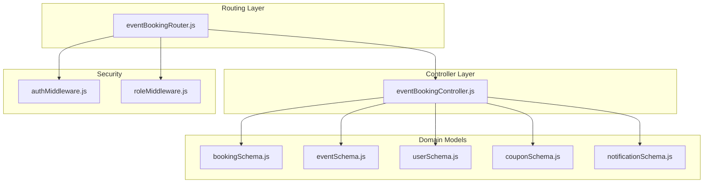
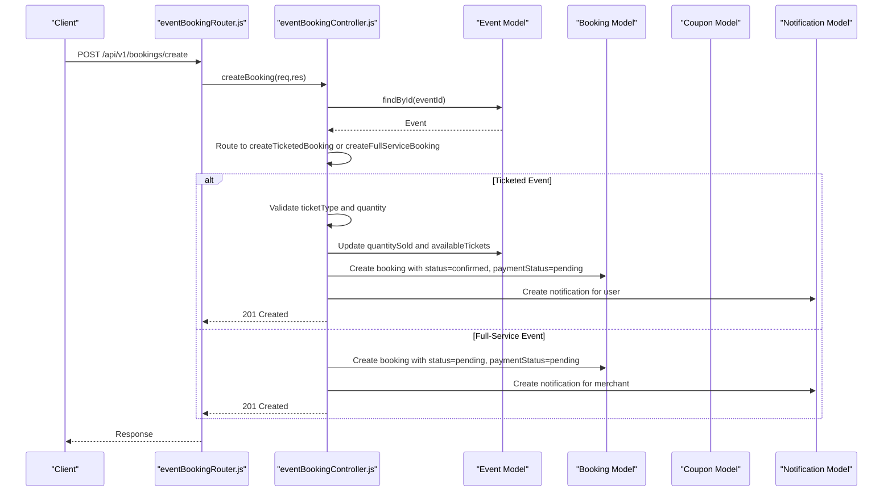
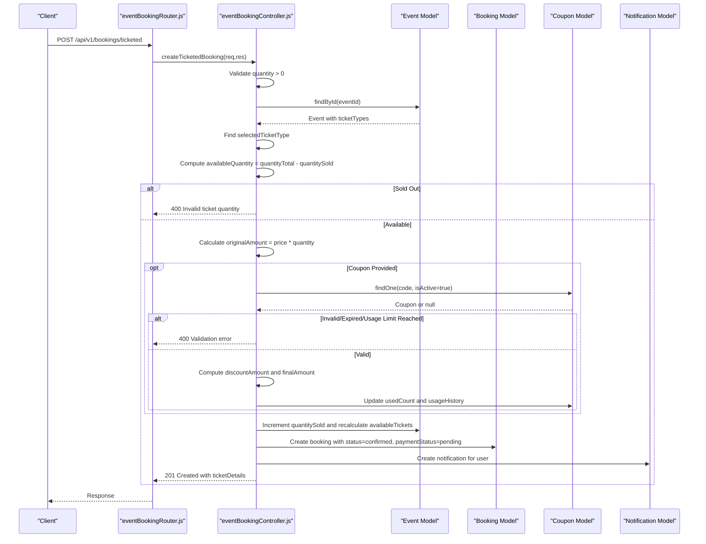
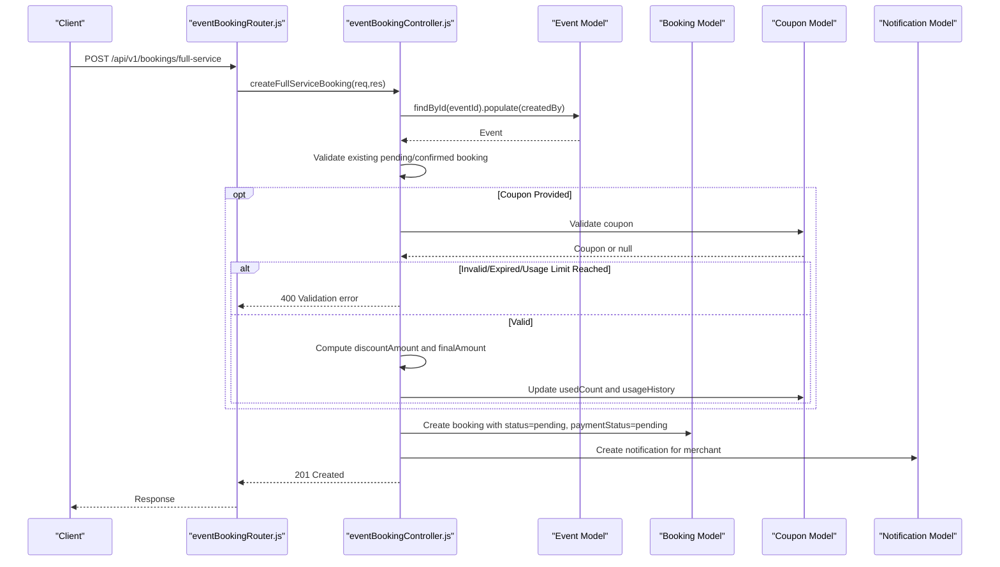
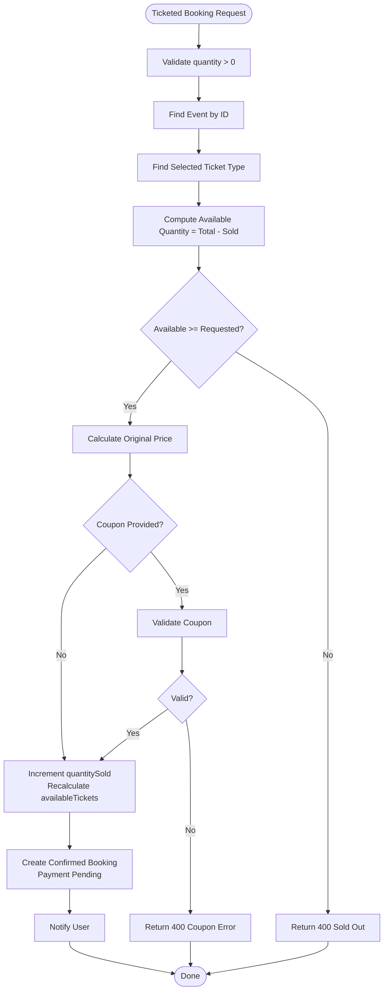
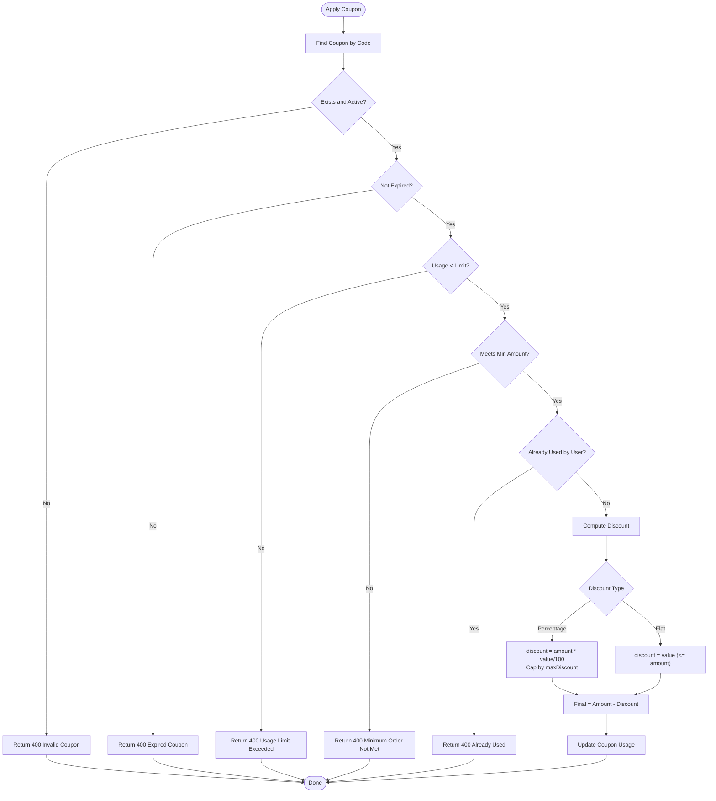
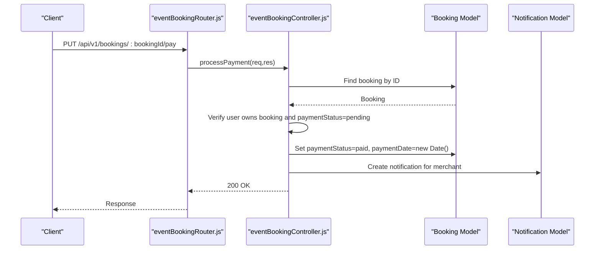
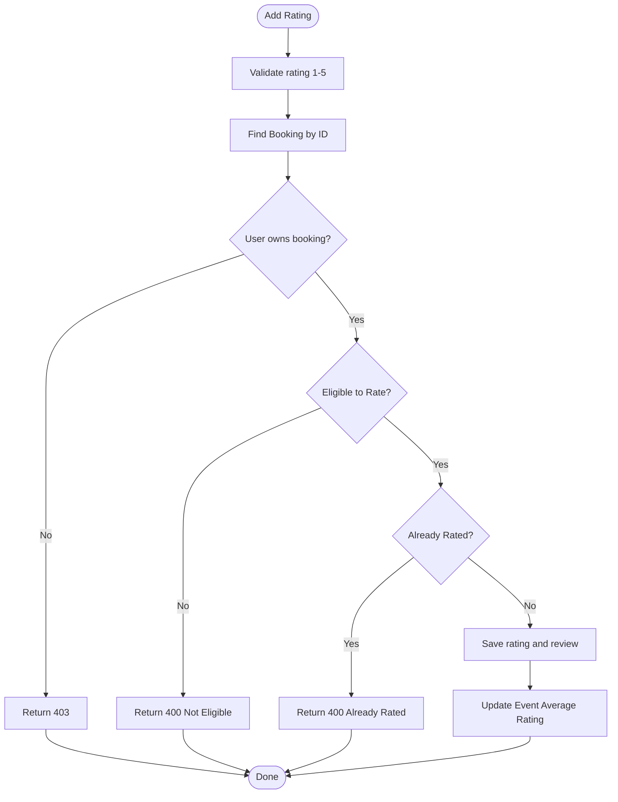
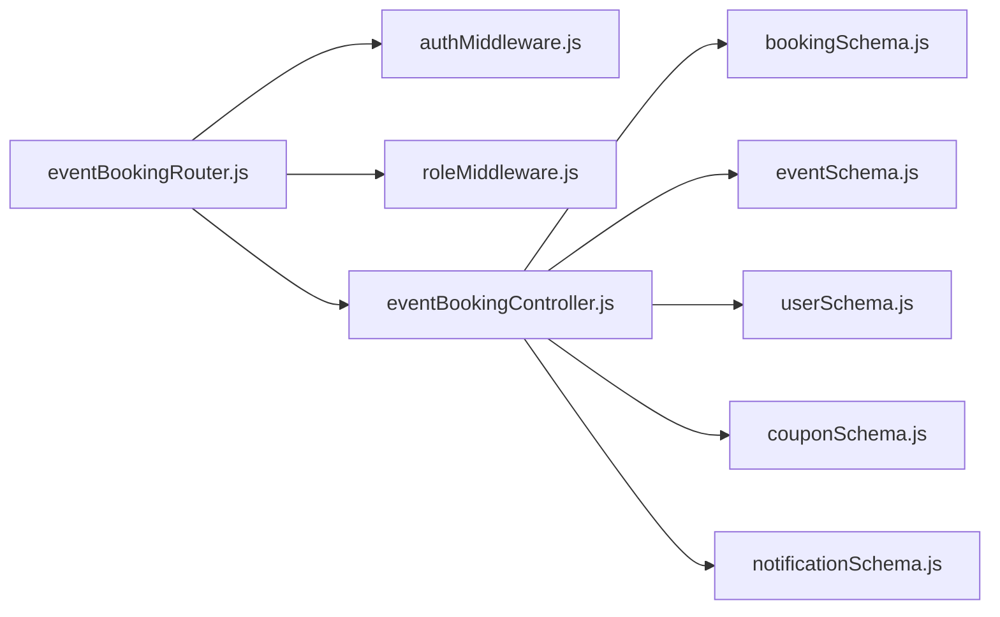

# Event Booking API

<cite>
**Referenced Files in This Document**
- [eventBookingController.js](file://backend/controller/eventBookingController.js)
- [eventBookingRouter.js](file://backend/router/eventBookingRouter.js)
- [bookingSchema.js](file://backend/models/bookingSchema.js)
- [eventSchema.js](file://backend/models/eventSchema.js)
- [userSchema.js](file://backend/models/userSchema.js)
- [couponSchema.js](file://backend/models/couponSchema.js)
- [notificationSchema.js](file://backend/models/notificationSchema.js)
- [authMiddleware.js](file://backend/middleware/authMiddleware.js)
- [roleMiddleware.js](file://backend/middleware/roleMiddleware.js)
- [create-test-ticketed-event-and-booking.js](file://backend/create-test-ticketed-event-and-booking.js)
- [test-ticket-booking-flow.js](file://backend/test-ticket-booking-flow.js)
- [test-ticket-booking-endpoint.js](file://backend/test-ticket-booking-endpoint.js)
</cite>

## Table of Contents
1. [Introduction](#introduction)
2. [Project Structure](#project-structure)
3. [Core Components](#core-components)
4. [Architecture Overview](#architecture-overview)
5. [Detailed Component Analysis](#detailed-component-analysis)
6. [Dependency Analysis](#dependency-analysis)
7. [Performance Considerations](#performance-considerations)
8. [Troubleshooting Guide](#troubleshooting-guide)
9. [Conclusion](#conclusion)
10. [Appendices](#appendices)

## Introduction
This document provides comprehensive API documentation for ticketed event booking endpoints. It covers event-specific booking creation, ticket quantity management, and event availability validation. It also documents endpoints for event booking workflows, ticket selection processes, and event-specific pricing calculations. The documentation explains integration with the event management system, ticket inventory tracking, and capacity restrictions. Examples of event booking requests, ticket validation logic, and error handling for sold-out events or invalid ticket quantities are included.

## Project Structure
The booking system is implemented as a modular backend service with dedicated controller, router, model, and middleware components. The router exposes endpoints grouped by roles (user, merchant), while the controller orchestrates business logic for booking creation, ticket validation, coupon application, and status updates. Models define the data structures for bookings, events, users, coupons, and notifications. Middleware enforces authentication and role-based access control.

**Diagram sources**
- [eventBookingRouter.js:1-47](file://backend/router/eventBookingRouter.js#L1-L47)
- [eventBookingController.js:1-1607](file://backend/controller/eventBookingController.js#L1-L1607)
- [bookingSchema.js:1-53](file://backend/models/bookingSchema.js#L1-L53)
- [eventSchema.js:1-51](file://backend/models/eventSchema.js#L1-L51)
- [userSchema.js:1-55](file://backend/models/userSchema.js#L1-L55)
- [couponSchema.js:1-123](file://backend/models/couponSchema.js#L1-L123)
- [notificationSchema.js:1-36](file://backend/models/notificationSchema.js#L1-L36)
- [authMiddleware.js:1-17](file://backend/middleware/authMiddleware.js#L1-L17)
- [roleMiddleware.js:1-9](file://backend/middleware/roleMiddleware.js#L1-L9)

**Section sources**
- [eventBookingRouter.js:1-47](file://backend/router/eventBookingRouter.js#L1-L47)
- [eventBookingController.js:1-1607](file://backend/controller/eventBookingController.js#L1-L1607)

## Core Components
- Event Booking Controller: Implements endpoints for creating ticketed and full-service bookings, retrieving ticket types, processing payments, rating and reviewing bookings, and managing merchant-side booking lifecycle.
- Event Booking Router: Defines HTTP routes for user and merchant operations, applying authentication and role middleware.
- Models:
  - Booking: Tracks booking records, statuses, pricing, and associations to users and events.
  - Event: Stores event metadata, ticket types, and inventory metrics.
  - User: Provides user identity and role for access control.
  - Coupon: Manages promotional discounts and usage constraints.
  - Notification: Handles user and merchant notifications for booking lifecycle events.
- Middleware:
  - Authentication: Extracts JWT and attaches user context.
  - Role-based Access Control: Restricts endpoints to eligible roles.

**Section sources**
- [eventBookingController.js:1-1607](file://backend/controller/eventBookingController.js#L1-L1607)
- [eventBookingRouter.js:1-47](file://backend/router/eventBookingRouter.js#L1-L47)
- [bookingSchema.js:1-53](file://backend/models/bookingSchema.js#L1-L53)
- [eventSchema.js:1-51](file://backend/models/eventSchema.js#L1-L51)
- [userSchema.js:1-55](file://backend/models/userSchema.js#L1-L55)
- [couponSchema.js:1-123](file://backend/models/couponSchema.js#L1-L123)
- [notificationSchema.js:1-36](file://backend/models/notificationSchema.js#L1-L36)
- [authMiddleware.js:1-17](file://backend/middleware/authMiddleware.js#L1-L17)
- [roleMiddleware.js:1-9](file://backend/middleware/roleMiddleware.js#L1-L9)

## Architecture Overview
The system follows a layered architecture:
- Router layer handles HTTP routing and applies middleware.
- Controller layer encapsulates business logic and interacts with models.
- Model layer defines schemas and persistence.
- Security layer enforces authentication and role checks.

**Diagram sources**
- [eventBookingRouter.js:26-34](file://backend/router/eventBookingRouter.js#L26-L34)
- [eventBookingController.js:8-73](file://backend/controller/eventBookingController.js#L8-L73)
- [eventBookingController.js:322-589](file://backend/controller/eventBookingController.js#L322-L589)
- [eventBookingController.js:76-319](file://backend/controller/eventBookingController.js#L76-L319)

## Detailed Component Analysis

### API Endpoints Overview
- User Endpoints
  - POST /api/v1/bookings/create: Generic booking creation routed by event type.
  - POST /api/v1/bookings/full-service: Creates a full-service booking requiring merchant approval.
  - POST /api/v1/bookings/ticketed: Creates a ticketed booking with immediate confirmation.
  - GET /api/v1/bookings/event/:eventId/tickets: Retrieves available ticket types and quantities.
  - GET /api/v1/bookings/my-bookings: Lists current user’s bookings.
  - PUT /api/v1/bookings/:bookingId/pay: Processes payment for a booking.
  - POST /api/v1/bookings/:bookingId/rating: Adds rating and review to a completed/paid booking.
- Merchant Endpoints
  - GET /api/v1/bookings/service-requests: Lists pending full-service booking requests.
  - GET /api/v1/bookings/merchant/bookings: Lists confirmed bookings (ticketed paid or full-service completed and paid).
  - PUT /api/v1/bookings/:id/accept: Accepts a pending booking (full-service).
  - PUT /api/v1/bookings/:id/reject: Rejects a pending booking (full-service).
  - PUT /api/v1/bookings/:id/complete: Marks a booking as completed (full-service).
  - PUT /api/v1/bookings/:bookingId/approve: Approves a full-service booking.
  - PUT /api/v1/bookings/:bookingId/reject: Rejects a full-service booking.
  - PUT /api/v1/bookings/:bookingId/complete: Marks a full-service booking as completed.
  - PUT /api/v1/bookings/:bookingId/status: Updates booking status (pending, processing, completed).

Authentication and roles are enforced via middleware:
- authMiddleware: Attaches user context from JWT.
- ensureRole: Restricts endpoints to specific roles (e.g., merchant).

**Section sources**
- [eventBookingRouter.js:26-46](file://backend/router/eventBookingRouter.js#L26-L46)
- [authMiddleware.js:1-17](file://backend/middleware/authMiddleware.js#L1-L17)
- [roleMiddleware.js:1-9](file://backend/middleware/roleMiddleware.js#L1-L9)

### Ticketed Booking Workflow
This workflow covers event-specific booking creation, ticket selection, quantity validation, pricing calculation with optional coupon, and payment processing.

**Diagram sources**
- [eventBookingRouter.js:29](file://backend/router/eventBookingRouter.js#L29)
- [eventBookingController.js:322-589](file://backend/controller/eventBookingController.js#L322-L589)
- [eventSchema.js:21-28](file://backend/models/eventSchema.js#L21-L28)
- [couponSchema.js:1-123](file://backend/models/couponSchema.js#L1-L123)

#### Request and Response Specifications
- Endpoint: POST /api/v1/bookings/ticketed
- Authentication: Required (Bearer token)
- Request Body Fields:
  - eventId: string (required)
  - ticketType: string (optional; defaults to first ticket type)
  - quantity: number (required; must be > 0)
  - paymentMethod: string (optional; defaults to Cash/Card)
  - couponCode: string (optional; applies discount if valid)
- Response Body Fields:
  - success: boolean
  - message: string
  - booking: object (booking details)
  - ticketDetails: object (ticketId, paymentId, eventTitle, eventDate, location, ticketType, quantity, originalAmount, discountAmount, finalAmount, couponApplied)

Validation Rules:
- quantity must be greater than 0.
- ticketType must match an existing ticket type.
- availableQuantity must be at least quantity.
- couponCode must be valid, not expired, within usage limits, meet minimum amount, and not already used by the user.

Error Codes:
- 400: Invalid ticket quantity, invalid ticket type, sold out, invalid coupon, usage limit exceeded, expired coupon, minimum order not met, already used coupon.
- 401: Unauthorized (missing/invalid token).
- 403: Forbidden (access denied).
- 404: Event not found, booking not found, user not found.
- 500: Internal server error.

**Section sources**
- [eventBookingController.js:322-589](file://backend/controller/eventBookingController.js#L322-L589)
- [eventSchema.js:21-28](file://backend/models/eventSchema.js#L21-L28)
- [couponSchema.js:1-123](file://backend/models/couponSchema.js#L1-L123)

### Full-Service Booking Workflow
Full-service events require merchant approval before payment. The workflow creates a pending booking, notifies the merchant, and supports acceptance, rejection, and completion.

**Diagram sources**
- [eventBookingRouter.js:28](file://backend/router/eventBookingRouter.js#L28)
- [eventBookingController.js:76-319](file://backend/controller/eventBookingController.js#L76-L319)

#### Merchant Operations
- Approve: PUT /api/v1/bookings/:bookingId/approve
- Reject: PUT /api/v1/bookings/:bookingId/reject (with reason)
- Accept: PUT /api/v1/bookings/:id/accept
- Reject: PUT /api/v1/bookings/:id/reject
- Complete: PUT /api/v1/bookings/:id/complete
- Update Status: PUT /api/v1/bookings/:bookingId/status (pending, processing, completed)

**Section sources**
- [eventBookingController.js:636-761](file://backend/controller/eventBookingController.js#L636-L761)
- [eventBookingController.js:894-1093](file://backend/controller/eventBookingController.js#L894-L1093)
- [eventBookingController.js:1415-1499](file://backend/controller/eventBookingController.js#L1415-L1499)

### Ticket Availability and Inventory Management
- Ticket types are stored per event with name, price, quantityTotal, and quantitySold.
- availableQuantity = quantityTotal - quantitySold.
- On successful ticketed booking, quantitySold is incremented and availableTickets is recalculated across all ticket types.
- Sold-out condition occurs when availableQuantity <= 0 or requested quantity exceeds availableQuantity.

**Diagram sources**
- [eventBookingController.js:377-491](file://backend/controller/eventBookingController.js#L377-L491)
- [eventSchema.js:21-28](file://backend/models/eventSchema.js#L21-L28)

**Section sources**
- [eventBookingController.js:377-491](file://backend/controller/eventBookingController.js#L377-L491)
- [eventSchema.js:21-28](file://backend/models/eventSchema.js#L21-L28)

### Pricing Calculations and Coupon Integration
- Ticketed Pricing: originalAmount = ticket.price × quantity.
- Full-Service Pricing: originalAmount = event.price.
- Coupon Validation:
  - Active and not expired.
  - Usage limit not reached.
  - Minimum order amount satisfied.
  - User has not already used the coupon.
- Discount Computation:
  - Percentage: discount = originalAmount × (discountValue / 100), capped by maxDiscount if provided.
  - Flat: discount = discountValue (capped by originalAmount).
- Final Amount: finalAmount = originalAmount - discountAmount.

**Diagram sources**
- [eventBookingController.js:399-474](file://backend/controller/eventBookingController.js#L399-L474)
- [eventBookingController.js:154-229](file://backend/controller/eventBookingController.js#L154-L229)
- [couponSchema.js:14-91](file://backend/models/couponSchema.js#L14-L91)

**Section sources**
- [eventBookingController.js:399-474](file://backend/controller/eventBookingController.js#L399-L474)
- [eventBookingController.js:154-229](file://backend/controller/eventBookingController.js#L154-L229)
- [couponSchema.js:14-91](file://backend/models/couponSchema.js#L14-L91)

### Payment Processing and Booking Completion
- Payment Processing: PUT /api/v1/bookings/:bookingId/pay sets paymentStatus to paid and records paymentDate.
- Ticketed Events: Auto-completion after payment (paymentStatus=paid implies completion).
- Full-Service Events: Merchant marks booking as completed after payment.

**Diagram sources**
- [eventBookingRouter.js:33](file://backend/router/eventBookingRouter.js#L33)
- [eventBookingController.js:1095-1159](file://backend/controller/eventBookingController.js#L1095-L1159)

**Section sources**
- [eventBookingController.js:1095-1159](file://backend/controller/eventBookingController.js#L1095-L1159)

### Rating and Review Workflow
- Endpoint: POST /api/v1/bookings/:bookingId/rating
- Conditions:
  - Ticketed: booking must be paid.
  - Full-Service: booking must be completed and paid.
- Duplicate rating prevention: isRated flag prevents re-rating.

**Diagram sources**
- [eventBookingRouter.js:34](file://backend/router/eventBookingRouter.js#L34)
- [eventBookingController.js:1161-1268](file://backend/controller/eventBookingController.js#L1161-L1268)

**Section sources**
- [eventBookingController.js:1161-1268](file://backend/controller/eventBookingController.js#L1161-L1268)

### Notifications
- Ticketed booking: notification created for the user after booking creation.
- Full-service booking: notification created for the merchant upon creation.
- Merchant actions: notifications created for user on approval, rejection, completion, and status updates.

**Section sources**
- [eventBookingController.js:545-556](file://backend/controller/eventBookingController.js#L545-L556)
- [eventBookingController.js:287-299](file://backend/controller/eventBookingController.js#L287-L299)
- [eventBookingController.js:671-682](file://backend/controller/eventBookingController.js#L671-L682)
- [eventBookingController.js:1454-1482](file://backend/controller/eventBookingController.js#L1454-L1482)

## Dependency Analysis
The controller depends on models and middleware for data access, validation, and security. The router composes endpoints with middleware and delegates to the controller.

**Diagram sources**
- [eventBookingRouter.js:1-47](file://backend/router/eventBookingRouter.js#L1-L47)
- [eventBookingController.js:1-1607](file://backend/controller/eventBookingController.js#L1-L1607)
- [authMiddleware.js:1-17](file://backend/middleware/authMiddleware.js#L1-L17)
- [roleMiddleware.js:1-9](file://backend/middleware/roleMiddleware.js#L1-L9)
- [bookingSchema.js:1-53](file://backend/models/bookingSchema.js#L1-L53)
- [eventSchema.js:1-51](file://backend/models/eventSchema.js#L1-L51)
- [userSchema.js:1-55](file://backend/models/userSchema.js#L1-L55)
- [couponSchema.js:1-123](file://backend/models/couponSchema.js#L1-L123)
- [notificationSchema.js:1-36](file://backend/models/notificationSchema.js#L1-L36)

**Section sources**
- [eventBookingRouter.js:1-47](file://backend/router/eventBookingRouter.js#L1-L47)
- [eventBookingController.js:1-1607](file://backend/controller/eventBookingController.js#L1-L1607)

## Performance Considerations
- Indexes: Coupon schema includes indexes on code, isActive/expiryDate, and createdBy to optimize lookups.
- Minimal Queries: Ticketed booking updates ticket quantities in-memory and persists once, reducing write amplification.
- Population: Controllers populate related entities only when necessary (e.g., user, merchant, event) to avoid heavy joins.
- Logging: Extensive logging aids debugging but should be tuned in production to reduce overhead.

[No sources needed since this section provides general guidance]

## Troubleshooting Guide
Common Issues and Resolutions:
- Authentication Failures:
  - Symptom: 401 Unauthorized on protected endpoints.
  - Cause: Missing or invalid Bearer token.
  - Resolution: Ensure Authorization header is present and valid.
- Role-Based Access Denied:
  - Symptom: 403 Forbidden on merchant endpoints.
  - Cause: User lacks merchant role.
  - Resolution: Authenticate as a merchant or use appropriate credentials.
- Event Not Found:
  - Symptom: 404 Event not found.
  - Cause: Invalid eventId.
  - Resolution: Verify event exists and belongs to the correct type.
- Ticket Sold Out:
  - Symptom: 400 Sold out or insufficient quantity.
  - Cause: Requested quantity exceeds availableQuantity.
  - Resolution: Select a lower quantity or choose another ticket type.
- Invalid Coupon:
  - Symptom: 400 errors for coupon-related validations.
  - Causes: Expired, usage limit reached, minimum order not met, already used.
  - Resolution: Provide a valid coupon meeting criteria.
- Payment Already Processed:
  - Symptom: 400 Already paid.
  - Cause: paymentStatus not pending.
  - Resolution: Check booking status before attempting payment.
- Rating Constraints:
  - Symptom: 400 Not eligible to rate.
  - Cause: Booking not paid or not completed (full-service).
  - Resolution: Complete payment and/or wait for merchant completion.

**Section sources**
- [eventBookingController.js:334-391](file://backend/controller/eventBookingController.js#L334-L391)
- [eventBookingController.js:408-449](file://backend/controller/eventBookingController.js#L408-L449)
- [eventBookingController.js:1118-1124](file://backend/controller/eventBookingController.js#L1118-L1124)
- [eventBookingController.js:1194-1207](file://backend/controller/eventBookingController.js#L1194-L1207)

## Conclusion
The Event Booking API provides robust support for ticketed and full-service event bookings. It enforces strict validation for ticket quantities, integrates coupon discounts with comprehensive checks, manages inventory efficiently, and supports end-to-end booking workflows with notifications. The modular design and middleware-based security ensure maintainable and secure operations.

[No sources needed since this section summarizes without analyzing specific files]

## Appendices

### Example Requests and Responses
- Create Ticketed Booking
  - Request: POST /api/v1/bookings/ticketed
  - Body: { eventId, ticketType, quantity, paymentMethod, couponCode }
  - Response: 201 with booking and ticketDetails
- Retrieve Ticket Types
  - Request: GET /api/v1/bookings/event/:eventId/tickets
  - Response: 200 with ticketTypes and eventDetails
- Process Payment
  - Request: PUT /api/v1/bookings/:bookingId/pay
  - Response: 200 with updated booking
- Add Rating
  - Request: POST /api/v1/bookings/:bookingId/rating { rating, review }
  - Response: 200 with updated booking

**Section sources**
- [eventBookingRouter.js:29](file://backend/router/eventBookingRouter.js#L29)
- [eventBookingRouter.js:30](file://backend/router/eventBookingRouter.js#L30)
- [eventBookingRouter.js:33](file://backend/router/eventBookingRouter.js#L33)
- [eventBookingRouter.js:34](file://backend/router/eventBookingRouter.js#L34)

### Test Scripts and Utilities
- create-test-ticketed-event-and-booking.js: Seeds test data for ticketed and full-service events and bookings.
- test-ticket-booking-flow.js: Exercises the complete ticket booking flow end-to-end.
- test-ticket-booking-endpoint.js: Validates endpoint accessibility and error responses.

**Section sources**
- [create-test-ticketed-event-and-booking.js:1-142](file://backend/create-test-ticketed-event-and-booking.js#L1-L142)
- [test-ticket-booking-flow.js:1-163](file://backend/test-ticket-booking-flow.js#L1-L163)
- [test-ticket-booking-endpoint.js:1-64](file://backend/test-ticket-booking-endpoint.js#L1-L64)