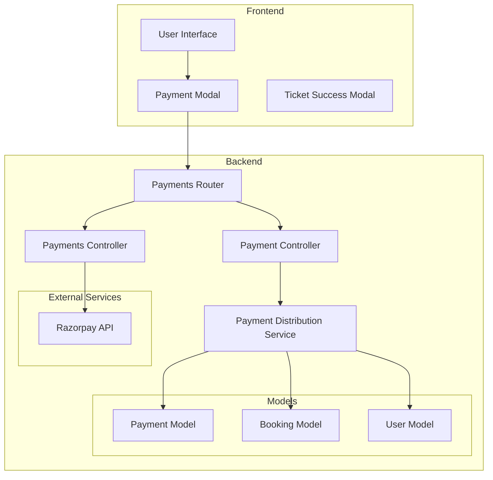
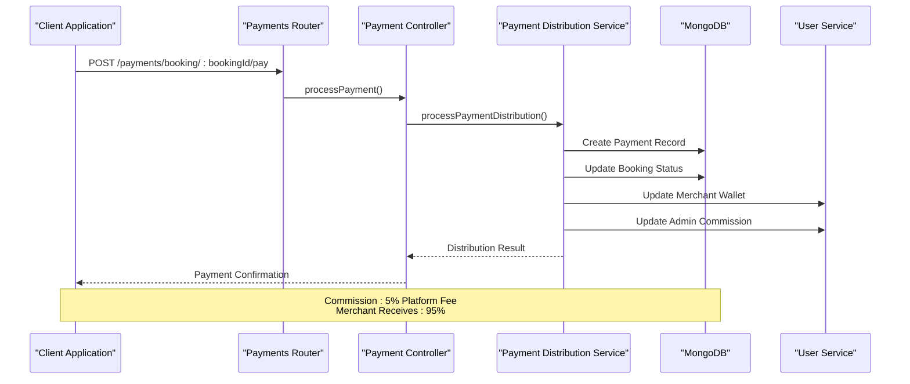
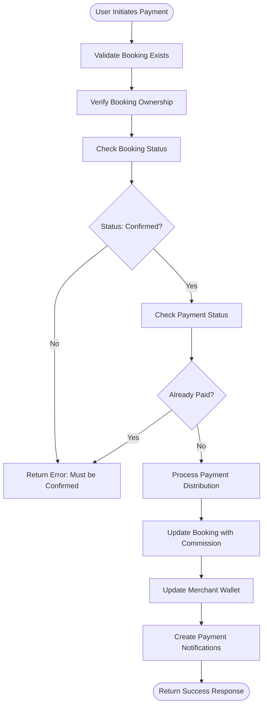
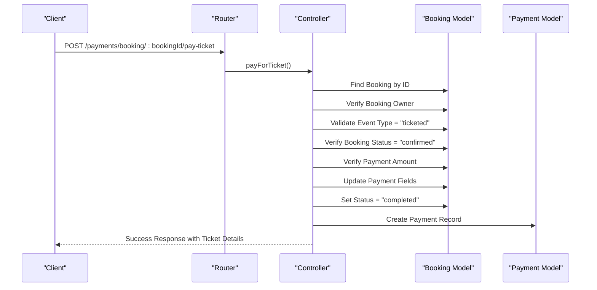
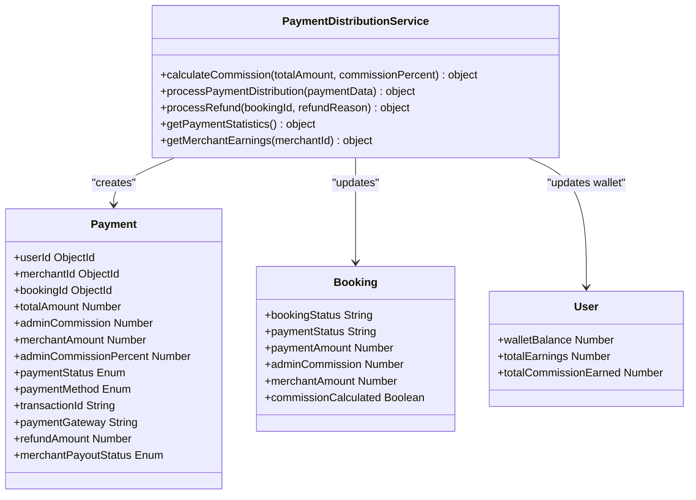
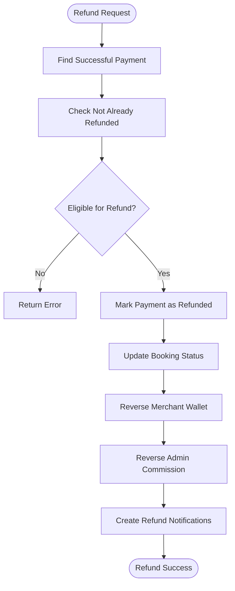
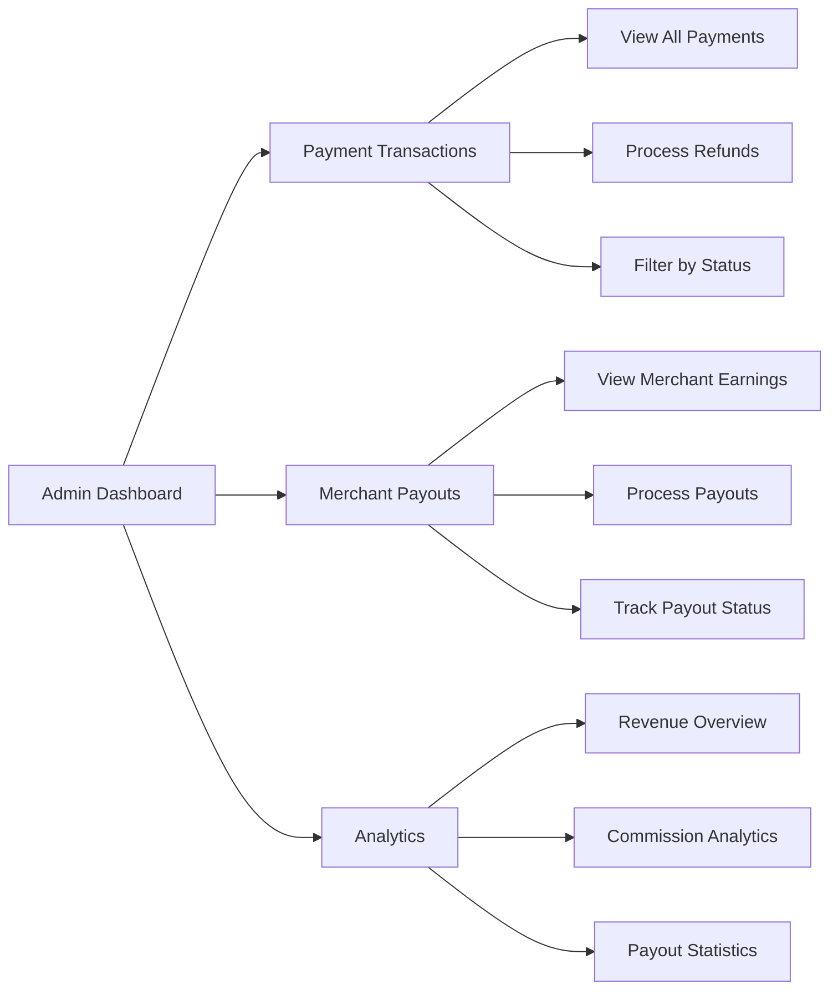
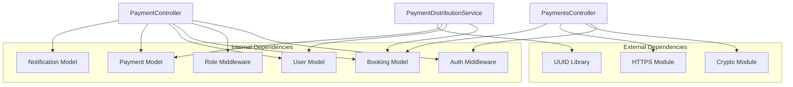

# Payment Processing API

<cite>
**Referenced Files in This Document**
- [paymentController.js](file://backend/controller/paymentController.js)
- [paymentsController.js](file://backend/controller/paymentsController.js)
- [paymentsRouter.js](file://backend/router/paymentsRouter.js)
- [paymentSchema.js](file://backend/models/paymentSchema.js)
- [paymentDistributionService.js](file://backend/services/paymentDistributionService.js)
- [bookingSchema.js](file://backend/models/bookingSchema.js)
- [userSchema.js](file://backend/models/userSchema.js)
- [eventBookingController.js](file://backend/controller/eventBookingController.js)
- [testPaymentFlow.js](file://backend/scripts/testPaymentFlow.js)
- [test-service-payment-flow.js](file://backend/test-service-payment-flow.js)
- [PAYMENT_FLOW_IMPLEMENTATION.md](file://PAYMENT_FLOW_IMPLEMENTATION.md)
- [ADMIN_PAYMENTS_IMPLEMENTATION_SUMMARY.md](file://ADMIN_PAYMENTS_IMPLEMENTATION_SUMMARY.md)
</cite>

## Table of Contents
1. [Introduction](#introduction)
2. [Project Structure](#project-structure)
3. [Core Components](#core-components)
4. [Architecture Overview](#architecture-overview)
5. [Detailed Component Analysis](#detailed-component-analysis)
6. [Dependency Analysis](#dependency-analysis)
7. [Performance Considerations](#performance-considerations)
8. [Troubleshooting Guide](#troubleshooting-guide)
9. [Conclusion](#conclusion)

## Introduction
This document provides comprehensive API documentation for the payment processing system in the MERN stack event booking platform. The system handles payment creation, confirmation, distribution, and refund processing across two distinct event types: full-service events requiring merchant approval and ticketed events with immediate confirmation after payment.

The payment system integrates with a commission-based distribution model where 5% of each transaction goes to the platform administrator, with the remaining amount distributed to merchants. The system supports both manual payment processing and integration with external payment providers like Razorpay.

## Project Structure
The payment processing system is organized across controllers, routers, models, services, and supporting scripts:



**Diagram sources**
- [paymentsRouter.js:1-44](file://backend/router/paymentsRouter.js#L1-L44)
- [paymentController.js:1-577](file://backend/controller/paymentController.js#L1-L577)
- [paymentsController.js:1-281](file://backend/controller/paymentsController.js#L1-L281)
- [paymentDistributionService.js:1-340](file://backend/services/paymentDistributionService.js#L1-L340)

**Section sources**
- [paymentsRouter.js:1-44](file://backend/router/paymentsRouter.js#L1-L44)
- [paymentController.js:1-577](file://backend/controller/paymentController.js#L1-L577)
- [paymentsController.js:1-281](file://backend/controller/paymentsController.js#L1-L281)
- [paymentDistributionService.js:1-340](file://backend/services/paymentDistributionService.js#L1-L340)

## Core Components

### Payment Controllers
The system uses two primary controllers to handle different payment workflows:

1. **Payment Controller** (`paymentController.js`): Manages the main booking payment workflow with commission distribution
2. **Payments Controller** (`paymentsController.js`): Handles external payment provider integration (currently Razorpay)

### Payment Distribution Service
The `paymentDistributionService.js` module centralizes all payment processing logic including:
- Commission calculation (5% platform fee)
- Payment record creation
- Merchant wallet updates
- Booking status synchronization
- Refund processing with reversal logic

### Payment Schema
The `paymentSchema.js` defines the complete payment data structure with support for:
- Transaction tracking with unique identifiers
- Commission breakdown (platform fee vs merchant amount)
- Refund processing capabilities
- Payout status tracking
- Currency and metadata support

**Section sources**
- [paymentController.js:1-577](file://backend/controller/paymentController.js#L1-L577)
- [paymentsController.js:1-281](file://backend/controller/paymentsController.js#L1-L281)
- [paymentDistributionService.js:1-340](file://backend/services/paymentDistributionService.js#L1-L340)
- [paymentSchema.js:1-142](file://backend/models/paymentSchema.js#L1-L142)

## Architecture Overview



**Diagram sources**
- [paymentController.js:11-141](file://backend/controller/paymentController.js#L11-L141)
- [paymentDistributionService.js:33-159](file://backend/services/paymentDistributionService.js#L33-L159)

The architecture follows a layered approach with clear separation of concerns:
- **Presentation Layer**: Express router handling HTTP requests
- **Business Logic Layer**: Payment controllers orchestrating workflows
- **Service Layer**: Payment distribution service managing financial calculations
- **Data Access Layer**: MongoDB models for persistence
- **Integration Layer**: External payment provider APIs

## Detailed Component Analysis

### Payment Creation Workflow

The payment creation process handles two distinct event types with different approval requirements:

#### Full-Service Event Payment Flow


**Diagram sources**
- [paymentController.js:11-141](file://backend/controller/paymentController.js#L11-L141)
- [paymentDistributionService.js:33-159](file://backend/services/paymentDistributionService.js#L33-L159)

#### Ticketed Event Payment Flow
Ticketed events follow a simplified flow with immediate confirmation after payment:



**Diagram sources**
- [paymentsController.js:188-280](file://backend/controller/paymentsController.js#L188-L280)

**Section sources**
- [paymentController.js:11-141](file://backend/controller/paymentController.js#L11-L141)
- [paymentsController.js:188-280](file://backend/controller/paymentsController.js#L188-L280)

### Payment Distribution System

The payment distribution system implements a commission-based model with automatic calculations:



**Diagram sources**
- [paymentDistributionService.js:16-159](file://backend/services/paymentDistributionService.js#L16-L159)
- [paymentSchema.js:3-142](file://backend/models/paymentSchema.js#L3-L142)

**Section sources**
- [paymentDistributionService.js:16-159](file://backend/services/paymentDistributionService.js#L16-L159)
- [paymentSchema.js:3-142](file://backend/models/paymentSchema.js#L3-L142)

### Refund Processing System

The refund system provides comprehensive refund capabilities with automatic reversal of all financial impacts:



**Diagram sources**
- [paymentDistributionService.js:167-251](file://backend/services/paymentDistributionService.js#L167-L251)

**Section sources**
- [paymentDistributionService.js:167-251](file://backend/services/paymentDistributionService.js#L167-L251)

### Admin Payment Management

The admin system provides comprehensive oversight of all payment transactions:



**Diagram sources**
- [paymentController.js:318-577](file://backend/controller/paymentController.js#L318-L577)
- [paymentDistributionService.js:257-340](file://backend/services/paymentDistributionService.js#L257-L340)

**Section sources**
- [paymentController.js:318-577](file://backend/controller/paymentController.js#L318-L577)
- [paymentDistributionService.js:257-340](file://backend/services/paymentDistributionService.js#L257-L340)

## Dependency Analysis

The payment system has well-defined dependencies that support scalability and maintainability:



**Diagram sources**
- [paymentController.js:1-10](file://backend/controller/paymentController.js#L1-L10)
- [paymentsController.js:1-6](file://backend/controller/paymentsController.js#L1-L6)
- [paymentDistributionService.js:1-6](file://backend/services/paymentDistributionService.js#L1-L6)

**Section sources**
- [paymentController.js:1-10](file://backend/controller/paymentController.js#L1-L10)
- [paymentsController.js:1-6](file://backend/controller/paymentsController.js#L1-L6)
- [paymentDistributionService.js:1-6](file://backend/services/paymentDistributionService.js#L1-L6)

## Performance Considerations

### Database Optimization
The payment system implements several performance optimizations:

1. **Indexing Strategy**: Composite indexes on frequently queried fields
2. **Aggregation Pipelines**: Efficient statistical calculations using MongoDB aggregation
3. **Population Optimization**: Selective field population to minimize data transfer
4. **Pagination**: Built-in pagination for large datasets

### Memory Management
- **Streaming Responses**: Large response bodies are streamed to reduce memory footprint
- **Batch Operations**: Bulk operations for refund processing and statistics
- **Connection Pooling**: Efficient database connection management

### Scalability Patterns
- **Modular Architecture**: Clear separation of concerns enables horizontal scaling
- **Service Layer**: Business logic encapsulation supports microservice adaptation
- **Asynchronous Processing**: Non-blocking operations for external API calls

## Troubleshooting Guide

### Common Payment Issues

#### Payment Duplication Prevention
The system implements multiple safeguards against duplicate payments:
- Unique transaction ID generation
- Payment existence validation per booking
- Atomic operation patterns for financial updates

#### Commission Calculation Errors
Common issues and solutions:
- **Amount Mismatch**: The system validates that adminCommission + merchantAmount = totalAmount
- **Rounding Precision**: Calculations use 2-decimal precision rounding
- **Commission Percentage**: Fixed 5% commission rate with configurable parameters

#### Refund Processing Failures
Potential issues:
- **Non-existent Payments**: Validates payment records exist before processing refunds
- **Already Refunded**: Prevents duplicate refund processing
- **Status Synchronization**: Ensures booking and payment status consistency

### Error Response Format
All payment endpoints follow a consistent error response format:
```json
{
  "success": false,
  "message": "Error description",
  "error": "Technical details (optional)"
}
```

### Debugging Tools
The system includes comprehensive logging throughout the payment flow:
- Request validation logs
- Business logic execution traces
- Database operation confirmations
- External API integration logs

**Section sources**
- [paymentController.js:133-140](file://backend/controller/paymentController.js#L133-L140)
- [paymentDistributionService.js:155-158](file://backend/services/paymentDistributionService.js#L155-L158)

## Conclusion

The payment processing system provides a robust, scalable foundation for handling various event booking payment scenarios. Key strengths include:

1. **Comprehensive Coverage**: Supports both full-service and ticketed event types
2. **Financial Integrity**: Automatic commission calculations with audit trails
3. **Administrative Control**: Complete admin dashboard for oversight and management
4. **Extensibility**: Modular design supports integration with additional payment providers
5. **Security Focus**: Proper validation, authorization, and error handling

The system successfully balances simplicity for basic use cases with flexibility for complex business requirements, making it suitable for production deployment while maintaining room for future enhancements.