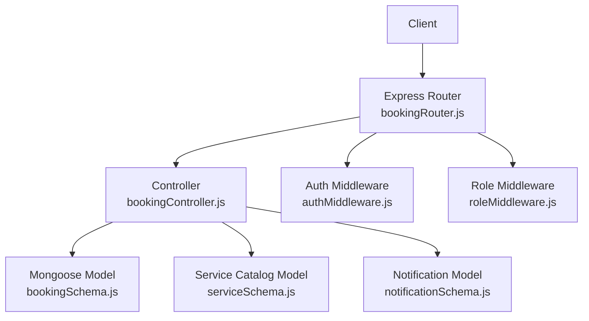
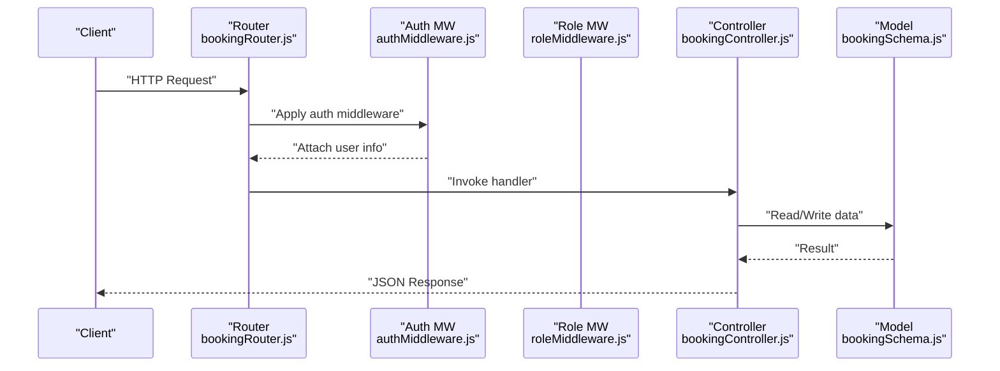
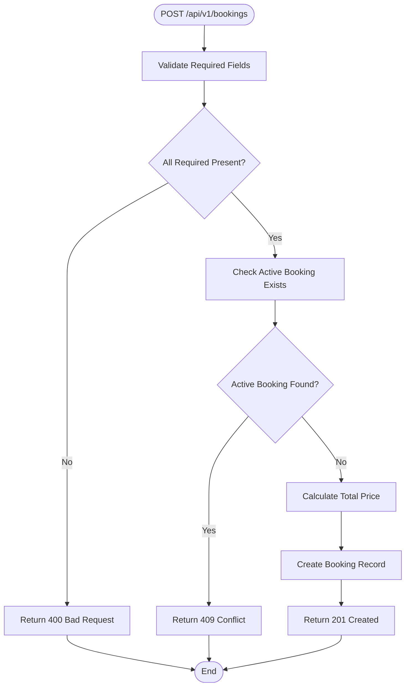
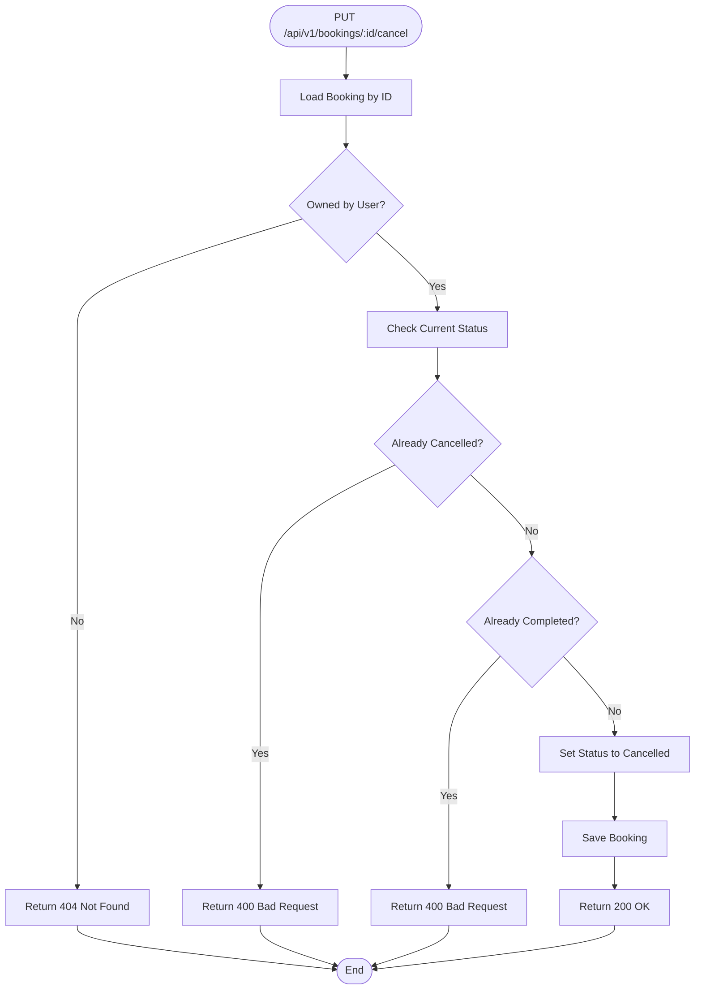
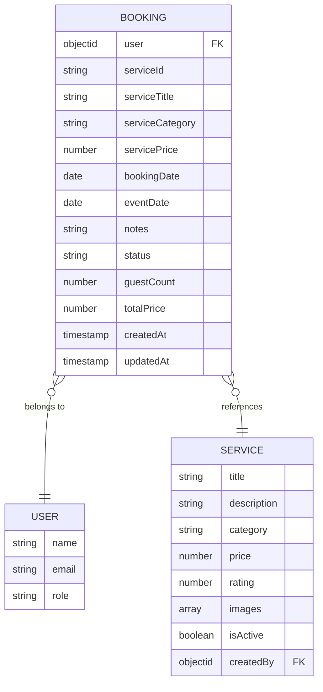
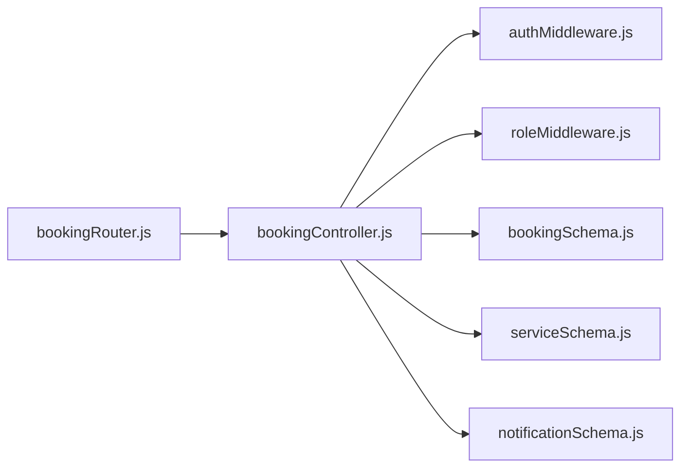

# Service Booking API

<cite>
**Referenced Files in This Document**
- [bookingRouter.js](file://backend/router/bookingRouter.js)
- [bookingController.js](file://backend/controller/bookingController.js)
- [bookingSchema.js](file://backend/models/bookingSchema.js)
- [authMiddleware.js](file://backend/middleware/authMiddleware.js)
- [roleMiddleware.js](file://backend/middleware/roleMiddleware.js)
- [serviceSchema.js](file://backend/models/serviceSchema.js)
- [notificationSchema.js](file://backend/models/notificationSchema.js)
- [app.js](file://backend/app.js)
</cite>

## Table of Contents
1. [Introduction](#introduction)
2. [Project Structure](#project-structure)
3. [Core Components](#core-components)
4. [Architecture Overview](#architecture-overview)
5. [Detailed Component Analysis](#detailed-component-analysis)
6. [Dependency Analysis](#dependency-analysis)
7. [Performance Considerations](#performance-considerations)
8. [Troubleshooting Guide](#troubleshooting-guide)
9. [Conclusion](#conclusion)

## Introduction
This document provides comprehensive API documentation for the service-based booking system. It covers the endpoints for creating, viewing, and canceling service bookings, along with booking status management, authentication requirements, and merchant notification workflows. The documentation focuses on:
- POST /api/v1/bookings: Create a new service booking
- GET /api/v1/bookings/my-bookings: Retrieve user-specific bookings
- GET /api/v1/bookings/:id: Retrieve a specific booking by ID
- PUT /api/v1/bookings/:id/cancel: Cancel an existing booking
- Admin endpoints for viewing all bookings and updating booking statuses
- Request validation, pricing calculations, and integration with the service catalog

## Project Structure
The booking API is implemented using Express.js with MongoDB via Mongoose. The structure follows a layered architecture:
- Router layer: Defines routes and applies middleware
- Controller layer: Implements business logic and interacts with models
- Model layer: Defines Mongoose schemas for data persistence
- Middleware layer: Handles authentication and role-based authorization
- Integration: Uses JWT tokens for authentication and populates user roles

**Diagram sources**
- [bookingRouter.js:1-26](file://backend/router/bookingRouter.js#L1-L26)
- [bookingController.js:1-233](file://backend/controller/bookingController.js#L1-L233)
- [bookingSchema.js:1-53](file://backend/models/bookingSchema.js#L1-L53)
- [serviceSchema.js:1-83](file://backend/models/serviceSchema.js#L1-L83)
- [notificationSchema.js:1-36](file://backend/models/notificationSchema.js#L1-L36)
- [authMiddleware.js:1-17](file://backend/middleware/authMiddleware.js#L1-L17)
- [roleMiddleware.js:1-9](file://backend/middleware/roleMiddleware.js#L1-L9)

**Section sources**
- [bookingRouter.js:1-26](file://backend/router/bookingRouter.js#L1-L26)
- [bookingController.js:1-233](file://backend/controller/bookingController.js#L1-L233)
- [bookingSchema.js:1-53](file://backend/models/bookingSchema.js#L1-L53)
- [serviceSchema.js:1-83](file://backend/models/serviceSchema.js#L1-L83)
- [notificationSchema.js:1-36](file://backend/models/notificationSchema.js#L1-L36)
- [authMiddleware.js:1-17](file://backend/middleware/authMiddleware.js#L1-L17)
- [roleMiddleware.js:1-9](file://backend/middleware/roleMiddleware.js#L1-L9)
- [app.js:1-91](file://backend/app.js#L1-L91)

## Core Components
- Authentication middleware validates JWT tokens and attaches user identity to requests.
- Role middleware restricts admin-only endpoints to users with the appropriate role.
- Booking controller implements all booking operations with validation, status checks, and error handling.
- Booking model defines the schema for persisted booking records.
- Service model provides catalog integration for service metadata.
- Notification model supports merchant and user notifications related to bookings.

Key responsibilities:
- POST /api/v1/bookings: Validates service details, prevents duplicate active bookings, calculates total price, and creates a new booking record.
- GET /api/v1/bookings/my-bookings: Returns all bookings for the authenticated user, sorted by recency.
- GET /api/v1/bookings/:id: Returns a specific booking owned by the authenticated user.
- PUT /api/v1/bookings/:id/cancel: Cancels a booking if eligible, preventing cancellation of already-cancelled or completed bookings.
- Admin endpoints: View all bookings and update booking statuses with validation.

**Section sources**
- [bookingController.js:4-70](file://backend/controller/bookingController.js#L4-L70)
- [bookingController.js:72-91](file://backend/controller/bookingController.js#L72-L91)
- [bookingController.js:93-122](file://backend/controller/bookingController.js#L93-L122)
- [bookingController.js:124-171](file://backend/controller/bookingController.js#L124-L171)
- [bookingController.js:173-191](file://backend/controller/bookingController.js#L173-L191)
- [bookingController.js:193-232](file://backend/controller/bookingController.js#L193-L232)
- [bookingSchema.js:3-50](file://backend/models/bookingSchema.js#L3-L50)
- [serviceSchema.js:14-82](file://backend/models/serviceSchema.js#L14-L82)
- [notificationSchema.js:3-33](file://backend/models/notificationSchema.js#L3-L33)
- [authMiddleware.js:3-16](file://backend/middleware/authMiddleware.js#L3-L16)
- [roleMiddleware.js:1-8](file://backend/middleware/roleMiddleware.js#L1-L8)

## Architecture Overview
The booking API adheres to REST conventions and integrates with the broader application through middleware and routing.

**Diagram sources**
- [bookingRouter.js:15-23](file://backend/router/bookingRouter.js#L15-L23)
- [authMiddleware.js:3-16](file://backend/middleware/authMiddleware.js#L3-L16)
- [roleMiddleware.js:1-8](file://backend/middleware/roleMiddleware.js#L1-L8)
- [bookingController.js:4-70](file://backend/controller/bookingController.js#L4-L70)
- [bookingSchema.js:3-50](file://backend/models/bookingSchema.js#L3-L50)

## Detailed Component Analysis

### Endpoint: POST /api/v1/bookings
Purpose: Create a new service booking for the authenticated user.

Processing logic:
- Extracts service details from the request body and user identity from the authenticated token.
- Validates presence of required fields: serviceId, serviceTitle, serviceCategory, servicePrice.
- Prevents duplicate active bookings (pending or confirmed) for the same service by the same user.
- Calculates total price using guestCount if provided; otherwise uses unit price.
- Creates a new booking with default status "pending" and current timestamp.

Validation and error handling:
- Returns 400 if required fields are missing.
- Returns 409 if an active booking exists for the same service.
- Returns 500 on internal errors with a generic failure message.

Pricing calculation:
- Total price equals servicePrice multiplied by guestCount (default 1 if not provided).

Response format:
- On success: 201 with booking details and success flag.
- On validation failure: 400 with message.
- On conflict: 409 with message.
- On error: 500 with message.

Integration with service catalog:
- The endpoint expects service metadata (title, category, price) to be provided in the request body. These fields are stored with the booking for reference.

**Diagram sources**
- [bookingController.js:4-70](file://backend/controller/bookingController.js#L4-L70)

**Section sources**
- [bookingController.js:4-70](file://backend/controller/bookingController.js#L4-L70)
- [bookingSchema.js:3-50](file://backend/models/bookingSchema.js#L3-L50)

### Endpoint: GET /api/v1/bookings/my-bookings
Purpose: Retrieve all bookings associated with the authenticated user.

Processing logic:
- Filters bookings by the authenticated user ID.
- Sorts results by creation date in descending order.

Response format:
- Returns 200 with an array of bookings.
- Returns 500 on internal errors.

**Section sources**
- [bookingController.js:72-91](file://backend/controller/bookingController.js#L72-L91)

### Endpoint: GET /api/v1/bookings/:id
Purpose: Retrieve a specific booking by ID for the authenticated user.

Processing logic:
- Finds a booking matching both the ID and user ID.
- Returns 404 if not found.

Response format:
- Returns 200 with the booking object.
- Returns 404 if not found.
- Returns 500 on internal errors.

**Section sources**
- [bookingController.js:93-122](file://backend/controller/bookingController.js#L93-L122)

### Endpoint: PUT /api/v1/bookings/:id/cancel
Purpose: Cancel an existing booking if eligible.

Eligibility rules:
- Cannot cancel if already cancelled.
- Cannot cancel if already completed.
- Can cancel pending or confirmed bookings.

Processing logic:
- Loads the booking by ID and verifies ownership.
- Applies status transitions and saves the record.

Response format:
- Returns 200 with success message and updated booking.
- Returns 404 if booking not found.
- Returns 400 for invalid cancellation attempts.
- Returns 500 on internal errors.

**Diagram sources**
- [bookingController.js:124-171](file://backend/controller/bookingController.js#L124-L171)

**Section sources**
- [bookingController.js:124-171](file://backend/controller/bookingController.js#L124-L171)

### Admin Endpoints
- GET /api/v1/bookings/admin/all: Retrieve all bookings with user details populated and sorted by recency. Requires admin role.
- PUT /api/v1/bookings/admin/:id/status: Update booking status with validation. Requires admin role.

Status validation:
- Acceptable statuses: pending, confirmed, cancelled, completed.

Response format:
- Returns 200 on success.
- Returns 400 for invalid status.
- Returns 404 if booking not found.
- Returns 500 on internal errors.

**Section sources**
- [bookingController.js:173-191](file://backend/controller/bookingController.js#L173-L191)
- [bookingController.js:193-232](file://backend/controller/bookingController.js#L193-L232)
- [bookingRouter.js:21-23](file://backend/router/bookingRouter.js#L21-L23)
- [roleMiddleware.js:1-8](file://backend/middleware/roleMiddleware.js#L1-L8)

### Authentication and Authorization
- Authentication: All user-facing booking endpoints require a valid Bearer token attached to the Authorization header. The auth middleware decodes the token and attaches user identity to the request.
- Authorization: Admin-only endpoints additionally require the user to have the admin role enforced by the role middleware.

**Section sources**
- [authMiddleware.js:3-16](file://backend/middleware/authMiddleware.js#L3-L16)
- [roleMiddleware.js:1-8](file://backend/middleware/roleMiddleware.js#L1-L8)
- [bookingRouter.js:15-23](file://backend/router/bookingRouter.js#L15-L23)

### Data Models and Schema
Booking schema fields:
- user: Reference to the User who created the booking
- serviceId, serviceTitle, serviceCategory, servicePrice: Service metadata copied at booking time
- bookingDate, eventDate: Timestamps for booking creation and event date
- notes: Optional notes provided by the user
- status: Enumerated value with defaults to pending
- guestCount: Number of guests (default 1)
- totalPrice: Calculated total price
- createdAt, updatedAt: Timestamps managed by Mongoose

Service schema highlights:
- Provides the catalog of services with categories, pricing, and metadata used during booking creation.

**Diagram sources**
- [bookingSchema.js:3-50](file://backend/models/bookingSchema.js#L3-L50)
- [serviceSchema.js:14-82](file://backend/models/serviceSchema.js#L14-L82)

**Section sources**
- [bookingSchema.js:3-50](file://backend/models/bookingSchema.js#L3-L50)
- [serviceSchema.js:14-82](file://backend/models/serviceSchema.js#L14-L82)

### Merchant Notification Workflows
While the booking controller does not directly create notifications, the notification model supports storing booking-related notifications with fields such as bookingId and type. This enables future integrations where merchant and user notifications are generated upon booking creation, status updates, or cancellations.

Notification model highlights:
- user: Reference to the recipient
- message: Notification content
- read: Read/unread status
- bookingId: Reference to the booking
- type: Enumerated type (booking, payment, general)

**Section sources**
- [notificationSchema.js:3-33](file://backend/models/notificationSchema.js#L3-L33)

## Dependency Analysis
The booking API depends on:
- Express routing for endpoint exposure
- JWT-based authentication middleware
- Role-based authorization for admin endpoints
- Mongoose models for data persistence
- Service catalog model for service metadata

**Diagram sources**
- [bookingRouter.js:1-26](file://backend/router/bookingRouter.js#L1-L26)
- [bookingController.js:1-233](file://backend/controller/bookingController.js#L1-L233)
- [authMiddleware.js:1-17](file://backend/middleware/authMiddleware.js#L1-L17)
- [roleMiddleware.js:1-9](file://backend/middleware/roleMiddleware.js#L1-L9)
- [bookingSchema.js:1-53](file://backend/models/bookingSchema.js#L1-L53)
- [serviceSchema.js:1-83](file://backend/models/serviceSchema.js#L1-L83)
- [notificationSchema.js:1-36](file://backend/models/notificationSchema.js#L1-L36)

**Section sources**
- [bookingRouter.js:1-26](file://backend/router/bookingRouter.js#L1-L26)
- [bookingController.js:1-233](file://backend/controller/bookingController.js#L1-L233)
- [authMiddleware.js:1-17](file://backend/middleware/authMiddleware.js#L1-L17)
- [roleMiddleware.js:1-9](file://backend/middleware/roleMiddleware.js#L1-L9)
- [bookingSchema.js:1-53](file://backend/models/bookingSchema.js#L1-L53)
- [serviceSchema.js:1-83](file://backend/models/serviceSchema.js#L1-L83)
- [notificationSchema.js:1-36](file://backend/models/notificationSchema.js#L1-L36)

## Performance Considerations
- Indexing: Consider adding database indexes on frequently queried fields such as user, status, and bookingDate to improve query performance.
- Population: Admin endpoints populate user details; avoid unnecessary population for user-facing endpoints to reduce payload sizes.
- Pagination: For large datasets, implement pagination on admin endpoints to limit response sizes.
- Validation: Keep validation logic lightweight and leverage schema-level validations to minimize redundant checks.

## Troubleshooting Guide
Common issues and resolutions:
- Unauthorized access: Ensure a valid Bearer token is included in the Authorization header for protected endpoints.
- Forbidden access: Admin endpoints require the admin role; verify user role claims.
- Duplicate active bookings: The system prevents creating new bookings for the same service while an active booking exists.
- Invalid cancellation: Cancellations are rejected for already-cancelled or completed bookings.
- Internal errors: The API returns 500 with a generic message on unhandled exceptions; check server logs for details.

**Section sources**
- [authMiddleware.js:3-16](file://backend/middleware/authMiddleware.js#L3-L16)
- [roleMiddleware.js:1-8](file://backend/middleware/roleMiddleware.js#L1-L8)
- [bookingController.js:26-38](file://backend/controller/bookingController.js#L26-L38)
- [bookingController.js:142-154](file://backend/controller/bookingController.js#L142-L154)
- [bookingController.js:63-69](file://backend/controller/bookingController.js#L63-L69)

## Conclusion
The service booking API provides a robust foundation for managing user service bookings with clear validation, status management, and admin oversight. By leveraging JWT authentication, role-based authorization, and Mongoose models, the system ensures secure and reliable booking operations. Future enhancements could include service availability checks, notification automation, and expanded admin reporting capabilities.