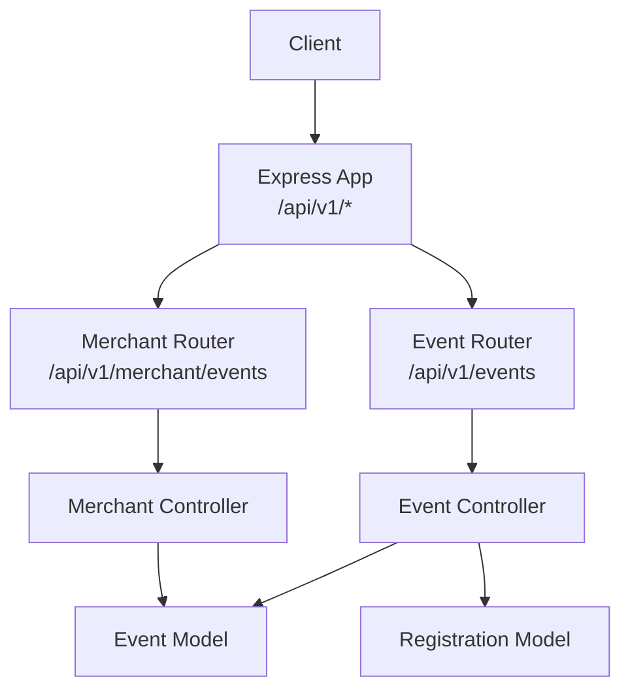
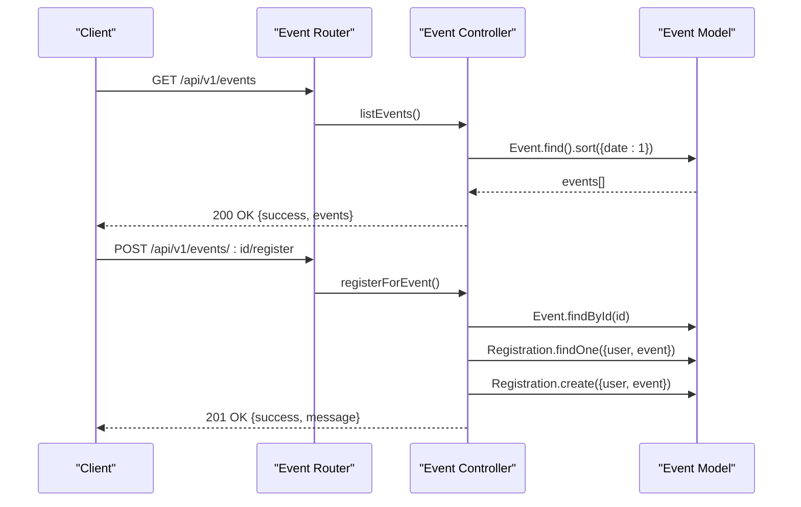
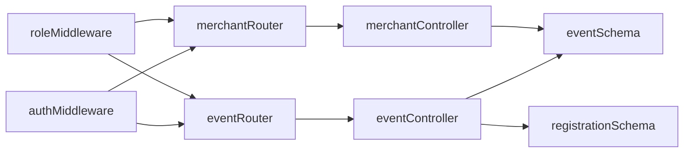

# Event CRUD Operations

<cite>
**Referenced Files in This Document**
- [app.js](file://backend/app.js)
- [eventRouter.js](file://backend/router/eventRouter.js)
- [merchantRouter.js](file://backend/router/merchantRouter.js)
- [eventController.js](file://backend/controller/eventController.js)
- [merchantController.js](file://backend/controller/merchantController.js)
- [authMiddleware.js](file://backend/middleware/authMiddleware.js)
- [roleMiddleware.js](file://backend/middleware/roleMiddleware.js)
- [eventSchema.js](file://backend/models/eventSchema.js)
- [registrationSchema.js](file://backend/models/registrationSchema.js)
- [test-events-api.js](file://backend/test-events-api.js)
</cite>

## Table of Contents
1. [Introduction](#introduction)
2. [Project Structure](#project-structure)
3. [Core Components](#core-components)
4. [Architecture Overview](#architecture-overview)
5. [Detailed Component Analysis](#detailed-component-analysis)
6. [Dependency Analysis](#dependency-analysis)
7. [Performance Considerations](#performance-considerations)
8. [Troubleshooting Guide](#troubleshooting-guide)
9. [Conclusion](#conclusion)

## Introduction
This document provides comprehensive API documentation for Event CRUD operations. It covers:
- Listing all events with filtering, pagination, and sorting parameters
- Creating events with validation and merchant permissions
- Retrieving individual event details
- Updating events (partial updates)
- Deleting events with image cleanup
- Event registration for users
It also documents request/response examples, error codes, and validation messages for each operation.

## Project Structure
The Event APIs are exposed under the base path /api/v1 and organized by responsibility:
- Public listing and user registration endpoints under /api/v1/events
- Merchant-only endpoints under /api/v1/merchant/events

**Diagram sources**
- [app.js:35-47](file://backend/app.js#L35-L47)
- [eventRouter.js:1-12](file://backend/router/eventRouter.js#L1-L12)
- [merchantRouter.js:1-16](file://backend/router/merchantRouter.js#L1-L16)
- [eventController.js:1-35](file://backend/controller/eventController.js#L1-L35)
- [merchantController.js:1-209](file://backend/controller/merchantController.js#L1-L209)
- [eventSchema.js:1-51](file://backend/models/eventSchema.js#L1-L51)
- [registrationSchema.js:1-12](file://backend/models/registrationSchema.js#L1-L12)

**Section sources**
- [app.js:35-47](file://backend/app.js#L35-L47)
- [eventRouter.js:1-12](file://backend/router/eventRouter.js#L1-L12)
- [merchantRouter.js:1-16](file://backend/router/merchantRouter.js#L1-L16)

## Core Components
- Authentication middleware validates JWT tokens and attaches user info to requests.
- Role middleware enforces access control (user vs merchant).
- Event model defines the schema for events, including fields for full-service and ticketed events.
- Registration model tracks user participation in events.

Key responsibilities:
- Event listing and user registration are publicly accessible via the event router.
- Merchant-only routes handle creation, updates, retrieval, and deletion of events.

**Section sources**
- [authMiddleware.js:1-17](file://backend/middleware/authMiddleware.js#L1-L17)
- [roleMiddleware.js:1-9](file://backend/middleware/roleMiddleware.js#L1-L9)
- [eventSchema.js:3-48](file://backend/models/eventSchema.js#L3-L48)
- [registrationSchema.js:3-9](file://backend/models/registrationSchema.js#L3-L9)

## Architecture Overview
The Event CRUD architecture separates concerns:
- Router binds HTTP endpoints to controller actions
- Controllers enforce permissions and orchestrate data access
- Models define data structures and constraints
- Middleware handles authentication and authorization

**Diagram sources**
- [eventRouter.js:8-10](file://backend/router/eventRouter.js#L8-L10)
- [eventController.js:4-25](file://backend/controller/eventController.js#L4-L25)
- [eventSchema.js:45](file://backend/models/eventSchema.js#L45)
- [registrationSchema.js:5-6](file://backend/models/registrationSchema.js#L5-L6)

## Detailed Component Analysis

### GET /api/v1/events
Purpose: List all events with basic sorting by date.

Behavior:
- Sorts events by date ascending
- Returns success flag and array of events

Response format:
- 200 OK: { success: boolean, events: Event[] }

Notes:
- Filtering, pagination, and advanced sorting are not implemented in the current controller.

Example request:
- GET /api/v1/events

Example response:
- 200 OK
  - Body: {"success":true,"events":[{...}]}

Validation and errors:
- 500 Internal Server Error: {"success":false,"message":"Unknown Error"}

**Section sources**
- [eventRouter.js:8](file://backend/router/eventRouter.js#L8)
- [eventController.js:4-11](file://backend/controller/eventController.js#L4-L11)

### POST /api/v1/events/:id/register
Purpose: Allow authenticated users to register for an event.

Behavior:
- Validates event existence
- Checks for existing registration
- Creates a registration record linking user to event

Permissions:
- Requires authentication (user role enforced)

Response format:
- 201 Created: {"success":true,"message":"Registered successfully"}
- 404 Not Found: {"success":false,"message":"Event not found"}
- 409 Conflict: {"success":false,"message":"Already registered"}
- 500 Internal Server Error: {"success":false,"message":"Unknown Error"}

Example request:
- POST /api/v1/events/:id/register
- Headers: Authorization: Bearer <token>
- Body: empty

Example response:
- 201 Created
  - Body: {"success":true,"message":"Registered successfully"}

Validation and errors:
- 401 Unauthorized: Missing or invalid token
- 403 Forbidden: User role mismatch

**Section sources**
- [eventRouter.js:9](file://backend/router/eventRouter.js#L9)
- [eventController.js:13-25](file://backend/controller/eventController.js#L13-L25)
- [authMiddleware.js:3-16](file://backend/middleware/authMiddleware.js#L3-L16)
- [roleMiddleware.js:1-8](file://backend/middleware/roleMiddleware.js#L1-L8)

### GET /api/v1/events/:id
Note: The current event router does not expose a GET by ID endpoint. The merchant router provides a similar endpoint under /api/v1/merchant/events/:id for merchants who own the event.

Behavior (merchant-owned GET by ID):
- Retrieves an event by ID
- Enforces ownership (only the creator can access)

Response format:
- 200 OK: {"success":true,"event":Event}
- 404 Not Found: {"success":false,"message":"Event not found"}
- 403 Forbidden: {"success":false,"message":"Forbidden"}

Example request:
- GET /api/v1/merchant/events/:id
- Headers: Authorization: Bearer <merchant-token>

Example response:
- 200 OK
  - Body: {"success":true,"event":{...}}

Validation and errors:
- 401 Unauthorized: Missing or invalid token
- 403 Forbidden: Non-owner accessing event

**Section sources**
- [merchantRouter.js:12](file://backend/router/merchantRouter.js#L12)
- [merchantController.js:160-172](file://backend/controller/merchantController.js#L160-L172)

### POST /api/v1/events
Note: The current event router does not expose a POST endpoint for creating events. Event creation is handled by the merchant router under /api/v1/merchant/events.

Behavior (merchant create):
- Validates required fields
- Handles image uploads via Cloudinary
- Parses features and addons
- Supports ticketed events with ticket types
- Sets createdBy to the merchant

Response format:
- 201 Created: {"success":true,"event":Event}
- 400 Bad Request: Validation or field errors
- 500 Internal Server Error: {"success":false,"message":"Unknown Error"}

Example request:
- POST /api/v1/merchant/events
- Headers: Authorization: Bearer <merchant-token>, Content-Type: multipart/form-data
- Body fields:
  - title (required)
  - description, category, price, rating
  - eventType ("full-service" or "ticketed")
  - location, date, time, duration
  - totalTickets, ticketPrice
  - ticketTypes (JSON array of {name, price, quantity, available})
  - features (JSON or CSV)
  - addons (JSON array of {name, price})
  - images (files, up to 4)

Example response:
- 201 Created
  - Body: {"success":true,"event":{...}}

Validation and errors:
- 400 Bad Request: Missing required fields or invalid formats
- 401 Unauthorized: Missing or invalid token
- 403 Forbidden: Non-merchant attempting to create

Request body schema (merchant create):
- Required: title
- Optional: description, category, price, rating, features (JSON or CSV), eventType, location, date, time, duration, totalTickets, ticketPrice, ticketTypes (JSON), addons (JSON), images (files)

**Section sources**
- [merchantRouter.js:9](file://backend/router/merchantRouter.js#L9)
- [merchantController.js:5-98](file://backend/controller/merchantController.js#L5-L98)
- [eventSchema.js:5-48](file://backend/models/eventSchema.js#L5-L48)

### PUT /api/v1/events/:id
Note: The current event router does not expose a PUT endpoint for updating events. Event updates are handled by the merchant router under /api/v1/merchant/events/:id.

Behavior (merchant update):
- Validates event ownership
- Supports partial updates for title, description, category, price, rating, features
- Handles image replacement via Cloudinary
- Saves the updated event

Response format:
- 200 OK: {"success":true,"event":Event}
- 404 Not Found: {"success":false,"message":"Event not found"}
- 403 Forbidden: {"success":false,"message":"Forbidden"}
- 500 Internal Server Error: {"success":false,"message":"Unknown Error"}

Example request:
- PUT /api/v1/merchant/events/:id
- Headers: Authorization: Bearer <merchant-token>, Content-Type: multipart/form-data
- Body fields:
  - title, description, category, price, rating, features (JSON or CSV)
  - images (files, up to 4)

Example response:
- 200 OK
  - Body: {"success":true,"event":{...}}

Validation and errors:
- 401 Unauthorized: Missing or invalid token
- 403 Forbidden: Non-owner attempting to update

**Section sources**
- [merchantRouter.js:10](file://backend/router/merchantRouter.js#L10)
- [merchantController.js:100-147](file://backend/controller/merchantController.js#L100-L147)

### DELETE /api/v1/events/:id
Note: The current event router does not expose a DELETE endpoint for removing events. Event deletion is handled by the merchant router under /api/v1/merchant/events/:id.

Behavior (merchant delete):
- Validates event ownership
- Deletes associated images from Cloudinary
- Removes the event from the database

Response format:
- 200 OK: {"success":true,"message":"Event deleted"}
- 404 Not Found: {"success":false,"message":"Event not found"}
- 403 Forbidden: {"success":false,"message":"Forbidden"}
- 500 Internal Server Error: {"success":false,"message":"Unknown Error"}

Example request:
- DELETE /api/v1/merchant/events/:id
- Headers: Authorization: Bearer <merchant-token>

Example response:
- 200 OK
  - Body: {"success":true,"message":"Event deleted"}

Validation and errors:
- 401 Unauthorized: Missing or invalid token
- 403 Forbidden: Non-owner attempting to delete

**Section sources**
- [merchantRouter.js:14](file://backend/router/merchantRouter.js#L14)
- [merchantController.js:189-208](file://backend/controller/merchantController.js#L189-L208)

### Additional: GET /api/v1/events/me (User registrations)
Purpose: Retrieve the authenticated user’s event registrations.

Behavior:
- Lists registrations for the current user
- Populates each registration with event details

Response format:
- 200 OK: {"success":true,"registrations":Registration[]}
- 500 Internal Server Error: {"success":false,"message":"Unknown Error"}

Example request:
- GET /api/v1/events/me
- Headers: Authorization: Bearer <user-token>

Example response:
- 200 OK
  - Body: {"success":true,"registrations":[{"user","event":Event},...]}

Validation and errors:
- 401 Unauthorized: Missing or invalid token
- 403 Forbidden: Non-user role

**Section sources**
- [eventRouter.js:10](file://backend/router/eventRouter.js#L10)
- [eventController.js:27-34](file://backend/controller/eventController.js#L27-L34)

## Dependency Analysis
- Event router depends on:
  - Event controller for listing and registration
  - Authentication and role middleware for access control
- Merchant router depends on:
  - Merchant controller for create/update/delete/get
  - Cloudinary upload middleware for image handling
- Controllers depend on:
  - Event model for persistence
  - Registration model for user-event relationships
- Middleware ensures:
  - JWT verification and user identity
  - Role-based access checks

**Diagram sources**
- [eventRouter.js:2-4](file://backend/router/eventRouter.js#L2-L4)
- [merchantRouter.js:2-5](file://backend/router/merchantRouter.js#L2-L5)
- [authMiddleware.js:1-17](file://backend/middleware/authMiddleware.js#L1-L17)
- [roleMiddleware.js:1-9](file://backend/middleware/roleMiddleware.js#L1-L9)
- [eventController.js:1](file://backend/controller/eventController.js#L1)
- [merchantController.js:1](file://backend/controller/merchantController.js#L1)
- [eventSchema.js:1](file://backend/models/eventSchema.js#L1)
- [registrationSchema.js:1](file://backend/models/registrationSchema.js#L1)

**Section sources**
- [eventRouter.js:1-12](file://backend/router/eventRouter.js#L1-L12)
- [merchantRouter.js:1-16](file://backend/router/merchantRouter.js#L1-L16)
- [authMiddleware.js:1-17](file://backend/middleware/authMiddleware.js#L1-L17)
- [roleMiddleware.js:1-9](file://backend/middleware/roleMiddleware.js#L1-L9)

## Performance Considerations
- Sorting by date on listEvents is O(n log n) due to sort; consider indexing date for large datasets.
- Image uploads occur synchronously during create/update; consider asynchronous processing for large batches.
- Registration queries use population; limit population depth or use lean queries for scalability.

## Troubleshooting Guide
Common issues and resolutions:
- 401 Unauthorized
  - Cause: Missing or invalid Authorization header
  - Resolution: Ensure Bearer token is present and valid
- 403 Forbidden
  - Cause: Insufficient role or non-owner access
  - Resolution: Authenticate as merchant for create/update/delete; ensure ownership for merchant endpoints
- 404 Not Found
  - Cause: Event does not exist
  - Resolution: Verify event ID
- 409 Conflict (registration)
  - Cause: Duplicate registration
  - Resolution: Do not re-register for the same event
- 500 Internal Server Error
  - Cause: Unexpected server-side failure
  - Resolution: Check server logs and ensure database connectivity

**Section sources**
- [authMiddleware.js:7-14](file://backend/middleware/authMiddleware.js#L7-L14)
- [roleMiddleware.js:3-6](file://backend/middleware/roleMiddleware.js#L3-L6)
- [eventController.js:17-23](file://backend/controller/eventController.js#L17-L23)
- [merchantController.js:104-107](file://backend/controller/merchantController.js#L104-L107)

## Conclusion
The Event CRUD implementation currently supports:
- Listing events and user registration via the event router
- Full merchant lifecycle (create, read, update, delete) via the merchant router
Missing from the current codebase:
- Filtering, pagination, and advanced sorting for GET /api/v1/events
- GET by ID for public events
- PUT and DELETE endpoints under /api/v1/events

Recommendations:
- Extend listEvents to support query parameters for filtering, pagination, and sorting
- Add GET /api/v1/events/:id for public event retrieval
- Implement PUT and DELETE under /api/v1/events for broader access
- Add comprehensive input validation and sanitization
- Introduce rate limiting and input size limits for uploads