# Event Management API

<cite>
**Referenced Files in This Document**
- [app.js](file://backend/app.js)
- [eventRouter.js](file://backend/router/eventRouter.js)
- [merchantRouter.js](file://backend/router/merchantRouter.js)
- [adminRouter.js](file://backend/router/adminRouter.js)
- [eventController.js](file://backend/controller/eventController.js)
- [merchantController.js](file://backend/controller/merchantController.js)
- [adminController.js](file://backend/controller/adminController.js)
- [eventSchema.js](file://backend/models/eventSchema.js)
- [registrationSchema.js](file://backend/models/registrationSchema.js)
- [userSchema.js](file://backend/models/userSchema.js)
- [authMiddleware.js](file://backend/middleware/authMiddleware.js)
- [roleMiddleware.js](file://backend/middleware/roleMiddleware.js)
- [cloudinary.js](file://backend/util/cloudinary.js)
- [test-events-api.js](file://backend/test-events-api.js)
</cite>

## Table of Contents
1. [Introduction](#introduction)
2. [Project Structure](#project-structure)
3. [Core Components](#core-components)
4. [Architecture Overview](#architecture-overview)
5. [Detailed Component Analysis](#detailed-component-analysis)
6. [Dependency Analysis](#dependency-analysis)
7. [Performance Considerations](#performance-considerations)
8. [Troubleshooting Guide](#troubleshooting-guide)
9. [Conclusion](#conclusion)
10. [Appendices](#appendices)

## Introduction
This document provides comprehensive API documentation for the Event Management system. It covers event lifecycle endpoints, merchant and admin capabilities, and the underlying data models. The current implementation exposes:
- Public event listing
- User registration for events
- Merchant event creation, updates, and participant management
- Admin event and registration management

It does not expose explicit endpoints for event search, event details by ID, or event deletion by ID for regular users. The documentation outlines available endpoints, request/response schemas, filtering, pagination, sorting, and integration patterns.

## Project Structure
The API is organized by routers and controllers, with models and middleware supporting business logic and security.

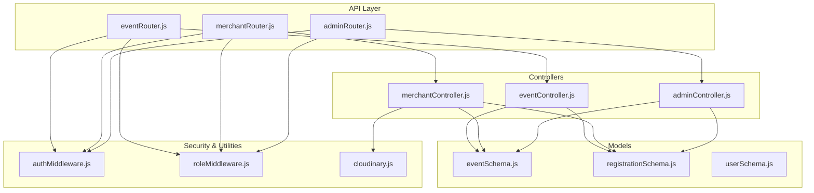

**Diagram sources**
- [eventRouter.js:1-13](file://backend/router/eventRouter.js#L1-L13)
- [merchantRouter.js:1-16](file://backend/router/merchantRouter.js#L1-L16)
- [adminRouter.js:1-29](file://backend/router/adminRouter.js#L1-L29)
- [eventController.js:1-35](file://backend/controller/eventController.js#L1-L35)
- [merchantController.js:1-199](file://backend/controller/merchantController.js#L1-L199)
- [adminController.js:1-194](file://backend/controller/adminController.js#L1-L194)
- [eventSchema.js:1-23](file://backend/models/eventSchema.js#L1-L23)
- [registrationSchema.js:1-12](file://backend/models/registrationSchema.js#L1-L12)
- [userSchema.js:1-55](file://backend/models/userSchema.js#L1-L55)
- [authMiddleware.js:1-17](file://backend/middleware/authMiddleware.js#L1-L17)
- [roleMiddleware.js:1-9](file://backend/middleware/roleMiddleware.js#L1-L9)
- [cloudinary.js:1-112](file://backend/util/cloudinary.js#L1-L112)

**Section sources**
- [app.js:36](file://backend/app.js#L36)
- [eventRouter.js:1-13](file://backend/router/eventRouter.js#L1-L13)
- [merchantRouter.js:1-16](file://backend/router/merchantRouter.js#L1-L16)
- [adminRouter.js:1-29](file://backend/router/adminRouter.js#L1-L29)

## Core Components
- Authentication middleware validates JWT tokens and attaches user context.
- Role middleware enforces role-based access control (user, merchant, admin).
- Event model defines event attributes including title, description, category, price, rating, images, features, and creator.
- Registration model tracks user participation in events.
- Cloudinary integration handles image uploads for events.

Key capabilities:
- Event listing (sorted by date ascending)
- User registration for events
- Merchant event CRUD and participant listing
- Admin event and registration management

**Section sources**
- [authMiddleware.js:1-17](file://backend/middleware/authMiddleware.js#L1-L17)
- [roleMiddleware.js:1-9](file://backend/middleware/roleMiddleware.js#L1-L9)
- [eventSchema.js:1-23](file://backend/models/eventSchema.js#L1-L23)
- [registrationSchema.js:1-12](file://backend/models/registrationSchema.js#L1-L12)
- [cloudinary.js:1-112](file://backend/util/cloudinary.js#L1-L112)

## Architecture Overview
The API follows a layered architecture:
- Routers define endpoint contracts
- Controllers implement business logic
- Models encapsulate data structures
- Middleware enforces auth and roles
- Utilities handle external integrations (Cloudinary)

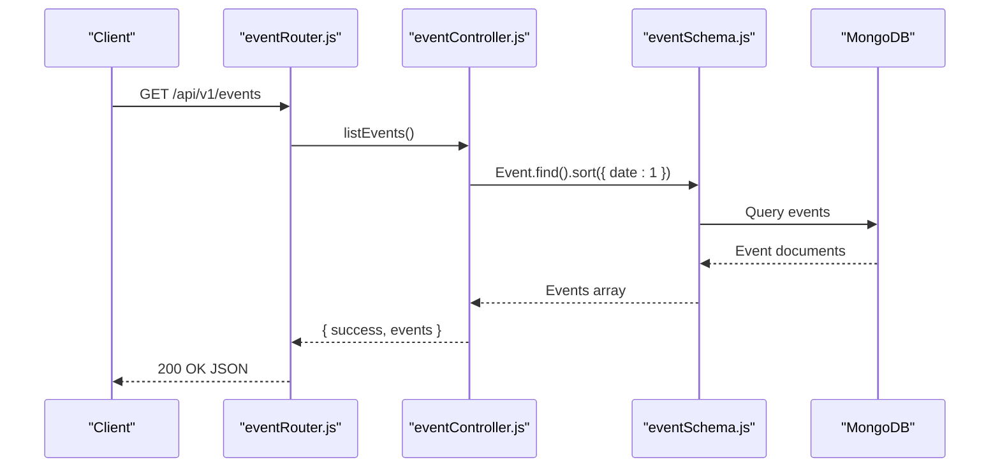

**Diagram sources**
- [eventRouter.js:8](file://backend/router/eventRouter.js#L8)
- [eventController.js:4-11](file://backend/controller/eventController.js#L4-L11)
- [eventSchema.js:1-23](file://backend/models/eventSchema.js#L1-L23)

## Detailed Component Analysis

### Authentication and Authorization
- Authentication middleware extracts Bearer token, verifies JWT, and sets req.user with userId and role.
- Role middleware checks allowed roles for protected routes.

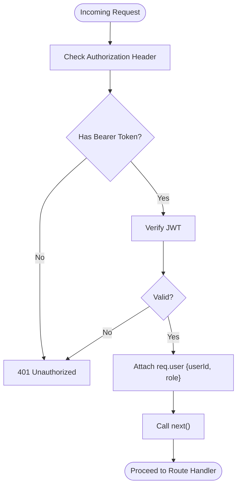

**Diagram sources**
- [authMiddleware.js:3-16](file://backend/middleware/authMiddleware.js#L3-L16)

**Section sources**
- [authMiddleware.js:1-17](file://backend/middleware/authMiddleware.js#L1-L17)
- [roleMiddleware.js:1-9](file://backend/middleware/roleMiddleware.js#L1-L9)

### Event Endpoints

#### Event Listing
- Endpoint: GET /api/v1/events
- Behavior: Returns all events sorted by date ascending.
- Response: { success: boolean, events: Event[] }

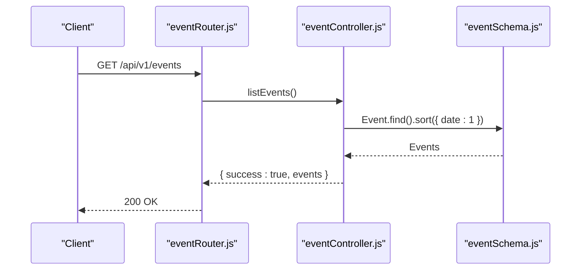

**Diagram sources**
- [eventRouter.js:8](file://backend/router/eventRouter.js#L8)
- [eventController.js:4-11](file://backend/controller/eventController.js#L4-L11)

**Section sources**
- [eventRouter.js:8](file://backend/router/eventRouter.js#L8)
- [eventController.js:4-11](file://backend/controller/eventController.js#L4-L11)

#### User Registration for Event
- Endpoint: POST /api/v1/events/:id/register
- Requires: Authentication (user)
- Behavior: Creates a registration record for the authenticated user and the specified event if not already registered.
- Response: { success: boolean, message: string }

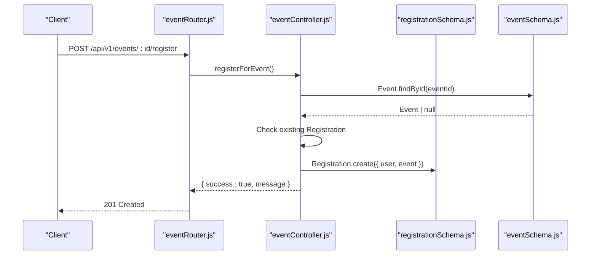

**Diagram sources**
- [eventRouter.js:9](file://backend/router/eventRouter.js#L9)
- [eventController.js:13-25](file://backend/controller/eventController.js#L13-L25)
- [registrationSchema.js:1-12](file://backend/models/registrationSchema.js#L1-L12)
- [eventSchema.js:1-23](file://backend/models/eventSchema.js#L1-L23)

**Section sources**
- [eventRouter.js:9](file://backend/router/eventRouter.js#L9)
- [eventController.js:13-25](file://backend/controller/eventController.js#L13-L25)

#### User's Event Registrations
- Endpoint: GET /api/v1/events/me
- Requires: Authentication (user)
- Behavior: Lists all registrations for the authenticated user, populated with event details.
- Response: { success: boolean, registrations: Registration[] }

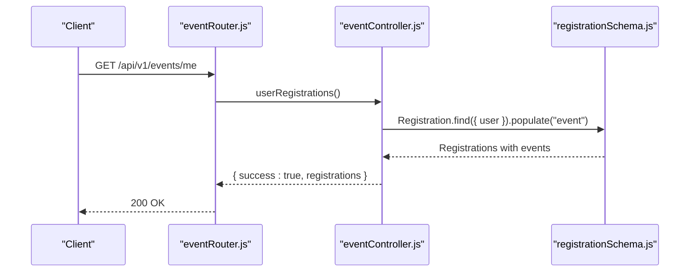

**Diagram sources**
- [eventRouter.js:10](file://backend/router/eventRouter.js#L10)
- [eventController.js:27-34](file://backend/controller/eventController.js#L27-L34)
- [registrationSchema.js:1-12](file://backend/models/registrationSchema.js#L1-L12)

**Section sources**
- [eventRouter.js:10](file://backend/router/eventRouter.js#L10)
- [eventController.js:27-34](file://backend/controller/eventController.js#L27-L34)

### Merchant Endpoints

#### Merchant Event Creation
- Endpoint: POST /api/v1/merchant/events
- Requires: Authentication (merchant), multipart/form-data with up to 4 images
- Behavior: Validates title, parses features, uploads images via Cloudinary, creates event under merchant’s ownership.
- Response: { success: boolean, event: Event }

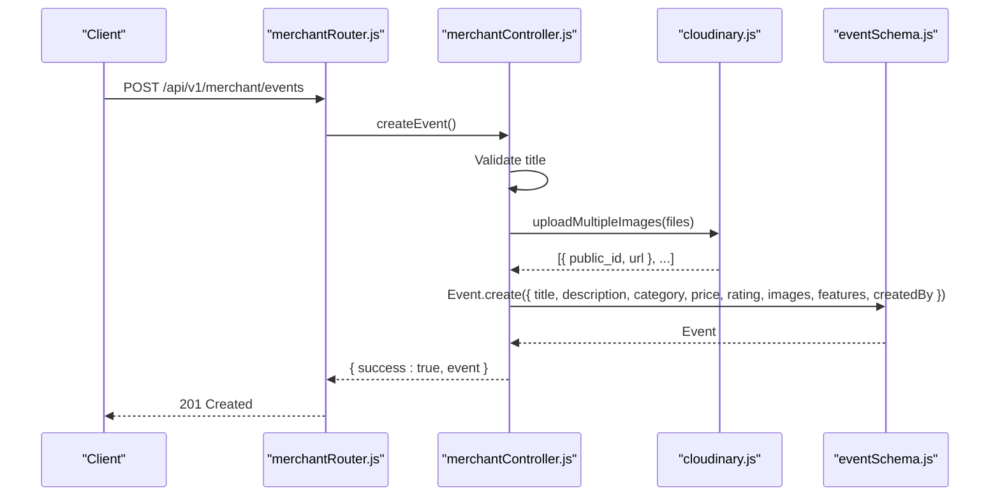

**Diagram sources**
- [merchantRouter.js:9](file://backend/router/merchantRouter.js#L9)
- [merchantController.js:5-109](file://backend/controller/merchantController.js#L5-L109)
- [cloudinary.js:75-91](file://backend/util/cloudinary.js#L75-L91)
- [eventSchema.js:1-23](file://backend/models/eventSchema.js#L1-L23)

**Section sources**
- [merchantRouter.js:9](file://backend/router/merchantRouter.js#L9)
- [merchantController.js:5-109](file://backend/controller/merchantController.js#L5-L109)
- [cloudinary.js:1-112](file://backend/util/cloudinary.js#L1-L112)

#### Merchant Event Update
- Endpoint: PUT /api/v1/merchant/events/:id
- Requires: Authentication (merchant)
- Behavior: Validates ownership, updates provided fields, replaces images if new ones are supplied.
- Response: { success: boolean, event: Event }

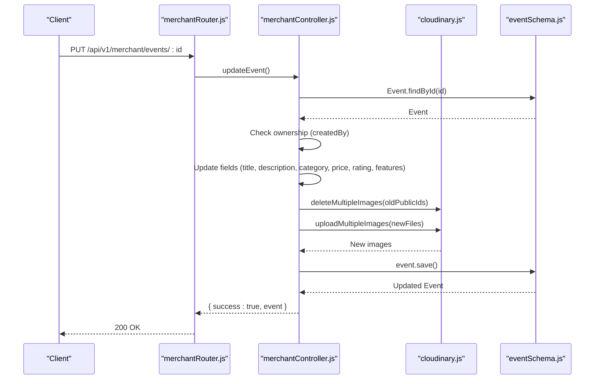

**Diagram sources**
- [merchantRouter.js:10](file://backend/router/merchantRouter.js#L10)
- [merchantController.js:111-158](file://backend/controller/merchantController.js#L111-L158)
- [cloudinary.js:103-109](file://backend/util/cloudinary.js#L103-L109)
- [eventSchema.js:1-23](file://backend/models/eventSchema.js#L1-L23)

**Section sources**
- [merchantRouter.js:10](file://backend/router/merchantRouter.js#L10)
- [merchantController.js:111-158](file://backend/controller/merchantController.js#L111-L158)

#### Merchant List My Events
- Endpoint: GET /api/v1/merchant/events
- Requires: Authentication (merchant)
- Behavior: Returns events created by the authenticated merchant.
- Response: { success: boolean, events: Event[] }

**Section sources**
- [merchantRouter.js:11](file://backend/router/merchantRouter.js#L11)
- [merchantController.js:160-169](file://backend/controller/merchantController.js#L160-L169)

#### Merchant Get Event Details
- Endpoint: GET /api/v1/merchant/events/:id
- Requires: Authentication (merchant)
- Behavior: Returns event details if owned by the merchant.
- Response: { success: boolean, event: Event }

**Section sources**
- [merchantRouter.js:12](file://backend/router/merchantRouter.js#L12)
- [merchantController.js:171-183](file://backend/controller/merchantController.js#L171-L183)

#### Merchant Participants for Event
- Endpoint: GET /api/v1/merchant/events/:id/participants
- Requires: Authentication (merchant)
- Behavior: Returns registrations for the event if owned by the merchant, populated with user details.
- Response: { success: boolean, participants: Registration[] }

**Section sources**
- [merchantRouter.js:13](file://backend/router/merchantRouter.js#L13)
- [merchantController.js:185-198](file://backend/controller/merchantController.js#L185-L198)

### Admin Endpoints

#### Admin List Events
- Endpoint: GET /api/v1/admin/events
- Requires: Authentication (admin)
- Behavior: Returns all events with creator details populated.
- Response: { success: boolean, events: Event[] }

**Section sources**
- [adminRouter.js:23](file://backend/router/adminRouter.js#L23)
- [adminController.js:89-96](file://backend/controller/adminController.js#L89-L96)

#### Admin Delete Event
- Endpoint: DELETE /api/v1/admin/events/:id
- Requires: Authentication (admin)
- Behavior: Deletes event and associated registrations.
- Response: { success: boolean, message: string }

**Section sources**
- [adminRouter.js:24](file://backend/router/adminRouter.js#L24)
- [adminController.js:98-107](file://backend/controller/adminController.js#L98-L107)

#### Admin List Registrations
- Endpoint: GET /api/v1/admin/registrations
- Requires: Authentication (admin)
- Behavior: Returns all registrations with user and event populated.
- Response: { success: boolean, registrations: Registration[] }

**Section sources**
- [adminRouter.js:25](file://backend/router/adminRouter.js#L25)
- [adminController.js:109-116](file://backend/controller/adminController.js#L109-L116)

#### Admin Reports
- Endpoint: GET /api/v1/admin/reports
- Requires: Authentication (admin)
- Behavior: Aggregates counts and revenue metrics.
- Response: { success: boolean, reports: object }

**Section sources**
- [adminRouter.js:26](file://backend/router/adminRouter.js#L26)
- [adminController.js:118-177](file://backend/controller/adminController.js#L118-L177)

#### Admin Public Stats
- Endpoint: GET /api/v1/admin/public-stats
- Requires: Authentication (admin)
- Behavior: Returns public stats (total events, users, merchants).
- Response: { success: boolean, stats: object }

**Section sources**
- [adminRouter.js:18](file://backend/router/adminRouter.js#L18)
- [adminController.js:179-193](file://backend/controller/adminController.js#L179-L193)

### Data Models

#### Event Model
- Fields: title (required), description, category, price, rating, images, features, createdBy (ref: User)
- Timestamps enabled

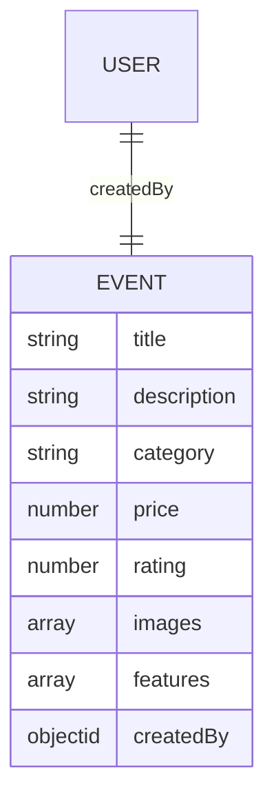

**Diagram sources**
- [eventSchema.js:3-20](file://backend/models/eventSchema.js#L3-L20)
- [userSchema.js:39-44](file://backend/models/userSchema.js#L39-L44)

**Section sources**
- [eventSchema.js:1-23](file://backend/models/eventSchema.js#L1-L23)
- [userSchema.js:1-55](file://backend/models/userSchema.js#L1-L55)

#### Registration Model
- Fields: user (ref: User), event (ref: Event)
- Timestamps enabled

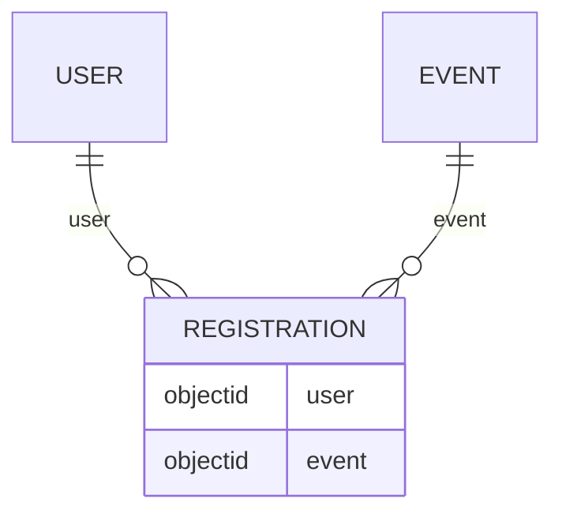

**Diagram sources**
- [registrationSchema.js:3-9](file://backend/models/registrationSchema.js#L3-L9)
- [userSchema.js:39-44](file://backend/models/userSchema.js#L39-L44)
- [eventSchema.js:17](file://backend/models/eventSchema.js#L17)

**Section sources**
- [registrationSchema.js:1-12](file://backend/models/registrationSchema.js#L1-L12)

### Request/Response Schemas

#### Event Creation (Merchant)
- Content-Type: multipart/form-data
- Fields:
  - title (string, required): Non-empty trimmed string
  - description (string): Optional
  - category (string): Optional
  - price (number): Optional, defaults to 0
  - rating (number): Optional, defaults to 0
  - features (string|array): Optional; supports JSON string or comma-separated list
  - images (file[]): Up to 4 image files (max 5MB each)
- Response: { success: boolean, event: Event }

Validation highlights:
- Title required and non-empty
- Features parsing supports JSON or CSV
- Images handled via Cloudinary upload

**Section sources**
- [merchantController.js:15-87](file://backend/controller/merchantController.js#L15-L87)
- [cloudinary.js:46-58](file://backend/util/cloudinary.js#L46-L58)

#### Event Update (Merchant)
- Content-Type: multipart/form-data
- Path Params: id (string, ObjectId)
- Fields (optional):
  - title, description, category, price, rating, features
  - images (file[]): Replaces existing images if provided
- Response: { success: boolean, event: Event }

**Section sources**
- [merchantController.js:120-154](file://backend/controller/merchantController.js#L120-L154)
- [cloudinary.js:103-109](file://backend/util/cloudinary.js#L103-L109)

#### User Registration
- Path Params: id (string, ObjectId)
- Response: { success: boolean, message: string }

**Section sources**
- [eventController.js:15-21](file://backend/controller/eventController.js#L15-L21)

#### Admin Reports
- Response includes aggregated metrics such as totals and revenue.

**Section sources**
- [adminController.js:118-177](file://backend/controller/adminController.js#L118-L177)

### Filtering, Pagination, and Sorting
- Event listing sorts by date ascending.
- No explicit query parameters for filtering or pagination are implemented in the current endpoints.

**Section sources**
- [eventController.js:6](file://backend/controller/eventController.js#L6)

### Event Categorization, Availability, Pricing, and Status Tracking
- Categorization: category field present on Event.
- Pricing: price field present on Event.
- Availability: not exposed as a dedicated endpoint; merchant can manage inventory via external mechanisms.
- Status tracking: not exposed as a dedicated endpoint; admin can list/delete events.

**Section sources**
- [eventSchema.js:5-8](file://backend/models/eventSchema.js#L5-L8)
- [adminRouter.js:23-26](file://backend/router/adminRouter.js#L23-L26)

### Event Approval Workflows, Merchant Permissions, and Admin Moderation
- Merchant permissions:
  - Can create, update, list, and view participants for their own events.
  - Ownership verified before allowing modifications or access.
- Admin moderation:
  - Can list all events and registrations.
  - Can delete events and associated registrations.
  - Provides reporting and public stats.

**Section sources**
- [merchantController.js:114-118](file://backend/controller/merchantController.js#L114-L118)
- [merchantController.js:171-183](file://backend/controller/merchantController.js#L171-L183)
- [adminController.js:89-107](file://backend/controller/adminController.js#L89-L107)
- [adminController.js:109-116](file://backend/controller/adminController.js#L109-L116)

### Examples and Integration Patterns
- Basic event listing:
  - Endpoint: GET /api/v1/events
  - Example client call pattern is demonstrated in tests.

- Merchant event creation:
  - Endpoint: POST /api/v1/merchant/events
  - Example client call pattern is demonstrated in tests.

**Section sources**
- [test-events-api.js:6](file://backend/test-events-api.js#L6)

## Dependency Analysis

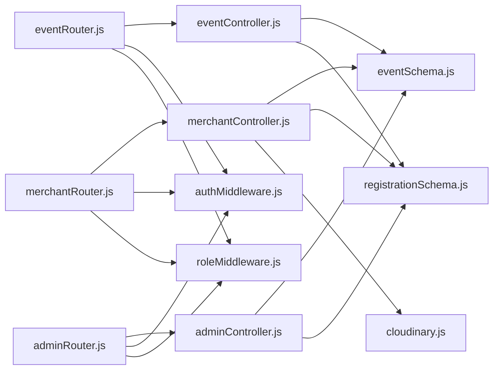

**Diagram sources**
- [eventRouter.js:1-13](file://backend/router/eventRouter.js#L1-L13)
- [merchantRouter.js:1-16](file://backend/router/merchantRouter.js#L1-L16)
- [adminRouter.js:1-29](file://backend/router/adminRouter.js#L1-L29)
- [eventController.js:1-35](file://backend/controller/eventController.js#L1-L35)
- [merchantController.js:1-199](file://backend/controller/merchantController.js#L1-L199)
- [adminController.js:1-194](file://backend/controller/adminController.js#L1-L194)
- [eventSchema.js:1-23](file://backend/models/eventSchema.js#L1-L23)
- [registrationSchema.js:1-12](file://backend/models/registrationSchema.js#L1-L12)
- [cloudinary.js:1-112](file://backend/util/cloudinary.js#L1-L112)
- [authMiddleware.js:1-17](file://backend/middleware/authMiddleware.js#L1-L17)
- [roleMiddleware.js:1-9](file://backend/middleware/roleMiddleware.js#L1-L9)

**Section sources**
- [eventRouter.js:1-13](file://backend/router/eventRouter.js#L1-L13)
- [merchantRouter.js:1-16](file://backend/router/merchantRouter.js#L1-L16)
- [adminRouter.js:1-29](file://backend/router/adminRouter.js#L1-L29)

## Performance Considerations
- Event listing performs a full collection scan and sort; consider indexing date if extended to support filters/sorting.
- Image uploads occur synchronously; ensure Cloudinary is configured and monitored for latency.
- Admin report aggregation uses multiple count operations; consider optimizing with combined aggregations if scale increases.

## Troubleshooting Guide
- Authentication failures:
  - Missing or invalid Bearer token results in 401 Unauthorized.
- Role violations:
  - Accessing merchant/admin endpoints without proper role yields 403 Forbidden.
- Validation errors during event creation:
  - Title required; features parsing supports JSON or CSV; invalid inputs return 400 with details.
- Image upload issues:
  - Only image files are accepted; ensure Cloudinary credentials are set and storage limits respected.

**Section sources**
- [authMiddleware.js:7-15](file://backend/middleware/authMiddleware.js#L7-L15)
- [roleMiddleware.js:3-7](file://backend/middleware/roleMiddleware.js#L3-L7)
- [merchantController.js:33-36](file://backend/controller/merchantController.js#L33-L36)
- [cloudinary.js:51-58](file://backend/util/cloudinary.js#L51-L58)

## Conclusion
The Event Management API currently provides essential endpoints for event discovery, user registration, merchant event management, and admin oversight. While explicit search, per-event details, and deletion endpoints are not exposed, the foundation is extensible. Future enhancements could include query parameters for filtering/sorting, dedicated event details and deletion endpoints, and richer status tracking.

## Appendices

### API Reference Summary
- GET /api/v1/events → List events (no filters/sorting)
- POST /api/v1/events/:id/register → Register for event (user)
- GET /api/v1/events/me → List user registrations (user)
- POST /api/v1/merchant/events → Create event (merchant)
- PUT /api/v1/merchant/events/:id → Update event (merchant)
- GET /api/v1/merchant/events → List merchant events (merchant)
- GET /api/v1/merchant/events/:id → Get event (merchant)
- GET /api/v1/merchant/events/:id/participants → List participants (merchant)
- GET /api/v1/admin/events → List all events (admin)
- DELETE /api/v1/admin/events/:id → Delete event (admin)
- GET /api/v1/admin/registrations → List registrations (admin)
- GET /api/v1/admin/reports → Admin reports (admin)
- GET /api/v1/admin/public-stats → Public stats (admin)

**Section sources**
- [eventRouter.js:8-10](file://backend/router/eventRouter.js#L8-L10)
- [merchantRouter.js:9-13](file://backend/router/merchantRouter.js#L9-L13)
- [adminRouter.js:18-26](file://backend/router/adminRouter.js#L18-L26)