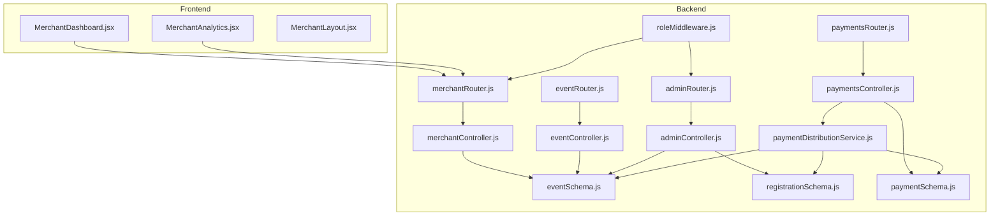
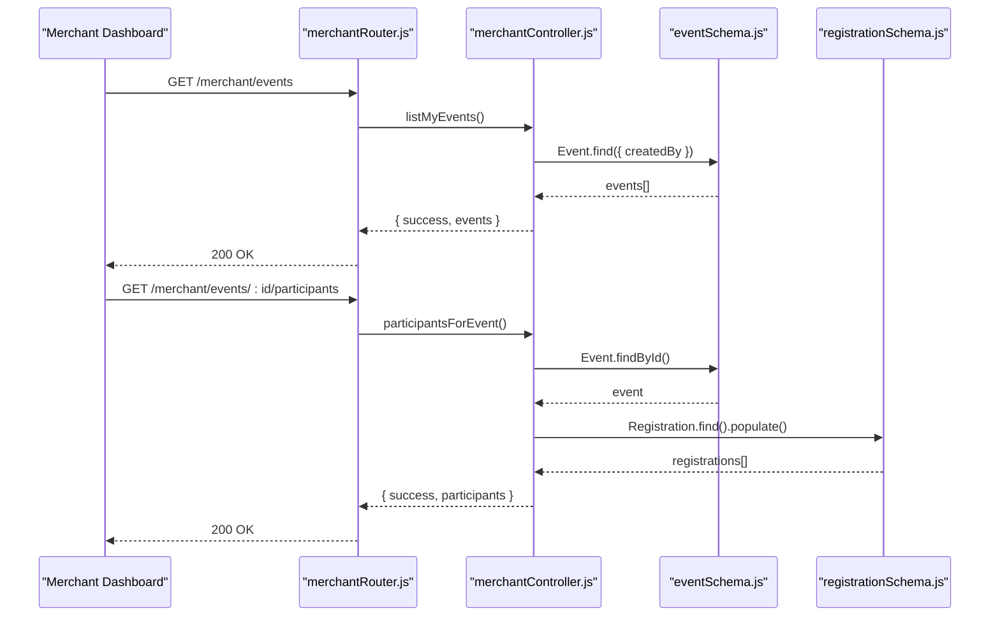
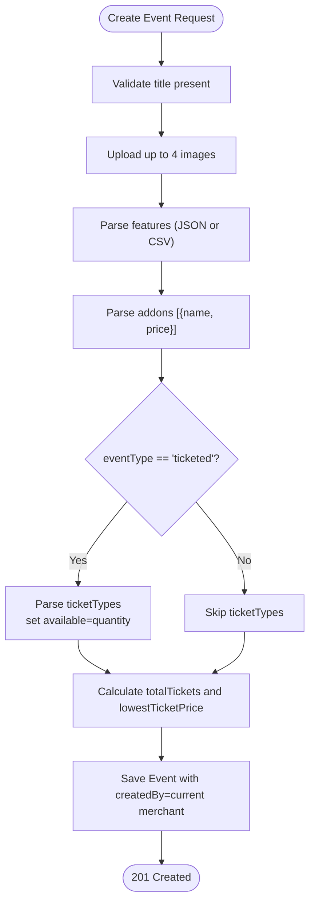
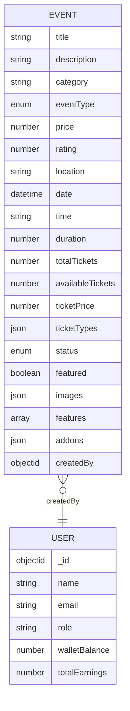
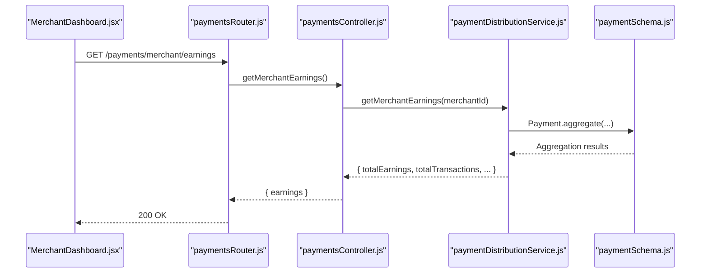
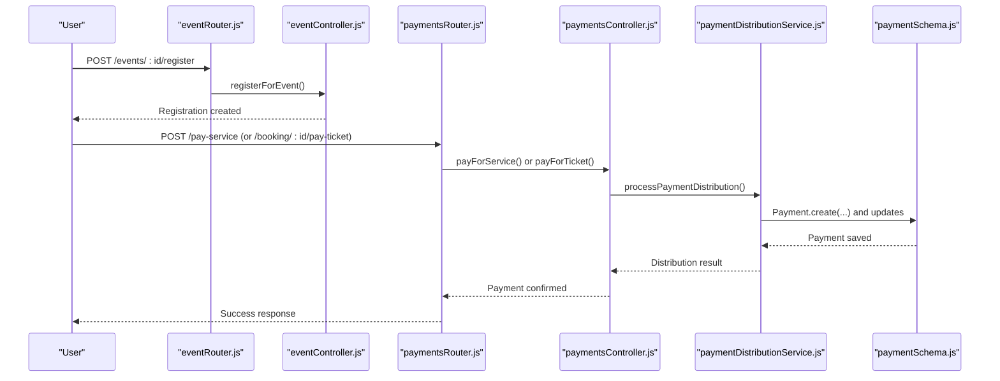
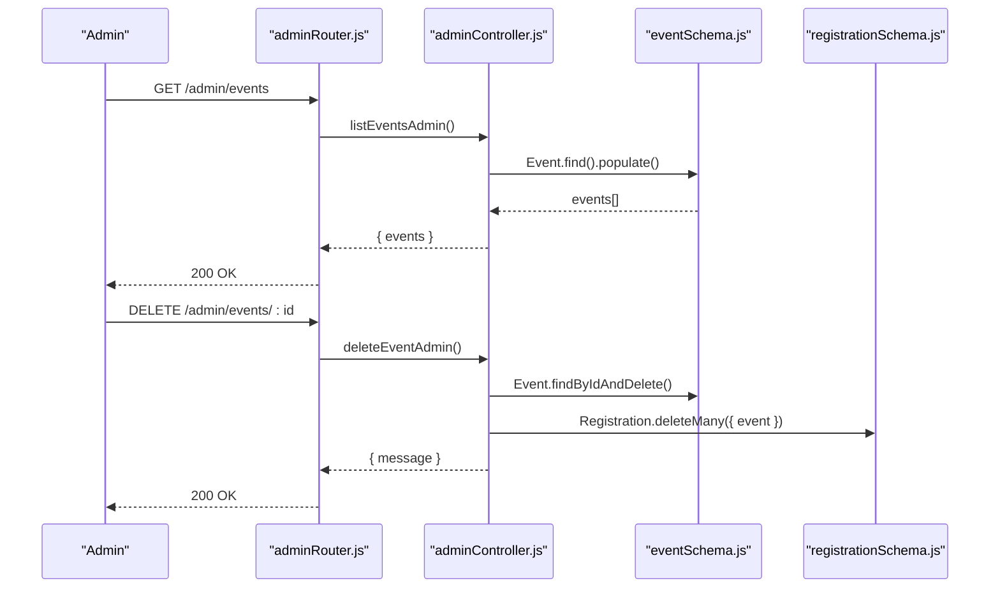
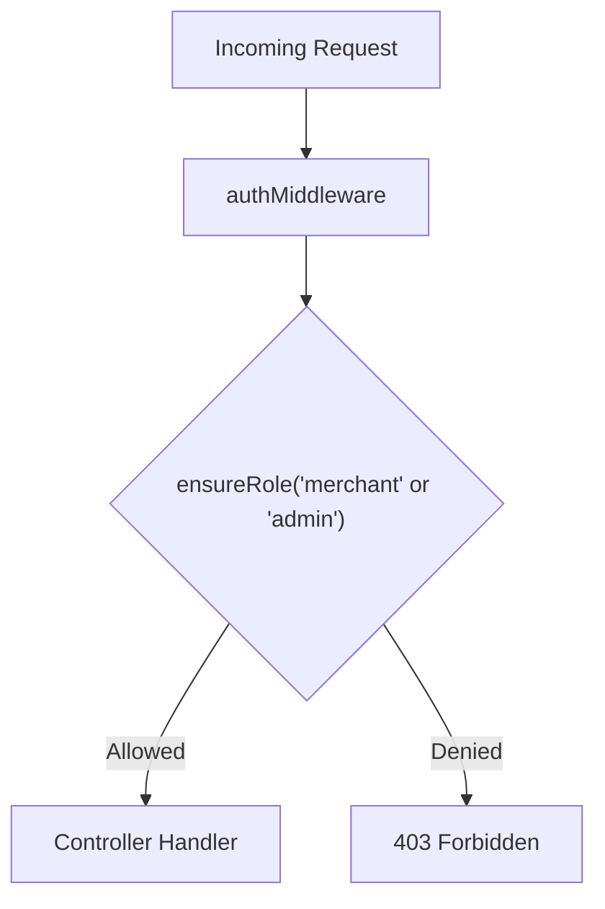
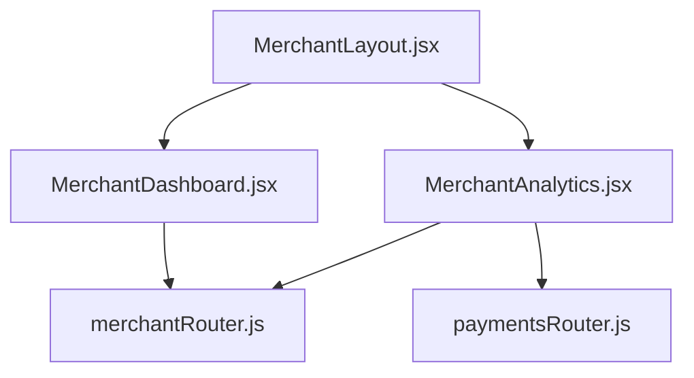
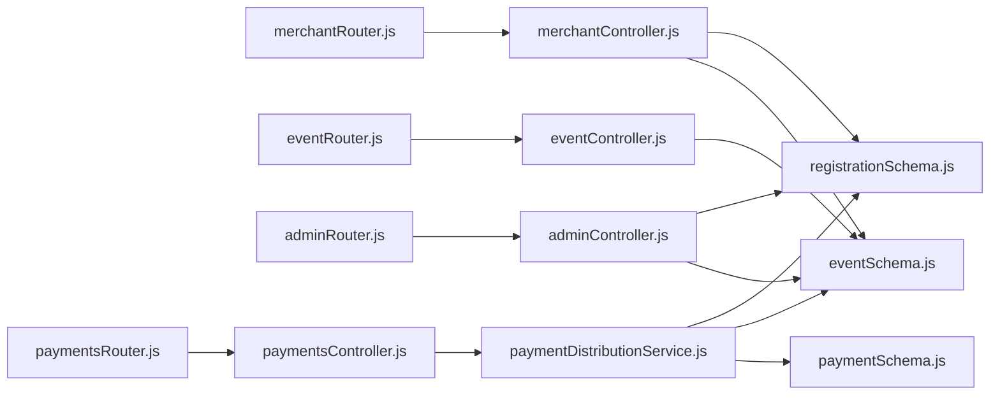

# Event Merchant Management

<cite>
**Referenced Files in This Document**
- [merchantRouter.js](file://backend/router/merchantRouter.js)
- [merchantController.js](file://backend/controller/merchantController.js)
- [eventSchema.js](file://backend/models/eventSchema.js)
- [roleMiddleware.js](file://backend/middleware/roleMiddleware.js)
- [eventRouter.js](file://backend/router/eventRouter.js)
- [eventController.js](file://backend/controller/eventController.js)
- [adminRouter.js](file://backend/router/adminRouter.js)
- [adminController.js](file://backend/controller/adminController.js)
- [registrationSchema.js](file://backend/models/registrationSchema.js)
- [paymentsRouter.js](file://backend/router/paymentsRouter.js)
- [paymentsController.js](file://backend/controller/paymentsController.js)
- [paymentDistributionService.js](file://backend/services/paymentDistributionService.js)
- [paymentSchema.js](file://backend/models/paymentSchema.js)
- [MerchantDashboard.jsx](file://frontend/src/pages/dashboards/MerchantDashboard.jsx)
- [MerchantAnalytics.jsx](file://frontend/src/pages/dashboards/MerchantAnalytics.jsx)
- [MerchantLayout.jsx](file://frontend/src/components/merchant/MerchantLayout.jsx)
</cite>

## Table of Contents
1. [Introduction](#introduction)
2. [Project Structure](#project-structure)
3. [Core Components](#core-components)
4. [Architecture Overview](#architecture-overview)
5. [Detailed Component Analysis](#detailed-component-analysis)
6. [Dependency Analysis](#dependency-analysis)
7. [Performance Considerations](#performance-considerations)
8. [Troubleshooting Guide](#troubleshooting-guide)
9. [Conclusion](#conclusion)
10. [Appendices](#appendices)

## Introduction
This document provides comprehensive API documentation for merchant-specific event management features. It covers merchant-only endpoints for creating, updating, retrieving, and deleting events; participant management; event categorization and pricing; merchant analytics and earnings; and administrative oversight. It also explains the booking and payment workflows relevant to merchants, including full-service and ticketed events, and outlines merchant dashboard integrations and administrative controls.

## Project Structure
The merchant event management feature spans backend routers/controllers/models, middleware for authentication and roles, and frontend dashboard pages. The backend exposes REST endpoints under merchant and admin namespaces, while the frontend integrates with these endpoints to render merchant dashboards and analytics.

**Diagram sources**
- [merchantRouter.js:1-17](file://backend/router/merchantRouter.js#L1-L17)
- [merchantController.js:1-209](file://backend/controller/merchantController.js#L1-L209)
- [eventRouter.js:1-13](file://backend/router/eventRouter.js#L1-L13)
- [eventController.js:1-35](file://backend/controller/eventController.js#L1-L35)
- [adminRouter.js:1-29](file://backend/router/adminRouter.js#L1-L29)
- [adminController.js:1-194](file://backend/controller/adminController.js#L1-L194)
- [paymentsRouter.js:1-44](file://backend/router/paymentsRouter.js#L1-L44)
- [paymentsController.js:1-281](file://backend/controller/paymentsController.js#L1-L281)
- [paymentDistributionService.js:1-340](file://backend/services/paymentDistributionService.js#L1-L340)
- [eventSchema.js:1-51](file://backend/models/eventSchema.js#L1-L51)
- [registrationSchema.js:1-12](file://backend/models/registrationSchema.js#L1-L12)
- [paymentSchema.js:1-142](file://backend/models/paymentSchema.js#L1-L142)
- [roleMiddleware.js:1-9](file://backend/middleware/roleMiddleware.js#L1-L9)
- [MerchantDashboard.jsx:1-133](file://frontend/src/pages/dashboards/MerchantDashboard.jsx#L1-L133)
- [MerchantAnalytics.jsx:1-156](file://frontend/src/pages/dashboards/MerchantAnalytics.jsx#L1-L156)
- [MerchantLayout.jsx:1-29](file://frontend/src/components/merchant/MerchantLayout.jsx#L1-L29)

**Section sources**
- [merchantRouter.js:1-17](file://backend/router/merchantRouter.js#L1-L17)
- [merchantController.js:1-209](file://backend/controller/merchantController.js#L1-L209)
- [eventSchema.js:1-51](file://backend/models/eventSchema.js#L1-L51)
- [roleMiddleware.js:1-9](file://backend/middleware/roleMiddleware.js#L1-L9)
- [eventRouter.js:1-13](file://backend/router/eventRouter.js#L1-L13)
- [eventController.js:1-35](file://backend/controller/eventController.js#L1-L35)
- [adminRouter.js:1-29](file://backend/router/adminRouter.js#L1-L29)
- [adminController.js:1-194](file://backend/controller/adminController.js#L1-L194)
- [registrationSchema.js:1-12](file://backend/models/registrationSchema.js#L1-L12)
- [paymentsRouter.js:1-44](file://backend/router/paymentsRouter.js#L1-L44)
- [paymentsController.js:1-281](file://backend/controller/paymentsController.js#L1-L281)
- [paymentDistributionService.js:1-340](file://backend/services/paymentDistributionService.js#L1-L340)
- [paymentSchema.js:1-142](file://backend/models/paymentSchema.js#L1-L142)
- [MerchantDashboard.jsx:1-133](file://frontend/src/pages/dashboards/MerchantDashboard.jsx#L1-L133)
- [MerchantAnalytics.jsx:1-156](file://frontend/src/pages/dashboards/MerchantAnalytics.jsx#L1-L156)
- [MerchantLayout.jsx:1-29](file://frontend/src/components/merchant/MerchantLayout.jsx#L1-L29)

## Core Components
- Merchant event endpoints: create, update, list, retrieve, delete, and participant listing for a specific event.
- Event model with fields for title, description, category, pricing, scheduling, ticketing, and merchant ownership.
- Role-based access control ensuring only merchants can manage their own events.
- Participant enrollment via user-facing endpoints; merchant can view participants per event.
- Merchant analytics and earnings retrieval via payments endpoints.
- Administrative oversight: admin-managed merchant accounts, event listing/deletion, and reporting.

**Section sources**
- [merchantRouter.js:9-14](file://backend/router/merchantRouter.js#L9-L14)
- [merchantController.js:5-98](file://backend/controller/merchantController.js#L5-L98)
- [merchantController.js:100-147](file://backend/controller/merchantController.js#L100-L147)
- [merchantController.js:149-158](file://backend/controller/merchantController.js#L149-L158)
- [merchantController.js:160-172](file://backend/controller/merchantController.js#L160-L172)
- [merchantController.js:174-187](file://backend/controller/merchantController.js#L174-L187)
- [merchantController.js:189-208](file://backend/controller/merchantController.js#L189-L208)
- [eventSchema.js:3-48](file://backend/models/eventSchema.js#L3-L48)
- [roleMiddleware.js:1-9](file://backend/middleware/roleMiddleware.js#L1-L9)
- [eventRouter.js:8-10](file://backend/router/eventRouter.js#L8-L10)
- [eventController.js:13-25](file://backend/controller/eventController.js#L13-L25)
- [eventController.js:27-34](file://backend/controller/eventController.js#L27-L34)
- [adminRouter.js:19-26](file://backend/router/adminRouter.js#L19-L26)
- [adminController.js:89-107](file://backend/controller/adminController.js#L89-L107)
- [adminController.js:118-177](file://backend/controller/adminController.js#L118-L177)
- [paymentsRouter.js:39-41](file://backend/router/paymentsRouter.js#L39-L41)
- [paymentDistributionService.js:308-340](file://backend/services/paymentDistributionService.js#L308-L340)

## Architecture Overview
The merchant event management feature follows a layered architecture:
- Frontend dashboards call merchant endpoints to manage events and view analytics.
- Backend routes enforce authentication and role checks, delegating to controllers.
- Controllers interact with models and services to persist and compute data.
- Payment distribution service handles merchant earnings and admin commission.

**Diagram sources**
- [merchantRouter.js:11-13](file://backend/router/merchantRouter.js#L11-L13)
- [merchantController.js:149-158](file://backend/controller/merchantController.js#L149-L158)
- [merchantController.js:174-187](file://backend/controller/merchantController.js#L174-L187)
- [eventSchema.js:1-51](file://backend/models/eventSchema.js#L1-L51)
- [registrationSchema.js:1-12](file://backend/models/registrationSchema.js#L1-L12)

**Section sources**
- [merchantRouter.js:1-17](file://backend/router/merchantRouter.js#L1-L17)
- [merchantController.js:1-209](file://backend/controller/merchantController.js#L1-L209)
- [eventSchema.js:1-51](file://backend/models/eventSchema.js#L1-L51)
- [registrationSchema.js:1-12](file://backend/models/registrationSchema.js#L1-L12)

## Detailed Component Analysis

### Merchant Event Endpoints
- Create event: POST /merchant/events
  - Authentication: required
  - Role: merchant
  - Body fields: title, description, category, price, rating, features, eventType, location, date, time, duration, totalTickets, ticketPrice, addons, ticketTypes
  - File uploads: up to four images via upload array
  - Behavior: validates title, parses features/addons/ticketTypes, calculates totals, sets createdBy to current merchant
- Update event: PUT /merchant/events/:id
  - Authentication: required
  - Role: merchant
  - Ownership check: createdBy must match current user
  - Behavior: updates provided fields; replaces images if new files supplied
- List my events: GET /merchant/events
  - Authentication: required
  - Role: merchant
  - Behavior: returns events owned by the merchant
- Get event: GET /merchant/events/:id
  - Authentication: required
  - Role: merchant
  - Ownership check: createdBy must match current user
- Participants for event: GET /merchant/events/:id/participants
  - Authentication: required
  - Role: merchant
  - Ownership check: createdBy must match current user
  - Behavior: returns registrations with user details
- Delete event: DELETE /merchant/events/:id
  - Authentication: required
  - Role: merchant
  - Ownership check: createdBy must match current user
  - Behavior: deletes images from storage, removes event, and associated registrations

**Diagram sources**
- [merchantController.js:5-98](file://backend/controller/merchantController.js#L5-L98)
- [eventSchema.js:3-48](file://backend/models/eventSchema.js#L3-L48)

**Section sources**
- [merchantRouter.js:9-14](file://backend/router/merchantRouter.js#L9-L14)
- [merchantController.js:5-98](file://backend/controller/merchantController.js#L5-L98)
- [merchantController.js:100-147](file://backend/controller/merchantController.js#L100-L147)
- [merchantController.js:149-158](file://backend/controller/merchantController.js#L149-L158)
- [merchantController.js:160-172](file://backend/controller/merchantController.js#L160-L172)
- [merchantController.js:174-187](file://backend/controller/merchantController.js#L174-L187)
- [merchantController.js:189-208](file://backend/controller/merchantController.js#L189-L208)
- [eventSchema.js:3-48](file://backend/models/eventSchema.js#L3-L48)

### Event Model and Pricing
Key fields:
- Identity: title, description, category
- Type and schedule: eventType (enum: full-service, ticketed), date, time, duration
- Pricing: price (full-service), ticketPrice (lowest from ticketTypes), totalTickets, availableTickets
- Ticket types: array with name, price, quantity, available
- Status and visibility: status (active, inactive, completed), featured
- Media: images array with public_id and url
- Features and addons: arrays for event features and optional add-ons
- Ownership: createdBy references User

**Diagram sources**
- [eventSchema.js:3-48](file://backend/models/eventSchema.js#L3-L48)

**Section sources**
- [eventSchema.js:1-51](file://backend/models/eventSchema.js#L1-L51)

### Merchant Analytics and Earnings
- Merchant dashboard fetches:
  - My events: GET /merchant/events
  - Merchant earnings summary: GET /payments/merchant/earnings
- Analytics page computes:
  - Total events, upcoming events, total bookings, total earnings
  - Earnings summary: wallet balance, lifetime earnings, transactions
- Earnings aggregation:
  - Payment records grouped by merchant with success status
  - Wallet balance and lifetime earnings updated in User model

**Diagram sources**
- [MerchantDashboard.jsx:19-25](file://frontend/src/pages/dashboards/MerchantDashboard.jsx#L19-L25)
- [MerchantAnalytics.jsx:15-24](file://frontend/src/pages/dashboards/MerchantAnalytics.jsx#L15-L24)
- [paymentsRouter.js:39-41](file://backend/router/paymentsRouter.js#L39-L41)
- [paymentDistributionService.js:308-340](file://backend/services/paymentDistributionService.js#L308-L340)
- [paymentSchema.js:1-142](file://backend/models/paymentSchema.js#L1-L142)

**Section sources**
- [MerchantDashboard.jsx:1-133](file://frontend/src/pages/dashboards/MerchantDashboard.jsx#L1-L133)
- [MerchantAnalytics.jsx:1-156](file://frontend/src/pages/dashboards/MerchantAnalytics.jsx#L1-L156)
- [paymentsRouter.js:39-41](file://backend/router/paymentsRouter.js#L39-L41)
- [paymentDistributionService.js:308-340](file://backend/services/paymentDistributionService.js#L308-L340)
- [paymentSchema.js:1-142](file://backend/models/paymentSchema.js#L1-L142)

### Booking and Payment Workflows (Merchant Perspective)
- Full-service events:
  - Users register via POST /events/:id/register
  - Merchant confirms bookings; payment finalized via pay-for-service endpoint
- Ticketed events:
  - Users select ticket types and quantities
  - Payment via pay-for-ticket endpoint automatically completes the booking
- Payment distribution:
  - Commission calculated (default 5% to admin)
  - Merchant wallet and lifetime earnings updated
  - Admin commission tracking updated

**Diagram sources**
- [eventRouter.js:8-10](file://backend/router/eventRouter.js#L8-L10)
- [eventController.js:13-25](file://backend/controller/eventController.js#L13-L25)
- [paymentsRouter.js:21-25](file://backend/router/paymentsRouter.js#L21-L25)
- [paymentsController.js:109-185](file://backend/controller/paymentsController.js#L109-L185)
- [paymentsController.js:188-280](file://backend/controller/paymentsController.js#L188-L280)
- [paymentDistributionService.js:33-159](file://backend/services/paymentDistributionService.js#L33-L159)
- [paymentSchema.js:3-104](file://backend/models/paymentSchema.js#L3-L104)

**Section sources**
- [eventRouter.js:1-13](file://backend/router/eventRouter.js#L1-L13)
- [eventController.js:1-35](file://backend/controller/eventController.js#L1-L35)
- [paymentsRouter.js:1-44](file://backend/router/paymentsRouter.js#L1-L44)
- [paymentsController.js:1-281](file://backend/controller/paymentsController.js#L1-L281)
- [paymentDistributionService.js:1-340](file://backend/services/paymentDistributionService.js#L1-L340)
- [paymentSchema.js:1-142](file://backend/models/paymentSchema.js#L1-L142)

### Administrative Oversight
- Admin endpoints:
  - List users and merchants
  - Create merchant accounts and send credentials via email
  - List/delete events (with cascading registration removal)
  - View registrations
  - Generate reports including totals, recent activity, and revenue
- Public stats: total events/users/merchants

**Diagram sources**
- [adminRouter.js:19-26](file://backend/router/adminRouter.js#L19-L26)
- [adminController.js:89-107](file://backend/controller/adminController.js#L89-L107)
- [eventSchema.js:1-51](file://backend/models/eventSchema.js#L1-L51)
- [registrationSchema.js:1-12](file://backend/models/registrationSchema.js#L1-L12)

**Section sources**
- [adminRouter.js:1-29](file://backend/router/adminRouter.js#L1-L29)
- [adminController.js:1-194](file://backend/controller/adminController.js#L1-L194)
- [eventSchema.js:1-51](file://backend/models/eventSchema.js#L1-L51)
- [registrationSchema.js:1-12](file://backend/models/registrationSchema.js#L1-L12)

### Permissions and Role Enforcement
- ensureRole middleware enforces allowed roles for protected routes.
- Merchant endpoints require both authentication and merchant role.
- Admin endpoints require admin role.

**Diagram sources**
- [roleMiddleware.js:1-9](file://backend/middleware/roleMiddleware.js#L1-L9)
- [merchantRouter.js:2-3](file://backend/router/merchantRouter.js#L2-L3)
- [adminRouter.js:2-3](file://backend/router/adminRouter.js#L2-L3)

**Section sources**
- [roleMiddleware.js:1-9](file://backend/middleware/roleMiddleware.js#L1-L9)
- [merchantRouter.js:2-3](file://backend/router/merchantRouter.js#L2-L3)
- [adminRouter.js:2-3](file://backend/router/adminRouter.js#L2-L3)

### Frontend Merchant Dashboard Integrations
- MerchantLayout wraps sidebar, topbar, and main content area.
- MerchantDashboard:
  - Loads merchant’s events
  - Provides actions to create, edit, and delete events
  - Shows summary cards and event table
- MerchantAnalytics:
  - Fetches events and earnings
  - Computes totals and displays performance table and earnings summary

**Diagram sources**
- [MerchantLayout.jsx:1-29](file://frontend/src/components/merchant/MerchantLayout.jsx#L1-L29)
- [MerchantDashboard.jsx:1-133](file://frontend/src/pages/dashboards/MerchantDashboard.jsx#L1-L133)
- [MerchantAnalytics.jsx:1-156](file://frontend/src/pages/dashboards/MerchantAnalytics.jsx#L1-L156)
- [merchantRouter.js:1-17](file://backend/router/merchantRouter.js#L1-L17)
- [paymentsRouter.js:1-44](file://backend/router/paymentsRouter.js#L1-L44)

**Section sources**
- [MerchantLayout.jsx:1-29](file://frontend/src/components/merchant/MerchantLayout.jsx#L1-L29)
- [MerchantDashboard.jsx:1-133](file://frontend/src/pages/dashboards/MerchantDashboard.jsx#L1-L133)
- [MerchantAnalytics.jsx:1-156](file://frontend/src/pages/dashboards/MerchantAnalytics.jsx#L1-L156)

## Dependency Analysis
- Merchant endpoints depend on:
  - Authentication and role middleware
  - Event model for persistence
  - Registration model for participant queries
- Payments and distribution depend on:
  - Payment schema for records
  - Booking and user models for updates
- Admin endpoints depend on:
  - Event and Registration models for listings and deletions
  - User model for merchant management and stats

**Diagram sources**
- [merchantRouter.js:1-17](file://backend/router/merchantRouter.js#L1-L17)
- [merchantController.js:1-209](file://backend/controller/merchantController.js#L1-L209)
- [eventSchema.js:1-51](file://backend/models/eventSchema.js#L1-L51)
- [registrationSchema.js:1-12](file://backend/models/registrationSchema.js#L1-L12)
- [eventRouter.js:1-13](file://backend/router/eventRouter.js#L1-L13)
- [eventController.js:1-35](file://backend/controller/eventController.js#L1-L35)
- [adminRouter.js:1-29](file://backend/router/adminRouter.js#L1-L29)
- [adminController.js:1-194](file://backend/controller/adminController.js#L1-L194)
- [paymentsRouter.js:1-44](file://backend/router/paymentsRouter.js#L1-L44)
- [paymentsController.js:1-281](file://backend/controller/paymentsController.js#L1-L281)
- [paymentDistributionService.js:1-340](file://backend/services/paymentDistributionService.js#L1-L340)
- [paymentSchema.js:1-142](file://backend/models/paymentSchema.js#L1-L142)

**Section sources**
- [merchantRouter.js:1-17](file://backend/router/merchantRouter.js#L1-L17)
- [merchantController.js:1-209](file://backend/controller/merchantController.js#L1-L209)
- [eventSchema.js:1-51](file://backend/models/eventSchema.js#L1-L51)
- [registrationSchema.js:1-12](file://backend/models/registrationSchema.js#L1-L12)
- [eventRouter.js:1-13](file://backend/router/eventRouter.js#L1-L13)
- [eventController.js:1-35](file://backend/controller/eventController.js#L1-L35)
- [adminRouter.js:1-29](file://backend/router/adminRouter.js#L1-L29)
- [adminController.js:1-194](file://backend/controller/adminController.js#L1-L194)
- [paymentsRouter.js:1-44](file://backend/router/paymentsRouter.js#L1-L44)
- [paymentsController.js:1-281](file://backend/controller/paymentsController.js#L1-L281)
- [paymentDistributionService.js:1-340](file://backend/services/paymentDistributionService.js#L1-L340)
- [paymentSchema.js:1-142](file://backend/models/paymentSchema.js#L1-L142)

## Performance Considerations
- Event listing queries should leverage indexes on createdBy for efficient filtering.
- Participant queries join Registration with User; ensure indexes on user and event fields.
- Payment aggregations for earnings and admin stats should utilize indexed fields like merchantId and paymentStatus.
- Image uploads should be optimized; limit concurrent uploads and consider batch deletion for cleanup.
- Frontend should cache merchant events and earnings to reduce redundant requests.

## Troubleshooting Guide
Common issues and resolutions:
- 403 Forbidden on merchant endpoints:
  - Ensure authentication token is present and user role is merchant.
- 404 Not Found for event operations:
  - Verify event ID exists and belongs to the current merchant.
- Validation errors on create/update:
  - Confirm required fields (e.g., title) and correct data types for features, addons, and ticketTypes.
- Payment mismatches:
  - For service payments, ensure payment amount equals booking finalAmount.
  - For ticket payments, amount must match booking total price.
- Duplicate payment processing:
  - Payment distribution prevents duplicate processing for the same booking.

**Section sources**
- [merchantController.js:92-97](file://backend/controller/merchantController.js#L92-L97)
- [merchantController.js:105-107](file://backend/controller/merchantController.js#L105-L107)
- [merchantController.js:194-196](file://backend/controller/merchantController.js#L194-L196)
- [paymentsController.js:148-155](file://backend/controller/paymentsController.js#L148-L155)
- [paymentsController.js:236-243](file://backend/controller/paymentsController.js#L236-L243)
- [paymentDistributionService.js:58-66](file://backend/services/paymentDistributionService.js#L58-L66)

## Conclusion
The merchant event management system provides a robust set of APIs for merchants to create, manage, and analyze their events, integrated with participant registration and payment workflows. Administrative controls enable oversight and reporting, while frontend dashboards deliver actionable insights into performance and earnings.

## Appendices

### API Reference Summary

- Merchant Endpoints
  - POST /merchant/events
    - Auth: required, Role: merchant
    - Body: title, description, category, price, rating, features, eventType, location, date, time, duration, totalTickets, ticketPrice, addons, ticketTypes
    - Files: up to 4 images
    - Response: 201 with event
  - PUT /merchant/events/:id
    - Auth: required, Role: merchant
    - Ownership: createdBy must match current user
    - Body: fields to update; optional new images
    - Response: 200 with updated event
  - GET /merchant/events
    - Auth: required, Role: merchant
    - Response: 200 with events[]
  - GET /merchant/events/:id
    - Auth: required, Role: merchant
    - Ownership: createdBy must match current user
    - Response: 200 with event
  - GET /merchant/events/:id/participants
    - Auth: required, Role: merchant
    - Ownership: createdBy must match current user
    - Response: 200 with participants[]
  - DELETE /merchant/events/:id
    - Auth: required, Role: merchant
    - Ownership: createdBy must match current user
    - Response: 200 with message

- User Registration Endpoint
  - POST /events/:id/register
    - Auth: required, Role: user
    - Response: 201 on success, 409 if already registered, 404 if event not found

- Admin Endpoints
  - GET /admin/events
    - Role: admin
    - Response: 200 with events[]
  - DELETE /admin/events/:id
    - Role: admin
    - Response: 200 with message
  - GET /admin/reports
    - Role: admin
    - Response: 200 with aggregated stats
  - GET /admin/public-stats
    - No auth required
    - Response: 200 with totalEvents, totalUsers, totalMerchants

- Merchant Earnings Endpoint
  - GET /payments/merchant/earnings
    - Auth: required
    - Response: 200 with earnings summary

**Section sources**
- [merchantRouter.js:9-14](file://backend/router/merchantRouter.js#L9-L14)
- [eventRouter.js:8-10](file://backend/router/eventRouter.js#L8-L10)
- [adminRouter.js:19-26](file://backend/router/adminRouter.js#L19-L26)
- [paymentsRouter.js:39-41](file://backend/router/paymentsRouter.js#L39-L41)