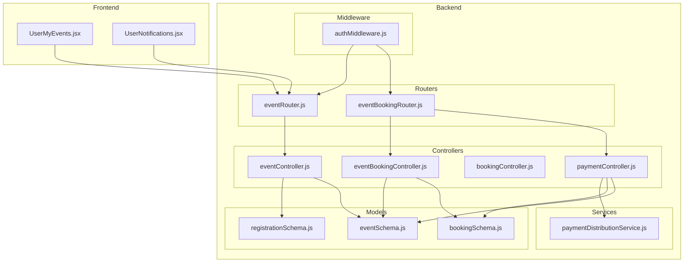
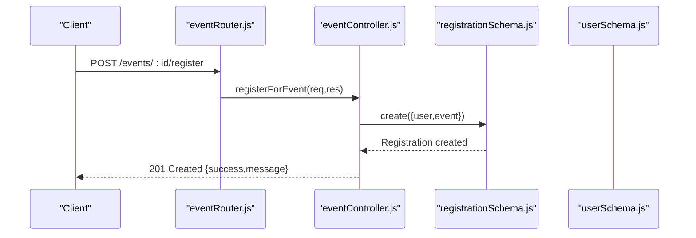
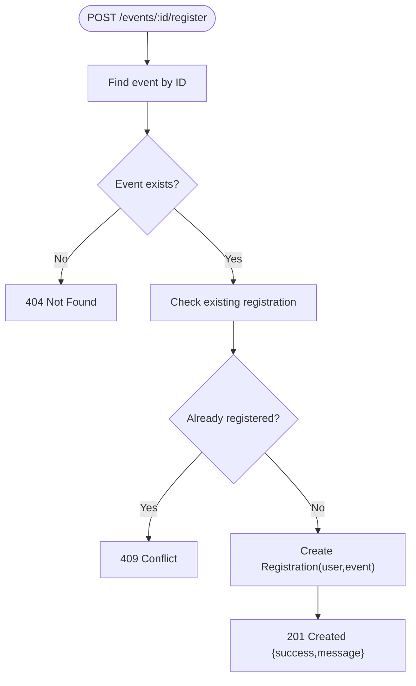
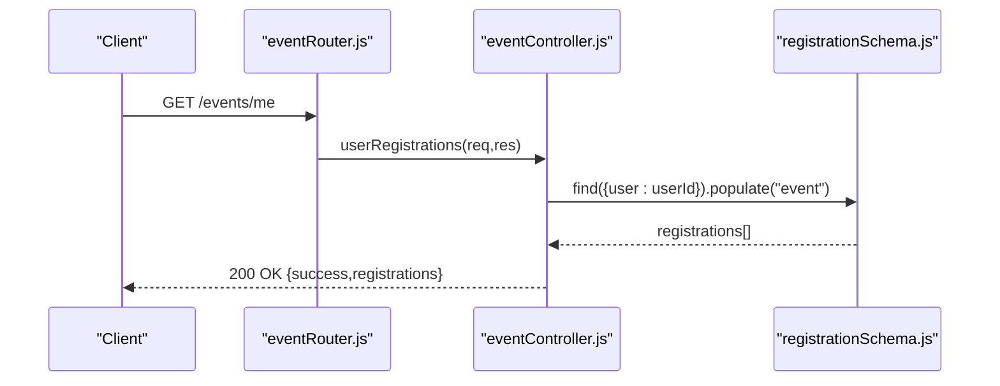
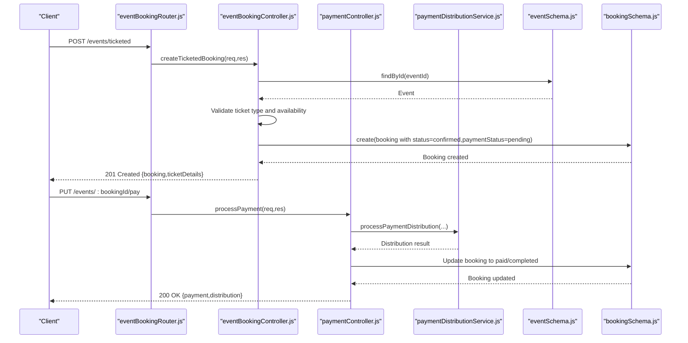
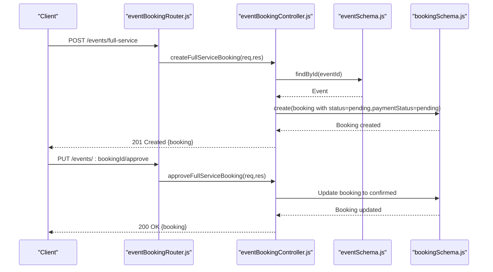
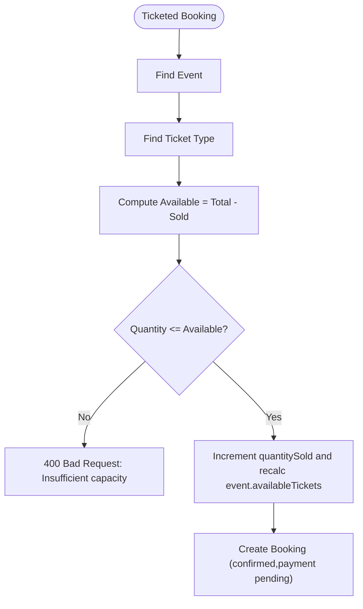
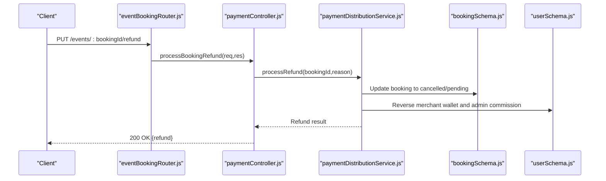
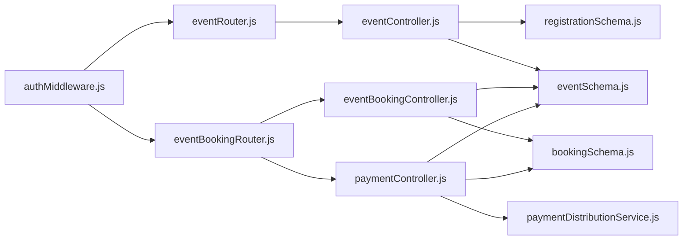

# Event Registration System

<cite>
**Referenced Files in This Document**
- [eventRouter.js](file://backend/router/eventRouter.js)
- [eventController.js](file://backend/controller/eventController.js)
- [registrationSchema.js](file://backend/models/registrationSchema.js)
- [eventSchema.js](file://backend/models/eventSchema.js)
- [eventBookingRouter.js](file://backend/router/eventBookingRouter.js)
- [eventBookingController.js](file://backend/controller/eventBookingController.js)
- [bookingController.js](file://backend/controller/bookingController.js)
- [bookingSchema.js](file://backend/models/bookingSchema.js)
- [paymentController.js](file://backend/controller/paymentController.js)
- [paymentDistributionService.js](file://backend/services/paymentDistributionService.js)
- [authMiddleware.js](file://backend/middleware/authMiddleware.js)
- [UserMyEvents.jsx](file://frontend/src/pages/dashboards/UserMyEvents.jsx)
- [UserNotifications.jsx](file://frontend/src/pages/dashboards/UserNotifications.jsx)
</cite>

## Table of Contents
1. [Introduction](#introduction)
2. [Project Structure](#project-structure)
3. [Core Components](#core-components)
4. [Architecture Overview](#architecture-overview)
5. [Detailed Component Analysis](#detailed-component-analysis)
6. [Dependency Analysis](#dependency-analysis)
7. [Performance Considerations](#performance-considerations)
8. [Troubleshooting Guide](#troubleshooting-guide)
9. [Conclusion](#conclusion)

## Introduction
This document describes the event registration and booking system APIs with a focus on:
- POST /api/v1/events/:id/register for user event registration
- GET /api/v1/events/me for retrieving user event registrations
- Registration validation rules, capacity management, and waitlist functionality
- Registration cancellation policies, refund handling, and notification triggers
- Integration with the broader booking management system and payment processing

The system supports two event types:
- Registration-based events (simple sign-up)
- Ticketed/full-service events (booking with payment and optional merchant approval)

## Project Structure
The backend is organized by feature and technology layer:
- Router layer defines endpoints and applies middleware
- Controller layer implements business logic
- Model layer defines data schemas
- Service layer encapsulates cross-cutting concerns (e.g., payment distribution)
- Middleware enforces authentication and roles

**Diagram sources**
- [eventRouter.js:1-13](file://backend/router/eventRouter.js#L1-L13)
- [eventBookingRouter.js:1-47](file://backend/router/eventBookingRouter.js#L1-L47)
- [eventController.js:1-35](file://backend/controller/eventController.js#L1-L35)
- [eventBookingController.js:1-1607](file://backend/controller/eventBookingController.js#L1-L1607)
- [bookingController.js:1-233](file://backend/controller/bookingController.js#L1-L233)
- [paymentController.js:1-577](file://backend/controller/paymentController.js#L1-L577)
- [registrationSchema.js:1-12](file://backend/models/registrationSchema.js#L1-L12)
- [eventSchema.js:1-51](file://backend/models/eventSchema.js#L1-L51)
- [bookingSchema.js:1-53](file://backend/models/bookingSchema.js#L1-L53)
- [paymentDistributionService.js:1-340](file://backend/services/paymentDistributionService.js#L1-L340)
- [authMiddleware.js:1-17](file://backend/middleware/authMiddleware.js#L1-L17)

**Section sources**
- [eventRouter.js:1-13](file://backend/router/eventRouter.js#L1-L13)
- [eventBookingRouter.js:1-47](file://backend/router/eventBookingRouter.js#L1-L47)
- [eventController.js:1-35](file://backend/controller/eventController.js#L1-L35)
- [eventBookingController.js:1-1607](file://backend/controller/eventBookingController.js#L1-L1607)
- [bookingController.js:1-233](file://backend/controller/bookingController.js#L1-L233)
- [paymentController.js:1-577](file://backend/controller/paymentController.js#L1-L577)
- [registrationSchema.js:1-12](file://backend/models/registrationSchema.js#L1-L12)
- [eventSchema.js:1-51](file://backend/models/eventSchema.js#L1-L51)
- [bookingSchema.js:1-53](file://backend/models/bookingSchema.js#L1-L53)
- [paymentDistributionService.js:1-340](file://backend/services/paymentDistributionService.js#L1-L340)
- [authMiddleware.js:1-17](file://backend/middleware/authMiddleware.js#L1-L17)

## Core Components
- Event registration endpoints:
  - POST /api/v1/events/:id/register (user-only)
  - GET /api/v1/events/me (user-only)
- Event booking endpoints:
  - POST /api/v1/events/create (generic routing)
  - POST /api/v1/events/full-service (user-only)
  - POST /api/v1/events/ticketed (user-only)
  - GET /api/v1/events/event/:eventId/tickets (user-only)
  - GET /api/v1/events/my-bookings (user-only)
  - PUT /api/v1/events/:bookingId/pay (user-only)
- Payment processing:
  - Payment distribution and refund handling via paymentController and paymentDistributionService
- Authentication and roles:
  - JWT-based auth middleware and role enforcement

Key data models:
- Registration: links user to event
- Event: event metadata and ticketing fields
- Booking: booking records for services and tickets

**Section sources**
- [eventRouter.js:8-10](file://backend/router/eventRouter.js#L8-L10)
- [eventBookingRouter.js:26-34](file://backend/router/eventBookingRouter.js#L26-L34)
- [eventController.js:13-34](file://backend/controller/eventController.js#L13-L34)
- [eventBookingController.js:8-73](file://backend/controller/eventBookingController.js#L8-L73)
- [paymentController.js:10-141](file://backend/controller/paymentController.js#L10-L141)
- [paymentDistributionService.js:33-159](file://backend/services/paymentDistributionService.js#L33-L159)
- [authMiddleware.js:3-16](file://backend/middleware/authMiddleware.js#L3-L16)

## Architecture Overview
The system separates concerns across routers, controllers, models, and services. Authentication ensures only authorized users can access protected endpoints. Controllers orchestrate model interactions and integrate with services for payment distribution and refunds. Notifications are created for user and merchant updates.

**Diagram sources**
- [eventRouter.js](file://backend/router/eventRouter.js#L9)
- [eventController.js:13-25](file://backend/controller/eventController.js#L13-L25)
- [registrationSchema.js:1-12](file://backend/models/registrationSchema.js#L1-L12)

**Section sources**
- [eventRouter.js:1-13](file://backend/router/eventRouter.js#L1-L13)
- [eventController.js:1-35](file://backend/controller/eventController.js#L1-L35)
- [registrationSchema.js:1-12](file://backend/models/registrationSchema.js#L1-L12)

## Detailed Component Analysis

### Event Registration API
- Endpoint: POST /api/v1/events/:id/register
- Authentication: Required (user role enforced)
- Behavior:
  - Validates event existence
  - Prevents duplicate registrations per user and event
  - Creates a Registration document linking user and event
- Response:
  - 201 Created on success
  - 404 Not Found if event missing
  - 409 Conflict if already registered

**Diagram sources**
- [eventController.js:13-25](file://backend/controller/eventController.js#L13-L25)

**Section sources**
- [eventRouter.js](file://backend/router/eventRouter.js#L9)
- [eventController.js:13-25](file://backend/controller/eventController.js#L13-L25)
- [registrationSchema.js:1-12](file://backend/models/registrationSchema.js#L1-L12)

### Retrieve User Registrations API
- Endpoint: GET /api/v1/events/me
- Authentication: Required (user role enforced)
- Behavior:
  - Returns all Registration documents for the current user
  - Populates event details for each registration
- Response:
  - 200 OK with registrations array
  - 500 Internal Server Error on failure

**Diagram sources**
- [eventRouter.js](file://backend/router/eventRouter.js#L10)
- [eventController.js:27-34](file://backend/controller/eventController.js#L27-L34)

**Section sources**
- [eventRouter.js](file://backend/router/eventRouter.js#L10)
- [eventController.js:27-34](file://backend/controller/eventController.js#L27-L34)

### Ticketed Event Booking and Payment Integration
- Endpoints:
  - POST /api/v1/events/ticketed (user-only)
  - PUT /api/v1/events/:bookingId/pay (user-only)
- Authentication: JWT required
- Workflow:
  - User selects ticket type and quantity
  - Availability is checked against ticketTypes
  - Booking is created with status "confirmed" and paymentStatus "pending"
  - Payment is processed via paymentController and paymentDistributionService
  - On success, booking status becomes "completed" and ticketId is generated

**Diagram sources**
- [eventBookingRouter.js](file://backend/router/eventBookingRouter.js#L29)
- [eventBookingController.js:322-589](file://backend/controller/eventBookingController.js#L322-L589)
- [paymentController.js:10-141](file://backend/controller/paymentController.js#L10-L141)
- [paymentDistributionService.js:33-159](file://backend/services/paymentDistributionService.js#L33-L159)
- [eventSchema.js:1-51](file://backend/models/eventSchema.js#L1-L51)
- [bookingSchema.js:1-53](file://backend/models/bookingSchema.js#L1-L53)

**Section sources**
- [eventBookingRouter.js](file://backend/router/eventBookingRouter.js#L29)
- [eventBookingController.js:322-589](file://backend/controller/eventBookingController.js#L322-L589)
- [paymentController.js:10-141](file://backend/controller/paymentController.js#L10-L141)
- [paymentDistributionService.js:33-159](file://backend/services/paymentDistributionService.js#L33-L159)
- [eventSchema.js:1-51](file://backend/models/eventSchema.js#L1-L51)
- [bookingSchema.js:1-53](file://backend/models/bookingSchema.js#L1-L53)

### Full-Service Event Booking (with Merchant Approval)
- Endpoints:
  - POST /api/v1/events/full-service (user-only)
  - PUT /api/v1/events/:bookingId/approve (merchant-only)
  - PUT /api/v1/events/:bookingId/reject (merchant-only)
- Workflow:
  - User submits service booking request (pending)
  - Merchant reviews and either approves (status becomes confirmed) or rejects
  - After approval, user pays to complete the booking

**Diagram sources**
- [eventBookingRouter.js](file://backend/router/eventBookingRouter.js#L28)
- [eventBookingController.js:76-319](file://backend/controller/eventBookingController.js#L76-L319)
- [eventSchema.js:1-51](file://backend/models/eventSchema.js#L1-L51)
- [bookingSchema.js:1-53](file://backend/models/bookingSchema.js#L1-L53)

**Section sources**
- [eventBookingRouter.js](file://backend/router/eventBookingRouter.js#L28)
- [eventBookingController.js:76-319](file://backend/controller/eventBookingController.js#L76-L319)

### Capacity Management and Waitlist Functionality
- Ticketed events:
  - Ticket availability is computed as quantityTotal - quantitySold per ticket type
  - Booking creation validates requested quantity against available tickets
  - Updates sold counts atomically and recalculates event.availableTickets
- Registration-based events:
  - No built-in capacity management; registration is simply a link between user and event
  - To enforce capacity, add a maxRegistrants field to Event and validate in registerForEvent

**Diagram sources**
- [eventBookingController.js:368-491](file://backend/controller/eventBookingController.js#L368-L491)
- [eventSchema.js:16-28](file://backend/models/eventSchema.js#L16-L28)

**Section sources**
- [eventBookingController.js:368-491](file://backend/controller/eventBookingController.js#L368-L491)
- [eventSchema.js:16-28](file://backend/models/eventSchema.js#L16-L28)

### Refund Handling and Cancellation Policies
- Refund endpoint:
  - PUT /api/v1/events/:bookingId/refund (user or admin)
  - Validates payment status and authorization
  - Uses processRefund to reverse payment distribution and update balances
- Cancellation:
  - For general bookings, use PUT /api/v1/bookings/:id/cancel (user-only)
  - For event bookings, cancellation logic is integrated into payment/refund flows

**Diagram sources**
- [paymentController.js:221-315](file://backend/controller/paymentController.js#L221-L315)
- [paymentDistributionService.js:167-251](file://backend/services/paymentDistributionService.js#L167-L251)
- [bookingSchema.js:1-53](file://backend/models/bookingSchema.js#L1-L53)

**Section sources**
- [paymentController.js:221-315](file://backend/controller/paymentController.js#L221-L315)
- [paymentDistributionService.js:167-251](file://backend/services/paymentDistributionService.js#L167-L251)

### Notification Triggers
- Registration:
  - After successful registration, a notification is created for the user
- Booking:
  - Full-service: notifications for merchant on new requests and for user on approval/rejection
  - Ticketed: notifications for user to complete payment and upon successful payment
- Refund:
  - Notifications for user and merchant upon refund processing

**Section sources**
- [eventController.js:13-25](file://backend/controller/eventController.js#L13-L25)
- [eventBookingController.js:287-300](file://backend/controller/eventBookingController.js#L287-L300)
- [eventBookingController.js:545-557](file://backend/controller/eventBookingController.js#L545-L557)
- [paymentController.js:89-114](file://backend/controller/paymentController.js#L89-L114)
- [paymentController.js:269-294](file://backend/controller/paymentController.js#L269-L294)

### Frontend Integration Notes
- UserMyEvents page consumes GET /events/me and displays registrations
- UserNotifications page consumes GET /events/me to generate upcoming event reminders

**Section sources**
- [UserMyEvents.jsx:21-37](file://frontend/src/pages/dashboards/UserMyEvents.jsx#L21-L37)
- [UserNotifications.jsx:21-59](file://frontend/src/pages/dashboards/UserNotifications.jsx#L21-L59)

## Dependency Analysis
- Authentication:
  - authMiddleware verifies JWT and attaches user info to req
- Authorization:
  - ensureRole middleware restricts endpoints to specific roles (user, merchant)
- Controllers depend on:
  - Models for persistence
  - Services for payment distribution and refund logic
- Routers bind endpoints to controllers and apply middleware

**Diagram sources**
- [authMiddleware.js:1-17](file://backend/middleware/authMiddleware.js#L1-L17)
- [eventRouter.js:1-13](file://backend/router/eventRouter.js#L1-L13)
- [eventBookingRouter.js:1-47](file://backend/router/eventBookingRouter.js#L1-L47)
- [eventController.js:1-35](file://backend/controller/eventController.js#L1-L35)
- [eventBookingController.js:1-1607](file://backend/controller/eventBookingController.js#L1-L1607)
- [paymentController.js:1-577](file://backend/controller/paymentController.js#L1-L577)
- [registrationSchema.js:1-12](file://backend/models/registrationSchema.js#L1-L12)
- [eventSchema.js:1-51](file://backend/models/eventSchema.js#L1-L51)
- [bookingSchema.js:1-53](file://backend/models/bookingSchema.js#L1-L53)
- [paymentDistributionService.js:1-340](file://backend/services/paymentDistributionService.js#L1-L340)

**Section sources**
- [authMiddleware.js:1-17](file://backend/middleware/authMiddleware.js#L1-L17)
- [eventRouter.js:1-13](file://backend/router/eventRouter.js#L1-L13)
- [eventBookingRouter.js:1-47](file://backend/router/eventBookingRouter.js#L1-L47)
- [eventController.js:1-35](file://backend/controller/eventController.js#L1-L35)
- [eventBookingController.js:1-1607](file://backend/controller/eventBookingController.js#L1-L1607)
- [paymentController.js:1-577](file://backend/controller/paymentController.js#L1-L577)
- [registrationSchema.js:1-12](file://backend/models/registrationSchema.js#L1-L12)
- [eventSchema.js:1-51](file://backend/models/eventSchema.js#L1-L51)
- [bookingSchema.js:1-53](file://backend/models/bookingSchema.js#L1-L53)
- [paymentDistributionService.js:1-340](file://backend/services/paymentDistributionService.js#L1-L340)

## Performance Considerations
- Indexing recommendations:
  - Registration: { user, event } compound index to prevent duplicate registrations efficiently
  - Booking: { user, status } to quickly filter user bookings
  - Event: { ticketTypes.name } to speed up ticket type lookups
- Aggregation queries:
  - Payment statistics and merchant earnings use aggregation pipelines; ensure proper indexing on date and status fields
- Concurrency:
  - Ticket quantity updates should be atomic; current implementation updates the event document which includes ticketTypes; consider atomic updates to individual ticketType fields if contention arises

[No sources needed since this section provides general guidance]

## Troubleshooting Guide
Common issues and resolutions:
- Unauthorized access:
  - Ensure Authorization: Bearer <token> header is present and valid
  - Verify user role matches endpoint requirements
- Registration conflicts:
  - Duplicate registration error indicates the user is already registered for the event
- Ticket availability errors:
  - Requested quantity exceeds available tickets; reduce quantity or choose another ticket type
- Payment errors:
  - Booking must be in a valid state for payment; ensure bookingStatus allows payment
  - Payment already processed; avoid duplicate payments
- Refund errors:
  - Booking must be paid and not already refunded; verify paymentStatus and authorization

**Section sources**
- [authMiddleware.js:3-16](file://backend/middleware/authMiddleware.js#L3-L16)
- [eventController.js:13-25](file://backend/controller/eventController.js#L13-L25)
- [eventBookingController.js:377-391](file://backend/controller/eventBookingController.js#L377-L391)
- [paymentController.js:34-48](file://backend/controller/paymentController.js#L34-L48)
- [paymentController.js:247-261](file://backend/controller/paymentController.js#L247-L261)

## Conclusion
The event registration and booking system provides a clear separation of concerns with dedicated endpoints for registration, booking, and payment. It supports both simple registration and complex ticketed/full-service workflows with robust validation, capacity management, and payment/refund handling. Authentication and role-based access control ensure secure access, while notifications keep users and merchants informed throughout the lifecycle.