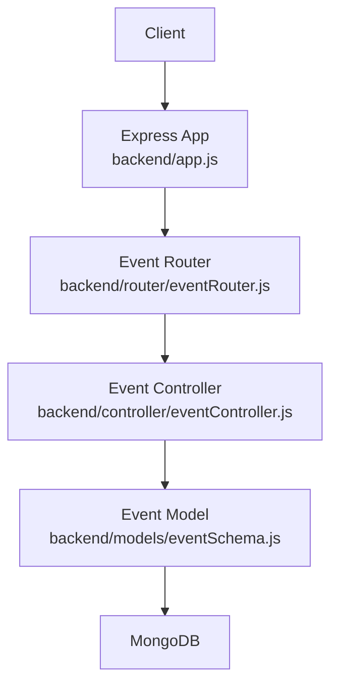
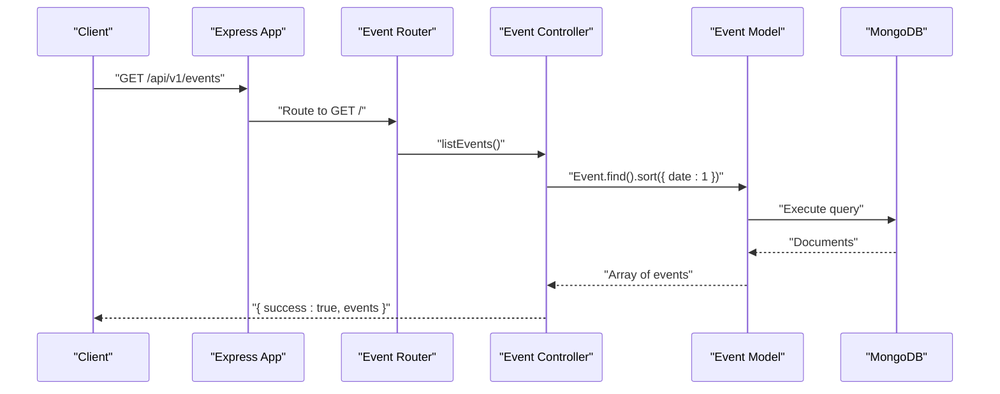
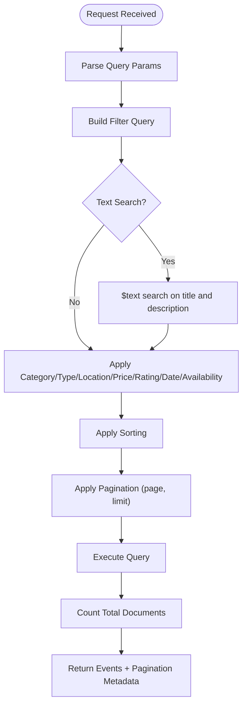
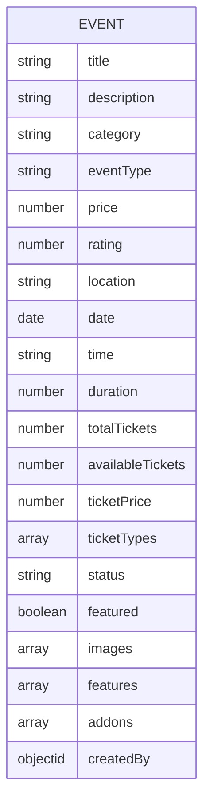
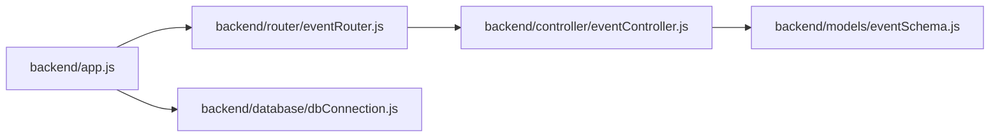

# Event Search and Filtering

<cite>
**Referenced Files in This Document**
- [app.js](file://backend/app.js)
- [eventRouter.js](file://backend/router/eventRouter.js)
- [eventController.js](file://backend/controller/eventController.js)
- [eventSchema.js](file://backend/models/eventSchema.js)
- [dbConnection.js](file://backend/database/dbConnection.js)
- [serviceController.js](file://backend/controller/serviceController.js)
- [couponController.js](file://backend/controller/couponController.js)
</cite>

## Table of Contents
1. [Introduction](#introduction)
2. [Project Structure](#project-structure)
3. [Core Components](#core-components)
4. [Architecture Overview](#architecture-overview)
5. [Detailed Component Analysis](#detailed-component-analysis)
6. [Dependency Analysis](#dependency-analysis)
7. [Performance Considerations](#performance-considerations)
8. [Troubleshooting Guide](#troubleshooting-guide)
9. [Conclusion](#conclusion)

## Introduction
This document provides comprehensive API documentation for event search and filtering capabilities. It explains the current state of the event listing endpoint, outlines the desired filtering and search parameters (category, date range, location, price, availability, event type, rating, and time-based sorting), and describes how to implement them. It also details pagination parameters and their impact on the response format, and provides guidance on performance and indexing strategies for MongoDB.

## Project Structure
The event search and filtering functionality is exposed via a dedicated route and controller. The Express application mounts the event routes under the base path, and the controller currently lists all events sorted by date. The event model defines the schema used by the search/filter logic.

**Diagram sources**
- [app.js:35-47](file://backend/app.js#L35-L47)
- [eventRouter.js:1-13](file://backend/router/eventRouter.js#L1-L13)
- [eventController.js:4-11](file://backend/controller/eventController.js#L4-L11)
- [eventSchema.js:1-51](file://backend/models/eventSchema.js#L1-L51)

**Section sources**
- [app.js:35-47](file://backend/app.js#L35-L47)
- [eventRouter.js:1-13](file://backend/router/eventRouter.js#L1-L13)
- [eventController.js:4-11](file://backend/controller/eventController.js#L4-L11)
- [eventSchema.js:1-51](file://backend/models/eventSchema.js#L1-L51)

## Core Components
- Base URL: `/api/v1/events`
- Current endpoint: GET `/` returns all events sorted by date ascending.
- Response format: JSON object containing a success flag and an array of events.

Key considerations for extending the endpoint:
- Query parameters to support: category, eventType, location, priceMin/priceMax, ratingMin, dateStart/dateEnd, availability (e.g., hasAvailableTickets or similar), and pagination/sorting.
- Sorting options: date ascending/descending, price, rating, and default to newest.
- Pagination: page and limit with total count and next/previous indicators.

**Section sources**
- [eventRouter.js:8](file://backend/router/eventRouter.js#L8)
- [eventController.js:6](file://backend/controller/eventController.js#L6)

## Architecture Overview
The event listing endpoint follows a standard MVC pattern: the client sends a GET request to the mounted route, the router delegates to the controller, which queries the Event model, and the model interacts with MongoDB.

**Diagram sources**
- [app.js:35-47](file://backend/app.js#L35-L47)
- [eventRouter.js:8](file://backend/router/eventRouter.js#L8)
- [eventController.js:6](file://backend/controller/eventController.js#L6)
- [eventSchema.js:1-51](file://backend/models/eventSchema.js#L1-L51)

## Detailed Component Analysis

### Event Listing Endpoint
- Path: `/api/v1/events`
- Method: GET
- Purpose: Retrieve a list of events with basic sorting by date ascending.
- Response: `{ success: boolean, events: Event[] }`

Current implementation details:
- Uses `Event.find()` with `sort({ date: 1 })`.
- Returns a 500 error on unknown exceptions.

Future enhancements to implement:
- Add query parameter parsing for category, eventType, location, priceMin/priceMax, ratingMin, dateStart/dateEnd, availability flags.
- Implement text search across title and description (similar to service search).
- Introduce pagination with page and limit, and compute total pages and next/prev indicators.
- Support sorting by date (asc/desc), price, rating, and default to newest.

**Diagram sources**
- [eventController.js:6](file://backend/controller/eventController.js#L6)
- [serviceController.js:76-104](file://backend/controller/serviceController.js#L76-L104)
- [couponController.js:510-556](file://backend/controller/couponController.js#L510-L556)

**Section sources**
- [eventRouter.js:8](file://backend/router/eventRouter.js#L8)
- [eventController.js:4-11](file://backend/controller/eventController.js#L4-L11)

### Event Model Schema
The Event model defines the fields used for filtering and sorting. These include:
- Identity and metadata: title, description, category, eventType, rating, status, featured.
- Pricing: price, totalTickets, availableTickets, ticketPrice, ticketTypes.
- Schedule and location: date, time, duration, location.
- Additional fields: images, features, addons, createdBy.

These fields inform the available filters and sorting options.

**Diagram sources**
- [eventSchema.js:3-48](file://backend/models/eventSchema.js#L3-L48)

**Section sources**
- [eventSchema.js:1-51](file://backend/models/eventSchema.js#L1-L51)

### Pagination and Sorting Behavior
- Pagination: page and limit parameters should be parsed from the query string. The controller should compute skip, total count, and next/previous indicators.
- Sorting: default to newest (createdAt desc); support date asc/desc, price, rating, and optionally title or location.

Reference implementations:
- Coupon listing demonstrates pagination and sorting with page, limit, and computed pagination metadata.
- Service listing demonstrates text search and flexible sorting.

**Section sources**
- [couponController.js:510-556](file://backend/controller/couponController.js#L510-L556)
- [serviceController.js:76-104](file://backend/controller/serviceController.js#L76-L104)

### Search Algorithms
- Text search: Similar to services, use a text index to search across title and description. The service controller shows how to apply `$text: { $search }` and sort by relevance or other fields.
- Fuzzy/text matching: Regex-based search (case-insensitive) can be used for partial matches, as seen in the coupon controller’s search across code and description.

**Section sources**
- [serviceController.js:86-88](file://backend/controller/serviceController.js#L86-L88)
- [couponController.js:529-533](file://backend/controller/couponController.js#L529-L533)

### Example Queries
Below are example URLs demonstrating complex combinations of filters. Replace placeholders with actual values.

- Basic listing with pagination and sorting:
  - `/api/v1/events?page=1&limit=20&sort=date_asc`
- Category and event type filtering:
  - `/api/v1/events?category=Wedding&eventType=ticketed&page=1&limit=10`
- Price range and rating threshold:
  - `/api/v1/events?minPrice=1000&maxPrice=100000&ratingMin=4.0`
- Date range and location:
  - `/api/v1/events?dateStart=2025-06-01&dateEnd=2025-06-30&location=New York`
- Availability and sorting:
  - `/api/v1/events?availability=true&sort=price_asc&page=1&limit=15`

Notes:
- Availability semantics depend on the chosen field (e.g., availableTickets > 0).
- Text search can be combined with filters by adding a search term.

[No sources needed since this section provides conceptual examples]

## Dependency Analysis
The event listing endpoint depends on the router, controller, and model. The application initializes the database connection before serving requests.

**Diagram sources**
- [app.js:35-47](file://backend/app.js#L35-L47)
- [eventRouter.js:1-13](file://backend/router/eventRouter.js#L1-L13)
- [eventController.js:1-2](file://backend/controller/eventController.js#L1-L2)
- [eventSchema.js:1-2](file://backend/models/eventSchema.js#L1-L2)
- [dbConnection.js:19-94](file://backend/database/dbConnection.js#L19-L94)

**Section sources**
- [app.js:35-47](file://backend/app.js#L35-L47)
- [eventRouter.js:1-13](file://backend/router/eventRouter.js#L1-L13)
- [eventController.js:1-2](file://backend/controller/eventController.js#L1-L2)
- [eventSchema.js:1-2](file://backend/models/eventSchema.js#L1-L2)
- [dbConnection.js:19-94](file://backend/database/dbConnection.js#L19-L94)

## Performance Considerations
- Indexing strategies:
  - Compound indexes for frequent filter combinations (e.g., category + status, eventType + date, location + date).
  - Text search index on title and description for full-text search.
  - Sparse indexes for optional fields (e.g., rating) to reduce index size.
  - TTL index for expiring events if applicable.
- Query optimization:
  - Limit projection to only required fields for listing endpoints.
  - Use pagination to avoid large result sets.
  - Prefer equality filters over regex when possible.
- Database tuning:
  - Monitor slow queries and add appropriate indexes.
  - Use aggregation pipeline for complex analytics queries.
- Connection reliability:
  - The application uses robust connection logic with retries and fallback mechanisms for MongoDB Atlas.

[No sources needed since this section provides general guidance]

## Troubleshooting Guide
- Unknown error during listing:
  - The controller returns a generic 500 error when an exception occurs. Wrap future implementations in try/catch blocks and log detailed errors for diagnosis.
- Database connectivity:
  - The application performs multiple connection attempts with forced DNS resolution and logs detailed failure steps. Verify network access, credentials, and cluster status if connection fails.
- Pagination inconsistencies:
  - Ensure page and limit are integers and validated. Recompute total pages and next/previous flags after applying filters.

**Section sources**
- [eventController.js:8-10](file://backend/controller/eventController.js#L8-L10)
- [dbConnection.js:39-94](file://backend/database/dbConnection.js#L39-L94)

## Conclusion
The current event listing endpoint provides a foundation for expansion. By adding query parameter parsing, implementing text search, and introducing robust pagination and sorting, the API can support rich discovery experiences. Align the implementation with the model fields and leverage MongoDB indexing to maintain performance at scale.