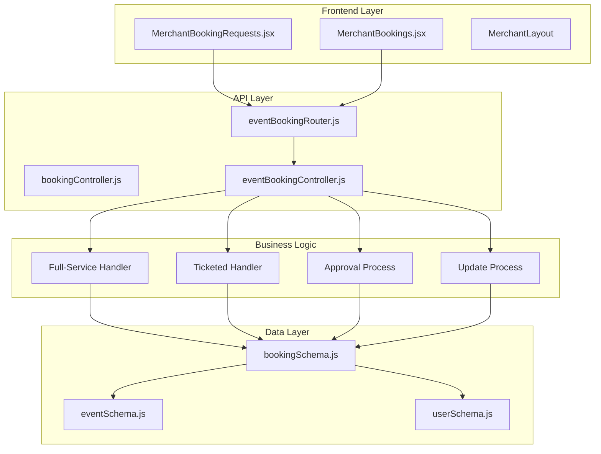
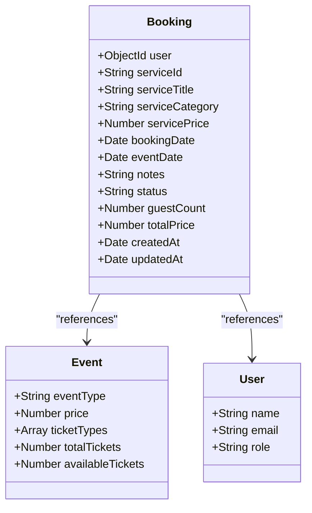
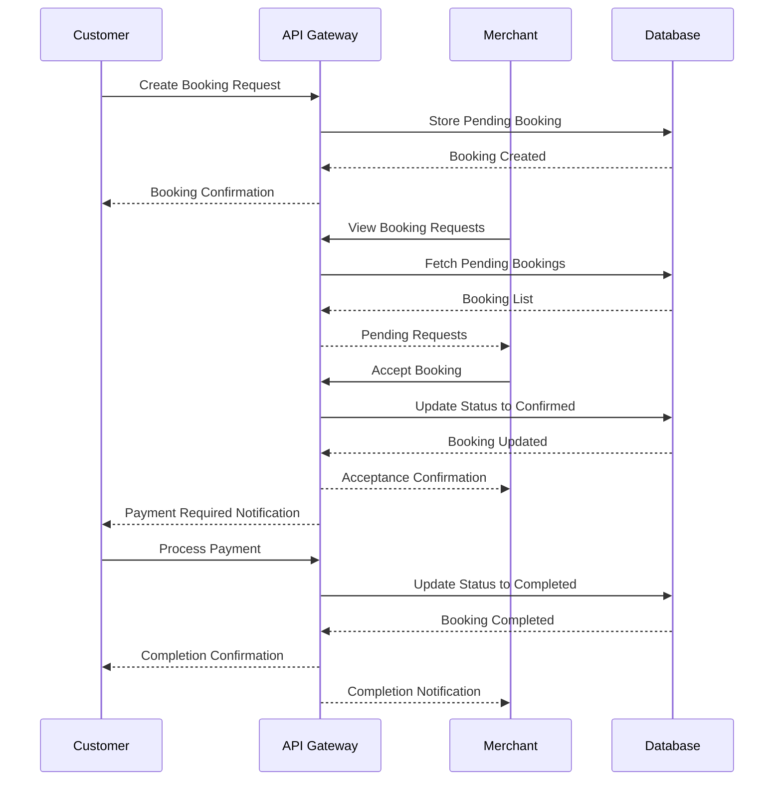
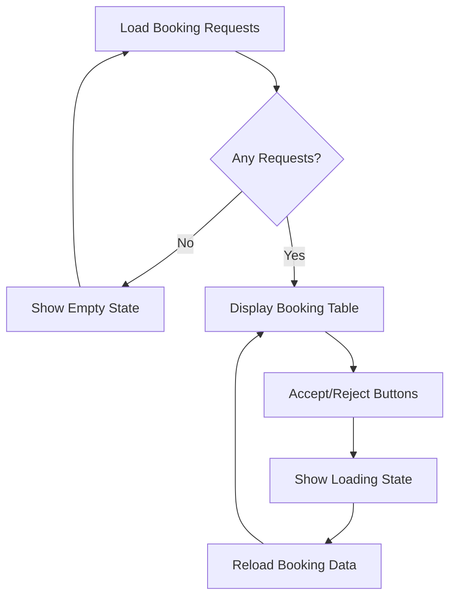
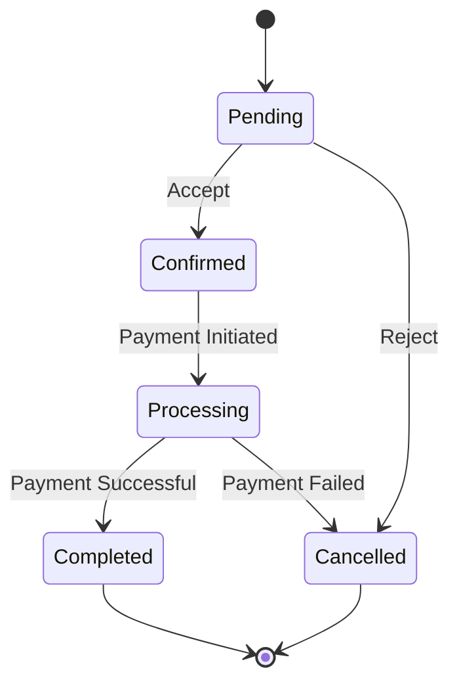

# Merchant Booking Operations API

<cite>
**Referenced Files in This Document**
- [eventBookingController.js](file://backend/controller/eventBookingController.js)
- [eventBookingRouter.js](file://backend/router/eventBookingRouter.js)
- [bookingSchema.js](file://backend/models/bookingSchema.js)
- [MerchantBookingRequests.jsx](file://frontend/src/pages/dashboards/MerchantBookingRequests.jsx)
- [MerchantBookings.jsx](file://frontend/src/pages/dashboards/MerchantBookings.jsx)
- [BOOKING_WORKFLOW_IMPLEMENTATION.md](file://BOOKING_WORKFLOW_IMPLEMENTATION.md)
</cite>

## Table of Contents
1. [Introduction](#introduction)
2. [System Architecture](#system-architecture)
3. [Core Components](#core-components)
4. [API Endpoints](#api-endpoints)
5. [Booking Workflow](#booking-workflow)
6. [Merchant Dashboard Integration](#merchant-dashboard-integration)
7. [Status Management](#status-management)
8. [Error Handling](#error-handling)
9. [Implementation Examples](#implementation-examples)
10. [Troubleshooting Guide](#troubleshooting-guide)
11. [Conclusion](#conclusion)

## Introduction

The Merchant Booking Operations API provides comprehensive booking management capabilities for event merchants within the MERN stack event platform. This system enables merchants to manage customer booking requests, approve or reject bookings, track booking completions, and maintain complete visibility over their event registrations.

The API follows a structured approach to handle different event types (full-service and ticketed events) while maintaining consistent booking status management across all merchant operations. The system integrates seamlessly with the frontend merchant dashboard, providing real-time booking request management and status tracking capabilities.

## System Architecture

The merchant booking system is built on a modular architecture that separates concerns between booking creation, approval workflows, and status management. The system utilizes MongoDB for data persistence and Express.js for API routing.



**Diagram sources**
- [eventBookingRouter.js:1-47](file://backend/router/eventBookingRouter.js#L1-L47)
- [eventBookingController.js:1-200](file://backend/controller/eventBookingController.js#L1-L200)
- [bookingSchema.js:1-53](file://backend/models/bookingSchema.js#L1-L53)

## Core Components

### Booking Schema Model

The booking system utilizes a comprehensive schema that supports both full-service and ticketed event types with flexible status management.



**Diagram sources**
- [bookingSchema.js:1-53](file://backend/models/bookingSchema.js#L1-L53)

### Merchant Controller Functions

The event booking controller provides specialized functions for merchant operations including booking request management, approval workflows, and status updates.

**Section sources**
- [eventBookingController.js:763-793](file://backend/controller/eventBookingController.js#L763-L793)
- [eventBookingController.js:894-958](file://backend/controller/eventBookingController.js#L894-L958)
- [eventBookingController.js:1270-1426](file://backend/controller/eventBookingController.js#L1270-L1426)

## API Endpoints

### Merchant Booking Request Endpoints

#### Get Merchant Service Requests
- **Method**: GET
- **Endpoint**: `/api/v1/event-booking/service-requests`
- **Description**: Retrieves all pending service requests for the authenticated merchant's full-service events
- **Authentication**: Merchant required
- **Response**: Array of booking requests with customer and event details

#### Accept Booking Request
- **Method**: PUT
- **Endpoint**: `/api/v1/event-booking/:id/accept`
- **Description**: Approves a pending booking request, changing status to confirmed
- **Authentication**: Merchant required
- **Response**: Updated booking with confirmation status

#### Reject Booking Request
- **Method**: PUT
- **Endpoint**: `/api/v1/event-booking/:id/reject`
- **Description**: Rejects a pending booking request
- **Authentication**: Merchant required
- **Response**: Updated booking with rejection status

#### Mark Booking Completed
- **Method**: PUT
- **Endpoint**: `/api/v1/event-booking/:id/complete`
- **Description**: Marks a booking as completed after service delivery
- **Authentication**: Merchant required
- **Response**: Updated booking with completion status

#### Update Booking Status
- **Method**: PUT
- **Endpoint**: `/api/v1/event-booking/:bookingId/status`
- **Description**: Updates booking status using three-button system (pending, confirmed, cancelled)
- **Authentication**: Merchant required
- **Response**: Updated booking with new status

#### Get Merchant Bookings
- **Method**: GET
- **Endpoint**: `/api/v1/event-booking/merchant/bookings`
- **Description**: Retrieves all bookings for merchant's events with detailed information
- **Authentication**: Merchant required
- **Response**: Formatted booking list with payment status and customer details

**Section sources**
- [eventBookingRouter.js:36-45](file://backend/router/eventBookingRouter.js#L36-L45)
- [eventBookingController.js:763-793](file://backend/controller/eventBookingController.js#L763-L793)
- [eventBookingController.js:894-958](file://backend/controller/eventBookingController.js#L894-L958)
- [eventBookingController.js:1270-1426](file://backend/controller/eventBookingController.js#L1270-L1426)

## Booking Workflow

The merchant booking system implements a comprehensive workflow that handles different event types and booking scenarios.



**Diagram sources**
- [BOOKING_WORKFLOW_IMPLEMENTATION.md:108-168](file://BOOKING_WORKFLOW_IMPLEMENTATION.md#L108-L168)
- [eventBookingController.js:763-793](file://backend/controller/eventBookingController.js#L763-L793)

### Booking Status Management

The system maintains four distinct booking statuses with clear transitions:

| Status | Description | Allowed Transitions |
|--------|-------------|-------------------|
| `pending` | Booking request submitted | `confirmed`, `cancelled` |
| `confirmed` | Merchant approved booking | `processing`, `completed`, `cancelled` |
| `processing` | Payment processing initiated | `completed`, `cancelled` |
| `completed` | Service delivered and payment received | None (final) |
| `cancelled` | Booking cancelled by merchant or user | None (final) |

**Section sources**
- [bookingSchema.js:36-40](file://backend/models/bookingSchema.js#L36-L40)
- [eventBookingController.js:1415-1426](file://backend/controller/eventBookingController.js#L1415-L1426)

## Merchant Dashboard Integration

### Booking Requests Dashboard

The merchant dashboard provides a comprehensive interface for managing booking requests with real-time updates and action controls.



**Diagram sources**
- [MerchantBookingRequests.jsx:15-29](file://frontend/src/pages/dashboards/MerchantBookingRequests.jsx#L15-L29)
- [MerchantBookingRequests.jsx:31-96](file://frontend/src/pages/dashboards/MerchantBookingRequests.jsx#L31-L96)

### Booking Management Interface

The merchant booking interface offers comprehensive booking tracking with detailed customer and event information.

**Section sources**
- [MerchantBookingRequests.jsx:1-294](file://frontend/src/pages/dashboards/MerchantBookingRequests.jsx#L1-L294)
- [MerchantBookings.jsx:1-86](file://frontend/src/pages/dashboards/MerchantBookings.jsx#L1-L86)

## Status Management

### Three-Button Status System

The merchant booking system implements a simplified three-button status management approach:



**Diagram sources**
- [eventBookingController.js:1415-1426](file://backend/controller/eventBookingController.js#L1415-L1426)

### Status Validation and Transitions

The system enforces strict status validation to prevent invalid state transitions and maintain data integrity.

**Section sources**
- [eventBookingController.js:917-923](file://backend/controller/eventBookingController.js#L917-L923)
- [eventBookingController.js:1416-1426](file://backend/controller/eventBookingController.js#L1416-L1426)

## Error Handling

### Common Error Scenarios

The API implements comprehensive error handling for various merchant booking scenarios:

| Error Type | HTTP Status | Description | Resolution |
|------------|-------------|-------------|------------|
| Authentication | 401 | User not authenticated | Login required |
| Authorization | 403 | Merchant access denied | Verify merchant role |
| Not Found | 404 | Booking not found | Check booking ID |
| Validation | 400 | Invalid request data | Validate input fields |
| Conflict | 409 | Active booking exists | Wait for booking completion |

### Error Response Format

All error responses follow a consistent format:

```javascript
{
  "success": false,
  "message": "Error description",
  "error": "Additional error details"
}
```

**Section sources**
- [eventBookingController.js:904-915](file://backend/controller/eventBookingController.js#L904-L915)
- [eventBookingController.js:1415-1426](file://backend/controller/eventBookingController.js#L1415-L1426)

## Implementation Examples

### Merchant Booking Request Processing

Example workflow for processing booking requests:

1. **Fetch Pending Requests**: Merchant accesses `/api/v1/event-booking/service-requests`
2. **Review Details**: Examine customer information, event details, and booking specifics
3. **Decision Making**: Evaluate capacity, availability, and customer requirements
4. **Action Execution**: Accept or reject booking with appropriate status updates
5. **Notification**: System automatically notifies customers of decisions

### Booking Status Update Example

```javascript
// Example of updating booking status
const updateBookingStatus = async (bookingId, status) => {
  const response = await fetch(`/api/v1/event-booking/${bookingId}/status`, {
    method: 'PUT',
    headers: {
      'Authorization': `Bearer ${merchantToken}`,
      'Content-Type': 'application/json'
    },
    body: JSON.stringify({ status })
  });
  
  return response.json();
};
```

### Frontend Integration Example

The merchant dashboard integrates with the API through React components:

```javascript
// Example of frontend booking request handling
const handleAction = async (bookingId, action) => {
  try {
    const response = await axios.patch(
      `/api/v1/event-booking/${bookingId}/${action}`,
      {},
      { headers: authHeaders(token) }
    );
    
    // Refresh booking data
    await loadBookings();
  } catch (error) {
    showError(error.response.data.message);
  }
};
```

**Section sources**
- [MerchantBookingRequests.jsx:31-96](file://frontend/src/pages/dashboards/MerchantBookingRequests.jsx#L31-L96)
- [BOOKING_WORKFLOW_IMPLEMENTATION.md:108-168](file://BOOKING_WORKFLOW_IMPLEMENTATION.md#L108-L168)

## Troubleshooting Guide

### Common Issues and Solutions

#### Booking Request Not Appearing
- **Cause**: Booking not in pending status or wrong event type
- **Solution**: Verify event type is full-service and booking status is pending

#### Accept/Reject Actions Failing
- **Cause**: Booking already processed or merchant ownership verification failed
- **Solution**: Check booking status and ensure merchant owns the associated event

#### Status Update Errors
- **Cause**: Invalid status transition or missing required fields
- **Solution**: Validate status value against allowed transitions

#### Authentication Issues
- **Cause**: Expired tokens or incorrect role permissions
- **Solution**: Re-authenticate and verify merchant role assignment

### Debugging Tips

1. **Enable Logging**: Check server logs for detailed error information
2. **Verify Permissions**: Ensure merchant has proper role and event ownership
3. **Validate Data**: Confirm all required fields are present and valid
4. **Check Dependencies**: Verify related models (Event, User) exist and are accessible

**Section sources**
- [eventBookingController.js:904-915](file://backend/controller/eventBookingController.js#L904-L915)
- [eventBookingController.js:1415-1426](file://backend/controller/eventBookingController.js#L1415-L1426)

## Conclusion

The Merchant Booking Operations API provides a robust, scalable solution for event merchant booking management. The system's modular architecture, comprehensive status management, and seamless frontend integration enable efficient booking request handling, approval workflows, and status tracking.

Key benefits include:
- **Real-time Processing**: Instant booking request management with immediate status updates
- **Flexible Status System**: Support for complex booking workflows with clear state transitions
- **Comprehensive Tracking**: Complete visibility into booking lifecycle from request to completion
- **Seamless Integration**: Smooth frontend dashboard integration with intuitive merchant controls
- **Error Resilience**: Comprehensive error handling and validation mechanisms

The API's design supports future enhancements including advanced reporting, automated notifications, and expanded booking types while maintaining backward compatibility and system stability.