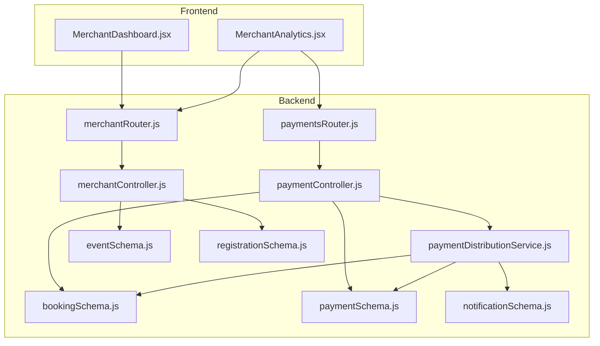
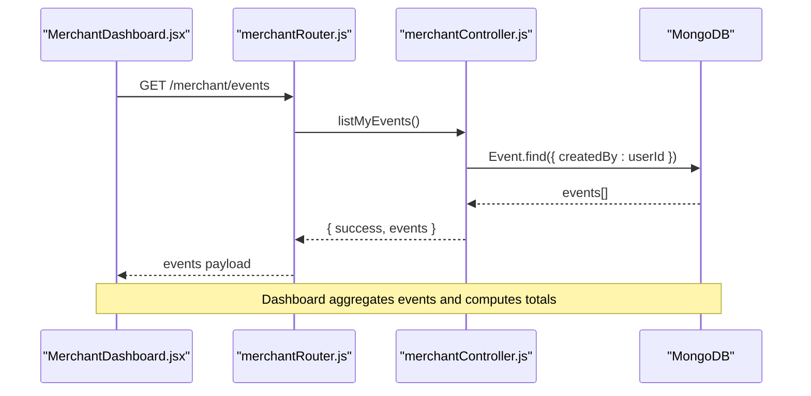
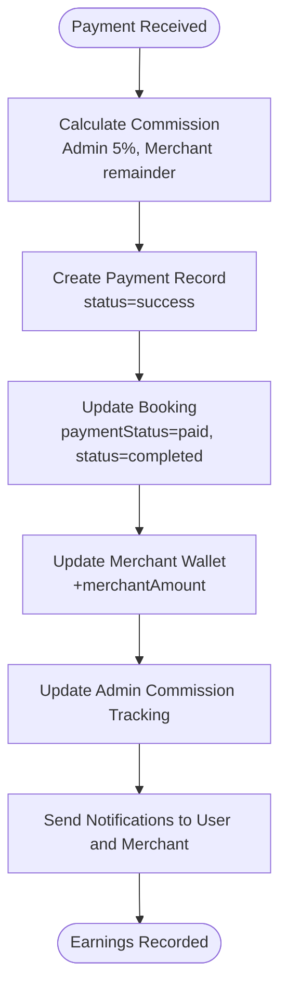
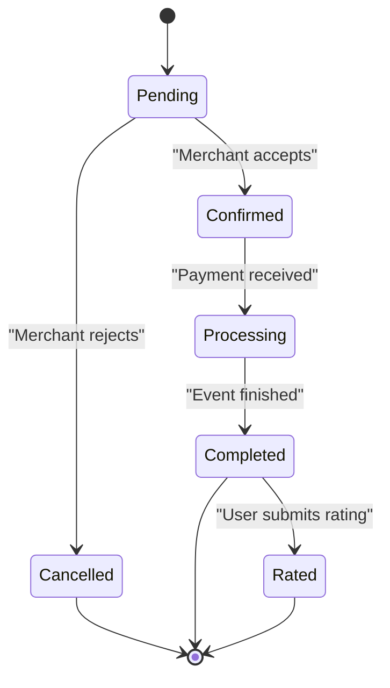
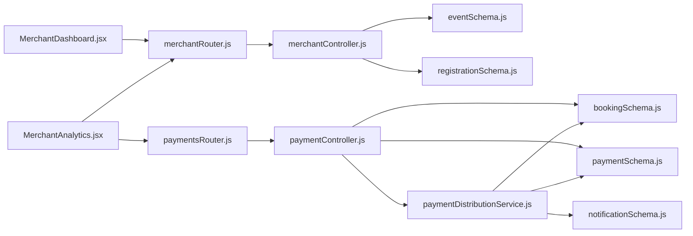

# Merchant Dashboard API

<cite>
**Referenced Files in This Document**
- [merchantRouter.js](file://backend/router/merchantRouter.js)
- [merchantController.js](file://backend/controller/merchantController.js)
- [eventSchema.js](file://backend/models/eventSchema.js)
- [registrationSchema.js](file://backend/models/registrationSchema.js)
- [bookingSchema.js](file://backend/models/bookingSchema.js)
- [paymentController.js](file://backend/controller/paymentController.js)
- [paymentDistributionService.js](file://backend/services/paymentDistributionService.js)
- [paymentSchema.js](file://backend/models/paymentSchema.js)
- [notificationSchema.js](file://backend/models/notificationSchema.js)
- [MerchantDashboard.jsx](file://frontend/src/pages/dashboards/MerchantDashboard.jsx)
- [MerchantAnalytics.jsx](file://frontend/src/pages/dashboards/MerchantAnalytics.jsx)
</cite>

## Table of Contents
1. [Introduction](#introduction)
2. [Project Structure](#project-structure)
3. [Core Components](#core-components)
4. [Architecture Overview](#architecture-overview)
5. [Detailed Component Analysis](#detailed-component-analysis)
6. [Dependency Analysis](#dependency-analysis)
7. [Performance Considerations](#performance-considerations)
8. [Troubleshooting Guide](#troubleshooting-guide)
9. [Conclusion](#conclusion)

## Introduction
This document provides comprehensive API documentation for merchant dashboard endpoints focused on analytics data retrieval, booking request summaries, and performance metrics. It covers:
- Listing merchant's events
- Participant statistics via event registrations
- Earnings calculations and payment distributions
- Real-time booking status updates
- Frontend dashboard widget implementations and visualization integration patterns

The documentation maps backend endpoints and controllers to frontend dashboard components, ensuring developers can implement merchant dashboards with accurate analytics and real-time insights.

## Project Structure
The merchant dashboard functionality spans backend routers/controllers, MongoDB models, payment services, and frontend dashboard pages.

**Diagram sources**
- [merchantRouter.js:1-17](file://backend/router/merchantRouter.js#L1-L17)
- [merchantController.js:1-209](file://backend/controller/merchantController.js#L1-L209)
- [paymentsRouter.js:1-44](file://backend/router/paymentsRouter.js#L1-L44)
- [paymentController.js:1-577](file://backend/controller/paymentController.js#L1-L577)
- [paymentDistributionService.js:1-340](file://backend/services/paymentDistributionService.js#L1-L340)
- [eventSchema.js:1-51](file://backend/models/eventSchema.js#L1-L51)
- [registrationSchema.js:1-12](file://backend/models/registrationSchema.js#L1-L12)
- [bookingSchema.js:1-53](file://backend/models/bookingSchema.js#L1-L53)
- [paymentSchema.js:1-142](file://backend/models/paymentSchema.js#L1-L142)
- [notificationSchema.js:1-36](file://backend/models/notificationSchema.js#L1-L36)
- [MerchantDashboard.jsx:1-133](file://frontend/src/pages/dashboards/MerchantDashboard.jsx#L1-L133)
- [MerchantAnalytics.jsx:1-61](file://frontend/src/pages/dashboards/MerchantAnalytics.jsx#L1-L61)

**Section sources**
- [merchantRouter.js:1-17](file://backend/router/merchantRouter.js#L1-L17)
- [merchantController.js:1-209](file://backend/controller/merchantController.js#L1-L209)
- [MerchantDashboard.jsx:1-133](file://frontend/src/pages/dashboards/MerchantDashboard.jsx#L1-L133)
- [MerchantAnalytics.jsx:1-61](file://frontend/src/pages/dashboards/MerchantAnalytics.jsx#L1-L61)

## Core Components
- Merchant Event Management
  - List merchant's events
  - Retrieve event details
  - Participants for a specific event
  - Create/update/delete events
- Analytics and Earnings
  - Merchant earnings summary and monthly trends
  - Recent transactions with event and booking context
- Booking Request Summaries
  - Full-service and ticketed booking workflows
  - Booking status transitions and notifications
  - Payment distribution and refund processing

Key endpoints:
- GET /merchant/events
- GET /merchant/events/:id/participants
- GET /payments/merchant/earnings

**Section sources**
- [merchantRouter.js:9-13](file://backend/router/merchantRouter.js#L9-L13)
- [merchantController.js:149-187](file://backend/controller/merchantController.js#L149-L187)
- [paymentController.js:401-517](file://backend/controller/paymentController.js#L401-L517)

## Architecture Overview
The merchant dashboard integrates frontend widgets with backend APIs for real-time analytics and booking management.

**Diagram sources**
- [MerchantDashboard.jsx:19-25](file://frontend/src/pages/dashboards/MerchantDashboard.jsx#L19-L25)
- [merchantRouter.js:11-11](file://backend/router/merchantRouter.js#L11-L11)
- [merchantController.js:149-158](file://backend/controller/merchantController.js#L149-L158)

## Detailed Component Analysis

### Merchant Events API
Endpoints for listing and retrieving merchant events, and fetching participants.

- GET /merchant/events
  - Purpose: List all events created by the authenticated merchant
  - Authentication: Merchant required
  - Response: Array of events with basic metadata
  - Implementation: [listMyEvents:149-158](file://backend/controller/merchantController.js#L149-L158)

- GET /merchant/events/:id
  - Purpose: Retrieve a single event by ID owned by the merchant
  - Authentication: Merchant required
  - Response: Single event object
  - Implementation: [getEvent:160-172](file://backend/controller/merchantController.js#L160-L172)

- GET /merchant/events/:id/participants
  - Purpose: List registrations (participants) for a specific event
  - Authentication: Merchant required
  - Response: Array of registrations with user profile
  - Implementation: [participantsForEvent:174-187](file://backend/controller/merchantController.js#L174-L187)

- POST /merchant/events, PUT /merchant/events/:id, DELETE /merchant/events/:id
  - Purpose: Create, update, and delete merchant events
  - Authentication: Merchant required
  - Implementation: [createEvent:5-98](file://backend/controller/merchantController.js#L5-L98), [updateEvent:100-147](file://backend/controller/merchantController.js#L100-L147), [deleteEvent:189-209](file://backend/controller/merchantController.js#L189-L209)

Data model relationships:
- Event schema defines event attributes and ownership via createdBy
- Registration schema links users to events for participant tracking

**Section sources**
- [merchantRouter.js:9-14](file://backend/router/merchantRouter.js#L9-L14)
- [merchantController.js:5-209](file://backend/controller/merchantController.js#L5-L209)
- [eventSchema.js:1-51](file://backend/models/eventSchema.js#L1-L51)
- [registrationSchema.js:1-12](file://backend/models/registrationSchema.js#L1-L12)

### Merchant Earnings API
Endpoint for retrieving merchant earnings and transaction history.

- GET /payments/merchant/earnings
  - Purpose: Fetch merchant earnings summary, monthly earnings, and recent transactions
  - Authentication: Merchant or Admin (with optional merchantId)
  - Response: Merchant profile, wallet balance, lifetime earnings, total earnings, transaction counts, monthly earnings, recent transactions
  - Implementation: [getMerchantEarnings:401-517](file://backend/controller/paymentController.js#L401-L517)

Payment distribution and refund processing:
- Payment distribution service calculates admin commission and merchant earnings, updates payment records, booking statuses, and merchant wallet
- Refund processing reverses prior distributions and updates balances

**Diagram sources**
- [paymentDistributionService.js:33-159](file://backend/services/paymentDistributionService.js#L33-L159)
- [paymentController.js:11-141](file://backend/controller/paymentController.js#L11-L141)
- [paymentSchema.js:1-142](file://backend/models/paymentSchema.js#L1-L142)
- [notificationSchema.js:1-36](file://backend/models/notificationSchema.js#L1-L36)

**Section sources**
- [paymentController.js:401-517](file://backend/controller/paymentController.js#L401-L517)
- [paymentDistributionService.js:1-340](file://backend/services/paymentDistributionService.js#L1-L340)
- [paymentSchema.js:1-142](file://backend/models/paymentSchema.js#L1-L142)
- [notificationSchema.js:1-36](file://backend/models/notificationSchema.js#L1-L36)

### Booking Request Summaries and Real-time Status Updates
Booking workflows and status transitions:

- Full-service events
  - Initial status: pending (user request)
  - Merchant actions: accept (confirmed) or reject (cancelled)
  - Subsequent steps: payment, completion, rating

- Ticketed events
  - Immediate confirmation (confirmed)
  - Payment required; upon payment: paid and completed automatically

Real-time status updates are delivered via notifications created during booking, payment, and status change operations.

**Diagram sources**
- [eventBookingController.js:1423-1499](file://backend/controller/eventBookingController.js#L1423-L1499)
- [notificationSchema.js:1-36](file://backend/models/notificationSchema.js#L1-L36)

**Section sources**
- [eventBookingController.js:1423-1499](file://backend/controller/eventBookingController.js#L1423-L1499)
- [notificationSchema.js:1-36](file://backend/models/notificationSchema.js#L1-L36)

### Frontend Dashboard Widgets and Visualization Integration
Frontend components consume merchant endpoints to render analytics and summaries:

- MerchantDashboard.jsx
  - Loads merchant events and participant counts
  - Computes totals for events, bookings, revenue, and upcoming events
  - Provides actions to edit/delete events and view participants

- MerchantAnalytics.jsx
  - Fetches events and earnings concurrently
  - Aggregates analytics (total events, upcoming vs completed, total bookings)
  - Formats currency and renders summary cards

Widget implementation patterns:
- Use Promise.all to fetch multiple datasets efficiently
- Compute derived metrics client-side (e.g., upcoming vs completed events)
- Render summary cards and tables with responsive layouts

**Section sources**
- [MerchantDashboard.jsx:1-133](file://frontend/src/pages/dashboards/MerchantDashboard.jsx#L1-L133)
- [MerchantAnalytics.jsx:1-61](file://frontend/src/pages/dashboards/MerchantAnalytics.jsx#L1-L61)

## Dependency Analysis
The merchant dashboard relies on the following dependency chain:
- Frontend dashboard components call merchant and payment endpoints
- Merchant endpoints query Event and Registration collections
- Payment endpoints orchestrate Payment and Booking documents and delegate distribution/refund logic to the payment distribution service
- Notifications are created during booking, payment, and status updates

**Diagram sources**
- [MerchantDashboard.jsx:1-133](file://frontend/src/pages/dashboards/MerchantDashboard.jsx#L1-L133)
- [MerchantAnalytics.jsx:1-61](file://frontend/src/pages/dashboards/MerchantAnalytics.jsx#L1-L61)
- [merchantRouter.js:1-17](file://backend/router/merchantRouter.js#L1-L17)
- [merchantController.js:1-209](file://backend/controller/merchantController.js#L1-L209)
- [paymentsRouter.js:1-44](file://backend/router/paymentsRouter.js#L1-L44)
- [paymentController.js:1-577](file://backend/controller/paymentController.js#L1-L577)
- [paymentDistributionService.js:1-340](file://backend/services/paymentDistributionService.js#L1-L340)
- [eventSchema.js:1-51](file://backend/models/eventSchema.js#L1-L51)
- [registrationSchema.js:1-12](file://backend/models/registrationSchema.js#L1-L12)
- [bookingSchema.js:1-53](file://backend/models/bookingSchema.js#L1-L53)
- [paymentSchema.js:1-142](file://backend/models/paymentSchema.js#L1-L142)
- [notificationSchema.js:1-36](file://backend/models/notificationSchema.js#L1-L36)

**Section sources**
- [merchantController.js:149-187](file://backend/controller/merchantController.js#L149-L187)
- [paymentController.js:401-517](file://backend/controller/paymentController.js#L401-L517)
- [paymentDistributionService.js:1-340](file://backend/services/paymentDistributionService.js#L1-L340)

## Performance Considerations
- Use concurrent API calls for independent datasets (e.g., events and earnings) to reduce total load time
- Client-side aggregation minimizes server-side computation; ensure reasonable dataset sizes
- For large event lists, consider pagination or server-side filtering/sorting
- Payment aggregation queries leverage MongoDB facets; ensure appropriate indexes on payment collections for performance

## Troubleshooting Guide
Common issues and resolutions:
- Authentication failures
  - Ensure merchant role and valid JWT token are included in request headers
  - Verify auth middleware and role checks in merchant endpoints

- Forbidden access
  - Event endpoints enforce ownership; confirm the requesting user matches the event's createdBy field

- Empty participant lists
  - Confirm registrations exist for the target event and that the Registration model is populated correctly

- Earnings discrepancies
  - Review payment distribution service logs and payment records for duplicate processing or amount mismatches
  - Validate payment status and transaction IDs

- Notification delivery
  - Confirm notification creation during booking, payment, and status updates; check for errors in notification creation

**Section sources**
- [merchantController.js:100-147](file://backend/controller/merchantController.js#L100-L147)
- [paymentController.js:11-141](file://backend/controller/paymentController.js#L11-L141)
- [paymentDistributionService.js:58-159](file://backend/services/paymentDistributionService.js#L58-L159)
- [notificationSchema.js:1-36](file://backend/models/notificationSchema.js#L1-L36)

## Conclusion
The merchant dashboard API provides a robust foundation for analytics, participant management, and earnings reporting. By leveraging the documented endpoints and following the integration patterns outlined here, developers can build comprehensive merchant dashboards with real-time insights and reliable booking workflows.