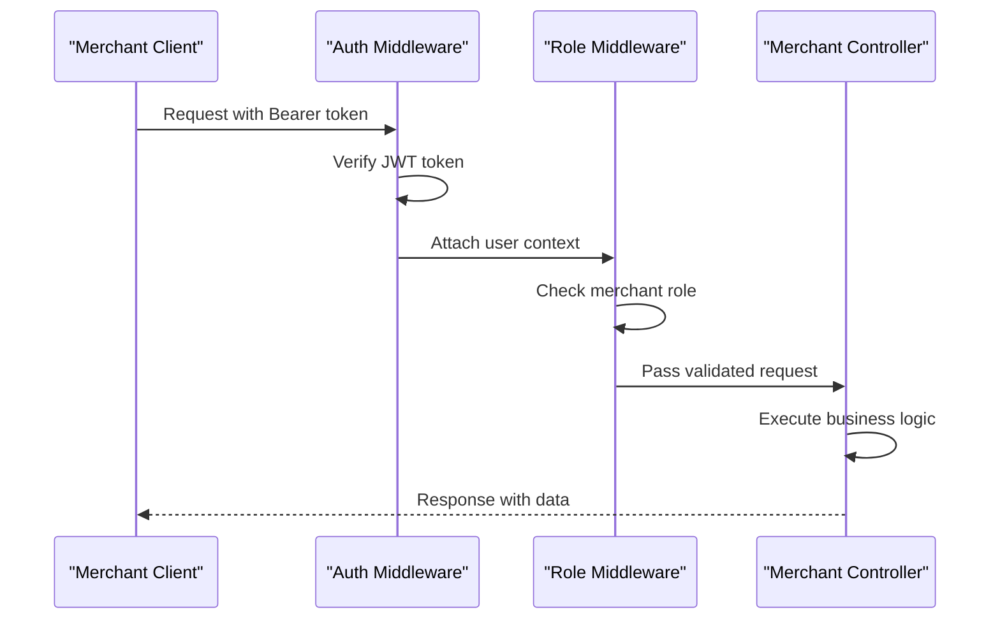
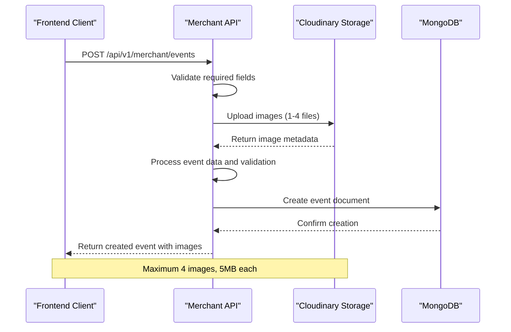
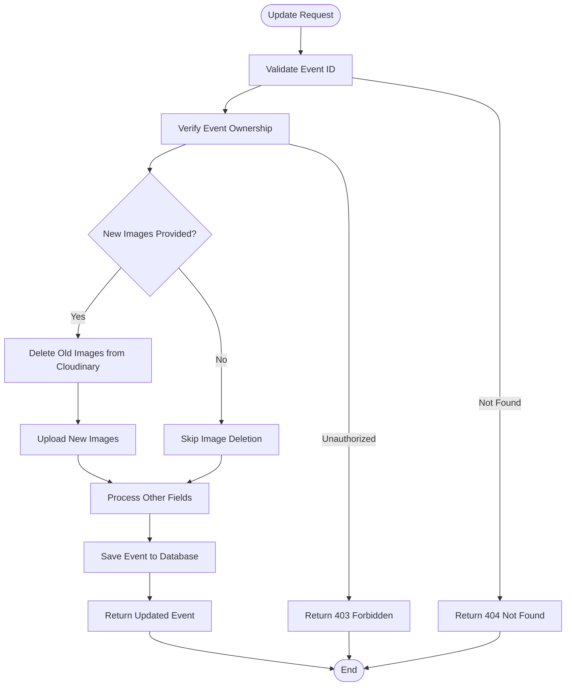
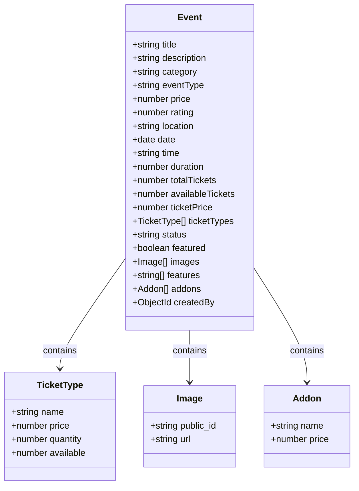
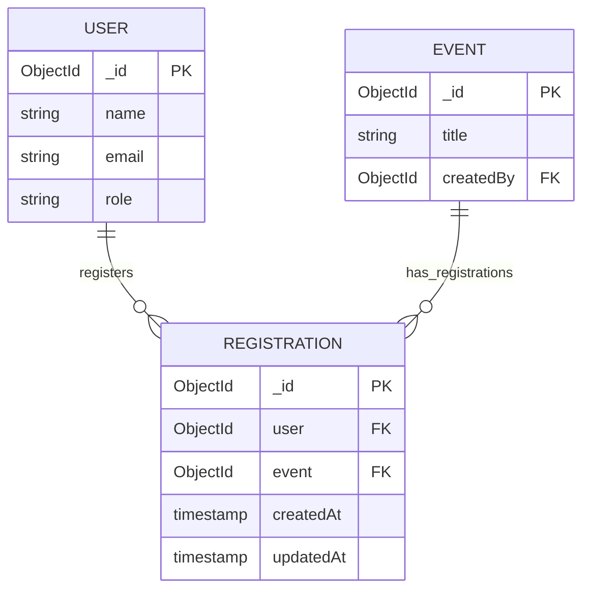

# Merchant Event Management API

<cite>
**Referenced Files in This Document**
- [app.js](file://backend/app.js)
- [merchantRouter.js](file://backend/router/merchantRouter.js)
- [merchantController.js](file://backend/controller/merchantController.js)
- [eventSchema.js](file://backend/models/eventSchema.js)
- [registrationSchema.js](file://backend/models/registrationSchema.js)
- [cloudinary.js](file://backend/util/cloudinary.js)
- [authMiddleware.js](file://backend/middleware/authMiddleware.js)
- [roleMiddleware.js](file://backend/middleware/roleMiddleware.js)
- [MerchantCreateEvent.jsx](file://frontend/src/pages/dashboards/MerchantCreateEvent.jsx)
- [MerchantEditEvent.jsx](file://frontend/src/pages/dashboards/MerchantEditEvent.jsx)
- [MerchantEvents.jsx](file://frontend/src/pages/dashboards/MerchantEvents.jsx)
- [MerchantDashboard.jsx](file://frontend/src/pages/dashboards/MerchantDashboard.jsx)
</cite>

## Table of Contents
1. [Introduction](#introduction)
2. [API Endpoints](#api-endpoints)
3. [Authentication and Authorization](#authentication-and-authorization)
4. [Event Creation Workflow](#event-creation-workflow)
5. [Event Update Process](#event-update-process)
6. [Event Listing and Retrieval](#event-listing-and-retrieval)
7. [Participant Management](#participant-management)
8. [Image Upload Handling](#image-upload-handling)
9. [Data Models](#data-models)
10. [Error Handling](#error-handling)
11. [Frontend Integration Examples](#frontend-integration-examples)
12. [Best Practices](#best-practices)

## Introduction

The Merchant Event Management API provides comprehensive functionality for merchants to manage their events within the EventHub platform. This system enables merchants to create, update, list, and manage their events along with participant management capabilities. The API follows RESTful principles and implements robust authentication, authorization, and image management systems.

The platform supports two primary event types: full-service events where clients book services at fixed prices, and ticketed events where merchants sell admission tickets with capacity limits. The API handles complex event configurations including multiple ticket types, add-on features, and comprehensive media management.

## API Endpoints

### Base URL
```
/api/v1/merchant
```

### Authentication Required
All merchant endpoints require Bearer token authentication with merchant role permissions.

### Endpoint Summary

| Method | Endpoint | Description |
|--------|----------|-------------|
| POST | `/api/v1/merchant/events` | Create a new event with image uploads |
| PUT | `/api/v1/merchant/events/:id` | Update an existing event |
| GET | `/api/v1/merchant/events` | List all events owned by the merchant |
| GET | `/api/v1/merchant/events/:id` | Retrieve specific event details |
| GET | `/api/v1/merchant/events/:id/participants` | Get event participants |
| DELETE | `/api/v1/merchant/events/:id` | Delete an event |

**Section sources**
- [merchantRouter.js:9-14](file://backend/router/merchantRouter.js#L9-L14)

## Authentication and Authorization

### Authentication Middleware
The API uses JWT-based authentication with the following flow:

1. **Token Format**: `Authorization: Bearer <jwt-token>`
2. **Validation**: Token verification against JWT_SECRET environment variable
3. **User Context**: Decoded token provides userId and role information

### Role-Based Access Control
- **Required Role**: `merchant`
- **Permission Validation**: Middleware ensures requesting user has merchant role
- **Ownership Verification**: Controllers verify event ownership before operations

### Security Implementation



**Diagram sources**
- [authMiddleware.js:3-16](file://backend/middleware/authMiddleware.js#L3-L16)
- [roleMiddleware.js:1-8](file://backend/middleware/roleMiddleware.js#L1-L8)

**Section sources**
- [authMiddleware.js:1-17](file://backend/middleware/authMiddleware.js#L1-L17)
- [roleMiddleware.js:1-9](file://backend/middleware/roleMiddleware.js#L1-L9)

## Event Creation Workflow

### Request Structure
The event creation endpoint accepts multipart/form-data with the following fields:

#### Required Fields
- `title`: Event title (required)
- `images`: Array of image files (1-4 files)

#### Optional Fields (Full-Service Events)
- `description`: Event description
- `category`: Event category
- `price`: Fixed service price
- `rating`: Event rating (0-5)
- `features`: Array of event features
- `addons`: Array of add-on services with name and price

#### Optional Fields (Ticketed Events)
- `eventType`: Must be "ticketed"
- `location`: Event location
- `date`: Event date (YYYY-MM-DD)
- `time`: Event time (HH:mm)
- `duration`: Event duration in hours
- `ticketTypes`: Array of ticket types with name, price, and quantity

### Complete Creation Flow



**Diagram sources**
- [merchantController.js:5-98](file://backend/controller/merchantController.js#L5-L98)
- [cloudinary.js:76-91](file://backend/util/cloudinary.js#L76-L91)

### Example Request (Full-Service Event)
```
POST /api/v1/merchant/events
Content-Type: multipart/form-data
Authorization: Bearer <token>

Form Data:
- title: "Premium Wedding Package"
- description: "Complete wedding planning service"
- category: "Wedding"
- price: 50000
- features: ["Venue Booking", "Catering", "Photography"]
- images: [file1.jpg, file2.png]
```

### Example Request (Ticketed Event)
```
POST /api/v1/merchant/events
Content-Type: multipart/form-data
Authorization: Bearer <token>

Form Data:
- title: "Tech Conference 2024"
- eventType: "ticketed"
- location: "Hyderabad, India"
- date: "2024-12-15"
- time: "09:00"
- duration: 8
- ticketTypes: [{"name":"General","price":2500,"quantity":500},{"name":"VIP","price":5000,"quantity":100}]
- images: [file1.jpg, file2.png, file3.webp]
```

**Section sources**
- [merchantController.js:5-98](file://backend/controller/merchantController.js#L5-L98)
- [MerchantCreateEvent.jsx:157-218](file://frontend/src/pages/dashboards/MerchantCreateEvent.jsx#L157-L218)

## Event Update Process

### Update Capabilities
The event update endpoint allows merchants to modify existing events with the following supported fields:

#### Updatable Fields
- `title`: Event title
- `description`: Event description
- `category`: Event category
- `price`: Service price (for full-service)
- `rating`: Event rating
- `features`: Event features array
- `images`: New images (replaces existing ones)

### Update Flow



**Diagram sources**
- [merchantController.js:100-147](file://backend/controller/merchantController.js#L100-L147)

### Image Replacement Logic
When new images are provided during updates:
1. **Delete Old Images**: All existing Cloudinary images are removed
2. **Upload New Images**: New images are uploaded to Cloudinary
3. **Update References**: Database stores new image metadata
4. **Capacity Management**: Maintains maximum 4 image constraint

**Section sources**
- [merchantController.js:128-140](file://backend/controller/merchantController.js#L128-L140)
- [cloudinary.js:103-109](file://backend/util/cloudinary.js#L103-L109)

## Event Listing and Retrieval

### List Owned Events
**Endpoint**: `GET /api/v1/merchant/events`

#### Response Structure
```json
{
  "success": true,
  "events": [
    {
      "_id": "event_id",
      "title": "Event Title",
      "description": "Event description",
      "eventType": "full-service|ticketed",
      "price": 0,
      "location": "",
      "date": "2024-01-01T00:00:00.000Z",
      "time": "",
      "duration": 1,
      "totalTickets": 0,
      "availableTickets": 0,
      "images": [
        {
          "public_id": "image_public_id",
          "url": "https://res.cloudinary.com/demo/image/upload/sample.jpg"
        }
      ],
      "features": [],
      "createdBy": "merchant_user_id"
    }
  ]
}
```

### Get Specific Event
**Endpoint**: `GET /api/v1/merchant/events/:id`

#### Security Features
- **Ownership Verification**: Ensures requested event belongs to the authenticated merchant
- **Access Control**: Returns 403 Forbidden for unauthorized access attempts

**Section sources**
- [merchantController.js:149-172](file://backend/controller/merchantController.js#L149-L172)

## Participant Management

### Get Event Participants
**Endpoint**: `GET /api/v1/merchant/events/:id/participants`

#### Response Structure
```json
{
  "success": true,
  "participants": [
    {
      "_id": "registration_id",
      "user": {
        "name": "John Doe",
        "email": "john@example.com",
        "role": "user"
      },
      "event": "event_id",
      "createdAt": "2024-01-01T00:00:00.000Z",
      "updatedAt": "2024-01-01T00:00:00.000Z"
    }
  ]
}
```

#### Backend Implementation
The participant endpoint:
1. **Validates Event Ownership**: Ensures merchant owns the event
2. **Queries Registrations**: Finds all user registrations for the event
3. **Populates User Data**: Includes user profile information (name, email)
4. **Returns Structured Response**: Clean participant list for merchant dashboard

**Section sources**
- [merchantController.js:174-187](file://backend/controller/merchantController.js#L174-L187)
- [registrationSchema.js:3-11](file://backend/models/registrationSchema.js#L3-L11)

## Image Upload Handling

### Cloudinary Integration
The API integrates with Cloudinary for robust image management:

#### Upload Configuration
- **Maximum Files**: 4 per event
- **File Size Limit**: 5MB per image
- **Supported Formats**: JPG, JPEG, PNG, WEBP
- **Storage Folder**: `eventhub/services`
- **Transformations**: Automatic resizing to 1200x800 pixels

### Upload Process


**Diagram sources**
- [cloudinary.js:46-58](file://backend/util/cloudinary.js#L46-L58)
- [cloudinary.js:76-91](file://backend/util/cloudinary.js#L76-L91)

### Image Management Operations
- **Upload Single Image**: `uploadSingleImage(file)`
- **Upload Multiple Images**: `uploadMultipleImages(files[])`
- **Delete Single Image**: `deleteImage(public_id)`
- **Delete Multiple Images**: `deleteMultipleImages(public_ids[])`

**Section sources**
- [cloudinary.js:1-112](file://backend/util/cloudinary.js#L1-L112)

## Data Models

### Event Schema
The Event model defines the complete structure for event data:



**Diagram sources**
- [eventSchema.js:3-48](file://backend/models/eventSchema.js#L3-L48)

### Registration Schema
Participant management uses a separate registration model:



**Diagram sources**
- [registrationSchema.js:3-11](file://backend/models/registrationSchema.js#L3-L11)

**Section sources**
- [eventSchema.js:1-51](file://backend/models/eventSchema.js#L1-L51)
- [registrationSchema.js:1-12](file://backend/models/registrationSchema.js#L1-L12)

## Error Handling

### Common HTTP Status Codes
- **200**: Successful GET requests and updates
- **201**: Successful event creation
- **400**: Bad request (validation errors)
- **401**: Unauthorized (missing/invalid token)
- **403**: Forbidden (insufficient permissions/ownership)
- **404**: Not found (event not found)
- **409**: Conflict (already registered)
- **500**: Internal server error

### Error Response Format
```json
{
  "success": false,
  "message": "Error description"
}
```

### Validation Rules
- **Title Required**: Non-empty string for all events
- **Image Requirement**: At least one image for event creation
- **File Limits**: Maximum 4 images, 5MB each
- **Ticket Validation**: Ticketed events require date, time, and valid ticket types
- **Price Validation**: Non-negative numbers with appropriate precision

**Section sources**
- [merchantController.js:13-16](file://backend/controller/merchantController.js#L13-L16)
- [MerchantCreateEvent.jsx:157-171](file://frontend/src/pages/dashboards/MerchantCreateEvent.jsx#L157-L171)

## Frontend Integration Examples

### Event Creation Integration
The frontend implementation demonstrates complete integration with the API:

#### Form Submission Flow
```javascript
const handleSubmit = async (e) => {
  e.preventDefault();
  
  const formData = new FormData();
  formData.append("title", form.title.trim());
  formData.append("eventType", eventType);
  formData.append("features", JSON.stringify(form.features));
  
  // Append ticket types for ticketed events
  if (eventType === "ticketed") {
    formData.append("ticketTypes", JSON.stringify(ticketTypes));
  }
  
  // Append all images
  images.forEach((img) => formData.append("images", img));
  
  const { data } = await axios.post(
    `${API_BASE}/merchant/events`, 
    formData, 
    { headers: authHeaders(token) }
  );
};
```

#### Image Upload Management
- **File Validation**: Size checks (≤5MB) and type restrictions
- **Preview Generation**: Real-time image previews
- **Capacity Management**: Enforces maximum 4 images
- **Progress Tracking**: Loading states during upload

### Event Management Dashboard
The merchant dashboard provides comprehensive event management:

#### Key Features
- **Event Listing**: Grid view with edit/delete actions
- **Real-time Updates**: Automatic refresh mechanisms
- **Participant Analytics**: Registration count and revenue tracking
- **Quick Actions**: One-click editing and management

**Section sources**
- [MerchantCreateEvent.jsx:157-218](file://frontend/src/pages/dashboards/MerchantCreateEvent.jsx#L157-L218)
- [MerchantEditEvent.jsx:127-180](file://frontend/src/pages/dashboards/MerchantEditEvent.jsx#L127-L180)
- [MerchantEvents.jsx:17-31](file://frontend/src/pages/dashboards/MerchantEvents.jsx#L17-L31)
- [MerchantDashboard.jsx:19-41](file://frontend/src/pages/dashboards/MerchantDashboard.jsx#L19-L41)

## Best Practices

### Security Recommendations
1. **Token Management**: Store JWT tokens securely in HTTP-only cookies
2. **Input Validation**: Always validate and sanitize user inputs
3. **File Security**: Implement proper file type and size validation
4. **Rate Limiting**: Consider implementing rate limiting for API endpoints

### Performance Optimization
1. **Image Optimization**: Leverage Cloudinary transformations for optimal delivery
2. **Caching**: Implement caching strategies for frequently accessed event data
3. **Pagination**: Consider pagination for large event lists
4. **Lazy Loading**: Implement lazy loading for image galleries

### Error Prevention
1. **Client-Side Validation**: Validate forms before submission
2. **Progressive Enhancement**: Handle partial failures gracefully
3. **User Feedback**: Provide clear error messages and retry options
4. **Logging**: Implement comprehensive logging for debugging

### Scalability Considerations
1. **Database Indexing**: Ensure proper indexing on frequently queried fields
2. **CDN Integration**: Use CDN for static assets and images
3. **Microservices**: Consider breaking down monolithic architecture as traffic grows
4. **Monitoring**: Implement comprehensive monitoring and alerting systems