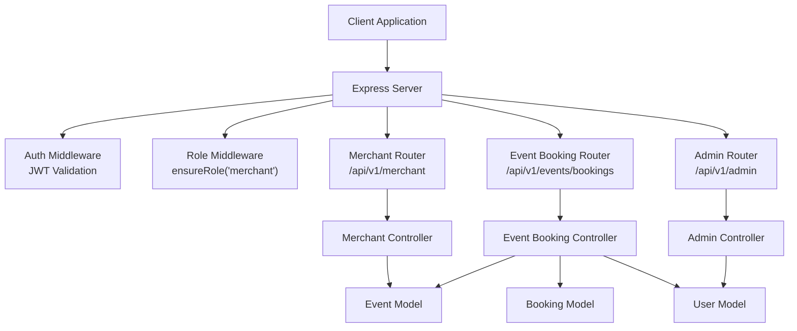
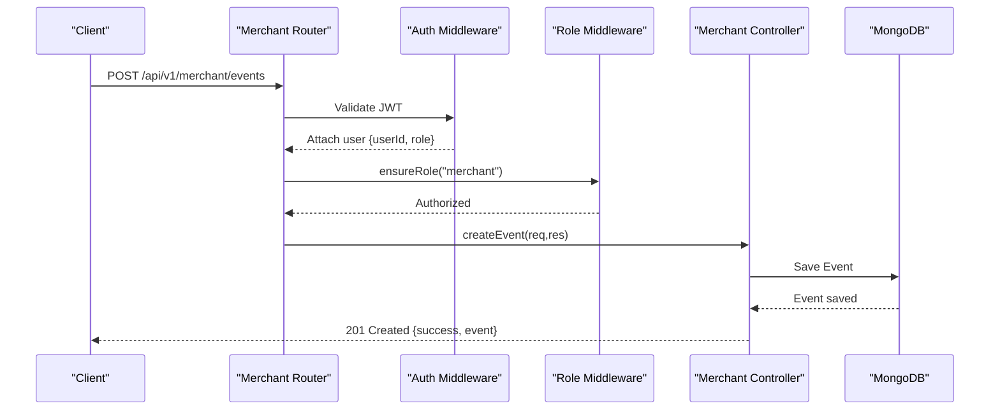
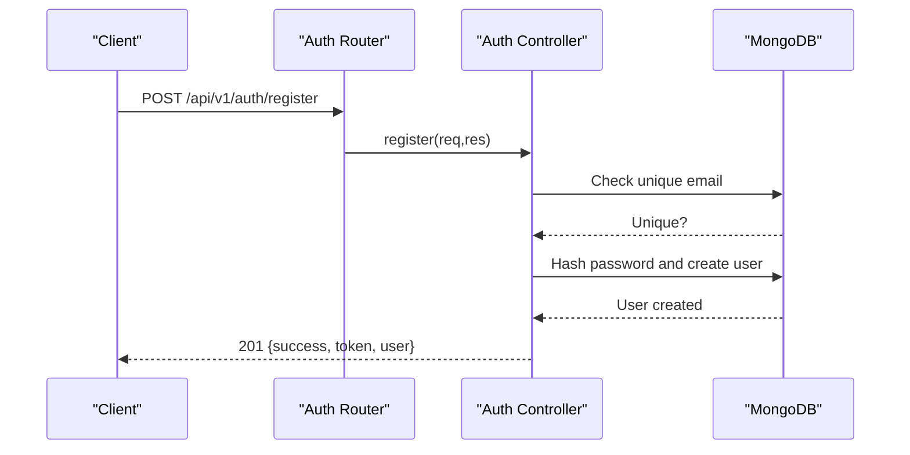
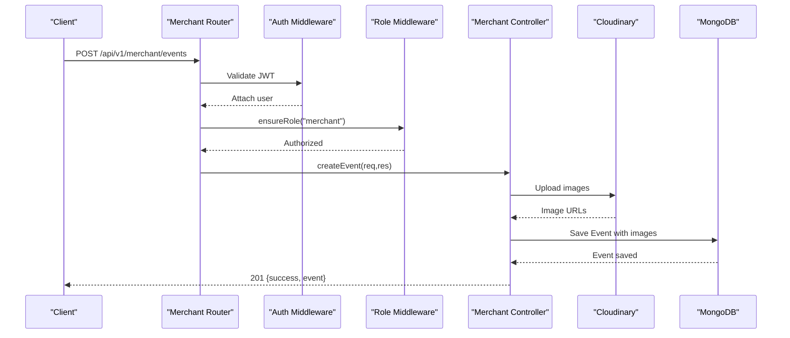
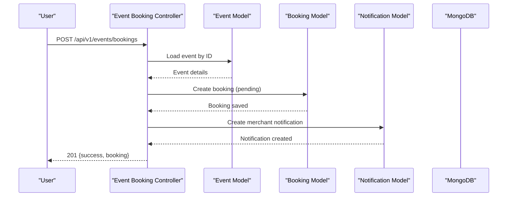
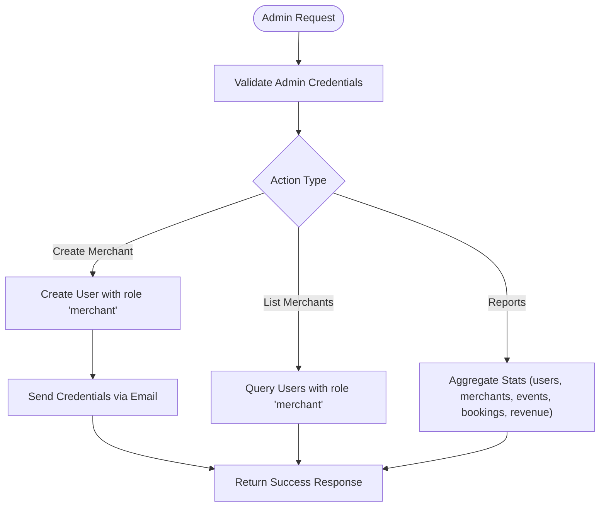
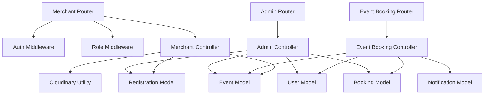

# Merchant Operations API

<cite>
**Referenced Files in This Document**
- [merchantRouter.js](file://backend/router/merchantRouter.js)
- [merchantController.js](file://backend/controller/merchantController.js)
- [authMiddleware.js](file://backend/middleware/authMiddleware.js)
- [roleMiddleware.js](file://backend/middleware/roleMiddleware.js)
- [authRouter.js](file://backend/router/authRouter.js)
- [authController.js](file://backend/controller/authController.js)
- [adminController.js](file://backend/controller/adminController.js)
- [eventBookingController.js](file://backend/controller/eventBookingController.js)
- [bookingController.js](file://backend/controller/bookingController.js)
- [eventSchema.js](file://backend/models/eventSchema.js)
- [bookingSchema.js](file://backend/models/bookingSchema.js)
- [registrationSchema.js](file://backend/models/registrationSchema.js)
- [userSchema.js](file://backend/models/userSchema.js)
- [app.js](file://backend/app.js)
</cite>

## Table of Contents
1. [Introduction](#introduction)
2. [Project Structure](#project-structure)
3. [Core Components](#core-components)
4. [Architecture Overview](#architecture-overview)
5. [Detailed Component Analysis](#detailed-component-analysis)
6. [Dependency Analysis](#dependency-analysis)
7. [Performance Considerations](#performance-considerations)
8. [Troubleshooting Guide](#troubleshooting-guide)
9. [Conclusion](#conclusion)
10. [Appendices](#appendices)

## Introduction
This document provides comprehensive API documentation for Merchant-specific endpoints and dashboard operations within the Event Management System. It covers merchant registration, profile management, event management, booking request handling, analytics reporting, permissions, role-based access controls, administrative workflows, onboarding processes, verification requirements, compliance features, and practical integration examples for merchant dashboard operations.

## Project Structure
The merchant-focused functionality is organized around dedicated routers, controllers, middleware, and models. Merchant endpoints are mounted under `/api/v1/merchant` and protected by authentication and role-based authorization middleware. Event and booking workflows integrate merchant actions for approvals, completions, and notifications.

**Diagram sources**
- [app.js:1-50](file://backend/app.js#L1-L50)
- [merchantRouter.js:1-16](file://backend/router/merchantRouter.js#L1-L16)
- [eventBookingController.js:1-120](file://backend/controller/eventBookingController.js#L1-L120)
- [adminController.js:1-50](file://backend/controller/adminController.js#L1-L50)

**Section sources**
- [app.js:1-50](file://backend/app.js#L1-L50)
- [merchantRouter.js:1-16](file://backend/router/merchantRouter.js#L1-L16)

## Core Components
- Authentication and Authorization
  - JWT-based authentication middleware validates bearer tokens and attaches user identity to requests.
  - Role-based middleware enforces merchant-only access for sensitive endpoints.
- Merchant Event Management
  - Create, update, list, and retrieve merchant-owned events with support for ticketed and full-service types.
  - Participant enrollment retrieval per event.
- Booking Request Handling
  - Full-service events require merchant approval; ticketed events confirm immediately upon payment.
  - Merchant can accept, reject, and mark bookings as completed.
  - Users can pay for bookings and add ratings/reviews.
- Administrative Workflows
  - Admin can create merchant accounts, manage merchant listings, and generate analytics reports.

**Section sources**
- [authMiddleware.js:1-17](file://backend/middleware/authMiddleware.js#L1-L17)
- [roleMiddleware.js:1-9](file://backend/middleware/roleMiddleware.js#L1-L9)
- [merchantController.js:1-176](file://backend/controller/merchantController.js#L1-L176)
- [eventBookingController.js:75-1566](file://backend/controller/eventBookingController.js#L75-L1566)
- [adminController.js:18-77](file://backend/controller/adminController.js#L18-L77)

## Architecture Overview
The merchant API follows a layered architecture:
- Router layer defines endpoint contracts and applies middleware.
- Controller layer implements business logic, interacts with models, and orchestrates notifications.
- Model layer encapsulates data schemas and relationships.
- Middleware layer enforces authentication and role checks.

**Diagram sources**
- [merchantRouter.js:9-13](file://backend/router/merchantRouter.js#L9-L13)
- [authMiddleware.js:3-16](file://backend/middleware/authMiddleware.js#L3-L16)
- [roleMiddleware.js:1-9](file://backend/middleware/roleMiddleware.js#L1-L9)
- [merchantController.js:5-86](file://backend/controller/merchantController.js#L5-L86)

## Detailed Component Analysis

### Merchant Registration and Profile Management
- Merchant Registration Endpoint
  - Path: POST /api/v1/auth/register
  - Purpose: Registers users with role "merchant" or "user".
  - Behavior:
    - Validates presence of name, email, and password.
    - Hashes password and creates user with default role "user" unless explicitly provided a valid role.
    - Issues JWT token and returns user profile excluding password.
  - Access Control: No role middleware required; intended for initial sign-up.
  - Response Fields: success, message, token, user{id, name, email, role}.
- Merchant Profile Retrieval
  - Path: GET /api/v1/auth/me
  - Purpose: Returns authenticated user profile.
  - Access Control: Requires valid JWT.
  - Response Fields: success, user with profile excluding password.

**Diagram sources**
- [authRouter.js:7-9](file://backend/router/authRouter.js#L7-L9)
- [authController.js:11-52](file://backend/controller/authController.js#L11-L52)

**Section sources**
- [authRouter.js:1-12](file://backend/router/authRouter.js#L1-L12)
- [authController.js:11-120](file://backend/controller/authController.js#L11-L120)

### Merchant Event Management Endpoints
- Create Event
  - Path: POST /api/v1/merchant/events
  - Authentication: Required (JWT).
  - Authorization: Merchant role required.
  - File Upload: Supports multiple images via Cloudinary.
  - Request Body Fields:
    - title (required), description, category, price, rating, features (array or JSON string), eventType ("full-service" or "ticketed"), location, date, time, duration, totalTickets, ticketPrice, ticketTypes (JSON array with name, price, quantity).
  - Behavior:
    - Validates title.
    - Handles image uploads and stores Cloudinary URLs.
    - Parses features safely (JSON or comma-separated).
    - For ticketed events, computes total tickets and lowest ticket price.
    - Sets createdBy to authenticated merchant.
  - Response: 201 Created with success and event object.
- Update Event
  - Path: PUT /api/v1/merchant/events/:id
  - Authentication: Required.
  - Authorization: Merchant role required.
  - Ownership: Enforces that only the creator can update.
  - Behavior:
    - Updates provided fields (title, description, category, price, rating, features).
    - Optional image replacement: deletes old Cloudinary images and uploads new ones.
  - Response: 200 OK with success and updated event.
- List My Events
  - Path: GET /api/v1/merchant/events
  - Authentication: Required.
  - Authorization: Merchant role required.
  - Behavior: Returns all events created by the authenticated merchant.
  - Response: 200 OK with success and events array.
- Get Event
  - Path: GET /api/v1/merchant/events/:id
  - Authentication: Required.
  - Authorization: Merchant role required.
  - Ownership: Enforces that only the creator can access.
  - Response: 200 OK with success and event object.
- Participants for Event
  - Path: GET /api/v1/merchant/events/:id/participants
  - Authentication: Required.
  - Authorization: Merchant role required.
  - Ownership: Enforces that only the creator can access.
  - Behavior: Returns registrations for the event with user details (name, email, role).
  - Response: 200 OK with success and participants array.

**Diagram sources**
- [merchantRouter.js:9-13](file://backend/router/merchantRouter.js#L9-L13)
- [merchantController.js:5-86](file://backend/controller/merchantController.js#L5-L86)

**Section sources**
- [merchantRouter.js:1-16](file://backend/router/merchantRouter.js#L1-L16)
- [merchantController.js:5-176](file://backend/controller/merchantController.js#L5-L176)

### Booking Request Handling and Merchant Dashboard Operations
- Event Booking Creation
  - Path: POST /api/v1/events/bookings
  - Behavior:
    - Routes to either full-service or ticketed booking handlers based on event type.
    - Full-service: Creates booking with pending status; requires merchant approval.
    - Ticketed: Confirms immediately; payment pending; updates ticket availability.
  - Response: 201 Created with booking details; includes ticket details for ticketed events.
- Merchant Approve/Reject Full-Service Booking
  - Paths:
    - POST /api/v1/events/bookings/:bookingId/approve (merchant only)
    - POST /api/v1/events/bookings/:bookingId/reject (merchant only)
  - Behavior:
    - Approve sets bookingStatus to "confirmed"; Reject sets to "cancelled" with optional reason.
    - Sends notifications to user.
  - Response: 200 OK with success and updated booking.
- Merchant Complete Booking
  - Path: POST /api/v1/events/bookings/:bookingId/complete (merchant only)
  - Behavior:
    - Marks booking as completed and paid; sends completion notification.
  - Response: 200 OK with success and updated booking.
- User Payment Processing
  - Path: POST /api/v1/events/bookings/:bookingId/pay
  - Behavior:
    - User pays for pending booking; updates paymentStatus to "paid".
  - Response: 200 OK with success and updated booking.
- User Rating and Review
  - Path: POST /api/v1/events/bookings/:bookingId/rate
  - Behavior:
    - Validates rating range (1–5).
    - Allows rating only for paid and completed bookings (or paid ticketed bookings).
    - Updates event average rating and persists rating record.
  - Response: 200 OK with success and updated booking.
- Merchant Dashboard APIs
  - Get Merchant Bookings (confirmed and paid):
    - Path: GET /api/v1/events/bookings/merchant
    - Returns completed + paid bookings (ticketed auto-completed after payment; full-service after merchant completion).
  - Get Merchant Service Requests (pending approvals):
    - Path: GET /api/v1/events/bookings/merchant/requests
    - Returns pending full-service bookings requiring merchant action.

**Diagram sources**
- [eventBookingController.js:75-319](file://backend/controller/eventBookingController.js#L75-L319)

**Section sources**
- [eventBookingController.js:75-1566](file://backend/controller/eventBookingController.js#L75-L1566)

### Analytics Reporting and Merchant Permissions
- Merchant Permissions and Role-Based Access
  - Authentication: All merchant endpoints require a valid JWT.
  - Authorization: ensureRole("merchant") middleware restricts access to merchants.
  - Ownership Checks: Controllers enforce that merchants can only operate on their own events and bookings.
- Administrative Workflows
  - Create Merchant:
    - Path: POST /api/v1/admin/merchants
    - Admin creates merchant accounts with generated temporary passwords and emails credentials.
  - List Merchants:
    - Path: GET /api/v1/admin/merchants
    - Returns all merchant profiles excluding passwords.
  - Reports:
    - Path: GET /api/v1/admin/reports
    - Returns aggregated statistics including total merchants, revenue, and booking metrics.
- Compliance and Verification
  - Email uniqueness enforced at registration.
  - Password hashing via bcrypt.
  - Role validation ensures only authorized roles can access merchant endpoints.

**Diagram sources**
- [adminController.js:27-77](file://backend/controller/adminController.js#L27-L77)
- [adminController.js:118-177](file://backend/controller/adminController.js#L118-L177)

**Section sources**
- [roleMiddleware.js:1-9](file://backend/middleware/roleMiddleware.js#L1-L9)
- [adminController.js:18-77](file://backend/controller/adminController.js#L18-L77)
- [adminController.js:118-177](file://backend/controller/adminController.js#L118-L177)

## Dependency Analysis
Key dependencies and relationships:
- Merchant Router depends on:
  - Auth middleware for JWT validation.
  - Role middleware for merchant authorization.
  - Cloudinary upload utility for image handling.
  - Merchant controller for business logic.
- Merchant Controller depends on:
  - Event model for CRUD operations.
  - Registration model for participant queries.
  - Cloudinary utilities for image management.
- Event Booking Controller depends on:
  - Booking model for booking lifecycle.
  - Event model for event details and ticket availability.
  - User model for customer information.
  - Notification model for user/merchant alerts.
- Admin Controller depends on:
  - User, Event, Registration, Booking, Payment models for analytics and management.

**Diagram sources**
- [merchantRouter.js:1-16](file://backend/router/merchantRouter.js#L1-L16)
- [merchantController.js:1-5](file://backend/controller/merchantController.js#L1-L5)
- [eventBookingController.js:1-10](file://backend/controller/eventBookingController.js#L1-L10)
- [adminController.js:1-7](file://backend/controller/adminController.js#L1-L7)

**Section sources**
- [merchantRouter.js:1-16](file://backend/router/merchantRouter.js#L1-L16)
- [merchantController.js:1-5](file://backend/controller/merchantController.js#L1-L5)
- [eventBookingController.js:1-10](file://backend/controller/eventBookingController.js#L1-L10)
- [adminController.js:1-7](file://backend/controller/adminController.js#L1-L7)

## Performance Considerations
- Image Uploads: Batch upload and deletion operations should be optimized; consider asynchronous processing for large image sets.
- Ticket Availability: Ticket updates must be atomic to prevent overselling; ensure database transactions or atomic updates.
- Notifications: Batch notifications can be queued to avoid blocking request-response cycles.
- Pagination: For listing events and bookings, implement pagination to reduce payload sizes.
- Caching: Cache frequently accessed event details and merchant dashboards where appropriate.

## Troubleshooting Guide
Common issues and resolutions:
- Unauthorized Access
  - Symptom: 401 Unauthorized or 403 Forbidden.
  - Causes: Missing or invalid JWT, missing merchant role, or missing ownership.
  - Resolution: Ensure valid Bearer token and merchant role; verify resource ownership.
- Event Not Found
  - Symptom: 404 Not Found when accessing events or participants.
  - Causes: Invalid event ID or unauthorized access.
  - Resolution: Confirm event exists and belongs to the merchant.
- Booking Already Exists
  - Symptom: Conflict when creating duplicate bookings.
  - Causes: Pending or confirmed booking for the same service/event.
  - Resolution: Check existing bookings before creation.
- Ticket Sold Out
  - Symptom: Error when booking ticketed events.
  - Causes: Selected ticket type quantity exceeds availability.
  - Resolution: Fetch available ticket types and adjust quantity.
- Payment Processing Failures
  - Symptom: Payment not updating to paid.
  - Causes: Incorrect booking ownership or wrong status.
  - Resolution: Verify booking ownership and status before payment.

**Section sources**
- [authMiddleware.js:3-16](file://backend/middleware/authMiddleware.js#L3-L16)
- [roleMiddleware.js:1-9](file://backend/middleware/roleMiddleware.js#L1-L9)
- [merchantController.js:88-135](file://backend/controller/merchantController.js#L88-L135)
- [eventBookingController.js:322-589](file://backend/controller/eventBookingController.js#L322-L589)
- [bookingController.js:194-232](file://backend/controller/bookingController.js#L194-L232)

## Conclusion
The Merchant Operations API provides a robust foundation for merchant onboarding, event management, and booking lifecycle orchestration. With role-based access control, comprehensive booking workflows, and administrative reporting, the system supports scalable merchant operations. Integrators should focus on proper authentication, ownership validation, and efficient handling of ticket availability and notifications.

## Appendices

### API Reference Summary
- Authentication
  - POST /api/v1/auth/register
  - POST /api/v1/auth/login
  - GET /api/v1/auth/me
- Merchant Event Management
  - POST /api/v1/merchant/events
  - PUT /api/v1/merchant/events/:id
  - GET /api/v1/merchant/events
  - GET /api/v1/merchant/events/:id
  - GET /api/v1/merchant/events/:id/participants
- Booking Management
  - POST /api/v1/events/bookings
  - POST /api/v1/events/bookings/:bookingId/approve
  - POST /api/v1/events/bookings/:bookingId/reject
  - POST /api/v1/events/bookings/:bookingId/complete
  - POST /api/v1/events/bookings/:bookingId/pay
  - POST /api/v1/events/bookings/:bookingId/rate
  - GET /api/v1/events/bookings/merchant
  - GET /api/v1/events/bookings/merchant/requests
- Admin Operations
  - POST /api/v1/admin/merchants
  - GET /api/v1/admin/merchants
  - GET /api/v1/admin/reports

**Section sources**
- [authRouter.js:7-9](file://backend/router/authRouter.js#L7-L9)
- [merchantRouter.js:9-13](file://backend/router/merchantRouter.js#L9-L13)
- [eventBookingController.js:75-1566](file://backend/controller/eventBookingController.js#L75-L1566)
- [adminController.js:27-77](file://backend/controller/adminController.js#L27-L77)