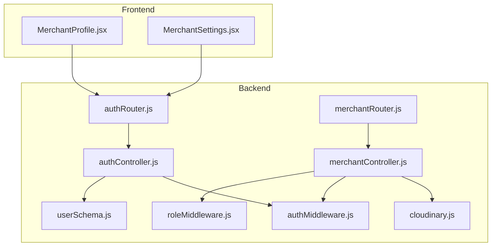
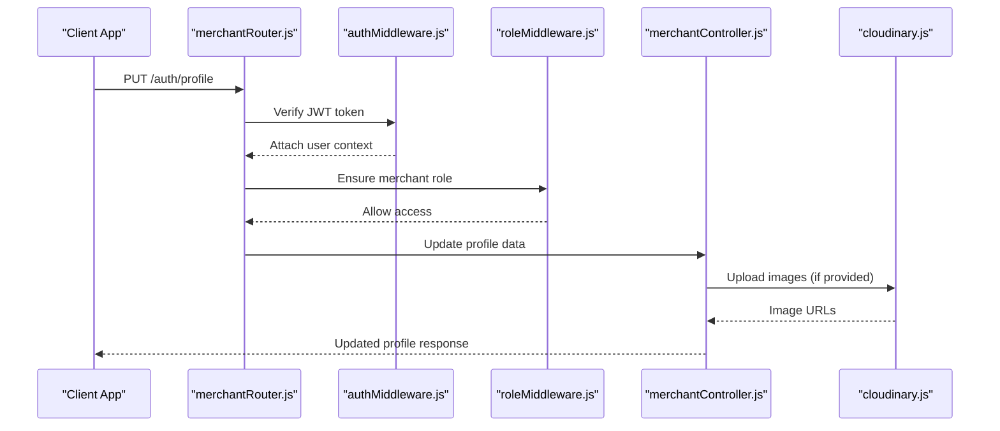
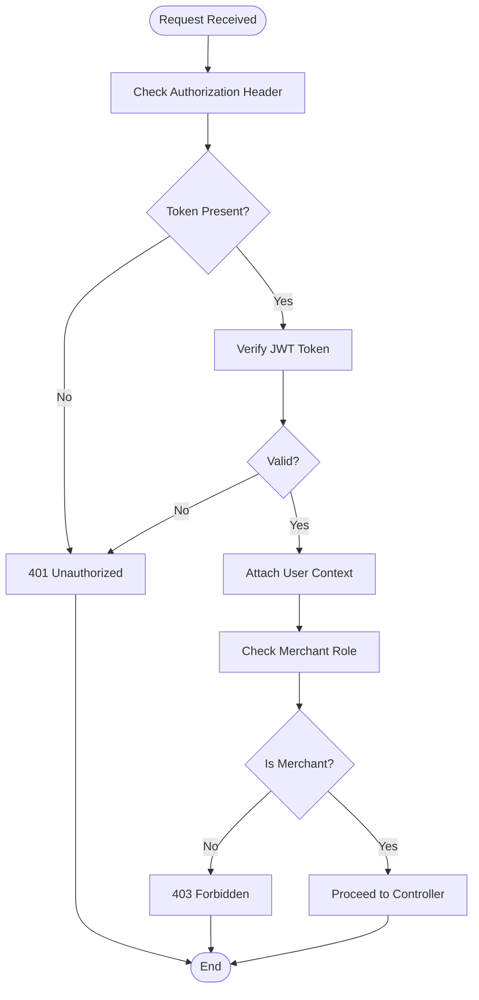
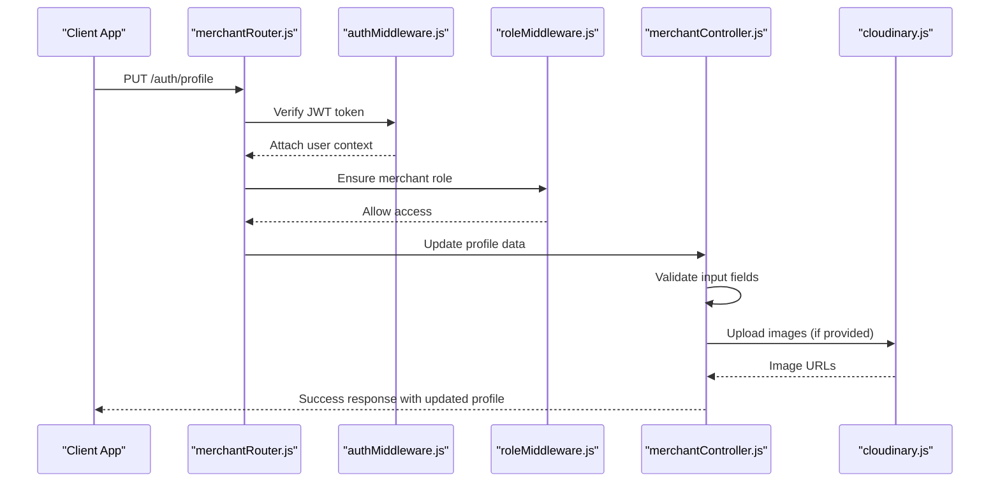
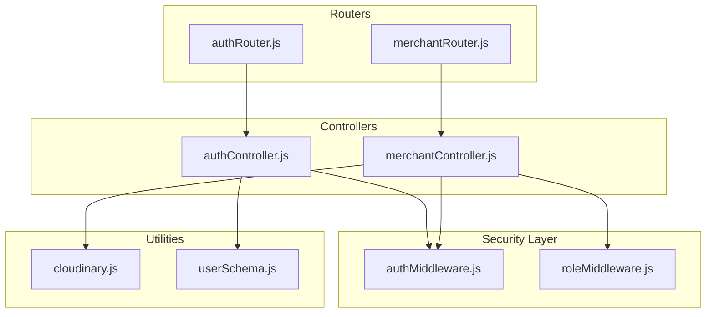

# Merchant Profile Management API

<cite>
**Referenced Files in This Document**
- [merchantController.js](file://backend/controller/merchantController.js)
- [merchantRouter.js](file://backend/router/merchantRouter.js)
- [authController.js](file://backend/controller/authController.js)
- [authRouter.js](file://backend/router/authRouter.js)
- [authMiddleware.js](file://backend/middleware/authMiddleware.js)
- [roleMiddleware.js](file://backend/middleware/roleMiddleware.js)
- [cloudinary.js](file://backend/util/cloudinary.js)
- [userSchema.js](file://backend/models/userSchema.js)
- [MerchantProfile.jsx](file://frontend/src/pages/dashboards/MerchantProfile.jsx)
- [MerchantSettings.jsx](file://frontend/src/pages/dashboards/MerchantSettings.jsx)
</cite>

## Table of Contents
1. [Introduction](#introduction)
2. [Project Structure](#project-structure)
3. [Core Components](#core-components)
4. [Architecture Overview](#architecture-overview)
5. [Detailed Component Analysis](#detailed-component-analysis)
6. [Dependency Analysis](#dependency-analysis)
7. [Performance Considerations](#performance-considerations)
8. [Troubleshooting Guide](#troubleshooting-guide)
9. [Conclusion](#conclusion)

## Introduction
This document provides comprehensive API documentation for merchant profile management endpoints. It covers profile updates, verification processes, and merchant account settings. The documentation includes profile data validation, verification workflows, and compliance-related endpoints. Examples demonstrate profile update requests, verification document uploads, and merchant account configuration changes.

## Project Structure
The merchant profile management functionality spans backend controllers, routers, middleware, and frontend components. The backend exposes REST endpoints secured by authentication and role-based access control, while the frontend provides user interfaces for profile updates and settings management.

**Diagram sources**
- [merchantRouter.js:1-17](file://backend/router/merchantRouter.js#L1-L17)
- [authRouter.js:1-12](file://backend/router/authRouter.js#L1-L12)
- [merchantController.js:1-209](file://backend/controller/merchantController.js#L1-L209)
- [authController.js:1-120](file://backend/controller/authController.js#L1-L120)
- [authMiddleware.js:1-17](file://backend/middleware/authMiddleware.js#L1-L17)
- [roleMiddleware.js:1-9](file://backend/middleware/roleMiddleware.js#L1-L9)
- [cloudinary.js:1-112](file://backend/util/cloudinary.js#L1-L112)
- [userSchema.js:1-55](file://backend/models/userSchema.js#L1-L55)

**Section sources**
- [merchantRouter.js:1-17](file://backend/router/merchantRouter.js#L1-L17)
- [authRouter.js:1-12](file://backend/router/authRouter.js#L1-L12)
- [merchantController.js:1-209](file://backend/controller/merchantController.js#L1-L209)
- [authController.js:1-120](file://backend/controller/authController.js#L1-L120)
- [authMiddleware.js:1-17](file://backend/middleware/authMiddleware.js#L1-L17)
- [roleMiddleware.js:1-9](file://backend/middleware/roleMiddleware.js#L1-L9)
- [cloudinary.js:1-112](file://backend/util/cloudinary.js#L1-L112)
- [userSchema.js:1-55](file://backend/models/userSchema.js#L1-L55)

## Core Components
This section outlines the primary components involved in merchant profile management, including authentication, authorization, profile updates, and media handling.

- Authentication and Authorization
  - JWT-based authentication middleware validates tokens and attaches user context to requests.
  - Role-based middleware ensures only merchants can access merchant-specific endpoints.
- Profile Management
  - Profile update endpoint supports partial updates for merchant profile fields.
  - Settings endpoint manages password changes and notification preferences.
- Media Handling
  - Cloudinary integration handles secure image uploads and deletions for event management.

**Section sources**
- [authMiddleware.js:1-17](file://backend/middleware/authMiddleware.js#L1-L17)
- [roleMiddleware.js:1-9](file://backend/middleware/roleMiddleware.js#L1-L9)
- [authController.js:1-120](file://backend/controller/authController.js#L1-L120)
- [cloudinary.js:1-112](file://backend/util/cloudinary.js#L1-L112)

## Architecture Overview
The merchant profile management API follows a layered architecture with clear separation of concerns:
- Frontend components handle user interactions and form submissions.
- Backend routes define endpoint contracts and apply middleware for authentication and authorization.
- Controllers implement business logic for profile updates and settings management.
- Middleware enforces security policies and data validation.
- Utility modules manage external integrations like Cloudinary.

**Diagram sources**
- [merchantRouter.js:1-17](file://backend/router/merchantRouter.js#L1-L17)
- [authMiddleware.js:1-17](file://backend/middleware/authMiddleware.js#L1-L17)
- [roleMiddleware.js:1-9](file://backend/middleware/roleMiddleware.js#L1-L9)
- [merchantController.js:1-209](file://backend/controller/merchantController.js#L1-L209)
- [cloudinary.js:1-112](file://backend/util/cloudinary.js#L1-L112)

## Detailed Component Analysis

### Authentication and Authorization
The authentication system uses JWT tokens stored in the Authorization header. The middleware verifies tokens and populates the request with user context. Role-based middleware restricts access to merchant-specific endpoints.

**Diagram sources**
- [authMiddleware.js:1-17](file://backend/middleware/authMiddleware.js#L1-L17)
- [roleMiddleware.js:1-9](file://backend/middleware/roleMiddleware.js#L1-L9)

**Section sources**
- [authMiddleware.js:1-17](file://backend/middleware/authMiddleware.js#L1-L17)
- [roleMiddleware.js:1-9](file://backend/middleware/roleMiddleware.js#L1-L9)

### Profile Update Endpoint
The profile update endpoint allows merchants to modify their profile information. It supports partial updates and integrates with Cloudinary for image uploads when applicable.

Key features:
- Partial updates for name, email, phone, address, business name, and bio.
- Validation of required fields and data types.
- Secure handling of user credentials and preferences.

**Diagram sources**
- [merchantRouter.js:1-17](file://backend/router/merchantRouter.js#L1-L17)
- [authMiddleware.js:1-17](file://backend/middleware/authMiddleware.js#L1-L17)
- [roleMiddleware.js:1-9](file://backend/middleware/roleMiddleware.js#L1-L9)
- [merchantController.js:1-209](file://backend/controller/merchantController.js#L1-L209)
- [cloudinary.js:1-112](file://backend/util/cloudinary.js#L1-L112)

**Section sources**
- [merchantController.js:1-209](file://backend/controller/merchantController.js#L1-L209)
- [cloudinary.js:1-112](file://backend/util/cloudinary.js#L1-L112)

### Settings Management
The settings endpoint enables merchants to change their password and configure notification preferences. It includes validation for password strength and confirmation.

Validation rules:
- Password change requires current password confirmation.
- New password must match confirmation password.
- Notification preferences support boolean toggles.

**Section sources**
- [MerchantSettings.jsx:1-240](file://frontend/src/pages/dashboards/MerchantSettings.jsx#L1-L240)

### Event Management Endpoints
While primarily focused on profile management, the merchant router also exposes event management endpoints that demonstrate similar patterns for image uploads and validation.

Endpoints:
- POST /events: Create new events with optional image uploads.
- PUT /events/:id: Update existing events with optional image replacements.
- GET /events: List merchant's events.
- GET /events/:id: Retrieve specific event details.
- GET /events/:id/participants: List event participants.
- DELETE /events/:id: Remove events and associated images.

**Section sources**
- [merchantRouter.js:1-17](file://backend/router/merchantRouter.js#L1-L17)
- [merchantController.js:1-209](file://backend/controller/merchantController.js#L1-L209)

## Dependency Analysis
The merchant profile management API exhibits clear dependency relationships among components:

**Diagram sources**
- [authRouter.js:1-12](file://backend/router/authRouter.js#L1-L12)
- [merchantRouter.js:1-17](file://backend/router/merchantRouter.js#L1-L17)
- [authController.js:1-120](file://backend/controller/authController.js#L1-L120)
- [merchantController.js:1-209](file://backend/controller/merchantController.js#L1-L209)
- [authMiddleware.js:1-17](file://backend/middleware/authMiddleware.js#L1-L17)
- [roleMiddleware.js:1-9](file://backend/middleware/roleMiddleware.js#L1-L9)
- [cloudinary.js:1-112](file://backend/util/cloudinary.js#L1-L112)
- [userSchema.js:1-55](file://backend/models/userSchema.js#L1-L55)

**Section sources**
- [authRouter.js:1-12](file://backend/router/authRouter.js#L1-L12)
- [merchantRouter.js:1-17](file://backend/router/merchantRouter.js#L1-L17)
- [authController.js:1-120](file://backend/controller/authController.js#L1-L120)
- [merchantController.js:1-209](file://backend/controller/merchantController.js#L1-L209)
- [authMiddleware.js:1-17](file://backend/middleware/authMiddleware.js#L1-L17)
- [roleMiddleware.js:1-9](file://backend/middleware/roleMiddleware.js#L1-L9)
- [cloudinary.js:1-112](file://backend/util/cloudinary.js#L1-L112)
- [userSchema.js:1-55](file://backend/models/userSchema.js#L1-L55)

## Performance Considerations
- Token Verification: JWT verification occurs on every protected request; ensure efficient token caching where appropriate.
- Image Processing: Cloudinary transformations and validations add latency; consider optimizing image sizes and formats.
- Request Validation: Input validation reduces unnecessary database operations and improves error handling.
- Middleware Chain: Keep middleware chains concise to minimize request processing overhead.

## Troubleshooting Guide
Common issues and resolutions:
- Authentication Failures: Verify JWT token presence and validity in the Authorization header.
- Role-Based Access: Ensure the user role is merchant; otherwise, access will be denied.
- File Upload Issues: Confirm Cloudinary configuration and image format restrictions.
- Validation Errors: Check required fields and data types for profile updates.

**Section sources**
- [authMiddleware.js:1-17](file://backend/middleware/authMiddleware.js#L1-L17)
- [roleMiddleware.js:1-9](file://backend/middleware/roleMiddleware.js#L1-L9)
- [cloudinary.js:1-112](file://backend/util/cloudinary.js#L1-L112)

## Conclusion
The merchant profile management API provides a robust foundation for managing merchant profiles, settings, and related operations. The architecture emphasizes security through JWT authentication and role-based access control, while leveraging Cloudinary for media handling. The modular design facilitates maintainability and extensibility for future enhancements.