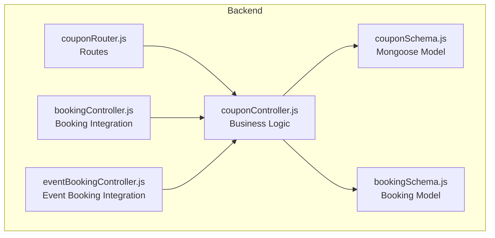
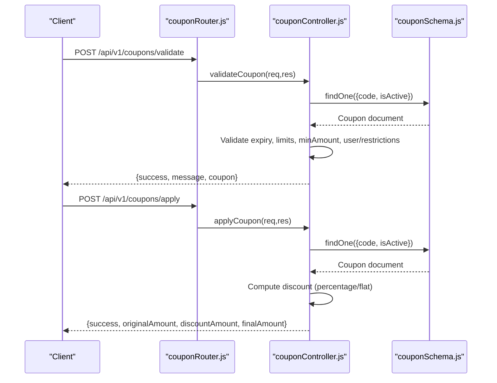
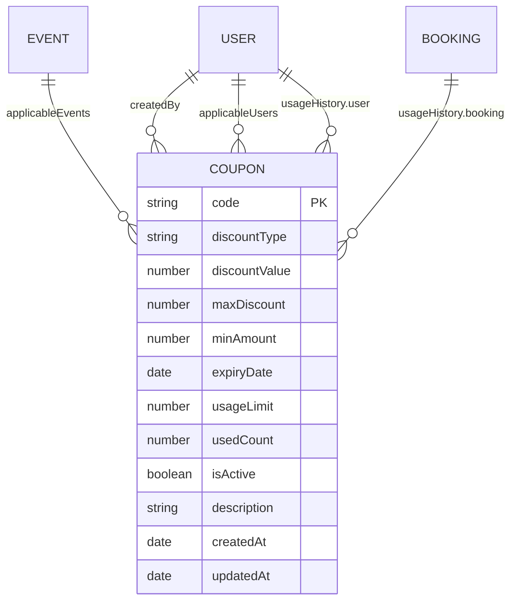
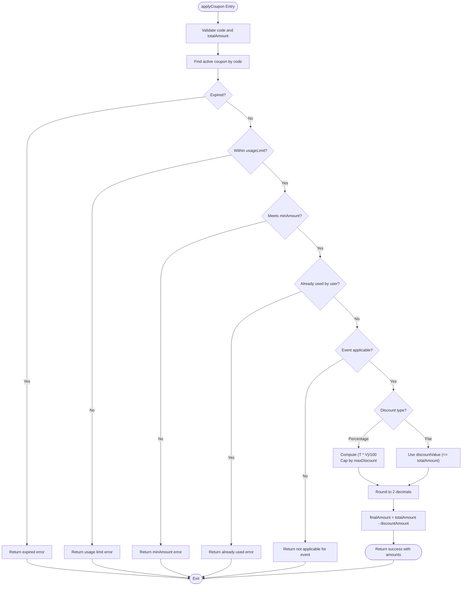
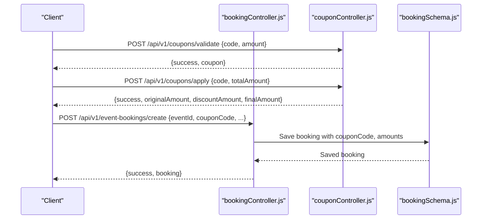
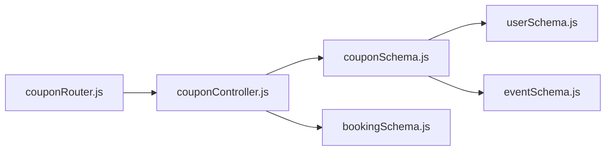

# Coupon Management API

<cite>
**Referenced Files in This Document**
- [couponController.js](file://backend/controller/couponController.js)
- [couponRouter.js](file://backend/router/couponRouter.js)
- [couponSchema.js](file://backend/models/couponSchema.js)
- [test-coupon-api.js](file://backend/test-coupon-api.js)
- [test-full-coupon-workflow.js](file://backend/test-full-coupon-workflow.js)
- [create-test-coupons.js](file://backend/create-test-coupons.js)
- [bookingController.js](file://backend/controller/bookingController.js)
- [bookingSchema.js](file://backend/models/bookingSchema.js)
- [eventBookingController.js](file://backend/controller/eventBookingController.js)
</cite>

## Table of Contents
1. [Introduction](#introduction)
2. [Project Structure](#project-structure)
3. [Core Components](#core-components)
4. [Architecture Overview](#architecture-overview)
5. [Detailed Component Analysis](#detailed-component-analysis)
6. [Dependency Analysis](#dependency-analysis)
7. [Performance Considerations](#performance-considerations)
8. [Troubleshooting Guide](#troubleshooting-guide)
9. [Conclusion](#conclusion)
10. [Appendices](#appendices)

## Introduction
This document provides comprehensive API documentation for the Coupon Management system. It covers coupon creation, validation, application, discount calculation, usage tracking, listing, retrieval, updates, and deletion. It also documents coupon types (percentage and flat), expiration handling, minimum purchase requirements, usage limits, validation during booking workflows, conflict resolution for multiple coupons, and integration with payment processing. Examples of scenarios, validation responses, and error conditions are included to guide both developers and support teams.

## Project Structure
The Coupon Management API is implemented using a standard MERN stack architecture:
- Router: Defines endpoint routes and applies authentication and role middleware.
- Controller: Implements business logic for coupon operations.
- Model: Defines the Coupon schema with fields for discount types, limits, restrictions, and usage history.
- Tests: Demonstrate end-to-end coupon workflows and API usage.

**Diagram sources**
- [couponRouter.js:1-37](file://backend/router/couponRouter.js#L1-L37)
- [couponController.js:1-757](file://backend/controller/couponController.js#L1-L757)
- [couponSchema.js:1-123](file://backend/models/couponSchema.js#L1-L123)
- [bookingController.js](file://backend/controller/bookingController.js)
- [eventBookingController.js](file://backend/controller/eventBookingController.js)
- [bookingSchema.js](file://backend/models/bookingSchema.js)

**Section sources**
- [couponRouter.js:1-37](file://backend/router/couponRouter.js#L1-L37)
- [couponController.js:1-757](file://backend/controller/couponController.js#L1-L757)
- [couponSchema.js:1-123](file://backend/models/couponSchema.js#L1-L123)

## Core Components
- Router: Exposes endpoints for coupon validation, application, removal, listing, creation, updates, deletion, activation/deactivation, and statistics. Applies authentication and admin role checks where appropriate.
- Controller: Implements validation rules, discount calculations, usage tracking, and administrative operations.
- Model: Defines coupon fields including code, discount type/value, caps, min purchase, expiry, usage limits, activity history, and optional event/user/category restrictions.

Key capabilities:
- Coupon validation without application
- Coupon application with discount computation
- Removal of applied coupon
- Listing available coupons filtered by amount, event, and user usage
- Administrative creation, updates, deletion, and status toggling
- Statistics aggregation for coupon usage

**Section sources**
- [couponRouter.js:19-33](file://backend/router/couponRouter.js#L19-L33)
- [couponController.js:6-131](file://backend/controller/couponController.js#L6-L131)
- [couponController.js:134-285](file://backend/controller/couponController.js#L134-L285)
- [couponController.js:288-308](file://backend/controller/couponController.js#L288-L308)
- [couponController.js:311-386](file://backend/controller/couponController.js#L311-L386)
- [couponController.js:388-505](file://backend/controller/couponController.js#L388-L505)
- [couponController.js:568-656](file://backend/controller/couponController.js#L568-L656)
- [couponController.js:659-692](file://backend/controller/couponController.js#L659-L692)
- [couponController.js:695-757](file://backend/controller/couponController.js#L695-L757)
- [couponSchema.js:3-98](file://backend/models/couponSchema.js#L3-L98)

## Architecture Overview
The Coupon Management API follows a layered architecture:
- HTTP Layer: Express routes define endpoints.
- Middleware Layer: Authentication and role-based access control.
- Controller Layer: Orchestrates model interactions and business rules.
- Persistence Layer: Mongoose model with indexes and virtuals.

**Diagram sources**
- [couponRouter.js:22-25](file://backend/router/couponRouter.js#L22-L25)
- [couponController.js:6-131](file://backend/controller/couponController.js#L6-L131)
- [couponController.js:134-285](file://backend/controller/couponController.js#L134-L285)
- [couponSchema.js:3-98](file://backend/models/couponSchema.js#L3-L98)

## Detailed Component Analysis

### Endpoint Definitions and Behaviors

#### 1) Coupon Validation (GET /api/v1/coupons/validate)
Purpose: Validate a coupon code against current user, amount, event, and restrictions without applying it.

Behavior:
- Requires authenticated user and amount.
- Validates coupon existence, activity, expiry, usage limits, minimum purchase, user/event restrictions.
- Returns coupon metadata if valid.

Responses:
- 200: Success with coupon details.
- 400: Invalid amount, expired coupon, usage limit exceeded, insufficient minimum amount, already used by user, not applicable for event/account.
- 404: Invalid coupon code.
- 500: Internal server error.

**Section sources**
- [couponRouter.js:22](file://backend/router/couponRouter.js#L22)
- [couponController.js:6-131](file://backend/controller/couponController.js#L6-L131)

#### 2) Coupon Application (POST /api/v1/coupons/apply)
Purpose: Apply a coupon to compute discount and final amount.

Behavior:
- Requires authenticated user and total amount.
- Performs same validations as validation endpoint.
- Computes discount based on type:
  - Percentage: capped by maxDiscount if set.
  - Flat: limited to total amount.
- Rounds discount to two decimals and calculates final amount.

Responses:
- 200: Success with originalAmount, discountAmount, finalAmount, savings.
- 400: Same validation errors as validation endpoint.
- 500: Internal server error.

**Section sources**
- [couponRouter.js:23](file://backend/router/couponRouter.js#L23)
- [couponController.js:134-285](file://backend/controller/couponController.js#L134-L285)

#### 3) Remove Applied Coupon (POST /api/v1/coupons/remove)
Purpose: Remove an applied coupon and revert to original amount.

Behavior:
- Accepts totalAmount.
- Returns amounts with zero discount.

Responses:
- 200: Success with originalAmount, discountAmount=0, finalAmount=originalAmount, savings=0.
- 500: Internal server error.

**Section sources**
- [couponRouter.js:24](file://backend/router/couponRouter.js#L24)
- [couponController.js:288-308](file://backend/controller/couponController.js#L288-L308)

#### 4) List Available Coupons (GET /api/v1/coupons/available)
Purpose: Retrieve coupons available to the authenticated user based on filters.

Filters:
- totalAmount: minAmount threshold.
- eventId: event applicability.
- User-specific exclusion of coupons already used by the user.

Responses:
- 200: Success with coupons array and total count.
- 401: Authentication required.
- 500: Internal server error.

**Section sources**
- [couponRouter.js:25](file://backend/router/couponRouter.js#L25)
- [couponController.js:311-386](file://backend/controller/couponController.js#L311-L386)

#### 5) Create Coupon (POST /api/v1/coupons/create)
Purpose: Admin-only endpoint to create coupons.

Validation:
- Required fields: code, discountType, discountValue, expiryDate, usageLimit.
- discountType must be "percentage" or "flat".
- Percentage discount range: 1–100; flat discount > 0.
- Expiry date must be in the future.
- Unique coupon code.

Responses:
- 201: Success with created coupon.
- 400: Validation failures or duplicate code.
- 500: Internal server error.

**Section sources**
- [couponRouter.js:28](file://backend/router/couponRouter.js#L28)
- [couponController.js:388-505](file://backend/controller/couponController.js#L388-L505)

#### 6) List All Coupons (GET /api/v1/coupons/all)
Purpose: Admin-only listing with pagination, status filtering, and search.

Filters:
- status: active, inactive, expired.
- search: code or description.

Pagination:
- page, limit supported.

Responses:
- 200: Success with coupons and pagination info.
- 500: Internal server error.

**Section sources**
- [couponRouter.js:29](file://backend/router/couponRouter.js#L29)
- [couponController.js:508-565](file://backend/controller/couponController.js#L508-L565)

#### 7) Update Coupon (PUT /api/v1/coupons/:couponId)
Purpose: Admin-only update with protection against changing code for used coupons.

Protection:
- Prevents updating code if usedCount > 0.

Responses:
- 200: Success with updated coupon.
- 400: Cannot update code of a used coupon.
- 404: Coupon not found.
- 500: Internal server error.

**Section sources**
- [couponRouter.js:30](file://backend/router/couponRouter.js#L30)
- [couponController.js:568-614](file://backend/controller/couponController.js#L568-L614)

#### 8) Delete Coupon (DELETE /api/v1/coupons/:couponId)
Purpose: Admin-only deletion with protection for used coupons.

Protection:
- Prevents deleting coupons with usedCount > 0.

Responses:
- 200: Success.
- 400: Cannot delete a used coupon.
- 404: Coupon not found.
- 500: Internal server error.

**Section sources**
- [couponRouter.js:31](file://backend/router/couponRouter.js#L31)
- [couponController.js:617-656](file://backend/controller/couponController.js#L617-L656)

#### 9) Toggle Coupon Status (PATCH /api/v1/coupons/:couponId/toggle)
Purpose: Admin-only activation/deactivation.

Responses:
- 200: Success with updated coupon status.
- 404: Coupon not found.
- 500: Internal server error.

**Section sources**
- [couponRouter.js:32](file://backend/router/couponRouter.js#L32)
- [couponController.js:659-692](file://backend/controller/couponController.js#L659-L692)

#### 10) Coupon Statistics (GET /api/v1/coupons/stats)
Purpose: Admin-only statistics on total coupons, active/expired counts, total usage, and total discount given.

Responses:
- 200: Success with stats object.
- 500: Internal server error.

**Section sources**
- [couponRouter.js:33](file://backend/router/couponRouter.js#L33)
- [couponController.js:695-757](file://backend/controller/couponController.js#L695-L757)

### Coupon Schema and Data Model
The Coupon model defines:
- Identity: code (unique, uppercase), description.
- Discount: discountType ("percentage" or "flat"), discountValue, maxDiscount (optional for percentage), minAmount.
- Lifecycle: expiryDate, usageLimit, usedCount, isActive.
- Restrictions: applicableEvents, applicableCategories, applicableUsers.
- Tracking: usageHistory entries with user, booking, usedAt, discountAmount.
- Virtuals: remainingUsage, usagePercentage.
- Indexes: code, (isActive, expiryDate), createdBy.

**Diagram sources**
- [couponSchema.js:3-98](file://backend/models/couponSchema.js#L3-L98)

**Section sources**
- [couponSchema.js:3-98](file://backend/models/couponSchema.js#L3-L98)

### Discount Calculation Logic
The controller computes discounts during application:
- Percentage discount: (totalAmount × discountValue) / 100, capped by maxDiscount if present.
- Flat discount: discountValue, but not exceeding totalAmount.
- Final amount: totalAmount − discountAmount.
- Rounding: discountAmount rounded to two decimals.

**Diagram sources**
- [couponController.js:134-285](file://backend/controller/couponController.js#L134-L285)

**Section sources**
- [couponController.js:236-257](file://backend/controller/couponController.js#L236-L257)

### Usage Tracking and History
- usageHistory stores per-user usage entries with booking reference, timestamp, and discountAmount.
- usedCount increments when a coupon is successfully applied.
- Users cannot reuse the same coupon; existingUsage prevents reapplication.

Integration points:
- Booking creation captures couponCode, originalAmount, discountAmount, finalAmount, and persists usageHistory.

**Section sources**
- [couponController.js:68-78](file://backend/controller/couponController.js#L68-L78)
- [couponController.js:196-206](file://backend/controller/couponController.js#L196-L206)
- [couponController.js:699-735](file://backend/controller/couponController.js#L699-L735)

### Coupon Types and Restrictions
- Types:
  - Percentage: discountValue 1–100; capped by maxDiscount.
  - Flat: discountValue > 0; cannot exceed totalAmount.
- Restrictions:
  - applicableEvents: restrict to specific events.
  - applicableUsers: restrict to specific users.
  - applicableCategories: category-based restriction placeholder.
- Expiration: coupons become inactive upon expiryDate.
- Usage limits: enforced via usageLimit and usedCount.

**Section sources**
- [couponController.js:44-50](file://backend/controller/couponController.js#L44-L50)
- [couponController.js:52-58](file://backend/controller/couponController.js#L52-L58)
- [couponController.js:60-66](file://backend/controller/couponController.js#L60-L66)
- [couponController.js:80-92](file://backend/controller/couponController.js#L80-L92)
- [couponController.js:94-106](file://backend/controller/couponController.js#L94-L106)
- [couponSchema.js:14-28](file://backend/models/couponSchema.js#L14-L28)
- [couponSchema.js:63-75](file://backend/models/couponSchema.js#L63-L75)

### Validation During Booking Workflows
End-to-end workflow:
- User selects an event and amount.
- Available coupons are fetched and filtered by totalAmount and event.
- User validates and applies a coupon.
- Booking is created with couponCode and computed amounts.
- Coupon usageHistory is recorded with booking reference.

**Diagram sources**
- [test-full-coupon-workflow.js:46-114](file://backend/test-full-coupon-workflow.js#L46-L114)
- [couponController.js:6-131](file://backend/controller/couponController.js#L6-L131)
- [couponController.js:134-285](file://backend/controller/couponController.js#L134-L285)
- [bookingController.js](file://backend/controller/bookingController.js)
- [bookingSchema.js](file://backend/models/bookingSchema.js)

**Section sources**
- [test-full-coupon-workflow.js:12-128](file://backend/test-full-coupon-workflow.js#L12-L128)

### Conflict Resolution for Multiple Coupons
- Single coupon application: applyCoupon supports one coupon per booking.
- Conflict resolution strategy:
  - Prefer the most beneficial coupon (controller sorts available coupons by discountValue).
  - Enforce per-user uniqueness: user cannot reuse the same coupon.
  - Enforce event/user/category restrictions to avoid cross-application conflicts.

**Section sources**
- [couponController.js:351-375](file://backend/controller/couponController.js#L351-L375)
- [couponController.js:68-78](file://backend/controller/couponController.js#L68-L78)
- [couponController.js:80-106](file://backend/controller/couponController.js#L80-L106)

### Integration with Payment Processing
- Coupon application returns finalAmount for payment processing.
- Payment systems should use finalAmount from the applyCoupon response.
- Usage tracking ensures auditability for refunds and disputes.

**Section sources**
- [couponController.js:263-276](file://backend/controller/couponController.js#L263-L276)

### Example Scenarios and Responses

#### Scenario 1: Valid Percentage Coupon
- Request: POST /api/v1/coupons/validate with couponCode and amount.
- Response: Success with coupon details (code, discountType, discountValue, maxDiscount, description).

**Section sources**
- [couponController.js:110-122](file://backend/controller/couponController.js#L110-L122)

#### Scenario 2: Valid Flat Coupon Application
- Request: POST /api/v1/coupons/apply with code and totalAmount.
- Response: Success with originalAmount, discountAmount, finalAmount, savings.

**Section sources**
- [couponController.js:263-276](file://backend/controller/couponController.js#L263-L276)

#### Scenario 3: Expired Coupon
- Request: POST /api/v1/coupons/validate with expired couponCode.
- Response: Error indicating coupon has expired.

**Section sources**
- [couponController.js:44-50](file://backend/controller/couponController.js#L44-L50)

#### Scenario 4: Already Used Coupon
- Request: POST /api/v1/coupons/validate with couponCode already used by user.
- Response: Error indicating coupon already used.

**Section sources**
- [couponController.js:68-78](file://backend/controller/couponController.js#L68-L78)

#### Scenario 5: Booking with Coupon
- Workflow: validate → apply → create booking.
- Outcome: Booking saved with couponCode, originalAmount, discountAmount, finalAmount.

**Section sources**
- [test-full-coupon-workflow.js:46-114](file://backend/test-full-coupon-workflow.js#L46-L114)

## Dependency Analysis
- Router depends on controller functions.
- Controller depends on Coupon model and Booking model for usage tracking.
- Coupon model depends on User and Event models for references.

**Diagram sources**
- [couponRouter.js:1-37](file://backend/router/couponRouter.js#L1-L37)
- [couponController.js:1-757](file://backend/controller/couponController.js#L1-L757)
- [couponSchema.js:1-123](file://backend/models/couponSchema.js#L1-L123)

**Section sources**
- [couponRouter.js:1-37](file://backend/router/couponRouter.js#L1-L37)
- [couponController.js:1-757](file://backend/controller/couponController.js#L1-L757)
- [couponSchema.js:1-123](file://backend/models/couponSchema.js#L1-L123)

## Performance Considerations
- Indexes: code, (isActive, expiryDate), createdBy improve query performance.
- Aggregation: getCouponStats uses aggregation pipeline for efficient statistics.
- Sorting: Available coupons are sorted by discountValue to aid selection.
- Rounding: Discounts are rounded to two decimals to prevent floating-point precision issues.

Recommendations:
- Monitor slow queries on coupon lookups and aggregations.
- Consider caching frequently accessed coupon lists for high-traffic periods.
- Ensure expiryDate and usageLimit checks leverage indexes.

**Section sources**
- [couponSchema.js:110-114](file://backend/models/couponSchema.js#L110-L114)
- [couponController.js:699-735](file://backend/controller/couponController.js#L699-L735)
- [couponController.js:351-353](file://backend/controller/couponController.js#L351-L353)
- [couponController.js:255-257](file://backend/controller/couponController.js#L255-L257)

## Troubleshooting Guide
Common issues and resolutions:
- Invalid coupon code: Ensure code exists and is uppercase; verify isActive and expiryDate.
- Expired coupon: Extend expiryDate or create a new coupon.
- Usage limit exceeded: Increase usageLimit or create a new coupon.
- Minimum purchase not met: Adjust minAmount or increase cart total.
- Already used by user: Enforce per-user uniqueness; do not reuse same coupon.
- Not applicable for event/account: Verify applicableEvents/applicableUsers.
- Cannot update/delete used coupon: usedCount must be zero.

Error response patterns:
- Validation errors return 400 with specific messages.
- Not found returns 404.
- Internal errors return 500.

**Section sources**
- [couponController.js:37-42](file://backend/controller/couponController.js#L37-L42)
- [couponController.js:44-50](file://backend/controller/couponController.js#L44-L50)
- [couponController.js:52-58](file://backend/controller/couponController.js#L52-L58)
- [couponController.js:60-66](file://backend/controller/couponController.js#L60-L66)
- [couponController.js:68-78](file://backend/controller/couponController.js#L68-L78)
- [couponController.js:80-106](file://backend/controller/couponController.js#L80-L106)
- [couponController.js:584-590](file://backend/controller/couponController.js#L584-L590)
- [couponController.js:632-638](file://backend/controller/couponController.js#L632-L638)

## Conclusion
The Coupon Management API provides robust functionality for coupon validation, application, and administration. It enforces business rules such as expiry dates, usage limits, minimum purchases, and user/event restrictions. Integration with booking workflows enables seamless discount application and accurate payment processing. Administrators can manage coupons efficiently with creation, updates, deletion, and statistics.

## Appendices

### A. Test Scripts and Examples
- test-coupon-api.js: Demonstrates login, fetching available coupons, validating, and applying a coupon.
- test-full-coupon-workflow.js: Integrates coupon validation, application, and booking creation.
- create-test-coupons.js: Seeds the database with sample coupons for testing.

**Section sources**
- [test-coupon-api.js:14-68](file://backend/test-coupon-api.js#L14-L68)
- [test-full-coupon-workflow.js:12-128](file://backend/test-full-coupon-workflow.js#L12-L128)
- [create-test-coupons.js:8-87](file://backend/create-test-coupons.js#L8-L87)