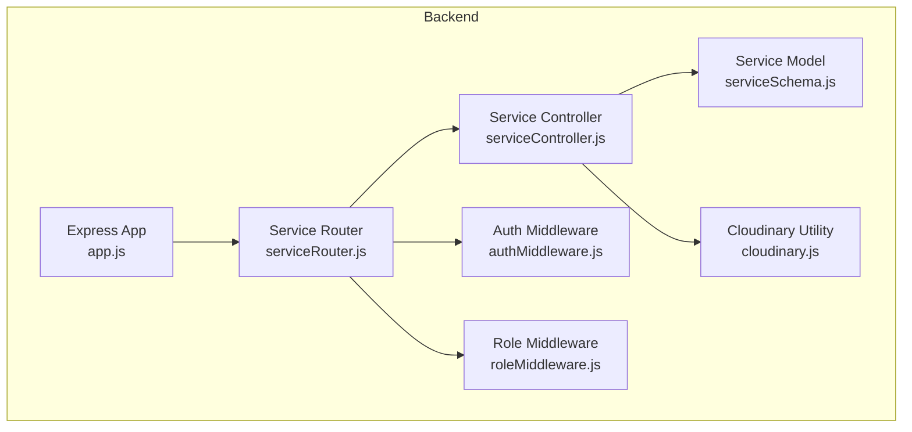
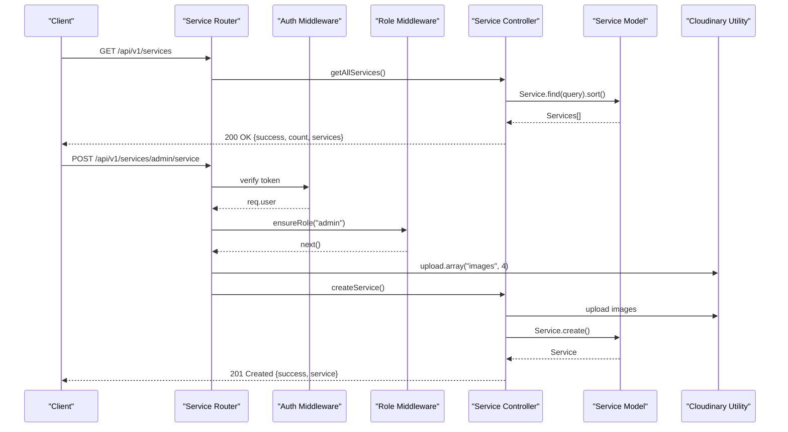
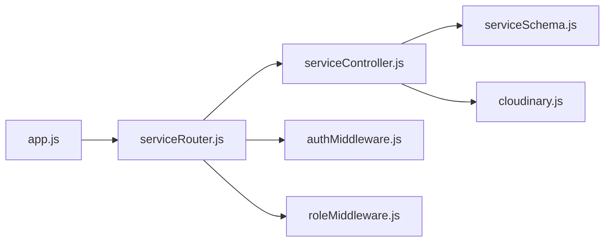

# Service Management API

<cite>
**Referenced Files in This Document**
- [app.js](file://backend/app.js)
- [serviceRouter.js](file://backend/router/serviceRouter.js)
- [serviceController.js](file://backend/controller/serviceController.js)
- [serviceSchema.js](file://backend/models/serviceSchema.js)
- [authMiddleware.js](file://backend/middleware/authMiddleware.js)
- [roleMiddleware.js](file://backend/middleware/roleMiddleware.js)
- [cloudinary.js](file://backend/util/cloudinary.js)
- [test-services-api.js](file://backend/test-services-api.js)
- [AdminServices.jsx](file://frontend/src/pages/dashboards/AdminServices.jsx)
- [Services.jsx](file://frontend/src/components/Services.jsx)
</cite>

## Table of Contents
1. [Introduction](#introduction)
2. [Project Structure](#project-structure)
3. [Core Components](#core-components)
4. [Architecture Overview](#architecture-overview)
5. [Detailed Component Analysis](#detailed-component-analysis)
6. [Dependency Analysis](#dependency-analysis)
7. [Performance Considerations](#performance-considerations)
8. [Troubleshooting Guide](#troubleshooting-guide)
9. [Conclusion](#conclusion)

## Introduction
This document provides comprehensive API documentation for the Service Management endpoints. It covers:
- Public service listing and retrieval
- Category-based filtering
- Admin-only CRUD operations (create, update, delete)
- Service image upload handling via Cloudinary
- Validation rules, pricing structures, availability management, and service categorization
- Request/response schemas, authentication requirements (admin role), file upload specifications, and error handling patterns

## Project Structure
The Service Management API is organized around a dedicated router, controller, model, middleware, and utility modules. The Express application mounts the service router under `/api/v1/services`.

**Diagram sources**
- [app.js:41](file://backend/app.js#L41)
- [serviceRouter.js:15](file://backend/router/serviceRouter.js#L15)
- [serviceController.js:1](file://backend/controller/serviceController.js#L1)
- [serviceSchema.js:14](file://backend/models/serviceSchema.js#L14)
- [authMiddleware.js:3](file://backend/middleware/authMiddleware.js#L3)
- [roleMiddleware.js:1](file://backend/middleware/roleMiddleware.js#L1)
- [cloudinary.js:1](file://backend/util/cloudinary.js#L1)

**Section sources**
- [app.js:41](file://backend/app.js#L41)
- [serviceRouter.js:15](file://backend/router/serviceRouter.js#L15)

## Core Components
- Service Router: Defines public and admin endpoints, applies authentication and role middleware, and integrates Cloudinary image uploads.
- Service Controller: Implements business logic for listing, retrieving, filtering, creating, updating, and deleting services, including Cloudinary image handling.
- Service Model: Enforces validation rules, pricing constraints, categorization, and image array limits.
- Authentication and Role Middleware: Ensures requests are authenticated and restricted to admin users for protected endpoints.
- Cloudinary Utility: Handles image upload, transformation, deletion, and validation.

**Section sources**
- [serviceRouter.js:17-46](file://backend/router/serviceRouter.js#L17-L46)
- [serviceController.js:74-322](file://backend/controller/serviceController.js#L74-L322)
- [serviceSchema.js:14-82](file://backend/models/serviceSchema.js#L14-L82)
- [authMiddleware.js:3-16](file://backend/middleware/authMiddleware.js#L3-L16)
- [roleMiddleware.js:1-8](file://backend/middleware/roleMiddleware.js#L1-L8)
- [cloudinary.js:35-58](file://backend/util/cloudinary.js#L35-L58)

## Architecture Overview
The Service Management API follows a layered architecture:
- HTTP Layer: Routes define endpoints and apply middleware.
- Controller Layer: Orchestrates data fetching, validation, and persistence.
- Model Layer: Provides schema validation and indexing.
- Utility Layer: Manages Cloudinary integration for image operations.

**Diagram sources**
- [serviceRouter.js:17-46](file://backend/router/serviceRouter.js#L17-L46)
- [authMiddleware.js:3-16](file://backend/middleware/authMiddleware.js#L3-L16)
- [roleMiddleware.js:1-8](file://backend/middleware/roleMiddleware.js#L1-L8)
- [serviceController.js:4-72](file://backend/controller/serviceController.js#L4-L72)
- [serviceSchema.js:14-82](file://backend/models/serviceSchema.js#L14-L82)
- [cloudinary.js:35-58](file://backend/util/cloudinary.js#L35-L58)

## Detailed Component Analysis

### Public Endpoints

#### GET /api/v1/services
- Purpose: Retrieve paginated and filtered list of active services.
- Query Parameters:
  - category: Filter by category.
  - search: Text search across title, description, and category.
  - minPrice, maxPrice: Price range filter.
  - sort: Sorting options: price_asc, price_desc, rating, newest.
- Response Schema:
  - success: Boolean
  - count: Number
  - services: Array of service objects
- Behavior:
  - Returns only active services by default.
  - Applies text search index if search query is provided.
  - Sorts by requested criteria or defaults to newest.

**Section sources**
- [serviceRouter.js:18](file://backend/router/serviceRouter.js#L18)
- [serviceController.js:74-118](file://backend/controller/serviceController.js#L74-L118)
- [serviceSchema.js:79](file://backend/models/serviceSchema.js#L79)

#### GET /api/v1/services/:id
- Purpose: Retrieve a single service by ID.
- Path Parameters:
  - id: ObjectId of the service.
- Response Schema:
  - success: Boolean
  - service: Service object
- Behavior:
  - Returns 404 if service not found.

**Section sources**
- [serviceRouter.js:20](file://backend/router/serviceRouter.js#L20)
- [serviceController.js:120-145](file://backend/controller/serviceController.js#L120-L145)

#### GET /api/v1/services/category/:category
- Purpose: Retrieve active services by category.
- Path Parameters:
  - category: Service category.
- Response Schema:
  - success: Boolean
  - count: Number
  - services: Array of service objects
- Behavior:
  - Returns only active services for the given category.

**Section sources**
- [serviceRouter.js:19](file://backend/router/serviceRouter.js#L19)
- [serviceController.js:300-322](file://backend/controller/serviceController.js#L300-L322)

### Admin-Only Endpoints

#### POST /api/v1/services/admin/service
- Purpose: Create a new service (admin only).
- Authentication:
  - Requires Bearer token.
  - Requires admin role.
- File Upload:
  - Field: images (array, up to 4 files).
  - Allowed formats: jpg, jpeg, png, webp.
  - Max file size: 5 MB per file.
  - Transformation: width 1200, height 800, crop limit.
- Request Body Fields:
  - title: String (required)
  - description: String (required)
  - category: Enum (required)
  - price: Number (required, >= 0)
  - rating: Number (optional, default 0, min 0, max 5)
- Response Schema:
  - success: Boolean
  - message: String
  - service: Service object
- Validation Rules:
  - At least one image required.
  - All required fields must be present.
  - Cloudinary upload must succeed for all files.

**Section sources**
- [serviceRouter.js:23-29](file://backend/router/serviceRouter.js#L23-L29)
- [serviceController.js:4-72](file://backend/controller/serviceController.js#L4-L72)
- [cloudinary.js:35-58](file://backend/util/cloudinary.js#L35-L58)
- [serviceSchema.js:16-65](file://backend/models/serviceSchema.js#L16-L65)

#### PUT /api/v1/services/admin/service/:id
- Purpose: Update an existing service (admin only).
- Authentication:
  - Requires Bearer token.
  - Requires admin role.
- File Upload:
  - Field: images (array, up to 4 files).
  - Same constraints as creation.
- Request Body Fields:
  - title, description, category, price, rating, isActive, existingImages (JSON string of kept images).
- Behavior:
  - Removes images not present in existingImages from Cloudinary.
  - Validates total images remain within 1–4.
  - Updates service fields and images atomically.

**Section sources**
- [serviceRouter.js:33-39](file://backend/router/serviceRouter.js#L33-L39)
- [serviceController.js:147-232](file://backend/controller/serviceController.js#L147-L232)
- [cloudinary.js:102-109](file://backend/util/cloudinary.js#L102-L109)
- [serviceSchema.js:57-65](file://backend/models/serviceSchema.js#L57-L65)

#### DELETE /api/v1/services/admin/service/:id
- Purpose: Delete a service (admin only).
- Authentication:
  - Requires Bearer token.
  - Requires admin role.
- Behavior:
  - Deletes associated images from Cloudinary.
  - Removes service document from database.

**Section sources**
- [serviceRouter.js:41-46](file://backend/router/serviceRouter.js#L41-L46)
- [serviceController.js:234-266](file://backend/controller/serviceController.js#L234-L266)
- [cloudinary.js:102-109](file://backend/util/cloudinary.js#L102-L109)

### Data Models and Validation

#### Service Schema
- Fields:
  - title: String, required, max length 100
  - description: String, required, max length 2000
  - category: Enum from predefined list
  - price: Number, required, min 0
  - rating: Number, default 0, min 0, max 5
  - images: Array of image objects (1–4), each with public_id and url
  - isActive: Boolean, default true
  - createdBy: ObjectId reference to User
- Indexes:
  - Text index on title, description, category for search.

**Section sources**
- [serviceSchema.js:14-82](file://backend/models/serviceSchema.js#L14-L82)

### Authentication and Authorization
- Authentication:
  - Middleware verifies Bearer token and attaches user info (userId, role) to request.
- Authorization:
  - Admin role enforced for all admin endpoints.

**Section sources**
- [authMiddleware.js:3-16](file://backend/middleware/authMiddleware.js#L3-L16)
- [roleMiddleware.js:1-8](file://backend/middleware/roleMiddleware.js#L1-L8)

### Image Upload and Cloudinary Integration
- Configuration:
  - Cloud name, API key, and secret loaded from environment.
  - Folder: eventhub/services
  - Allowed formats: jpg, jpeg, png, webp
  - File size limit: 5 MB
  - Transformation: width 1200, height 800, crop limit
- Operations:
  - Upload single/multiple images
  - Delete single/multiple images by public_id
- Controller Integration:
  - Creation and update endpoints use upload.array("images", 4).
  - Validation ensures at least one image and maximum four images.

**Section sources**
- [cloudinary.js:8-58](file://backend/util/cloudinary.js#L8-L58)
- [cloudinary.js:60-109](file://backend/util/cloudinary.js#L60-L109)
- [serviceController.js:22-44](file://backend/controller/serviceController.js#L22-L44)
- [serviceController.js:193-218](file://backend/controller/serviceController.js#L193-L218)

### Request/Response Schemas

#### Common Response Wrapper
- All endpoints wrap responses with a success flag and a message field.
- Error responses return 4xx/5xx with success: false and message.

**Section sources**
- [serviceController.js:14-20](file://backend/controller/serviceController.js#L14-L20)
- [serviceController.js:111-117](file://backend/controller/serviceController.js#L111-L117)
- [serviceController.js:138-144](file://backend/controller/serviceController.js#L138-L144)
- [serviceController.js:225-231](file://backend/controller/serviceController.js#L225-L231)
- [serviceController.js:259-265](file://backend/controller/serviceController.js#L259-L265)

#### Public Listing Response
- GET /api/v1/services
- Body: { success: boolean, count: number, services: Service[] }

**Section sources**
- [serviceController.js:106-110](file://backend/controller/serviceController.js#L106-L110)

#### Single Service Response
- GET /api/v1/services/:id
- Body: { success: boolean, service: Service }

**Section sources**
- [serviceController.js:134-137](file://backend/controller/serviceController.js#L134-L137)

#### Category Listing Response
- GET /api/v1/services/category/:category
- Body: { success: boolean, count: number, services: Service[] }

**Section sources**
- [serviceController.js:310-314](file://backend/controller/serviceController.js#L310-L314)

#### Admin CRUD Responses
- POST /api/v1/services/admin/service: 201 Created with { success, message, service }
- PUT /api/v1/services/admin/service/:id: 200 OK with { success, message, service }
- DELETE /api/v1/services/admin/service/:id: 200 OK with { success, message }

**Section sources**
- [serviceController.js:60-64](file://backend/controller/serviceController.js#L60-L64)
- [serviceController.js:220-224](file://backend/controller/serviceController.js#L220-L224)
- [serviceController.js:255-258](file://backend/controller/serviceController.js#L255-L258)

### Frontend Integration Examples
- Public listing:
  - Client fetches services from /api/v1/services and renders cards with title, category, price, rating, and images.
- Admin listing:
  - Admin dashboard fetches all services (including inactive) from /api/v1/services/admin/all using Bearer token.

**Section sources**
- [Services.jsx:16-27](file://frontend/src/components/Services.jsx#L16-L27)
- [AdminServices.jsx:47-79](file://frontend/src/pages/dashboards/AdminServices.jsx#L47-L79)

## Dependency Analysis

**Diagram sources**
- [serviceRouter.js:1-13](file://backend/router/serviceRouter.js#L1-L13)
- [serviceController.js:1](file://backend/controller/serviceController.js#L1)
- [serviceSchema.js:1](file://backend/models/serviceSchema.js#L1)
- [authMiddleware.js:1](file://backend/middleware/authMiddleware.js#L1)
- [roleMiddleware.js:1](file://backend/middleware/roleMiddleware.js#L1)
- [cloudinary.js:1](file://backend/util/cloudinary.js#L1)
- [app.js:41](file://backend/app.js#L41)

**Section sources**
- [serviceRouter.js:1-13](file://backend/router/serviceRouter.js#L1-L13)
- [app.js:41](file://backend/app.js#L41)

## Performance Considerations
- Text Search Index: The service model defines a text index on title, description, and category, enabling efficient search queries on the public listing endpoint.
- Sorting Defaults: Default sorting by newest reduces unnecessary sorting overhead when clients do not specify sort parameters.
- Image Constraints: Limiting images to 1–4 per service and enforcing Cloudinary transformations helps maintain consistent load times and storage costs.

**Section sources**
- [serviceSchema.js:79-80](file://backend/models/serviceSchema.js#L79-L80)
- [serviceController.js:96-102](file://backend/controller/serviceController.js#L96-L102)
- [cloudinary.js:36-43](file://backend/util/cloudinary.js#L36-L43)

## Troubleshooting Guide
- Unauthorized Access:
  - Symptom: 401 Unauthorized on admin endpoints.
  - Cause: Missing or invalid Bearer token.
  - Resolution: Ensure Authorization header with valid JWT token is included.
- Forbidden Access:
  - Symptom: 403 Forbidden on admin endpoints.
  - Cause: User role is not admin.
  - Resolution: Authenticate as admin user.
- Missing Required Fields:
  - Symptom: 400 Bad Request during creation/update.
  - Causes:
    - Missing title, description, category, or price.
    - Missing images (at least one required).
  - Resolution: Include all required fields and at least one image.
- Cloudinary Upload Failures:
  - Symptom: 500 Internal Server Error indicating Cloudinary failure.
  - Causes: Misconfigured Cloudinary credentials or exceeded quotas.
  - Resolution: Verify CLOUDINARY_CLOUD_NAME, CLOUDINARY_API_KEY, and CLOUDINARY_API_SECRET environment variables.
- Exceeded Image Limits:
  - Symptom: 400 Bad Request during update.
  - Cause: Total images exceed 4 or fall below 1.
  - Resolution: Keep 1–4 images; use existingImages to preserve desired images.
- Service Not Found:
  - Symptom: 404 Not Found when retrieving or updating a service.
  - Resolution: Confirm the ObjectId is correct and the service exists.

**Section sources**
- [authMiddleware.js:7-15](file://backend/middleware/authMiddleware.js#L7-L15)
- [roleMiddleware.js:3-4](file://backend/middleware/roleMiddleware.js#L3-L4)
- [serviceController.js:14-28](file://backend/controller/serviceController.js#L14-L28)
- [serviceController.js:30-38](file://backend/controller/serviceController.js#L30-L38)
- [serviceController.js:202-215](file://backend/controller/serviceController.js#L202-L215)
- [serviceController.js:127-132](file://backend/controller/serviceController.js#L127-L132)
- [cloudinary.js:15-31](file://backend/util/cloudinary.js#L15-L31)

## Conclusion
The Service Management API provides a robust, secure, and scalable solution for managing services with strong validation, image handling via Cloudinary, and clear separation of public and admin operations. Adhering to the documented schemas, authentication requirements, and validation rules ensures reliable integration from both backend and frontend perspectives.