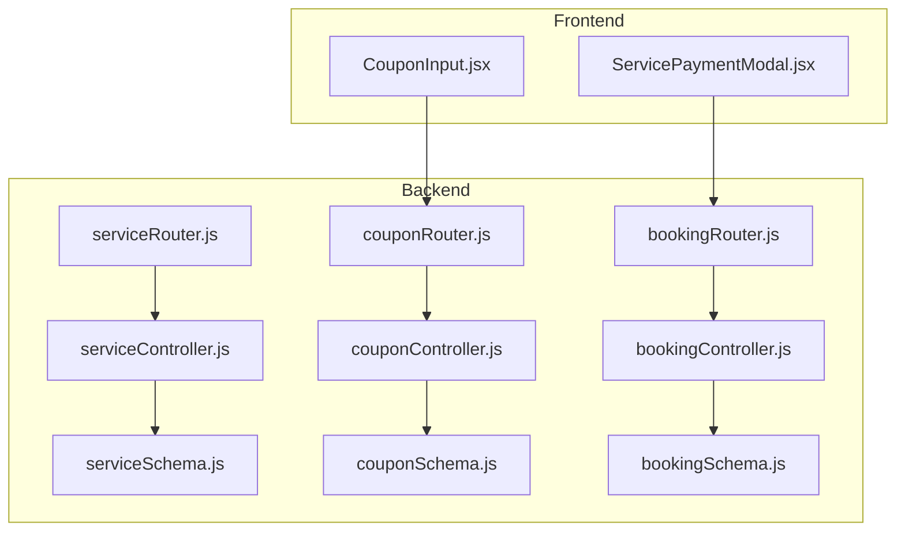
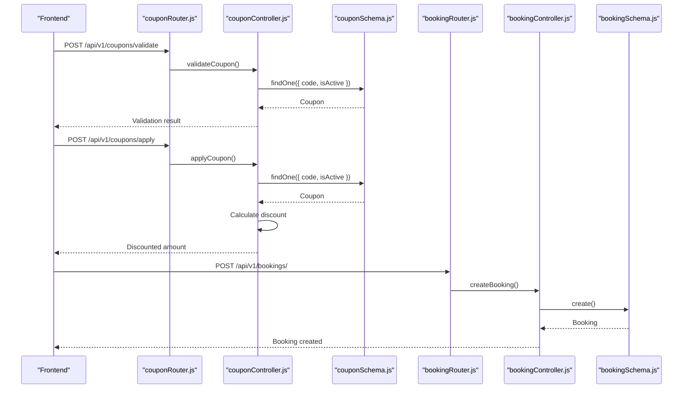
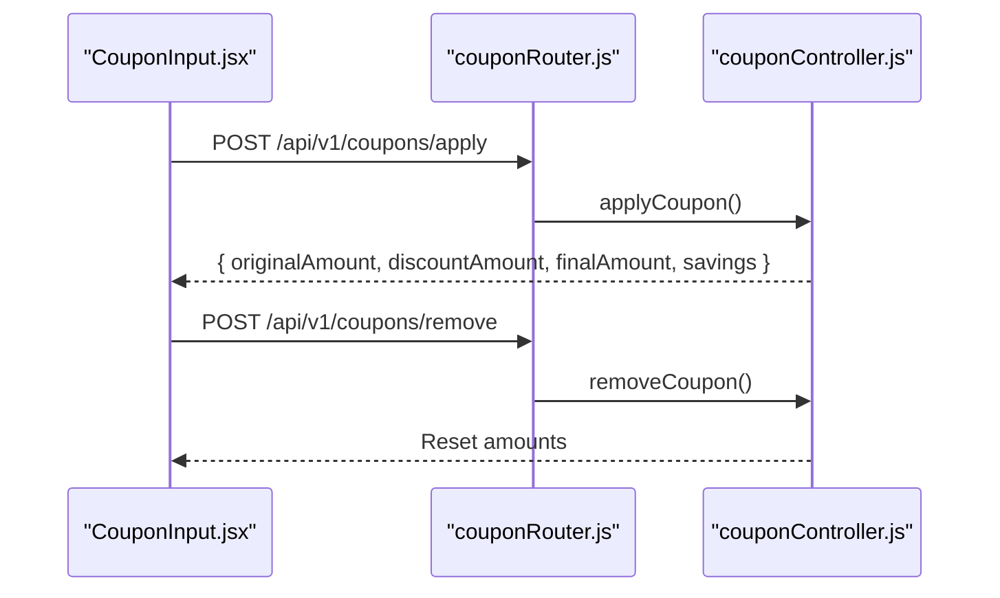
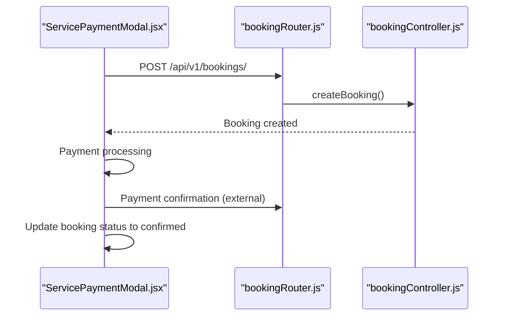
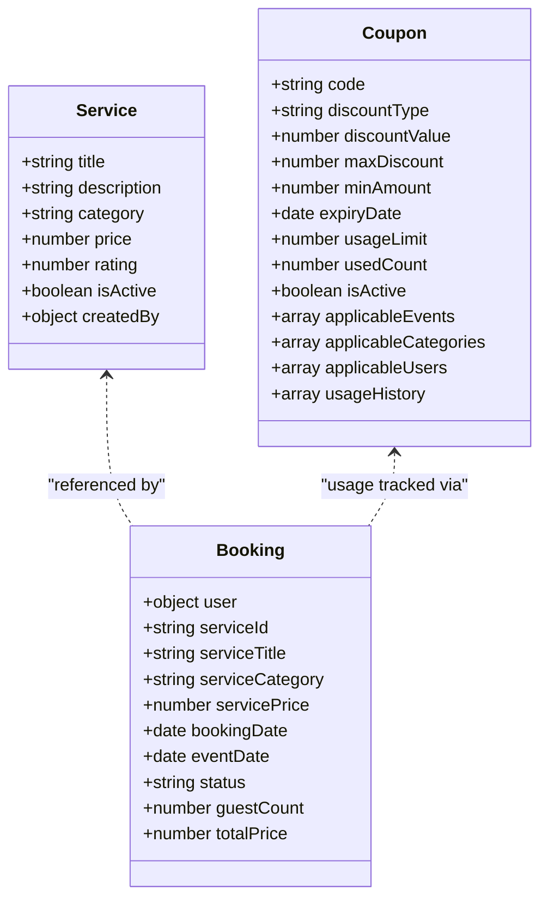

# Service and Coupon Management API

<cite>
**Referenced Files in This Document**
- [serviceRouter.js](file://backend/router/serviceRouter.js)
- [serviceController.js](file://backend/controller/serviceController.js)
- [serviceSchema.js](file://backend/models/serviceSchema.js)
- [couponRouter.js](file://backend/router/couponRouter.js)
- [couponController.js](file://backend/controller/couponController.js)
- [couponSchema.js](file://backend/models/couponSchema.js)
- [bookingRouter.js](file://backend/router/bookingRouter.js)
- [bookingController.js](file://backend/controller/bookingController.js)
- [bookingSchema.js](file://backend/models/bookingSchema.js)
- [CouponInput.jsx](file://frontend/src/components/CouponInput.jsx)
- [ServicePaymentModal.jsx](file://frontend/src/components/ServicePaymentModal.jsx)
- [test-coupon-api.js](file://backend/test-coupon-api.js)
- [create-test-coupons.js](file://backend/create-test-coupons.js)
</cite>

## Table of Contents
1. [Introduction](#introduction)
2. [Project Structure](#project-structure)
3. [Core Components](#core-components)
4. [Architecture Overview](#architecture-overview)
5. [Detailed Component Analysis](#detailed-component-analysis)
6. [Dependency Analysis](#dependency-analysis)
7. [Performance Considerations](#performance-considerations)
8. [Troubleshooting Guide](#troubleshooting-guide)
9. [Conclusion](#conclusion)
10. [Appendices](#appendices)

## Introduction
This document provides comprehensive API documentation for Service and Coupon management endpoints. It covers:
- Service category management and public browsing
- Service creation, updates, and deletion (admin-only)
- Coupon creation, validation, application, removal, and administration
- Discount calculation logic and usage tracking
- Integration with booking workflows and payment processing
- Frontend integration patterns for coupon application and service booking

The documentation includes endpoint definitions, request/response schemas, validation rules, error handling, and practical examples for end-to-end workflows.

## Project Structure
The backend follows a modular structure with routers, controllers, models, and middleware. The frontend integrates with these APIs via HTTP requests.

**Diagram sources**
- [serviceRouter.js:1-49](file://backend/router/serviceRouter.js#L1-L49)
- [serviceController.js:1-323](file://backend/controller/serviceController.js#L1-L323)
- [serviceSchema.js:1-83](file://backend/models/serviceSchema.js#L1-L83)
- [couponRouter.js:1-37](file://backend/router/couponRouter.js#L1-L37)
- [couponController.js:1-757](file://backend/controller/couponController.js#L1-L757)
- [couponSchema.js:1-123](file://backend/models/couponSchema.js#L1-L123)
- [bookingRouter.js:1-26](file://backend/router/bookingRouter.js#L1-L26)
- [bookingController.js:1-233](file://backend/controller/bookingController.js#L1-L233)
- [bookingSchema.js:1-53](file://backend/models/bookingSchema.js#L1-L53)
- [CouponInput.jsx:1-166](file://frontend/src/components/CouponInput.jsx#L1-L166)
- [ServicePaymentModal.jsx:1-246](file://frontend/src/components/ServicePaymentModal.jsx#L1-L246)

**Section sources**
- [serviceRouter.js:1-49](file://backend/router/serviceRouter.js#L1-L49)
- [couponRouter.js:1-37](file://backend/router/couponRouter.js#L1-L37)
- [bookingRouter.js:1-26](file://backend/router/bookingRouter.js#L1-L26)

## Core Components
- Service Management
  - Public endpoints for browsing services by category and retrieving individual services
  - Admin endpoints for creating, updating, deleting, and listing services
- Coupon Management
  - User endpoints for validating, applying, removing, and fetching available coupons
  - Admin endpoints for creating, updating, deleting, toggling status, and viewing statistics
- Booking Integration
  - User endpoints for creating, viewing, and canceling bookings
  - Admin endpoints for viewing and updating booking statuses

Key capabilities:
- Service categorization with predefined categories and image constraints
- Coupon types: percentage and flat discount with caps and minimum spend
- Expiration handling and usage limits
- Restriction support for events, categories, and users
- Usage tracking with history and statistics

**Section sources**
- [serviceController.js:74-145](file://backend/controller/serviceController.js#L74-L145)
- [couponController.js:5-131](file://backend/controller/couponController.js#L5-L131)
- [bookingController.js:4-70](file://backend/controller/bookingController.js#L4-L70)

## Architecture Overview
The system separates concerns across routers, controllers, and models. Middleware enforces authentication and role-based access control. Frontend components interact with the backend via HTTP requests.

**Diagram sources**
- [couponRouter.js:21-25](file://backend/router/couponRouter.js#L21-L25)
- [couponController.js:6-131](file://backend/controller/couponController.js#L6-L131)
- [couponSchema.js:1-123](file://backend/models/couponSchema.js#L1-L123)
- [bookingRouter.js:15-19](file://backend/router/bookingRouter.js#L15-L19)
- [bookingController.js:4-70](file://backend/controller/bookingController.js#L4-L70)
- [bookingSchema.js:1-53](file://backend/models/bookingSchema.js#L1-L53)

## Detailed Component Analysis

### Service Management API

#### Public Endpoints
- GET /api/v1/services
  - Query parameters: category, search, minPrice, maxPrice, sort
  - Filters: category, text search, price range, active status
  - Sorting: price_asc, price_desc, rating, newest
  - Response: Array of services with count
- GET /api/v1/services/category/:category
  - Returns active services filtered by category
- GET /api/v1/services/:id
  - Returns a single service by ID

#### Admin Endpoints
- POST /api/v1/services/admin/service
  - Uploads up to 4 images using array("images", 4)
  - Fields: title, description, category, price, rating
  - Response: Created service
- PUT /api/v1/services/admin/service/:id
  - Updates service fields and manages images
  - Supports removing images and adding new ones
  - Enforces 1–4 images constraint
- DELETE /api/v1/services/admin/service/:id
  - Deletes service and associated Cloudinary images
- GET /api/v1/services/admin/all
  - Lists all services (active and inactive) sorted by creation date

Validation and constraints:
- Category enum includes predefined values
- Price must be non-negative
- Rating constrained between 0 and 5
- Images validated to be between 1 and 4

**Section sources**
- [serviceRouter.js:17-46](file://backend/router/serviceRouter.js#L17-L46)
- [serviceController.js:5-118](file://backend/controller/serviceController.js#L5-L118)
- [serviceController.js:147-266](file://backend/controller/serviceController.js#L147-L266)
- [serviceController.js:268-322](file://backend/controller/serviceController.js#L268-L322)
- [serviceSchema.js:14-82](file://backend/models/serviceSchema.js#L14-L82)

### Coupon Management API

#### User Endpoints
- POST /api/v1/coupons/validate
  - Request: { couponCode, amount, eventId }
  - Validates coupon existence, activity, expiry, usage limit, minAmount, user restrictions, and event restrictions
  - Response: Coupon metadata if valid
- POST /api/v1/coupons/apply
  - Request: { code, totalAmount, eventId }
  - Applies coupon and calculates discount
  - Discount types:
    - Percentage: capped by maxDiscount if present
    - Flat: limited to totalAmount
  - Response: Original amount, discount amount, final amount, savings
- POST /api/v1/coupons/remove
  - Request: { totalAmount }
  - Resets coupon state without discount
  - Response: Original amount equals final amount
- GET /api/v1/coupons/available
  - Query: { eventId, totalAmount }
  - Returns active, non-expired, under-limit coupons
  - Filters out coupons already used by the requesting user

#### Admin Endpoints
- POST /api/v1/coupons/create
  - Fields: code, discountType, discountValue, maxDiscount, minAmount, expiryDate, usageLimit, description, applicableEvents, applicableCategories, applicableUsers
  - Enforces uniqueness of code, discount ranges, future expiry date
- GET /api/v1/coupons/all
  - Query: { page, limit, status, search }
  - Status filters: active, inactive, expired
  - Search by code or description
- PUT /api/v1/coupons/:couponId
  - Updates coupon; prevents changing code if already used
- DELETE /api/v1/coupons/:couponId
  - Deletes coupon if not yet used
- PATCH /api/v1/coupons/:couponId/toggle
  - Toggles coupon active/inactive status
- GET /api/v1/coupons/stats
  - Aggregates total coupons, active/expired counts, total usage, total discount given

Coupon model highlights:
- Unique uppercase code, discountType enum ("percentage", "flat")
- Optional applicableEvents, applicableCategories, applicableUsers
- Usage tracking with user, booking, timestamp, and discountAmount
- Virtuals: remainingUsage, usagePercentage

**Section sources**
- [couponRouter.js:21-33](file://backend/router/couponRouter.js#L21-L33)
- [couponController.js:5-131](file://backend/controller/couponController.js#L5-L131)
- [couponController.js:133-285](file://backend/controller/couponController.js#L133-L285)
- [couponController.js:287-308](file://backend/controller/couponController.js#L287-L308)
- [couponController.js:310-386](file://backend/controller/couponController.js#L310-L386)
- [couponController.js:388-505](file://backend/controller/couponController.js#L388-L505)
- [couponController.js:507-565](file://backend/controller/couponController.js#L507-L565)
- [couponController.js:567-614](file://backend/controller/couponController.js#L567-L614)
- [couponController.js:616-656](file://backend/controller/couponController.js#L616-L656)
- [couponController.js:658-692](file://backend/controller/couponController.js#L658-L692)
- [couponController.js:694-757](file://backend/controller/couponController.js#L694-L757)
- [couponSchema.js:3-98](file://backend/models/couponSchema.js#L3-L98)

### Booking Integration API

#### User Endpoints
- POST /api/v1/bookings/
  - Creates a booking with service details, event date, notes, guest count
  - Prevents duplicate pending/conflict bookings for the same service
  - Calculates totalPrice based on guestCount
- GET /api/v1/bookings/my-bookings
  - Retrieves user's bookings ordered by recency
- GET /api/v1/bookings/:id
  - Retrieves a specific booking by ID
- PUT /api/v1/bookings/:id/cancel
  - Cancels a booking with validation against status constraints

#### Admin Endpoints
- GET /api/v1/bookings/admin/all
  - Retrieves all bookings with user populated
- PUT /api/v1/bookings/admin/:id/status
  - Updates booking status with validation

Booking model highlights:
- Status enum: pending, confirmed, cancelled, completed
- Links to service details at time of booking
- Stores bookingDate, eventDate, notes, guestCount, totalPrice

Integration note:
- Coupon application occurs before initiating payment; the final amount reflects discounts
- Payment modal handles service payment confirmation and updates booking status accordingly

**Section sources**
- [bookingRouter.js:15-23](file://backend/router/bookingRouter.js#L15-L23)
- [bookingController.js:4-70](file://backend/controller/bookingController.js#L4-L70)
- [bookingController.js:72-122](file://backend/controller/bookingController.js#L72-L122)
- [bookingController.js:124-171](file://backend/controller/bookingController.js#L124-L171)
- [bookingController.js:173-232](file://backend/controller/bookingController.js#L173-L232)
- [bookingSchema.js:3-50](file://backend/models/bookingSchema.js#L3-L50)

### Frontend Integration Patterns

#### Coupon Application Component
- Component: CouponInput.jsx
- Behavior:
  - Applies coupon via POST /api/v1/coupons/apply
  - Removes coupon via POST /api/v1/coupons/remove
  - Displays original amount, discount, final amount, and savings
  - Integrates with auth token for protected endpoints

**Diagram sources**
- [CouponInput.jsx:19-82](file://frontend/src/components/CouponInput.jsx#L19-L82)
- [couponRouter.js:21-25](file://backend/router/couponRouter.js#L21-L25)
- [couponController.js:133-308](file://backend/controller/couponController.js#L133-L308)

**Section sources**
- [CouponInput.jsx:1-166](file://frontend/src/components/CouponInput.jsx#L1-L166)

#### Service Payment Modal
- Component: ServicePaymentModal.jsx
- Behavior:
  - Presents payment method selection
  - Calls service payment endpoint upon confirmation
  - Updates booking status and payment metadata on success

**Diagram sources**
- [ServicePaymentModal.jsx:21-68](file://frontend/src/components/ServicePaymentModal.jsx#L21-L68)
- [bookingRouter.js:15-19](file://backend/router/bookingRouter.js#L15-L19)
- [bookingController.js:4-70](file://backend/controller/bookingController.js#L4-L70)

**Section sources**
- [ServicePaymentModal.jsx:1-246](file://frontend/src/components/ServicePaymentModal.jsx#L1-L246)

## Dependency Analysis

**Diagram sources**
- [serviceSchema.js:14-82](file://backend/models/serviceSchema.js#L14-L82)
- [couponSchema.js:3-98](file://backend/models/couponSchema.js#L3-L98)
- [bookingSchema.js:3-50](file://backend/models/bookingSchema.js#L3-L50)

**Section sources**
- [serviceSchema.js:1-83](file://backend/models/serviceSchema.js#L1-L83)
- [couponSchema.js:1-123](file://backend/models/couponSchema.js#L1-L123)
- [bookingSchema.js:1-53](file://backend/models/bookingSchema.js#L1-L53)

## Performance Considerations
- Service search uses text indexes on title, description, and category for efficient filtering.
- Coupon queries leverage indexes on code, isActive/expiryDate, and createdBy for fast retrieval and filtering.
- Image management ensures Cloudinary uploads are validated before persisting service records.
- Coupon usage history aggregation provides administrative insights without impacting real-time performance.

[No sources needed since this section provides general guidance]

## Troubleshooting Guide
Common issues and resolutions:
- Service creation fails due to missing images or Cloudinary upload errors
  - Ensure at least one image is uploaded and Cloudinary configuration is valid
- Update service removes images unexpectedly
  - Provide existingImages as JSON array of kept images to preserve them
- Coupon validation errors
  - Verify coupon is active, not expired, within usage limits, meets minimum amount, and matches applicable events/users
- Coupon application exceeds total amount
  - Flat discount is capped at total amount; percentage discount respects maxDiscount if configured
- Duplicate booking conflicts
  - Prevented by checking pending/conflict bookings for the same service per user

**Section sources**
- [serviceController.js:30-38](file://backend/controller/serviceController.js#L30-L38)
- [serviceController.js:180-218](file://backend/controller/serviceController.js#L180-L218)
- [couponController.js:44-58](file://backend/controller/couponController.js#L44-L58)
- [couponController.js:236-257](file://backend/controller/couponController.js#L236-L257)
- [bookingController.js:26-38](file://backend/controller/bookingController.js#L26-L38)

## Conclusion
The Service and Coupon Management APIs provide a robust foundation for managing service offerings, applying promotional discounts, and integrating with booking workflows. The system enforces strong validation, supports flexible coupon configurations, and maintains detailed usage tracking for administrative oversight. Frontend components enable seamless coupon application and secure payment processing, ensuring a smooth user experience.

[No sources needed since this section summarizes without analyzing specific files]

## Appendices

### Endpoint Reference

- Service Management
  - GET /api/v1/services
  - GET /api/v1/services/category/:category
  - GET /api/v1/services/:id
  - POST /api/v1/services/admin/service
  - PUT /api/v1/services/admin/service/:id
  - DELETE /api/v1/services/admin/service/:id
  - GET /api/v1/services/admin/all

- Coupon Management
  - POST /api/v1/coupons/validate
  - POST /api/v1/coupons/apply
  - POST /api/v1/coupons/remove
  - GET /api/v1/coupons/available
  - POST /api/v1/coupons/create
  - GET /api/v1/coupons/all
  - PUT /api/v1/coupons/:couponId
  - DELETE /api/v1/coupons/:couponId
  - PATCH /api/v1/coupons/:couponId/toggle
  - GET /api/v1/coupons/stats

- Booking Management
  - POST /api/v1/bookings/
  - GET /api/v1/bookings/my-bookings
  - GET /api/v1/bookings/:id
  - PUT /api/v1/bookings/:id/cancel
  - GET /api/v1/bookings/admin/all
  - PUT /api/v1/bookings/admin/:id/status

### Example Workflows

- Service Booking Workflow
  1. Browse services: GET /api/v1/services
  2. Select service and create booking: POST /api/v1/bookings/
  3. Apply coupon: POST /api/v1/coupons/apply
  4. Confirm payment and finalize booking

- Coupon Creation and Administration
  1. Create coupon: POST /api/v1/coupons/create
  2. Monitor usage: GET /api/v1/coupons/stats
  3. Toggle status: PATCH /api/v1/coupons/:couponId/toggle
  4. Remove coupon: DELETE /api/v1/coupons/:couponId (only if unused)

**Section sources**
- [test-coupon-api.js:14-68](file://backend/test-coupon-api.js#L14-L68)
- [create-test-coupons.js:8-87](file://backend/create-test-coupons.js#L8-L87)