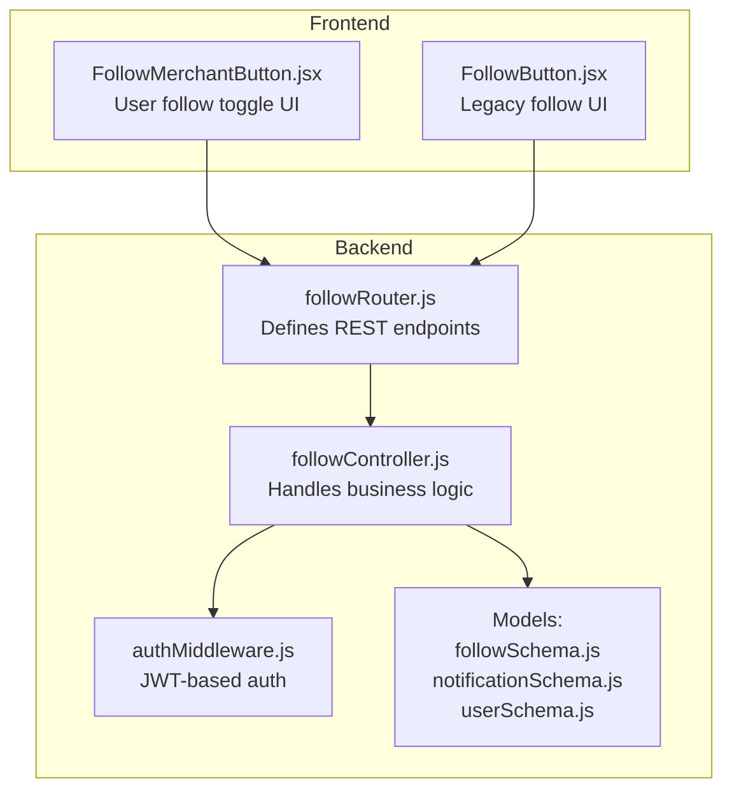
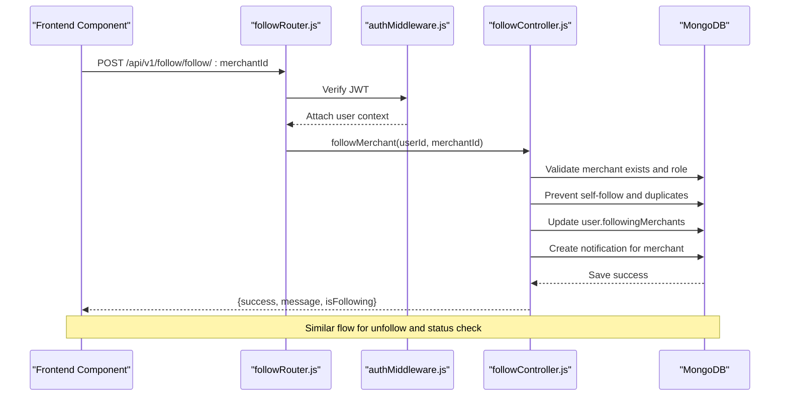
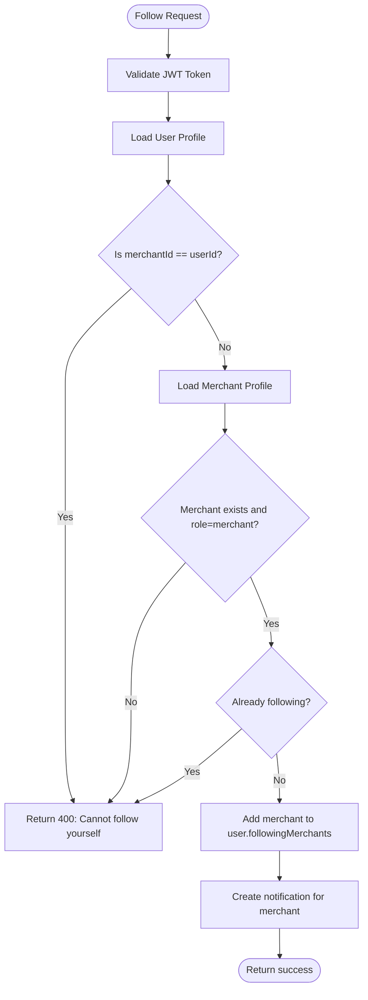
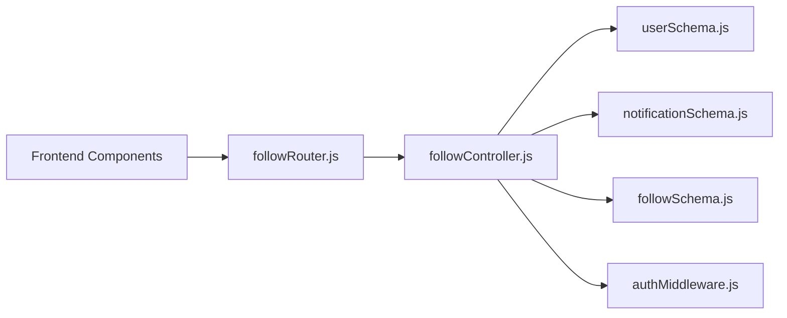

# Follow System API

<cite>
**Referenced Files in This Document**
- [followController.js](file://backend/controller/followController.js)
- [followRouter.js](file://backend/router/followRouter.js)
- [authMiddleware.js](file://backend/middleware/authMiddleware.js)
- [followSchema.js](file://backend/models/followSchema.js)
- [notificationSchema.js](file://backend/models/notificationSchema.js)
- [userSchema.js](file://backend/models/userSchema.js)
- [FollowMerchantButton.jsx](file://frontend/src/components/FollowMerchantButton.jsx)
- [FollowButton.jsx](file://frontend/src/components/FollowButton.jsx)
- [app.js](file://backend/app.js)
</cite>

## Table of Contents
1. [Introduction](#introduction)
2. [Project Structure](#project-structure)
3. [Core Components](#core-components)
4. [Architecture Overview](#architecture-overview)
5. [Detailed Component Analysis](#detailed-component-analysis)
6. [Dependency Analysis](#dependency-analysis)
7. [Performance Considerations](#performance-considerations)
8. [Troubleshooting Guide](#troubleshooting-guide)
9. [Conclusion](#conclusion)

## Introduction
This document provides comprehensive API documentation for the Follow System endpoints. It covers merchant following functionality, permission validation, duplicate prevention, unfollow confirmation, notifications, and integration points with user profiles and merchant visibility. It also outlines the current available endpoints and highlights missing features that are referenced in tests but not yet implemented.

## Project Structure
The Follow System is implemented as a dedicated module within the backend with clear separation of concerns:
- Router defines the REST endpoints under `/api/v1/follow`
- Controller handles business logic for follow/unfollow, status checks, and list retrieval
- Middleware enforces authentication and authorization
- Models define the follow relationship and notifications
- Frontend components integrate with the API to provide user-facing follow buttons

**Diagram sources**
- [followRouter.js:1-26](file://backend/router/followRouter.js#L1-L26)
- [followController.js:1-234](file://backend/controller/followController.js#L1-L234)
- [authMiddleware.js:1-17](file://backend/middleware/authMiddleware.js#L1-L17)
- [followSchema.js:1-22](file://backend/models/followSchema.js#L1-L22)
- [notificationSchema.js:1-36](file://backend/models/notificationSchema.js#L1-L36)
- [userSchema.js:1-55](file://backend/models/userSchema.js#L1-L55)
- [FollowMerchantButton.jsx:1-117](file://frontend/src/components/FollowMerchantButton.jsx#L1-L117)
- [FollowButton.jsx:1-121](file://frontend/src/components/FollowButton.jsx#L1-L121)

**Section sources**
- [followRouter.js:1-26](file://backend/router/followRouter.js#L1-L26)
- [followController.js:1-234](file://backend/controller/followController.js#L1-L234)
- [authMiddleware.js:1-17](file://backend/middleware/authMiddleware.js#L1-L17)
- [followSchema.js:1-22](file://backend/models/followSchema.js#L1-L22)
- [notificationSchema.js:1-36](file://backend/models/notificationSchema.js#L1-L36)
- [userSchema.js:1-55](file://backend/models/userSchema.js#L1-L55)
- [FollowMerchantButton.jsx:1-117](file://frontend/src/components/FollowMerchantButton.jsx#L1-L117)
- [FollowButton.jsx:1-121](file://frontend/src/components/FollowButton.jsx#L1-L121)

## Core Components
- Router: Exposes REST endpoints for follow/unfollow, status checks, and list retrieval under `/api/v1/follow`
- Controller: Implements merchant follow logic, duplicate prevention, unfollow confirmation, and follower retrieval
- Middleware: Validates JWT tokens and attaches user context to requests
- Models: Define the follow relationship and notification schema
- Frontend Components: Provide user-facing follow/unfollow interactions

Key capabilities:
- Follow a merchant by ID
- Unfollow a merchant by ID
- Check follow status for a merchant
- Retrieve user's following merchants
- Retrieve merchant's followers

**Section sources**
- [followRouter.js:13-24](file://backend/router/followRouter.js#L13-L24)
- [followController.js:4-234](file://backend/controller/followController.js#L4-L234)
- [authMiddleware.js:3-16](file://backend/middleware/authMiddleware.js#L3-L16)

## Architecture Overview
The Follow System follows a layered architecture:
- Presentation Layer: Frontend components send authenticated requests
- Routing Layer: Express router maps URLs to controller actions
- Business Logic Layer: Controller validates permissions, prevents duplicates, and manages state
- Persistence Layer: MongoDB stores follow relationships and notifications

**Diagram sources**
- [followRouter.js:14-18](file://backend/router/followRouter.js#L14-L18)
- [authMiddleware.js:3-16](file://backend/middleware/authMiddleware.js#L3-L16)
- [followController.js:4-86](file://backend/controller/followController.js#L4-L86)
- [notificationSchema.js:3-33](file://backend/models/notificationSchema.js#L3-L33)

## Detailed Component Analysis

### Endpoint Definitions
All endpoints are protected by the authentication middleware and operate on the authenticated user context.

- POST /api/v1/follow/follow/:merchantId
  - Purpose: Follow a merchant
  - Authentication: Required (Bearer token)
  - Request body: None
  - Response: { success, message, isFollowing }
  - Behavior: Validates merchant existence and role, prevents self-follow and duplicates, updates user following list, creates notification for merchant

- DELETE /api/v1/follow/unfollow/:merchantId
  - Purpose: Unfollow a merchant
  - Authentication: Required (Bearer token)
  - Request body: None
  - Response: { success, message, isFollowing }
  - Behavior: Confirms user is following, removes merchant from following list

- GET /api/v1/follow/status/:merchantId
  - Purpose: Check follow status
  - Authentication: Required (Bearer token)
  - Response: { success, isFollowing }
  - Behavior: Returns current follow status for the merchant

- GET /api/v1/follow/following
  - Purpose: Get user's following merchants
  - Authentication: Required (Bearer token)
  - Response: { success, followingMerchants }
  - Behavior: Returns populated merchant details (name, email, businessName, serviceType)

- GET /api/v1/follow/followers
  - Purpose: Get merchant's followers
  - Authentication: Required (Bearer token)
  - Response: { success, followers, followerCount }
  - Behavior: Returns follower list with basic profile info

**Section sources**
- [followRouter.js:14-24](file://backend/router/followRouter.js#L14-L24)
- [followController.js:4-234](file://backend/controller/followController.js#L4-L234)

### Permission Validation and Duplicate Prevention
- Authentication: All endpoints require a valid JWT token in the Authorization header
- Role Validation: Follow actions are restricted to authenticated users; merchant verification ensures the target is a merchant
- Duplicate Prevention: Checks user.followingMerchants array before adding
- Self-Follow Prevention: Explicitly blocks a user from following themselves
- Unfollow Confirmation: Verifies current follow status before removal

**Diagram sources**
- [authMiddleware.js:3-16](file://backend/middleware/authMiddleware.js#L3-L16)
- [followController.js:14-58](file://backend/controller/followController.js#L14-L58)
- [notificationSchema.js:3-33](file://backend/models/notificationSchema.js#L3-L33)

**Section sources**
- [authMiddleware.js:3-16](file://backend/middleware/authMiddleware.js#L3-L16)
- [followController.js:14-58](file://backend/controller/followController.js#L14-L58)

### Notification Triggers
- When a user follows a merchant, a notification is created for the merchant with type "follow"
- Notification includes the follower's name and a descriptive message
- Notifications are stored in the Notification collection with read=false by default

**Section sources**
- [followController.js:60-69](file://backend/controller/followController.js#L60-L69)
- [notificationSchema.js:3-33](file://backend/models/notificationSchema.js#L3-L33)

### Social Graph Operations
- Follow relationship is stored in the User model via the followingMerchants array
- Merchant followers are retrieved by querying users whose followingMerchants contains the merchantId
- The system supports merchant-to-follower relationships but does not implement user-to-user following

**Section sources**
- [followController.js:174-234](file://backend/controller/followController.js#L174-L234)
- [userSchema.js:39-55](file://backend/models/userSchema.js#L39-L55)

### Frontend Integration
- FollowMerchantButton.jsx: Modern component that handles follow/unfollow toggling, status checks, and role validation
- FollowButton.jsx: Legacy component with simplified follow logic
- Both components use authHeaders(token) and API_BASE for authenticated requests

**Section sources**
- [FollowMerchantButton.jsx:1-117](file://frontend/src/components/FollowMerchantButton.jsx#L1-L117)
- [FollowButton.jsx:1-121](file://frontend/src/components/FollowButton.jsx#L1-L121)

### Missing Features (Referenced in Tests)
The comprehensive test suite references additional endpoints that are not currently implemented:
- GET /api/v1/follow/merchant/stats: Returns merchant statistics including follower count, average rating, total ratings, and total events
- GET /api/v1/follow/my-following: Returns the authenticated user's following list with merchant details

These endpoints are expected to support merchant analytics and user dashboard features but are not present in the current implementation.

**Section sources**
- [test-rating-review-follow-system.js:160-174](file://backend/test-rating-review-follow-system.js#L160-L174)
- [final-comprehensive-test.js:167-197](file://backend/final-comprehensive-test.js#L167-L197)

## Dependency Analysis
The Follow System has clear dependencies and low coupling:
- Router depends on controller functions
- Controller depends on User and Notification models
- Frontend components depend on the router endpoints
- No circular dependencies detected

**Diagram sources**
- [followRouter.js:1-26](file://backend/router/followRouter.js#L1-L26)
- [followController.js:1-234](file://backend/controller/followController.js#L1-L234)
- [userSchema.js:1-55](file://backend/models/userSchema.js#L1-L55)
- [notificationSchema.js:1-36](file://backend/models/notificationSchema.js#L1-L36)
- [followSchema.js:1-22](file://backend/models/followSchema.js#L1-L22)
- [authMiddleware.js:1-17](file://backend/middleware/authMiddleware.js#L1-L17)

**Section sources**
- [followRouter.js:1-26](file://backend/router/followRouter.js#L1-L26)
- [followController.js:1-234](file://backend/controller/followController.js#L1-L234)

## Performance Considerations
- Indexing: The Follow model includes a unique compound index on user and merchant fields to prevent duplicates efficiently
- Population: Following lists are populated with merchant details; consider pagination for large follow graphs
- Query Patterns: Follower queries use simple array containment; consider adding a reverse index if follower counts grow very large
- Notification Creation: Notification creation is attempted but failures are logged; consider retry mechanisms for critical notifications

## Troubleshooting Guide
Common issues and resolutions:
- Unauthorized Access: Ensure Authorization header contains a valid Bearer token
- Merchant Not Found: Verify merchantId exists and role is "merchant"
- Already Following: Check follow status before attempting to follow again
- Not Following: Attempting to unfollow when not following returns an error
- Self-Follow Blocked: Users cannot follow themselves
- Notification Failures: Follow notifications are logged but do not block the follow operation

**Section sources**
- [authMiddleware.js:7-15](file://backend/middleware/authMiddleware.js#L7-L15)
- [followController.js:14-58](file://backend/controller/followController.js#L14-L58)
- [followController.js:88-137](file://backend/controller/followController.js#L88-L137)

## Conclusion
The Follow System provides a robust foundation for merchant following with proper authentication, duplicate prevention, and notification integration. While the core functionality is complete, additional endpoints for merchant statistics and user following lists are referenced in tests and would enhance the system's analytical and social features. The current implementation supports essential social graph operations and integrates cleanly with the existing user and notification systems.