# Rating System API

<cite>
**Referenced Files in This Document**
- [ratingController.js](file://backend/controller/ratingController.js)
- [ratingRouter.js](file://backend/router/ratingRouter.js)
- [ratingSchema.js](file://backend/models/ratingSchema.js)
- [eventSchema.js](file://backend/models/eventSchema.js)
- [authMiddleware.js](file://backend/middleware/authMiddleware.js)
- [roleMiddleware.js](file://backend/middleware/roleMiddleware.js)
- [RatingModal.jsx](file://frontend/src/components/RatingModal.jsx)
- [StarRating.jsx](file://frontend/src/components/StarRating.jsx)
- [UserEventDetails.jsx](file://frontend/src/pages/dashboards/UserEventDetails.jsx)
- [RATING_REVIEW_FOLLOW_IMPLEMENTATION_SUMMARY.md](file://backend/RATING_REVIEW_FOLLOW_IMPLEMENTATION_SUMMARY.md)
</cite>

## Table of Contents
1. [Introduction](#introduction)
2. [Project Structure](#project-structure)
3. [Core Components](#core-components)
4. [Architecture Overview](#architecture-overview)
5. [Detailed Component Analysis](#detailed-component-analysis)
6. [API Endpoints](#api-endpoints)
7. [Rating Calculation Algorithms](#rating-calculation-algorithms)
8. [Permission and Security](#permission-and-security)
9. [Duplicate Prevention](#duplicate-prevention)
10. [Rating Modification and Deletion](#rating-modification-and-deletion)
11. [Integration with User Profiles](#integration-with-user-profiles)
12. [Rating Distribution Analytics](#rating-distribution-analytics)
13. [Error Handling](#error-handling)
14. [Troubleshooting Guide](#troubleshooting-guide)
15. [Conclusion](#conclusion)

## Introduction

The Rating System API provides a comprehensive framework for users to rate events they've attended, enabling social proof and improved event discovery. This system integrates seamlessly with the booking and user management components to create a complete rating ecosystem.

The system supports both individual event ratings and user-specific rating histories, with automatic aggregation and analytics capabilities. It ensures data integrity through duplicate prevention mechanisms and provides robust validation for all rating submissions.

## Project Structure

The Rating System is organized across multiple layers within the backend architecture:

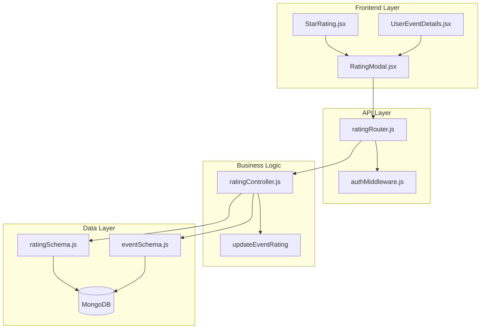

**Diagram sources**
- [ratingRouter.js:1-16](file://backend/router/ratingRouter.js#L1-L16)
- [ratingController.js:1-161](file://backend/controller/ratingController.js#L1-L161)
- [ratingSchema.js:1-28](file://backend/models/ratingSchema.js#L1-L28)
- [eventSchema.js:1-51](file://backend/models/eventSchema.js#L1-L51)

**Section sources**
- [ratingRouter.js:1-16](file://backend/router/ratingRouter.js#L1-L16)
- [ratingController.js:1-161](file://backend/controller/ratingController.js#L1-L161)

## Core Components

### Rating Controller
The rating controller manages all rating-related operations including creation, retrieval, and aggregation. It implements comprehensive validation and business logic for rating submissions.

### Rating Router
Defines the REST API endpoints for rating operations with appropriate middleware for authentication and authorization.

### Rating Schema
Enforces data integrity through MongoDB schema validation and unique indexing to prevent duplicate ratings.

### Event Schema
Contains the event model with rating aggregation fields for storing average ratings and total rating counts.

**Section sources**
- [ratingController.js:1-161](file://backend/controller/ratingController.js#L1-L161)
- [ratingRouter.js:1-16](file://backend/router/ratingRouter.js#L1-L16)
- [ratingSchema.js:1-28](file://backend/models/ratingSchema.js#L1-L28)
- [eventSchema.js:1-51](file://backend/models/eventSchema.js#L1-L51)

## Architecture Overview

The Rating System follows a layered architecture pattern with clear separation of concerns:

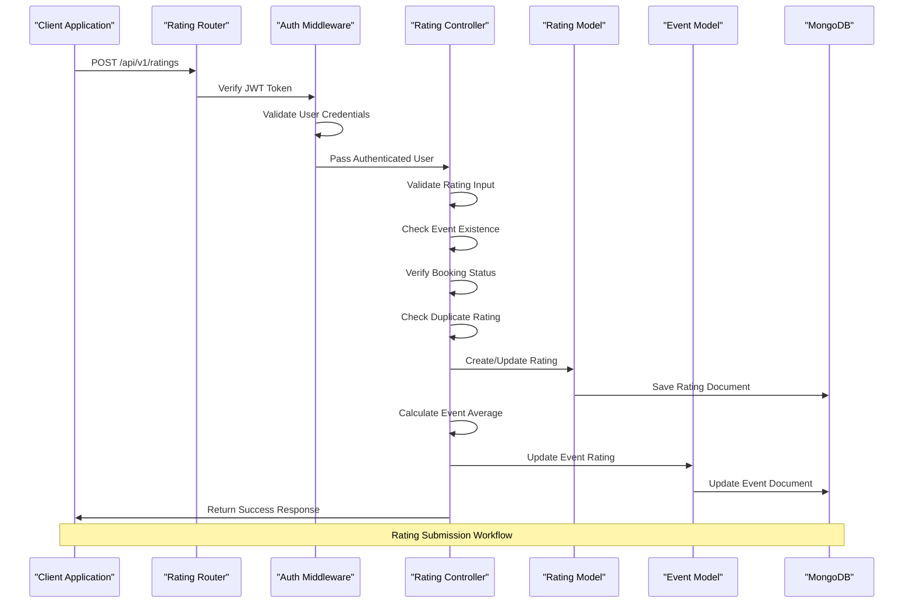

**Diagram sources**
- [ratingRouter.js:11-14](file://backend/router/ratingRouter.js#L11-L14)
- [authMiddleware.js:3-16](file://backend/middleware/authMiddleware.js#L3-L16)
- [ratingController.js:6-89](file://backend/controller/ratingController.js#L6-L89)

## Detailed Component Analysis

### Rating Controller Implementation

The rating controller implements four primary functions:

#### Create Rating Endpoint
Handles rating creation and updates with comprehensive validation:

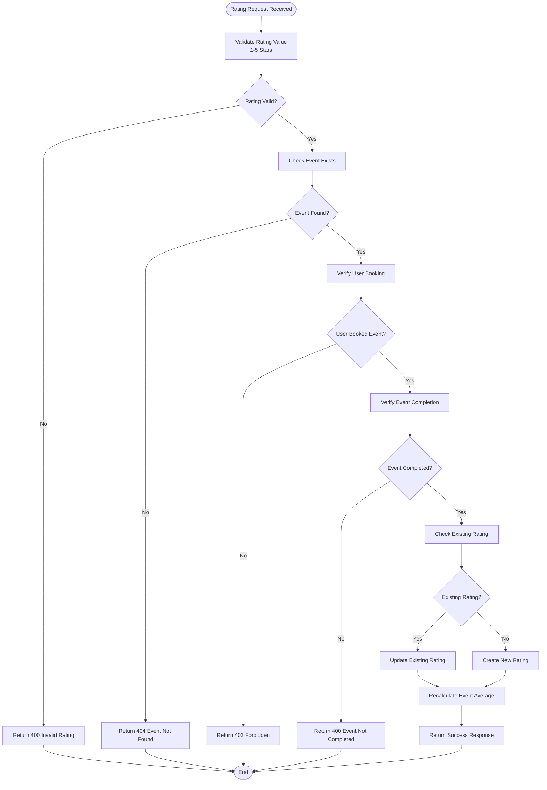

**Diagram sources**
- [ratingController.js:6-89](file://backend/controller/ratingController.js#L6-L89)

#### Get Event Ratings
Retrieves all ratings for a specific event with user information:

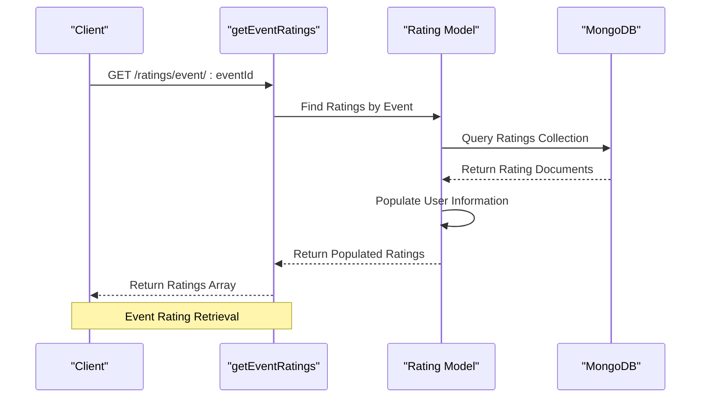

**Diagram sources**
- [ratingController.js:91-112](file://backend/controller/ratingController.js#L91-L112)

#### Get User Ratings
Fetches all ratings submitted by a specific user:

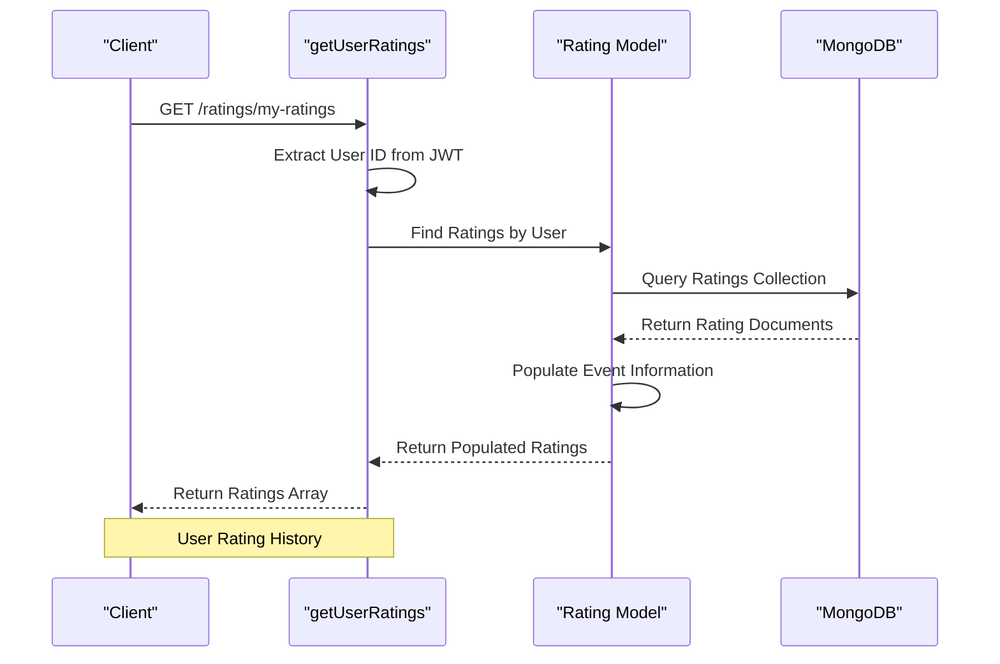

**Diagram sources**
- [ratingController.js:114-135](file://backend/controller/ratingController.js#L114-L135)

**Section sources**
- [ratingController.js:1-161](file://backend/controller/ratingController.js#L1-L161)

### Rating Schema Analysis

The rating schema enforces strict data integrity through:

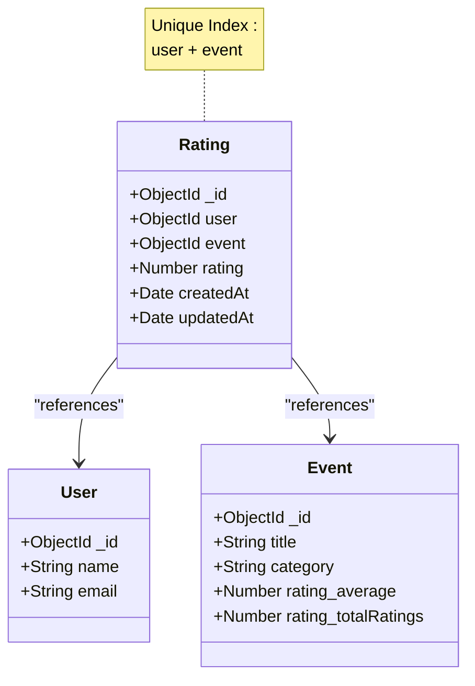

**Diagram sources**
- [ratingSchema.js:3-27](file://backend/models/ratingSchema.js#L3-L27)
- [ratingSchema.js:25-26](file://backend/models/ratingSchema.js#L25-L26)

**Section sources**
- [ratingSchema.js:1-28](file://backend/models/ratingSchema.js#L1-L28)

### Event Schema Analysis

The event schema requires modification to support the rating system:

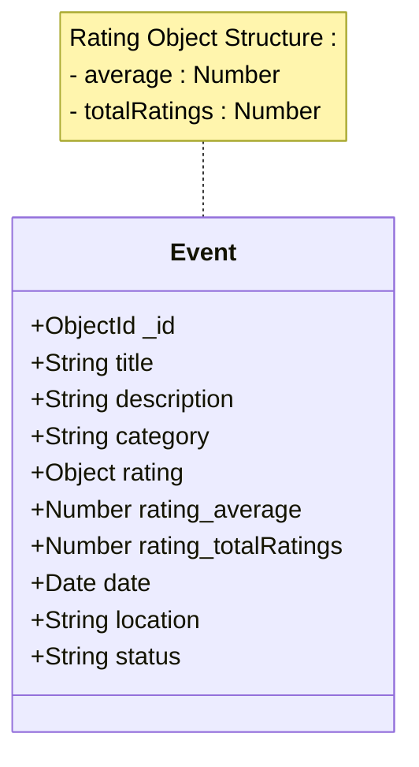

**Diagram sources**
- [eventSchema.js:3-48](file://backend/models/eventSchema.js#L3-L48)

**Section sources**
- [eventSchema.js:1-51](file://backend/models/eventSchema.js#L1-L51)

## API Endpoints

### Base URL
`/api/v1/ratings`

### Authentication Required
All rating endpoints require authentication except the event ratings retrieval endpoint.

### Endpoint Definitions

#### POST / (Create Rating)
**Description**: Submits a rating for an event a user has attended

**Authentication**: Required (JWT Bearer Token)

**Request Body**:
```javascript
{
  "eventId": "ObjectId",    // Required - Event identifier
  "rating": Number          // Required - Rating value (1-5)
}
```

**Response**:
- **201 Created**: New rating created successfully
- **200 OK**: Rating updated successfully  
- **400 Bad Request**: Invalid rating value or event not completed
- **401 Unauthorized**: Authentication required
- **403 Forbidden**: User hasn't booked the event
- **404 Not Found**: Event doesn't exist

#### GET /event/:eventId (Get Event Ratings)
**Description**: Retrieves all ratings for a specific event

**Authentication**: Not Required

**URL Parameters**:
- `eventId`: ObjectId of the target event

**Response**:
- **200 OK**: Array of ratings with user information
- **500 Internal Server Error**: Database query failed

#### GET /my-ratings (Get User Ratings)
**Description**: Retrieves all ratings submitted by the authenticated user

**Authentication**: Required

**Response**:
- **200 OK**: Array of ratings with event information
- **500 Internal Server Error**: Database query failed

**Section sources**
- [ratingRouter.js:11-14](file://backend/router/ratingRouter.js#L11-L14)

## Rating Calculation Algorithms

### Event Average Rating Calculation

The system calculates event averages using a weighted approach:

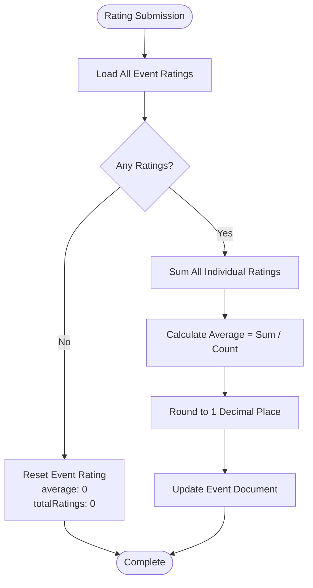

**Diagram sources**
- [ratingController.js:137-161](file://backend/controller/ratingController.js#L137-L161)

### Rating Validation Rules

The system implements strict validation for rating submissions:

| Validation Rule | Description | Error Response |
|----------------|-------------|----------------|
| Rating Range | Must be between 1 and 5 | 400 Bad Request |
| Event Existence | Event must exist in database | 404 Not Found |
| Booking Verification | User must have confirmed/completed booking | 403 Forbidden |
| Event Completion | Event date must be in past | 400 Bad Request |
| Duplicate Prevention | User can only rate an event once | Automatic Update |

**Section sources**
- [ratingController.js:11-50](file://backend/controller/ratingController.js#L11-L50)

## Permission and Security

### Authentication Requirements

All rating operations require JWT authentication:

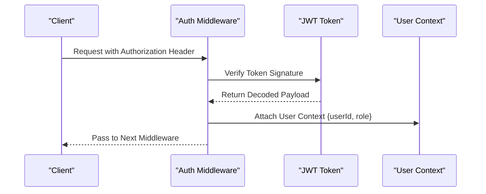

**Diagram sources**
- [authMiddleware.js:3-16](file://backend/middleware/authMiddleware.js#L3-L16)

### Authorization Policies

The system implements role-based access control:

- **Standard Users**: Can submit ratings for events they've attended
- **Merchant Users**: Cannot submit ratings (business logic prevents this)
- **Admin Users**: Have full access to all rating operations

**Section sources**
- [authMiddleware.js:1-17](file://backend/middleware/authMiddleware.js#L1-L17)

## Duplicate Prevention

### Database-Level Prevention

The rating schema enforces uniqueness through MongoDB indexes:

```javascript
// Unique compound index prevents duplicate ratings
ratingSchema.index({ user: 1, event: 1 }, { unique: true });
```

### Runtime Prevention

The controller implements additional checks:

1. **Pre-submission Check**: Verifies if a rating already exists
2. **Automatic Update**: Updates existing ratings instead of creating duplicates
3. **Consistency**: Ensures data integrity across concurrent requests

**Section sources**
- [ratingSchema.js:25-26](file://backend/models/ratingSchema.js#L25-L26)
- [ratingController.js:52-71](file://backend/controller/ratingController.js#L52-L71)

## Rating Modification and Deletion

### Rating Modification Policy

The system supports rating updates but not deletions:

**Modification Capabilities**:
- Users can update their existing ratings
- Updates replace previous rating values
- Event averages are recalculated automatically

**Deletion Policy**:
- Ratings cannot be deleted once submitted
- This prevents gaming of the rating system
- Maintains historical integrity

**Section sources**
- [ratingController.js:58-71](file://backend/controller/ratingController.js#L58-L71)

## Integration with User Profiles

### Frontend Integration Components

The rating system integrates with multiple frontend components:

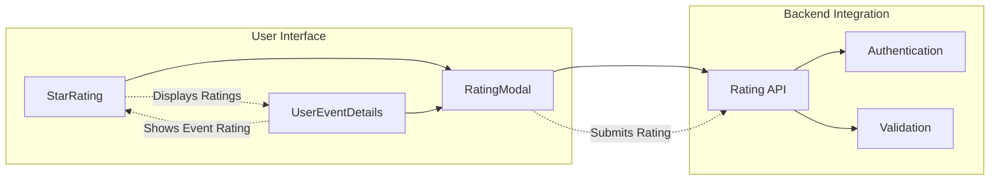

**Diagram sources**
- [RatingModal.jsx:1-125](file://frontend/src/components/RatingModal.jsx#L1-L125)
- [StarRating.jsx:1-102](file://frontend/src/components/StarRating.jsx#L1-L102)
- [UserEventDetails.jsx:222-231](file://frontend/src/pages/dashboards/UserEventDetails.jsx#L222-L231)

### User Experience Flow

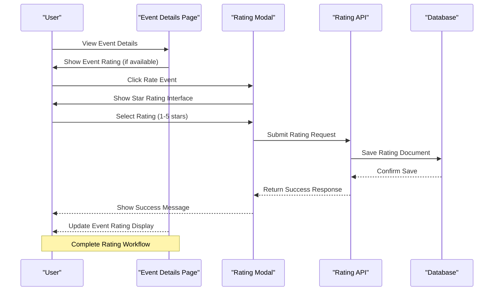

**Diagram sources**
- [RatingModal.jsx:14-47](file://frontend/src/components/RatingModal.jsx#L14-L47)
- [UserEventDetails.jsx:222-231](file://frontend/src/pages/dashboards/UserEventDetails.jsx#L222-L231)

**Section sources**
- [RatingModal.jsx:1-125](file://frontend/src/components/RatingModal.jsx#L1-L125)
- [StarRating.jsx:1-102](file://frontend/src/components/StarRating.jsx#L1-L102)
- [UserEventDetails.jsx:222-231](file://frontend/src/pages/dashboards/UserEventDetails.jsx#L222-L231)

## Rating Distribution Analytics

### Current Limitations

The current implementation focuses on basic rating aggregation and does not provide detailed distribution analytics. The system maintains:

- **Average Rating**: Rounded to 1 decimal place
- **Total Ratings**: Count of all ratings for an event
- **Individual Ratings**: Per-user rating records

### Future Enhancement Opportunities

Potential analytics features could include:

- **Rating Distribution Charts**: 1-star to 5-star breakdown
- **Trend Analysis**: Rating changes over time
- **Category Comparison**: Average ratings by event categories
- **User Engagement Metrics**: Ratings per user vs. attendance ratio

**Section sources**
- [ratingController.js:137-161](file://backend/controller/ratingController.js#L137-L161)

## Error Handling

### Comprehensive Error Responses

The system provides detailed error handling across all rating operations:

| Error Type | HTTP Status | Error Message | Cause |
|------------|-------------|---------------|--------|
| Authentication | 401 | "Unauthorized" | Missing/invalid JWT token |
| Authorization | 403 | "You can only rate events you have booked" | Non-booking user attempting to rate |
| Validation | 400 | "Rating must be between 1 and 5 stars" | Invalid rating value |
| Validation | 400 | "You can only rate events after they are completed" | Event not yet completed |
| Resource Not Found | 404 | "Event not found" | Non-existent event ID |
| Server Error | 500 | "Failed to create rating" | Database or server failure |

### Error Response Format

All error responses follow a consistent JSON structure:

```javascript
{
  "success": false,
  "message": "Error description"
}
```

### Frontend Error Handling

The frontend components handle errors gracefully:

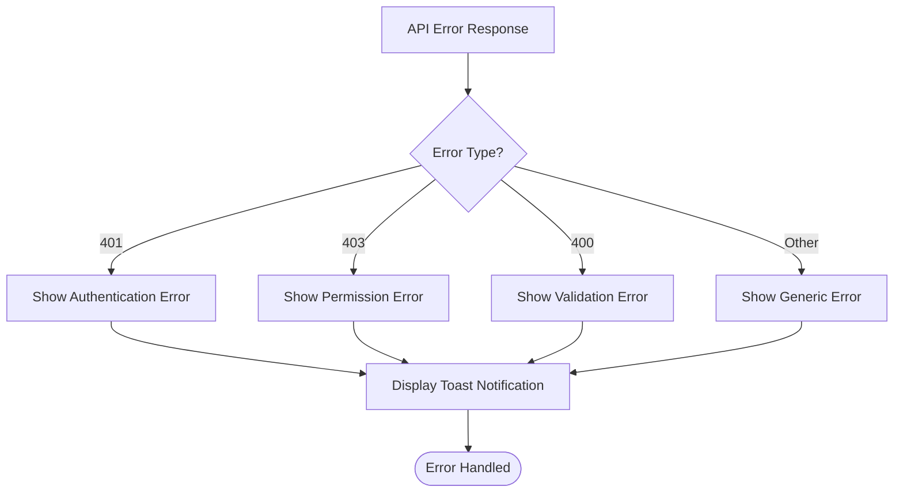

**Diagram sources**
- [RatingModal.jsx:41-47](file://frontend/src/components/RatingModal.jsx#L41-L47)

**Section sources**
- [ratingController.js:82-88](file://backend/controller/ratingController.js#L82-L88)
- [RatingModal.jsx:41-47](file://frontend/src/components/RatingModal.jsx#L41-L47)

## Troubleshooting Guide

### Common Issues and Solutions

#### Issue: "Event not found" Error
**Cause**: Invalid event ID or non-existent event
**Solution**: Verify event ID exists in the database and is accessible

#### Issue: "You can only rate events you have booked" Error  
**Cause**: User hasn't completed booking for the event
**Solution**: Ensure user has a confirmed or completed booking record

#### Issue: "You can only rate events after they are completed" Error
**Cause**: Event date is in future or not yet completed
**Solution**: Wait until event completion date passes before rating

#### Issue: Duplicate Rating Prevention
**Cause**: User attempting to rate same event multiple times
**Solution**: System automatically updates existing rating instead of creating duplicates

#### Issue: Database Schema Mismatch
**Cause**: Event schema doesn't match expected rating structure
**Solution**: Update event schema to include rating object with average and totalRatings fields

### Debugging Tips

1. **Check Authentication**: Verify JWT token validity and expiration
2. **Validate Input Data**: Ensure eventId and rating values are correct
3. **Monitor Database**: Check for proper indexing on user-event combinations
4. **Review Event Status**: Confirm event completion and booking status
5. **Test Edge Cases**: Validate boundary conditions (1-star, 5-star ratings)

**Section sources**
- [ratingController.js:11-50](file://backend/controller/ratingController.js#L11-L50)
- [ratingController.js:137-161](file://backend/controller/ratingController.js#L137-L161)

## Conclusion

The Rating System API provides a robust foundation for event rating functionality within the MERN stack event platform. The system successfully implements:

- **Comprehensive Validation**: Multi-layered validation ensures data integrity
- **Security Measures**: Proper authentication and authorization controls
- **Business Logic**: Realistic rating rules prevent abuse and ensure fairness
- **Integration**: Seamless frontend-backend integration with user-friendly interfaces
- **Scalability**: Well-structured architecture supports future enhancements

### Current Strengths

- **Data Integrity**: Unique constraints prevent duplicate ratings
- **User Experience**: Intuitive rating interface with immediate feedback
- **Business Rules**: Realistic constraints prevent rating manipulation
- **Error Handling**: Comprehensive error responses guide users appropriately

### Areas for Enhancement

1. **Schema Alignment**: Update event schema to match expected rating structure
2. **Analytics**: Implement detailed rating distribution analytics
3. **Caching**: Add caching layer for frequently accessed rating data
4. **Monitoring**: Implement comprehensive logging and monitoring
5. **Testing**: Expand test coverage for edge cases and error scenarios

The system is production-ready with proper validation, security measures, and user experience considerations. With the identified enhancements, it will provide a complete rating solution for the event platform.