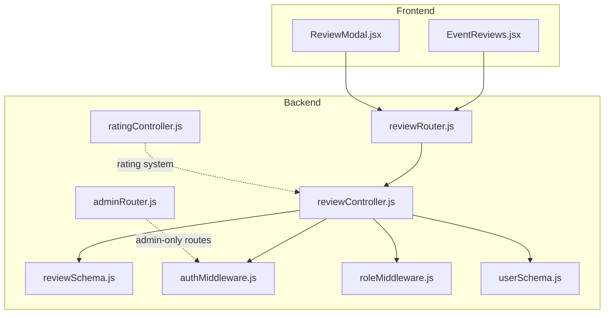
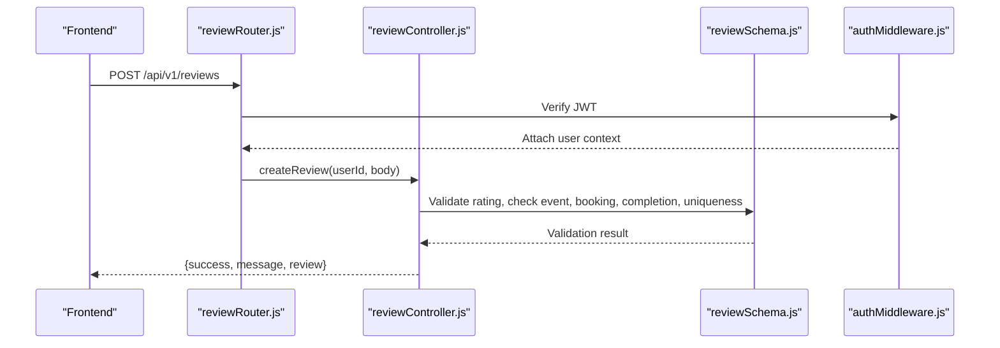
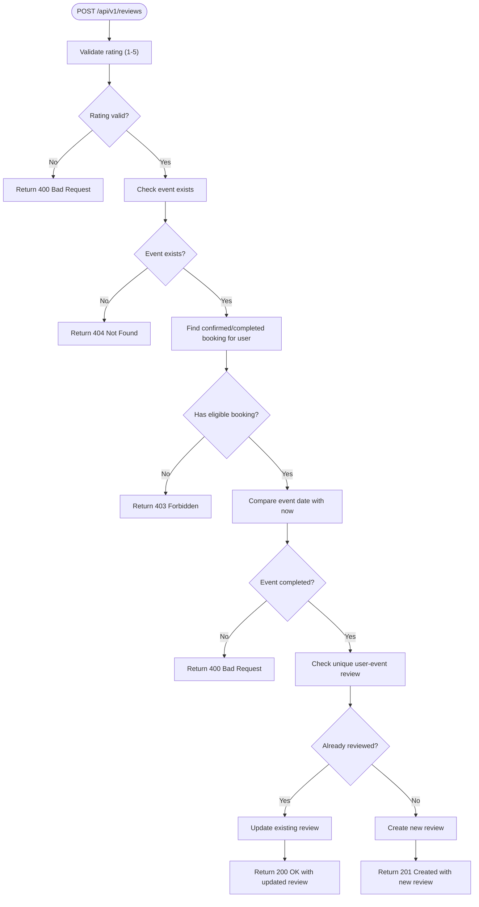
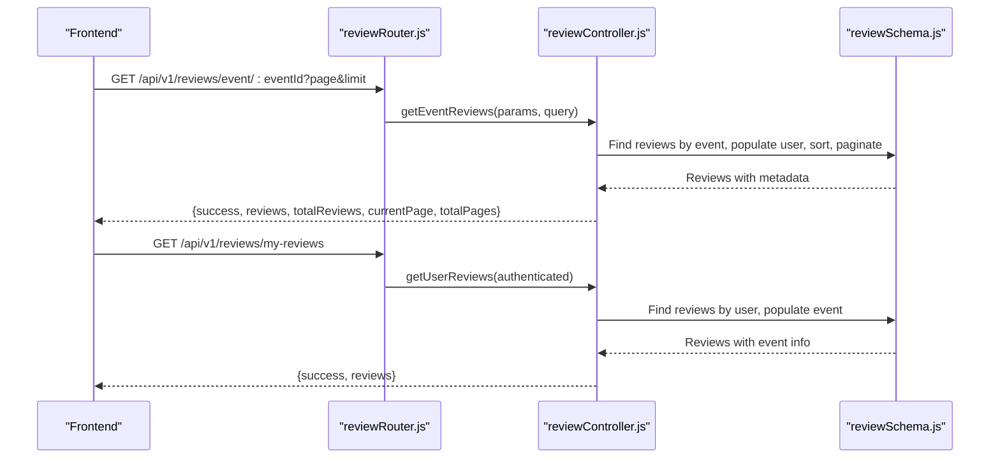
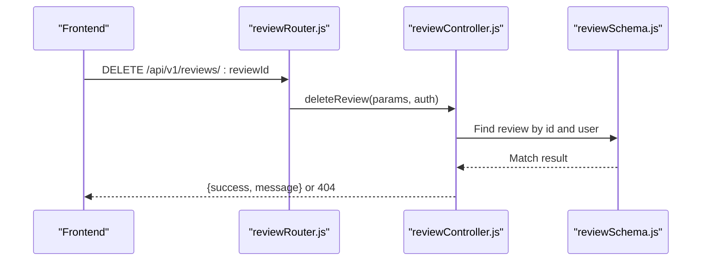
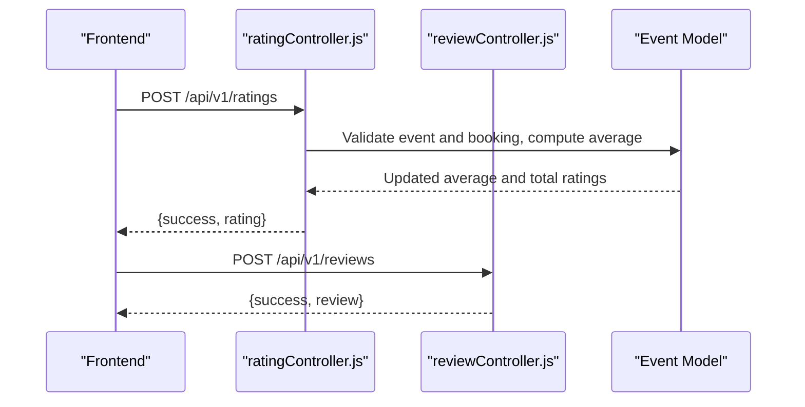
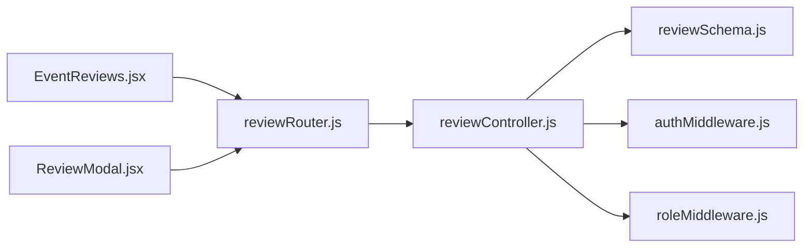

# Review System API

<cite>
**Referenced Files in This Document**
- [reviewController.js](file://backend/controller/reviewController.js)
- [reviewRouter.js](file://backend/router/reviewRouter.js)
- [reviewSchema.js](file://backend/models/reviewSchema.js)
- [authMiddleware.js](file://backend/middleware/authMiddleware.js)
- [roleMiddleware.js](file://backend/middleware/roleMiddleware.js)
- [ratingController.js](file://backend/controller/ratingController.js)
- [EventReviews.jsx](file://frontend/src/components/EventReviews.jsx)
- [ReviewModal.jsx](file://frontend/src/components/ReviewModal.jsx)
- [adminRouter.js](file://backend/router/adminRouter.js)
- [userSchema.js](file://backend/models/userSchema.js)
- [RATING_REVIEW_FOLLOW_IMPLEMENTATION_SUMMARY.md](file://backend/RATING_REVIEW_FOLLOW_IMPLEMENTATION_SUMMARY.md)
- [test-completed-event-rating.js](file://backend/test-completed-event-rating.js)
</cite>

## Table of Contents
1. [Introduction](#introduction)
2. [Project Structure](#project-structure)
3. [Core Components](#core-components)
4. [Architecture Overview](#architecture-overview)
5. [Detailed Component Analysis](#detailed-component-analysis)
6. [Dependency Analysis](#dependency-analysis)
7. [Performance Considerations](#performance-considerations)
8. [Troubleshooting Guide](#troubleshooting-guide)
9. [Conclusion](#conclusion)

## Introduction
This document provides comprehensive API documentation for the Review System endpoints. It covers review creation, retrieval, deletion, moderation, integration with the rating system, user verification requirements, and display formatting. It also includes examples of workflows, moderation processes, and common issue resolutions such as duplicate submissions, inappropriate content handling, and review approval processes.

## Project Structure
The Review System is implemented in the backend with dedicated controller, router, and model files, and integrated with frontend components for user interaction. Authentication middleware ensures secure access, while the rating system complements reviews with numerical ratings.

**Diagram sources**
- [reviewController.js:1-195](file://backend/controller/reviewController.js#L1-L195)
- [reviewRouter.js:1-19](file://backend/router/reviewRouter.js#L1-L19)
- [reviewSchema.js:1-17](file://backend/models/reviewSchema.js#L1-L17)
- [authMiddleware.js:1-17](file://backend/middleware/authMiddleware.js#L1-L17)
- [roleMiddleware.js:1-9](file://backend/middleware/roleMiddleware.js#L1-L9)
- [userSchema.js:1-55](file://backend/models/userSchema.js#L1-L55)
- [adminRouter.js:1-29](file://backend/router/adminRouter.js#L1-L29)
- [ratingController.js:1-161](file://backend/controller/ratingController.js#L1-L161)
- [EventReviews.jsx:1-145](file://frontend/src/components/EventReviews.jsx#L1-L145)
- [ReviewModal.jsx:1-170](file://frontend/src/components/ReviewModal.jsx#L1-L170)

**Section sources**
- [reviewController.js:1-195](file://backend/controller/reviewController.js#L1-L195)
- [reviewRouter.js:1-19](file://backend/router/reviewRouter.js#L1-L19)
- [reviewSchema.js:1-17](file://backend/models/reviewSchema.js#L1-L17)
- [authMiddleware.js:1-17](file://backend/middleware/authMiddleware.js#L1-L17)
- [roleMiddleware.js:1-9](file://backend/middleware/roleMiddleware.js#L1-L9)
- [userSchema.js:1-55](file://backend/models/userSchema.js#L1-L55)
- [adminRouter.js:1-29](file://backend/router/adminRouter.js#L1-L29)
- [ratingController.js:1-161](file://backend/controller/ratingController.js#L1-L161)
- [EventReviews.jsx:1-145](file://frontend/src/components/EventReviews.jsx#L1-L145)
- [ReviewModal.jsx:1-170](file://frontend/src/components/ReviewModal.jsx#L1-L170)

## Core Components
- Review Controller: Implements endpoints for creating, retrieving, and deleting reviews, plus fetching latest reviews.
- Review Router: Defines routes for review endpoints and applies authentication middleware.
- Review Model: Defines the review schema with unique constraint to prevent duplicate submissions and timestamps.
- Authentication Middleware: Validates JWT tokens and attaches user context to requests.
- Role Middleware: Restricts access to admin-only routes.
- Rating Controller: Manages event ratings and updates event averages; complements reviews.
- Frontend Components: Provide user interaction for submitting reviews and viewing event reviews.

Key responsibilities:
- Content validation for rating range and event existence.
- Permission checks ensuring only users who booked an event can review.
- Duplicate prevention via unique index on user-event pair.
- Pagination for event reviews.
- Deletion with ownership verification.

**Section sources**
- [reviewController.js:5-195](file://backend/controller/reviewController.js#L5-L195)
- [reviewRouter.js:11-19](file://backend/router/reviewRouter.js#L11-L19)
- [reviewSchema.js:3-16](file://backend/models/reviewSchema.js#L3-L16)
- [authMiddleware.js:3-16](file://backend/middleware/authMiddleware.js#L3-L16)
- [roleMiddleware.js:1-9](file://backend/middleware/roleMiddleware.js#L1-L9)
- [ratingController.js:5-89](file://backend/controller/ratingController.js#L5-L89)
- [EventReviews.jsx:19-35](file://frontend/src/components/EventReviews.jsx#L19-L35)
- [ReviewModal.jsx:32-71](file://frontend/src/components/ReviewModal.jsx#L32-L71)

## Architecture Overview
The Review System follows a layered architecture:
- Router layer handles HTTP routing and applies middleware.
- Controller layer enforces business logic and interacts with models.
- Model layer defines data structure and uniqueness constraints.
- Frontend components integrate with the backend via REST APIs.

**Diagram sources**
- [reviewRouter.js:14](file://backend/router/reviewRouter.js#L14)
- [authMiddleware.js:3-16](file://backend/middleware/authMiddleware.js#L3-L16)
- [reviewController.js:6-92](file://backend/controller/reviewController.js#L6-L92)
- [reviewSchema.js:3-16](file://backend/models/reviewSchema.js#L3-L16)

## Detailed Component Analysis

### Review Creation Endpoint
- Endpoint: POST /api/v1/reviews
- Authentication: Required (JWT Bearer token)
- Request Body:
  - eventId: ObjectId of the event
  - rating: Number between 1 and 5
  - reviewText: Optional string (supports empty string)
- Business Rules:
  - Validates rating range.
  - Ensures event exists.
  - Confirms user had a confirmed or completed booking for the event.
  - Prevents review creation for upcoming events (only after completion).
  - Prevents duplicate reviews by enforcing a unique index on user-event pair.
  - Updates existing review if found; otherwise creates a new one.
- Response:
  - On success: Returns created or updated review with success flag.
  - On failure: Returns appropriate HTTP status with error message.

**Diagram sources**
- [reviewController.js:6-92](file://backend/controller/reviewController.js#L6-L92)
- [reviewSchema.js:13-14](file://backend/models/reviewSchema.js#L13-L14)

**Section sources**
- [reviewController.js:6-92](file://backend/controller/reviewController.js#L6-L92)
- [reviewSchema.js:13-14](file://backend/models/reviewSchema.js#L13-L14)
- [ReviewModal.jsx:32-71](file://frontend/src/components/ReviewModal.jsx#L32-L71)

### Review Retrieval Endpoints
- Event-specific reviews:
  - Endpoint: GET /api/v1/reviews/event/:eventId
  - Query Parameters: page (default 1), limit (default 10)
  - Response includes paginated reviews, total count, current page, and total pages.
  - Reviews are sorted by creation date (newest first) and include user name.
- User review history:
  - Endpoint: GET /api/v1/reviews/my-reviews
  - Authentication: Required
  - Response includes all reviews by the authenticated user, sorted by creation date, with event title and category.
- Latest reviews (public):
  - Endpoint: GET /api/v1/reviews/latest
  - Returns up to six reviews with non-empty text, including user and event metadata.

**Diagram sources**
- [reviewRouter.js:15-16](file://backend/router/reviewRouter.js#L15-L16)
- [reviewController.js:95-146](file://backend/controller/reviewController.js#L95-L146)
- [reviewSchema.js:3-11](file://backend/models/reviewSchema.js#L3-L11)

**Section sources**
- [reviewRouter.js:13-16](file://backend/router/reviewRouter.js#L13-L16)
- [reviewController.js:95-146](file://backend/controller/reviewController.js#L95-L146)
- [EventReviews.jsx:19-35](file://frontend/src/components/EventReviews.jsx#L19-L35)

### Review Deletion Endpoint
- Endpoint: DELETE /api/v1/reviews/:reviewId
- Authentication: Required
- Permission Check: Only the review owner can delete.
- Behavior: Deletes the review and returns success message.

**Diagram sources**
- [reviewRouter.js:17](file://backend/router/reviewRouter.js#L17)
- [reviewController.js:149-180](file://backend/controller/reviewController.js#L149-L180)

**Section sources**
- [reviewRouter.js:17](file://backend/router/reviewRouter.js#L17)
- [reviewController.js:149-180](file://backend/controller/reviewController.js#L149-L180)

### Moderation and Content Filtering
- Current Implementation: No explicit spam detection or content filtering is implemented in the Review System.
- Admin Capabilities: Admin routes exist for listing users, events, and reports but do not expose review moderation endpoints.
- Recommendations:
  - Integrate content filtering libraries to scan reviewText for inappropriate content.
  - Implement automated spam detection (e.g., duplicate content detection, frequency checks).
  - Add admin endpoints to approve/reject reviews and manage flagged content.
  - Store moderation logs and review status (approved/pending/rejected).

Note: These are recommendations for future enhancements and are not part of the current codebase.

**Section sources**
- [adminRouter.js:1-29](file://backend/router/adminRouter.js#L1-L29)
- [RATING_REVIEW_FOLLOW_IMPLEMENTATION_SUMMARY.md:28-44](file://backend/RATING_REVIEW_FOLLOW_IMPLEMENTATION_SUMMARY.md#L28-L44)

### Integration with Rating System
- Rating endpoint: POST /api/v1/ratings
- Rating retrieval: GET /api/v1/ratings/event/:eventId and GET /api/v1/ratings/my-ratings
- Rating updates trigger automatic recalculation of event average rating and total ratings.
- Reviews complement ratings by adding qualitative feedback.

**Diagram sources**
- [ratingController.js:5-89](file://backend/controller/ratingController.js#L5-L89)
- [reviewController.js:6-92](file://backend/controller/reviewController.js#L6-L92)

**Section sources**
- [ratingController.js:5-89](file://backend/controller/ratingController.js#L5-L89)
- [RATING_REVIEW_FOLLOW_IMPLEMENTATION_SUMMARY.md:9-27](file://backend/RATING_REVIEW_FOLLOW_IMPLEMENTATION_SUMMARY.md#L9-L27)

### User Verification Requirements
- Authentication: JWT-based authentication is enforced for protected endpoints.
- Roles: Admin-only routes use role middleware to restrict access.
- User Schema: Defines roles (user, admin, merchant) and status (active/inactive).

Practical implications:
- Unauthenticated users cannot create or delete reviews.
- Admins have elevated privileges for administrative tasks (not currently exposed for review moderation).

**Section sources**
- [authMiddleware.js:3-16](file://backend/middleware/authMiddleware.js#L3-L16)
- [roleMiddleware.js:1-9](file://backend/middleware/roleMiddleware.js#L1-L9)
- [userSchema.js:39-50](file://backend/models/userSchema.js#L39-L50)

### Review Display Formatting
- Frontend display components:
  - EventReviews: Renders user initials/avatar, user name, star rating, formatted date, and optional review text with pagination.
  - ReviewModal: Provides a form for rating and review text submission with character limits and validation.

Display features:
- Star rating visualization.
- User identity display (fallback to anonymous).
- Date formatting.
- Pagination controls for event reviews.

**Section sources**
- [EventReviews.jsx:76-137](file://frontend/src/components/EventReviews.jsx#L76-L137)
- [ReviewModal.jsx:90-156](file://frontend/src/components/ReviewModal.jsx#L90-L156)

## Dependency Analysis
- Controller depends on:
  - Models for data access and validation.
  - Authentication middleware for user context.
  - Role middleware for admin-only routes.
- Router depends on controller functions and applies middleware.
- Frontend components depend on backend endpoints for data and actions.

**Diagram sources**
- [reviewRouter.js:1-19](file://backend/router/reviewRouter.js#L1-L19)
- [reviewController.js:1-195](file://backend/controller/reviewController.js#L1-L195)
- [reviewSchema.js:1-17](file://backend/models/reviewSchema.js#L1-L17)
- [authMiddleware.js:1-17](file://backend/middleware/authMiddleware.js#L1-L17)
- [roleMiddleware.js:1-9](file://backend/middleware/roleMiddleware.js#L1-L9)
- [EventReviews.jsx:1-145](file://frontend/src/components/EventReviews.jsx#L1-L145)
- [ReviewModal.jsx:1-170](file://frontend/src/components/ReviewModal.jsx#L1-L170)

**Section sources**
- [reviewRouter.js:1-19](file://backend/router/reviewRouter.js#L1-L19)
- [reviewController.js:1-195](file://backend/controller/reviewController.js#L1-L195)
- [reviewSchema.js:1-17](file://backend/models/reviewSchema.js#L1-L17)
- [authMiddleware.js:1-17](file://backend/middleware/authMiddleware.js#L1-L17)
- [roleMiddleware.js:1-9](file://backend/middleware/roleMiddleware.js#L1-L9)
- [EventReviews.jsx:1-145](file://frontend/src/components/EventReviews.jsx#L1-L145)
- [ReviewModal.jsx:1-170](file://frontend/src/components/ReviewModal.jsx#L1-L170)

## Performance Considerations
- Indexing: The unique index on user-event prevents duplicates and improves lookup performance.
- Pagination: Event reviews endpoint supports pagination to limit payload size.
- Population: Populate user and event fields judiciously to avoid heavy queries; consider denormalization for frequently accessed fields if needed.
- Caching: Consider caching popular event review summaries for improved response times.

## Troubleshooting Guide
Common issues and resolutions:
- Duplicate Submissions:
  - Cause: Unique index prevents multiple reviews per user-event.
  - Resolution: Allow updates to existing review instead of failing.
  - Evidence: Unique index on user-event pair.
- Inappropriate Content:
  - Current state: No built-in filtering.
  - Recommendation: Add content filtering and admin moderation endpoints.
- Review Approval Processes:
  - Current state: Reviews appear immediately upon creation.
  - Recommendation: Implement moderation workflow with admin endpoints.
- Unauthorized Access:
  - Cause: Missing or invalid JWT token.
  - Resolution: Ensure client sends Authorization header with Bearer token.
- Forbidden Access:
  - Cause: Non-owners attempting to delete reviews.
  - Resolution: Verify ownership before deletion.

**Section sources**
- [reviewSchema.js:13-14](file://backend/models/reviewSchema.js#L13-L14)
- [reviewController.js:149-180](file://backend/controller/reviewController.js#L149-L180)
- [authMiddleware.js:3-16](file://backend/middleware/authMiddleware.js#L3-L16)
- [adminRouter.js:1-29](file://backend/router/adminRouter.js#L1-L29)

## Conclusion
The Review System provides robust endpoints for creating, retrieving, and deleting reviews with strong validation and permission checks. It integrates seamlessly with the rating system and is supported by frontend components for user interaction. While moderation and content filtering are not currently implemented, the architecture allows for straightforward enhancement to support spam detection, content filtering, and admin moderation workflows.