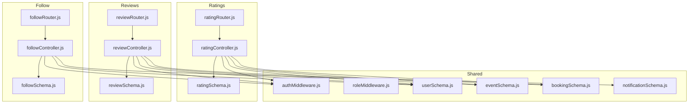
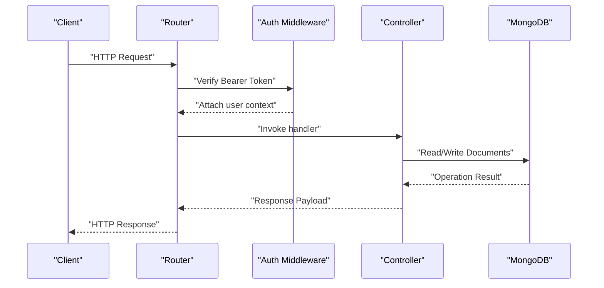
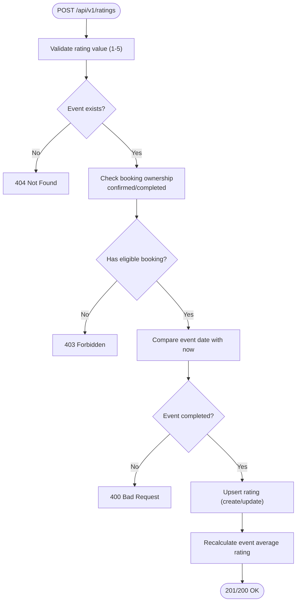
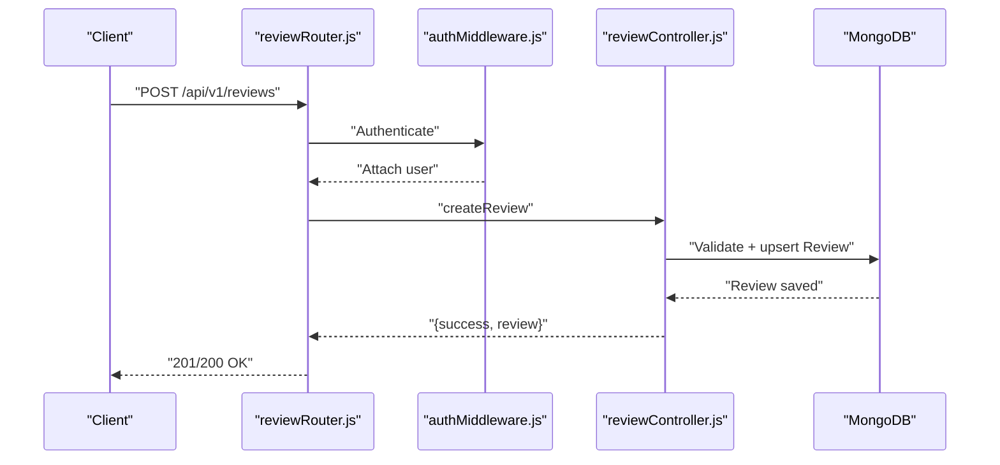
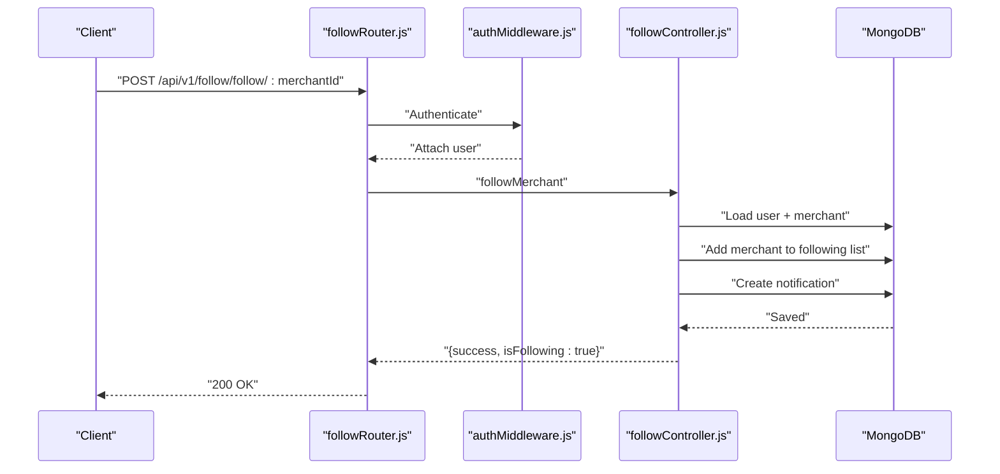
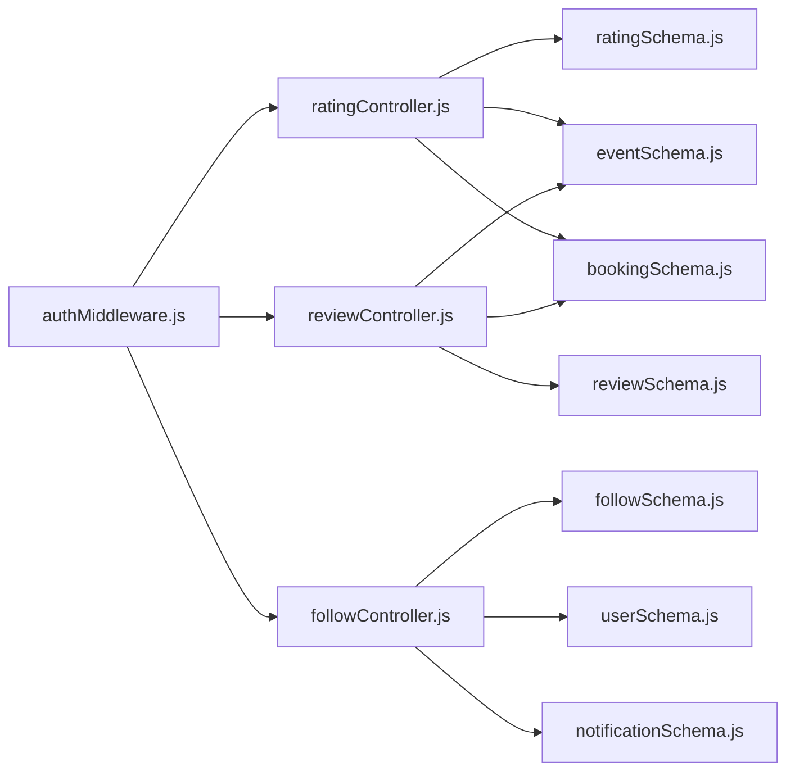

# Social and Interaction API

<cite>
**Referenced Files in This Document**
- [ratingController.js](file://backend/controller/ratingController.js)
- [reviewController.js](file://backend/controller/reviewController.js)
- [followController.js](file://backend/controller/followController.js)
- [ratingRouter.js](file://backend/router/ratingRouter.js)
- [reviewRouter.js](file://backend/router/reviewRouter.js)
- [followRouter.js](file://backend/router/followRouter.js)
- [authMiddleware.js](file://backend/middleware/authMiddleware.js)
- [roleMiddleware.js](file://backend/middleware/roleMiddleware.js)
- [ratingSchema.js](file://backend/models/ratingSchema.js)
- [reviewSchema.js](file://backend/models/reviewSchema.js)
- [followSchema.js](file://backend/models/followSchema.js)
- [userSchema.js](file://backend/models/userSchema.js)
- [eventSchema.js](file://backend/models/eventSchema.js)
- [bookingSchema.js](file://backend/models/bookingSchema.js)
- [notificationSchema.js](file://backend/models/notificationSchema.js)
</cite>

## Table of Contents
1. [Introduction](#introduction)
2. [Project Structure](#project-structure)
3. [Core Components](#core-components)
4. [Architecture Overview](#architecture-overview)
5. [Detailed Component Analysis](#detailed-component-analysis)
6. [Dependency Analysis](#dependency-analysis)
7. [Performance Considerations](#performance-considerations)
8. [Troubleshooting Guide](#troubleshooting-guide)
9. [Conclusion](#conclusion)
10. [Appendices](#appendices)

## Introduction
This document provides comprehensive API documentation for the Social and Interaction system endpoints. It covers rating submission, review creation, follow/unfollow functionality, and related social features. It explains rating calculation algorithms, review moderation, follower management, and social graph operations. It also documents permission requirements, content validation, spam prevention measures, and integrations with user profiles, event reviews, and merchant ratings. Workflow examples and integration guidance are included for practical adoption.

## Project Structure
The Social and Interaction system is implemented as three primary subsystems:
- Ratings: Users submit star ratings for events they attended.
- Reviews: Users submit textual reviews and star ratings for events they attended.
- Follow: Users follow merchants; system tracks follow relationships and notifications.

Each subsystem includes:
- Router: Defines HTTP endpoints and applies authentication middleware.
- Controller: Implements business logic, validations, and data updates.
- Model: Defines data schemas and uniqueness constraints.
- Middleware: Provides authentication and role-based access control.



**Diagram sources**
- [ratingRouter.js:1-16](file://backend/router/ratingRouter.js#L1-L16)
- [ratingController.js:1-161](file://backend/controller/ratingController.js#L1-L161)
- [ratingSchema.js:1-28](file://backend/models/ratingSchema.js#L1-L28)
- [reviewRouter.js:1-19](file://backend/router/reviewRouter.js#L1-L19)
- [reviewController.js:1-195](file://backend/controller/reviewController.js#L1-L195)
- [reviewSchema.js:1-17](file://backend/models/reviewSchema.js#L1-L17)
- [followRouter.js:1-26](file://backend/router/followRouter.js#L1-L26)
- [followController.js:1-234](file://backend/controller/followController.js#L1-L234)
- [followSchema.js:1-22](file://backend/models/followSchema.js#L1-L22)
- [authMiddleware.js:1-17](file://backend/middleware/authMiddleware.js#L1-L17)
- [roleMiddleware.js:1-9](file://backend/middleware/roleMiddleware.js#L1-L9)
- [userSchema.js:1-55](file://backend/models/userSchema.js#L1-L55)
- [eventSchema.js:1-51](file://backend/models/eventSchema.js#L1-L51)
- [bookingSchema.js:1-53](file://backend/models/bookingSchema.js#L1-L53)
- [notificationSchema.js:1-36](file://backend/models/notificationSchema.js#L1-L36)

**Section sources**
- [ratingRouter.js:1-16](file://backend/router/ratingRouter.js#L1-L16)
- [reviewRouter.js:1-19](file://backend/router/reviewRouter.js#L1-L19)
- [followRouter.js:1-26](file://backend/router/followRouter.js#L1-L26)
- [authMiddleware.js:1-17](file://backend/middleware/authMiddleware.js#L1-L17)
- [roleMiddleware.js:1-9](file://backend/middleware/roleMiddleware.js#L1-L9)

## Core Components
- Ratings
  - Endpoint: POST /api/v1/ratings
  - Purpose: Submit or update a 1–5 star rating for an event after completion.
  - Validation: Rating range, event existence, booking ownership, event completion date.
  - Calculation: Recompute average and total ratings per event.
- Reviews
  - Endpoint: POST /api/v1/reviews
  - Purpose: Submit or update a review with optional text and a 1–5 star rating.
  - Validation: Same preconditions as ratings; prevents duplicates via unique index.
  - Moderation: Public retrieval of latest reviews; deletion endpoint for authorized users.
- Follow
  - Endpoints:
    - POST /api/v1/follow/follow/:merchantId
    - DELETE /api/v1/follow/unfollow/:merchantId
    - GET /api/v1/follow/status/:merchantId
    - GET /api/v1/follow/following
    - GET /api/v1/follow/followers
  - Purpose: Manage merchant follow relationships and follower counts.
  - Notifications: Creates follow notifications for merchants upon new followers.

Key permissions and constraints:
- Authentication: All user-facing endpoints require a Bearer token.
- Authorization: No role-specific restrictions in current implementation; merchant checks are enforced during follow operations.
- Uniqueness: Unique compound indexes prevent duplicate ratings and reviews per user-event pair.

**Section sources**
- [ratingController.js:6-89](file://backend/controller/ratingController.js#L6-L89)
- [reviewController.js:6-92](file://backend/controller/reviewController.js#L6-L92)
- [followController.js:5-137](file://backend/controller/followController.js#L5-L137)
- [ratingRouter.js:11-14](file://backend/router/ratingRouter.js#L11-L14)
- [reviewRouter.js:13-17](file://backend/router/reviewRouter.js#L13-L17)
- [followRouter.js:13-24](file://backend/router/followRouter.js#L13-L24)
- [ratingSchema.js:25-26](file://backend/models/ratingSchema.js#L25-L26)
- [reviewSchema.js:13-14](file://backend/models/reviewSchema.js#L13-L14)
- [authMiddleware.js:3-16](file://backend/middleware/authMiddleware.js#L3-L16)

## Architecture Overview
The system follows a layered architecture:
- Router layer: Exposes REST endpoints and applies authentication.
- Controller layer: Implements business logic, validations, and data updates.
- Model layer: Defines schemas and enforces uniqueness constraints.
- Shared layer: Authentication middleware decodes tokens and attaches user context; role middleware can enforce roles if needed.



**Diagram sources**
- [ratingRouter.js:1-16](file://backend/router/ratingRouter.js#L1-L16)
- [reviewRouter.js:1-19](file://backend/router/reviewRouter.js#L1-L19)
- [followRouter.js:1-26](file://backend/router/followRouter.js#L1-L26)
- [authMiddleware.js:3-16](file://backend/middleware/authMiddleware.js#L3-L16)
- [ratingController.js:6-89](file://backend/controller/ratingController.js#L6-L89)
- [reviewController.js:6-92](file://backend/controller/reviewController.js#L6-L92)
- [followController.js:5-137](file://backend/controller/followController.js#L5-L137)

## Detailed Component Analysis

### Ratings API
Endpoints:
- POST /api/v1/ratings
  - Description: Create or update a rating for an event.
  - Body: { eventId: ObjectId, rating: number (1–5) }
  - Responses:
    - 201 Created: Rating created.
    - 200 OK: Rating updated.
    - 400 Bad Request: Invalid rating value or event not completed.
    - 403 Forbidden: User did not book the event.
    - 404 Not Found: Event not found.
    - 500 Internal Server Error: Server failure.
- GET /api/v1/ratings/event/:eventId
  - Description: Retrieve all ratings for an event, sorted by recency.
  - Responses: 200 OK with array of ratings; 500 on error.
- GET /api/v1/ratings/my-ratings
  - Description: Retrieve ratings submitted by the authenticated user.
  - Responses: 200 OK with array of ratings; 500 on error.

Validation and permissions:
- Rating range validated server-side.
- Event existence verified.
- Booking ownership checked against confirmed/completed bookings.
- Event completion date compared to current time.
- Unique constraint ensures one rating per user-event pair.

Rating calculation algorithm:
- Fetch all ratings for the event.
- Compute total score and average.
- Round average to one decimal place.
- Update event document with new average and total count.



**Diagram sources**
- [ratingController.js:6-89](file://backend/controller/ratingController.js#L6-L89)
- [ratingController.js:138-161](file://backend/controller/ratingController.js#L138-L161)

**Section sources**
- [ratingController.js:6-89](file://backend/controller/ratingController.js#L6-L89)
- [ratingController.js:92-135](file://backend/controller/ratingController.js#L92-L135)
- [ratingController.js:138-161](file://backend/controller/ratingController.js#L138-L161)
- [ratingRouter.js:11-14](file://backend/router/ratingRouter.js#L11-L14)
- [ratingSchema.js:25-26](file://backend/models/ratingSchema.js#L25-L26)
- [bookingSchema.js:36-40](file://backend/models/bookingSchema.js#L36-L40)
- [eventSchema.js:10-10](file://backend/models/eventSchema.js#L10-L10)

### Reviews API
Endpoints:
- POST /api/v1/reviews
  - Description: Create or update a review with optional text and a 1–5 star rating.
  - Body: { eventId: ObjectId, rating: number (1–5), reviewText: string }
  - Responses:
    - 201 Created: Review created.
    - 200 OK: Review updated.
    - 400 Bad Request: Invalid rating value or event not completed.
    - 403 Forbidden: User did not book the event.
    - 404 Not Found: Event not found.
    - 500 Internal Server Error: Server failure.
- GET /api/v1/reviews/event/:eventId
  - Description: Paginated retrieval of reviews for an event.
  - Query: page (default 1), limit (default 10)
  - Responses: 200 OK with reviews, totals, and pagination metadata; 500 on error.
- GET /api/v1/reviews/my-reviews
  - Description: Retrieve reviews authored by the authenticated user.
  - Responses: 200 OK with array of reviews; 500 on error.
- DELETE /api/v1/reviews/:reviewId
  - Description: Delete a review authored by the authenticated user.
  - Responses: 200 OK on success; 404 Not Found if not owned or not present; 500 on error.
- GET /api/v1/reviews/latest
  - Description: Public endpoint to fetch recent non-empty reviews for testimonials.

Validation and permissions:
- Same preconditions as ratings.
- Unique constraint prevents duplicate reviews per user-event pair.
- Deletion requires ownership verification.

Review moderation:
- Public retrieval filters out empty reviewText entries.
- Admin-level moderation is not implemented in the current code.



**Diagram sources**
- [reviewRouter.js:1-19](file://backend/router/reviewRouter.js#L1-L19)
- [authMiddleware.js:3-16](file://backend/middleware/authMiddleware.js#L3-L16)
- [reviewController.js:6-92](file://backend/controller/reviewController.js#L6-L92)

**Section sources**
- [reviewController.js:6-92](file://backend/controller/reviewController.js#L6-L92)
- [reviewController.js:94-146](file://backend/controller/reviewController.js#L94-L146)
- [reviewController.js:148-180](file://backend/controller/reviewController.js#L148-L180)
- [reviewController.js:182-195](file://backend/controller/reviewController.js#L182-L195)
- [reviewRouter.js:13-17](file://backend/router/reviewRouter.js#L13-L17)
- [reviewSchema.js:13-14](file://backend/models/reviewSchema.js#L13-L14)

### Follow API
Endpoints:
- POST /api/v1/follow/follow/:merchantId
  - Description: Follow a merchant.
  - Validation: Merchant exists and role is merchant; self-follow disallowed; not already following.
  - Side effects: Adds merchant to user.followingMerchants; creates a follow notification for the merchant.
  - Responses: 200 OK with isFollowing true; 400/404/500 as appropriate.
- DELETE /api/v1/follow/unfollow/:merchantId
  - Description: Unfollow a merchant.
  - Validation: User exists; currently following.
  - Side effects: Removes merchant from user.followingMerchants.
  - Responses: 200 OK with isFollowing false; 400/404/500 as appropriate.
- GET /api/v1/follow/status/:merchantId
  - Description: Check follow status for a merchant.
  - Responses: 200 OK with isFollowing; 500 on error.
- GET /api/v1/follow/following
  - Description: List merchants followed by the authenticated user.
  - Responses: 200 OK with array; 500 on error.
- GET /api/v1/follow/followers
  - Description: List users following the authenticated merchant (requires merchant role).
  - Responses: 200 OK with array and followerCount; 500 on error.

Permissions and constraints:
- Authentication required for all endpoints.
- Merchant validation enforced during follow.
- Self-follow blocked.
- Unique constraint via schema indexing prevents duplicate follow records.



**Diagram sources**
- [followRouter.js:1-26](file://backend/router/followRouter.js#L1-L26)
- [authMiddleware.js:3-16](file://backend/middleware/authMiddleware.js#L3-L16)
- [followController.js:5-86](file://backend/controller/followController.js#L5-L86)
- [notificationSchema.js:1-36](file://backend/models/notificationSchema.js#L1-L36)

**Section sources**
- [followController.js:5-137](file://backend/controller/followController.js#L5-L137)
- [followController.js:140-172](file://backend/controller/followController.js#L140-L172)
- [followController.js:175-206](file://backend/controller/followController.js#L175-L206)
- [followController.js:209-234](file://backend/controller/followController.js#L209-L234)
- [followRouter.js:13-24](file://backend/router/followRouter.js#L13-L24)
- [followSchema.js:19-20](file://backend/models/followSchema.js#L19-L20)
- [userSchema.js:39-44](file://backend/models/userSchema.js#L39-L44)

### Data Models and Relationships
```mermaid
erDiagram
USER {
ObjectId _id PK
string name
string email
string role
array followingMerchants
}
EVENT {
ObjectId _id PK
string title
number rating.average
number rating.totalRatings
}
BOOKING {
ObjectId _id PK
ObjectId user FK
ObjectId event FK
string status
}
RATING {
ObjectId _id PK
ObjectId user FK
ObjectId event FK
number rating
}
REVIEW {
ObjectId _id PK
ObjectId user FK
ObjectId event FK
number rating
string reviewText
}
FOLLOW {
ObjectId _id PK
ObjectId user FK
ObjectId merchant FK
}
NOTIFICATION {
ObjectId _id PK
ObjectId user FK
string message
string type
}
USER ||--o{ BOOKING : "books"
BOOKING ||--o{ RATING : "rates"
BOOKING ||--o{ REVIEW : "reviews"
USER ||--o{ RATING : "submits"
EVENT ||--o{ RATING : "accumulates"
USER ||--o{ REVIEW : "writes"
EVENT ||--o{ REVIEW : "has"
USER ||--o{ FOLLOW : "follows"
USER ||--o{ FOLLOW : "is followed by"
USER ||--o{ NOTIFICATION : "receives"
```

**Diagram sources**
- [userSchema.js:1-55](file://backend/models/userSchema.js#L1-L55)
- [eventSchema.js:1-51](file://backend/models/eventSchema.js#L1-L51)
- [bookingSchema.js:1-53](file://backend/models/bookingSchema.js#L1-L53)
- [ratingSchema.js:1-28](file://backend/models/ratingSchema.js#L1-L28)
- [reviewSchema.js:1-17](file://backend/models/reviewSchema.js#L1-L17)
- [followSchema.js:1-22](file://backend/models/followSchema.js#L1-L22)
- [notificationSchema.js:1-36](file://backend/models/notificationSchema.js#L1-L36)

**Section sources**
- [userSchema.js:1-55](file://backend/models/userSchema.js#L1-L55)
- [eventSchema.js:1-51](file://backend/models/eventSchema.js#L1-L51)
- [bookingSchema.js:1-53](file://backend/models/bookingSchema.js#L1-L53)
- [ratingSchema.js:1-28](file://backend/models/ratingSchema.js#L1-L28)
- [reviewSchema.js:1-17](file://backend/models/reviewSchema.js#L1-L17)
- [followSchema.js:1-22](file://backend/models/followSchema.js#L1-L22)
- [notificationSchema.js:1-36](file://backend/models/notificationSchema.js#L1-L36)

## Dependency Analysis
- Controllers depend on:
  - Models for persistence and uniqueness constraints.
  - Authentication middleware for user context.
  - Event and Booking models for eligibility checks.
- Router layer depends on:
  - Controllers for request handling.
  - Authentication middleware for access control.
- Models define:
  - Indexes ensuring uniqueness for ratings and reviews.
  - References linking users, events, and notifications.

Potential circular dependencies:
- None observed among routers, controllers, and models in the analyzed files.

External dependencies:
- JWT decoding for authentication.
- MongoDB for persistence.



**Diagram sources**
- [authMiddleware.js:1-17](file://backend/middleware/authMiddleware.js#L1-L17)
- [ratingController.js:1-161](file://backend/controller/ratingController.js#L1-L161)
- [reviewController.js:1-195](file://backend/controller/reviewController.js#L1-L195)
- [followController.js:1-234](file://backend/controller/followController.js#L1-L234)
- [ratingSchema.js:1-28](file://backend/models/ratingSchema.js#L1-L28)
- [reviewSchema.js:1-17](file://backend/models/reviewSchema.js#L1-L17)
- [followSchema.js:1-22](file://backend/models/followSchema.js#L1-L22)
- [userSchema.js:1-55](file://backend/models/userSchema.js#L1-L55)
- [eventSchema.js:1-51](file://backend/models/eventSchema.js#L1-L51)
- [bookingSchema.js:1-53](file://backend/models/bookingSchema.js#L1-L53)
- [notificationSchema.js:1-36](file://backend/models/notificationSchema.js#L1-L36)

**Section sources**
- [authMiddleware.js:1-17](file://backend/middleware/authMiddleware.js#L1-L17)
- [ratingController.js:1-161](file://backend/controller/ratingController.js#L1-L161)
- [reviewController.js:1-195](file://backend/controller/reviewController.js#L1-L195)
- [followController.js:1-234](file://backend/controller/followController.js#L1-L234)

## Performance Considerations
- Indexing:
  - Unique compound indexes on (user, event) for ratings and reviews prevent duplicate submissions and support efficient lookups.
- Aggregation:
  - Rating recalculation iterates all ratings for an event; consider caching averages and updating incrementally for high-volume scenarios.
- Pagination:
  - Reviews endpoint supports pagination to avoid large payloads.
- Population:
  - Populate operations on user and event reduce round trips but can increase response sizes; use selective projections if needed.
- Notifications:
  - Creating notifications on follow adds write overhead; batch or defer if scalability becomes a concern.

[No sources needed since this section provides general guidance]

## Troubleshooting Guide
Common errors and resolutions:
- Unauthorized (401):
  - Ensure a valid Bearer token is included in the Authorization header.
- Forbidden (403):
  - For ratings/reviews, confirm the user had a confirmed or completed booking for the event.
- Not Found (404):
  - Verify the event and merchant identifiers exist.
- Bad Request (400):
  - Confirm rating is within 1–5 and the event has completed.
- Duplicate Submission:
  - Unique indexes prevent multiple ratings/reviews per user-event; update existing instead of re-creating.

Operational tips:
- Use GET endpoints to verify state before mutating actions.
- Monitor logs for controller-level error messages.

**Section sources**
- [authMiddleware.js:7-14](file://backend/middleware/authMiddleware.js#L7-L14)
- [ratingController.js:12-17](file://backend/controller/ratingController.js#L12-L17)
- [ratingController.js:21-26](file://backend/controller/ratingController.js#L21-L26)
- [ratingController.js:35-40](file://backend/controller/ratingController.js#L35-L40)
- [ratingController.js:45-50](file://backend/controller/ratingController.js#L45-L50)
- [reviewController.js:12-17](file://backend/controller/reviewController.js#L12-L17)
- [reviewController.js:21-26](file://backend/controller/reviewController.js#L21-L26)
- [reviewController.js:35-40](file://backend/controller/reviewController.js#L35-L40)
- [reviewController.js:45-49](file://backend/controller/reviewController.js#L45-L49)
- [followController.js:16-28](file://backend/controller/followController.js#L16-L28)
- [followController.js:31-36](file://backend/controller/followController.js#L31-L36)
- [followController.js:48-54](file://backend/controller/followController.js#L48-L54)

## Conclusion
The Social and Interaction APIs provide robust mechanisms for users to rate and review events they attended, and to follow merchants with notifications. The system enforces strong validations, uniqueness constraints, and sensible defaults. Future enhancements could include incremental rating updates, review moderation workflows, and role-based access controls for administrative tasks.

[No sources needed since this section summarizes without analyzing specific files]

## Appendices

### API Reference Summary
- Ratings
  - POST /api/v1/ratings: { eventId, rating } → 201/200, 400/403/404/500
  - GET /api/v1/ratings/event/:eventId: → 200
  - GET /api/v1/ratings/my-ratings: → 200
- Reviews
  - POST /api/v1/reviews: { eventId, rating, reviewText } → 201/200, 400/403/404/500
  - GET /api/v1/reviews/event/:eventId?page=&limit=: → 200
  - GET /api/v1/reviews/my-reviews: → 200
  - DELETE /api/v1/reviews/:reviewId: → 200, 404
  - GET /api/v1/reviews/latest: → 200
- Follow
  - POST /api/v1/follow/follow/:merchantId: → 200, 400/404/500
  - DELETE /api/v1/follow/unfollow/:merchantId: → 200, 400/404/500
  - GET /api/v1/follow/status/:merchantId: → 200
  - GET /api/v1/follow/following: → 200
  - GET /api/v1/follow/followers: → 200

**Section sources**
- [ratingRouter.js:11-14](file://backend/router/ratingRouter.js#L11-L14)
- [reviewRouter.js:13-17](file://backend/router/reviewRouter.js#L13-L17)
- [followRouter.js:13-24](file://backend/router/followRouter.js#L13-L24)

### Integration Examples
- Rating submission workflow:
  - After confirming or completing a booking, the client calls POST /api/v1/ratings with the event identifier and rating value. The server validates eligibility, persists the rating, recalculates the event’s average, and responds with success.
- Review creation workflow:
  - After attending an event, the client calls POST /api/v1/reviews with rating and optional text. The server verifies booking status and event completion, then upserts the review.
- Follow/unfollow workflow:
  - To follow, the client calls POST /api/v1/follow/follow/:merchantId; to unfollow, DELETE /api/v1/follow/unfollow/:merchantId. The server updates the user’s following list and optionally creates a notification for the merchant.

**Section sources**
- [ratingController.js:6-89](file://backend/controller/ratingController.js#L6-L89)
- [reviewController.js:6-92](file://backend/controller/reviewController.js#L6-L92)
- [followController.js:5-137](file://backend/controller/followController.js#L5-L137)