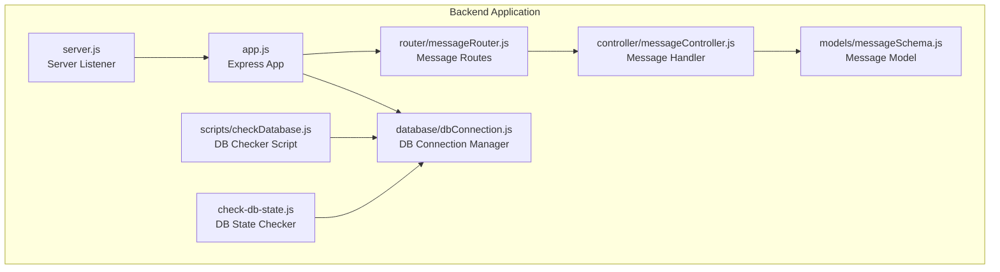
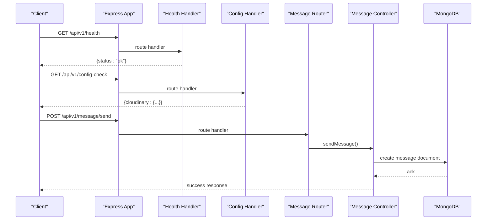
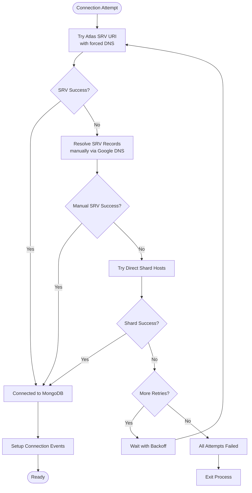
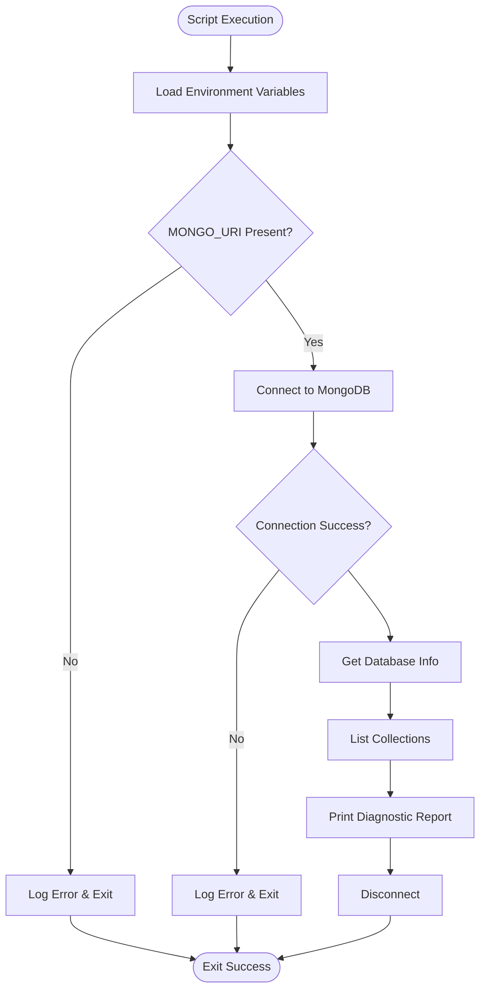
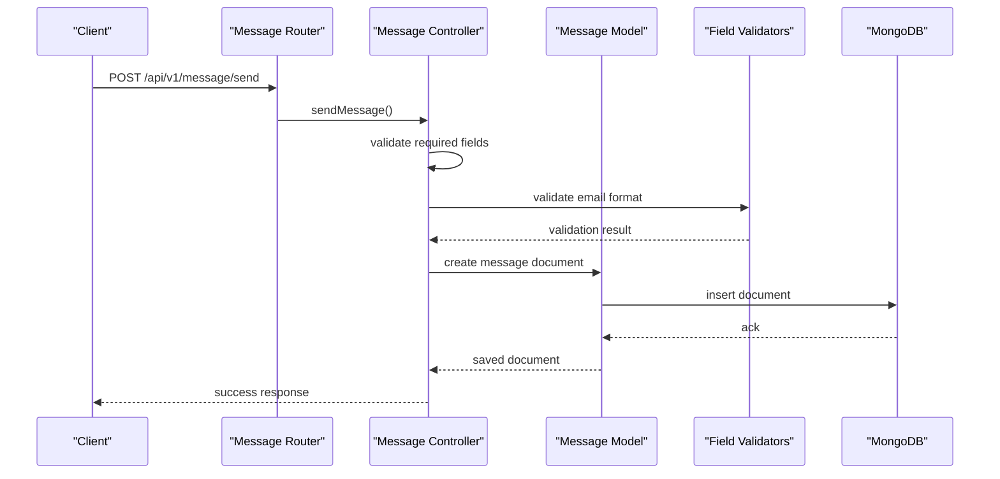
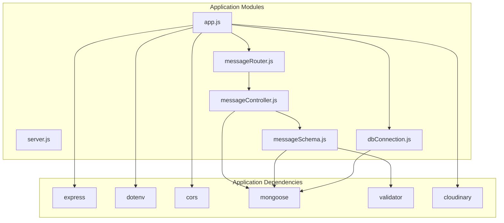

# Utility and Support API

<cite>
**Referenced Files in This Document**
- [app.js](file://backend/app.js)
- [server.js](file://backend/server.js)
- [messageRouter.js](file://backend/router/messageRouter.js)
- [messageController.js](file://backend/controller/messageController.js)
- [messageSchema.js](file://backend/models/messageSchema.js)
- [dbConnection.js](file://backend/database/dbConnection.js)
- [checkDatabase.js](file://backend/scripts/checkDatabase.js)
- [check-db-state.js](file://backend/check-db-state.js)
- [package.json](file://backend/package.json)
</cite>

## Table of Contents
1. [Introduction](#introduction)
2. [Project Structure](#project-structure)
3. [Core Components](#core-components)
4. [Architecture Overview](#architecture-overview)
5. [Detailed Component Analysis](#detailed-component-analysis)
6. [Dependency Analysis](#dependency-analysis)
7. [Performance Considerations](#performance-considerations)
8. [Troubleshooting Guide](#troubleshooting-guide)
9. [Conclusion](#conclusion)

## Introduction
This document provides comprehensive API documentation for the Utility and Support endpoints in the backend system. It covers:
- Health checks endpoint for system monitoring
- Configuration verification endpoint for environment validation
- Support message handling endpoint for user inquiries
- Database connectivity checks and system diagnostics
- Integration examples and troubleshooting workflows

These endpoints enable operators to monitor system health, validate environment configurations, collect user support messages, and diagnose database connectivity issues.

## Project Structure
The backend application is structured around Express.js routes and controllers. The Utility and Support endpoints are registered at the application root level, while the message handling functionality is encapsulated under a dedicated router and controller with a corresponding model.

**Diagram sources**
- [app.js:1-91](file://backend/app.js#L1-L91)
- [server.js:1-6](file://backend/server.js#L1-L6)
- [messageRouter.js:1-9](file://backend/router/messageRouter.js#L1-L9)
- [messageController.js:1-44](file://backend/controller/messageController.js#L1-L44)
- [messageSchema.js:1-28](file://backend/models/messageSchema.js#L1-L28)
- [dbConnection.js:1-112](file://backend/database/dbConnection.js#L1-L112)
- [checkDatabase.js:1-87](file://backend/scripts/checkDatabase.js#L1-L87)
- [check-db-state.js:1-40](file://backend/check-db-state.js#L1-L40)

**Section sources**
- [app.js:1-91](file://backend/app.js#L1-L91)
- [server.js:1-6](file://backend/server.js#L1-L6)

## Core Components
This section documents the three primary Utility and Support endpoints and related components.

### Health Check Endpoint
- Path: `/api/v1/health`
- Method: GET
- Purpose: Provides a basic system health indicator for monitoring and load balancer health probes
- Response: JSON object containing a status field indicating system availability
- Typical Responses:
  - 200 OK: `{ "status": "ok" }`
- Notes:
  - Lightweight endpoint suitable for frequent polling
  - Does not require authentication
  - Useful for uptime monitoring and container orchestration health checks

**Section sources**
- [app.js:49-51](file://backend/app.js#L49-L51)

### Configuration Verification Endpoint
- Path: `/api/v1/config-check`
- Method: GET
- Purpose: Validates critical environment configuration variables, specifically Cloudinary image storage settings
- Response: JSON object reporting the presence or absence of required Cloudinary configuration variables
- Typical Responses:
  - 200 OK: `{ "cloudinary": { "cloudName": "Set", "apiKey": "Not Set", "apiSecret": "Set" } }`
- Notes:
  - Helps identify missing or misconfigured environment variables
  - Returns "Set" or "Not Set" for each Cloudinary credential
  - Useful during deployment verification and CI/CD pipeline checks

**Section sources**
- [app.js:53-62](file://backend/app.js#L53-L62)

### Support Message Handling
- Path: `/api/v1/message/send`
- Method: POST
- Purpose: Accepts user support messages and stores them in the database
- Request Body Fields:
  - name: string (required)
  - email: string (required)
  - subject: string (required)
  - message: string (required)
- Validation Rules:
  - All fields are required
  - Email must be valid
  - Minimum length constraints apply to each field
- Responses:
  - 200 OK: Success acknowledgment
  - 400 Bad Request: Validation errors or missing fields
  - 500 Internal Server Error: Unexpected server errors
- Notes:
  - Uses a dedicated Mongoose model for persistence
  - Implements field-level validation with detailed error reporting
  - Suitable for feedback collection and user support intake

**Section sources**
- [messageRouter.js:1-9](file://backend/router/messageRouter.js#L1-L9)
- [messageController.js:1-44](file://backend/controller/messageController.js#L1-L44)
- [messageSchema.js:1-28](file://backend/models/messageSchema.js#L1-L28)

## Architecture Overview
The Utility and Support endpoints integrate with the broader application architecture through the Express routing system and database layer.

**Diagram sources**
- [app.js:49-62](file://backend/app.js#L49-L62)
- [messageRouter.js:1-9](file://backend/router/messageRouter.js#L1-L9)
- [messageController.js:1-44](file://backend/controller/messageController.js#L1-L44)

## Detailed Component Analysis

### Database Connectivity Management
The application implements robust database connection handling with multiple fallback strategies and comprehensive error reporting.

**Diagram sources**
- [dbConnection.js:19-94](file://backend/database/dbConnection.js#L19-L94)

Key characteristics:
- Multiple connection strategies with automatic fallback
- Forced DNS resolution using Google and Cloudflare servers
- Configurable retry attempts and delays
- Comprehensive logging and troubleshooting guidance
- Connection event monitoring (error, disconnected, reconnected)

**Section sources**
- [dbConnection.js:1-112](file://backend/database/dbConnection.js#L1-L112)

### Database Diagnostic Scripts
Additional diagnostic capabilities are provided through separate scripts for database connectivity checking and state inspection.

**Diagram sources**
- [checkDatabase.js:12-84](file://backend/scripts/checkDatabase.js#L12-L84)

**Section sources**
- [checkDatabase.js:1-87](file://backend/scripts/checkDatabase.js#L1-L87)
- [check-db-state.js:1-40](file://backend/check-db-state.js#L1-L40)

### Message Handling Workflow
The message handling endpoint follows a structured validation and persistence workflow.

**Diagram sources**
- [messageRouter.js:6](file://backend/router/messageRouter.js#L6)
- [messageController.js:3-43](file://backend/controller/messageController.js#L3-L43)
- [messageSchema.js:4-25](file://backend/models/messageSchema.js#L4-L25)

**Section sources**
- [messageController.js:1-44](file://backend/controller/messageController.js#L1-L44)
- [messageSchema.js:1-28](file://backend/models/messageSchema.js#L1-L28)

## Dependency Analysis
The Utility and Support endpoints rely on several core dependencies and modules.

**Diagram sources**
- [package.json:13-24](file://backend/package.json#L13-L24)
- [app.js:1-18](file://backend/app.js#L1-L18)
- [messageController.js:1](file://backend/controller/messageController.js#L1)
- [messageSchema.js:1](file://backend/models/messageSchema.js#L1)
- [dbConnection.js:1](file://backend/database/dbConnection.js#L1)

Key dependency relationships:
- Express framework provides routing and HTTP handling
- Dotenv manages environment variable loading
- Mongoose handles MongoDB connectivity and ODM operations
- Validator enforces field validation rules
- Cloudinary integration supports image upload functionality
- CORS enables cross-origin resource sharing

**Section sources**
- [package.json:1-30](file://backend/package.json#L1-L30)

## Performance Considerations
- Health endpoint: Minimal computational overhead, suitable for high-frequency polling
- Configuration endpoint: Single environment variable checks, negligible performance impact
- Message endpoint: Database write operation with validation overhead; consider rate limiting for production deployments
- Database connections: Connection pooling and retry mechanisms prevent performance degradation from transient failures
- DNS resolution: Forced DNS servers improve connection reliability but add minimal latency

## Troubleshooting Guide

### Health Check Issues
- Verify endpoint accessibility: `curl -I http://localhost:5000/api/v1/health`
- Check server logs for startup errors
- Confirm application is running on the expected port

### Configuration Verification Issues
- Review Cloudinary configuration in environment variables
- Validate that all required Cloudinary credentials are present
- Check environment file loading path and syntax

### Message Endpoint Issues
- Verify all required fields are present in the request body
- Check email format validation
- Review database connection status
- Inspect server logs for validation or database errors

### Database Connectivity Issues
- Review connection logs for attempted fallback strategies
- Verify network connectivity to MongoDB Atlas
- Check IP whitelist configuration in MongoDB Atlas
- Validate credentials and cluster availability
- Use diagnostic scripts for detailed troubleshooting

**Section sources**
- [dbConnection.js:86-93](file://backend/database/dbConnection.js#L86-L93)
- [checkDatabase.js:72-82](file://backend/scripts/checkDatabase.js#L72-L82)

## Conclusion
The Utility and Support API provides essential operational capabilities for monitoring, configuration validation, and user support. The health check endpoint offers lightweight system monitoring, the configuration endpoint validates critical environment settings, and the message handling endpoint captures user feedback. Combined with robust database connectivity management and diagnostic tools, these components form a comprehensive support infrastructure for the application.