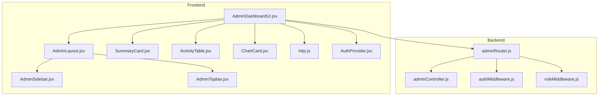
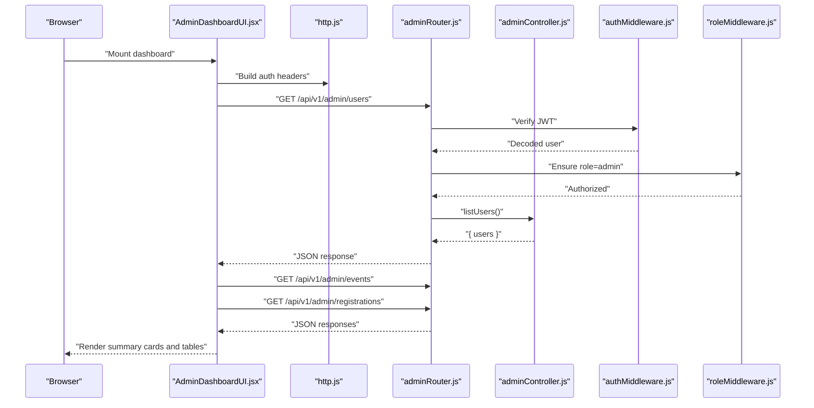
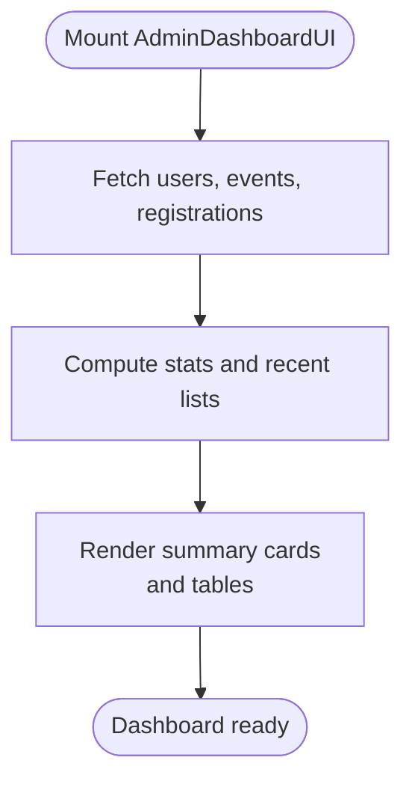
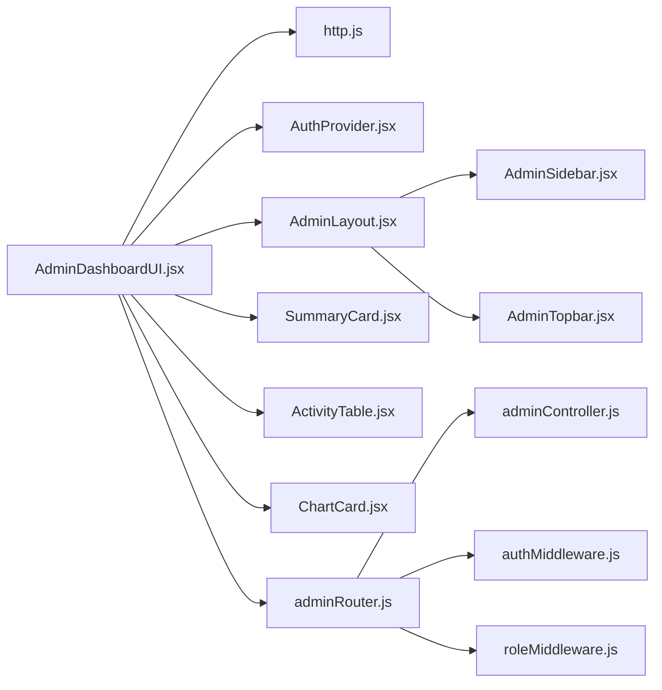

# Admin Dashboard Overview

<cite>
**Referenced Files in This Document**
- [AdminDashboardUI.jsx](file://frontend/src/pages/dashboards/AdminDashboardUI.jsx)
- [AdminDashboard.jsx](file://frontend/src/pages/dashboards/AdminDashboard.jsx)
- [AdminLayout.jsx](file://frontend/src/components/admin/AdminLayout.jsx)
- [AdminSidebar.jsx](file://frontend/src/components/admin/AdminSidebar.jsx)
- [AdminTopbar.jsx](file://frontend/src/components/admin/AdminTopbar.jsx)
- [SummaryCard.jsx](file://frontend/src/components/admin/SummaryCard.jsx)
- [ActivityTable.jsx](file://frontend/src/components/admin/ActivityTable.jsx)
- [ChartCard.jsx](file://frontend/src/components/admin/ChartCard.jsx)
- [http.js](file://frontend/src/lib/http.js)
- [AuthProvider.jsx](file://frontend/src/context/AuthProvider.jsx)
- [adminRouter.js](file://backend/router/adminRouter.js)
- [adminController.js](file://backend/controller/adminController.js)
- [authMiddleware.js](file://backend/middleware/authMiddleware.js)
- [roleMiddleware.js](file://backend/middleware/roleMiddleware.js)
</cite>

## Table of Contents
1. [Introduction](#introduction)
2. [Project Structure](#project-structure)
3. [Core Components](#core-components)
4. [Architecture Overview](#architecture-overview)
5. [Detailed Component Analysis](#detailed-component-analysis)
6. [Dependency Analysis](#dependency-analysis)
7. [Performance Considerations](#performance-considerations)
8. [Troubleshooting Guide](#troubleshooting-guide)
9. [Conclusion](#conclusion)

## Introduction
This document explains the Admin Dashboard Overview functionality, focusing on the main dashboard interface, summary statistics cards, recent activity monitoring, and key performance indicators. It documents the dashboard layout components, data visualization elements, and how real-time information is presented to provide admin oversight, quick access to critical metrics, and efficient platform monitoring. The guide covers component architecture, data fetching patterns, and UI design principles used in the admin dashboard.

## Project Structure
The Admin Dashboard Overview spans frontend React components and backend REST endpoints:
- Frontend pages and components: AdminDashboardUI, AdminDashboard, AdminLayout, AdminSidebar, AdminTopbar, SummaryCard, ActivityTable, ChartCard
- Backend routes and controllers: adminRouter, adminController
- Authentication and HTTP utilities: http.js, AuthProvider, authMiddleware, roleMiddleware

**Diagram sources**
- [AdminDashboardUI.jsx:1-124](file://frontend/src/pages/dashboards/AdminDashboardUI.jsx#L1-L124)
- [AdminLayout.jsx:1-29](file://frontend/src/components/admin/AdminLayout.jsx#L1-L29)
- [AdminSidebar.jsx:1-59](file://frontend/src/components/admin/AdminSidebar.jsx#L1-L59)
- [AdminTopbar.jsx:1-82](file://frontend/src/components/admin/AdminTopbar.jsx#L1-L82)
- [SummaryCard.jsx:1-25](file://frontend/src/components/admin/SummaryCard.jsx#L1-L25)
- [ActivityTable.jsx:1-55](file://frontend/src/components/admin/ActivityTable.jsx#L1-L55)
- [ChartCard.jsx:1-34](file://frontend/src/components/admin/ChartCard.jsx#L1-L34)
- [http.js:1-5](file://frontend/src/lib/http.js#L1-L5)
- [AuthProvider.jsx:1-38](file://frontend/src/context/AuthProvider.jsx#L1-L38)
- [adminRouter.js:1-29](file://backend/router/adminRouter.js#L1-L29)
- [adminController.js:1-194](file://backend/controller/adminController.js#L1-L194)
- [authMiddleware.js:1-17](file://backend/middleware/authMiddleware.js#L1-L17)
- [roleMiddleware.js:1-9](file://backend/middleware/roleMiddleware.js#L1-L9)

**Section sources**
- [AdminDashboardUI.jsx:1-124](file://frontend/src/pages/dashboards/AdminDashboardUI.jsx#L1-L124)
- [adminRouter.js:1-29](file://backend/router/adminRouter.js#L1-L29)

## Core Components
- AdminDashboardUI: The primary dashboard page orchestrating summary cards, recent events table, and recent activity table. It fetches users, events, and registrations concurrently, computes derived stats, and renders visual summaries.
- AdminLayout: Wraps the dashboard with sidebar navigation and topbar, providing consistent admin shell and logout flow.
- SummaryCard: Reusable card component displaying a metric with an icon and color-coded accent.
- ActivityTable: Displays recent activity rows with status badges and responsive table layout.
- ChartCard: Renders a simple bar-like chart for time-series-like data visualization.
- Backend admin endpoints: Provide users, events, registrations, and aggregated reports via protected routes.

Key responsibilities:
- Fetch and normalize data for dashboard views
- Compute high-level KPIs (users, merchants, events, bookings)
- Render recent activity and upcoming/completed events
- Enforce admin-only access using JWT and role middleware

**Section sources**
- [AdminDashboardUI.jsx:11-121](file://frontend/src/pages/dashboards/AdminDashboardUI.jsx#L11-L121)
- [AdminLayout.jsx:7-23](file://frontend/src/components/admin/AdminLayout.jsx#L7-L23)
- [SummaryCard.jsx:1-25](file://frontend/src/components/admin/SummaryCard.jsx#L1-L25)
- [ActivityTable.jsx:10-40](file://frontend/src/components/admin/ActivityTable.jsx#L10-L40)
- [ChartCard.jsx:3-34](file://frontend/src/components/admin/ChartCard.jsx#L3-L34)
- [adminController.js:9-116](file://backend/controller/adminController.js#L9-L116)

## Architecture Overview
The dashboard follows a client-server architecture:
- Frontend: React page and components render UI, manage local state, and call backend endpoints secured by JWT.
- Backend: Express routes guarded by authentication and role middleware, serving normalized data for admin analytics.

**Diagram sources**
- [AdminDashboardUI.jsx:17-31](file://frontend/src/pages/dashboards/AdminDashboardUI.jsx#L17-L31)
- [http.js:1-5](file://frontend/src/lib/http.js#L1-L5)
- [adminRouter.js:19-26](file://backend/router/adminRouter.js#L19-L26)
- [adminController.js:9-16](file://backend/controller/adminController.js#L9-L16)
- [authMiddleware.js:3-16](file://backend/middleware/authMiddleware.js#L3-L16)
- [roleMiddleware.js:1-8](file://backend/middleware/roleMiddleware.js#L1-L8)

## Detailed Component Analysis

### AdminDashboardUI: Dashboard Page
Responsibilities:
- Concurrently fetch users, events, and registrations
- Compute counts and derive KPIs (users, merchants, events, bookings)
- Prepare recent events and recent registrations lists
- Render summary cards, recent events table, and recent activity table

Data fetching pattern:
- Uses Promise.all to call three admin endpoints in parallel
- Applies authHeaders with Bearer token for each request

KPI computation:
- Counts total users and merchants
- Counts total events and registrations
- Sorts and slices recent events and registrations for display

UI rendering:
- Grid of SummaryCard components
- Left column: Recent Events table with status badges
- Right column: ActivityTable with recent registrations

**Diagram sources**
- [AdminDashboardUI.jsx:17-61](file://frontend/src/pages/dashboards/AdminDashboardUI.jsx#L17-L61)

**Section sources**
- [AdminDashboardUI.jsx:11-121](file://frontend/src/pages/dashboards/AdminDashboardUI.jsx#L11-L121)

### AdminLayout, AdminSidebar, AdminTopbar: Layout Shell
Responsibilities:
- AdminLayout: Provides container with sidebar and topbar, handles logout redirection
- AdminSidebar: Navigation menu for admin dashboards and management pages
- AdminTopbar: Header with branding, search, notifications, and profile dropdown

Integration:
- AdminDashboardUI composes AdminLayout and passes children
- Logout triggers AuthProvider logout and navigates to login

**Section sources**
- [AdminLayout.jsx:7-23](file://frontend/src/components/admin/AdminLayout.jsx#L7-L23)
- [AdminSidebar.jsx:22-47](file://frontend/src/components/admin/AdminSidebar.jsx#L22-L47)
- [AdminTopbar.jsx:8-72](file://frontend/src/components/admin/AdminTopbar.jsx#L8-L72)

### SummaryCard: Metric Card
Responsibilities:
- Display title, value, icon, and color-coded accent
- Hover scaling effect for interactive feedback
- PropTypes validation for type safety

Usage:
- Used for Total Users, Total Merchants, Total Events, Total Bookings

**Section sources**
- [SummaryCard.jsx:1-25](file://frontend/src/components/admin/SummaryCard.jsx#L1-L25)

### ActivityTable: Recent Activity
Responsibilities:
- Accepts rows with user, event, date, and status
- Renders a responsive table with status badges
- Uses PropTypes for shape validation

Usage:
- Displays recent registrations with a fixed "Confirmed" status

**Section sources**
- [ActivityTable.jsx:10-40](file://frontend/src/components/admin/ActivityTable.jsx#L10-L40)

### ChartCard: Simple Bar Chart
Responsibilities:
- Renders a bar-like visualization from data and labels
- Computes bar heights proportionally to the maximum value
- Adds hover scale effect and tooltips

Usage:
- Suitable for monthly trends or comparable series

**Section sources**
- [ChartCard.jsx:3-34](file://frontend/src/components/admin/ChartCard.jsx#L3-L34)

### Backend Admin Endpoints and Middleware
Endpoints:
- GET /admin/users, /admin/events, /admin/registrations
- GET /admin/reports (aggregated metrics)
- GET /admin/public-stats (public stats)

Security:
- auth middleware verifies JWT and attaches user info
- ensureRole("admin") enforces admin-only access

Controller logic:
- listUsers, listEventsAdmin, listRegistrationsAdmin return populated data
- getReports aggregates counts and revenue over time windows
- getPublicStats returns lightweight public metrics

**Section sources**
- [adminRouter.js:19-26](file://backend/router/adminRouter.js#L19-L26)
- [adminController.js:9-116](file://backend/controller/adminController.js#L9-L116)
- [authMiddleware.js:3-16](file://backend/middleware/authMiddleware.js#L3-L16)
- [roleMiddleware.js:1-8](file://backend/middleware/roleMiddleware.js#L1-L8)

## Dependency Analysis
Frontend dependencies:
- AdminDashboardUI depends on http.js for base URL and auth headers
- AdminDashboardUI depends on AuthProvider for token and user context
- AdminDashboardUI composes AdminLayout, SummaryCard, ActivityTable
- AdminLayout composes AdminSidebar and AdminTopbar

Backend dependencies:
- adminRouter depends on adminController handlers
- adminRouter applies authMiddleware and roleMiddleware
- Controllers depend on models and aggregation utilities

**Diagram sources**
- [AdminDashboardUI.jsx:1-10](file://frontend/src/pages/dashboards/AdminDashboardUI.jsx#L1-L10)
- [http.js:1-5](file://frontend/src/lib/http.js#L1-L5)
- [AuthProvider.jsx:1-38](file://frontend/src/context/AuthProvider.jsx#L1-L38)
- [AdminLayout.jsx:3-4](file://frontend/src/components/admin/AdminLayout.jsx#L3-L4)
- [adminRouter.js:1-29](file://backend/router/adminRouter.js#L1-L29)
- [adminController.js:1-194](file://backend/controller/adminController.js#L1-L194)
- [authMiddleware.js:1-17](file://backend/middleware/authMiddleware.js#L1-L17)
- [roleMiddleware.js:1-9](file://backend/middleware/roleMiddleware.js#L1-L9)

**Section sources**
- [AdminDashboardUI.jsx:1-10](file://frontend/src/pages/dashboards/AdminDashboardUI.jsx#L1-L10)
- [adminRouter.js:1-29](file://backend/router/adminRouter.js#L1-L29)

## Performance Considerations
- Parallel data fetching: Using Promise.all reduces total latency for users, events, and registrations.
- Local computations: Sorting and slicing recent lists occur in memory; keep slice sizes reasonable to avoid large DOM updates.
- Minimal re-renders: Memoize derived values and pass stable props to child components.
- Chart scalability: ChartCard supports arbitrary data length; consider throttling updates for very large datasets.
- Backend aggregation: Prefer server-side aggregations for heavy computations (already present in getReports).

## Troubleshooting Guide
Common issues and resolutions:
- Unauthorized access: Ensure a valid JWT is present in localStorage and passed via auth headers. Verify authMiddleware and ensureRole middleware are applied on routes.
- Empty or stale data: Confirm that AdminDashboardUI is mounting and invoking load on mount; check network tab for endpoint responses.
- Token/session mismatch: Clear browser storage and re-login; verify AuthProvider persists token and user.
- Missing icons or styles: Confirm react-icons and Tailwind classes are properly included.

**Section sources**
- [http.js:1-5](file://frontend/src/lib/http.js#L1-L5)
- [AuthProvider.jsx:9-28](file://frontend/src/context/AuthProvider.jsx#L9-L28)
- [authMiddleware.js:3-16](file://backend/middleware/authMiddleware.js#L3-L16)
- [roleMiddleware.js:1-8](file://backend/middleware/roleMiddleware.js#L1-L8)

## Conclusion
The Admin Dashboard Overview provides a concise, actionable view of platform health and activity. Its modular design separates concerns across layout, reusable cards, and data-driven tables, while secure backend endpoints deliver curated metrics. The dashboard’s real-time appearance stems from immediate data fetching upon mount, enabling administrators to oversee users, events, and bookings efficiently.