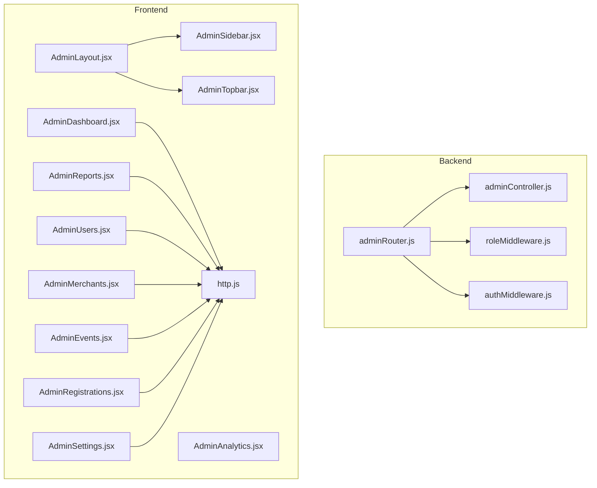
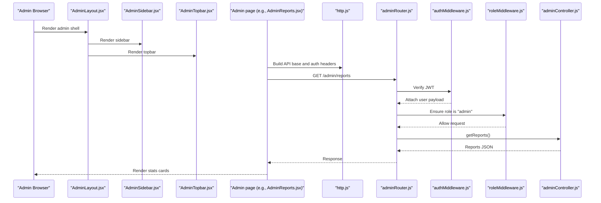
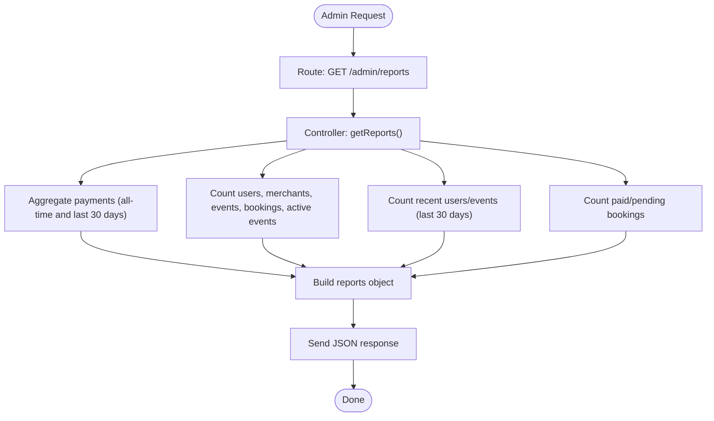
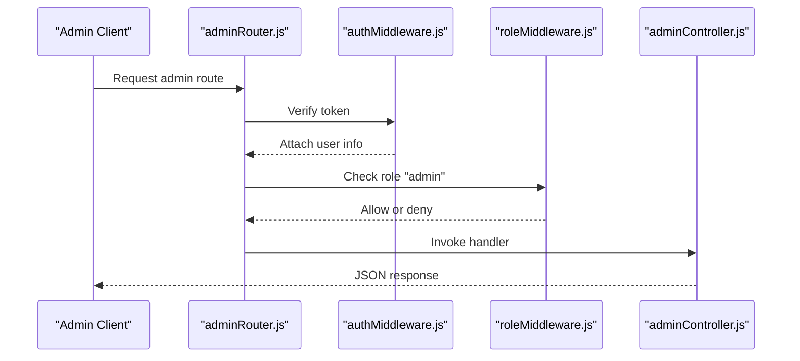
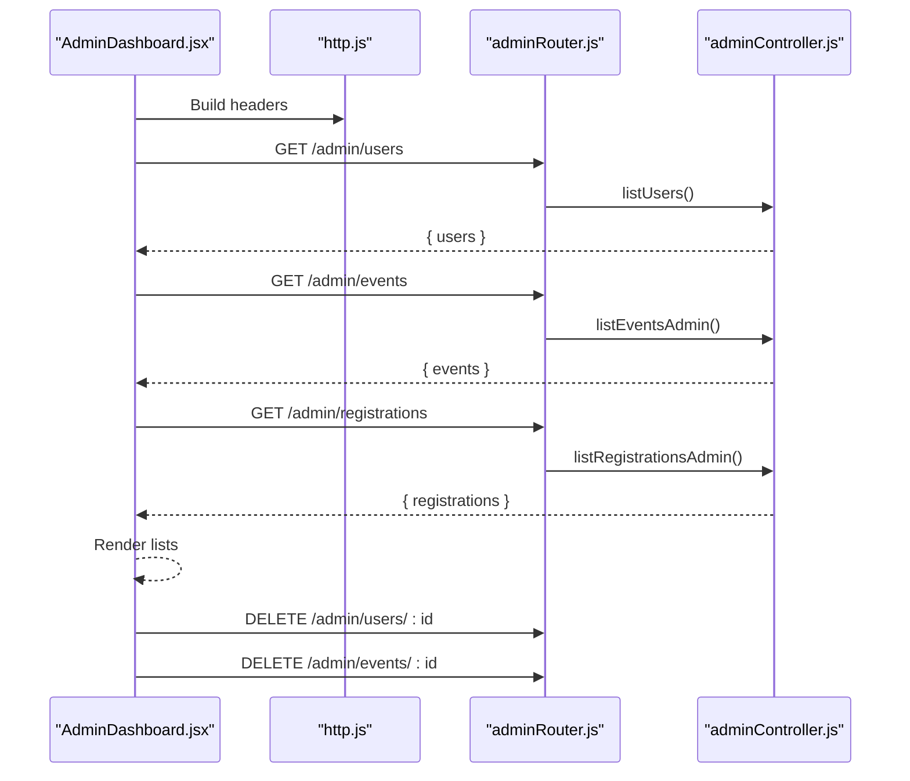
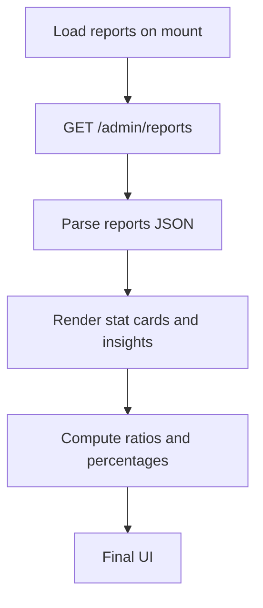
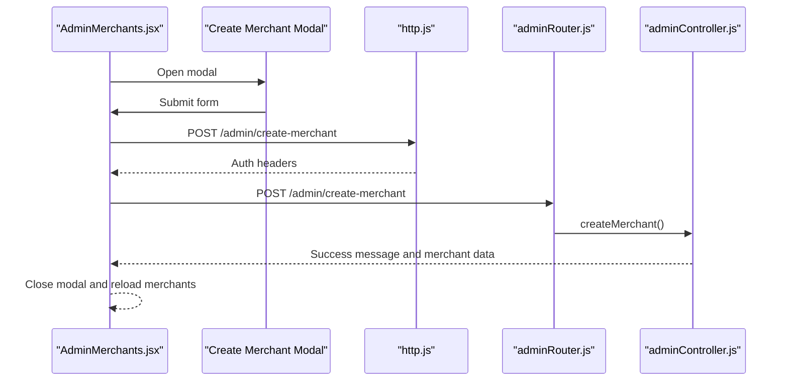
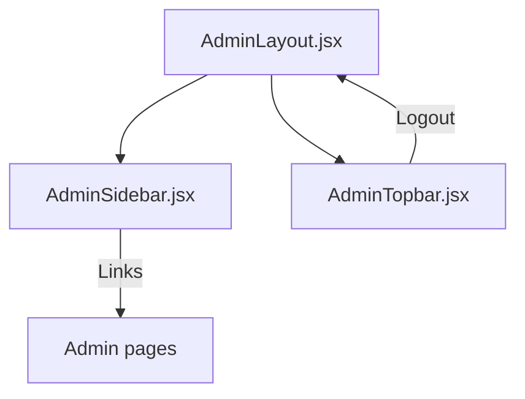
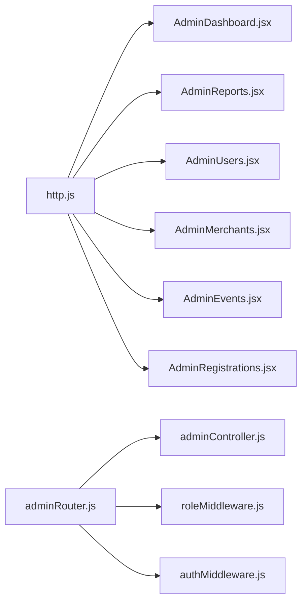

# Admin Features

<cite>
**Referenced Files in This Document**
- [adminController.js](file://backend/controller/adminController.js)
- [adminRouter.js](file://backend/router/adminRouter.js)
- [roleMiddleware.js](file://backend/middleware/roleMiddleware.js)
- [authMiddleware.js](file://backend/middleware/authMiddleware.js)
- [AdminLayout.jsx](file://frontend/src/components/admin/AdminLayout.jsx)
- [AdminSidebar.jsx](file://frontend/src/components/admin/AdminSidebar.jsx)
- [AdminTopbar.jsx](file://frontend/src/components/admin/AdminTopbar.jsx)
- [AdminDashboard.jsx](file://frontend/src/pages/dashboards/AdminDashboard.jsx)
- [AdminAnalytics.jsx](file://frontend/src/pages/dashboards/AdminAnalytics.jsx)
- [AdminReports.jsx](file://frontend/src/pages/dashboards/AdminReports.jsx)
- [AdminUsers.jsx](file://frontend/src/pages/dashboards/AdminUsers.jsx)
- [AdminMerchants.jsx](file://frontend/src/pages/dashboards/AdminMerchants.jsx)
- [AdminEvents.jsx](file://frontend/src/pages/dashboards/AdminEvents.jsx)
- [AdminRegistrations.jsx](file://frontend/src/pages/dashboards/AdminRegistrations.jsx)
- [AdminSettings.jsx](file://frontend/src/pages/dashboards/AdminSettings.jsx)
- [http.js](file://frontend/src/lib/http.js)
</cite>

## Table of Contents
1. [Introduction](#introduction)
2. [Project Structure](#project-structure)
3. [Core Components](#core-components)
4. [Architecture Overview](#architecture-overview)
5. [Detailed Component Analysis](#detailed-component-analysis)
6. [Dependency Analysis](#dependency-analysis)
7. [Performance Considerations](#performance-considerations)
8. [Troubleshooting Guide](#troubleshooting-guide)
9. [Conclusion](#conclusion)
10. [Appendices](#appendices)

## Introduction
This document describes the administrative interface for the Event Management Platform. It covers admin dashboard functionality, user and merchant management, event moderation, system analytics and reporting, and system configuration. It also documents admin-specific components, moderation tools, user verification processes, and administrative best practices. The goal is to provide a clear understanding of admin workflow patterns, permissions, and oversight responsibilities for platform management.

## Project Structure
The admin feature spans the backend controllers and routers, middleware for authentication and roles, and the frontend admin layout and pages.

- Backend
  - Controllers: admin operations (listing users, merchants, events; deleting users and events; generating reports)
  - Router: routes protected by authentication and role middleware
  - Middleware: authentication and role enforcement
- Frontend
  - Admin layout and navigation
  - Admin pages: dashboard, analytics, reports, users, merchants, events, registrations, settings

**Diagram sources**
- [adminController.js:1-194](file://backend/controller/adminController.js#L1-L194)
- [adminRouter.js:1-29](file://backend/router/adminRouter.js#L1-L29)
- [roleMiddleware.js:1-9](file://backend/middleware/roleMiddleware.js#L1-L9)
- [authMiddleware.js](file://backend/middleware/authMiddleware.js)
- [AdminLayout.jsx:1-29](file://frontend/src/components/admin/AdminLayout.jsx#L1-L29)
- [AdminSidebar.jsx:1-59](file://frontend/src/components/admin/AdminSidebar.jsx#L1-L59)
- [AdminTopbar.jsx:1-82](file://frontend/src/components/admin/AdminTopbar.jsx#L1-L82)
- [AdminDashboard.jsx:1-91](file://frontend/src/pages/dashboards/AdminDashboard.jsx#L1-L91)
- [AdminAnalytics.jsx:1-18](file://frontend/src/pages/dashboards/AdminAnalytics.jsx#L1-L18)
- [AdminReports.jsx:1-284](file://frontend/src/pages/dashboards/AdminReports.jsx#L1-L284)
- [AdminUsers.jsx:1-64](file://frontend/src/pages/dashboards/AdminUsers.jsx#L1-L64)
- [AdminMerchants.jsx:1-203](file://frontend/src/pages/dashboards/AdminMerchants.jsx#L1-L203)
- [AdminEvents.jsx:1-108](file://frontend/src/pages/dashboards/AdminEvents.jsx#L1-L108)
- [AdminRegistrations.jsx:1-54](file://frontend/src/pages/dashboards/AdminRegistrations.jsx#L1-L54)
- [AdminSettings.jsx:1-18](file://frontend/src/pages/dashboards/AdminSettings.jsx#L1-L18)
- [http.js:1-5](file://frontend/src/lib/http.js#L1-L5)

**Section sources**
- [adminController.js:1-194](file://backend/controller/adminController.js#L1-L194)
- [adminRouter.js:1-29](file://backend/router/adminRouter.js#L1-L29)
- [roleMiddleware.js:1-9](file://backend/middleware/roleMiddleware.js#L1-L9)
- [authMiddleware.js](file://backend/middleware/authMiddleware.js)
- [AdminLayout.jsx:1-29](file://frontend/src/components/admin/AdminLayout.jsx#L1-L29)
- [AdminSidebar.jsx:1-59](file://frontend/src/components/admin/AdminSidebar.jsx#L1-L59)
- [AdminTopbar.jsx:1-82](file://frontend/src/components/admin/AdminTopbar.jsx#L1-L82)
- [AdminDashboard.jsx:1-91](file://frontend/src/pages/dashboards/AdminDashboard.jsx#L1-L91)
- [AdminAnalytics.jsx:1-18](file://frontend/src/pages/dashboards/AdminAnalytics.jsx#L1-L18)
- [AdminReports.jsx:1-284](file://frontend/src/pages/dashboards/AdminReports.jsx#L1-L284)
- [AdminUsers.jsx:1-64](file://frontend/src/pages/dashboards/AdminUsers.jsx#L1-L64)
- [AdminMerchants.jsx:1-203](file://frontend/src/pages/dashboards/AdminMerchants.jsx#L1-L203)
- [AdminEvents.jsx:1-108](file://frontend/src/pages/dashboards/AdminEvents.jsx#L1-L108)
- [AdminRegistrations.jsx:1-54](file://frontend/src/pages/dashboards/AdminRegistrations.jsx#L1-L54)
- [AdminSettings.jsx:1-18](file://frontend/src/pages/dashboards/AdminSettings.jsx#L1-L18)
- [http.js:1-5](file://frontend/src/lib/http.js#L1-L5)

## Core Components
- Admin controller functions implement CRUD-like operations for users and events, merchant creation, and report generation.
- Admin router enforces authentication and role checks before exposing admin endpoints.
- Admin layout and navigation provide a consistent admin UI shell.
- Admin pages implement specific views for dashboard, analytics, reports, users, merchants, events, registrations, and settings.

Key responsibilities:
- User management: list users and delete users.
- Merchant management: list merchants and create new merchants.
- Event moderation: list events and delete events (and associated registrations).
- Reporting: compute platform-wide statistics and revenue metrics.
- Public stats: expose basic platform counts for public consumption.

**Section sources**
- [adminController.js:9-194](file://backend/controller/adminController.js#L9-L194)
- [adminRouter.js:18-26](file://backend/router/adminRouter.js#L18-L26)
- [AdminLayout.jsx:1-29](file://frontend/src/components/admin/AdminLayout.jsx#L1-L29)
- [AdminSidebar.jsx:1-59](file://frontend/src/components/admin/AdminSidebar.jsx#L1-L59)
- [AdminTopbar.jsx:1-82](file://frontend/src/components/admin/AdminTopbar.jsx#L1-L82)
- [AdminDashboard.jsx:1-91](file://frontend/src/pages/dashboards/AdminDashboard.jsx#L1-L91)
- [AdminReports.jsx:1-284](file://frontend/src/pages/dashboards/AdminReports.jsx#L1-L284)
- [AdminUsers.jsx:1-64](file://frontend/src/pages/dashboards/AdminUsers.jsx#L1-L64)
- [AdminMerchants.jsx:1-203](file://frontend/src/pages/dashboards/AdminMerchants.jsx#L1-L203)
- [AdminEvents.jsx:1-108](file://frontend/src/pages/dashboards/AdminEvents.jsx#L1-L108)
- [AdminRegistrations.jsx:1-54](file://frontend/src/pages/dashboards/AdminRegistrations.jsx#L1-L54)
- [AdminSettings.jsx:1-18](file://frontend/src/pages/dashboards/AdminSettings.jsx#L1-L18)

## Architecture Overview
The admin feature follows a layered architecture:
- Frontend admin pages communicate with backend endpoints via authenticated requests.
- Backend routes are protected by authentication and role middleware to ensure only admins can access admin endpoints.
- Admin controller aggregates data from models and returns structured responses.

**Diagram sources**
- [AdminLayout.jsx:1-29](file://frontend/src/components/admin/AdminLayout.jsx#L1-L29)
- [AdminSidebar.jsx:1-59](file://frontend/src/components/admin/AdminSidebar.jsx#L1-L59)
- [AdminTopbar.jsx:1-82](file://frontend/src/components/admin/AdminTopbar.jsx#L1-L82)
- [AdminReports.jsx:1-284](file://frontend/src/pages/dashboards/AdminReports.jsx#L1-L284)
- [http.js:1-5](file://frontend/src/lib/http.js#L1-L5)
- [adminRouter.js:1-29](file://backend/router/adminRouter.js#L1-L29)
- [authMiddleware.js](file://backend/middleware/authMiddleware.js)
- [roleMiddleware.js:1-9](file://backend/middleware/roleMiddleware.js#L1-L9)
- [adminController.js:118-177](file://backend/controller/adminController.js#L118-L177)

## Detailed Component Analysis

### Admin Controller Functions
The admin controller exposes endpoints for:
- Listing users and merchants
- Deleting users
- Listing events and deleting events (with cascading deletion of registrations)
- Listing registrations
- Generating reports (counts, revenue, activity)
- Fetching public stats

Implementation highlights:
- Uses model queries to fetch collections and aggregate revenue.
- Returns standardized success/error responses.
- Sends merchant credentials via email upon creation.

**Diagram sources**
- [adminController.js:118-177](file://backend/controller/adminController.js#L118-L177)

**Section sources**
- [adminController.js:9-194](file://backend/controller/adminController.js#L9-L194)

### Admin Router and Permissions
The admin router enforces:
- Authentication for all admin endpoints.
- Role enforcement ensuring only users with role "admin" can access admin routes.
- Public stats endpoint exposed without role enforcement.

**Diagram sources**
- [adminRouter.js:1-29](file://backend/router/adminRouter.js#L1-L29)
- [roleMiddleware.js:1-9](file://backend/middleware/roleMiddleware.js#L1-L9)
- [authMiddleware.js](file://backend/middleware/authMiddleware.js)
- [adminController.js:1-194](file://backend/controller/adminController.js#L1-L194)

**Section sources**
- [adminRouter.js:1-29](file://backend/router/adminRouter.js#L1-L29)
- [roleMiddleware.js:1-9](file://backend/middleware/roleMiddleware.js#L1-L9)

### Admin Dashboard
The dashboard page loads users, events, and registrations concurrently and renders them in lists. It supports deleting users and events and updates the UI accordingly.

**Diagram sources**
- [AdminDashboard.jsx:1-91](file://frontend/src/pages/dashboards/AdminDashboard.jsx#L1-L91)
- [http.js:1-5](file://frontend/src/lib/http.js#L1-L5)
- [adminRouter.js:1-29](file://backend/router/adminRouter.js#L1-L29)
- [adminController.js:9-116](file://backend/controller/adminController.js#L9-L116)

**Section sources**
- [AdminDashboard.jsx:1-91](file://frontend/src/pages/dashboards/AdminDashboard.jsx#L1-L91)

### Admin Reports and Analytics
The reports page fetches aggregated metrics and displays them in stat cards. It computes derived insights such as ratios and percentages.

**Diagram sources**
- [AdminReports.jsx:1-284](file://frontend/src/pages/dashboards/AdminReports.jsx#L1-L284)
- [adminController.js:118-177](file://backend/controller/adminController.js#L118-L177)

**Section sources**
- [AdminReports.jsx:1-284](file://frontend/src/pages/dashboards/AdminReports.jsx#L1-L284)
- [adminController.js:118-177](file://backend/controller/adminController.js#L118-L177)

### Admin Users Management
The users page lists all users with role, business name, service type, and status. It currently does not implement editing or verification actions in the provided code.

**Section sources**
- [AdminUsers.jsx:1-64](file://frontend/src/pages/dashboards/AdminUsers.jsx#L1-L64)

### Admin Merchants Management
The merchants page lists merchants and allows creating new ones via a modal form. Validation ensures required fields are present and the password meets length requirements. On success, the page refreshes the merchant list.

**Diagram sources**
- [AdminMerchants.jsx:1-203](file://frontend/src/pages/dashboards/AdminMerchants.jsx#L1-L203)
- [http.js:1-5](file://frontend/src/lib/http.js#L1-L5)
- [adminRouter.js](file://backend/router/adminRouter.js#L21)
- [adminController.js:27-77](file://backend/controller/adminController.js#L27-L77)

**Section sources**
- [AdminMerchants.jsx:1-203](file://frontend/src/pages/dashboards/AdminMerchants.jsx#L1-L203)
- [adminController.js:27-77](file://backend/controller/adminController.js#L27-L77)

### Admin Events Moderation
The events page lists events with metadata such as category, price, rating, features, and merchant. Deletion removes the event and associated registrations.

**Section sources**
- [AdminEvents.jsx:1-108](file://frontend/src/pages/dashboards/AdminEvents.jsx#L1-L108)
- [adminController.js:89-107](file://backend/controller/adminController.js#L89-L107)

### Admin Registrations Oversight
The registrations page lists all user registrations across events with user and event details.

**Section sources**
- [AdminRegistrations.jsx:1-54](file://frontend/src/pages/dashboards/AdminRegistrations.jsx#L1-L54)
- [adminController.js:109-116](file://backend/controller/adminController.js#L109-L116)

### Admin Settings
The settings page is a placeholder for future admin configuration options.

**Section sources**
- [AdminSettings.jsx:1-18](file://frontend/src/pages/dashboards/AdminSettings.jsx#L1-L18)

### Admin UI Shell
The admin layout composes the sidebar and topbar and handles logout. The sidebar links to dashboard, users, merchants, events, registrations, services, and settings. The topbar includes profile and logout actions.

**Diagram sources**
- [AdminLayout.jsx:1-29](file://frontend/src/components/admin/AdminLayout.jsx#L1-L29)
- [AdminSidebar.jsx:1-59](file://frontend/src/components/admin/AdminSidebar.jsx#L1-L59)
- [AdminTopbar.jsx:1-82](file://frontend/src/components/admin/AdminTopbar.jsx#L1-L82)

**Section sources**
- [AdminLayout.jsx:1-29](file://frontend/src/components/admin/AdminLayout.jsx#L1-L29)
- [AdminSidebar.jsx:1-59](file://frontend/src/components/admin/AdminSidebar.jsx#L1-L59)
- [AdminTopbar.jsx:1-82](file://frontend/src/components/admin/AdminTopbar.jsx#L1-L82)

## Dependency Analysis
- Frontend admin pages depend on shared HTTP utilities for API base URL and auth headers.
- Admin router depends on authentication and role middleware to protect endpoints.
- Admin controller depends on models for data retrieval and aggregation.
- Admin pages render data returned by admin controller handlers.

**Diagram sources**
- [http.js:1-5](file://frontend/src/lib/http.js#L1-L5)
- [AdminDashboard.jsx:1-91](file://frontend/src/pages/dashboards/AdminDashboard.jsx#L1-L91)
- [AdminReports.jsx:1-284](file://frontend/src/pages/dashboards/AdminReports.jsx#L1-L284)
- [AdminUsers.jsx:1-64](file://frontend/src/pages/dashboards/AdminUsers.jsx#L1-L64)
- [AdminMerchants.jsx:1-203](file://frontend/src/pages/dashboards/AdminMerchants.jsx#L1-L203)
- [AdminEvents.jsx:1-108](file://frontend/src/pages/dashboards/AdminEvents.jsx#L1-L108)
- [AdminRegistrations.jsx:1-54](file://frontend/src/pages/dashboards/AdminRegistrations.jsx#L1-L54)
- [adminRouter.js:1-29](file://backend/router/adminRouter.js#L1-L29)
- [adminController.js:1-194](file://backend/controller/adminController.js#L1-L194)
- [roleMiddleware.js:1-9](file://backend/middleware/roleMiddleware.js#L1-L9)
- [authMiddleware.js](file://backend/middleware/authMiddleware.js)

**Section sources**
- [http.js:1-5](file://frontend/src/lib/http.js#L1-L5)
- [adminRouter.js:1-29](file://backend/router/adminRouter.js#L1-L29)
- [adminController.js:1-194](file://backend/controller/adminController.js#L1-L194)
- [roleMiddleware.js:1-9](file://backend/middleware/roleMiddleware.js#L1-L9)
- [authMiddleware.js](file://backend/middleware/authMiddleware.js)

## Performance Considerations
- Aggregated report queries use parallel execution to minimize latency when fetching counts and revenue.
- Dashboard loads users, events, and registrations concurrently to reduce perceived loading time.
- Consider pagination for large datasets (users, events, registrations) to avoid heavy client rendering and large payloads.

[No sources needed since this section provides general guidance]

## Troubleshooting Guide
Common issues and resolutions:
- Authentication failures: Ensure the admin client includes a valid bearer token in Authorization headers.
- Role denied errors: Confirm the logged-in user has role "admin".
- Report loading errors: Verify the backend endpoint is reachable and the database is populated with data.
- Merchant creation errors: Validate form inputs and confirm the email is not already taken.

**Section sources**
- [roleMiddleware.js:3-5](file://backend/middleware/roleMiddleware.js#L3-L5)
- [AdminReports.jsx:27-44](file://frontend/src/pages/dashboards/AdminReports.jsx#L27-L44)
- [AdminMerchants.jsx:36-66](file://frontend/src/pages/dashboards/AdminMerchants.jsx#L36-L66)

## Conclusion
The admin feature provides a focused set of tools for oversight and moderation: user and merchant management, event moderation, reporting, and configuration. The backend enforces strict authentication and role checks, while the frontend delivers a consistent admin shell and specialized pages. Extending the system with additional verification workflows, bulk actions, and richer analytics would further strengthen administrative capabilities.

[No sources needed since this section summarizes without analyzing specific files]

## Appendices

### Admin Workflow Patterns
- Dashboard overview: Load users, events, and registrations in parallel.
- Moderation: Delete users or events with appropriate confirmations; cascading deletions clean up related records.
- Reporting: Fetch aggregated metrics and derive insights for decision-making.
- Merchant onboarding: Create merchant accounts with generated credentials and notify via email.

**Section sources**
- [AdminDashboard.jsx:12-26](file://frontend/src/pages/dashboards/AdminDashboard.jsx#L12-L26)
- [adminController.js:79-107](file://backend/controller/adminController.js#L79-L107)
- [AdminReports.jsx:23-44](file://frontend/src/pages/dashboards/AdminReports.jsx#L23-L44)
- [adminController.js:27-77](file://backend/controller/adminController.js#L27-L77)

### Permission Systems and Security Considerations
- Authentication: All admin endpoints require a valid JWT.
- Authorization: Only users with role "admin" can access admin routes.
- Email notifications: Merchant creation sends credentials via email; ensure secure transport and prompt password changes.
- Input validation: Merchant creation validates required fields and password length.

**Section sources**
- [adminRouter.js:19-26](file://backend/router/adminRouter.js#L19-L26)
- [roleMiddleware.js:1-9](file://backend/middleware/roleMiddleware.js#L1-L9)
- [adminController.js:27-77](file://backend/controller/adminController.js#L27-L77)

### Administrative Best Practices
- Regular audits: Periodically review users, merchants, and events.
- Data hygiene: Remove inactive or spam accounts and events.
- Monitoring: Track report metrics to identify trends and anomalies.
- Access control: Limit admin privileges and rotate credentials.

[No sources needed since this section provides general guidance]