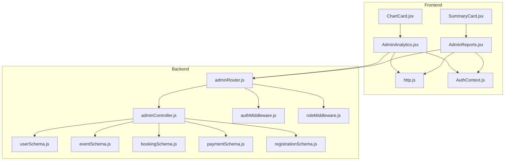
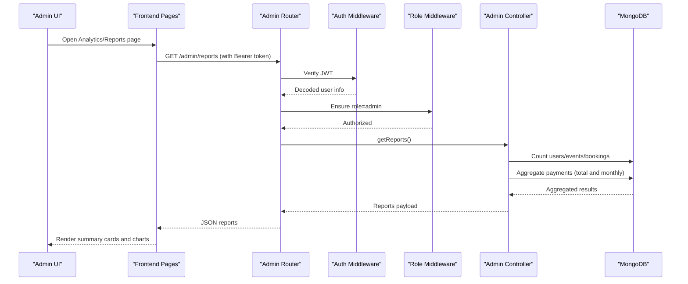
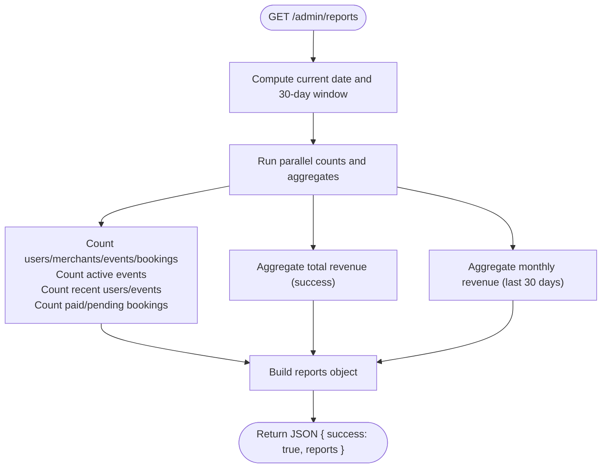
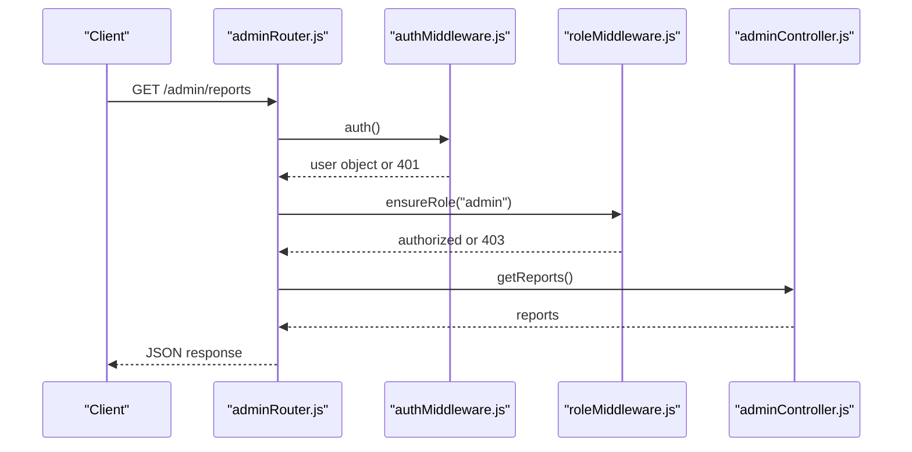
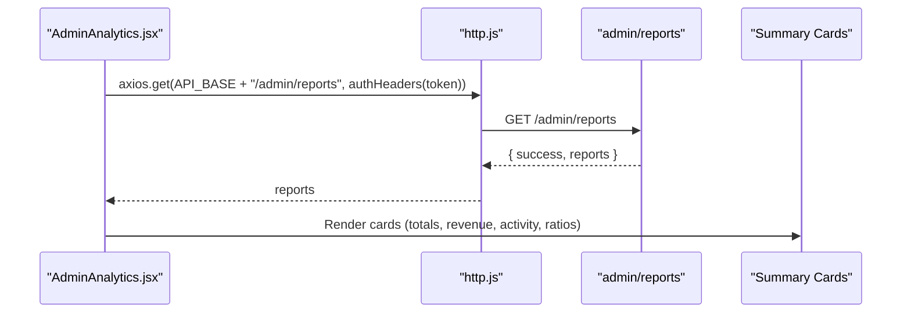
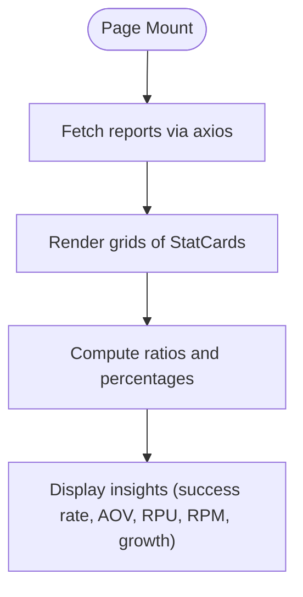
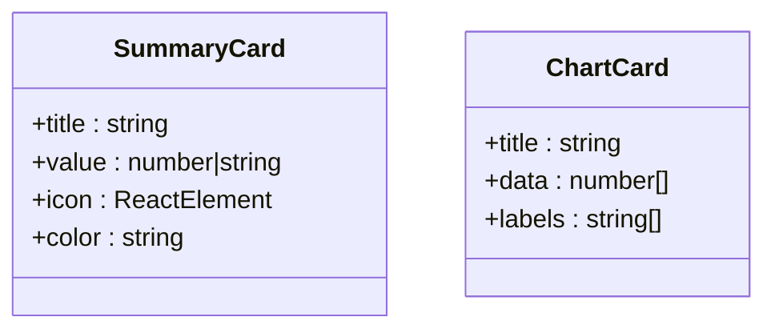
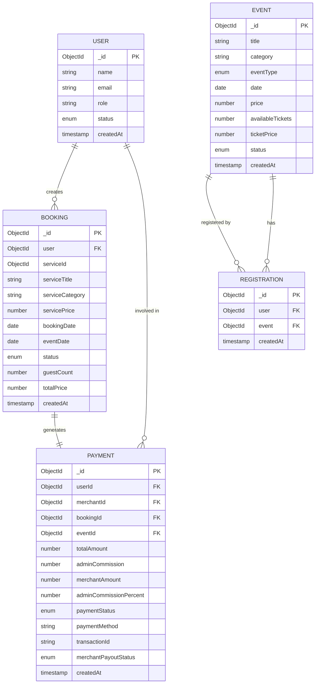
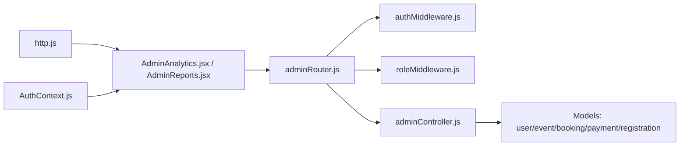

# Analytics and Reporting

<cite>
**Referenced Files in This Document**
- [adminRouter.js](file://backend/router/adminRouter.js)
- [adminController.js](file://backend/controller/adminController.js)
- [authMiddleware.js](file://backend/middleware/authMiddleware.js)
- [roleMiddleware.js](file://backend/middleware/roleMiddleware.js)
- [AdminAnalytics.jsx](file://frontend/src/pages/dashboards/AdminAnalytics.jsx)
- [AdminReports.jsx](file://frontend/src/pages/dashboards/AdminReports.jsx)
- [ChartCard.jsx](file://frontend/src/components/admin/ChartCard.jsx)
- [SummaryCard.jsx](file://frontend/src/components/admin/SummaryCard.jsx)
- [userSchema.js](file://backend/models/userSchema.js)
- [eventSchema.js](file://backend/models/eventSchema.js)
- [bookingSchema.js](file://backend/models/bookingSchema.js)
- [paymentSchema.js](file://backend/models/paymentSchema.js)
- [registrationSchema.js](file://backend/models/registrationSchema.js)
- [http.js](file://frontend/src/lib/http.js)
- [AuthContext.js](file://frontend/src/context/AuthContext.js)
</cite>

## Table of Contents
1. [Introduction](#introduction)
2. [Project Structure](#project-structure)
3. [Core Components](#core-components)
4. [Architecture Overview](#architecture-overview)
5. [Detailed Component Analysis](#detailed-component-analysis)
6. [Dependency Analysis](#dependency-analysis)
7. [Performance Considerations](#performance-considerations)
8. [Troubleshooting Guide](#troubleshooting-guide)
9. [Conclusion](#conclusion)
10. [Appendices](#appendices)

## Introduction
This document describes the Admin Analytics and Reporting system for the Event Management Platform. It covers how platform metrics are collected, how data is visualized in admin dashboards, and how performance analytics are presented. The system provides user engagement metrics, revenue tracking, event analytics, and business intelligence summaries. It also outlines dashboard widgets, custom report generation, and data export capabilities. Finally, it addresses data privacy considerations, reporting security, and compliance requirements for analytics data.

## Project Structure
The Analytics and Reporting system spans the backend API and frontend dashboards:
- Backend routes expose admin analytics endpoints protected by authentication and role checks.
- Controllers compute aggregated metrics from MongoDB collections.
- Frontend dashboards fetch analytics data and render summary cards and charts.
- Data models define the entities used for analytics (users, events, bookings, payments, registrations).

**Diagram sources**
- [adminRouter.js:1-29](file://backend/router/adminRouter.js#L1-L29)
- [adminController.js:118-177](file://backend/controller/adminController.js#L118-L177)
- [AdminAnalytics.jsx:1-94](file://frontend/src/pages/dashboards/AdminAnalytics.jsx#L1-L94)
- [AdminReports.jsx:1-284](file://frontend/src/pages/dashboards/AdminReports.jsx#L1-L284)
- [ChartCard.jsx:1-34](file://frontend/src/components/admin/ChartCard.jsx#L1-L34)
- [SummaryCard.jsx:1-25](file://frontend/src/components/admin/SummaryCard.jsx#L1-L25)
- [userSchema.js:1-55](file://backend/models/userSchema.js#L1-L55)
- [eventSchema.js:1-51](file://backend/models/eventSchema.js#L1-L51)
- [bookingSchema.js:1-53](file://backend/models/bookingSchema.js#L1-L53)
- [paymentSchema.js:1-142](file://backend/models/paymentSchema.js#L1-L142)
- [registrationSchema.js:1-12](file://backend/models/registrationSchema.js#L1-L12)

**Section sources**
- [adminRouter.js:1-29](file://backend/router/adminRouter.js#L1-L29)
- [adminController.js:118-177](file://backend/controller/adminController.js#L118-L177)
- [AdminAnalytics.jsx:1-94](file://frontend/src/pages/dashboards/AdminAnalytics.jsx#L1-L94)
- [AdminReports.jsx:1-284](file://frontend/src/pages/dashboards/AdminReports.jsx#L1-L284)
- [ChartCard.jsx:1-34](file://frontend/src/components/admin/ChartCard.jsx#L1-L34)
- [SummaryCard.jsx:1-25](file://frontend/src/components/admin/SummaryCard.jsx#L1-L25)

## Core Components
- Admin Analytics Endpoint: Returns platform-wide metrics including totals, recent activity, bookings, and revenue.
- Admin Reports Page: Renders comprehensive statistics and ratios for platform health and performance.
- Dashboard Widgets: Summary cards and bar chart components for quick insights.
- Authentication and Authorization: JWT-based auth and role enforcement for admin-only access.
- Data Models: User, Event, Booking, Payment, and Registration schemas used for aggregations.

Key metrics exposed by the system:
- Totals: Users, Merchants, Events, Bookings
- Activity: Active Events, New Users (30 days), New Events (30 days)
- Payments: Paid Bookings, Pending Bookings, Total Revenue, Monthly Revenue
- Ratios: Users per Merchant, Events per Merchant, Bookings per Event, Payment Success Rate, Average Booking Value, Revenue per User, Revenue per Merchant, Monthly Growth share

**Section sources**
- [adminController.js:118-177](file://backend/controller/adminController.js#L118-L177)
- [AdminAnalytics.jsx:50-81](file://frontend/src/pages/dashboards/AdminAnalytics.jsx#L50-L81)
- [AdminReports.jsx:84-271](file://frontend/src/pages/dashboards/AdminReports.jsx#L84-L271)
- [authMiddleware.js:1-17](file://backend/middleware/authMiddleware.js#L1-L17)
- [roleMiddleware.js:1-9](file://backend/middleware/roleMiddleware.js#L1-L9)

## Architecture Overview
The analytics pipeline follows a clear separation of concerns:
- Frontend dashboards request analytics via authenticated endpoints.
- Backend enforces admin-only access and computes aggregates from MongoDB collections.
- Aggregations leverage count and aggregation pipelines for efficient metric computation.

**Diagram sources**
- [adminRouter.js:26](file://backend/router/adminRouter.js#L26)
- [authMiddleware.js:3-16](file://backend/middleware/authMiddleware.js#L3-L16)
- [roleMiddleware.js:1-8](file://backend/middleware/roleMiddleware.js#L1-L8)
- [adminController.js:118-177](file://backend/controller/adminController.js#L118-L177)
- [AdminAnalytics.jsx:13-18](file://frontend/src/pages/dashboards/AdminAnalytics.jsx#L13-L18)
- [AdminReports.jsx:23-44](file://frontend/src/pages/dashboards/AdminReports.jsx#L23-L44)

## Detailed Component Analysis

### Backend: Admin Analytics Controller
The controller endpoint performs concurrent counts and aggregations:
- Counts for users, merchants, events, bookings, active events, recent users, recent events, paid bookings, and pending bookings.
- Aggregates total and monthly revenue from the Payment collection where paymentStatus equals success.
- Returns a structured reports object consumed by the frontend.

**Diagram sources**
- [adminController.js:118-177](file://backend/controller/adminController.js#L118-L177)

**Section sources**
- [adminController.js:118-177](file://backend/controller/adminController.js#L118-L177)

### Backend: Admin Router and Security
- The route for reports is protected by JWT authentication and admin role enforcement.
- Public stats are exposed via a separate endpoint for non-admin contexts.

**Diagram sources**
- [adminRouter.js:26](file://backend/router/adminRouter.js#L26)
- [authMiddleware.js:3-16](file://backend/middleware/authMiddleware.js#L3-L16)
- [roleMiddleware.js:1-8](file://backend/middleware/roleMiddleware.js#L1-L8)

**Section sources**
- [adminRouter.js:18-26](file://backend/router/adminRouter.js#L18-L26)
- [authMiddleware.js:1-17](file://backend/middleware/authMiddleware.js#L1-L17)
- [roleMiddleware.js:1-9](file://backend/middleware/roleMiddleware.js#L1-L9)

### Frontend: Admin Analytics Page
- Fetches reports on mount using authenticated requests.
- Renders summary cards for key metrics and activity ratios.
- Uses a helper to format Indian Rupees.

**Diagram sources**
- [AdminAnalytics.jsx:13-18](file://frontend/src/pages/dashboards/AdminAnalytics.jsx#L13-L18)
- [http.js](file://frontend/src/lib/http.js)
- [AdminAnalytics.jsx:50-81](file://frontend/src/pages/dashboards/AdminAnalytics.jsx#L50-L81)

**Section sources**
- [AdminAnalytics.jsx:1-94](file://frontend/src/pages/dashboards/AdminAnalytics.jsx#L1-L94)

### Frontend: Admin Reports Page
- Comprehensive dashboard with multiple stat grids and ratio insights.
- Calculates derived metrics such as payment success rate, average booking value, revenue per user, revenue per merchant, and monthly growth share.

**Diagram sources**
- [AdminReports.jsx:23-44](file://frontend/src/pages/dashboards/AdminReports.jsx#L23-L44)
- [AdminReports.jsx:84-271](file://frontend/src/pages/dashboards/AdminReports.jsx#L84-L271)

**Section sources**
- [AdminReports.jsx:1-284](file://frontend/src/pages/dashboards/AdminReports.jsx#L1-L284)

### Frontend: Dashboard Widgets
- SummaryCard: Reusable card component for displaying metrics with icons and colors.
- ChartCard: Bar chart widget for simple time-series-like bars (e.g., last 6 months).

**Diagram sources**
- [SummaryCard.jsx:1-25](file://frontend/src/components/admin/SummaryCard.jsx#L1-L25)
- [ChartCard.jsx:1-34](file://frontend/src/components/admin/ChartCard.jsx#L1-L34)

**Section sources**
- [SummaryCard.jsx:1-25](file://frontend/src/components/admin/SummaryCard.jsx#L1-L25)
- [ChartCard.jsx:1-34](file://frontend/src/components/admin/ChartCard.jsx#L1-L34)

### Data Models and Metrics Mapping
The analytics rely on the following models:
- User: roles (user/admin/merchant), timestamps for activity.
- Event: categories, dates, ticketing fields, status.
- Booking: service/event references, pricing, status, timestamps.
- Payment: amounts, statuses, methods, timestamps, and payout fields.
- Registration: user-event relationships.

**Diagram sources**
- [userSchema.js:1-55](file://backend/models/userSchema.js#L1-L55)
- [eventSchema.js:1-51](file://backend/models/eventSchema.js#L1-L51)
- [bookingSchema.js:1-53](file://backend/models/bookingSchema.js#L1-L53)
- [paymentSchema.js:1-142](file://backend/models/paymentSchema.js#L1-L142)
- [registrationSchema.js:1-12](file://backend/models/registrationSchema.js#L1-L12)

**Section sources**
- [userSchema.js:1-55](file://backend/models/userSchema.js#L1-L55)
- [eventSchema.js:1-51](file://backend/models/eventSchema.js#L1-L51)
- [bookingSchema.js:1-53](file://backend/models/bookingSchema.js#L1-L53)
- [paymentSchema.js:1-142](file://backend/models/paymentSchema.js#L1-L142)
- [registrationSchema.js:1-12](file://backend/models/registrationSchema.js#L1-L12)

## Dependency Analysis
- Frontend depends on:
  - http.js for base URL and auth headers.
  - AuthContext for JWT retrieval.
  - Dashboard pages for rendering.
- Backend depends on:
  - Authentication and role middleware for access control.
  - Models for data access and aggregation.
- No circular dependencies observed between analytics components.

**Diagram sources**
- [http.js](file://frontend/src/lib/http.js)
- [AuthContext.js](file://frontend/src/context/AuthContext.js)
- [AdminAnalytics.jsx:1-94](file://frontend/src/pages/dashboards/AdminAnalytics.jsx#L1-L94)
- [AdminReports.jsx:1-284](file://frontend/src/pages/dashboards/AdminReports.jsx#L1-L284)
- [adminRouter.js:1-29](file://backend/router/adminRouter.js#L1-L29)
- [authMiddleware.js:1-17](file://backend/middleware/authMiddleware.js#L1-L17)
- [roleMiddleware.js:1-9](file://backend/middleware/roleMiddleware.js#L1-L9)
- [adminController.js:118-177](file://backend/controller/adminController.js#L118-L177)
- [userSchema.js:1-55](file://backend/models/userSchema.js#L1-L55)
- [eventSchema.js:1-51](file://backend/models/eventSchema.js#L1-L51)
- [bookingSchema.js:1-53](file://backend/models/bookingSchema.js#L1-L53)
- [paymentSchema.js:1-142](file://backend/models/paymentSchema.js#L1-L142)
- [registrationSchema.js:1-12](file://backend/models/registrationSchema.js#L1-L12)

**Section sources**
- [adminRouter.js:1-29](file://backend/router/adminRouter.js#L1-L29)
- [adminController.js:118-177](file://backend/controller/adminController.js#L118-L177)
- [AdminAnalytics.jsx:1-94](file://frontend/src/pages/dashboards/AdminAnalytics.jsx#L1-L94)
- [AdminReports.jsx:1-284](file://frontend/src/pages/dashboards/AdminReports.jsx#L1-L284)

## Performance Considerations
- Concurrent Aggregations: The controller uses parallel operations for counts and aggregates to minimize round trips and reduce latency.
- Efficient Queries: Aggregation pipelines filter by paymentStatus and date ranges to limit scanned documents.
- Indexes: Payment schema defines indexes on frequently queried fields (userId, merchantId, bookingId, transactionId, paymentStatus) to improve query performance.
- Frontend Rendering: Summary cards and charts are lightweight; consider virtualization for very large datasets if needed.

Recommendations:
- Add database indexes on User and Event createdAt fields for recent activity filters.
- Consider caching periodic analytics snapshots for read-heavy dashboards.
- Paginate or cap time windows for revenue and activity charts to avoid large scans.

**Section sources**
- [adminController.js:133-156](file://backend/controller/adminController.js#L133-L156)
- [paymentSchema.js:122-127](file://backend/models/paymentSchema.js#L122-L127)

## Troubleshooting Guide
Common issues and resolutions:
- Unauthorized Access: Ensure a valid Bearer token is included in the request headers. The auth middleware validates tokens and rejects missing or invalid ones.
- Forbidden Access: Confirm the user role is admin; the role middleware enforces admin-only access to analytics endpoints.
- Empty Reports: If reports are null or empty, verify platform activity (users, events, bookings, payments) and that paymentStatus is success for revenue calculations.
- Network Errors: Check API_BASE and authHeaders configuration in http.js and ensure the frontend is passing the token from AuthContext.

**Section sources**
- [authMiddleware.js:3-16](file://backend/middleware/authMiddleware.js#L3-L16)
- [roleMiddleware.js:1-8](file://backend/middleware/roleMiddleware.js#L1-L8)
- [http.js](file://frontend/src/lib/http.js)
- [AuthContext.js](file://frontend/src/context/AuthContext.js)

## Conclusion
The Admin Analytics and Reporting system provides a secure, efficient, and user-friendly way to monitor platform performance. It leverages concurrent aggregations and reusable UI components to deliver actionable insights. With proper authentication, role enforcement, and model-driven metrics, the system supports informed decision-making and operational oversight.

## Appendices

### API Definitions
- GET /admin/reports
  - Authentication: Bearer token required
  - Authorization: admin role required
  - Response: success flag and reports object containing totals, activity, bookings, and revenue metrics

**Section sources**
- [adminRouter.js:26](file://backend/router/adminRouter.js#L26)
- [authMiddleware.js:3-16](file://backend/middleware/authMiddleware.js#L3-L16)
- [roleMiddleware.js:1-8](file://backend/middleware/roleMiddleware.js#L1-L8)
- [adminController.js:118-177](file://backend/controller/adminController.js#L118-L177)

### Data Privacy, Security, and Compliance Notes
- Access Control: Admin-only endpoints prevent unauthorized access to analytics data.
- Token-Based Auth: JWT ensures session integrity and prevents CSRF for API calls.
- Data Minimization: Reports exclude sensitive fields (e.g., user passwords).
- Audit Trail: Timestamps and payment metadata support traceability.
- Recommendations:
  - Enforce HTTPS in production.
  - Rotate JWT secrets regularly.
  - Log analytics access attempts for audit.
  - Consider anonymizing or aggregating data for external sharing.
  - Comply with regional data protection regulations for user and financial data.

[No sources needed since this section provides general guidance]