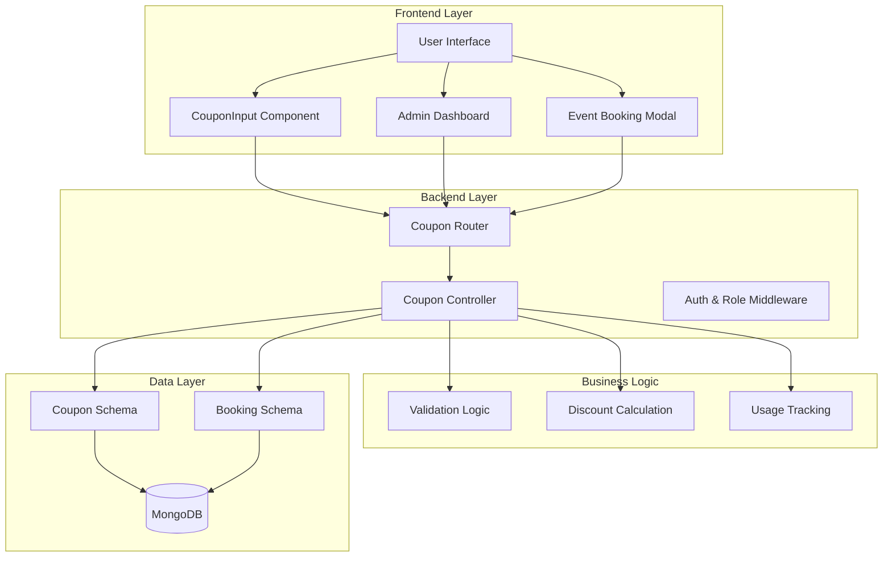
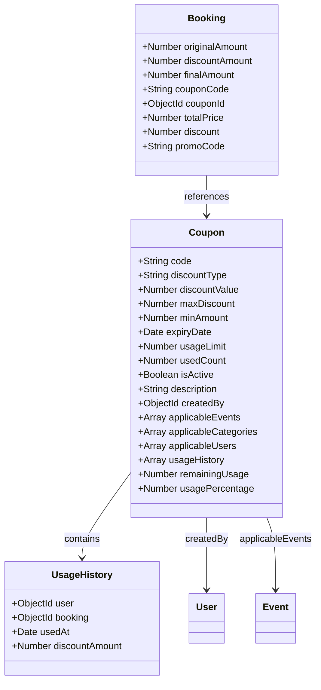
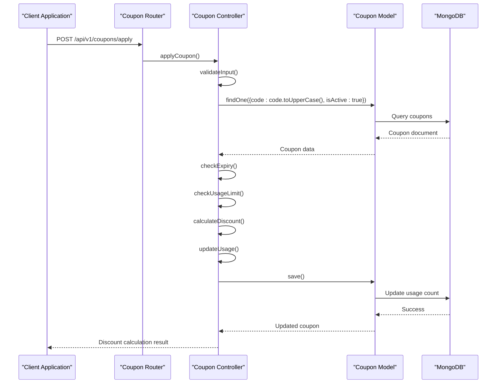
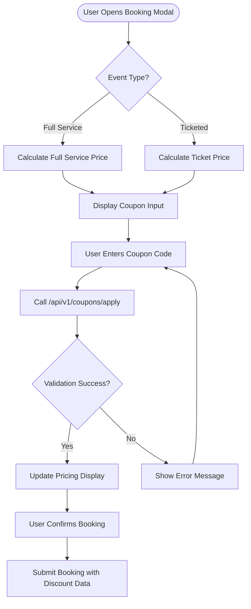
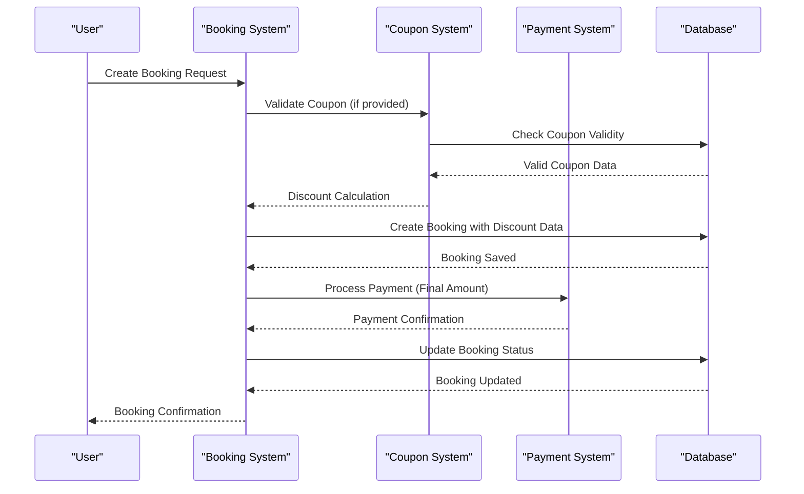
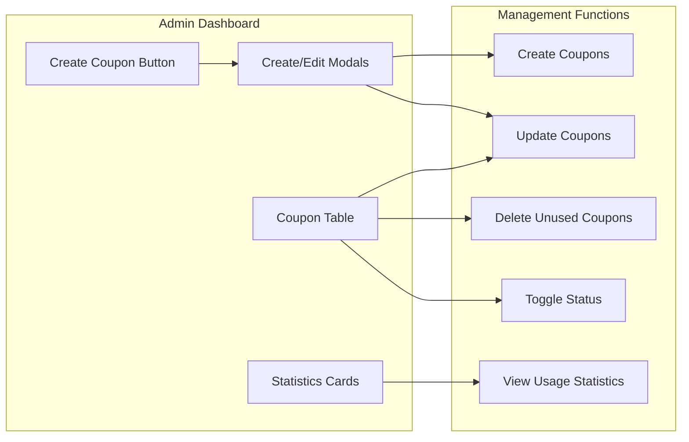
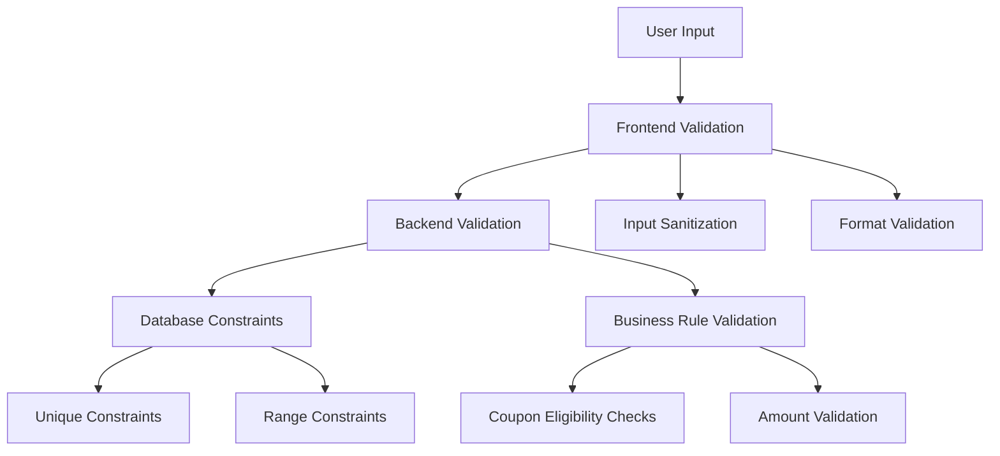

# Coupon and Discount System

<cite>
**Referenced Files in This Document**
- [couponSchema.js](file://backend/models/couponSchema.js)
- [couponController.js](file://backend/controller/couponController.js)
- [couponRouter.js](file://backend/router/couponRouter.js)
- [CouponInput.jsx](file://frontend/src/components/CouponInput.jsx)
- [AdminCoupons.jsx](file://frontend/src/pages/dashboards/AdminCoupons.jsx)
- [EventBookingModal.jsx](file://frontend/src/components/EventBookingModal.jsx)
- [UserMyEvents.jsx](file://frontend/src/pages/dashboards/UserMyEvents.jsx)
- [bookingSchema.js](file://backend/models/bookingSchema.js)
- [paymentsController.js](file://backend/controller/paymentsController.js)
- [test-full-coupon-workflow.js](file://backend/test-full-coupon-workflow.js)
- [create-test-coupons.js](file://backend/create-test-coupons.js)
- [test-coupon-api.js](file://backend/test-coupon-api.js)
- [COUPON_SYSTEM_IMPLEMENTATION_SUMMARY.md](file://COUPON_SYSTEM_IMPLEMENTATION_SUMMARY.md)
</cite>

## Table of Contents
1. [Introduction](#introduction)
2. [System Architecture](#system-architecture)
3. [Core Components](#core-components)
4. [Coupon Model Design](#coupon-model-design)
5. [Backend API Endpoints](#backend-api-endpoints)
6. [Frontend Integration](#frontend-integration)
7. [Booking Workflow Integration](#booking-workflow-integration)
8. [Admin Management](#admin-management)
9. [Testing and Validation](#testing-and-validation)
10. [Security and Validation](#security-and-validation)
11. [Performance Considerations](#performance-considerations)
12. [Troubleshooting Guide](#troubleshooting-guide)
13. [Conclusion](#conclusion)

## Introduction

The Coupon and Discount System is a comprehensive solution integrated into the Event Management MERN application that enables users to apply promotional codes during the booking process. This system supports two types of discounts: percentage-based and flat-rate discounts, with advanced features including usage limits, expiration dates, and restriction capabilities.

The system provides a complete end-to-end solution from coupon creation and management to real-time validation and application during booking, ensuring secure and reliable discount processing while maintaining data integrity and user experience.

## System Architecture

The coupon system follows a layered architecture pattern with clear separation of concerns between frontend presentation, backend business logic, and database persistence.

**Diagram sources**
- [couponRouter.js:1-37](file://backend/router/couponRouter.js#L1-L37)
- [couponController.js:1-757](file://backend/controller/couponController.js#L1-L757)
- [couponSchema.js:1-123](file://backend/models/couponSchema.js#L1-L123)

## Core Components

### Coupon Model Architecture

The coupon system is built around a robust MongoDB schema that supports comprehensive discount management with advanced validation and tracking capabilities.

**Diagram sources**
- [couponSchema.js:1-123](file://backend/models/couponSchema.js#L1-L123)
- [bookingSchema.js:1-118](file://backend/models/bookingSchema.js#L1-L118)

**Section sources**
- [couponSchema.js:1-123](file://backend/models/couponSchema.js#L1-L123)
- [bookingSchema.js:1-118](file://backend/models/bookingSchema.js#L1-L118)

## Coupon Model Design

The coupon model implements a comprehensive schema supporting various discount types and business rules:

### Core Fields and Constraints

| Field | Type | Constraints | Purpose |
|-------|------|-------------|---------|
| `code` | String | Required, Unique, Uppercase, 3-20 chars | Coupon identifier |
| `discountType` | Enum | "percentage" \| "flat" | Discount calculation method |
| `discountValue` | Number | Required, min: 0 | Percentage (1-100) or flat amount |
| `maxDiscount` | Number | min: 0, default: null | Maximum discount cap (percentage only) |
| `minAmount` | Number | Required, min: 0, default: 0 | Minimum order requirement |
| `expiryDate` | Date | Required | Coupon expiration date |
| `usageLimit` | Number | Required, min: 1 | Maximum total usages |
| `usedCount` | Number | min: 0 | Current usage counter |
| `isActive` | Boolean | default: true | Activation status |

### Advanced Features

The model includes sophisticated validation and tracking mechanisms:

- **Virtual Fields**: `remainingUsage` and `usagePercentage` for real-time analytics
- **Indexing**: Optimized queries for code lookups, active/expiry filtering, and creator identification
- **Pre-save Middleware**: Automatic uppercase conversion for coupon codes
- **Usage History**: Comprehensive tracking of who used coupons and when

**Section sources**
- [couponSchema.js:1-123](file://backend/models/couponSchema.js#L1-L123)

## Backend API Endpoints

The system provides a comprehensive set of RESTful endpoints for both user and administrative functionality:

### User-Facing Endpoints

**Diagram sources**
- [couponRouter.js:21-25](file://backend/router/couponRouter.js#L21-L25)
- [couponController.js:134-285](file://backend/controller/couponController.js#L134-L285)

### Admin Management Endpoints

| Endpoint | Method | Authentication | Purpose |
|----------|--------|----------------|---------|
| `/api/v1/coupons/apply` | POST | User | Apply coupon and calculate discount |
| `/api/v1/coupons/remove` | POST | User | Remove applied coupon |
| `/api/v1/coupons/available` | GET | User | Get available coupons |
| `/api/v1/coupons/create` | POST | Admin | Create new coupon |
| `/api/v1/coupons/all` | GET | Admin | List all coupons |
| `/api/v1/coupons/:id` | PUT | Admin | Update coupon |
| `/api/v1/coupons/:id` | DELETE | Admin | Delete coupon |
| `/api/v1/coupons/:id/toggle` | PATCH | Admin | Toggle coupon status |
| `/api/v1/coupons/stats` | GET | Admin | Get usage statistics |

**Section sources**
- [couponRouter.js:1-37](file://backend/router/couponRouter.js#L1-L37)
- [couponController.js:388-757](file://backend/controller/couponController.js#L388-L757)

## Frontend Integration

### Reusable Coupon Component

The frontend implements a highly reusable coupon input component that integrates seamlessly across different booking scenarios:

**Diagram sources**
- [CouponInput.jsx:19-82](file://frontend/src/components/CouponInput.jsx#L19-L82)
- [EventBookingModal.jsx:224-265](file://frontend/src/components/EventBookingModal.jsx#L224-L265)

### Component Features

The CouponInput component provides:

- **Real-time Validation**: Immediate feedback on coupon validity
- **Visual Feedback**: Clear display of original, discount, and final amounts
- **Error Handling**: Comprehensive error messaging and user guidance
- **Integration Ready**: Seamless integration with booking workflows

**Section sources**
- [CouponInput.jsx:1-166](file://frontend/src/components/CouponInput.jsx#L1-L166)
- [EventBookingModal.jsx:1-276](file://frontend/src/components/EventBookingModal.jsx#L1-L276)

## Booking Workflow Integration

### Complete Booking Process

The coupon system integrates deeply into the booking workflow, ensuring discounts are applied consistently across all booking types:

**Diagram sources**
- [paymentsController.js:236-256](file://backend/controller/paymentsController.js#L236-L256)
- [test-full-coupon-workflow.js:71-97](file://backend/test-full-coupon-workflow.js#L71-L97)

### Data Persistence

The booking schema includes dedicated fields for coupon information:

| Field | Type | Purpose |
|-------|------|---------|
| `originalAmount` | Number | Price before discount |
| `discountAmount` | Number | Applied discount amount |
| `finalAmount` | Number | Final price after discount |
| `couponCode` | String | Applied coupon code |
| `couponId` | ObjectId | Reference to coupon document |

**Section sources**
- [bookingSchema.js:83-90](file://backend/models/bookingSchema.js#L83-L90)
- [paymentsController.js:236-256](file://backend/controller/paymentsController.js#L236-L256)

## Admin Management

### Administrative Dashboard

The admin interface provides comprehensive coupon management capabilities:

**Diagram sources**
- [AdminCoupons.jsx:207-392](file://frontend/src/pages/dashboards/AdminCoupons.jsx#L207-L392)

### Admin Features

- **Statistics Dashboard**: Real-time tracking of coupon performance
- **Coupon Management**: Full CRUD operations with validation
- **Usage Analytics**: Comprehensive reporting and insights
- **Bulk Operations**: Efficient management of multiple coupons

**Section sources**
- [AdminCoupons.jsx:1-690](file://frontend/src/pages/dashboards/AdminCoupons.jsx#L1-L690)

## Testing and Validation

### Comprehensive Testing Suite

The system includes extensive testing capabilities to ensure reliability and correctness:

| Test Category | Coverage | Tools |
|---------------|----------|-------|
| API Endpoints | Full CRUD operations | Axios, Mocha |
| Business Logic | Validation rules, calculations | Unit tests |
| Integration | End-to-end workflows | Test scripts |
| Error Handling | Edge cases, invalid data | Error simulation |

### Test Scenarios

The testing framework covers critical scenarios:

1. **Successful Coupon Application**: Valid coupon applied to eligible booking
2. **Validation Failures**: Expired, invalid, or usage-limited coupons
3. **Integration Testing**: Complete booking workflow with discounts
4. **Edge Cases**: Boundary conditions and error scenarios

**Section sources**
- [test-full-coupon-workflow.js:1-128](file://backend/test-full-coupon-workflow.js#L1-L128)
- [test-coupon-api.js:1-70](file://backend/test-coupon-api.js#L1-L70)
- [create-test-coupons.js:1-87](file://backend/create-test-coupons.js#L1-L87)

## Security and Validation

### Multi-Layer Validation

The system implements comprehensive validation at multiple levels:

### Validation Rules

The system enforces strict validation rules:

- **Coupon Existence**: Ensures coupon code validity
- **Expiration Check**: Prevents use of expired coupons
- **Usage Limits**: Enforces maximum usage constraints
- **Minimum Amount**: Validates order value requirements
- **User Restrictions**: Applies user-specific limitations
- **Event Restrictions**: Ensures coupon applicability

**Section sources**
- [couponController.js:6-131](file://backend/controller/couponController.js#L6-L131)
- [couponController.js:134-285](file://backend/controller/couponController.js#L134-L285)

## Performance Considerations

### Database Optimization

The coupon system implements several performance optimizations:

- **Indexing Strategy**: Strategic indexes on frequently queried fields
- **Query Optimization**: Efficient aggregation queries for statistics
- **Caching**: Potential for implementing caching layers
- **Pagination**: Support for large coupon collections

### Scalability Features

- **Modular Design**: Clean separation of concerns enables easy scaling
- **Asynchronous Processing**: Non-blocking operations where possible
- **Resource Management**: Efficient memory and connection usage
- **Monitoring Ready**: Built-in metrics collection capabilities

## Troubleshooting Guide

### Common Issues and Solutions

| Issue | Symptoms | Solution |
|-------|----------|----------|
| Coupon Not Applying | Error message appears | Check coupon validity and user permissions |
| Payment Amount Mismatch | Payment rejected | Verify final amount calculation |
| Coupon Already Used | "Already used" error | Check user's usage history |
| Expired Coupon | Expiration error | Verify coupon expiry date |
| Database Connection | API failures | Check MongoDB connectivity |

### Debugging Tools

The system includes comprehensive logging and debugging capabilities:

- **Console Logging**: Detailed operation logs
- **Error Tracking**: Structured error reporting
- **Performance Metrics**: Timing and resource usage
- **Test Scripts**: Automated validation tools

**Section sources**
- [couponController.js:124-130](file://backend/controller/couponController.js#L124-L130)
- [test-full-coupon-workflow.js:122-125](file://backend/test-full-coupon-workflow.js#L122-L125)

## Conclusion

The Coupon and Discount System represents a comprehensive solution for promotional code management in the Event Management application. The system successfully integrates advanced discount functionality with robust validation, comprehensive admin controls, and seamless user experience.

Key achievements include:

- **Complete Feature Set**: Supports all major coupon types and business rules
- **Robust Architecture**: Well-designed APIs with proper error handling
- **User Experience**: Intuitive interfaces for both users and administrators
- **Security**: Multi-layer validation and protection against misuse
- **Scalability**: Designed for growth and future enhancements

The system provides a solid foundation for promotional marketing campaigns while maintaining data integrity and system performance. Future enhancements could include bulk coupon creation, advanced analytics, and expanded coupon targeting capabilities.