# Event Moderation

<cite>
**Referenced Files in This Document**
- [adminController.js](file://backend/controller/adminController.js)
- [adminRouter.js](file://backend/router/adminRouter.js)
- [eventSchema.js](file://backend/models/eventSchema.js)
- [eventController.js](file://backend/controller/eventController.js)
- [AdminEvents.jsx](file://frontend/src/pages/dashboards/AdminEvents.jsx)
- [AdminAnalytics.jsx](file://frontend/src/pages/dashboards/AdminAnalytics.jsx)
- [notificationSchema.js](file://backend/models/notificationSchema.js)
- [mailer.js](file://backend/util/mailer.js)
- [bookingSchema.js](file://backend/models/bookingSchema.js)
- [registrationSchema.js](file://backend/models/registrationSchema.js)
</cite>

## Table of Contents
1. [Introduction](#introduction)
2. [Project Structure](#project-structure)
3. [Core Components](#core-components)
4. [Architecture Overview](#architecture-overview)
5. [Detailed Component Analysis](#detailed-component-analysis)
6. [Dependency Analysis](#dependency-analysis)
7. [Performance Considerations](#performance-considerations)
8. [Troubleshooting Guide](#troubleshooting-guide)
9. [Conclusion](#conclusion)

## Introduction
This document describes the Admin Event Moderation system, focusing on event review processes, content validation, policy enforcement, and lifecycle management. It explains event approval workflows, content screening procedures, automated moderation tools, event categorization, quality assurance, community guideline enforcement, analytics and popularity monitoring, performance metrics, removal procedures, spam detection, policy violation handling, scheduling oversight, and calendar management features. The system integrates backend controllers and routers with MongoDB models and a React-based admin dashboard.

## Project Structure
The Admin Event Moderation system spans backend controllers and routers, Mongoose models, and a frontend admin dashboard. Key areas include:
- Admin endpoints for listing users, merchants, events, registrations, and generating reports
- Event model with fields supporting categorization, pricing, scheduling, and status
- Frontend dashboards for viewing events and analytics
- Notification and email utilities for moderation-related communications

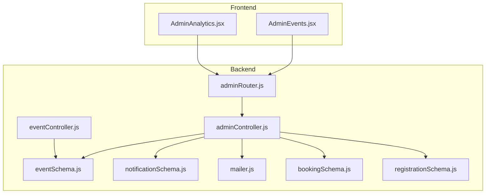

**Diagram sources**
- [adminController.js:1-194](file://backend/controller/adminController.js#L1-L194)
- [adminRouter.js:1-29](file://backend/router/adminRouter.js#L1-L29)
- [eventSchema.js:1-51](file://backend/models/eventSchema.js#L1-L51)
- [eventController.js:1-35](file://backend/controller/eventController.js#L1-L35)
- [AdminEvents.jsx:1-108](file://frontend/src/pages/dashboards/AdminEvents.jsx#L1-L108)
- [AdminAnalytics.jsx:1-94](file://frontend/src/pages/dashboards/AdminAnalytics.jsx#L1-L94)
- [notificationSchema.js:1-36](file://backend/models/notificationSchema.js#L1-L36)
- [mailer.js:1-42](file://backend/util/mailer.js#L1-L42)
- [bookingSchema.js:1-53](file://backend/models/bookingSchema.js#L1-L53)
- [registrationSchema.js:1-12](file://backend/models/registrationSchema.js#L1-L12)

**Section sources**
- [adminController.js:1-194](file://backend/controller/adminController.js#L1-L194)
- [adminRouter.js:1-29](file://backend/router/adminRouter.js#L1-L29)
- [eventSchema.js:1-51](file://backend/models/eventSchema.js#L1-L51)
- [AdminEvents.jsx:1-108](file://frontend/src/pages/dashboards/AdminEvents.jsx#L1-L108)
- [AdminAnalytics.jsx:1-94](file://frontend/src/pages/dashboards/AdminAnalytics.jsx#L1-L94)

## Core Components
- Admin controller: Provides endpoints for listing users and merchants, deleting users, listing and deleting events, listing registrations, and generating reports. It also exposes public stats and merchant creation.
- Admin router: Defines protected routes for admin actions, enforcing authentication and role checks.
- Event model: Defines event fields including title, description, category, event type, pricing, scheduling, tickets, addons, status, and creator reference.
- Event controller: Supplies event listing and registration APIs used by the platform.
- Frontend dashboards: AdminEvents displays events with metadata; AdminAnalytics shows platform metrics and activity.
- Notifications and mailer: Support moderation-related alerts and administrative communication.
- Bookings and registrations: Track event participation and support moderation decisions around user behavior.

**Section sources**
- [adminController.js:1-194](file://backend/controller/adminController.js#L1-L194)
- [adminRouter.js:1-29](file://backend/router/adminRouter.js#L1-L29)
- [eventSchema.js:1-51](file://backend/models/eventSchema.js#L1-L51)
- [eventController.js:1-35](file://backend/controller/eventController.js#L1-L35)
- [AdminEvents.jsx:1-108](file://frontend/src/pages/dashboards/AdminEvents.jsx#L1-L108)
- [AdminAnalytics.jsx:1-94](file://frontend/src/pages/dashboards/AdminAnalytics.jsx#L1-L94)
- [notificationSchema.js:1-36](file://backend/models/notificationSchema.js#L1-L36)
- [mailer.js:1-42](file://backend/util/mailer.js#L1-L42)
- [bookingSchema.js:1-53](file://backend/models/bookingSchema.js#L1-L53)
- [registrationSchema.js:1-12](file://backend/models/registrationSchema.js#L1-L12)

## Architecture Overview
The moderation architecture centers on admin-protected endpoints that expose event listings, user and merchant oversight, and reporting. The frontend dashboards consume these endpoints to present moderation-relevant data.

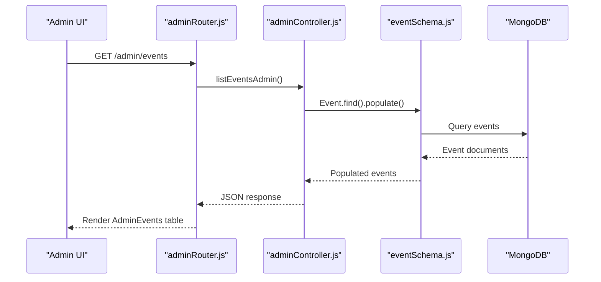

**Diagram sources**
- [adminRouter.js:1-29](file://backend/router/adminRouter.js#L1-L29)
- [adminController.js:89-96](file://backend/controller/adminController.js#L89-L96)
- [eventSchema.js:1-51](file://backend/models/eventSchema.js#L1-L51)

## Detailed Component Analysis

### Admin Event Moderation Endpoints
- Listing and deletion of events: Admins can retrieve all events and delete them along with associated registrations.
- Reporting and statistics: Admins can view platform-wide metrics including totals, recent activity, and revenue.
- Public stats: Exposes basic counts for marketing and transparency.
- Merchant management: Creation of merchant accounts and listing of merchants.

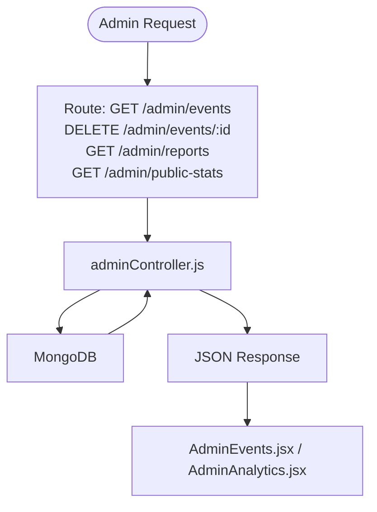

**Diagram sources**
- [adminRouter.js:1-29](file://backend/router/adminRouter.js#L1-L29)
- [adminController.js:89-193](file://backend/controller/adminController.js#L89-L193)
- [AdminEvents.jsx:1-108](file://frontend/src/pages/dashboards/AdminEvents.jsx#L1-L108)
- [AdminAnalytics.jsx:1-94](file://frontend/src/pages/dashboards/AdminAnalytics.jsx#L1-L94)

**Section sources**
- [adminController.js:89-193](file://backend/controller/adminController.js#L89-L193)
- [adminRouter.js:18-26](file://backend/router/adminRouter.js#L18-L26)
- [AdminEvents.jsx:11-18](file://frontend/src/pages/dashboards/AdminEvents.jsx#L11-L18)
- [AdminAnalytics.jsx:13-18](file://frontend/src/pages/dashboards/AdminAnalytics.jsx#L13-L18)

### Event Model and Lifecycle
The event model defines fields for categorization, pricing, scheduling, tickets, addons, status, and creator. Status supports lifecycle stages suitable for moderation (active, inactive, completed). Category and eventType inform moderation policies and content screening.

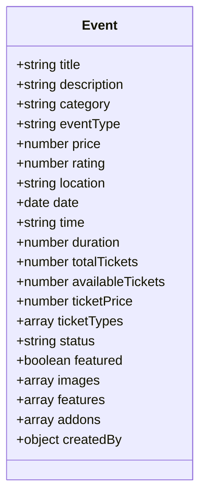

**Diagram sources**
- [eventSchema.js:3-48](file://backend/models/eventSchema.js#L3-L48)

**Section sources**
- [eventSchema.js:1-51](file://backend/models/eventSchema.js#L1-L51)

### Event Registration and Participation
Registration and booking models capture participation and payment status, enabling moderation decisions around user behavior and event activity.

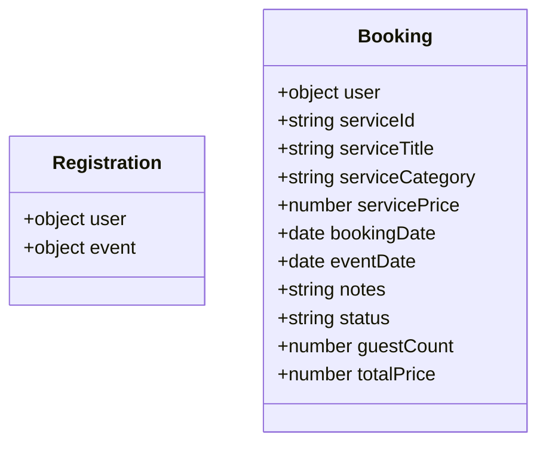

**Diagram sources**
- [registrationSchema.js:3-9](file://backend/models/registrationSchema.js#L3-L9)
- [bookingSchema.js:3-49](file://backend/models/bookingSchema.js#L3-L49)

**Section sources**
- [registrationSchema.js:1-12](file://backend/models/registrationSchema.js#L1-L12)
- [bookingSchema.js:1-53](file://backend/models/bookingSchema.js#L1-L53)

### Content Screening and Policy Enforcement
- Event categorization: The category field enables targeted moderation and policy alignment.
- Pricing and addons: Full-service and ticketed event types influence moderation workflows and revenue tracking.
- Status transitions: Active/inactive/completed statuses support moderation lifecycle management.
- Notifications and emails: Notification and mailer utilities support moderation alerts and administrative communication.

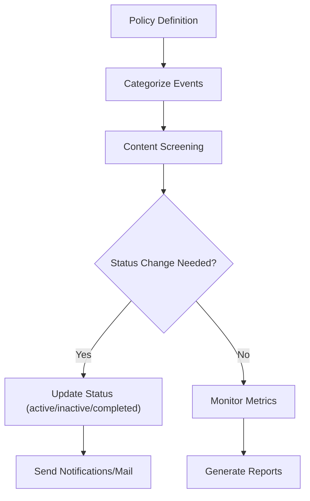

**Diagram sources**
- [eventSchema.js:7-29](file://backend/models/eventSchema.js#L7-L29)
- [notificationSchema.js:1-36](file://backend/models/notificationSchema.js#L1-L36)
- [mailer.js:1-42](file://backend/util/mailer.js#L1-L42)

**Section sources**
- [eventSchema.js:7-29](file://backend/models/eventSchema.js#L7-L29)
- [notificationSchema.js:1-36](file://backend/models/notificationSchema.js#L1-L36)
- [mailer.js:1-42](file://backend/util/mailer.js#L1-L42)

### Event Approval Workflows
- Event listing: Admins can review all events created by merchants.
- Deletion: Admins can remove events and associated registrations.
- Merchant creation: Admins can provision merchant accounts and notify via email.

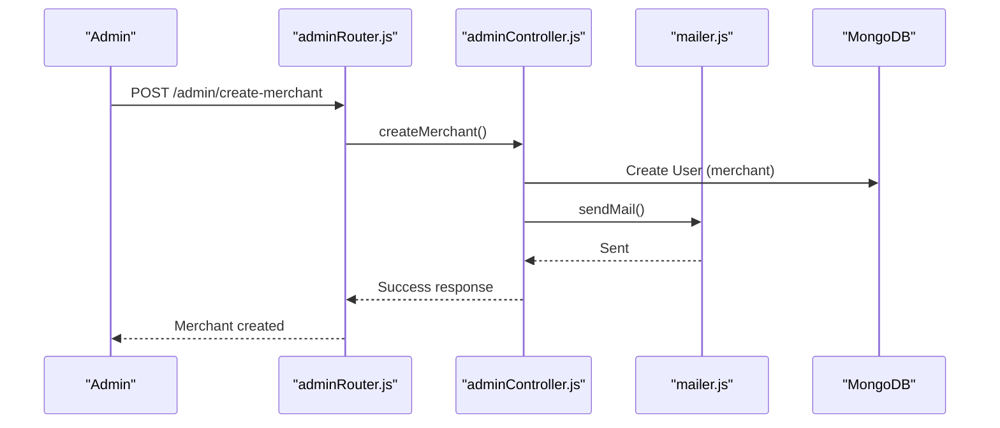

**Diagram sources**
- [adminRouter.js:21-21](file://backend/router/adminRouter.js#L21-L21)
- [adminController.js:27-77](file://backend/controller/adminController.js#L27-L77)
- [mailer.js:37-41](file://backend/util/mailer.js#L37-L41)

**Section sources**
- [adminController.js:27-77](file://backend/controller/adminController.js#L27-L77)
- [adminRouter.js:21-21](file://backend/router/adminRouter.js#L21-L21)

### Analytics, Popularity Monitoring, and Metrics
- AdminAnalytics dashboard fetches reports including totals, recent activity, active events, confirmed/pending bookings, and revenue.
- Public stats endpoint provides basic platform counts.

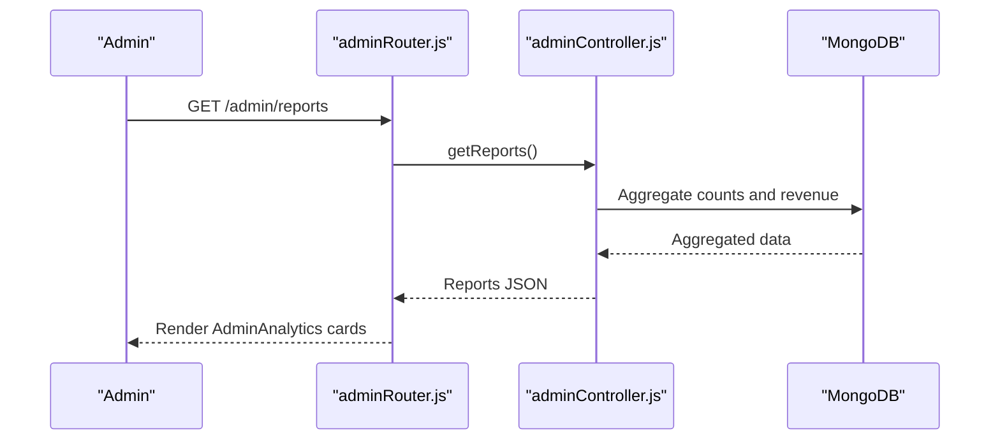

**Diagram sources**
- [adminRouter.js:26-26](file://backend/router/adminRouter.js#L26-L26)
- [adminController.js:118-177](file://backend/controller/adminController.js#L118-L177)
- [AdminAnalytics.jsx:13-18](file://frontend/src/pages/dashboards/AdminAnalytics.jsx#L13-L18)

**Section sources**
- [adminController.js:118-177](file://backend/controller/adminController.js#L118-L177)
- [adminRouter.js:26-26](file://backend/router/adminRouter.js#L26-L26)
- [AdminAnalytics.jsx:13-18](file://frontend/src/pages/dashboards/AdminAnalytics.jsx#L13-L18)

### Event Removal Procedures and Policy Violations
- Event deletion: Admins can delete events and associated registrations.
- User deletion: Admins can remove users who violate policies.
- Notifications: Moderation actions can trigger notifications to affected parties.

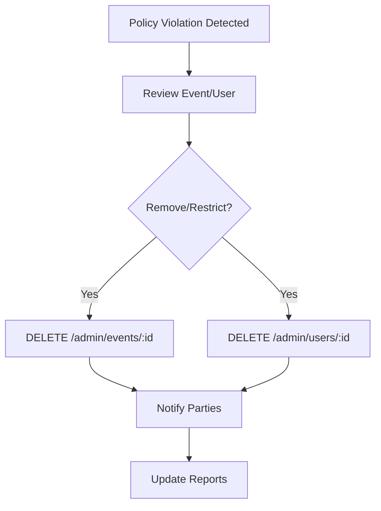

**Diagram sources**
- [adminRouter.js:22-24](file://backend/router/adminRouter.js#L22-L24)
- [adminController.js:79-107](file://backend/controller/adminController.js#L79-L107)
- [notificationSchema.js:1-36](file://backend/models/notificationSchema.js#L1-L36)

**Section sources**
- [adminController.js:79-107](file://backend/controller/adminController.js#L79-L107)
- [adminRouter.js:22-24](file://backend/router/adminRouter.js#L22-L24)

### Scheduling Oversight and Calendar Management
- Event scheduling fields (date, time, duration) enable moderation oversight of calendars.
- Status transitions (active/inactive/completed) align with scheduling lifecycle.

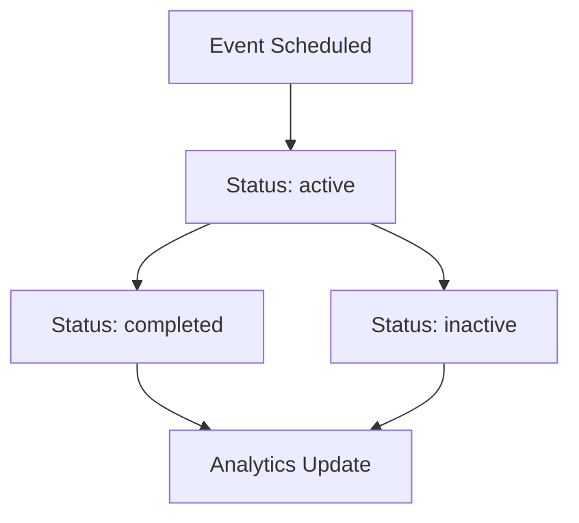

**Diagram sources**
- [eventSchema.js:11-29](file://backend/models/eventSchema.js#L11-L29)

**Section sources**
- [eventSchema.js:11-29](file://backend/models/eventSchema.js#L11-L29)

## Dependency Analysis
The admin moderation system relies on:
- Authentication and role middleware to protect admin routes
- Mongoose models for data persistence
- Email and notification utilities for moderation communications
- Frontend dashboards for visualization and action triggers

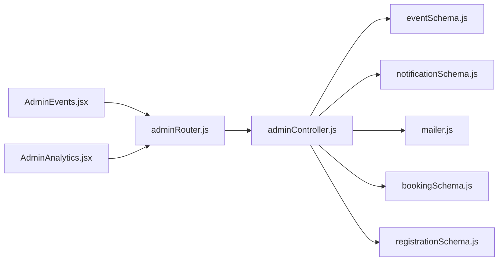

**Diagram sources**
- [adminRouter.js:1-29](file://backend/router/adminRouter.js#L1-L29)
- [adminController.js:1-194](file://backend/controller/adminController.js#L1-L194)
- [eventSchema.js:1-51](file://backend/models/eventSchema.js#L1-L51)
- [notificationSchema.js:1-36](file://backend/models/notificationSchema.js#L1-L36)
- [mailer.js:1-42](file://backend/util/mailer.js#L1-L42)
- [bookingSchema.js:1-53](file://backend/models/bookingSchema.js#L1-L53)
- [registrationSchema.js:1-12](file://backend/models/registrationSchema.js#L1-L12)
- [AdminEvents.jsx:1-108](file://frontend/src/pages/dashboards/AdminEvents.jsx#L1-L108)
- [AdminAnalytics.jsx:1-94](file://frontend/src/pages/dashboards/AdminAnalytics.jsx#L1-L94)

**Section sources**
- [adminRouter.js:1-29](file://backend/router/adminRouter.js#L1-L29)
- [adminController.js:1-194](file://backend/controller/adminController.js#L1-L194)

## Performance Considerations
- Use of aggregation queries for reports reduces multiple round-trips and improves responsiveness.
- Populate operations in event listing should be scoped to avoid heavy joins when unnecessary.
- Pagination can be introduced for large datasets in AdminEvents and AdminRegistrations views.
- Indexes on frequently queried fields (e.g., status, date, category) can improve query performance.

## Troubleshooting Guide
- Authentication failures: Ensure admin routes are protected by authentication and role middleware.
- Report generation errors: Verify aggregation pipeline correctness and handle empty result sets gracefully.
- Email delivery: Confirm SMTP environment variables and fallback logging behavior.
- Event deletion side effects: Ensure dependent registrations are removed alongside events.

**Section sources**
- [adminRouter.js:2-3](file://backend/router/adminRouter.js#L2-L3)
- [adminController.js:118-177](file://backend/controller/adminController.js#L118-L177)
- [mailer.js:5-35](file://backend/util/mailer.js#L5-L35)

## Conclusion
The Admin Event Moderation system provides a foundation for overseeing events, users, and merchants through protected endpoints, robust reporting, and moderation-ready data models. By leveraging categorization, status transitions, notifications, and analytics, administrators can enforce policies, monitor popularity, manage schedules, and maintain a healthy ecosystem. Extending the system with automated moderation tools, spam detection, and granular policy controls would further strengthen operational capabilities.