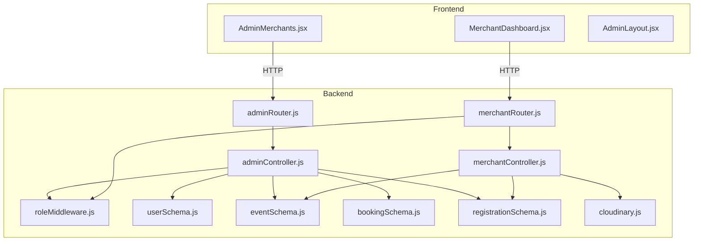
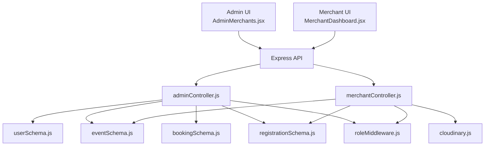
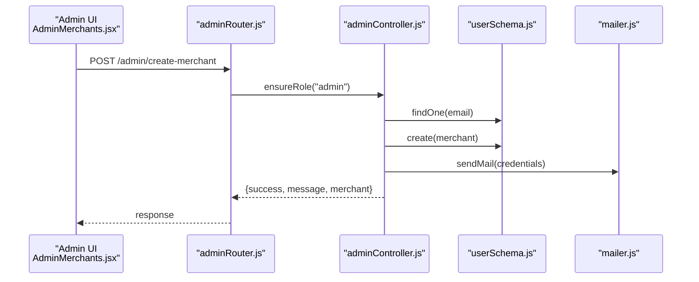
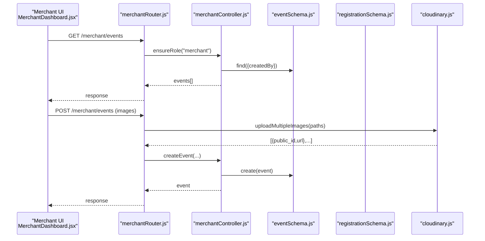
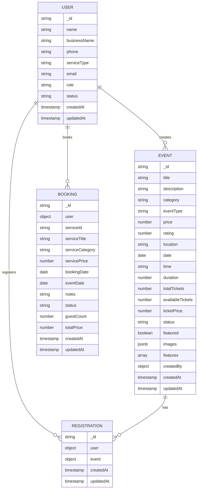
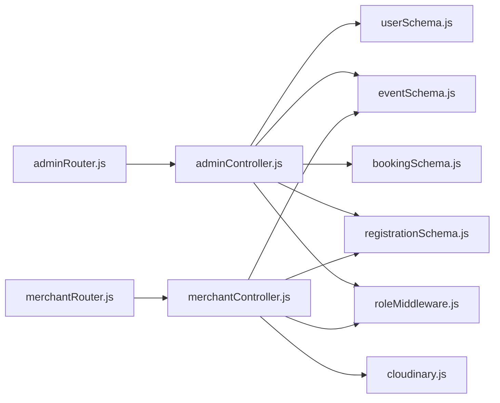

# Merchant Management

<cite>
**Referenced Files in This Document**
- [adminController.js](file://backend/controller/adminController.js)
- [adminRouter.js](file://backend/router/adminRouter.js)
- [merchantController.js](file://backend/controller/merchantController.js)
- [merchantRouter.js](file://backend/router/merchantRouter.js)
- [userSchema.js](file://backend/models/userSchema.js)
- [eventSchema.js](file://backend/models/eventSchema.js)
- [bookingSchema.js](file://backend/models/bookingSchema.js)
- [registrationSchema.js](file://backend/models/registrationSchema.js)
- [cloudinary.js](file://backend/util/cloudinary.js)
- [roleMiddleware.js](file://backend/middleware/roleMiddleware.js)
- [AdminMerchants.jsx](file://frontend/src/pages/dashboards/AdminMerchants.jsx)
- [MerchantDashboard.jsx](file://frontend/src/pages/dashboards/MerchantDashboard.jsx)
- [AdminLayout.jsx](file://frontend/src/components/admin/AdminLayout.jsx)
</cite>

## Table of Contents
1. [Introduction](#introduction)
2. [Project Structure](#project-structure)
3. [Core Components](#core-components)
4. [Architecture Overview](#architecture-overview)
5. [Detailed Component Analysis](#detailed-component-analysis)
6. [Dependency Analysis](#dependency-analysis)
7. [Performance Considerations](#performance-considerations)
8. [Troubleshooting Guide](#troubleshooting-guide)
9. [Conclusion](#conclusion)
10. [Appendices](#appendices)

## Introduction
This document describes the Admin Merchant Management system within the Event Management Platform. It focuses on merchant account oversight, verification processes, business validation, and merchant performance monitoring. It also documents merchant approval workflows, account status management, business rule enforcement, merchant analytics and earnings tracking, compliance monitoring, onboarding procedures, document verification processes, and business relationship management. Dispute resolution, policy enforcement, and regulatory compliance features are addressed conceptually.

## Project Structure
The system comprises:
- Backend API with controllers, routers, middleware, and models for admin and merchant operations
- Frontend dashboards for administrative oversight and merchant self-service
- Utility integrations for media handling and role-based access control

**Diagram sources**
- [adminRouter.js:1-29](file://backend/router/adminRouter.js#L1-L29)
- [adminController.js:1-194](file://backend/controller/adminController.js#L1-L194)
- [merchantRouter.js:1-16](file://backend/router/merchantRouter.js#L1-L16)
- [merchantController.js:1-151](file://backend/controller/merchantController.js#L1-L151)
- [roleMiddleware.js:1-9](file://backend/middleware/roleMiddleware.js#L1-L9)
- [userSchema.js:1-55](file://backend/models/userSchema.js#L1-L55)
- [eventSchema.js:1-35](file://backend/models/eventSchema.js#L1-L35)
- [bookingSchema.js:1-53](file://backend/models/bookingSchema.js#L1-L53)
- [registrationSchema.js:1-12](file://backend/models/registrationSchema.js#L1-L12)
- [cloudinary.js:1-112](file://backend/util/cloudinary.js#L1-L112)
- [AdminMerchants.jsx:1-203](file://frontend/src/pages/dashboards/AdminMerchants.jsx#L1-L203)
- [MerchantDashboard.jsx:1-133](file://frontend/src/pages/dashboards/MerchantDashboard.jsx#L1-L133)
- [AdminLayout.jsx:1-29](file://frontend/src/components/admin/AdminLayout.jsx#L1-L29)

**Section sources**
- [adminRouter.js:1-29](file://backend/router/adminRouter.js#L1-L29)
- [merchantRouter.js:1-16](file://backend/router/merchantRouter.js#L1-L16)
- [AdminMerchants.jsx:1-203](file://frontend/src/pages/dashboards/AdminMerchants.jsx#L1-L203)
- [MerchantDashboard.jsx:1-133](file://frontend/src/pages/dashboards/MerchantDashboard.jsx#L1-L133)

## Core Components
- Admin Merchant Management (Backend): Provides endpoints to list users, list/manage merchants, create merchant accounts, delete users, list events, delete events, list registrations, and compute reports including revenue.
- Merchant Self-Service (Backend): Enables merchants to create, update, list, and fetch their events, and to view participants per event.
- Data Models: Users (with roles and statuses), Events (including ticketed/full-service variants), Bookings, and Registrations.
- Media Handling: Cloudinary integration for secure image uploads and deletions.
- Access Control: Role middleware ensures only admins can access admin endpoints and only merchants can access merchant endpoints.

Key capabilities:
- Merchant onboarding via admin creation with auto-generated credentials and email notification
- Merchant event lifecycle management (create/update/list/get/participants)
- Reporting and analytics for administrators (counts, revenue)
- Business rule enforcement via schema constraints and middleware

**Section sources**
- [adminController.js:18-77](file://backend/controller/adminController.js#L18-L77)
- [merchantController.js:5-151](file://backend/controller/merchantController.js#L5-L151)
- [userSchema.js:39-49](file://backend/models/userSchema.js#L39-L49)
- [eventSchema.js:8-21](file://backend/models/eventSchema.js#L8-L21)
- [cloudinary.js:75-109](file://backend/util/cloudinary.js#L75-L109)
- [roleMiddleware.js:1-9](file://backend/middleware/roleMiddleware.js#L1-L9)

## Architecture Overview
The system follows a layered architecture:
- Presentation Layer: React dashboards for Admin and Merchant
- Application Layer: Express routers and controllers
- Domain Layer: Business logic for merchant management and reporting
- Persistence Layer: MongoDB models for Users, Events, Bookings, and Registrations
- Integration Layer: Cloudinary for media

**Diagram sources**
- [AdminMerchants.jsx:1-203](file://frontend/src/pages/dashboards/AdminMerchants.jsx#L1-L203)
- [MerchantDashboard.jsx:1-133](file://frontend/src/pages/dashboards/MerchantDashboard.jsx#L1-L133)
- [adminController.js:1-194](file://backend/controller/adminController.js#L1-L194)
- [merchantController.js:1-151](file://backend/controller/merchantController.js#L1-L151)
- [userSchema.js:1-55](file://backend/models/userSchema.js#L1-L55)
- [eventSchema.js:1-35](file://backend/models/eventSchema.js#L1-L35)
- [bookingSchema.js:1-53](file://backend/models/bookingSchema.js#L1-L53)
- [registrationSchema.js:1-12](file://backend/models/registrationSchema.js#L1-L12)
- [cloudinary.js:1-112](file://backend/util/cloudinary.js#L1-L112)
- [roleMiddleware.js:1-9](file://backend/middleware/roleMiddleware.js#L1-L9)

## Detailed Component Analysis

### Admin Merchant Management
Responsibilities:
- List users and merchants
- Create merchant accounts with generated credentials and email notification
- Delete users
- Manage events and registrations
- Compute reports including counts and revenue

**Diagram sources**
- [AdminMerchants.jsx:47-66](file://frontend/src/pages/dashboards/AdminMerchants.jsx#L47-L66)
- [adminRouter.js](file://backend/router/adminRouter.js#L21)
- [adminController.js:27-77](file://backend/controller/adminController.js#L27-L77)
- [userSchema.js:1-55](file://backend/models/userSchema.js#L1-L55)

Operational highlights:
- Merchant creation validates required fields, checks uniqueness, hashes password, assigns role, and emails credentials
- Reports endpoint aggregates counts and revenue using aggregation pipelines
- Public stats endpoint exposes basic platform metrics

**Section sources**
- [adminController.js:18-77](file://backend/controller/adminController.js#L18-L77)
- [adminController.js:118-177](file://backend/controller/adminController.js#L118-L177)
- [adminController.js:179-193](file://backend/controller/adminController.js#L179-L193)
- [adminRouter.js:19-26](file://backend/router/adminRouter.js#L19-L26)

### Merchant Self-Service
Responsibilities:
- Create, update, list, and fetch events
- View participants for a given event
- Image upload and replacement via Cloudinary

**Diagram sources**
- [MerchantDashboard.jsx:19-25](file://frontend/src/pages/dashboards/MerchantDashboard.jsx#L19-L25)
- [merchantRouter.js:9-13](file://backend/router/merchantRouter.js#L9-L13)
- [merchantController.js:5-151](file://backend/controller/merchantController.js#L5-L151)
- [eventSchema.js:1-35](file://backend/models/eventSchema.js#L1-L35)
- [cloudinary.js:75-91](file://backend/util/cloudinary.js#L75-L91)

Operational highlights:
- Event creation validates title, parses features, handles images, and sets defaults
- Event updates support partial fields and image replacement with prior deletion
- Participants listing joins registrations with user details

**Section sources**
- [merchantController.js:5-151](file://backend/controller/merchantController.js#L5-L151)
- [merchantRouter.js:9-13](file://backend/router/merchantRouter.js#L9-L13)
- [cloudinary.js:75-109](file://backend/util/cloudinary.js#L75-L109)

### Data Models and Business Rules

**Diagram sources**
- [userSchema.js:1-55](file://backend/models/userSchema.js#L1-L55)
- [eventSchema.js:1-35](file://backend/models/eventSchema.js#L1-L35)
- [bookingSchema.js:1-53](file://backend/models/bookingSchema.js#L1-L53)
- [registrationSchema.js:1-12](file://backend/models/registrationSchema.js#L1-L12)

Business rule enforcement:
- User role and status enums restrict access and visibility
- Event schema enforces event types, pricing, ratings, and ticketing fields
- Booking schema defines lifecycle statuses
- Middleware ensures role-based authorization

**Section sources**
- [userSchema.js:39-49](file://backend/models/userSchema.js#L39-L49)
- [eventSchema.js:8-21](file://backend/models/eventSchema.js#L8-L21)
- [bookingSchema.js:36-40](file://backend/models/bookingSchema.js#L36-L40)
- [roleMiddleware.js:1-9](file://backend/middleware/roleMiddleware.js#L1-L9)

### Merchant Analytics and Earnings Tracking
Conceptual overview:
- Administrators can compute platform-wide metrics including total users, merchants, events, bookings, active events, recent sign-ups, recent events, paid and pending bookings, and total and monthly revenue.
- Merchants can monitor their own events, bookings, and revenue via the merchant dashboard, which aggregates totals and upcoming events.

Implementation pointers:
- Reports aggregation pipeline computes revenue from successful payments
- Merchant dashboard sums event-level metrics client-side

**Section sources**
- [adminController.js:118-177](file://backend/controller/adminController.js#L118-L177)
- [MerchantDashboard.jsx:43-46](file://frontend/src/pages/dashboards/MerchantDashboard.jsx#L43-L46)

### Compliance Monitoring
Conceptual overview:
- Role-based access control ensures only authorized actors can perform sensitive actions.
- Email notifications during merchant creation provide audit trail and communication channel.
- Schema constraints enforce data integrity and business rules.

Implementation pointers:
- Role middleware rejects unauthorized requests
- User model enforces role and status enums
- Event model enforces pricing and ticketing constraints

**Section sources**
- [roleMiddleware.js:1-9](file://backend/middleware/roleMiddleware.js#L1-L9)
- [userSchema.js:39-49](file://backend/models/userSchema.js#L39-L49)
- [eventSchema.js:8-21](file://backend/models/eventSchema.js#L8-L21)

### Merchant Onboarding Procedures
Conceptual overview:
- Admin creates merchant accounts with validated fields, generates secure credentials, stores hashed passwords, assigns merchant role, and sends credentials via email.
- Merchant receives login URL and temporary credentials, logs in, and changes password upon first login.

Implementation pointers:
- Admin endpoint for merchant creation and email dispatch
- Frontend form validation and submission

**Section sources**
- [adminController.js:27-77](file://backend/controller/adminController.js#L27-L77)
- [AdminMerchants.jsx:36-66](file://frontend/src/pages/dashboards/AdminMerchants.jsx#L36-L66)

### Document Verification Processes
Conceptual overview:
- The current codebase does not implement explicit document verification for merchants. Images are handled via Cloudinary for event media. To implement document verification, extend the merchant model with document fields, add verification endpoints, and integrate with identity verification services.

[No sources needed since this section provides conceptual guidance]

### Business Relationship Management
Conceptual overview:
- Administrators can manage relationships by listing users/merchants, controlling account statuses, and overseeing events and registrations.
- Merchants manage their own events and participant lists, enabling direct business relationship maintenance.

**Section sources**
- [adminController.js:9-25](file://backend/controller/adminController.js#L9-L25)
- [merchantController.js:137-150](file://backend/controller/merchantController.js#L137-L150)

### Merchant Dispute Resolution and Policy Enforcement
Conceptual overview:
- Disputes can be modeled by adding dispute records linked to bookings or events, with statuses and resolution notes.
- Policies can be enforced via schema constraints, middleware guards, and admin controls over account status and event visibility.

[No sources needed since this section provides conceptual guidance]

## Dependency Analysis

**Diagram sources**
- [adminRouter.js:1-29](file://backend/router/adminRouter.js#L1-L29)
- [merchantRouter.js:1-16](file://backend/router/merchantRouter.js#L1-L16)
- [adminController.js:1-194](file://backend/controller/adminController.js#L1-L194)
- [merchantController.js:1-151](file://backend/controller/merchantController.js#L1-L151)
- [userSchema.js:1-55](file://backend/models/userSchema.js#L1-L55)
- [eventSchema.js:1-35](file://backend/models/eventSchema.js#L1-L35)
- [bookingSchema.js:1-53](file://backend/models/bookingSchema.js#L1-L53)
- [registrationSchema.js:1-12](file://backend/models/registrationSchema.js#L1-L12)
- [cloudinary.js:1-112](file://backend/util/cloudinary.js#L1-L112)
- [roleMiddleware.js:1-9](file://backend/middleware/roleMiddleware.js#L1-L9)

Observations:
- Controllers depend on models and utilities
- Routers depend on controllers and middleware
- No circular dependencies observed among primary modules

**Section sources**
- [adminRouter.js:1-29](file://backend/router/adminRouter.js#L1-L29)
- [merchantRouter.js:1-16](file://backend/router/merchantRouter.js#L1-L16)
- [adminController.js:1-194](file://backend/controller/adminController.js#L1-L194)
- [merchantController.js:1-151](file://backend/controller/merchantController.js#L1-L151)

## Performance Considerations
- Aggregation queries for reports use parallel execution to minimize latency
- Image uploads leverage asynchronous Cloudinary operations
- Middleware checks occur early to fail fast on authorization failures
- Consider indexing on frequently queried fields (e.g., user role, event date, booking status) to improve query performance

[No sources needed since this section provides general guidance]

## Troubleshooting Guide
Common issues and resolutions:
- Authentication/Authorization failures: Ensure proper role middleware usage and valid tokens
- Cloudinary upload failures: Verify configuration and file filters
- Merchant creation conflicts: Duplicate email handling returns conflict errors
- Event not found or forbidden: Merchant-only endpoints validate ownership

**Section sources**
- [roleMiddleware.js:1-9](file://backend/middleware/roleMiddleware.js#L1-L9)
- [cloudinary.js:21-31](file://backend/util/cloudinary.js#L21-L31)
- [adminController.js:38-41](file://backend/controller/adminController.js#L38-L41)
- [merchantController.js:123-134](file://backend/controller/merchantController.js#L123-L134)

## Conclusion
The Admin Merchant Management system provides a robust foundation for merchant onboarding, event lifecycle management, and administrative oversight. It leverages role-based access control, schema-driven business rules, and media utilities to support merchant operations. Extending the system with document verification, dispute resolution, and advanced compliance features would further strengthen the platform’s governance capabilities.

## Appendices
- Frontend layout components for admin navigation and merchant dashboards
- HTTP utilities and authentication headers used by dashboards

**Section sources**
- [AdminLayout.jsx:1-29](file://frontend/src/components/admin/AdminLayout.jsx#L1-L29)
- [AdminMerchants.jsx:1-203](file://frontend/src/pages/dashboards/AdminMerchants.jsx#L1-L203)
- [MerchantDashboard.jsx:1-133](file://frontend/src/pages/dashboards/MerchantDashboard.jsx#L1-L133)