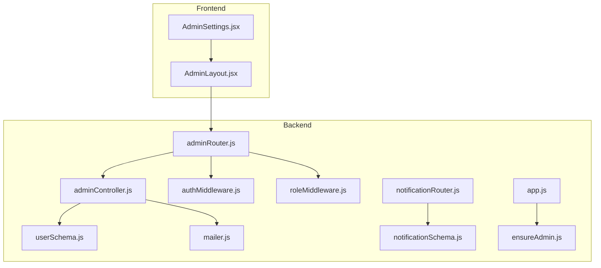
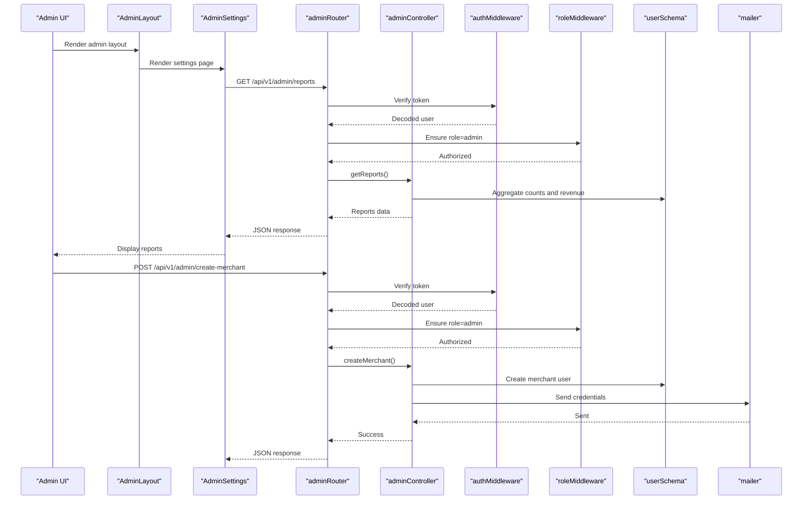
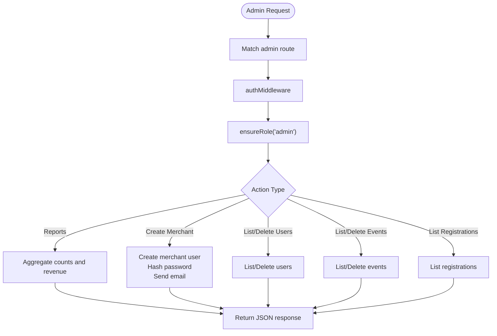
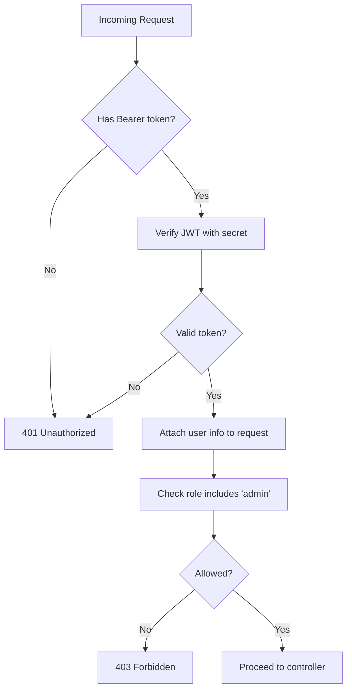
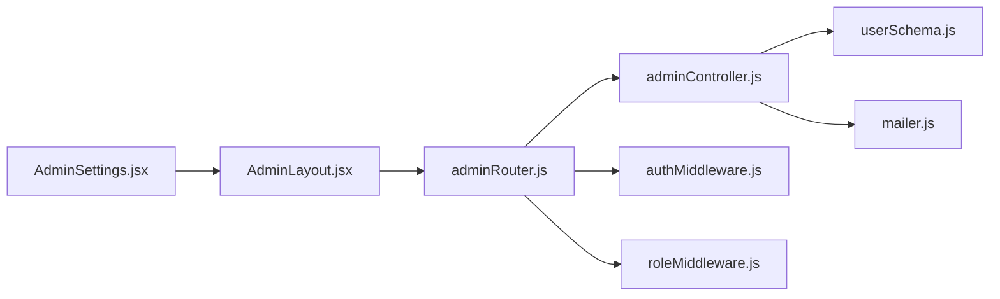

# System Configuration

<cite>
**Referenced Files in This Document**
- [adminController.js](file://backend/controller/adminController.js)
- [adminRouter.js](file://backend/router/adminRouter.js)
- [authMiddleware.js](file://backend/middleware/authMiddleware.js)
- [roleMiddleware.js](file://backend/middleware/roleMiddleware.js)
- [userSchema.js](file://backend/models/userSchema.js)
- [mailer.js](file://backend/util/mailer.js)
- [ensureAdmin.js](file://backend/util/ensureAdmin.js)
- [app.js](file://backend/app.js)
- [AdminSettings.jsx](file://frontend/src/pages/dashboards/AdminSettings.jsx)
- [AdminLayout.jsx](file://frontend/src/components/admin/AdminLayout.jsx)
- [notificationRouter.js](file://backend/router/notificationRouter.js)
- [notificationSchema.js](file://backend/models/notificationSchema.js)
- [create-sample-notifications.js](file://backend/create-sample-notifications.js)
- [DATABASE_SETUP.md](file://backend/DATABASE_SETUP.md)
- [switch-database.js](file://backend/switch-database.js)
</cite>

## Table of Contents
1. [Introduction](#introduction)
2. [Project Structure](#project-structure)
3. [Core Components](#core-components)
4. [Architecture Overview](#architecture-overview)
5. [Detailed Component Analysis](#detailed-component-analysis)
6. [Dependency Analysis](#dependency-analysis)
7. [Performance Considerations](#performance-considerations)
8. [Troubleshooting Guide](#troubleshooting-guide)
9. [Conclusion](#conclusion)
10. [Appendices](#appendices)

## Introduction
This document describes the Admin System Configuration interface and related system settings. It explains how administrators manage platform settings, environment configuration, system parameters, and operational controls. It also covers database configuration, security settings, notification preferences, service integrations, backup and recovery considerations, maintenance schedules, system health monitoring, user interface customization, branding settings, feature toggles, system security configurations, access controls, and administrative privilege management.

## Project Structure
The Admin System Configuration spans backend routes/controllers, middleware for authentication and roles, models for users and notifications, utilities for email and admin initialization, and a frontend settings page. The backend exposes admin endpoints protected by authentication and role checks, while the frontend renders the settings UI within an admin layout.

**Diagram sources**
- [AdminSettings.jsx:1-18](file://frontend/src/pages/dashboards/AdminSettings.jsx#L1-L18)
- [AdminLayout.jsx:1-29](file://frontend/src/components/admin/AdminLayout.jsx#L1-L29)
- [adminRouter.js:1-29](file://backend/router/adminRouter.js#L1-L29)
- [adminController.js:1-194](file://backend/controller/adminController.js#L1-L194)
- [authMiddleware.js:1-17](file://backend/middleware/authMiddleware.js#L1-L17)
- [roleMiddleware.js:1-9](file://backend/middleware/roleMiddleware.js#L1-L9)
- [userSchema.js:1-55](file://backend/models/userSchema.js#L1-L55)
- [notificationSchema.js:1-36](file://backend/models/notificationSchema.js#L1-L36)
- [notificationRouter.js:1-44](file://backend/router/notificationRouter.js#L1-L44)
- [mailer.js:1-42](file://backend/util/mailer.js#L1-L42)
- [ensureAdmin.js:1-35](file://backend/util/ensureAdmin.js#L1-L35)
- [app.js:1-91](file://backend/app.js#L1-L91)

**Section sources**
- [adminRouter.js:1-29](file://backend/router/adminRouter.js#L1-L29)
- [adminController.js:1-194](file://backend/controller/adminController.js#L1-L194)
- [authMiddleware.js:1-17](file://backend/middleware/authMiddleware.js#L1-L17)
- [roleMiddleware.js:1-9](file://backend/middleware/roleMiddleware.js#L1-L9)
- [AdminSettings.jsx:1-18](file://frontend/src/pages/dashboards/AdminSettings.jsx#L1-L18)
- [AdminLayout.jsx:1-29](file://frontend/src/components/admin/AdminLayout.jsx#L1-L29)
- [app.js:1-91](file://backend/app.js#L1-L91)

## Core Components
- Admin routes and controllers: Provide endpoints for listing users, deleting users, listing merchants, creating merchants, listing events, deleting events, listing registrations, generating reports, and fetching public stats. Access is restricted to authenticated admins.
- Authentication and role middleware: Enforce JWT-based authentication and admin role checks.
- User model: Defines roles (user, admin, merchant) and status (active, inactive), used by admin operations.
- Email utility: Provides SMTP configuration and fallback logging for sending emails to merchants.
- Admin initialization: Ensures an admin user exists at startup, with configurable credentials and optional forced reset.
- Frontend settings page: Renders a placeholder for admin preferences within the admin layout.
- Notifications: Backend supports user-specific notifications with read/unread state and types; frontend displays notifications for users.

**Section sources**
- [adminController.js:1-194](file://backend/controller/adminController.js#L1-L194)
- [adminRouter.js:1-29](file://backend/router/adminRouter.js#L1-L29)
- [authMiddleware.js:1-17](file://backend/middleware/authMiddleware.js#L1-L17)
- [roleMiddleware.js:1-9](file://backend/middleware/roleMiddleware.js#L1-L9)
- [userSchema.js:1-55](file://backend/models/userSchema.js#L1-L55)
- [mailer.js:1-42](file://backend/util/mailer.js#L1-L42)
- [ensureAdmin.js:1-35](file://backend/util/ensureAdmin.js#L1-L35)
- [AdminSettings.jsx:1-18](file://frontend/src/pages/dashboards/AdminSettings.jsx#L1-L18)
- [notificationRouter.js:1-44](file://backend/router/notificationRouter.js#L1-L44)
- [notificationSchema.js:1-36](file://backend/models/notificationSchema.js#L1-L36)

## Architecture Overview
The admin configuration interface integrates frontend and backend components. The frontend presents the settings UI, while the backend enforces authentication and role-based access to admin endpoints. Email and admin initialization utilities support operational controls.

**Diagram sources**
- [AdminLayout.jsx:1-29](file://frontend/src/components/admin/AdminLayout.jsx#L1-L29)
- [AdminSettings.jsx:1-18](file://frontend/src/pages/dashboards/AdminSettings.jsx#L1-L18)
- [adminRouter.js:1-29](file://backend/router/adminRouter.js#L1-L29)
- [adminController.js:1-194](file://backend/controller/adminController.js#L1-L194)
- [authMiddleware.js:1-17](file://backend/middleware/authMiddleware.js#L1-L17)
- [roleMiddleware.js:1-9](file://backend/middleware/roleMiddleware.js#L1-L9)
- [userSchema.js:1-55](file://backend/models/userSchema.js#L1-L55)
- [mailer.js:1-42](file://backend/util/mailer.js#L1-L42)

## Detailed Component Analysis

### Admin Routes and Controllers
- Protected endpoints: Users listing, user deletion, merchants listing, merchant creation, events listing, event deletion, registrations listing, reports generation, and public stats.
- Merchant creation: Generates a temporary password (auto-generated if not provided), hashes it, creates a merchant user, and emails credentials to the merchant.
- Reports aggregation: Computes totals for users, merchants, events, bookings, active events, recent users/events, paid/pending bookings, and revenue via aggregation.
- Public stats: Returns counts for total events, total users, and total merchants.

**Diagram sources**
- [adminRouter.js:1-29](file://backend/router/adminRouter.js#L1-L29)
- [adminController.js:1-194](file://backend/controller/adminController.js#L1-L194)
- [authMiddleware.js:1-17](file://backend/middleware/authMiddleware.js#L1-L17)
- [roleMiddleware.js:1-9](file://backend/middleware/roleMiddleware.js#L1-L9)

**Section sources**
- [adminRouter.js:1-29](file://backend/router/adminRouter.js#L1-L29)
- [adminController.js:1-194](file://backend/controller/adminController.js#L1-L194)

### Authentication and Role Middleware
- JWT verification: Extracts Bearer token from Authorization header and verifies it using the configured secret.
- Role enforcement: Ensures the requesting user has the required role (admin) before allowing access to admin endpoints.

**Diagram sources**
- [authMiddleware.js:1-17](file://backend/middleware/authMiddleware.js#L1-L17)
- [roleMiddleware.js:1-9](file://backend/middleware/roleMiddleware.js#L1-L9)

**Section sources**
- [authMiddleware.js:1-17](file://backend/middleware/authMiddleware.js#L1-L17)
- [roleMiddleware.js:1-9](file://backend/middleware/roleMiddleware.js#L1-L9)

### User Model and Roles
- Fields: name, businessName, phone, serviceType, email, password (hashed), role (enum: user, admin, merchant), status (active/inactive).
- Implications: Admins can manage users and merchants; role determines access to admin routes; status enables deactivation.

**Section sources**
- [userSchema.js:1-55](file://backend/models/userSchema.js#L1-L55)

### Email Utility and Merchant Onboarding
- SMTP configuration: Reads SMTP_HOST, SMTP_PORT, SMTP_USER/SMTP_EMAIL, SMTP_PASS/SMTP_PASSWORD, MAIL_FROM.
- Transporter: Creates a Nodemailer transporter when credentials are present; otherwise logs emails to console.
- Merchant creation: Sends an email containing login credentials to the merchant’s email address.

**Section sources**
- [mailer.js:1-42](file://backend/util/mailer.js#L1-L42)
- [adminController.js:27-77](file://backend/controller/adminController.js#L27-L77)

### Admin Initialization
- Purpose: Ensures an admin user exists at startup; supports configurable email, password, and name; optional forced reset via environment flag.
- Behavior: Checks for existing admin, optionally updates password if forced reset is enabled, otherwise creates a new admin user.

**Section sources**
- [ensureAdmin.js:1-35](file://backend/util/ensureAdmin.js#L1-L35)
- [app.js:64-85](file://backend/app.js#L64-L85)

### Frontend Admin Settings Page
- Structure: Uses AdminLayout to wrap a settings container; currently displays a placeholder for general settings.
- Extensibility: Can be extended to render forms for platform settings, environment configuration, UI customization, and feature toggles.

**Section sources**
- [AdminSettings.jsx:1-18](file://frontend/src/pages/dashboards/AdminSettings.jsx#L1-L18)
- [AdminLayout.jsx:1-29](file://frontend/src/components/admin/AdminLayout.jsx#L1-L29)

### Notifications Infrastructure
- Backend: Supports retrieving, marking as read, and deleting user-specific notifications; notification types include booking, payment, and general.
- Frontend: Users’ notifications are generated from upcoming events and system messages; admin notifications are not directly exposed via the provided frontend code.

**Section sources**
- [notificationRouter.js:1-44](file://backend/router/notificationRouter.js#L1-L44)
- [notificationSchema.js:1-36](file://backend/models/notificationSchema.js#L1-L36)

## Dependency Analysis
The admin configuration interface depends on:
- Authentication and role middleware for access control.
- Admin controller functions for data operations.
- User model for role and status management.
- Email utility for merchant onboarding.
- Frontend layout and settings page for rendering.

**Diagram sources**
- [adminRouter.js:1-29](file://backend/router/adminRouter.js#L1-L29)
- [adminController.js:1-194](file://backend/controller/adminController.js#L1-L194)
- [authMiddleware.js:1-17](file://backend/middleware/authMiddleware.js#L1-L17)
- [roleMiddleware.js:1-9](file://backend/middleware/roleMiddleware.js#L1-L9)
- [userSchema.js:1-55](file://backend/models/userSchema.js#L1-L55)
- [mailer.js:1-42](file://backend/util/mailer.js#L1-L42)
- [AdminSettings.jsx:1-18](file://frontend/src/pages/dashboards/AdminSettings.jsx#L1-L18)
- [AdminLayout.jsx:1-29](file://frontend/src/components/admin/AdminLayout.jsx#L1-L29)

**Section sources**
- [adminRouter.js:1-29](file://backend/router/adminRouter.js#L1-L29)
- [adminController.js:1-194](file://backend/controller/adminController.js#L1-L194)
- [authMiddleware.js:1-17](file://backend/middleware/authMiddleware.js#L1-L17)
- [roleMiddleware.js:1-9](file://backend/middleware/roleMiddleware.js#L1-L9)
- [userSchema.js:1-55](file://backend/models/userSchema.js#L1-L55)
- [mailer.js:1-42](file://backend/util/mailer.js#L1-L42)
- [AdminSettings.jsx:1-18](file://frontend/src/pages/dashboards/AdminSettings.jsx#L1-L18)
- [AdminLayout.jsx:1-29](file://frontend/src/components/admin/AdminLayout.jsx#L1-L29)

## Performance Considerations
- Aggregation queries: Reports rely on MongoDB aggregation; ensure appropriate indexing on fields used in filters (e.g., payment status, dates) to optimize performance.
- Parallel operations: Admin controller uses Promise.all for concurrent counts; maintain balanced load and avoid excessive simultaneous aggregations.
- Email delivery: SMTP transport is synchronous; consider asynchronous queuing for high-volume merchant onboarding.
- Middleware overhead: JWT verification and role checks add minimal overhead but should remain enabled for security.

## Troubleshooting Guide
- Database connectivity:
  - Symptoms: Application fails to start or health checks fail.
  - Actions: Verify MONGO_URI, ensure MongoDB is running, and confirm environment loading.
- Authentication failures:
  - Symptoms: 401 Unauthorized on admin endpoints.
  - Actions: Confirm Authorization header contains a valid Bearer token and that JWT_SECRET matches the backend configuration.
- Role access denied:
  - Symptoms: 403 Forbidden on admin endpoints.
  - Actions: Ensure the user’s role is admin; verify token payload includes the correct role.
- Email not sent:
  - Symptoms: Merchant onboarding does not send credentials.
  - Actions: Configure SMTP_HOST, SMTP_PORT, SMTP_USER/SMTP_EMAIL, SMTP_PASS/SMTP_PASSWORD, and MAIL_FROM; check console logs for fallback behavior.
- Admin user missing:
  - Symptoms: No admin user found after startup.
  - Actions: Set ADMIN_EMAIL, ADMIN_PASSWORD, ADMIN_NAME; optionally enable ADMIN_FORCE_RESET to reset credentials.

**Section sources**
- [DATABASE_SETUP.md:213-276](file://backend/DATABASE_SETUP.md#L213-L276)
- [authMiddleware.js:1-17](file://backend/middleware/authMiddleware.js#L1-L17)
- [roleMiddleware.js:1-9](file://backend/middleware/roleMiddleware.js#L1-L9)
- [mailer.js:1-42](file://backend/util/mailer.js#L1-L42)
- [ensureAdmin.js:1-35](file://backend/util/ensureAdmin.js#L1-L35)

## Conclusion
The Admin System Configuration interface provides a secure foundation for managing platform settings, environment configuration, system parameters, and operational controls. Admin endpoints are protected by robust authentication and role checks, while utilities support merchant onboarding and admin initialization. The frontend settings page offers a foundation for future enhancements to branding, feature toggles, and UI customization. Notifications infrastructure supports user-centric alerts, and database and environment configuration guidelines ensure reliable operation across local and cloud deployments.

## Appendices

### Database Configuration
- Local vs Atlas switching script: Use the provided script to toggle between local and Atlas environments by updating configuration files.
- Verification checklist: Includes steps to confirm database connectivity, collection creation, and successful admin dashboard operations.

**Section sources**
- [switch-database.js:29-42](file://backend/switch-database.js#L29-L42)
- [DATABASE_SETUP.md:247-276](file://backend/DATABASE_SETUP.md#L247-L276)

### Health Monitoring
- Health endpoint: Exposes a simple status endpoint for readiness/liveness checks.
- Config check endpoint: Reports Cloudinary configuration status for image-related services.

**Section sources**
- [app.js:49-62](file://backend/app.js#L49-L62)

### Notification Preferences
- Backend endpoints: Retrieve, mark as read, and delete user notifications.
- Sample generator: Creates sample notifications for testing and demonstration.

**Section sources**
- [notificationRouter.js:1-44](file://backend/router/notificationRouter.js#L1-L44)
- [create-sample-notifications.js:1-73](file://backend/create-sample-notifications.js#L1-L73)