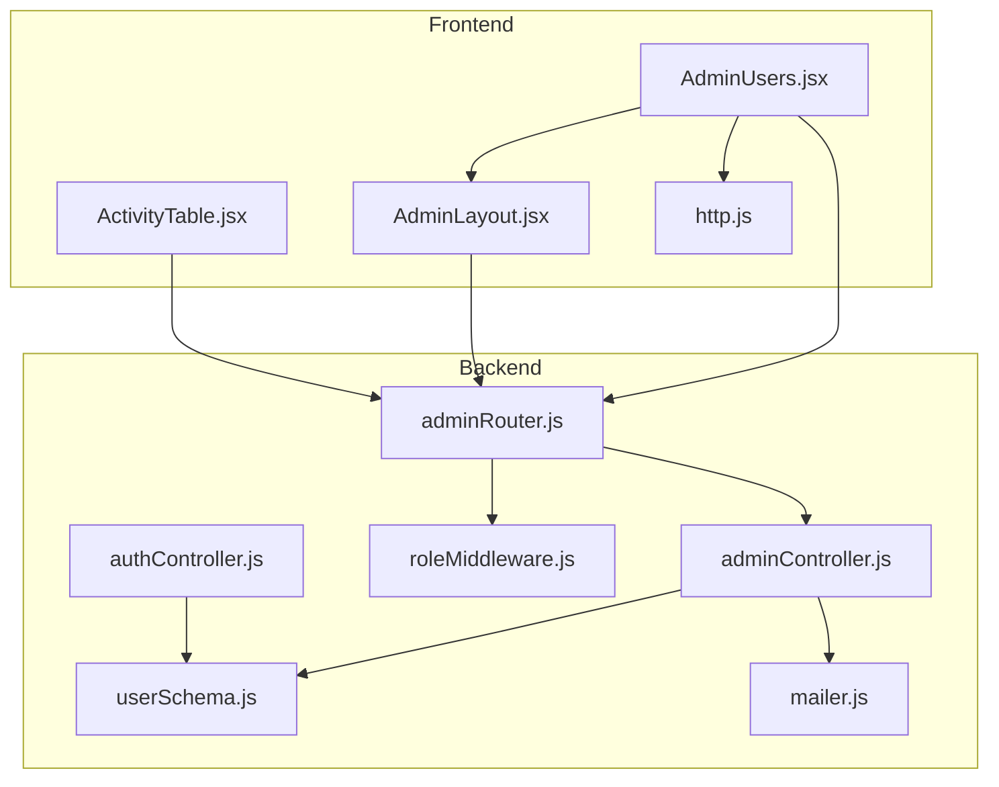
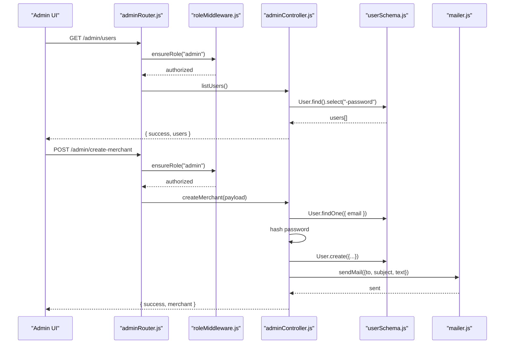
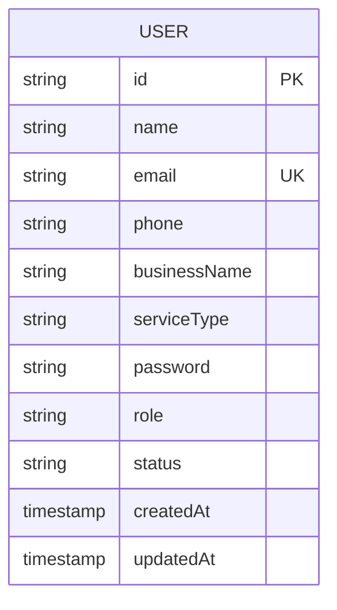
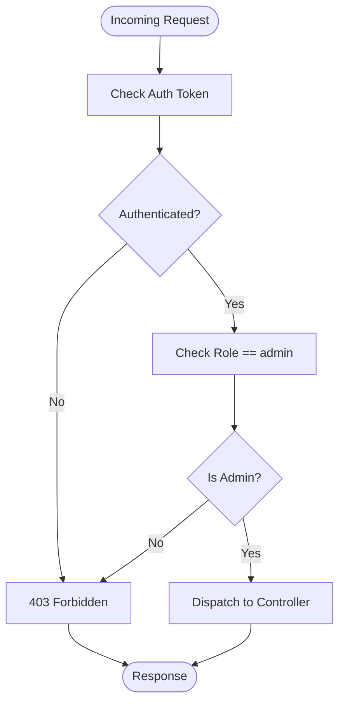
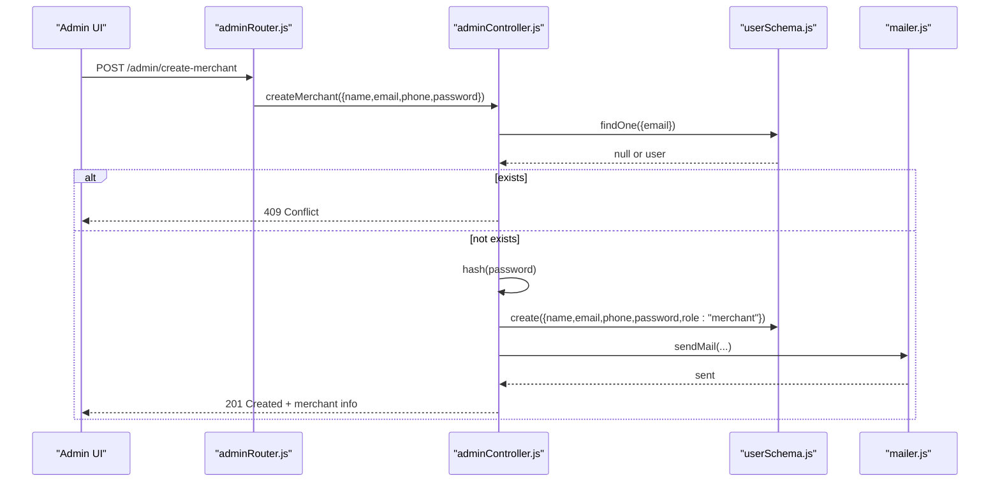
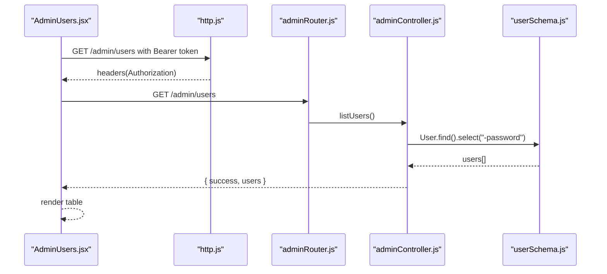
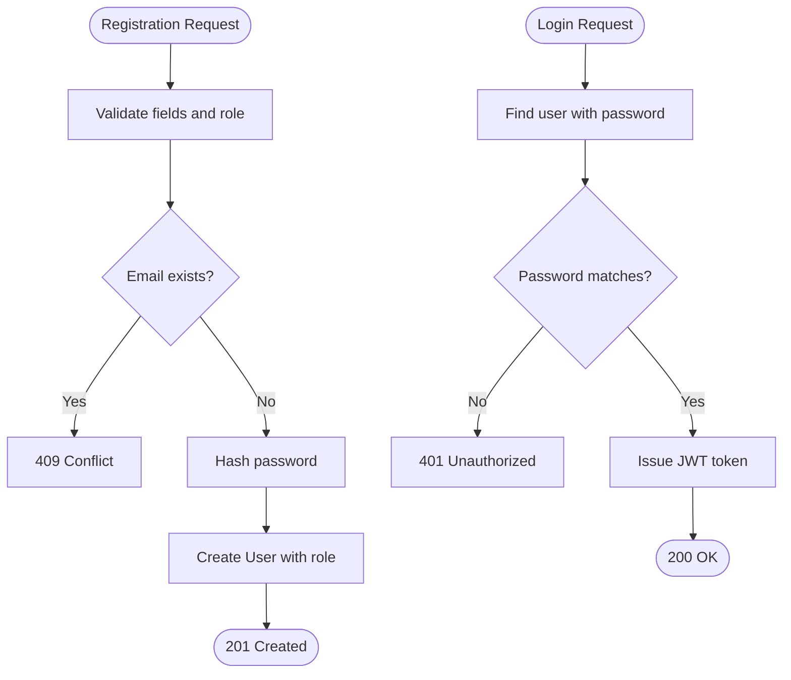
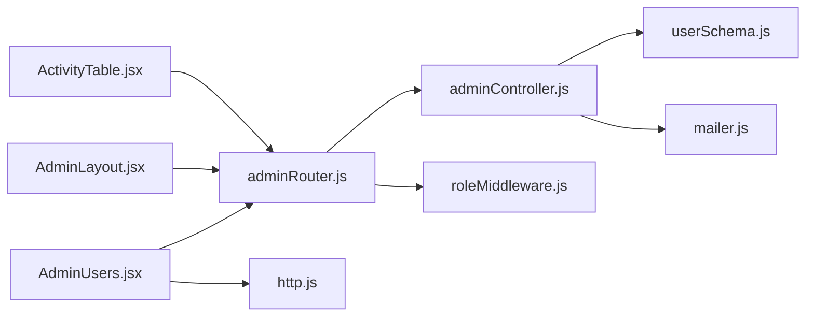

# User Management

<cite>
**Referenced Files in This Document**
- [userSchema.js](file://backend/models/userSchema.js)
- [adminController.js](file://backend/controller/adminController.js)
- [adminRouter.js](file://backend/router/adminRouter.js)
- [roleMiddleware.js](file://backend/middleware/roleMiddleware.js)
- [authController.js](file://backend/controller/authController.js)
- [mailer.js](file://backend/util/mailer.js)
- [AdminUsers.jsx](file://frontend/src/pages/dashboards/AdminUsers.jsx)
- [AdminLayout.jsx](file://frontend/src/components/admin/AdminLayout.jsx)
- [ActivityTable.jsx](file://frontend/src/components/admin/ActivityTable.jsx)
- [http.js](file://frontend/src/lib/http.js)
</cite>

## Table of Contents
1. [Introduction](#introduction)
2. [Project Structure](#project-structure)
3. [Core Components](#core-components)
4. [Architecture Overview](#architecture-overview)
5. [Detailed Component Analysis](#detailed-component-analysis)
6. [Dependency Analysis](#dependency-analysis)
7. [Performance Considerations](#performance-considerations)
8. [Troubleshooting Guide](#troubleshooting-guide)
9. [Conclusion](#conclusion)
10. [Appendices](#appendices)

## Introduction
This document describes the Admin User Management system in the Event Management Application. It covers how administrators list users, manage roles and account statuses, and monitor user activity. It also documents admin tools for user administration actions such as deleting users, creating merchant accounts, and retrieving reports. The document explains current capabilities, highlights missing features (such as user verification, bulk operations, and comprehensive audit trails), and outlines recommended improvements for compliance, privacy, and operational efficiency.

## Project Structure
The user management functionality spans backend controllers and routers, MongoDB models, and frontend dashboard components. Authentication and authorization are enforced via middleware, while email notifications are handled by a utility module.

**Diagram sources**
- [AdminUsers.jsx:1-64](file://frontend/src/pages/dashboards/AdminUsers.jsx#L1-L64)
- [AdminLayout.jsx:1-29](file://frontend/src/components/admin/AdminLayout.jsx#L1-L29)
- [ActivityTable.jsx:1-55](file://frontend/src/components/admin/ActivityTable.jsx#L1-L55)
- [http.js:1-5](file://frontend/src/lib/http.js#L1-L5)
- [adminRouter.js:1-29](file://backend/router/adminRouter.js#L1-L29)
- [adminController.js:1-194](file://backend/controller/adminController.js#L1-L194)
- [roleMiddleware.js:1-9](file://backend/middleware/roleMiddleware.js#L1-L9)
- [authController.js:1-120](file://backend/controller/authController.js#L1-L120)
- [userSchema.js:1-55](file://backend/models/userSchema.js#L1-L55)
- [mailer.js:1-42](file://backend/util/mailer.js#L1-L42)

**Section sources**
- [adminRouter.js:1-29](file://backend/router/adminRouter.js#L1-L29)
- [adminController.js:1-194](file://backend/controller/adminController.js#L1-L194)
- [userSchema.js:1-55](file://backend/models/userSchema.js#L1-L55)
- [AdminUsers.jsx:1-64](file://frontend/src/pages/dashboards/AdminUsers.jsx#L1-L64)
- [AdminLayout.jsx:1-29](file://frontend/src/components/admin/AdminLayout.jsx#L1-L29)
- [ActivityTable.jsx:1-55](file://frontend/src/components/admin/ActivityTable.jsx#L1-L55)
- [http.js:1-5](file://frontend/src/lib/http.js#L1-L5)

## Core Components
- User model: Defines user fields, roles, and status with validation.
- Admin routes: Expose endpoints for listing users, listing merchants, creating merchants, deleting users, listing events, deleting events, listing registrations, and retrieving reports.
- Admin controller: Implements business logic for user listing, merchant creation, user deletion, and report generation.
- Role middleware: Enforces admin-only access to protected endpoints.
- Authentication controller: Handles user registration and login; supports role assignment for new users.
- Email utility: Sends merchant credentials via SMTP or logs messages as fallback.
- Frontend admin dashboard: Renders user listings and activity summaries.

Key capabilities currently present:
- List all users and merchants.
- Create merchant accounts with generated credentials and email delivery.
- Delete users.
- Retrieve administrative reports (counts and revenue).
- Basic user status display in the UI.

Missing capabilities (as implemented):
- User verification workflows.
- Bulk operations.
- Comprehensive audit trail.
- User search and filtering.
- Account suspension toggling.
- Permission modifications beyond role assignment.

**Section sources**
- [userSchema.js:1-55](file://backend/models/userSchema.js#L1-L55)
- [adminRouter.js:1-29](file://backend/router/adminRouter.js#L1-L29)
- [adminController.js:1-194](file://backend/controller/adminController.js#L1-L194)
- [roleMiddleware.js:1-9](file://backend/middleware/roleMiddleware.js#L1-L9)
- [authController.js:1-120](file://backend/controller/authController.js#L1-L120)
- [mailer.js:1-42](file://backend/util/mailer.js#L1-L42)
- [AdminUsers.jsx:1-64](file://frontend/src/pages/dashboards/AdminUsers.jsx#L1-L64)
- [ActivityTable.jsx:1-55](file://frontend/src/components/admin/ActivityTable.jsx#L1-L55)

## Architecture Overview
The admin user management flow integrates frontend requests, backend routing, middleware enforcement, and controller logic backed by the user model.

**Diagram sources**
- [adminRouter.js:1-29](file://backend/router/adminRouter.js#L1-L29)
- [roleMiddleware.js:1-9](file://backend/middleware/roleMiddleware.js#L1-L9)
- [adminController.js:1-194](file://backend/controller/adminController.js#L1-L194)
- [userSchema.js:1-55](file://backend/models/userSchema.js#L1-L55)
- [mailer.js:1-42](file://backend/util/mailer.js#L1-L42)

## Detailed Component Analysis

### Backend Data Model: User
The User model defines core attributes and constraints:
- Identity: name, email (unique, validated), phone, businessName, serviceType.
- Security: password stored hashed, not selectable by default.
- Access control: role with allowed values and default; status with allowed values and default.
- Metadata: timestamps for creation/update.

**Diagram sources**
- [userSchema.js:1-55](file://backend/models/userSchema.js#L1-L55)

**Section sources**
- [userSchema.js:1-55](file://backend/models/userSchema.js#L1-L55)

### Admin Routes and Authorization
The admin router exposes endpoints guarded by authentication and role middleware:
- GET /admin/users
- GET /admin/merchants
- POST /admin/create-merchant
- DELETE /admin/users/:id
- GET /admin/events
- DELETE /admin/events/:id
- GET /admin/registrations
- GET /admin/reports

Authorization:
- Authentication middleware ensures a valid session.
- Role middleware enforces admin-only access.

**Diagram sources**
- [adminRouter.js:1-29](file://backend/router/adminRouter.js#L1-L29)
- [roleMiddleware.js:1-9](file://backend/middleware/roleMiddleware.js#L1-L9)

**Section sources**
- [adminRouter.js:1-29](file://backend/router/adminRouter.js#L1-L29)
- [roleMiddleware.js:1-9](file://backend/middleware/roleMiddleware.js#L1-L9)

### Admin Controller: User Operations and Reports
Key controller functions:
- listUsers: Returns all users excluding passwords.
- listMerchants: Returns users with merchant role.
- createMerchant: Validates required fields, checks uniqueness, hashes password, creates merchant, and emails credentials.
- deleteUser: Removes a user by ID.
- listEventsAdmin, deleteEventAdmin: Manage events and associated registrations.
- listRegistrationsAdmin: Lists registrations with populated user and event details.
- getReports: Aggregates counts and revenue over time windows.
- getPublicStats: Public-facing statistics endpoint.

**Diagram sources**
- [adminController.js:1-194](file://backend/controller/adminController.js#L1-L194)
- [userSchema.js:1-55](file://backend/models/userSchema.js#L1-L55)
- [mailer.js:1-42](file://backend/util/mailer.js#L1-L42)

**Section sources**
- [adminController.js:1-194](file://backend/controller/adminController.js#L1-L194)

### Frontend Admin Dashboard: User Listing and Activity
- AdminUsers page fetches users and renders a table with name, email, role, business, service type, and status.
- AdminLayout composes sidebar, topbar, and main content area.
- ActivityTable displays recent activity rows with user, event, date, and status badges.

**Diagram sources**
- [AdminUsers.jsx:1-64](file://frontend/src/pages/dashboards/AdminUsers.jsx#L1-L64)
- [http.js:1-5](file://frontend/src/lib/http.js#L1-L5)
- [adminRouter.js:1-29](file://backend/router/adminRouter.js#L1-L29)
- [adminController.js:1-194](file://backend/controller/adminController.js#L1-L194)
- [userSchema.js:1-55](file://backend/models/userSchema.js#L1-L55)

**Section sources**
- [AdminUsers.jsx:1-64](file://frontend/src/pages/dashboards/AdminUsers.jsx#L1-L64)
- [AdminLayout.jsx:1-29](file://frontend/src/components/admin/AdminLayout.jsx#L1-L29)
- [ActivityTable.jsx:1-55](file://frontend/src/components/admin/ActivityTable.jsx#L1-L55)
- [http.js:1-5](file://frontend/src/lib/http.js#L1-L5)

### Authentication and Role Assignment
- Authentication controller supports user registration with role validation and defaulting to "user".
- Login authenticates users and issues JWT tokens.
- Admin controller’s merchant creation sets role to "merchant".

**Diagram sources**
- [authController.js:1-120](file://backend/controller/authController.js#L1-L120)
- [userSchema.js:1-55](file://backend/models/userSchema.js#L1-L55)

**Section sources**
- [authController.js:1-120](file://backend/controller/authController.js#L1-L120)
- [userSchema.js:1-55](file://backend/models/userSchema.js#L1-L55)

## Dependency Analysis
- Controllers depend on models for data access and on utilities for email.
- Routers depend on controllers and middleware for request handling.
- Frontend depends on backend endpoints and shared HTTP utilities.
- Role middleware centralizes admin enforcement across routes.

**Diagram sources**
- [adminRouter.js:1-29](file://backend/router/adminRouter.js#L1-L29)
- [adminController.js:1-194](file://backend/controller/adminController.js#L1-L194)
- [roleMiddleware.js:1-9](file://backend/middleware/roleMiddleware.js#L1-L9)
- [userSchema.js:1-55](file://backend/models/userSchema.js#L1-L55)
- [mailer.js:1-42](file://backend/util/mailer.js#L1-L42)
- [AdminUsers.jsx:1-64](file://frontend/src/pages/dashboards/AdminUsers.jsx#L1-L64)
- [AdminLayout.jsx:1-29](file://frontend/src/components/admin/AdminLayout.jsx#L1-L29)
- [ActivityTable.jsx:1-55](file://frontend/src/components/admin/ActivityTable.jsx#L1-L55)
- [http.js:1-5](file://frontend/src/lib/http.js#L1-L5)

**Section sources**
- [adminRouter.js:1-29](file://backend/router/adminRouter.js#L1-L29)
- [adminController.js:1-194](file://backend/controller/adminController.js#L1-L194)
- [roleMiddleware.js:1-9](file://backend/middleware/roleMiddleware.js#L1-L9)
- [userSchema.js:1-55](file://backend/models/userSchema.js#L1-L55)
- [mailer.js:1-42](file://backend/util/mailer.js#L1-L42)
- [AdminUsers.jsx:1-64](file://frontend/src/pages/dashboards/AdminUsers.jsx#L1-L64)
- [AdminLayout.jsx:1-29](file://frontend/src/components/admin/AdminLayout.jsx#L1-L29)
- [ActivityTable.jsx:1-55](file://frontend/src/components/admin/ActivityTable.jsx#L1-L55)
- [http.js:1-5](file://frontend/src/lib/http.js#L1-L5)

## Performance Considerations
- Current queries:
  - listUsers: Returns all users with password excluded; consider pagination for large datasets.
  - listMerchants: Filters by role; ensure index on role for performance.
  - createMerchant: Single write operation; hashing cost is O(k) with salt rounds configured.
  - getReports: Uses Promise.all for concurrent counts and aggregation for revenue; ensure indexes on relevant fields.
- Recommendations:
  - Add pagination and sorting to user listing.
  - Add indexes on email, role, status, and timestamps.
  - Implement server-side filtering and search for users.
  - Batch operations for deletions and status updates.

[No sources needed since this section provides general guidance]

## Troubleshooting Guide
Common issues and resolutions:
- 403 Forbidden: Ensure the requester has a valid admin role; verify JWT and middleware chain.
- 409 Conflict on merchant creation: Email already exists; choose a unique email.
- 500 Internal Server Error: Inspect controller try/catch blocks and model validations.
- Email delivery failures: Check SMTP environment variables; fallback logs are printed when SMTP is not configured.

**Section sources**
- [adminRouter.js:1-29](file://backend/router/adminRouter.js#L1-L29)
- [adminController.js:1-194](file://backend/controller/adminController.js#L1-L194)
- [mailer.js:1-42](file://backend/util/mailer.js#L1-L42)

## Conclusion
The Admin User Management system provides essential capabilities for listing users, managing merchant accounts, and generating administrative reports. It enforces admin-only access and offers a clean separation between frontend dashboards and backend controllers. To meet advanced requirements—verification workflows, bulk operations, audit trails, search/filtering, and enhanced privacy—extend the model with verification and audit fields, implement server-side filters, and add batch endpoints with proper safeguards.

[No sources needed since this section summarizes without analyzing specific files]

## Appendices

### Endpoint Reference
- GET /admin/public-stats
- GET /admin/users
- GET /admin/merchants
- POST /admin/create-merchant
- DELETE /admin/users/:id
- GET /admin/events
- DELETE /admin/events/:id
- GET /admin/registrations
- GET /admin/reports

**Section sources**
- [adminRouter.js:1-29](file://backend/router/adminRouter.js#L1-L29)

### Data Protection and Privacy Notes
- Passwords are hashed and not returned in user listings.
- Email transport falls back to console logging when SMTP is unavailable.
- Consider adding:
  - GDPR-compliant data deletion policies.
  - Consent and retention fields.
  - Audit logs for sensitive actions (deletion, role changes).

**Section sources**
- [userSchema.js:1-55](file://backend/models/userSchema.js#L1-L55)
- [mailer.js:1-42](file://backend/util/mailer.js#L1-L42)