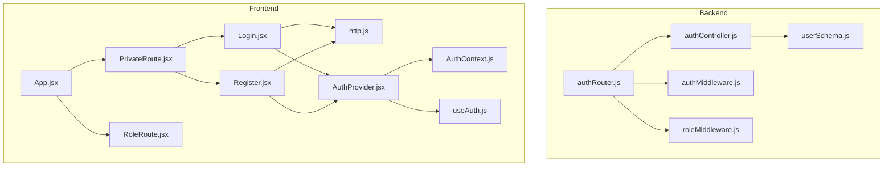
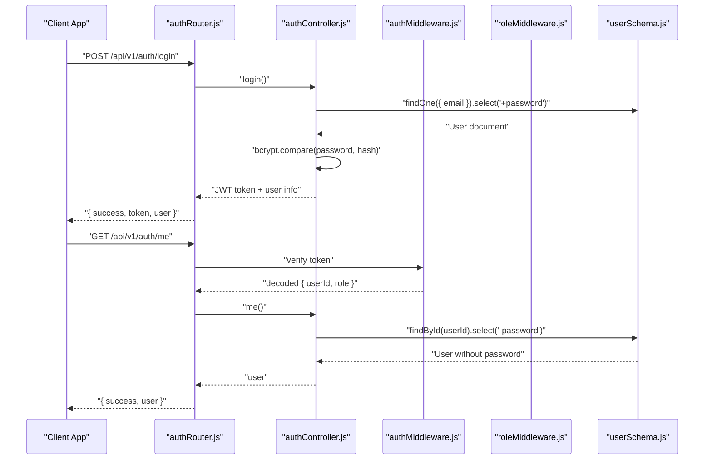
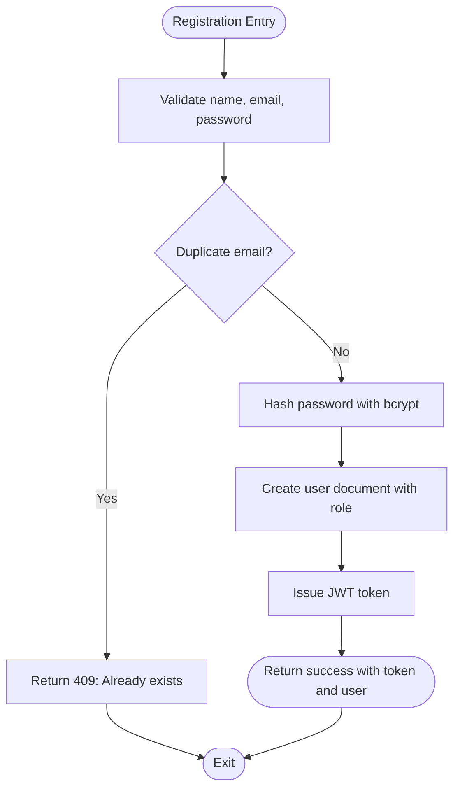
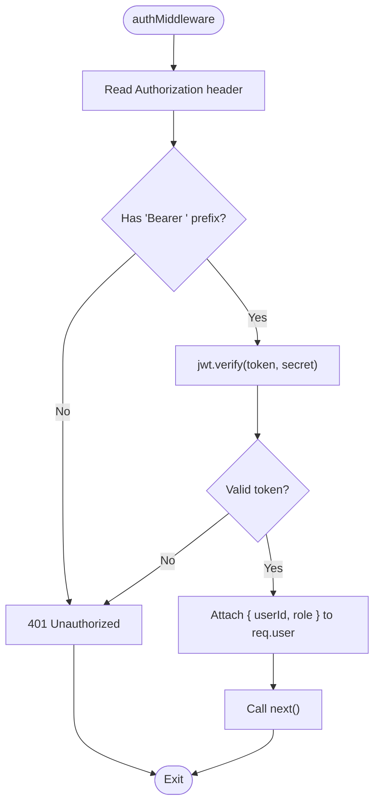
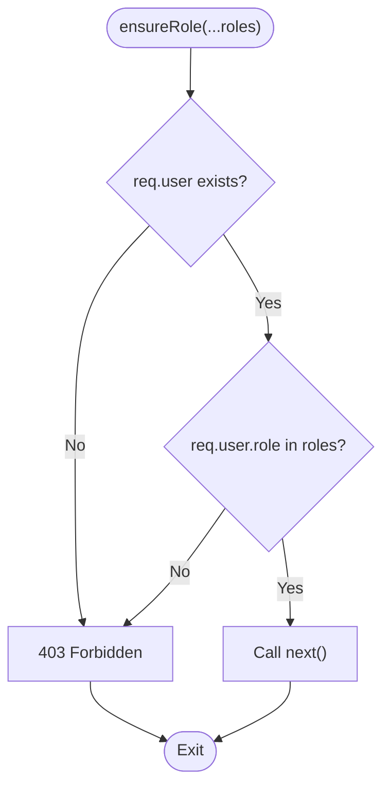
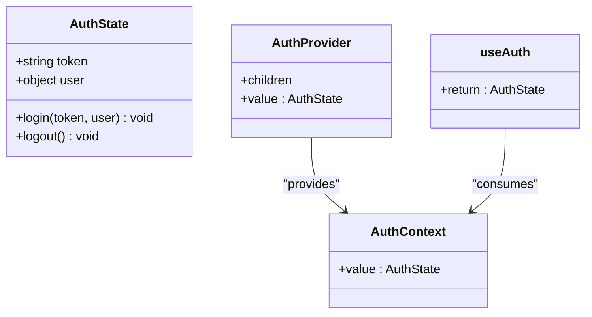
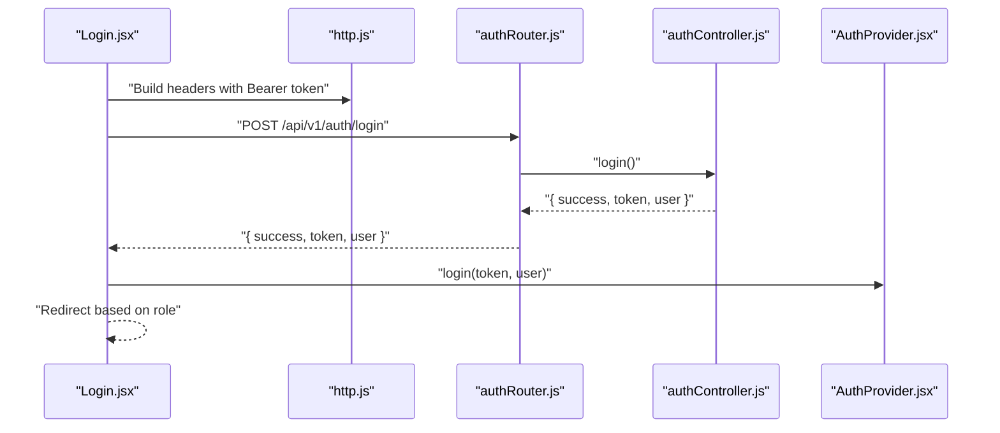
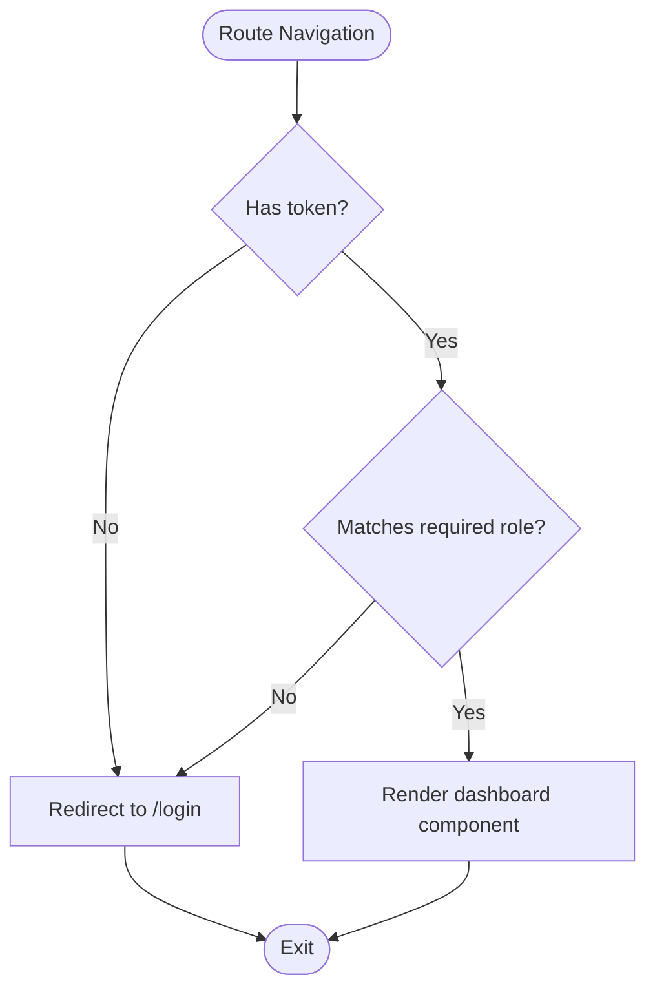
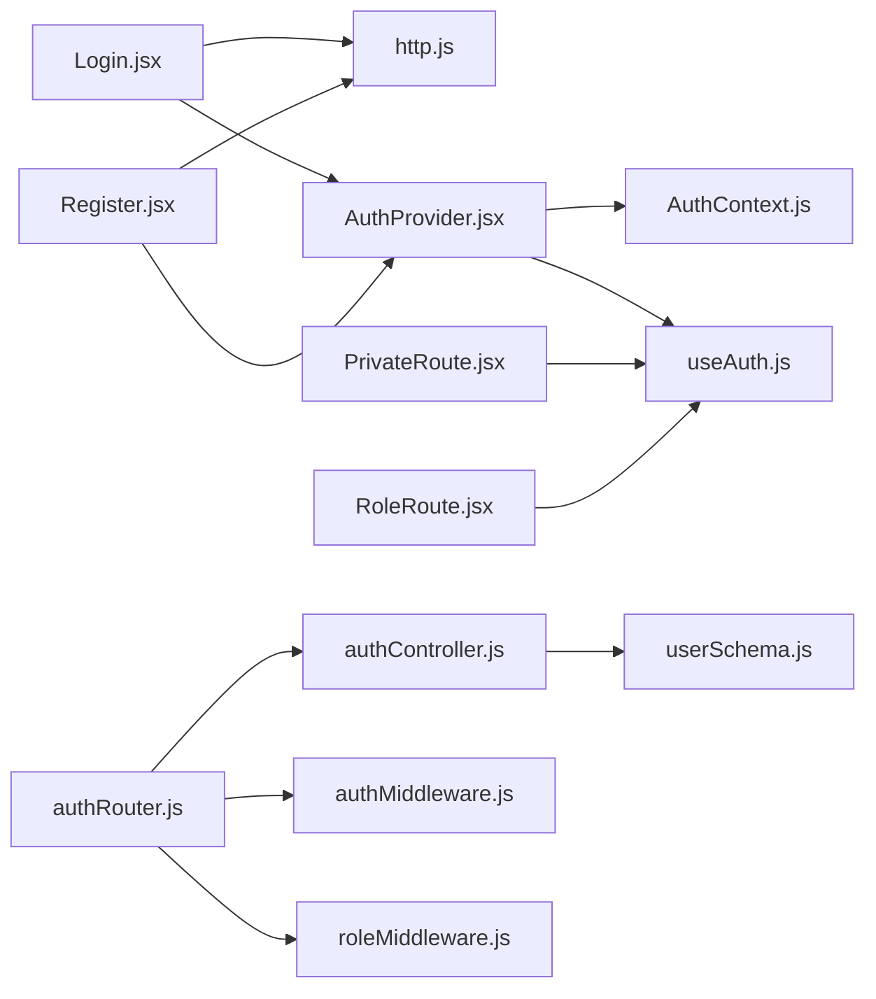

# Authentication System

<cite>
**Referenced Files in This Document**
- [authController.js](file://backend/controller/authController.js)
- [authRouter.js](file://backend/router/authRouter.js)
- [authMiddleware.js](file://backend/middleware/authMiddleware.js)
- [roleMiddleware.js](file://backend/middleware/roleMiddleware.js)
- [userSchema.js](file://backend/models/userSchema.js)
- [http.js](file://frontend/src/lib/http.js)
- [AuthContext.js](file://frontend/src/context/AuthContext.js)
- [useAuth.js](file://frontend/src/context/useAuth.js)
- [AuthProvider.jsx](file://frontend/src/context/AuthProvider.jsx)
- [Login.jsx](file://frontend/src/components/Login.jsx)
- [Register.jsx](file://frontend/src/components/Register.jsx)
- [PrivateRoute.jsx](file://frontend/src/components/PrivateRoute.jsx)
- [RoleRoute.jsx](file://frontend/src/components/RoleRoute.jsx)
- [App.jsx](file://frontend/src/App.jsx)
</cite>

## Table of Contents
1. [Introduction](#introduction)
2. [Project Structure](#project-structure)
3. [Core Components](#core-components)
4. [Architecture Overview](#architecture-overview)
5. [Detailed Component Analysis](#detailed-component-analysis)
6. [Dependency Analysis](#dependency-analysis)
7. [Performance Considerations](#performance-considerations)
8. [Security Considerations](#security-considerations)
9. [Troubleshooting Guide](#troubleshooting-guide)
10. [Conclusion](#conclusion)

## Introduction
This document provides comprehensive authentication system documentation for the MERN Stack Event Management Platform. It covers JWT-based authentication, user registration and login, password hashing with bcrypt, role-based access control (User, Merchant, Admin), authentication middleware, token validation, protected routes, and frontend authentication state management with React Context API. It also includes practical guidance on token refresh strategies, troubleshooting authentication issues, and security best practices.

## Project Structure
The authentication system spans both backend and frontend:
- Backend: Express routes, controllers, middleware, and Mongoose model for user roles and credentials
- Frontend: React Context API for authentication state, route guards, and UI components for login and registration

**Diagram sources**
- [authRouter.js:1-12](file://backend/router/authRouter.js#L1-L12)
- [authController.js:1-120](file://backend/controller/authController.js#L1-L120)
- [authMiddleware.js:1-17](file://backend/middleware/authMiddleware.js#L1-L17)
- [roleMiddleware.js:1-9](file://backend/middleware/roleMiddleware.js#L1-L9)
- [userSchema.js:1-55](file://backend/models/userSchema.js#L1-L55)
- [App.jsx:1-373](file://frontend/src/App.jsx#L1-L373)
- [PrivateRoute.jsx:1-15](file://frontend/src/components/PrivateRoute.jsx#L1-L15)
- [RoleRoute.jsx:1-16](file://frontend/src/components/RoleRoute.jsx#L1-L16)
- [Login.jsx:1-108](file://frontend/src/components/Login.jsx#L1-L108)
- [Register.jsx:1-93](file://frontend/src/components/Register.jsx#L1-L93)
- [http.js:1-5](file://frontend/src/lib/http.js#L1-L5)
- [AuthContext.js:1-5](file://frontend/src/context/AuthContext.js#L1-L5)
- [useAuth.js:1-6](file://frontend/src/context/useAuth.js#L1-L6)
- [AuthProvider.jsx:1-3](file://frontend/src/context/AuthProvider.jsx#L1-L3)

**Section sources**
- [authRouter.js:1-12](file://backend/router/authRouter.js#L1-L12)
- [authController.js:1-120](file://backend/controller/authController.js#L1-L120)
- [authMiddleware.js:1-17](file://backend/middleware/authMiddleware.js#L1-L17)
- [roleMiddleware.js:1-9](file://backend/middleware/roleMiddleware.js#L1-L9)
- [userSchema.js:1-55](file://backend/models/userSchema.js#L1-L55)
- [App.jsx:1-373](file://frontend/src/App.jsx#L1-L373)
- [PrivateRoute.jsx:1-15](file://frontend/src/components/PrivateRoute.jsx#L1-L15)
- [RoleRoute.jsx:1-16](file://frontend/src/components/RoleRoute.jsx#L1-L16)
- [Login.jsx:1-108](file://frontend/src/components/Login.jsx#L1-L108)
- [Register.jsx:1-93](file://frontend/src/components/Register.jsx#L1-L93)
- [http.js:1-5](file://frontend/src/lib/http.js#L1-L5)
- [AuthContext.js:1-5](file://frontend/src/context/AuthContext.js#L1-L5)
- [useAuth.js:1-6](file://frontend/src/context/useAuth.js#L1-L6)
- [AuthProvider.jsx:1-3](file://frontend/src/context/AuthProvider.jsx#L1-L3)

## Core Components
- Backend authentication controller: Implements registration, login, and profile retrieval with bcrypt password hashing and JWT token issuance
- Authentication middleware: Extracts and validates JWT tokens from Authorization headers
- Role middleware: Enforces role-based access control for protected routes
- User model: Defines schema with role enumeration and password field handling
- Frontend authentication context: Provides centralized authentication state and helpers
- Route guards: PrivateRoute and RoleRoute enforce authentication and role checks
- HTTP utilities: Standardized Authorization header construction for authenticated requests

**Section sources**
- [authController.js:1-120](file://backend/controller/authController.js#L1-L120)
- [authMiddleware.js:1-17](file://backend/middleware/authMiddleware.js#L1-L17)
- [roleMiddleware.js:1-9](file://backend/middleware/roleMiddleware.js#L1-L9)
- [userSchema.js:1-55](file://backend/models/userSchema.js#L1-L55)
- [http.js:1-5](file://frontend/src/lib/http.js#L1-L5)
- [AuthContext.js:1-5](file://frontend/src/context/AuthContext.js#L1-L5)
- [useAuth.js:1-6](file://frontend/src/context/useAuth.js#L1-L6)
- [AuthProvider.jsx:1-3](file://frontend/src/context/AuthProvider.jsx#L1-L3)
- [PrivateRoute.jsx:1-15](file://frontend/src/components/PrivateRoute.jsx#L1-L15)
- [RoleRoute.jsx:1-16](file://frontend/src/components/RoleRoute.jsx#L1-L16)

## Architecture Overview
The authentication architecture follows a layered pattern:
- Client-side React components trigger authentication actions via HTTP requests
- Backend routes delegate to controllers for business logic
- Middleware validates tokens and enforces roles
- Controllers interact with the user model and issue JWT tokens
- Frontend stores tokens and manages protected routing

**Diagram sources**
- [authRouter.js:1-12](file://backend/router/authRouter.js#L1-L12)
- [authController.js:54-119](file://backend/controller/authController.js#L54-L119)
- [authMiddleware.js:3-16](file://backend/middleware/authMiddleware.js#L3-L16)
- [userSchema.js:1-55](file://backend/models/userSchema.js#L1-L55)

## Detailed Component Analysis

### Backend Authentication Controller
Implements:
- Registration: Validates input, checks uniqueness, hashes password with bcrypt, creates user, and issues JWT
- Login: Finds user by email, compares hashed passwords, and issues JWT
- Profile retrieval: Returns current user without password

Key behaviors:
- Password hashing uses bcrypt with a salt round of 10
- Token expiration configured via environment variable
- Role defaults to "user" unless explicitly provided and valid
- Input validation and error handling for missing fields and invalid credentials

**Diagram sources**
- [authController.js:11-52](file://backend/controller/authController.js#L11-L52)

**Section sources**
- [authController.js:1-120](file://backend/controller/authController.js#L1-L120)

### Authentication Middleware
Responsibilities:
- Extracts Bearer token from Authorization header
- Verifies JWT signature against secret
- Attaches decoded user identity to request object

Behavior:
- Returns 401 Unauthorized if token is missing or invalid
- Populates req.user with { userId, role }

**Diagram sources**
- [authMiddleware.js:3-16](file://backend/middleware/authMiddleware.js#L3-L16)

**Section sources**
- [authMiddleware.js:1-17](file://backend/middleware/authMiddleware.js#L1-L17)

### Role-Based Access Control Middleware
Responsibilities:
- Ensures the authenticated user has one of the required roles
- Returns 403 Forbidden if role mismatch

Usage:
- Wrap routes with ensureRole("admin", "merchant")
- Can be combined with auth middleware for layered protection

**Diagram sources**
- [roleMiddleware.js:1-9](file://backend/middleware/roleMiddleware.js#L1-L9)

**Section sources**
- [roleMiddleware.js:1-9](file://backend/middleware/roleMiddleware.js#L1-L9)

### User Model Schema
Defines:
- Name, email, password, role, status, and optional merchant fields
- Validation rules for email and password length
- Role enumeration includes "user", "admin", "merchant"
- Password field hidden from queries by default

Implications:
- Supports role-based UI and backend enforcement
- Passwords stored securely with hashing
- Unique email constraint prevents duplicates

**Section sources**
- [userSchema.js:1-55](file://backend/models/userSchema.js#L1-L55)

### Frontend Authentication Context and State Management
React Context API provides:
- Centralized authentication state (token, user)
- Helpers for login and logout
- Hook useAuth() to consume context

Components:
- AuthProvider wraps the app and initializes context
- useAuth exposes token and user to components
- AuthContext defines the context shape

**Diagram sources**
- [AuthContext.js:1-5](file://frontend/src/context/AuthContext.js#L1-L5)
- [useAuth.js:1-6](file://frontend/src/context/useAuth.js#L1-L6)
- [AuthProvider.jsx:1-3](file://frontend/src/context/AuthProvider.jsx#L1-L3)

**Section sources**
- [AuthContext.js:1-5](file://frontend/src/context/AuthContext.js#L1-L5)
- [useAuth.js:1-6](file://frontend/src/context/useAuth.js#L1-L6)
- [AuthProvider.jsx:1-3](file://frontend/src/context/AuthProvider.jsx#L1-L3)

### Login and Registration Flows
Login flow:
- Collects email and password
- Sends POST to backend login endpoint
- On success, stores token and user in context
- Redirects based on role or previous location

Registration flow:
- Collects name, email, password, and role
- Sends POST to backend register endpoint
- On success, stores token and user in context
- Redirects based on role

**Diagram sources**
- [Login.jsx:15-66](file://frontend/src/components/Login.jsx#L15-L66)
- [http.js:1-5](file://frontend/src/lib/http.js#L1-5)
- [authRouter.js:7-9](file://backend/router/authRouter.js#L7-L9)
- [authController.js:54-107](file://backend/controller/authController.js#L54-L107)
- [AuthProvider.jsx:1-3](file://frontend/src/context/AuthProvider.jsx#L1-L3)

**Section sources**
- [Login.jsx:1-108](file://frontend/src/components/Login.jsx#L1-L108)
- [Register.jsx:1-93](file://frontend/src/components/Register.jsx#L1-L93)
- [http.js:1-5](file://frontend/src/lib/http.js#L1-L5)
- [authRouter.js:1-12](file://backend/router/authRouter.js#L1-L12)
- [authController.js:1-120](file://backend/controller/authController.js#L1-L120)
- [AuthProvider.jsx:1-3](file://frontend/src/context/AuthProvider.jsx#L1-L3)

### Protected Routes and Role-Based UI Rendering
Protected routes:
- PrivateRoute ensures presence of token before rendering children
- RoleRoute enforces role equality for dashboard pages

Routing:
- App.jsx defines nested routes for User, Merchant, and Admin dashboards
- Dashboards are wrapped with PrivateRoute and RoleRoute
- Redirects occur based on user role upon login

**Diagram sources**
- [PrivateRoute.jsx:5-9](file://frontend/src/components/PrivateRoute.jsx#L5-L9)
- [RoleRoute.jsx:5-9](file://frontend/src/components/RoleRoute.jsx#L5-L9)
- [App.jsx:76-348](file://frontend/src/App.jsx#L76-L348)

**Section sources**
- [PrivateRoute.jsx:1-15](file://frontend/src/components/PrivateRoute.jsx#L1-L15)
- [RoleRoute.jsx:1-16](file://frontend/src/components/RoleRoute.jsx#L1-L16)
- [App.jsx:1-373](file://frontend/src/App.jsx#L1-L373)

## Dependency Analysis
Backend dependencies:
- authRouter depends on authController and middleware
- authController depends on userSchema and bcrypt/jwt
- authMiddleware depends on jwt
- roleMiddleware is standalone but used with auth middleware

Frontend dependencies:
- Login and Register components depend on http utilities and AuthProvider
- PrivateRoute and RoleRoute depend on useAuth hook
- App.jsx composes all route guards and dashboard routes

**Diagram sources**
- [Login.jsx:1-108](file://frontend/src/components/Login.jsx#L1-L108)
- [Register.jsx:1-93](file://frontend/src/components/Register.jsx#L1-L93)
- [http.js:1-5](file://frontend/src/lib/http.js#L1-L5)
- [AuthProvider.jsx:1-3](file://frontend/src/context/AuthProvider.jsx#L1-L3)
- [AuthContext.js:1-5](file://frontend/src/context/AuthContext.js#L1-L5)
- [useAuth.js:1-6](file://frontend/src/context/useAuth.js#L1-L6)
- [PrivateRoute.jsx:1-15](file://frontend/src/components/PrivateRoute.jsx#L1-L15)
- [RoleRoute.jsx:1-16](file://frontend/src/components/RoleRoute.jsx#L1-L16)
- [authRouter.js:1-12](file://backend/router/authRouter.js#L1-L12)
- [authController.js:1-120](file://backend/controller/authController.js#L1-L120)
- [authMiddleware.js:1-17](file://backend/middleware/authMiddleware.js#L1-L17)
- [roleMiddleware.js:1-9](file://backend/middleware/roleMiddleware.js#L1-L9)
- [userSchema.js:1-55](file://backend/models/userSchema.js#L1-L55)

**Section sources**
- [authRouter.js:1-12](file://backend/router/authRouter.js#L1-L12)
- [authController.js:1-120](file://backend/controller/authController.js#L1-L120)
- [authMiddleware.js:1-17](file://backend/middleware/authMiddleware.js#L1-L17)
- [roleMiddleware.js:1-9](file://backend/middleware/roleMiddleware.js#L1-L9)
- [userSchema.js:1-55](file://backend/models/userSchema.js#L1-L55)
- [Login.jsx:1-108](file://frontend/src/components/Login.jsx#L1-L108)
- [Register.jsx:1-93](file://frontend/src/components/Register.jsx#L1-L93)
- [http.js:1-5](file://frontend/src/lib/http.js#L1-L5)
- [AuthProvider.jsx:1-3](file://frontend/src/context/AuthProvider.jsx#L1-L3)
- [AuthContext.js:1-5](file://frontend/src/context/AuthContext.js#L1-L5)
- [useAuth.js:1-6](file://frontend/src/context/useAuth.js#L1-L6)
- [PrivateRoute.jsx:1-15](file://frontend/src/components/PrivateRoute.jsx#L1-L15)
- [RoleRoute.jsx:1-16](file://frontend/src/components/RoleRoute.jsx#L1-L16)
- [App.jsx:1-373](file://frontend/src/App.jsx#L1-L373)

## Performance Considerations
- Token verification overhead is minimal; ensure JWT_SECRET is strong and environment-specific
- bcrypt cost (currently 10) balances security and performance; adjust based on hardware
- Avoid unnecessary database queries by caching frequently accessed user data per session
- Use HTTPS in production to prevent token interception
- Implement token expiration and consider refresh tokens for long sessions

## Security Considerations
- JWT_SECRET must be kept confidential and rotated periodically
- Use HTTPS to protect tokens in transit
- Validate and sanitize all inputs on the backend
- Enforce role-based access control on both frontend and backend
- Store tokens securely (e.g., HttpOnly cookies if using server-rendered flows, or secure storage if using SPA)
- Implement rate limiting for login attempts
- Log authentication events for auditing

## Troubleshooting Guide
Common issues and resolutions:
- 401 Unauthorized on protected routes
  - Ensure Authorization header includes "Bearer " followed by a valid token
  - Verify JWT_SECRET matches backend configuration
- 403 Forbidden errors
  - Confirm user role matches required role for the route
  - Check middleware composition order: auth first, then role
- Registration conflicts
  - Duplicate email detected; use a different email address
- Login failures
  - Verify email and password correctness; ensure bcrypt hashing is functioning
- Frontend redirects incorrect
  - Check role values returned by backend and routing logic in Login component
- Token not persisting
  - Confirm AuthProvider is wrapping the application and context updates are applied

**Section sources**
- [authMiddleware.js:3-16](file://backend/middleware/authMiddleware.js#L3-L16)
- [roleMiddleware.js:1-9](file://backend/middleware/roleMiddleware.js#L1-L9)
- [authController.js:17-30](file://backend/controller/authController.js#L17-L30)
- [authController.js:60-81](file://backend/controller/authController.js#L60-L81)
- [Login.jsx:15-66](file://frontend/src/components/Login.jsx#L15-L66)
- [App.jsx:76-348](file://frontend/src/App.jsx#L76-L348)

## Token Refresh Strategies
Recommended approaches:
- Short-lived access tokens with long-lived refresh tokens
- On access token expiry, send refresh token to backend to obtain a new access token
- Store refresh tokens securely (HttpOnly cookie) and rotate them regularly
- Implement token rotation and revocation on logout or suspicious activity

## Conclusion
The authentication system integrates JWT-based backend validation with React Context API for frontend state management. It supports role-based access control across User, Merchant, and Admin dashboards, with robust middleware enforcement. By following the security and troubleshooting guidance, the platform can maintain secure and reliable authentication across all user roles.