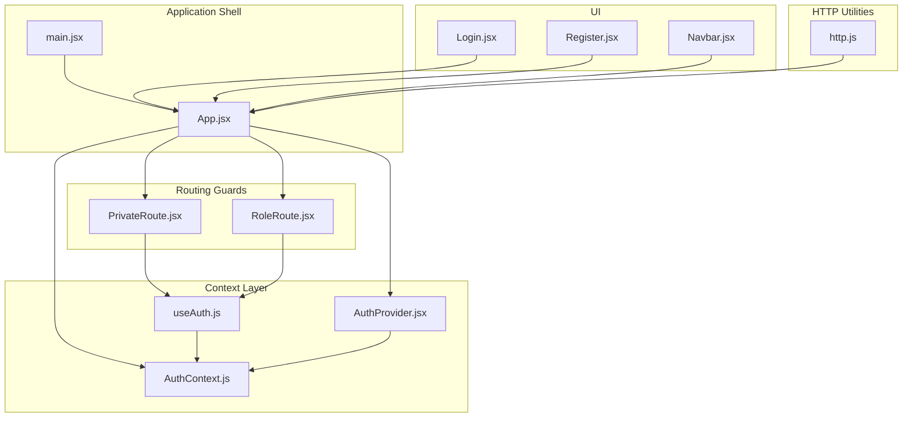
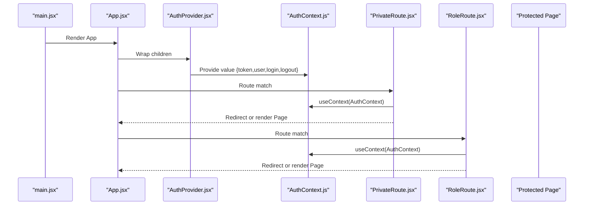
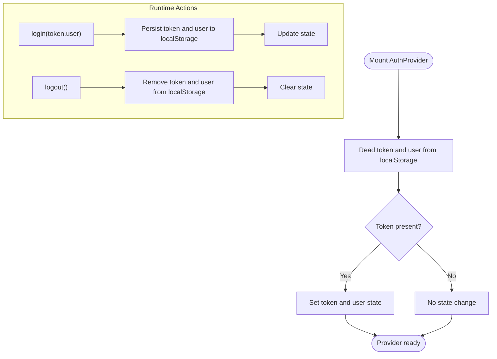
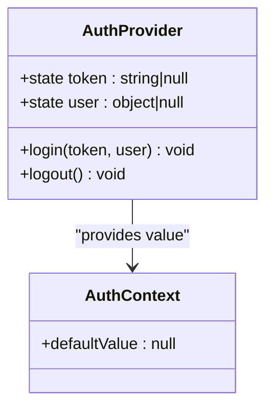
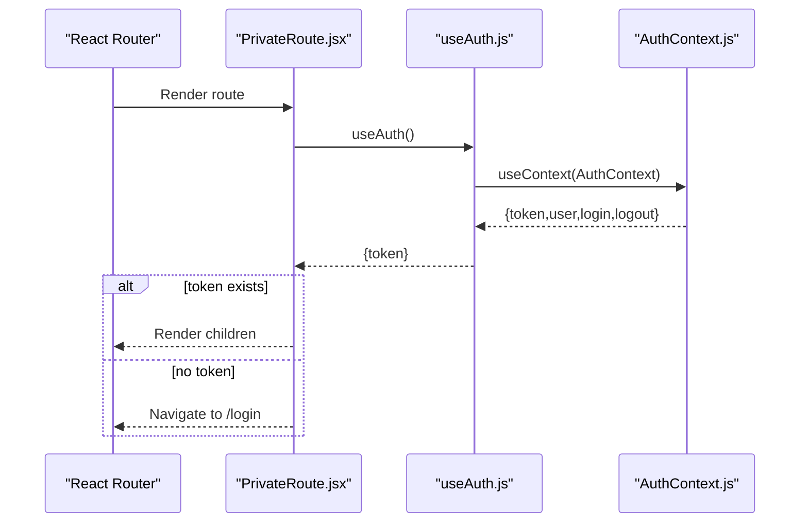
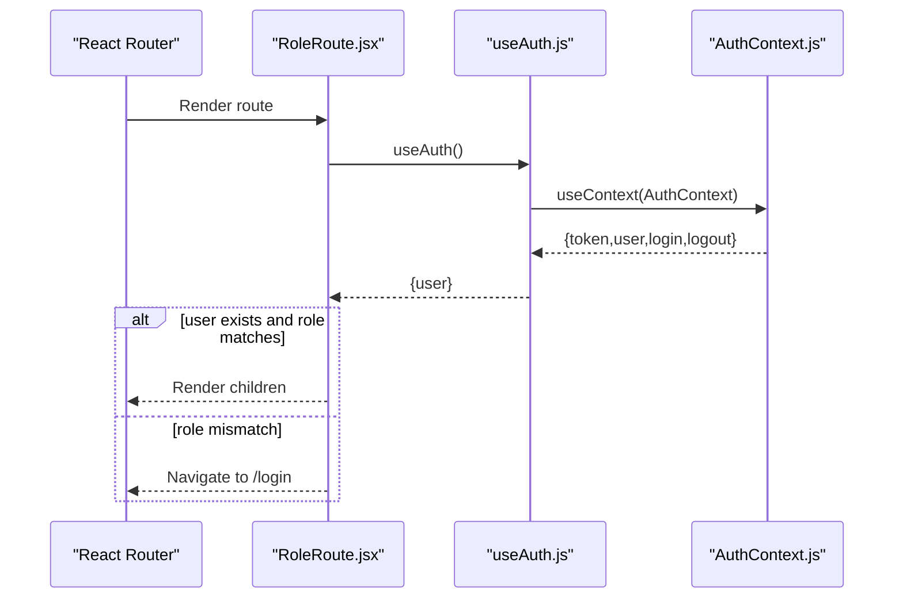
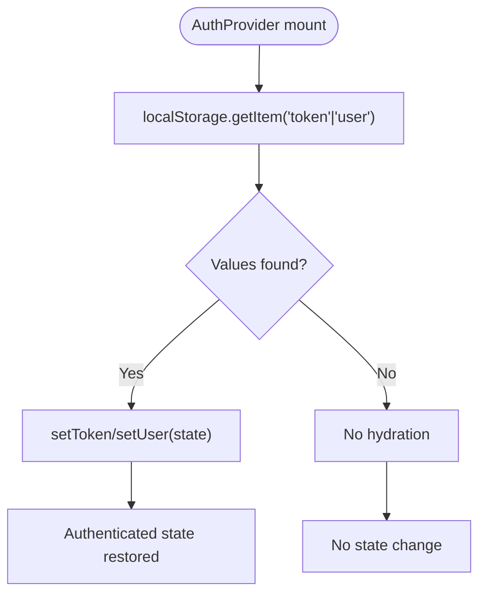
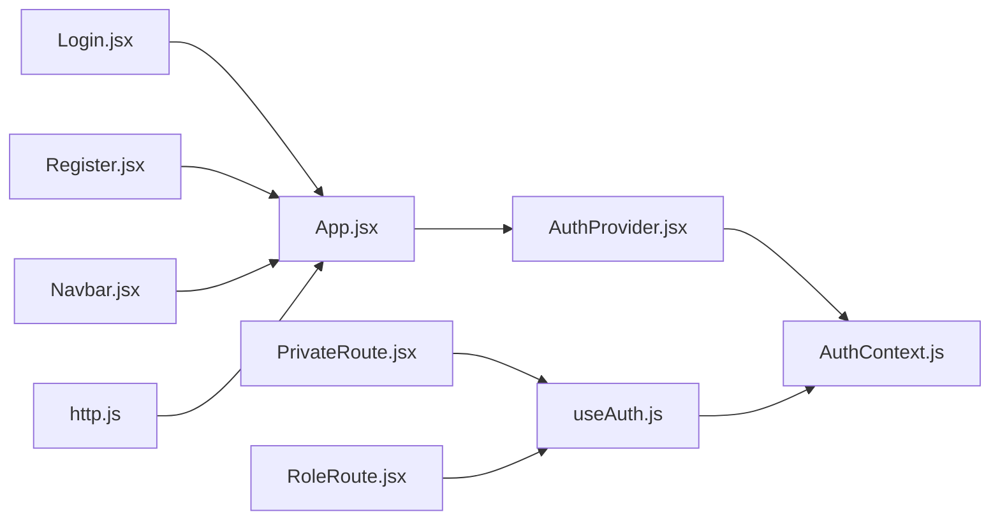

# Frontend Authentication State Management

<cite>
**Referenced Files in This Document**
- [AuthContext.js](file://frontend/src/context/AuthContext.js)
- [AuthProvider.jsx](file://frontend/src/context/AuthProvider.jsx)
- [useAuth.js](file://frontend/src/context/useAuth.js)
- [App.jsx](file://frontend/src/App.jsx)
- [main.jsx](file://frontend/src/main.jsx)
- [PrivateRoute.jsx](file://frontend/src/components/PrivateRoute.jsx)
- [RoleRoute.jsx](file://frontend/src/components/RoleRoute.jsx)
- [http.js](file://frontend/src/lib/http.js)
- [Navbar.jsx](file://frontend/src/components/Navbar.jsx)
- [Login.jsx](file://frontend/src/pages/Login.jsx)
- [Register.jsx](file://frontend/src/pages/Register.jsx)
</cite>

## Table of Contents
1. [Introduction](#introduction)
2. [Project Structure](#project-structure)
3. [Core Components](#core-components)
4. [Architecture Overview](#architecture-overview)
5. [Detailed Component Analysis](#detailed-component-analysis)
6. [Dependency Analysis](#dependency-analysis)
7. [Performance Considerations](#performance-considerations)
8. [Troubleshooting Guide](#troubleshooting-guide)
9. [Conclusion](#conclusion)

## Introduction
This document explains the frontend authentication state management built with React Context API in the MERN stack event project. It covers the AuthProvider implementation, authentication context creation, state management patterns, user session persistence, automatic login restoration, logout functionality, private route protection, conditional rendering based on authentication status, role-based UI components, consuming authentication context in components, authentication guards, state synchronization across components, and performance optimization techniques.

## Project Structure
The authentication system is organized around a small set of files under the context and components directories, with routing and UI integration in App.jsx and related pages/components.

**Diagram sources**
- [main.jsx:1-11](file://frontend/src/main.jsx#L1-L11)
- [App.jsx:1-373](file://frontend/src/App.jsx#L1-L373)
- [AuthContext.js:1-5](file://frontend/src/context/AuthContext.js#L1-L5)
- [AuthProvider.jsx:1-38](file://frontend/src/context/AuthProvider.jsx#L1-L38)
- [useAuth.js:1-6](file://frontend/src/context/useAuth.js#L1-L6)
- [PrivateRoute.jsx:1-15](file://frontend/src/components/PrivateRoute.jsx#L1-L15)
- [RoleRoute.jsx:1-16](file://frontend/src/components/RoleRoute.jsx#L1-L16)
- [http.js:1-5](file://frontend/src/lib/http.js#L1-L5)
- [Navbar.jsx:1-60](file://frontend/src/components/Navbar.jsx#L1-L60)
- [Login.jsx:1-8](file://frontend/src/pages/Login.jsx#L1-L8)
- [Register.jsx:1-8](file://frontend/src/pages/Register.jsx#L1-L8)

**Section sources**
- [main.jsx:1-11](file://frontend/src/main.jsx#L1-L11)
- [App.jsx:1-373](file://frontend/src/App.jsx#L1-L373)

## Core Components
- AuthContext: Creates a React context with null default value.
- AuthProvider: Provides authentication state (token, user), persists to localStorage, and exposes login/logout functions.
- useAuth: Hook to consume the AuthContext.
- PrivateRoute: Route guard that redirects unauthenticated users to the login page.
- RoleRoute: Route guard that restricts routes by user role.

Key responsibilities:
- State management: token and user objects stored in provider state.
- Persistence: token and user persisted to localStorage during login and cleared on logout.
- Restoration: On initial render, provider reads token and user from localStorage to restore login state.
- Guards: PrivateRoute checks token presence; RoleRoute checks user role.

**Section sources**
- [AuthContext.js:1-5](file://frontend/src/context/AuthContext.js#L1-L5)
- [AuthProvider.jsx:1-38](file://frontend/src/context/AuthProvider.jsx#L1-L38)
- [useAuth.js:1-6](file://frontend/src/context/useAuth.js#L1-L6)
- [PrivateRoute.jsx:1-15](file://frontend/src/components/PrivateRoute.jsx#L1-L15)
- [RoleRoute.jsx:1-16](file://frontend/src/components/RoleRoute.jsx#L1-L16)

## Architecture Overview
The authentication architecture centers on a single AuthProvider wrapping the application, exposing a context consumed by guards and components. Routing integrates guards to protect dashboard routes by role.

**Diagram sources**
- [main.jsx:1-11](file://frontend/src/main.jsx#L1-L11)
- [App.jsx:1-373](file://frontend/src/App.jsx#L1-L373)
- [AuthProvider.jsx:1-38](file://frontend/src/context/AuthProvider.jsx#L1-L38)
- [AuthContext.js:1-5](file://frontend/src/context/AuthContext.js#L1-L5)
- [PrivateRoute.jsx:1-15](file://frontend/src/components/PrivateRoute.jsx#L1-L15)
- [RoleRoute.jsx:1-16](file://frontend/src/components/RoleRoute.jsx#L1-L16)

## Detailed Component Analysis

### AuthProvider Implementation
- State initialization: token and user initialized from localStorage on mount.
- Persistence: login writes token and user to localStorage; logout removes them.
- Exposed methods: login(token, user) and logout().
- Provider value: passes token, user, login, and logout to consumers.

**Diagram sources**
- [AuthProvider.jsx:1-38](file://frontend/src/context/AuthProvider.jsx#L1-L38)

**Section sources**
- [AuthProvider.jsx:1-38](file://frontend/src/context/AuthProvider.jsx#L1-L38)

### Authentication Context Creation
- A React context is created with a null default value.
- AuthProvider supplies the actual context value containing token, user, login, and logout.

**Diagram sources**
- [AuthContext.js:1-5](file://frontend/src/context/AuthContext.js#L1-L5)
- [AuthProvider.jsx:1-38](file://frontend/src/context/AuthProvider.jsx#L1-L38)

**Section sources**
- [AuthContext.js:1-5](file://frontend/src/context/AuthContext.js#L1-L5)
- [AuthProvider.jsx:1-38](file://frontend/src/context/AuthProvider.jsx#L1-L38)

### useAuth Hook
- Returns the current AuthContext value.
- Enables components to access token, user, login, and logout without manual context consumption.

**Section sources**
- [useAuth.js:1-6](file://frontend/src/context/useAuth.js#L1-L6)

### Private Route Protection
- PrivateRoute checks token presence via useAuth.
- If no token, redirects to "/login"; otherwise renders children.

**Diagram sources**
- [PrivateRoute.jsx:1-15](file://frontend/src/components/PrivateRoute.jsx#L1-L15)
- [useAuth.js:1-6](file://frontend/src/context/useAuth.js#L1-L6)
- [AuthContext.js:1-5](file://frontend/src/context/AuthContext.js#L1-L5)

**Section sources**
- [PrivateRoute.jsx:1-15](file://frontend/src/components/PrivateRoute.jsx#L1-L15)

### Role-Based Route Protection
- RoleRoute accepts a role prop and compares user.role against it.
- If user is missing or role mismatch occurs, redirects to "/login".

**Diagram sources**
- [RoleRoute.jsx:1-16](file://frontend/src/components/RoleRoute.jsx#L1-L16)
- [useAuth.js:1-6](file://frontend/src/context/useAuth.js#L1-L6)
- [AuthContext.js:1-5](file://frontend/src/context/AuthContext.js#L1-L5)

**Section sources**
- [RoleRoute.jsx:1-16](file://frontend/src/components/RoleRoute.jsx#L1-L16)

### Consuming Authentication Context in Components
- Components can import useAuth to access token, user, login, and logout.
- Example usage patterns:
  - Conditional rendering based on token presence.
  - Role-aware UI elements using user.role.
  - Triggering logout to clear state and localStorage.

Integration points:
- App.jsx wraps the routing tree with AuthProvider.
- Navbar.jsx links to login/register pages for unauthenticated users.

**Section sources**
- [App.jsx:1-373](file://frontend/src/App.jsx#L1-L373)
- [Navbar.jsx:1-60](file://frontend/src/components/Navbar.jsx#L1-L60)
- [Login.jsx:1-8](file://frontend/src/pages/Login.jsx#L1-L8)
- [Register.jsx:1-8](file://frontend/src/pages/Register.jsx#L1-L8)

### Session Persistence and Automatic Login Restoration
- On mount, AuthProvider reads token and user from localStorage.
- If present, state is hydrated to reflect logged-in status without requiring re-login.

**Diagram sources**
- [AuthProvider.jsx:1-38](file://frontend/src/context/AuthProvider.jsx#L1-L38)

**Section sources**
- [AuthProvider.jsx:1-38](file://frontend/src/context/AuthProvider.jsx#L1-L38)

### Logout Functionality
- logout clears token and user from state and removes them from localStorage.
- Guards automatically redirect to login after logout.

**Section sources**
- [AuthProvider.jsx:1-38](file://frontend/src/context/AuthProvider.jsx#L1-L38)
- [PrivateRoute.jsx:1-15](file://frontend/src/components/PrivateRoute.jsx#L1-L15)
- [RoleRoute.jsx:1-16](file://frontend/src/components/RoleRoute.jsx#L1-L16)

### HTTP Integration and Bearer Token
- http.js defines API base URL and a helper to attach a Bearer token to outgoing requests.
- Components using useAuth can pass the current token to authHeaders to sign API calls.

**Section sources**
- [http.js:1-5](file://frontend/src/lib/http.js#L1-L5)

## Dependency Analysis
The authentication system exhibits low coupling and clear separation of concerns:
- AuthProvider depends on React hooks and localStorage.
- Guards depend on useAuth and react-router-dom.
- App.jsx orchestrates routing and wraps the tree with AuthProvider.
- UI components conditionally render based on context values.

**Diagram sources**
- [App.jsx:1-373](file://frontend/src/App.jsx#L1-L373)
- [AuthProvider.jsx:1-38](file://frontend/src/context/AuthProvider.jsx#L1-L38)
- [AuthContext.js:1-5](file://frontend/src/context/AuthContext.js#L1-L5)
- [useAuth.js:1-6](file://frontend/src/context/useAuth.js#L1-L6)
- [PrivateRoute.jsx:1-15](file://frontend/src/components/PrivateRoute.jsx#L1-L15)
- [RoleRoute.jsx:1-16](file://frontend/src/components/RoleRoute.jsx#L1-L16)
- [http.js:1-5](file://frontend/src/lib/http.js#L1-L5)
- [Login.jsx:1-8](file://frontend/src/pages/Login.jsx#L1-L8)
- [Register.jsx:1-8](file://frontend/src/pages/Register.jsx#L1-L8)
- [Navbar.jsx:1-60](file://frontend/src/components/Navbar.jsx#L1-L60)

**Section sources**
- [App.jsx:1-373](file://frontend/src/App.jsx#L1-L373)
- [AuthProvider.jsx:1-38](file://frontend/src/context/AuthProvider.jsx#L1-L38)
- [useAuth.js:1-6](file://frontend/src/context/useAuth.js#L1-L6)
- [PrivateRoute.jsx:1-15](file://frontend/src/components/PrivateRoute.jsx#L1-L15)
- [RoleRoute.jsx:1-16](file://frontend/src/components/RoleRoute.jsx#L1-L16)
- [http.js:1-5](file://frontend/src/lib/http.js#L1-L5)

## Performance Considerations
- Context granularity: The context currently exposes token, user, login, and logout as a single object. This is efficient for small apps but consider splitting into separate contexts if the app grows and components only need subsets of data.
- State updates: login/logout update two state fields and two localStorage keys. Keep updates minimal to reduce re-renders.
- Guard rendering: PrivateRoute and RoleRoute are lightweight and only read token/user; they do not cause unnecessary re-renders in other parts of the app.
- LocalStorage I/O: Reading/writing localStorage on mount and on login/logout is acceptable for small payloads but avoid frequent writes in hot loops.
- Strict Mode: main.jsx uses React.StrictMode, which intentionally double-invokes effects in development to surface side effects. This does not impact production behavior.

[No sources needed since this section provides general guidance]

## Troubleshooting Guide
Common issues and resolutions:
- Stale token/user after logout:
  - Ensure logout removes both token and user from localStorage and state.
  - Verify guards redirect to "/login" when token is absent.
- Role mismatch causing redirect:
  - Confirm user.role matches the expected role string in RoleRoute.
  - Ensure user object is hydrated from localStorage on mount.
- Missing Bearer token in API requests:
  - Use http.js authHeaders with the current token from useAuth.
- Guards not working:
  - Verify AuthProvider wraps the routing tree in App.jsx.
  - Ensure useAuth is used inside PrivateRoute/RoleRoute.

**Section sources**
- [AuthProvider.jsx:1-38](file://frontend/src/context/AuthProvider.jsx#L1-L38)
- [PrivateRoute.jsx:1-15](file://frontend/src/components/PrivateRoute.jsx#L1-L15)
- [RoleRoute.jsx:1-16](file://frontend/src/components/RoleRoute.jsx#L1-L16)
- [http.js:1-5](file://frontend/src/lib/http.js#L1-L5)

## Conclusion
The frontend authentication state management leverages React Context API to provide a clean, centralized mechanism for managing login state, persisting sessions, and protecting routes. AuthProvider encapsulates state and persistence, while useAuth simplifies consumer access. PrivateRoute and RoleRoute enforce authentication and role-based access control across the application. The design is modular, easy to extend, and suitable for growth with additional roles, permissions, and state fields.