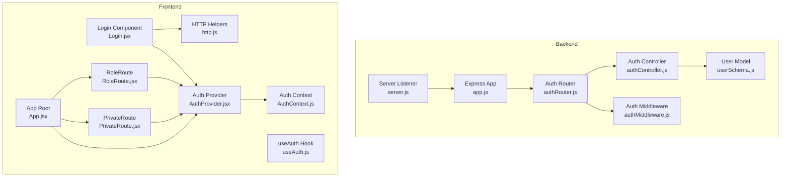
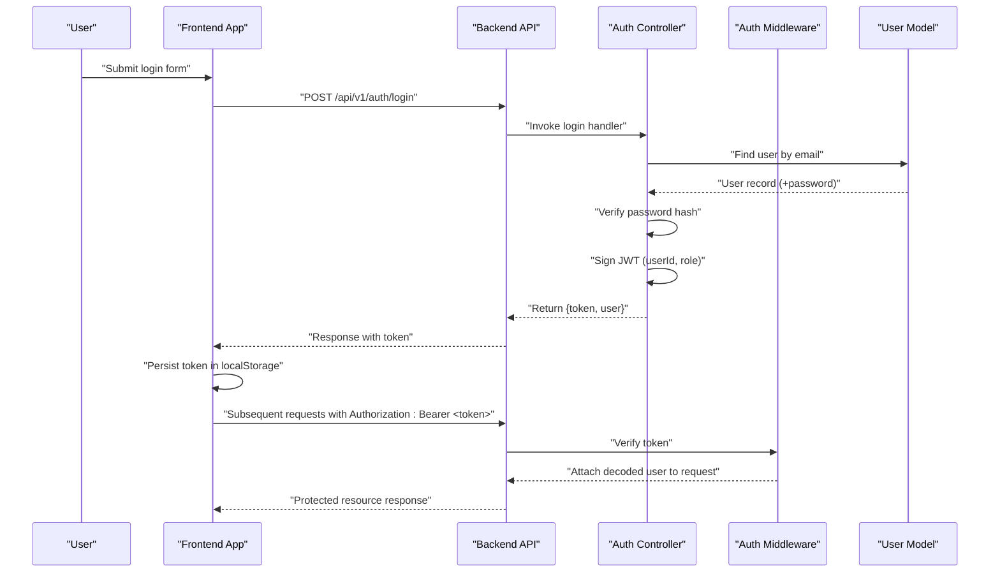
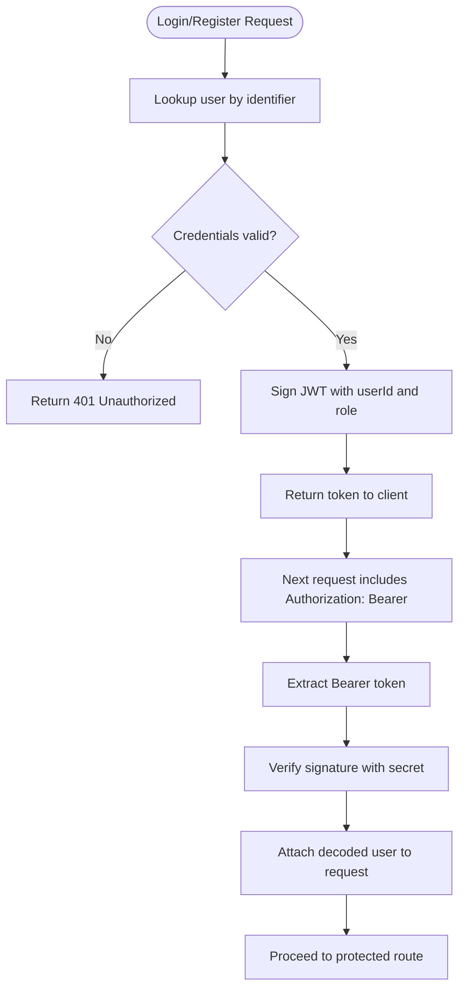
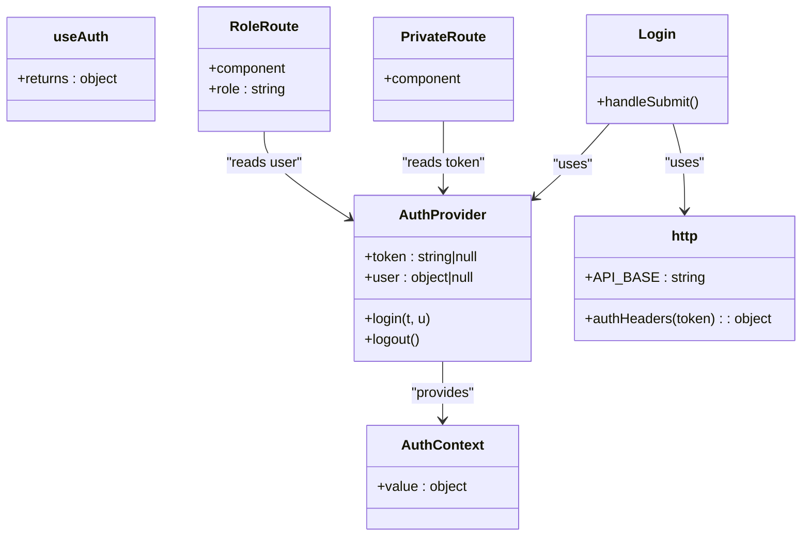
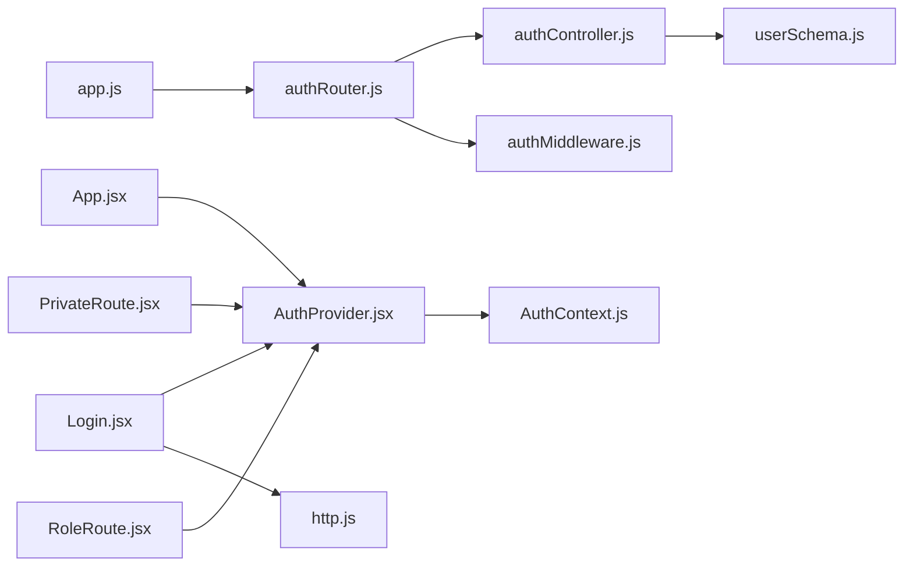

# JWT Token Management

<cite>
**Referenced Files in This Document**
- [app.js](file://backend/app.js)
- [server.js](file://backend/server.js)
- [authController.js](file://backend/controller/authController.js)
- [authRouter.js](file://backend/router/authRouter.js)
- [authMiddleware.js](file://backend/middleware/authMiddleware.js)
- [userSchema.js](file://backend/models/userSchema.js)
- [AuthProvider.jsx](file://frontend/src/context/AuthProvider.jsx)
- [AuthContext.js](file://frontend/src/context/AuthContext.js)
- [useAuth.js](file://frontend/src/context/useAuth.js)
- [http.js](file://frontend/src/lib/http.js)
- [Login.jsx](file://frontend/src/components/Login.jsx)
- [PrivateRoute.jsx](file://frontend/src/components/PrivateRoute.jsx)
- [RoleRoute.jsx](file://frontend/src/components/RoleRoute.jsx)
- [App.jsx](file://frontend/src/App.jsx)
- [config.env](file://backend/config/config.env)
</cite>

## Table of Contents
1. [Introduction](#introduction)
2. [Project Structure](#project-structure)
3. [Core Components](#core-components)
4. [Architecture Overview](#architecture-overview)
5. [Detailed Component Analysis](#detailed-component-analysis)
6. [Dependency Analysis](#dependency-analysis)
7. [Performance Considerations](#performance-considerations)
8. [Security Best Practices](#security-best-practices)
9. [Troubleshooting Guide](#troubleshooting-guide)
10. [Conclusion](#conclusion)

## Introduction
This document explains JWT token management in the authentication system. It covers token creation and signing on the backend, token verification middleware, frontend token storage and context management, automatic token injection in HTTP requests, and route protection. It also outlines expiration handling, secure transmission, and recommended security practices such as avoiding localStorage for sensitive tokens, preventing XSS, and implementing token rotation strategies.

## Project Structure
The authentication system spans backend routes/controllers/middleware and frontend context/providers/components:
- Backend: Express app, auth router, auth controller, JWT signing/verification middleware, user model
- Frontend: Auth provider/context, HTTP helpers, login component, protected route wrappers

**Diagram sources**
- [app.js:1-91](file://backend/app.js#L1-L91)
- [server.js:1-6](file://backend/server.js#L1-L6)
- [authRouter.js:1-12](file://backend/router/authRouter.js#L1-L12)
- [authController.js:1-120](file://backend/controller/authController.js#L1-L120)
- [authMiddleware.js:1-17](file://backend/middleware/authMiddleware.js#L1-L17)
- [userSchema.js:1-55](file://backend/models/userSchema.js#L1-L55)
- [App.jsx:1-373](file://frontend/src/App.jsx#L1-L373)
- [AuthProvider.jsx:1-38](file://frontend/src/context/AuthProvider.jsx#L1-L38)
- [AuthContext.js:1-5](file://frontend/src/context/AuthContext.js#L1-L5)
- [useAuth.js:1-6](file://frontend/src/context/useAuth.js#L1-L6)
- [http.js:1-5](file://frontend/src/lib/http.js#L1-L5)
- [Login.jsx:1-108](file://frontend/src/components/Login.jsx#L1-L108)
- [PrivateRoute.jsx:1-15](file://frontend/src/components/PrivateRoute.jsx#L1-L15)
- [RoleRoute.jsx:1-16](file://frontend/src/components/RoleRoute.jsx#L1-L16)

**Section sources**
- [app.js:1-91](file://backend/app.js#L1-L91)
- [server.js:1-6](file://backend/server.js#L1-L6)
- [authRouter.js:1-12](file://backend/router/authRouter.js#L1-L12)
- [authController.js:1-120](file://backend/controller/authController.js#L1-L120)
- [authMiddleware.js:1-17](file://backend/middleware/authMiddleware.js#L1-L17)
- [userSchema.js:1-55](file://backend/models/userSchema.js#L1-L55)
- [App.jsx:1-373](file://frontend/src/App.jsx#L1-L373)
- [AuthProvider.jsx:1-38](file://frontend/src/context/AuthProvider.jsx#L1-L38)
- [AuthContext.js:1-5](file://frontend/src/context/AuthContext.js#L1-L5)
- [useAuth.js:1-6](file://frontend/src/context/useAuth.js#L1-L6)
- [http.js:1-5](file://frontend/src/lib/http.js#L1-L5)
- [Login.jsx:1-108](file://frontend/src/components/Login.jsx#L1-L108)
- [PrivateRoute.jsx:1-15](file://frontend/src/components/PrivateRoute.jsx#L1-L15)
- [RoleRoute.jsx:1-16](file://frontend/src/components/RoleRoute.jsx#L1-L16)

## Core Components
- Backend JWT signing and verification:
  - Token creation uses a signing function that encodes user identity and role with a secret key and sets an expiration.
  - Request verification extracts the Bearer token from Authorization headers and validates it against the shared secret.
- Frontend token lifecycle:
  - Auth provider stores token and user profile in local storage and exposes login/logout via context.
  - HTTP helper constructs Authorization headers for protected endpoints.
  - Login component posts credentials, receives token, and persists it.
  - Protected routes enforce presence of token and role checks.

Key implementation references:
- Token creation and signing: [authController.js:5-9](file://backend/controller/authController.js#L5-L9)
- Token verification middleware: [authMiddleware.js:3-16](file://backend/middleware/authMiddleware.js#L3-L16)
- Frontend token persistence: [AuthProvider.jsx:9-28](file://frontend/src/context/AuthProvider.jsx#L9-L28)
- Authorization header construction: [http.js:2-4](file://frontend/src/lib/http.js#L2-L4)
- Login flow and token usage: [Login.jsx:15-66](file://frontend/src/components/Login.jsx#L15-L66)
- Route protection: [PrivateRoute.jsx:5-9](file://frontend/src/components/PrivateRoute.jsx#L5-L9), [RoleRoute.jsx:5-9](file://frontend/src/components/RoleRoute.jsx#L5-L9)

**Section sources**
- [authController.js:5-9](file://backend/controller/authController.js#L5-L9)
- [authMiddleware.js:3-16](file://backend/middleware/authMiddleware.js#L3-L16)
- [AuthProvider.jsx:9-28](file://frontend/src/context/AuthProvider.jsx#L9-L28)
- [http.js:2-4](file://frontend/src/lib/http.js#L2-L4)
- [Login.jsx:15-66](file://frontend/src/components/Login.jsx#L15-L66)
- [PrivateRoute.jsx:5-9](file://frontend/src/components/PrivateRoute.jsx#L5-L9)
- [RoleRoute.jsx:5-9](file://frontend/src/components/RoleRoute.jsx#L5-L9)

## Architecture Overview
End-to-end JWT authentication flow from login to protected routes:

**Diagram sources**
- [authRouter.js:7-9](file://backend/router/authRouter.js#L7-L9)
- [authController.js:54-107](file://backend/controller/authController.js#L54-L107)
- [authMiddleware.js:3-16](file://backend/middleware/authMiddleware.js#L3-L16)
- [userSchema.js:33-38](file://backend/models/userSchema.js#L33-L38)
- [Login.jsx:20-31](file://frontend/src/components/Login.jsx#L20-L31)
- [http.js:2-4](file://frontend/src/lib/http.js#L2-L4)

## Detailed Component Analysis

### Backend JWT Signing and Verification
- Token creation:
  - The signing function uses a secret key from environment configuration and sets an expiration period.
  - Claims include user identity and role.
- Token verification:
  - Middleware reads Authorization header, expects Bearer scheme, and verifies the token against the secret.
  - On success, attaches user info to the request object; otherwise responds with unauthorized.

**Diagram sources**
- [authController.js:54-107](file://backend/controller/authController.js#L54-L107)
- [authMiddleware.js:3-16](file://backend/middleware/authMiddleware.js#L3-L16)

**Section sources**
- [authController.js:5-9](file://backend/controller/authController.js#L5-L9)
- [authController.js:54-107](file://backend/controller/authController.js#L54-L107)
- [authMiddleware.js:3-16](file://backend/middleware/authMiddleware.js#L3-L16)

### Frontend Authentication Context and Token Storage
- Context and provider:
  - Stores token and user in state and synchronizes with localStorage on login/logout.
  - Provides login and logout actions to child components.
- HTTP helpers:
  - Builds Authorization header for protected endpoints.
- Login component:
  - Posts credentials to backend, receives token, and persists it.
- Protected routes:
  - PrivateRoute enforces token presence.
  - RoleRoute enforces role-based access.

**Diagram sources**
- [AuthProvider.jsx:1-38](file://frontend/src/context/AuthProvider.jsx#L1-L38)
- [AuthContext.js:1-5](file://frontend/src/context/AuthContext.js#L1-L5)
- [useAuth.js:1-6](file://frontend/src/context/useAuth.js#L1-L6)
- [http.js:1-5](file://frontend/src/lib/http.js#L1-L5)
- [Login.jsx:1-108](file://frontend/src/components/Login.jsx#L1-L108)
- [PrivateRoute.jsx:1-15](file://frontend/src/components/PrivateRoute.jsx#L1-L15)
- [RoleRoute.jsx:1-16](file://frontend/src/components/RoleRoute.jsx#L1-L16)

**Section sources**
- [AuthProvider.jsx:1-38](file://frontend/src/context/AuthProvider.jsx#L1-L38)
- [AuthContext.js:1-5](file://frontend/src/context/AuthContext.js#L1-L5)
- [useAuth.js:1-6](file://frontend/src/context/useAuth.js#L1-L6)
- [http.js:1-5](file://frontend/src/lib/http.js#L1-L5)
- [Login.jsx:1-108](file://frontend/src/components/Login.jsx#L1-L108)
- [PrivateRoute.jsx:1-15](file://frontend/src/components/PrivateRoute.jsx#L1-L15)
- [RoleRoute.jsx:1-16](file://frontend/src/components/RoleRoute.jsx#L1-L16)

### Token Expiration and Automatic Injection
- Expiration:
  - Backend sets token expiration via configuration; default is seven days.
- Automatic injection:
  - HTTP helper constructs Authorization header with Bearer token for protected endpoints.
- Expiration detection:
  - Frontend does not currently implement automatic token refresh or expiration detection; clients rely on receiving a 401 response when the token expires.

References:
- Expiration setting: [authController.js:6-8](file://backend/controller/authController.js#L6-L8)
- Authorization header: [http.js:2-4](file://frontend/src/lib/http.js#L2-L4)
- 401 handling: [authMiddleware.js:13-15](file://backend/middleware/authMiddleware.js#L13-L15)

**Section sources**
- [authController.js:6-8](file://backend/controller/authController.js#L6-L8)
- [http.js:2-4](file://frontend/src/lib/http.js#L2-L4)
- [authMiddleware.js:13-15](file://backend/middleware/authMiddleware.js#L13-L15)

### Secure Token Transmission
- Transport security:
  - Backend enables CORS with credentials and restricts origin to the configured frontend URL.
- Header usage:
  - Frontend sends Authorization: Bearer <token> with each request.
- Environment configuration:
  - JWT secret and expiration are loaded from environment variables.

References:
- CORS configuration: [app.js:24-30](file://backend/app.js#L24-L30)
- Authorization header: [http.js:2-4](file://frontend/src/lib/http.js#L2-L4)
- JWT secret and expiry: [authController.js:6-8](file://backend/controller/authController.js#L6-L8), [config.env](file://backend/config/config.env)

**Section sources**
- [app.js:24-30](file://backend/app.js#L24-L30)
- [http.js:2-4](file://frontend/src/lib/http.js#L2-L4)
- [authController.js:6-8](file://backend/controller/authController.js#L6-L8)
- [config.env](file://backend/config/config.env)

## Dependency Analysis
- Backend dependencies:
  - Express app mounts auth router; auth router delegates to auth controller and middleware.
  - Auth controller depends on user model for lookup and password comparison.
  - Auth middleware depends on jsonwebtoken and JWT secret.
- Frontend dependencies:
  - App wraps children in AuthProvider; Login uses AuthProvider and HTTP helpers.
  - PrivateRoute and RoleRoute consume AuthContext to enforce protection.

**Diagram sources**
- [app.js:1-91](file://backend/app.js#L1-L91)
- [authRouter.js:1-12](file://backend/router/authRouter.js#L1-L12)
- [authController.js:1-120](file://backend/controller/authController.js#L1-L120)
- [authMiddleware.js:1-17](file://backend/middleware/authMiddleware.js#L1-L17)
- [userSchema.js:1-55](file://backend/models/userSchema.js#L1-L55)
- [App.jsx:1-373](file://frontend/src/App.jsx#L1-L373)
- [AuthProvider.jsx:1-38](file://frontend/src/context/AuthProvider.jsx#L1-L38)
- [AuthContext.js:1-5](file://frontend/src/context/AuthContext.js#L1-L5)
- [Login.jsx:1-108](file://frontend/src/components/Login.jsx#L1-L108)
- [http.js:1-5](file://frontend/src/lib/http.js#L1-L5)
- [PrivateRoute.jsx:1-15](file://frontend/src/components/PrivateRoute.jsx#L1-L15)
- [RoleRoute.jsx:1-16](file://frontend/src/components/RoleRoute.jsx#L1-L16)

**Section sources**
- [app.js:1-91](file://backend/app.js#L1-L91)
- [authRouter.js:1-12](file://backend/router/authRouter.js#L1-L12)
- [authController.js:1-120](file://backend/controller/authController.js#L1-L120)
- [authMiddleware.js:1-17](file://backend/middleware/authMiddleware.js#L1-L17)
- [userSchema.js:1-55](file://backend/models/userSchema.js#L1-L55)
- [App.jsx:1-373](file://frontend/src/App.jsx#L1-L373)
- [AuthProvider.jsx:1-38](file://frontend/src/context/AuthProvider.jsx#L1-L38)
- [AuthContext.js:1-5](file://frontend/src/context/AuthContext.js#L1-L5)
- [Login.jsx:1-108](file://frontend/src/components/Login.jsx#L1-L108)
- [http.js:1-5](file://frontend/src/lib/http.js#L1-L5)
- [PrivateRoute.jsx:1-15](file://frontend/src/components/PrivateRoute.jsx#L1-L15)
- [RoleRoute.jsx:1-16](file://frontend/src/components/RoleRoute.jsx#L1-L16)

## Performance Considerations
- Token verification cost:
  - JWT verification is lightweight compared to database lookups; keep payload minimal (only essential claims).
- Expiration tuning:
  - Shorter expirations reduce risk but increase login frequency; longer expirations improve UX but raise exposure window.
- Caching:
  - Frontend can cache user profile locally; avoid caching tokens in memory beyond session scope.
- Network overhead:
  - Avoid sending tokens on public, non-protected endpoints to minimize unnecessary header size.

## Security Best Practices
- Token storage:
  - Avoid storing tokens in localStorage for production due to XSS risks. Prefer HttpOnly cookies with SameSite and secure flags for web apps, or secure keychain APIs for mobile/desktop.
- Cross-site scripting prevention:
  - Sanitize inputs, escape outputs, and use Content Security Policy directives to mitigate XSS.
- Token rotation:
  - Implement short-lived access tokens and long-lived refresh tokens. Rotate access tokens on each protected request and invalidate on logout.
- Secret management:
  - Store JWT_SECRET securely in environment variables and rotate periodically.
- Endpoint protection:
  - Enforce middleware on all protected routes and validate roles early.
- Transport security:
  - Always use HTTPS in production and configure CORS carefully.

## Troubleshooting Guide
- Unauthorized errors:
  - Ensure Authorization header includes Bearer token and matches the configured secret.
  - Confirm token is not expired and user still exists.
- Login failures:
  - Verify credentials and that the user record includes a hashed password.
- Frontend redirects:
  - PrivateRoute denies access without a token; RoleRoute denies access without matching role.
- CORS issues:
  - Confirm frontend URL matches backend CORS origin and credentials are enabled.

**Section sources**
- [authMiddleware.js:3-16](file://backend/middleware/authMiddleware.js#L3-L16)
- [authController.js:54-107](file://backend/controller/authController.js#L54-L107)
- [PrivateRoute.jsx:5-9](file://frontend/src/components/PrivateRoute.jsx#L5-L9)
- [RoleRoute.jsx:5-9](file://frontend/src/components/RoleRoute.jsx#L5-L9)
- [app.js:24-30](file://backend/app.js#L24-L30)

## Conclusion
The system implements a standard JWT authentication flow: backend signs tokens with user identity and role, middleware verifies tokens on protected routes, and the frontend persists tokens and injects Authorization headers. For production, adopt secure storage (HttpOnly cookies), implement token rotation, enforce strict CSP, and validate roles at the route level. These steps strengthen confidentiality, integrity, and availability of the authentication mechanism.