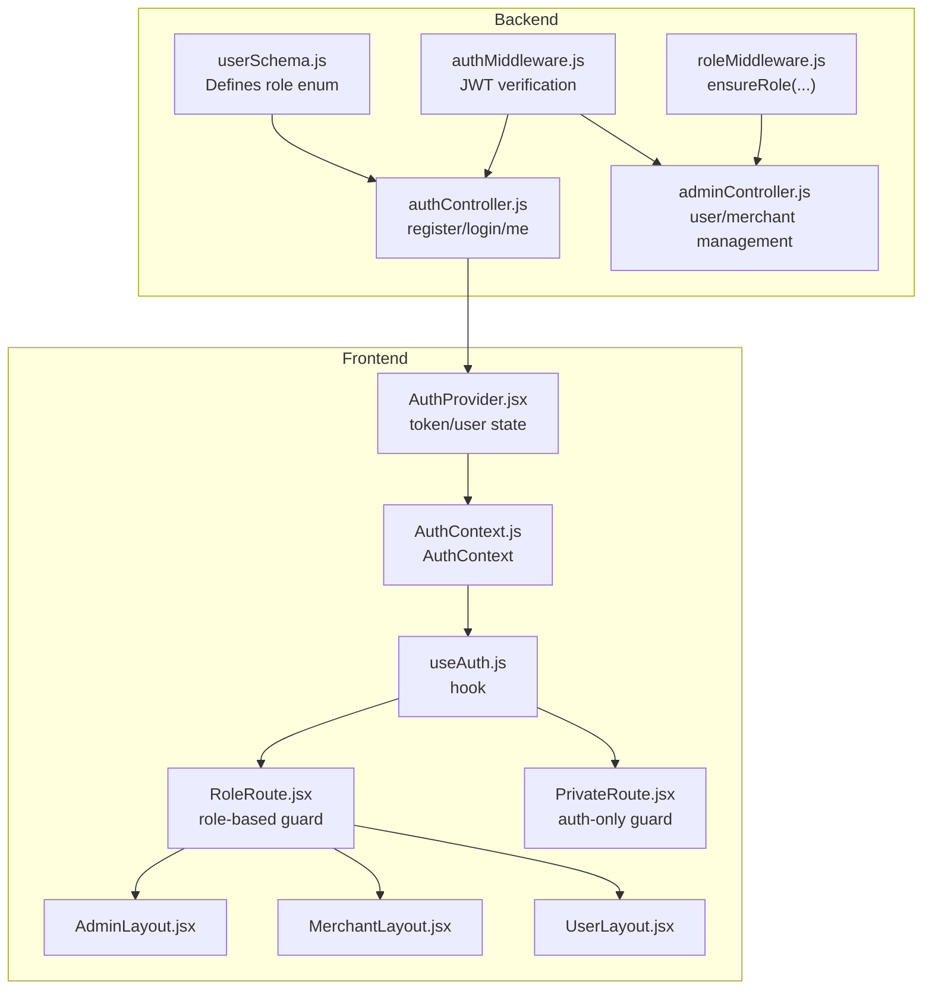
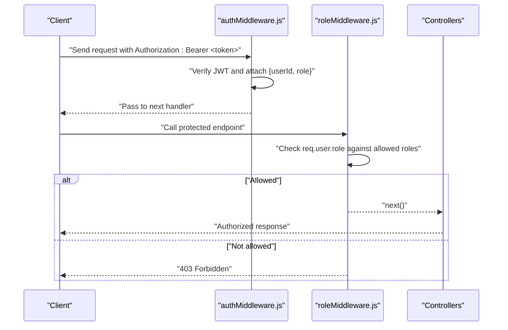
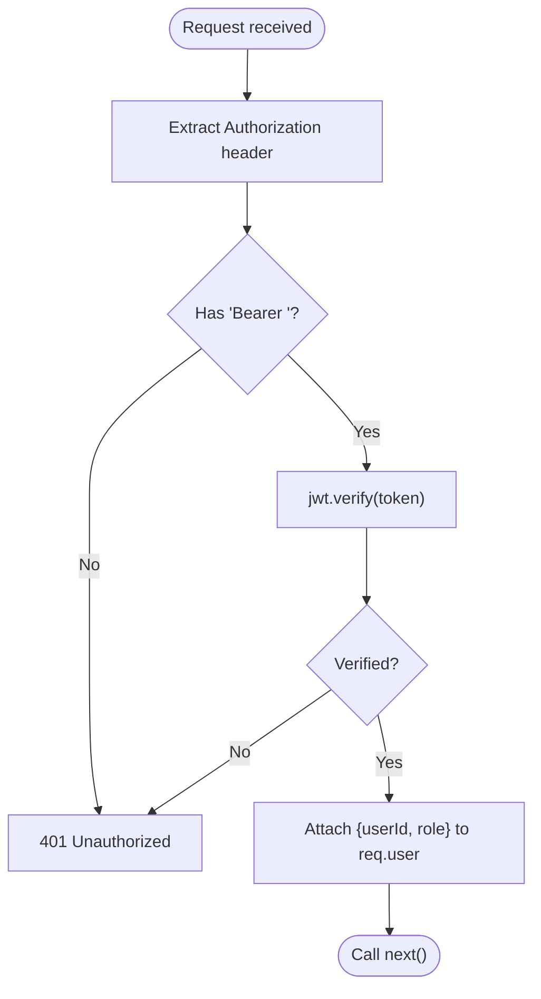
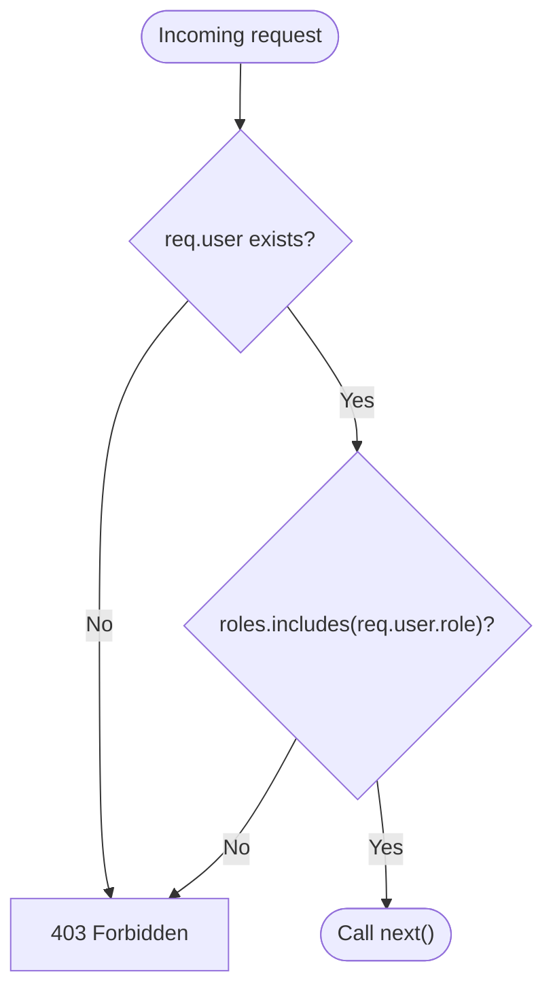
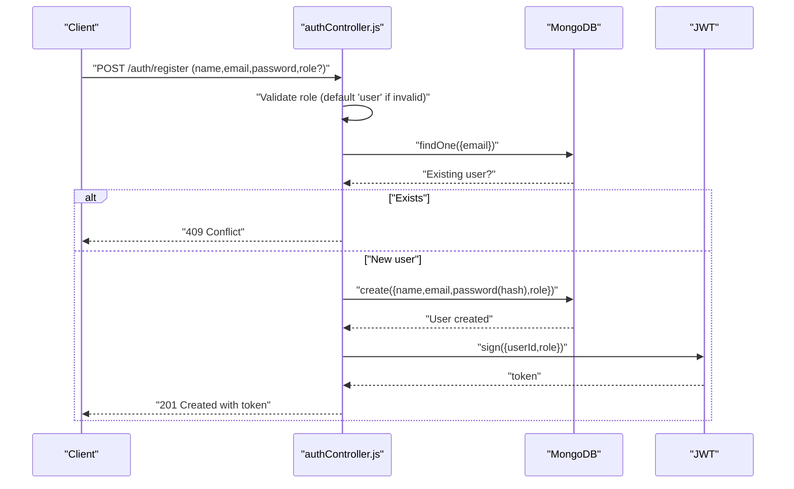
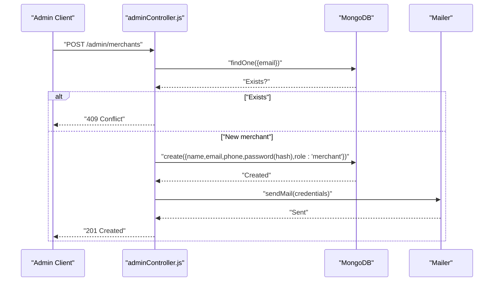
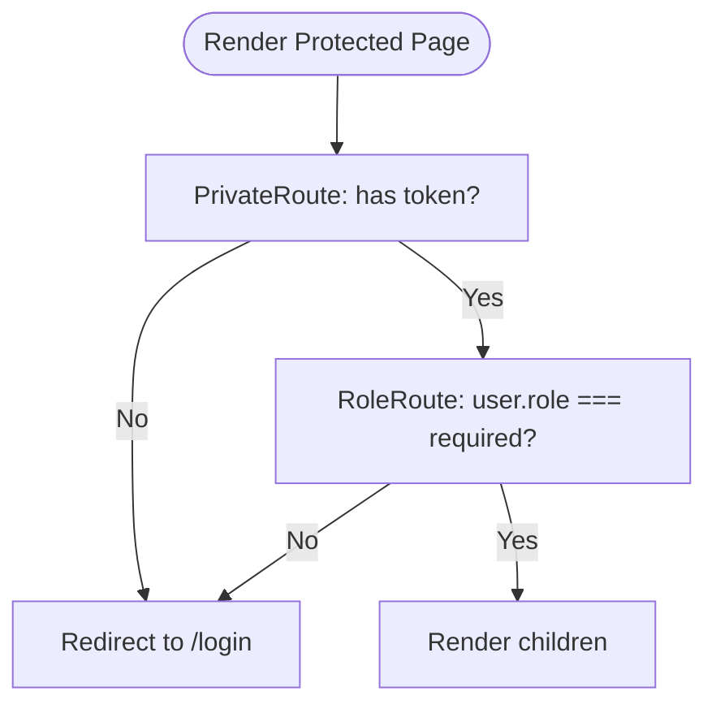
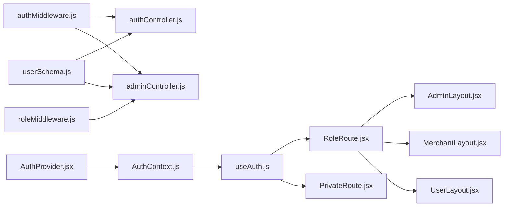

# Role-Based Access Control

<cite>
**Referenced Files in This Document**
- [userSchema.js](file://backend/models/userSchema.js)
- [authMiddleware.js](file://backend/middleware/authMiddleware.js)
- [roleMiddleware.js](file://backend/middleware/roleMiddleware.js)
- [authController.js](file://backend/controller/authController.js)
- [adminController.js](file://backend/controller/adminController.js)
- [AuthContext.js](file://frontend/src/context/AuthContext.js)
- [AuthProvider.jsx](file://frontend/src/context/AuthProvider.jsx)
- [useAuth.js](file://frontend/src/context/useAuth.js)
- [RoleRoute.jsx](file://frontend/src/components/RoleRoute.jsx)
- [PrivateRoute.jsx](file://frontend/src/components/PrivateRoute.jsx)
- [AdminLayout.jsx](file://frontend/src/components/admin/AdminLayout.jsx)
- [MerchantLayout.jsx](file://frontend/src/components/merchant/MerchantLayout.jsx)
- [UserLayout.jsx](file://frontend/src/components/user/UserLayout.jsx)
</cite>

## Table of Contents
1. [Introduction](#introduction)
2. [Project Structure](#project-structure)
3. [Core Components](#core-components)
4. [Architecture Overview](#architecture-overview)
5. [Detailed Component Analysis](#detailed-component-analysis)
6. [Dependency Analysis](#dependency-analysis)
7. [Performance Considerations](#performance-considerations)
8. [Troubleshooting Guide](#troubleshooting-guide)
9. [Conclusion](#conclusion)

## Introduction
This document explains the role-based access control (RBAC) implementation across the backend and frontend systems. It covers the three user roles (user, merchant, admin), their permission hierarchies, middleware protection for routes and endpoints, role validation in controllers, and frontend role-based UI rendering. It also documents role assignment during registration, role modification by admins, permission inheritance patterns, protected route components, conditional rendering based on user roles, and role-specific feature access. Examples of role-based API access and frontend navigation restrictions are included.

## Project Structure
The RBAC system spans:
- Backend models and middleware for authentication and role enforcement
- Controllers implementing role-aware logic and endpoints
- Frontend context and route guards for protected navigation and role-based layouts

**Diagram sources**
- [userSchema.js:39-44](file://backend/models/userSchema.js#L39-L44)
- [authMiddleware.js:3-16](file://backend/middleware/authMiddleware.js#L3-L16)
- [roleMiddleware.js:1-8](file://backend/middleware/roleMiddleware.js#L1-L8)
- [authController.js:11-52](file://backend/controller/authController.js#L11-L52)
- [adminController.js:27-77](file://backend/controller/adminController.js#L27-L77)
- [AuthContext.js:1](file://frontend/src/context/AuthContext.js#L1)
- [AuthProvider.jsx:5-32](file://frontend/src/context/AuthProvider.jsx#L5-L32)
- [useAuth.js:1-6](file://frontend/src/context/useAuth.js#L1-L6)
- [RoleRoute.jsx:5-9](file://frontend/src/components/RoleRoute.jsx#L5-L9)
- [PrivateRoute.jsx:5-9](file://frontend/src/components/PrivateRoute.jsx#L5-L9)
- [AdminLayout.jsx:7-23](file://frontend/src/components/admin/AdminLayout.jsx#L7-L23)
- [MerchantLayout.jsx:7-23](file://frontend/src/components/merchant/MerchantLayout.jsx#L7-L23)
- [UserLayout.jsx:7-23](file://frontend/src/components/user/UserLayout.jsx#L7-L23)

**Section sources**
- [userSchema.js:1-55](file://backend/models/userSchema.js#L1-L55)
- [authMiddleware.js:1-17](file://backend/middleware/authMiddleware.js#L1-L17)
- [roleMiddleware.js:1-9](file://backend/middleware/roleMiddleware.js#L1-L9)
- [authController.js:1-120](file://backend/controller/authController.js#L1-L120)
- [adminController.js:1-194](file://backend/controller/adminController.js#L1-L194)
- [AuthProvider.jsx:1-38](file://frontend/src/context/AuthProvider.jsx#L1-L38)
- [RoleRoute.jsx:1-16](file://frontend/src/components/RoleRoute.jsx#L1-L16)
- [PrivateRoute.jsx:1-15](file://frontend/src/components/PrivateRoute.jsx#L1-L15)
- [AdminLayout.jsx:1-29](file://frontend/src/components/admin/AdminLayout.jsx#L1-L29)
- [MerchantLayout.jsx:1-29](file://frontend/src/components/merchant/MerchantLayout.jsx#L1-L29)
- [UserLayout.jsx:1-30](file://frontend/src/components/user/UserLayout.jsx#L1-L30)

## Core Components
- Roles and model
  - The user model defines the role field with allowed values and a default. See [userSchema.js:39-44](file://backend/models/userSchema.js#L39-L44).
- Authentication middleware
  - Extracts JWT from Authorization header, verifies it, and attaches user info (including role) to the request. See [authMiddleware.js:3-16](file://backend/middleware/authMiddleware.js#L3-L16).
- Role middleware
  - Enforces role-based access by checking if the authenticated user’s role is included in the allowed roles list. Returns 403 Forbidden otherwise. See [roleMiddleware.js:1-8](file://backend/middleware/roleMiddleware.js#L1-L8).
- Authentication controller
  - Registration assigns role “user” or “merchant” depending on input and defaults to “user” if invalid. See [authController.js:21-24](file://backend/controller/authController.js#L21-L24).
  - Login validates credentials and issues a JWT containing role. See [authController.js:83-84](file://backend/controller/authController.js#L83-L84).
- Admin controller
  - Creates merchants and sends credentials via email. See [adminController.js:46-52](file://backend/controller/adminController.js#L46-L52).
  - Lists users and merchants. See [adminController.js:9-25](file://backend/controller/adminController.js#L9-L25).
- Frontend authentication context
  - Stores token and user in state and local storage. Provides login/logout. See [AuthProvider.jsx:5-32](file://frontend/src/context/AuthProvider.jsx#L5-L32).
- Frontend route guards
  - PrivateRoute enforces presence of token. See [PrivateRoute.jsx:5-9](file://frontend/src/components/PrivateRoute.jsx#L5-L9).
  - RoleRoute enforces exact role match. See [RoleRoute.jsx:5-9](file://frontend/src/components/RoleRoute.jsx#L5-L9).
- Role-based layouts
  - AdminLayout, MerchantLayout, and UserLayout wrap page content and provide role-specific UI. See [AdminLayout.jsx:7-23](file://frontend/src/components/admin/AdminLayout.jsx#L7-L23), [MerchantLayout.jsx:7-23](file://frontend/src/components/merchant/MerchantLayout.jsx#L7-L23), [UserLayout.jsx:7-23](file://frontend/src/components/user/UserLayout.jsx#L7-L23).

**Section sources**
- [userSchema.js:39-44](file://backend/models/userSchema.js#L39-L44)
- [authMiddleware.js:3-16](file://backend/middleware/authMiddleware.js#L3-L16)
- [roleMiddleware.js:1-8](file://backend/middleware/roleMiddleware.js#L1-L8)
- [authController.js:21-24](file://backend/controller/authController.js#L21-L24)
- [authController.js:83-84](file://backend/controller/authController.js#L83-L84)
- [adminController.js:46-52](file://backend/controller/adminController.js#L46-L52)
- [adminController.js:9-25](file://backend/controller/adminController.js#L9-L25)
- [AuthProvider.jsx:5-32](file://frontend/src/context/AuthProvider.jsx#L5-L32)
- [PrivateRoute.jsx:5-9](file://frontend/src/components/PrivateRoute.jsx#L5-L9)
- [RoleRoute.jsx:5-9](file://frontend/src/components/RoleRoute.jsx#L5-L9)
- [AdminLayout.jsx:7-23](file://frontend/src/components/admin/AdminLayout.jsx#L7-L23)
- [MerchantLayout.jsx:7-23](file://frontend/src/components/merchant/MerchantLayout.jsx#L7-L23)
- [UserLayout.jsx:7-23](file://frontend/src/components/user/UserLayout.jsx#L7-L23)

## Architecture Overview
The RBAC architecture combines backend middleware and frontend route guards:
- Backend
  - authMiddleware ensures requests carry a valid JWT and injects user identity.
  - roleMiddleware enforces role-based access on protected endpoints.
  - Controllers implement role-aware logic (e.g., admin-only operations).
- Frontend
  - AuthProvider stores token and user state.
  - PrivateRoute blocks unauthenticated users.
  - RoleRoute blocks unauthorized roles.
  - Role-based layouts render role-specific UI.

**Diagram sources**
- [authMiddleware.js:3-16](file://backend/middleware/authMiddleware.js#L3-L16)
- [roleMiddleware.js:1-8](file://backend/middleware/roleMiddleware.js#L1-L8)

**Section sources**
- [authMiddleware.js:3-16](file://backend/middleware/authMiddleware.js#L3-L16)
- [roleMiddleware.js:1-8](file://backend/middleware/roleMiddleware.js#L1-L8)

## Detailed Component Analysis

### Roles and Permission Hierarchies
- Roles
  - user: default role for regular users; minimal permissions; can browse and book services/events as permitted by business logic.
  - merchant: role for event/service providers; can manage own events/services and related bookings.
  - admin: highest authority; can manage users, merchants, events, and view analytics/reports.
- Permission hierarchy
  - admin > merchant > user
  - Admin endpoints are protected by role checks. Merchant endpoints are protected by merchant role checks. User endpoints are protected by user role checks or general auth.

**Section sources**
- [userSchema.js:39-44](file://backend/models/userSchema.js#L39-L44)
- [adminController.js:9-25](file://backend/controller/adminController.js#L9-L25)
- [adminController.js:46-52](file://backend/controller/adminController.js#L46-L52)

### Authentication Middleware
- Validates Authorization header and JWT signature.
- Injects req.user with userId and role.
- Returns 401 Unauthorized on failure.

**Diagram sources**
- [authMiddleware.js:3-16](file://backend/middleware/authMiddleware.js#L3-L16)

**Section sources**
- [authMiddleware.js:3-16](file://backend/middleware/authMiddleware.js#L3-L16)

### Role Middleware
- Factory ensureRole accepts one or more roles.
- Compares req.user.role against allowed roles.
- Returns 403 Forbidden if mismatch; otherwise proceeds.

**Diagram sources**
- [roleMiddleware.js:1-8](file://backend/middleware/roleMiddleware.js#L1-L8)

**Section sources**
- [roleMiddleware.js:1-8](file://backend/middleware/roleMiddleware.js#L1-L8)

### Authentication Controller (Registration and Login)
- Registration
  - Accepts role in request body; validates allowed values; defaults to “user” if invalid.
  - Creates user with hashed password and assigned role.
  - Issues JWT with role claim.
  - Returns success with token and user info.
- Login
  - Finds user by email with password included.
  - Compares password.
  - Issues JWT with role claim.

**Diagram sources**
- [authController.js:11-52](file://backend/controller/authController.js#L11-L52)

**Section sources**
- [authController.js:11-52](file://backend/controller/authController.js#L11-L52)
- [authController.js:54-107](file://backend/controller/authController.js#L54-L107)

### Admin Controller (Role Modification and Management)
- Merchant creation
  - Admin creates merchant accounts with generated temporary password and role set to “merchant”.
  - Sends credentials via email.
- Listing users and merchants
  - Admin endpoints list users and filter by role “merchant”.

**Diagram sources**
- [adminController.js:27-77](file://backend/controller/adminController.js#L27-L77)

**Section sources**
- [adminController.js:27-77](file://backend/controller/adminController.js#L27-L77)
- [adminController.js:9-25](file://backend/controller/adminController.js#L9-L25)

### Frontend Authentication Context and Route Guards
- AuthProvider
  - Initializes token and user from localStorage.
  - Provides login and logout functions that update state and persist to localStorage.
- useAuth
  - Hook to access token and user state.
- PrivateRoute
  - Redirects to login if no token.
- RoleRoute
  - Redirects to login if no user or role mismatch.

**Diagram sources**
- [AuthProvider.jsx:5-32](file://frontend/src/context/AuthProvider.jsx#L5-L32)
- [useAuth.js:1-6](file://frontend/src/context/useAuth.js#L1-L6)
- [PrivateRoute.jsx:5-9](file://frontend/src/components/PrivateRoute.jsx#L5-L9)
- [RoleRoute.jsx:5-9](file://frontend/src/components/RoleRoute.jsx#L5-L9)

**Section sources**
- [AuthProvider.jsx:5-32](file://frontend/src/context/AuthProvider.jsx#L5-L32)
- [useAuth.js:1-6](file://frontend/src/context/useAuth.js#L1-L6)
- [PrivateRoute.jsx:5-9](file://frontend/src/components/PrivateRoute.jsx#L5-L9)
- [RoleRoute.jsx:5-9](file://frontend/src/components/RoleRoute.jsx#L5-L9)

### Role-Based Layouts and Conditional Rendering
- AdminLayout, MerchantLayout, UserLayout
  - Wrap page content and provide role-specific navigation bars and sidebars.
  - Logout clears token and user state and navigates to login.

**Section sources**
- [AdminLayout.jsx:7-23](file://frontend/src/components/admin/AdminLayout.jsx#L7-L23)
- [MerchantLayout.jsx:7-23](file://frontend/src/components/merchant/MerchantLayout.jsx#L7-L23)
- [UserLayout.jsx:7-23](file://frontend/src/components/user/UserLayout.jsx#L7-L23)

## Dependency Analysis
- Backend dependencies
  - Controllers depend on authMiddleware and roleMiddleware for protection.
  - roleMiddleware depends on req.user populated by authMiddleware.
  - Models define the role enum used by controllers and middleware.
- Frontend dependencies
  - RoleRoute and PrivateRoute depend on useAuth hook.
  - useAuth depends on AuthContext.
  - AuthProvider manages token and user state and persists to localStorage.

**Diagram sources**
- [authMiddleware.js:3-16](file://backend/middleware/authMiddleware.js#L3-L16)
- [roleMiddleware.js:1-8](file://backend/middleware/roleMiddleware.js#L1-L8)
- [authController.js:11-52](file://backend/controller/authController.js#L11-L52)
- [adminController.js:27-77](file://backend/controller/adminController.js#L27-L77)
- [userSchema.js:39-44](file://backend/models/userSchema.js#L39-L44)
- [AuthProvider.jsx:5-32](file://frontend/src/context/AuthProvider.jsx#L5-L32)
- [AuthContext.js:1](file://frontend/src/context/AuthContext.js#L1)
- [useAuth.js:1-6](file://frontend/src/context/useAuth.js#L1-L6)
- [RoleRoute.jsx:5-9](file://frontend/src/components/RoleRoute.jsx#L5-L9)
- [PrivateRoute.jsx:5-9](file://frontend/src/components/PrivateRoute.jsx#L5-L9)
- [AdminLayout.jsx:7-23](file://frontend/src/components/admin/AdminLayout.jsx#L7-L23)
- [MerchantLayout.jsx:7-23](file://frontend/src/components/merchant/MerchantLayout.jsx#L7-L23)
- [UserLayout.jsx:7-23](file://frontend/src/components/user/UserLayout.jsx#L7-L23)

**Section sources**
- [authMiddleware.js:3-16](file://backend/middleware/authMiddleware.js#L3-L16)
- [roleMiddleware.js:1-8](file://backend/middleware/roleMiddleware.js#L1-L8)
- [authController.js:11-52](file://backend/controller/authController.js#L11-L52)
- [adminController.js:27-77](file://backend/controller/adminController.js#L27-L77)
- [userSchema.js:39-44](file://backend/models/userSchema.js#L39-L44)
- [AuthProvider.jsx:5-32](file://frontend/src/context/AuthProvider.jsx#L5-L32)
- [AuthContext.js:1](file://frontend/src/context/AuthContext.js#L1)
- [useAuth.js:1-6](file://frontend/src/context/useAuth.js#L1-L6)
- [RoleRoute.jsx:5-9](file://frontend/src/components/RoleRoute.jsx#L5-L9)
- [PrivateRoute.jsx:5-9](file://frontend/src/components/PrivateRoute.jsx#L5-L9)
- [AdminLayout.jsx:7-23](file://frontend/src/components/admin/AdminLayout.jsx#L7-L23)
- [MerchantLayout.jsx:7-23](file://frontend/src/components/merchant/MerchantLayout.jsx#L7-L23)
- [UserLayout.jsx:7-23](file://frontend/src/components/user/UserLayout.jsx#L7-L23)

## Performance Considerations
- Token verification occurs on every protected request; keep JWT secret secure and avoid excessive payload size.
- Role checks are O(n) over allowed roles; keep allowed roles short lists.
- Frontend route guards are client-side; always enforce server-side protections for sensitive endpoints.

## Troubleshooting Guide
- 401 Unauthorized on protected endpoints
  - Ensure Authorization header includes a valid Bearer token issued by the backend.
  - Confirm JWT_SECRET is configured consistently on backend.
- 403 Forbidden errors
  - Verify the user’s role matches the allowed roles for the endpoint.
  - Check that authMiddleware runs before roleMiddleware.
- Login/Register not setting role correctly
  - Registration defaults to “user” if role is missing or invalid.
  - Admin-created merchants are assigned role “merchant”.
- Frontend redirects to login unexpectedly
  - Confirm token and user are present in localStorage and AuthProvider state.
  - Ensure RoleRoute receives the correct role prop.

**Section sources**
- [authMiddleware.js:3-16](file://backend/middleware/authMiddleware.js#L3-L16)
- [roleMiddleware.js:1-8](file://backend/middleware/roleMiddleware.js#L1-L8)
- [authController.js:21-24](file://backend/controller/authController.js#L21-L24)
- [adminController.js:46-52](file://backend/controller/adminController.js#L46-L52)
- [AuthProvider.jsx:5-32](file://frontend/src/context/AuthProvider.jsx#L5-L32)
- [RoleRoute.jsx:5-9](file://frontend/src/components/RoleRoute.jsx#L5-L9)

## Conclusion
The RBAC implementation integrates backend middleware and frontend route guards to protect resources and tailor UI by role. Users are assigned roles during registration or by admins, and role checks are enforced on both server and client sides. This layered approach ensures secure access to role-specific features and prevents unauthorized navigation or actions.