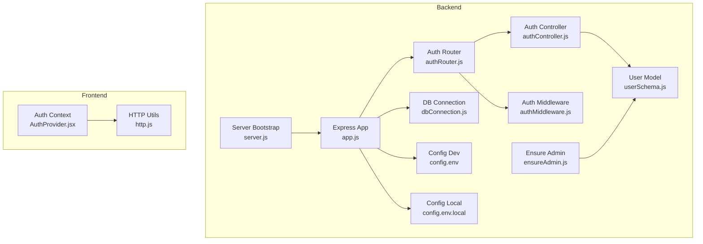
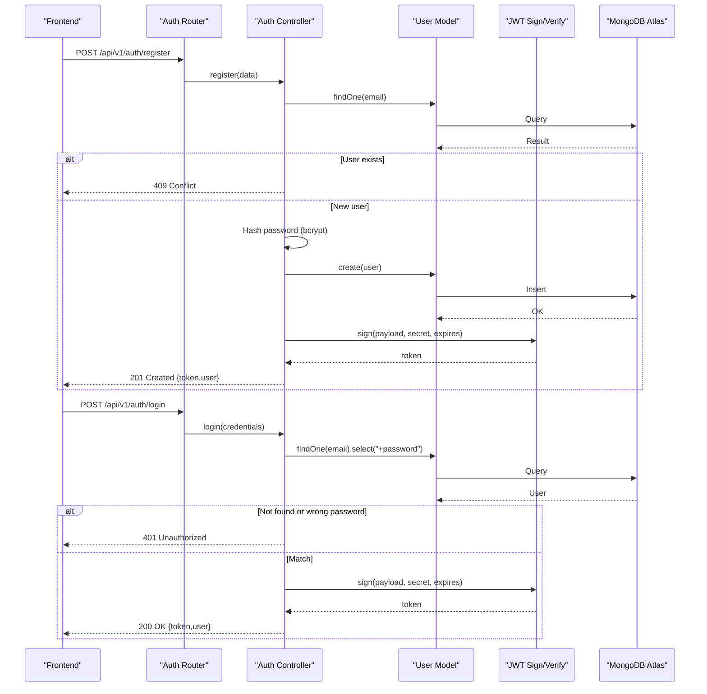
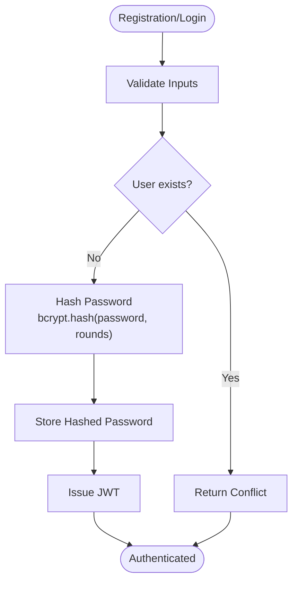
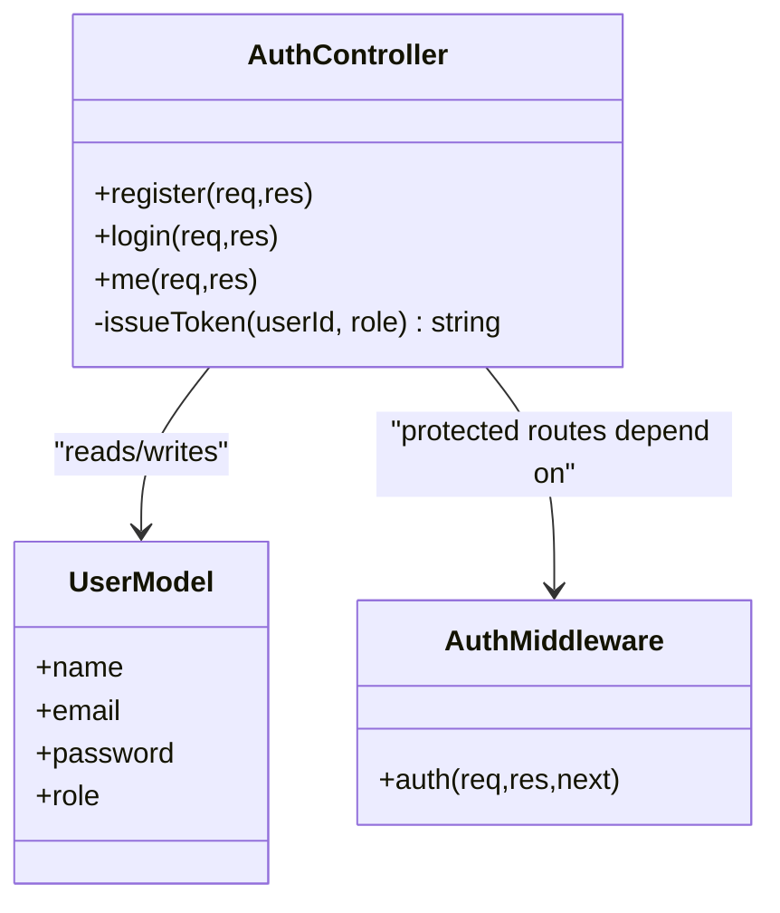
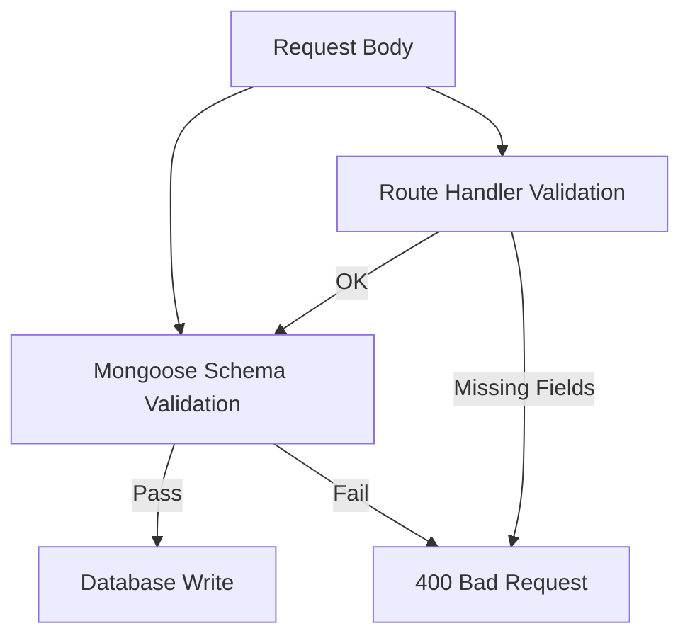
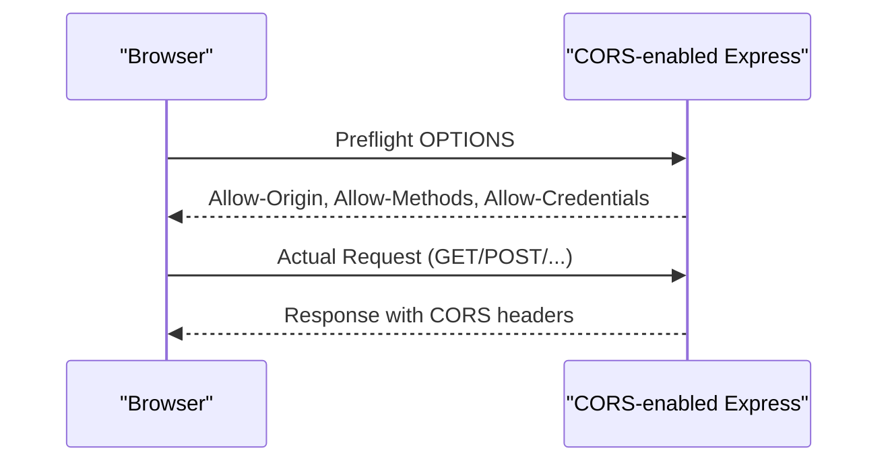
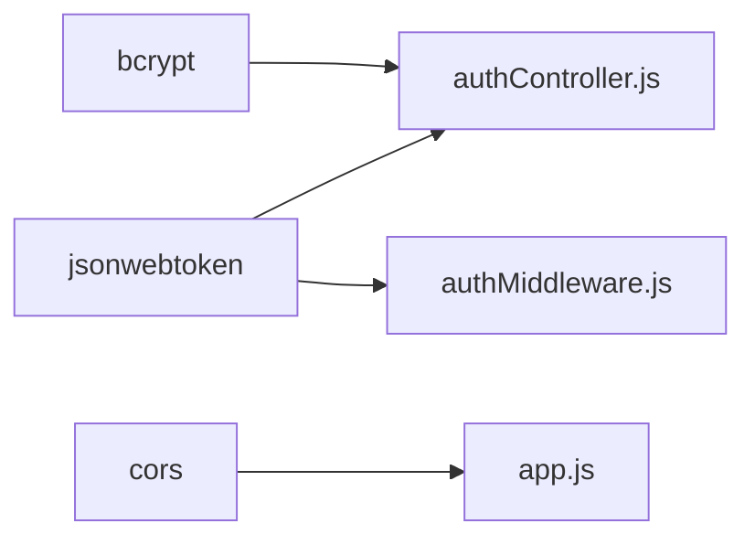

# Security Implementation

<cite>
**Referenced Files in This Document**
- [app.js](file://backend/app.js)
- [server.js](file://backend/server.js)
- [authController.js](file://backend/controller/authController.js)
- [authRouter.js](file://backend/router/authRouter.js)
- [authMiddleware.js](file://backend/middleware/authMiddleware.js)
- [userSchema.js](file://backend/models/userSchema.js)
- [dbConnection.js](file://backend/database/dbConnection.js)
- [config.env](file://backend/config/config.env)
- [config.env.local](file://backend/config/config.env.local)
- [ensureAdmin.js](file://backend/util/ensureAdmin.js)
- [http.js](file://frontend/src/lib/http.js)
- [AuthProvider.jsx](file://frontend/src/context/AuthProvider.jsx)
- [package-lock.json](file://backend/package-lock.json)
</cite>

## Table of Contents
1. [Introduction](#introduction)
2. [Project Structure](#project-structure)
3. [Core Components](#core-components)
4. [Architecture Overview](#architecture-overview)
5. [Detailed Component Analysis](#detailed-component-analysis)
6. [Dependency Analysis](#dependency-analysis)
7. [Performance Considerations](#performance-considerations)
8. [Security Controls](#security-controls)
9. [Logging and Monitoring](#logging-and-monitoring)
10. [Security Audit Guidelines](#security-audit-guidelines)
11. [Penetration Testing Recommendations](#penetration-testing-recommendations)
12. [Troubleshooting Guide](#troubleshooting-guide)
13. [Conclusion](#conclusion)

## Introduction
This document provides comprehensive security documentation for the authentication system in the MERN stack project. It focuses on password hashing with bcrypt, JWT token security, input validation, SQL injection prevention, XSS protections, CORS configuration, CSRF considerations, secure cookie handling, logging and monitoring strategies, and practical security audit and penetration testing recommendations.

## Project Structure
The authentication system spans backend Express routes, controllers, middleware, and models, along with frontend context and HTTP utilities. Environment variables define secrets and runtime behavior. Database connectivity is configured for MongoDB Atlas with robust retry logic.

**Diagram sources**
- [app.js:1-91](file://backend/app.js#L1-L91)
- [server.js:1-6](file://backend/server.js#L1-L6)
- [authRouter.js:1-12](file://backend/router/authRouter.js#L1-L12)
- [authController.js:1-120](file://backend/controller/authController.js#L1-L120)
- [authMiddleware.js:1-17](file://backend/middleware/authMiddleware.js#L1-L17)
- [userSchema.js:1-55](file://backend/models/userSchema.js#L1-L55)
- [dbConnection.js:1-112](file://backend/database/dbConnection.js#L1-L112)
- [config.env:1-42](file://backend/config/config.env#L1-L42)
- [config.env.local:1-49](file://backend/config/config.env.local#L1-L49)
- [ensureAdmin.js:1-35](file://backend/util/ensureAdmin.js#L1-L35)
- [http.js:1-5](file://frontend/src/lib/http.js#L1-L5)
- [AuthProvider.jsx:1-38](file://frontend/src/context/AuthProvider.jsx#L1-L38)

**Section sources**
- [app.js:1-91](file://backend/app.js#L1-L91)
- [server.js:1-6](file://backend/server.js#L1-L6)
- [authRouter.js:1-12](file://backend/router/authRouter.js#L1-L12)
- [authController.js:1-120](file://backend/controller/authController.js#L1-L120)
- [authMiddleware.js:1-17](file://backend/middleware/authMiddleware.js#L1-L17)
- [userSchema.js:1-55](file://backend/models/userSchema.js#L1-L55)
- [dbConnection.js:1-112](file://backend/database/dbConnection.js#L1-L112)
- [config.env:1-42](file://backend/config/config.env#L1-L42)
- [config.env.local:1-49](file://backend/config/config.env.local#L1-L49)
- [ensureAdmin.js:1-35](file://backend/util/ensureAdmin.js#L1-L35)
- [http.js:1-5](file://frontend/src/lib/http.js#L1-L5)
- [AuthProvider.jsx:1-38](file://frontend/src/context/AuthProvider.jsx#L1-L38)

## Core Components
- Authentication flow: Registration and login endpoints use bcrypt for password hashing and JWT for tokens.
- Token verification: Authorization middleware validates JWT signatures and extracts user identity.
- Data validation: Mongoose schema enforces field constraints and sanitization.
- CORS policy: Backend restricts origins and enables credentials for cross-origin requests.
- Frontend token storage: React context persists tokens and user data in localStorage.

Key security-relevant implementation points:
- Password hashing with bcrypt and configurable cost factor.
- JWT secret and expiration controlled via environment variables.
- Input validation at schema and route levels.
- Secure transport and CORS configuration.

**Section sources**
- [authController.js:1-120](file://backend/controller/authController.js#L1-L120)
- [authMiddleware.js:1-17](file://backend/middleware/authMiddleware.js#L1-L17)
- [userSchema.js:1-55](file://backend/models/userSchema.js#L1-L55)
- [app.js:24-30](file://backend/app.js#L24-L30)
- [http.js:1-5](file://frontend/src/lib/http.js#L1-L5)
- [AuthProvider.jsx:1-38](file://frontend/src/context/AuthProvider.jsx#L1-L38)

## Architecture Overview
The authentication architecture integrates Express routes, controller logic, middleware, and model validation. Tokens are issued on successful authentication and verified on protected routes.

**Diagram sources**
- [authRouter.js:1-12](file://backend/router/authRouter.js#L1-L12)
- [authController.js:1-120](file://backend/controller/authController.js#L1-L120)
- [userSchema.js:1-55](file://backend/models/userSchema.js#L1-L55)
- [dbConnection.js:1-112](file://backend/database/dbConnection.js#L1-L112)

## Detailed Component Analysis

### Password Hashing with bcrypt
- bcrypt is used for password hashing during registration and admin initialization.
- Salt rounds are configured to a fixed value in current implementation.
- Best practice: Use a configurable cost factor and rotate secrets regularly.

**Diagram sources**
- [authController.js:31-37](file://backend/controller/authController.js#L31-L37)
- [ensureAdmin.js:19-28](file://backend/util/ensureAdmin.js#L19-L28)

**Section sources**
- [authController.js:31-37](file://backend/controller/authController.js#L31-L37)
- [ensureAdmin.js:19-28](file://backend/util/ensureAdmin.js#L19-L28)

### JWT Token Security
- Token payload includes user identifier and role.
- Secret key and expiration are loaded from environment variables.
- Verification middleware enforces presence and validity of bearer tokens.

**Diagram sources**
- [authController.js:1-120](file://backend/controller/authController.js#L1-L120)
- [authMiddleware.js:1-17](file://backend/middleware/authMiddleware.js#L1-L17)
- [userSchema.js:1-55](file://backend/models/userSchema.js#L1-L55)

**Section sources**
- [authController.js:5-9](file://backend/controller/authController.js#L5-L9)
- [authMiddleware.js:3-16](file://backend/middleware/authMiddleware.js#L3-L16)
- [config.env:23-25](file://backend/config/config.env#L23-L25)

### Input Validation and Schema Constraints
- Mongoose schema enforces required fields, length constraints, uniqueness, and email validation.
- Route handlers validate presence of essential fields before processing.

**Diagram sources**
- [userSchema.js:6-44](file://backend/models/userSchema.js#L6-L44)
- [authController.js:17-23](file://backend/controller/authController.js#L17-L23)

**Section sources**
- [userSchema.js:6-44](file://backend/models/userSchema.js#L6-L44)
- [authController.js:17-23](file://backend/controller/authController.js#L17-L23)

### CORS Configuration
- Backend enables CORS with allowed origin, methods, and credentials.
- Frontend base URL is aligned with the allowed origin.

**Diagram sources**
- [app.js:24-30](file://backend/app.js#L24-L30)
- [config.env:20-21](file://backend/config/config.env#L20-L21)

**Section sources**
- [app.js:24-30](file://backend/app.js#L24-L30)
- [config.env:20-21](file://backend/config/config.env#L20-L21)
- [config.env.local:27-28](file://backend/config/config.env.local#L27-L28)

### CSRF Protection
- Current implementation does not include CSRF tokens for state-changing requests.
- Recommendation: Implement CSRF tokens for HTML forms and AJAX endpoints that mutate state.

[No sources needed since this section provides general guidance]

### Secure Cookie Handling
- Tokens are stored client-side in localStorage and sent via Authorization header.
- No HttpOnly cookies are used for tokens in the current implementation.
- Recommendation: Prefer HttpOnly cookies for session tokens and implement SameSite and Secure attributes.

[No sources needed since this section provides general guidance]

### XSS Protection Measures
- Frontend renders user data without inline eval; ensure all dynamic content is sanitized.
- Backend responses do not embed untrusted data in HTML contexts.
- Recommendation: Use Content-Security-Policy headers and escape template rendering.

[No sources needed since this section provides general guidance]

## Dependency Analysis
External libraries involved in security:
- bcrypt: Password hashing.
- jsonwebtoken: JWT signing and verification.
- cors: Cross-origin resource sharing policy.

**Diagram sources**
- [authController.js:1-3](file://backend/controller/authController.js#L1-L3)
- [authMiddleware.js:1-2](file://backend/middleware/authMiddleware.js#L1-L2)
- [app.js:17-30](file://backend/app.js#L17-L30)
- [package-lock.json:96-109](file://backend/package-lock.json#L96-L109)
- [package-lock.json:729-750](file://backend/package-lock.json#L729-L750)

**Section sources**
- [package-lock.json:96-109](file://backend/package-lock.json#L96-L109)
- [package-lock.json:729-750](file://backend/package-lock.json#L729-L750)

## Performance Considerations
- bcrypt cost factor affects CPU usage during registration/login; tune for acceptable latency.
- JWT verification is lightweight compared to bcrypt hashing.
- Database connection retries mitigate transient network issues.

[No sources needed since this section provides general guidance]

## Security Controls

### Password Hashing Implementation
- Use bcrypt for all password hashing.
- Configure salt rounds via environment variable for production.
- Enforce strong password policies at the schema level.

**Section sources**
- [authController.js:31-37](file://backend/controller/authController.js#L31-L37)
- [ensureAdmin.js:19-28](file://backend/util/ensureAdmin.js#L19-L28)
- [userSchema.js:33-37](file://backend/models/userSchema.js#L33-L37)

### JWT Secret Management and Token Expiration
- Store JWT_SECRET in environment variables and rotate periodically.
- Set reasonable expiration via JWT_EXPIRES.
- Validate token presence and signature in middleware.

**Section sources**
- [authController.js:5-9](file://backend/controller/authController.js#L5-L9)
- [authMiddleware.js:3-16](file://backend/middleware/authMiddleware.js#L3-L16)
- [config.env:23-25](file://backend/config/config.env#L23-L25)

### Input Validation and SQL Injection Prevention
- Mongoose schema validation prevents malformed documents.
- Avoid constructing queries from user input; use parameterized queries or ODM methods.
- Validate and sanitize inputs at route handlers.

**Section sources**
- [userSchema.js:6-44](file://backend/models/userSchema.js#L6-L44)
- [authController.js:17-23](file://backend/controller/authController.js#L17-L23)

### XSS Protection
- Sanitize dynamic content on the frontend.
- Use CSP headers on the backend.
- Avoid innerHTML with untrusted data.

[No sources needed since this section provides general guidance]

### CORS Configuration
- Restrict origin to trusted frontend URL.
- Enable credentials only when necessary.
- Align frontend base URL with allowed origin.

**Section sources**
- [app.js:24-30](file://backend/app.js#L24-L30)
- [config.env:20-21](file://backend/config/config.env#L20-L21)
- [config.env.local:27-28](file://backend/config/config.env.local#L27-L28)

### CSRF Protection
- Implement CSRF tokens for state-changing requests.
- Validate tokens on the backend.

[No sources needed since this section provides general guidance]

### Secure Cookie Handling
- Prefer HttpOnly cookies for tokens.
- Set SameSite and Secure flags.
- Avoid storing sensitive data in localStorage.

**Section sources**
- [http.js:1-5](file://frontend/src/lib/http.js#L1-L5)
- [AuthProvider.jsx:16-28](file://frontend/src/context/AuthProvider.jsx#L16-L28)

## Logging and Monitoring
- Log authentication events (login, registration, token issuance).
- Record failures (invalid credentials, token errors).
- Monitor for brute-force attempts and unusual patterns.
- Use structured logs and centralize logs for analysis.

[No sources needed since this section provides general guidance]

## Security Audit Guidelines
- Review environment variables for hardcoded secrets.
- Verify JWT secret rotation and expiration policies.
- Assess CORS configuration against threat model.
- Validate input validation coverage across endpoints.
- Confirm absence of sensitive data in localStorage for production.

[No sources needed since this section provides general guidance]

## Penetration Testing Recommendations
- Test for weak passwords and enforce policy compliance.
- Enumerate endpoints and validate unauthorized access controls.
- Attempt injection attacks (input validation checks).
- Verify token replay and tampering resistance.
- Validate CSRF protections for state-changing requests.

[No sources needed since this section provides general guidance]

## Troubleshooting Guide
- If authentication fails, check JWT_SECRET correctness and expiration.
- If CORS errors occur, verify FRONTEND_URL matches origin and credentials are enabled.
- If bcrypt errors appear, confirm bcrypt installation and Node.js compatibility.
- If database connection issues arise, review Atlas connectivity and DNS configuration.

**Section sources**
- [authMiddleware.js:10-14](file://backend/middleware/authMiddleware.js#L10-L14)
- [app.js:24-30](file://backend/app.js#L24-L30)
- [dbConnection.js:4-16](file://backend/database/dbConnection.js#L4-L16)
- [package-lock.json:96-109](file://backend/package-lock.json#L96-L109)

## Conclusion
The authentication system employs bcrypt for password hashing and JWT for token-based authentication, with schema-level validation and CORS configuration. To strengthen security, adopt rotating secrets, configurable bcrypt cost factors, CSRF protections, secure cookie handling, CSP headers, and comprehensive logging and monitoring. Regular audits and penetration tests will help maintain a robust security posture.