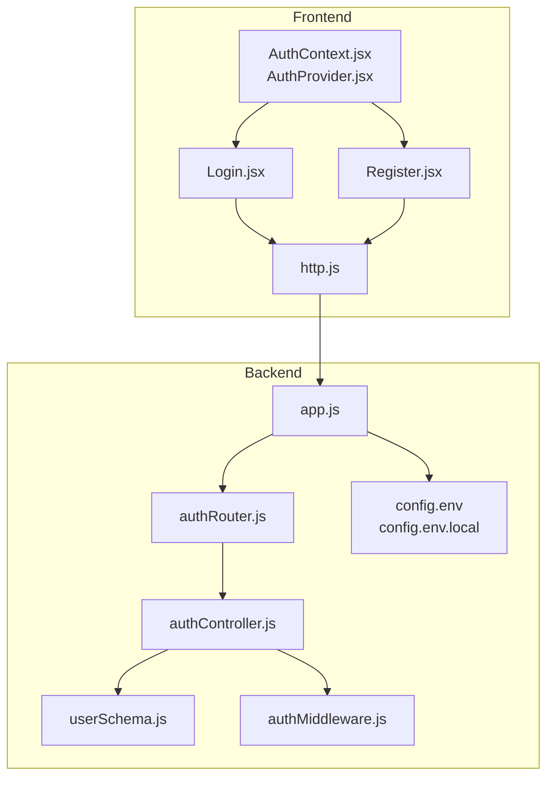
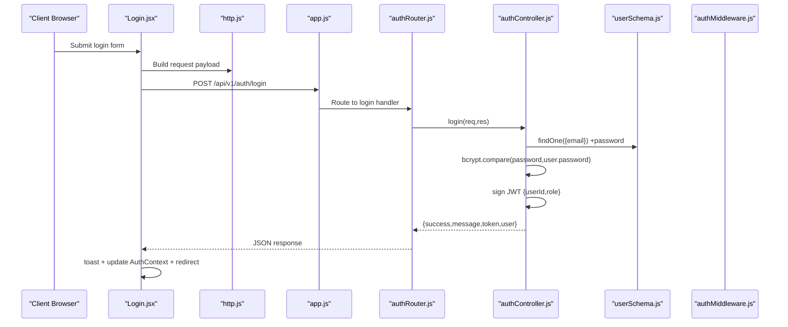
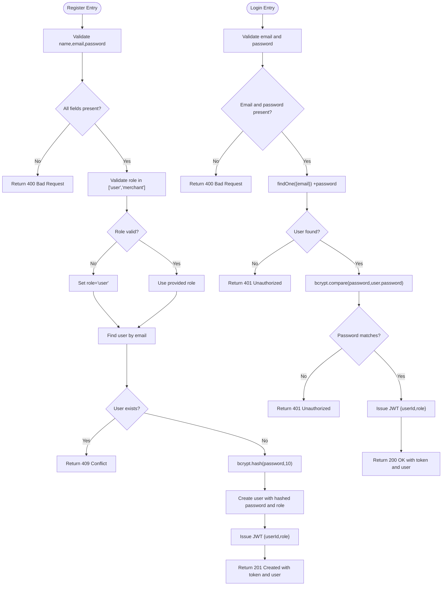
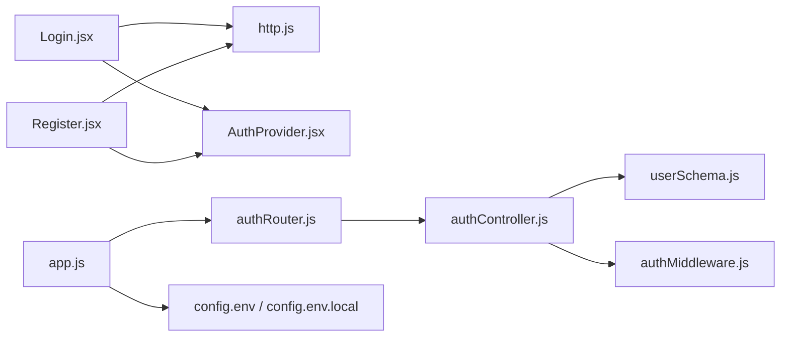

# User Registration and Login

<cite>
**Referenced Files in This Document**
- [authController.js](file://backend/controller/authController.js)
- [authRouter.js](file://backend/router/authRouter.js)
- [userSchema.js](file://backend/models/userSchema.js)
- [authMiddleware.js](file://backend/middleware/authMiddleware.js)
- [app.js](file://backend/app.js)
- [config.env](file://backend/config/config.env)
- [config.env.local](file://backend/config/config.env.local)
- [Login.jsx](file://frontend/src/components/Login.jsx)
- [Register.jsx](file://frontend/src/components/Register.jsx)
- [http.js](file://frontend/src/lib/http.js)
- [AuthContext.jsx](file://frontend/src/context/AuthContext.jsx)
- [AuthProvider.jsx](file://frontend/src/context/AuthProvider.jsx)
</cite>

## Table of Contents
1. [Introduction](#introduction)
2. [Project Structure](#project-structure)
3. [Core Components](#core-components)
4. [Architecture Overview](#architecture-overview)
5. [Detailed Component Analysis](#detailed-component-analysis)
6. [Dependency Analysis](#dependency-analysis)
7. [Performance Considerations](#performance-considerations)
8. [Security Considerations](#security-considerations)
9. [Troubleshooting Guide](#troubleshooting-guide)
10. [Conclusion](#conclusion)

## Introduction
This document provides comprehensive documentation for the user registration and login functionality in the MERN stack event project. It covers the complete registration flow (form validation, password hashing with bcrypt, duplicate email checking, and role assignment), the login process (email/password validation, password comparison, and JWT token generation), frontend implementation (form handling, error display, loading states, and redirect flows), API endpoints and request/response schemas, and security considerations for password handling and input validation.

## Project Structure
The authentication system spans backend controllers, routers, models, middleware, and frontend components. The backend exposes REST endpoints under /api/v1/auth, while the frontend consumes these endpoints via Axios and manages authentication state with a React context provider.

**Diagram sources**
- [app.js:1-91](file://backend/app.js#L1-L91)
- [authRouter.js:1-12](file://backend/router/authRouter.js#L1-L12)
- [authController.js:1-120](file://backend/controller/authController.js#L1-L120)
- [userSchema.js:1-55](file://backend/models/userSchema.js#L1-L55)
- [authMiddleware.js:1-17](file://backend/middleware/authMiddleware.js#L1-L17)
- [config.env:1-42](file://backend/config/config.env#L1-L42)
- [config.env.local:1-49](file://backend/config/config.env.local#L1-L49)
- [Login.jsx:1-108](file://frontend/src/components/Login.jsx#L1-L108)
- [Register.jsx:1-93](file://frontend/src/components/Register.jsx#L1-L93)
- [http.js:1-5](file://frontend/src/lib/http.js#L1-L5)
- [AuthContext.jsx:1-3](file://frontend/src/context/AuthContext.jsx#L1-L3)
- [AuthProvider.jsx:1-38](file://frontend/src/context/AuthProvider.jsx#L1-L38)

**Section sources**
- [app.js:1-91](file://backend/app.js#L1-L91)
- [authRouter.js:1-12](file://backend/router/authRouter.js#L1-L12)
- [authController.js:1-120](file://backend/controller/authController.js#L1-L120)
- [userSchema.js:1-55](file://backend/models/userSchema.js#L1-L55)
- [authMiddleware.js:1-17](file://backend/middleware/authMiddleware.js#L1-L17)
- [config.env:1-42](file://backend/config/config.env#L1-L42)
- [config.env.local:1-49](file://backend/config/config.env.local#L1-L49)
- [Login.jsx:1-108](file://frontend/src/components/Login.jsx#L1-L108)
- [Register.jsx:1-93](file://frontend/src/components/Register.jsx#L1-L93)
- [http.js:1-5](file://frontend/src/lib/http.js#L1-L5)
- [AuthContext.jsx:1-3](file://frontend/src/context/AuthContext.jsx#L1-L3)
- [AuthProvider.jsx:1-38](file://frontend/src/context/AuthProvider.jsx#L1-L38)

## Core Components
- Backend Authentication Controller: Implements registration and login endpoints, password hashing with bcrypt, duplicate email checks, role validation, and JWT token issuance.
- Backend Authentication Router: Exposes /api/v1/auth/register, /api/v1/auth/login, and /api/v1/auth/me routes.
- User Model: Defines schema with validation rules for name, email, password, role, and status.
- Authentication Middleware: Validates JWT tokens for protected routes.
- Frontend Login Component: Handles form submission, displays errors, and redirects based on role.
- Frontend Register Component: Collects user input, role selection, submits registration, and redirects based on role.
- HTTP Utility: Provides base URL and Bearer token header construction.
- Authentication Context Provider: Manages token and user state in local storage.

**Section sources**
- [authController.js:11-120](file://backend/controller/authController.js#L11-L120)
- [authRouter.js:7-9](file://backend/router/authRouter.js#L7-L9)
- [userSchema.js:4-52](file://backend/models/userSchema.js#L4-L52)
- [authMiddleware.js:3-16](file://backend/middleware/authMiddleware.js#L3-L16)
- [Login.jsx:15-66](file://frontend/src/components/Login.jsx#L15-L66)
- [Register.jsx:15-38](file://frontend/src/components/Register.jsx#L15-L38)
- [http.js:1-5](file://frontend/src/lib/http.js#L1-L5)
- [AuthProvider.jsx:16-28](file://frontend/src/context/AuthProvider.jsx#L16-L28)

## Architecture Overview
The authentication architecture follows a layered pattern:
- Frontend sends HTTP requests to backend endpoints.
- Backend validates inputs, performs business logic (bcrypt hashing, duplicate checks, JWT issuance), and responds with structured JSON.
- Frontend updates authentication state and navigates users to appropriate dashboards based on roles.

**Diagram sources**
- [Login.jsx:15-66](file://frontend/src/components/Login.jsx#L15-L66)
- [http.js:1-5](file://frontend/src/lib/http.js#L1-L5)
- [app.js:36-36](file://backend/app.js#L36-L36)
- [authRouter.js:8-8](file://backend/router/authRouter.js#L8-L8)
- [authController.js:54-107](file://backend/controller/authController.js#L54-L107)
- [userSchema.js:33-37](file://backend/models/userSchema.js#L33-L37)
- [authMiddleware.js:3-16](file://backend/middleware/authMiddleware.js#L3-L16)

## Detailed Component Analysis

### Backend Authentication Controller
- Registration flow:
  - Validates presence of name, email, and password.
  - Validates role against allowed values ("user", "merchant"), defaults to "user".
  - Checks for existing user by email; returns conflict if found.
  - Hashes password using bcrypt with salt rounds 10.
  - Creates user record with hashed password and selected role.
  - Issues JWT token with userId and role, returns success with token and user info.
- Login flow:
  - Validates presence of email and password.
  - Finds user by email with password field included.
  - Compares provided password with stored hash using bcrypt.
  - Issues JWT token on successful authentication.
  - Returns success with token and user info.

**Diagram sources**
- [authController.js:11-52](file://backend/controller/authController.js#L11-L52)
- [authController.js:54-107](file://backend/controller/authController.js#L54-L107)

**Section sources**
- [authController.js:11-52](file://backend/controller/authController.js#L11-L52)
- [authController.js:54-107](file://backend/controller/authController.js#L54-L107)

### Backend Authentication Router
- Routes:
  - POST /api/v1/auth/register → register
  - POST /api/v1/auth/login → login
  - GET /api/v1/auth/me → requires auth middleware → me

**Section sources**
- [authRouter.js:7-9](file://backend/router/authRouter.js#L7-L9)

### User Model Validation
- Enforces:
  - Name: required, minimum length 3.
  - Email: required, unique, lowercase, valid format.
  - Password: required, minimum length 6, hidden from queries by default.
  - Role: enum ["user", "admin", "merchant"], default "user".
  - Status: enum ["active", "inactive"], default "active".

**Section sources**
- [userSchema.js:6-44](file://backend/models/userSchema.js#L6-L44)

### Authentication Middleware
- Extracts Bearer token from Authorization header.
- Verifies JWT signature using JWT_SECRET.
- Attaches decoded userId and role to req.user for downstream handlers.

**Section sources**
- [authMiddleware.js:3-16](file://backend/middleware/authMiddleware.js#L3-L16)

### Frontend Login Component
- Captures email and password.
- Submits to /api/v1/auth/login with JSON payload.
- On success:
  - Displays success toast.
  - Calls AuthContext.login(token, user) to persist in state and localStorage.
  - Redirects based on user role or previous location for booking completion.
- On error:
  - Displays error toast with message from response or fallback.

**Section sources**
- [Login.jsx:15-66](file://frontend/src/components/Login.jsx#L15-L66)

### Frontend Register Component
- Captures name, email, password, and role selection.
- Submits to /api/v1/auth/register with JSON payload.
- On success:
  - Displays success toast.
  - Calls AuthContext.login(token, user).
  - Redirects based on role.
- On error:
  - Displays error toast with message from response or fallback.

**Section sources**
- [Register.jsx:15-38](file://frontend/src/components/Register.jsx#L15-L38)

### HTTP Utility and Authentication Context
- API_BASE defines the backend base URL.
- authHeaders constructs Authorization: Bearer header for authenticated requests.
- AuthProvider persists token and user in localStorage and exposes login/logout to components.

**Section sources**
- [http.js:1-5](file://frontend/src/lib/http.js#L1-L5)
- [AuthProvider.jsx:16-28](file://frontend/src/context/AuthProvider.jsx#L16-L28)

## Dependency Analysis
The authentication subsystem exhibits clear separation of concerns:
- Controllers depend on models for data access and bcrypt/jwt for security operations.
- Routers depend on controllers for request handling.
- Middleware depends on jwt for token verification.
- Frontend components depend on HTTP utilities and the authentication context provider.

**Diagram sources**
- [Login.jsx:1-108](file://frontend/src/components/Login.jsx#L1-L108)
- [Register.jsx:1-93](file://frontend/src/components/Register.jsx#L1-L93)
- [http.js:1-5](file://frontend/src/lib/http.js#L1-L5)
- [AuthProvider.jsx:1-38](file://frontend/src/context/AuthProvider.jsx#L1-L38)
- [authRouter.js:1-12](file://backend/router/authRouter.js#L1-L12)
- [authController.js:1-120](file://backend/controller/authController.js#L1-L120)
- [userSchema.js:1-55](file://backend/models/userSchema.js#L1-L55)
- [authMiddleware.js:1-17](file://backend/middleware/authMiddleware.js#L1-L17)
- [app.js:1-91](file://backend/app.js#L1-L91)
- [config.env:1-42](file://backend/config/config.env#L1-L42)
- [config.env.local:1-49](file://backend/config/config.env.local#L1-L49)

**Section sources**
- [authController.js:1-120](file://backend/controller/authController.js#L1-L120)
- [authRouter.js:1-12](file://backend/router/authRouter.js#L1-L12)
- [userSchema.js:1-55](file://backend/models/userSchema.js#L1-L55)
- [authMiddleware.js:1-17](file://backend/middleware/authMiddleware.js#L1-L17)
- [app.js:1-91](file://backend/app.js#L1-L91)
- [config.env:1-42](file://backend/config/config.env#L1-L42)
- [config.env.local:1-49](file://backend/config/config.env.local#L1-L49)
- [Login.jsx:1-108](file://frontend/src/components/Login.jsx#L1-L108)
- [Register.jsx:1-93](file://frontend/src/components/Register.jsx#L1-L93)
- [http.js:1-5](file://frontend/src/lib/http.js#L1-L5)
- [AuthProvider.jsx:1-38](file://frontend/src/context/AuthProvider.jsx#L1-L38)

## Performance Considerations
- Password hashing cost: bcrypt uses a fixed salt round count in current implementation; consider tuning rounds based on hardware and balancing security vs. latency.
- Duplicate email check: Database-level uniqueness constraint on email ensures efficient lookup; ensure proper indexing for the email field.
- Token expiration: JWT expiry is configurable; shorter expirations reduce long-lived token risk but increase refresh frequency.
- Network overhead: Minimize unnecessary fields in responses; current implementation excludes password from user object.

## Security Considerations
- Password handling:
  - bcrypt is used for hashing with a constant salt round value.
  - Passwords are never stored in plaintext; model enforces select:false for password retrieval.
- Input validation:
  - Backend validates presence of required fields and applies schema-level validations (lengths, formats).
  - Frontend enforces HTML5 required attributes; server-side validation remains authoritative.
- Token management:
  - JWT secret and expiry are configured via environment variables.
  - Authorization middleware strictly enforces Bearer token presence and validity.
- CORS and transport:
  - Backend enables CORS with allowed origin from environment and credentials support.
  - Sensitive data should be transmitted over HTTPS in production.

**Section sources**
- [authController.js:31-31](file://backend/controller/authController.js#L31-L31)
- [userSchema.js:33-37](file://backend/models/userSchema.js#L33-L37)
- [authMiddleware.js:10-10](file://backend/middleware/authMiddleware.js#L10-L10)
- [config.env:23-25](file://backend/config/config.env#L23-L25)
- [config.env.local:30-32](file://backend/config/config.env.local#L30-L32)
- [app.js:24-30](file://backend/app.js#L24-L30)

## Troubleshooting Guide
- Registration fails with "All fields required":
  - Ensure name, email, and password are provided in the request body.
- Registration returns "User already exists":
  - The email address is already registered; prompt the user to log in or use another email.
- Login returns "Email and password are required":
  - Verify both email and password are present in the request payload.
- Login returns "Invalid email or password":
  - Confirm the credentials are correct; ensure the user exists and the password matches the stored hash.
- JWT unauthorized errors:
  - Ensure Authorization header is present and prefixed with "Bearer ".
  - Verify JWT_SECRET matches the backend configuration.
- Frontend does not redirect after login/register:
  - Check AuthContext.login persistence in localStorage and route logic based on user role.
- CORS errors:
  - Confirm FRONTEND_URL matches the origin sending requests.

**Section sources**
- [authController.js:17-19](file://backend/controller/authController.js#L17-L19)
- [authController.js:27-30](file://backend/controller/authController.js#L27-L30)
- [authController.js:61-63](file://backend/controller/authController.js#L61-L63)
- [authController.js:70-81](file://backend/controller/authController.js#L70-L81)
- [authMiddleware.js:5-9](file://backend/middleware/authMiddleware.js#L5-L9)
- [config.env:20-21](file://backend/config/config.env#L20-L21)
- [config.env.local:27-28](file://backend/config/config.env.local#L27-L28)
- [Login.jsx:34-53](file://frontend/src/components/Login.jsx#L34-L53)
- [Register.jsx:26-29](file://frontend/src/components/Register.jsx#L26-L29)

## Conclusion
The authentication system integrates robust backend validation and security measures with a clean frontend interface. Registration and login flows leverage bcrypt for secure password handling, enforce strict input validation, and issue JWT tokens for sessionless authentication. The frontend provides intuitive forms, error messaging, and role-aware redirection, ensuring a smooth user experience across user, merchant, and admin roles.