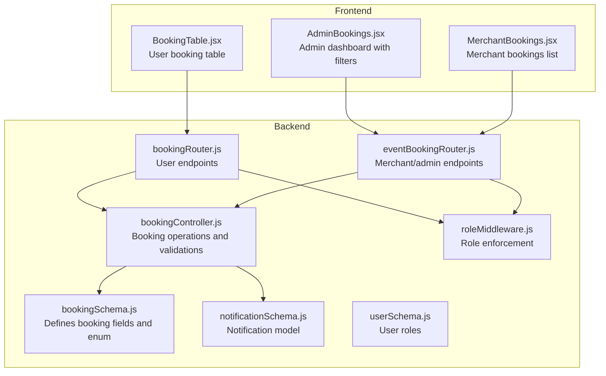
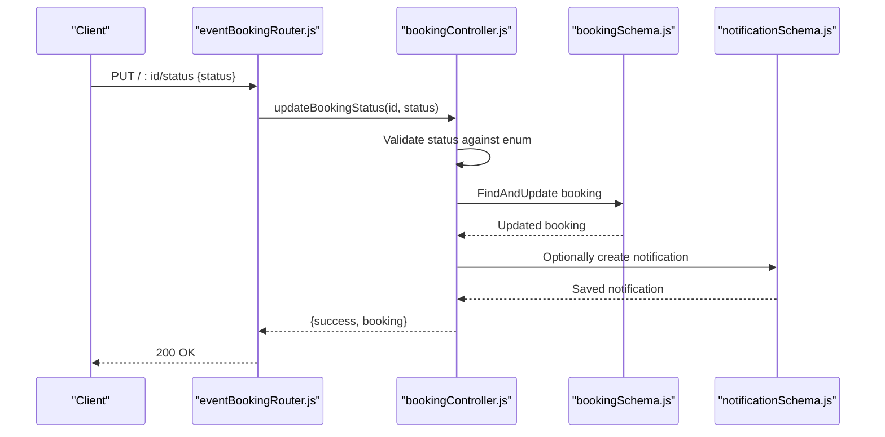
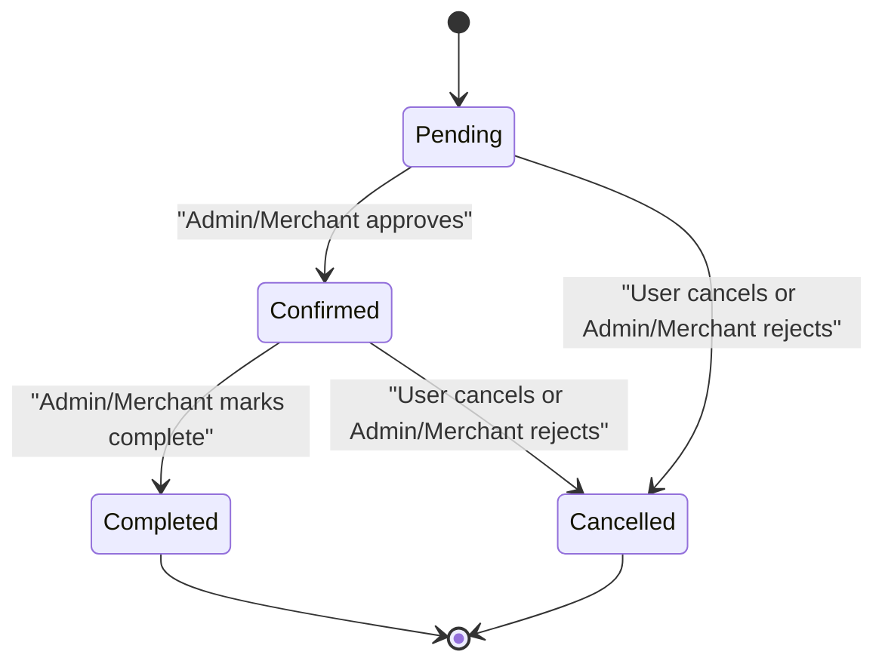
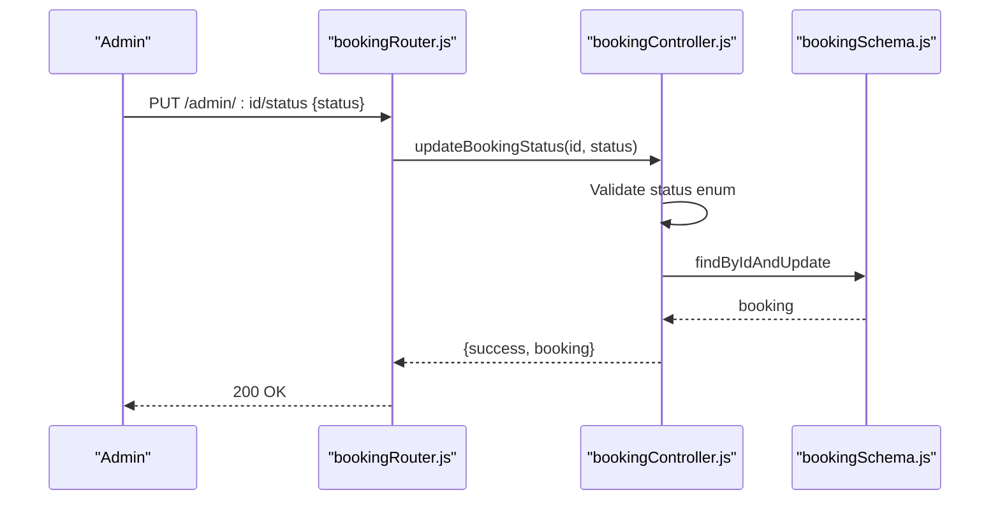
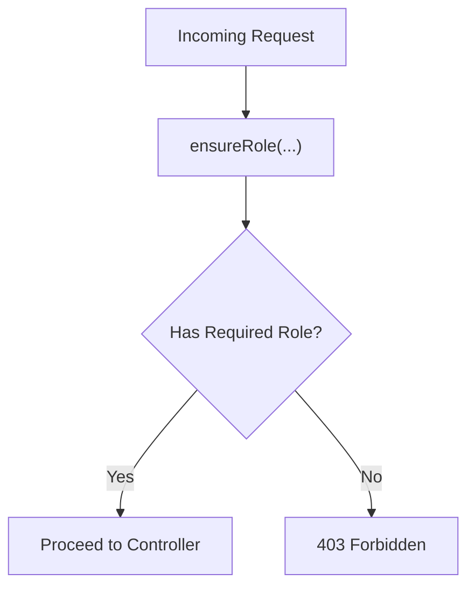
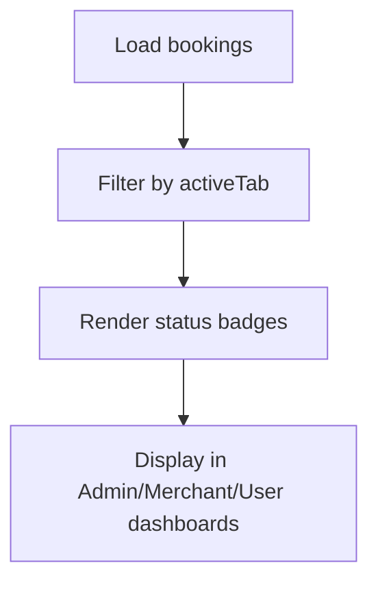
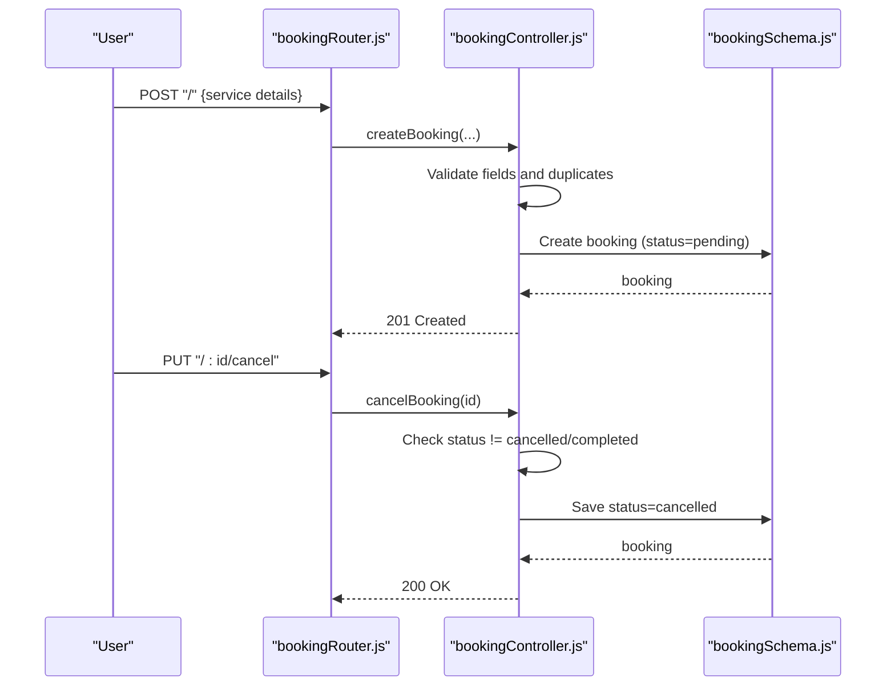
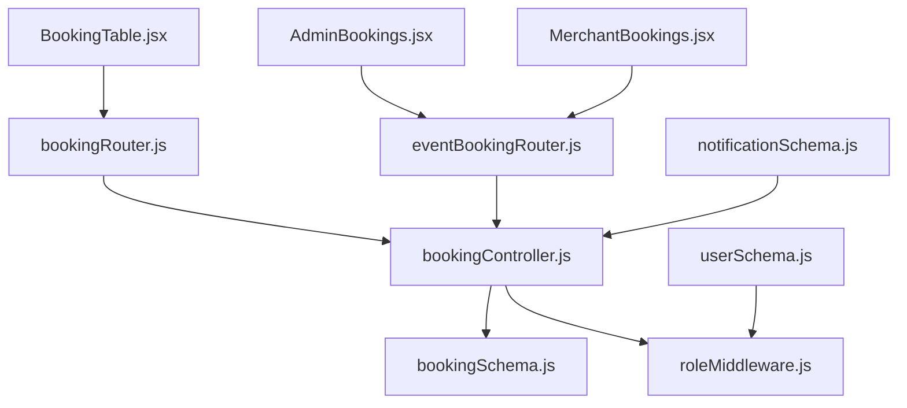

# Booking Status Management

<cite>
**Referenced Files in This Document**
- [bookingSchema.js](file://backend/models/bookingSchema.js)
- [bookingController.js](file://backend/controller/bookingController.js)
- [bookingRouter.js](file://backend/router/bookingRouter.js)
- [eventBookingRouter.js](file://backend/router/eventBookingRouter.js)
- [roleMiddleware.js](file://backend/middleware/roleMiddleware.js)
- [notificationSchema.js](file://backend/models/notificationSchema.js)
- [userSchema.js](file://backend/models/userSchema.js)
- [AdminBookings.jsx](file://frontend/src/pages/dashboards/AdminBookings.jsx)
- [MerchantBookings.jsx](file://frontend/src/pages/dashboards/MerchantBookings.jsx)
- [BookingTable.jsx](file://frontend/src/components/user/BookingTable.jsx)
</cite>

## Table of Contents
1. [Introduction](#introduction)
2. [Project Structure](#project-structure)
3. [Core Components](#core-components)
4. [Architecture Overview](#architecture-overview)
5. [Detailed Component Analysis](#detailed-component-analysis)
6. [Dependency Analysis](#dependency-analysis)
7. [Performance Considerations](#performance-considerations)
8. [Troubleshooting Guide](#troubleshooting-guide)
9. [Conclusion](#conclusion)

## Introduction
This document explains the booking status management functionality across the backend API and frontend dashboards. It covers the booking lifecycle from creation to completion, status transitions, validation rules, role-based access control, status update mechanisms for admin and merchant users, status display logic, filtering, and notification support. It also outlines status-dependent actions, automated and manual intervention processes, conflict resolution, and audit trail considerations.

## Project Structure
The booking status management spans backend models, controllers, routers, middleware, and frontend dashboard components:
- Backend models define the booking schema and notification structure.
- Controllers implement CRUD and status update operations with validation.
- Routers expose endpoints gated by authentication and role middleware.
- Frontend dashboards render statuses, filter by status, and trigger updates.

**Diagram sources**
- [bookingSchema.js:1-53](file://backend/models/bookingSchema.js#L1-L53)
- [bookingController.js:1-233](file://backend/controller/bookingController.js#L1-L233)
- [eventBookingRouter.js:1-47](file://backend/router/eventBookingRouter.js#L1-L47)
- [bookingRouter.js:1-26](file://backend/router/bookingRouter.js#L1-L26)
- [roleMiddleware.js:1-9](file://backend/middleware/roleMiddleware.js#L1-L9)
- [notificationSchema.js:1-36](file://backend/models/notificationSchema.js#L1-L36)
- [userSchema.js:1-55](file://backend/models/userSchema.js#L1-L55)
- [AdminBookings.jsx:1-297](file://frontend/src/pages/dashboards/AdminBookings.jsx#L1-L297)
- [MerchantBookings.jsx:1-86](file://frontend/src/pages/dashboards/MerchantBookings.jsx#L1-L86)
- [BookingTable.jsx:1-59](file://frontend/src/components/user/BookingTable.jsx#L1-L59)

**Section sources**
- [bookingSchema.js:1-53](file://backend/models/bookingSchema.js#L1-L53)
- [bookingController.js:1-233](file://backend/controller/bookingController.js#L1-L233)
- [bookingRouter.js:1-26](file://backend/router/bookingRouter.js#L1-L26)
- [eventBookingRouter.js:1-47](file://backend/router/eventBookingRouter.js#L1-L47)
- [roleMiddleware.js:1-9](file://backend/middleware/roleMiddleware.js#L1-L9)
- [notificationSchema.js:1-36](file://backend/models/notificationSchema.js#L1-L36)
- [userSchema.js:1-55](file://backend/models/userSchema.js#L1-L55)
- [AdminBookings.jsx:1-297](file://frontend/src/pages/dashboards/AdminBookings.jsx#L1-L297)
- [MerchantBookings.jsx:1-86](file://frontend/src/pages/dashboards/MerchantBookings.jsx#L1-L86)
- [BookingTable.jsx:1-59](file://frontend/src/components/user/BookingTable.jsx#L1-L59)

## Core Components
- Booking model defines fields including service metadata, dates, guest count, total price, and the status enum with default pending.
- Controllers implement create, fetch, cancel, and status update operations with validation and role checks.
- Routers expose user endpoints for self-service and admin/merchant endpoints for privileged actions.
- Middleware enforces role-based access control.
- Frontend dashboards render statuses, support filtering, and trigger status updates.

Key implementation references:
- Booking schema and status enum: [bookingSchema.js:36-40](file://backend/models/bookingSchema.js#L36-L40)
- Create booking validation and duplicate check: [bookingController.js:18-38](file://backend/controller/bookingController.js#L18-L38)
- Cancel booking validation: [bookingController.js:142-154](file://backend/controller/bookingController.js#L142-L154)
- Update booking status validation: [bookingController.js:199-205](file://backend/controller/bookingController.js#L199-L205)
- Admin and merchant endpoints: [bookingRouter.js:21-23](file://backend/router/bookingRouter.js#L21-L23), [eventBookingRouter.js:36-45](file://backend/router/eventBookingRouter.js#L36-L45)
- Role enforcement: [roleMiddleware.js:1-9](file://backend/middleware/roleMiddleware.js#L1-L9)
- Notification model for booking-related alerts: [notificationSchema.js:18-30](file://backend/models/notificationSchema.js#L18-L30)

**Section sources**
- [bookingSchema.js:36-40](file://backend/models/bookingSchema.js#L36-L40)
- [bookingController.js:18-38](file://backend/controller/bookingController.js#L18-L38)
- [bookingController.js:142-154](file://backend/controller/bookingController.js#L142-L154)
- [bookingController.js:199-205](file://backend/controller/bookingController.js#L199-L205)
- [bookingRouter.js:21-23](file://backend/router/bookingRouter.js#L21-L23)
- [eventBookingRouter.js:36-45](file://backend/router/eventBookingRouter.js#L36-L45)
- [roleMiddleware.js:1-9](file://backend/middleware/roleMiddleware.js#L1-L9)
- [notificationSchema.js:18-30](file://backend/models/notificationSchema.js#L18-L30)

## Architecture Overview
The booking status management follows a layered architecture:
- Model layer: Defines booking and notification structures.
- Controller layer: Implements business logic, validations, and role checks.
- Router layer: Exposes REST endpoints with authentication and role guards.
- Frontend dashboards: Render status UI, apply filters, and submit updates.

**Diagram sources**
- [eventBookingRouter.js:45](file://backend/router/eventBookingRouter.js#L45)
- [bookingController.js:194-232](file://backend/controller/bookingController.js#L194-L232)
- [bookingSchema.js:36-40](file://backend/models/bookingSchema.js#L36-L40)
- [notificationSchema.js:18-30](file://backend/models/notificationSchema.js#L18-L30)

## Detailed Component Analysis

### Booking Lifecycle and Status Transitions
The booking lifecycle progresses from creation to completion with explicit status transitions:
- Creation: New bookings default to pending.
- Validation: Duplicate active bookings per user/service are prevented.
- Cancellation: Pending and confirmed bookings can be cancelled; completed bookings cannot be cancelled.
- Completion: Admin/merchant endpoints support marking bookings as completed.

**Diagram sources**
- [bookingSchema.js:36-40](file://backend/models/bookingSchema.js#L36-L40)
- [bookingController.js:26-38](file://backend/controller/bookingController.js#L26-L38)
- [bookingController.js:142-154](file://backend/controller/bookingController.js#L142-L154)
- [bookingController.js:199-205](file://backend/controller/bookingController.js#L199-L205)

**Section sources**
- [bookingSchema.js:36-40](file://backend/models/bookingSchema.js#L36-L40)
- [bookingController.js:26-38](file://backend/controller/bookingController.js#L26-L38)
- [bookingController.js:142-154](file://backend/controller/bookingController.js#L142-L154)
- [bookingController.js:199-205](file://backend/controller/bookingController.js#L199-L205)

### Status Update Mechanisms (Admin and Merchant)
- Admin endpoints:
  - GET /admin/all retrieves all bookings with user population.
  - PUT /admin/:id/status updates booking status with validation.
- Merchant endpoints:
  - PUT /:id/accept, PUT /:id/reject, PUT /:id/complete provide merchant-specific actions.
  - PUT /:bookingId/status allows merchant to update status directly.

**Diagram sources**
- [bookingRouter.js:22-23](file://backend/router/bookingRouter.js#L22-L23)
- [bookingController.js:194-232](file://backend/controller/bookingController.js#L194-L232)
- [bookingSchema.js:36-40](file://backend/models/bookingSchema.js#L36-L40)

**Section sources**
- [bookingRouter.js:22-23](file://backend/router/bookingRouter.js#L22-L23)
- [bookingController.js:194-232](file://backend/controller/bookingController.js#L194-L232)

### Role-Based Access Control
- ensureRole middleware restricts endpoints to authorized roles.
- Admin-only routes enforce role "admin".
- Merchant-only routes enforce role "merchant".

**Diagram sources**
- [roleMiddleware.js:1-9](file://backend/middleware/roleMiddleware.js#L1-L9)
- [bookingRouter.js:22-23](file://backend/router/bookingRouter.js#L22-L23)
- [eventBookingRouter.js:36-45](file://backend/router/eventBookingRouter.js#L36-L45)

**Section sources**
- [roleMiddleware.js:1-9](file://backend/middleware/roleMiddleware.js#L1-L9)
- [bookingRouter.js:22-23](file://backend/router/bookingRouter.js#L22-L23)
- [eventBookingRouter.js:36-45](file://backend/router/eventBookingRouter.js#L36-L45)

### Status Display Logic and Filtering
- Admin dashboard:
  - Filters by booking status (all, pending, confirmed, completed) and payment status (paid).
  - Renders status badges with icons and colors.
- Merchant dashboard:
  - Lists bookings with a fixed "Confirmed" badge for merchant view.
- User booking table:
  - Displays recent bookings with status badges.

**Diagram sources**
- [AdminBookings.jsx:138-145](file://frontend/src/pages/dashboards/AdminBookings.jsx#L138-L145)
- [AdminBookings.jsx:71-109](file://frontend/src/pages/dashboards/AdminBookings.jsx#L71-L109)
- [MerchantBookings.jsx:69-73](file://frontend/src/pages/dashboards/MerchantBookings.jsx#L69-L73)
- [BookingTable.jsx:3-8](file://frontend/src/components/user/BookingTable.jsx#L3-L8)

**Section sources**
- [AdminBookings.jsx:138-145](file://frontend/src/pages/dashboards/AdminBookings.jsx#L138-L145)
- [AdminBookings.jsx:71-109](file://frontend/src/pages/dashboards/AdminBookings.jsx#L71-L109)
- [MerchantBookings.jsx:69-73](file://frontend/src/pages/dashboards/MerchantBookings.jsx#L69-L73)
- [BookingTable.jsx:3-8](file://frontend/src/components/user/BookingTable.jsx#L3-L8)

### Status-Based Workflows and Actions
- User actions:
  - Create booking with validation and duplicate prevention.
  - Cancel booking with status checks.
- Merchant actions:
  - Accept, reject, and complete bookings via dedicated endpoints.
- Admin actions:
  - View all bookings and update status directly.

**Diagram sources**
- [bookingRouter.js:15-19](file://backend/router/bookingRouter.js#L15-L19)
- [bookingController.js:4-70](file://backend/controller/bookingController.js#L4-L70)
- [bookingController.js:125-171](file://backend/controller/bookingController.js#L125-L171)
- [bookingSchema.js:36-40](file://backend/models/bookingSchema.js#L36-L40)

**Section sources**
- [bookingRouter.js:15-19](file://backend/router/bookingRouter.js#L15-L19)
- [bookingController.js:4-70](file://backend/controller/bookingController.js#L4-L70)
- [bookingController.js:125-171](file://backend/controller/bookingController.js#L125-L171)

### Automated Status Changes and Manual Intervention
- Automated: No automatic status transitions are implemented in the referenced code.
- Manual intervention: Admin and merchant endpoints enable explicit status updates and actions.

**Section sources**
- [bookingController.js:194-232](file://backend/controller/bookingController.js#L194-L232)
- [eventBookingRouter.js:36-45](file://backend/router/eventBookingRouter.js#L36-L45)

### Conflict Resolution and Audit Trails
- Conflict resolution:
  - Duplicate active booking prevention during creation.
  - Status validation prevents invalid transitions.
- Audit trails:
  - Timestamps on bookings provide creation/update timestamps.
  - Notifications can be used to record status change events.

**Section sources**
- [bookingController.js:26-38](file://backend/controller/bookingController.js#L26-L38)
- [bookingController.js:199-205](file://backend/controller/bookingController.js#L199-L205)
- [bookingSchema.js:49](file://backend/models/bookingSchema.js#L49)
- [notificationSchema.js:18-30](file://backend/models/notificationSchema.js#L18-L30)

## Dependency Analysis
The following diagram shows key dependencies among components involved in booking status management:

**Diagram sources**
- [bookingRouter.js:1-26](file://backend/router/bookingRouter.js#L1-L26)
- [eventBookingRouter.js:1-47](file://backend/router/eventBookingRouter.js#L1-L47)
- [bookingController.js:1-233](file://backend/controller/bookingController.js#L1-L233)
- [bookingSchema.js:1-53](file://backend/models/bookingSchema.js#L1-L53)
- [roleMiddleware.js:1-9](file://backend/middleware/roleMiddleware.js#L1-L9)
- [notificationSchema.js:1-36](file://backend/models/notificationSchema.js#L1-L36)
- [userSchema.js:1-55](file://backend/models/userSchema.js#L1-L55)
- [AdminBookings.jsx:1-297](file://frontend/src/pages/dashboards/AdminBookings.jsx#L1-L297)
- [MerchantBookings.jsx:1-86](file://frontend/src/pages/dashboards/MerchantBookings.jsx#L1-L86)
- [BookingTable.jsx:1-59](file://frontend/src/components/user/BookingTable.jsx#L1-L59)

**Section sources**
- [bookingRouter.js:1-26](file://backend/router/bookingRouter.js#L1-L26)
- [eventBookingRouter.js:1-47](file://backend/router/eventBookingRouter.js#L1-L47)
- [bookingController.js:1-233](file://backend/controller/bookingController.js#L1-L233)
- [bookingSchema.js:1-53](file://backend/models/bookingSchema.js#L1-L53)
- [roleMiddleware.js:1-9](file://backend/middleware/roleMiddleware.js#L1-L9)
- [notificationSchema.js:1-36](file://backend/models/notificationSchema.js#L1-L36)
- [userSchema.js:1-55](file://backend/models/userSchema.js#L1-L55)
- [AdminBookings.jsx:1-297](file://frontend/src/pages/dashboards/AdminBookings.jsx#L1-L297)
- [MerchantBookings.jsx:1-86](file://frontend/src/pages/dashboards/MerchantBookings.jsx#L1-L86)
- [BookingTable.jsx:1-59](file://frontend/src/components/user/BookingTable.jsx#L1-L59)

## Performance Considerations
- Indexing: Consider adding database indexes on frequently queried fields such as user, serviceId, and status to improve query performance.
- Pagination: For large datasets, implement pagination in admin endpoints to reduce payload sizes.
- Caching: Cache static booking lists where appropriate to minimize repeated database queries.
- Batch operations: Group status updates where feasible to reduce round trips.

## Troubleshooting Guide
Common issues and resolutions:
- Duplicate booking errors: Occur when a user attempts to create a new booking while having an active pending or confirmed booking for the same service. Resolution: Ensure users resolve existing active bookings before creating new ones.
- Invalid status updates: Requests with invalid status values are rejected. Resolution: Validate status against the allowed enum before sending requests.
- Forbidden access: Requests without proper roles receive 403. Resolution: Ensure admin or merchant credentials are used for privileged endpoints.
- Booking not found: Operations targeting non-existent booking IDs fail. Resolution: Verify booking IDs and permissions before invoking endpoints.

**Section sources**
- [bookingController.js:26-38](file://backend/controller/bookingController.js#L26-L38)
- [bookingController.js:199-205](file://backend/controller/bookingController.js#L199-L205)
- [roleMiddleware.js:1-9](file://backend/middleware/roleMiddleware.js#L1-L9)

## Conclusion
The booking status management system provides a clear lifecycle with explicit validations, role-based access control, and UI-driven filtering. While automation of status transitions is not present in the current implementation, admin and merchant endpoints enable robust manual intervention. Extending the system with notifications and audit logs would further strengthen operational visibility and compliance.