# Booking Validation and Security

<cite>
**Referenced Files in This Document**
- [bookingController.js](file://backend/controller/bookingController.js)
- [eventBookingController.js](file://backend/controller/eventBookingController.js)
- [bookingSchema.js](file://backend/models/bookingSchema.js)
- [bookingRouter.js](file://backend/router/bookingRouter.js)
- [authMiddleware.js](file://backend/middleware/authMiddleware.js)
- [roleMiddleware.js](file://backend/middleware/roleMiddleware.js)
- [authController.js](file://backend/controller/authController.js)
- [userSchema.js](file://backend/models/userSchema.js)
- [app.js](file://backend/app.js)
- [dbConnection.js](file://backend/database/dbConnection.js)
- [ensureAdmin.js](file://backend/util/ensureAdmin.js)
</cite>

## Table of Contents
1. [Introduction](#introduction)
2. [Project Structure](#project-structure)
3. [Core Components](#core-components)
4. [Architecture Overview](#architecture-overview)
5. [Detailed Component Analysis](#detailed-component-analysis)
6. [Dependency Analysis](#dependency-analysis)
7. [Performance Considerations](#performance-considerations)
8. [Troubleshooting Guide](#troubleshooting-guide)
9. [Conclusion](#conclusion)

## Introduction
This document focuses on booking validation and security measures implemented in the backend. It covers input validation for booking requests, parameter sanitization, and data integrity checks. It also documents authentication requirements, authorization rules, role-based permissions, duplicate booking prevention, capacity validation, conflict detection, and security safeguards such as SQL injection prevention and XSS mitigation. Finally, it outlines error handling strategies, validation feedback, and security audit logging.

## Project Structure
The booking system spans controllers, routers, middleware, models, and utilities. Authentication and authorization are enforced via middleware, while booking-specific logic resides in dedicated controllers. The database connection and environment configuration are centralized.

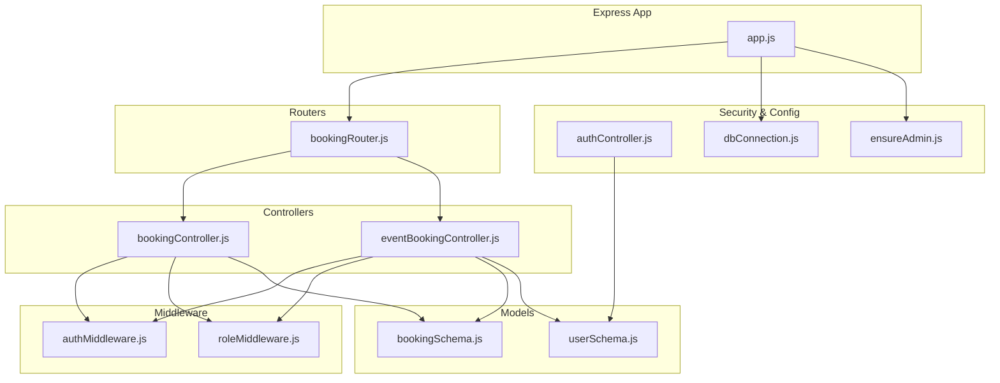

**Diagram sources**
- [app.js:1-91](file://backend/app.js#L1-L91)
- [bookingRouter.js:1-26](file://backend/router/bookingRouter.js#L1-L26)
- [bookingController.js:1-233](file://backend/controller/bookingController.js#L1-L233)
- [eventBookingController.js:1-800](file://backend/controller/eventBookingController.js#L1-L800)
- [authMiddleware.js:1-17](file://backend/middleware/authMiddleware.js#L1-L17)
- [roleMiddleware.js:1-9](file://backend/middleware/roleMiddleware.js#L1-L9)
- [bookingSchema.js:1-53](file://backend/models/bookingSchema.js#L1-L53)
- [userSchema.js:1-55](file://backend/models/userSchema.js#L1-L55)
- [authController.js:1-120](file://backend/controller/authController.js#L1-L120)
- [dbConnection.js:1-112](file://backend/database/dbConnection.js#L1-L112)
- [ensureAdmin.js:1-35](file://backend/util/ensureAdmin.js#L1-L35)

**Section sources**
- [app.js:1-91](file://backend/app.js#L1-L91)
- [bookingRouter.js:1-26](file://backend/router/bookingRouter.js#L1-L26)

## Core Components
- Authentication middleware validates JWT tokens and attaches user identity to requests.
- Authorization middleware enforces role-based access for admin-only endpoints.
- Booking controllers implement input validation, duplicate prevention, and status transitions.
- Event booking controller extends validation for ticketed and full-service events, including capacity checks and coupon application.
- Booking schema defines data integrity constraints and enums for statuses.
- User schema defines roles and validation rules for authentication.

**Section sources**
- [authMiddleware.js:1-17](file://backend/middleware/authMiddleware.js#L1-L17)
- [roleMiddleware.js:1-9](file://backend/middleware/roleMiddleware.js#L1-L9)
- [bookingController.js:1-233](file://backend/controller/bookingController.js#L1-L233)
- [eventBookingController.js:1-800](file://backend/controller/eventBookingController.js#L1-L800)
- [bookingSchema.js:1-53](file://backend/models/bookingSchema.js#L1-L53)
- [userSchema.js:1-55](file://backend/models/userSchema.js#L1-L55)

## Architecture Overview
The booking workflow integrates authentication, authorization, and domain-specific validation. Requests flow from routers to controllers, validated by middleware, persisted via models, and audited through logs.

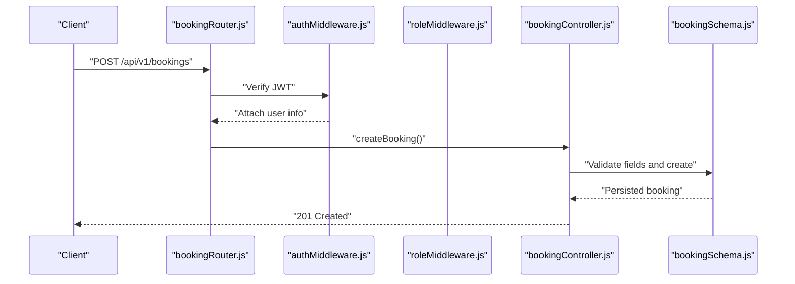

**Diagram sources**
- [bookingRouter.js:15-19](file://backend/router/bookingRouter.js#L15-L19)
- [authMiddleware.js:3-16](file://backend/middleware/authMiddleware.js#L3-L16)
- [bookingController.js:4-70](file://backend/controller/bookingController.js#L4-L70)
- [bookingSchema.js:3-50](file://backend/models/bookingSchema.js#L3-L50)

## Detailed Component Analysis

### Authentication and Authorization
- JWT verification extracts user identity and role from the Authorization header.
- Role enforcement ensures only authorized users access admin endpoints.
- Registration and login enforce field presence and password hashing.

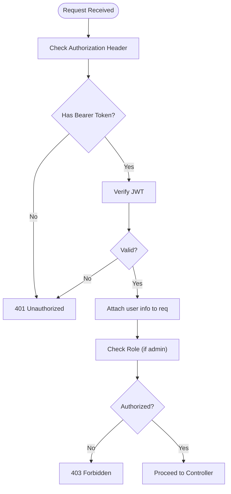

**Diagram sources**
- [authMiddleware.js:3-16](file://backend/middleware/authMiddleware.js#L3-L16)
- [roleMiddleware.js:1-9](file://backend/middleware/roleMiddleware.js#L1-L9)
- [authController.js:54-107](file://backend/controller/authController.js#L54-L107)

**Section sources**
- [authMiddleware.js:1-17](file://backend/middleware/authMiddleware.js#L1-L17)
- [roleMiddleware.js:1-9](file://backend/middleware/roleMiddleware.js#L1-L9)
- [authController.js:1-120](file://backend/controller/authController.js#L1-L120)
- [userSchema.js:39-44](file://backend/models/userSchema.js#L39-L44)

### Input Validation and Parameter Sanitization
- Required fields are validated before creating bookings.
- Duplicate booking prevention checks for pending/confirmed bookings per user and service.
- Pricing calculations derive totals from guest count and unit price.
- Logging captures request bodies and user context for auditability.

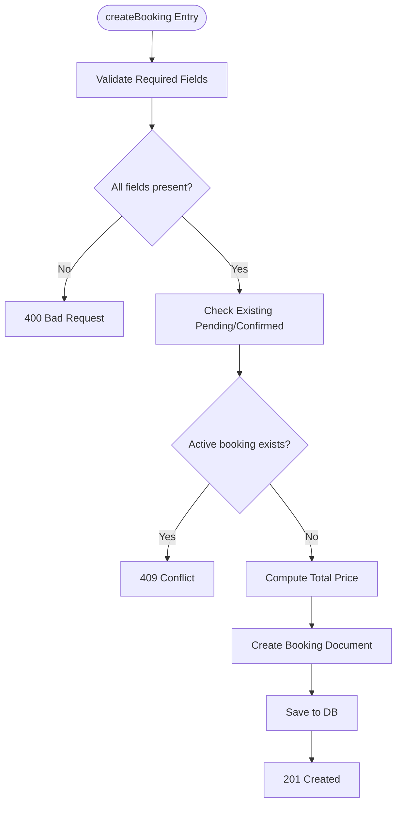

**Diagram sources**
- [bookingController.js:18-62](file://backend/controller/bookingController.js#L18-L62)
- [bookingSchema.js:5-47](file://backend/models/bookingSchema.js#L5-L47)

**Section sources**
- [bookingController.js:18-62](file://backend/controller/bookingController.js#L18-L62)
- [bookingSchema.js:3-50](file://backend/models/bookingSchema.js#L3-L50)

### Event-Based Booking Validation (Ticketed and Full-Service)
- Routing by event type determines validation and capacity logic.
- Ticketed events validate quantity, check availability, and update sold counts atomically.
- Full-service events require merchant approval and maintain pending status until approval.

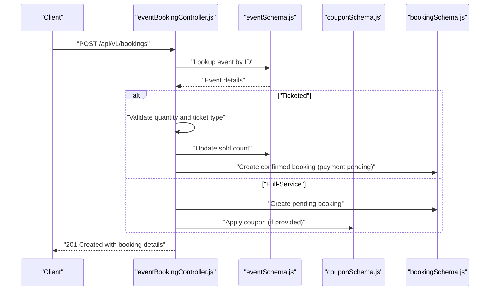

**Diagram sources**
- [eventBookingController.js:7-73](file://backend/controller/eventBookingController.js#L7-L73)
- [eventBookingController.js:322-589](file://backend/controller/eventBookingController.js#L322-L589)
- [eventBookingController.js:76-319](file://backend/controller/eventBookingController.js#L76-L319)

**Section sources**
- [eventBookingController.js:7-73](file://backend/controller/eventBookingController.js#L7-L73)
- [eventBookingController.js:322-589](file://backend/controller/eventBookingController.js#L322-L589)
- [eventBookingController.js:76-319](file://backend/controller/eventBookingController.js#L76-L319)

### Capacity Validation and Conflict Detection
- Ticketed events compute available tickets and enforce quantity limits.
- Full-service events prevent duplicate active bookings per user and event.
- Coupon application enforces usage limits, expiry, and minimum order thresholds.

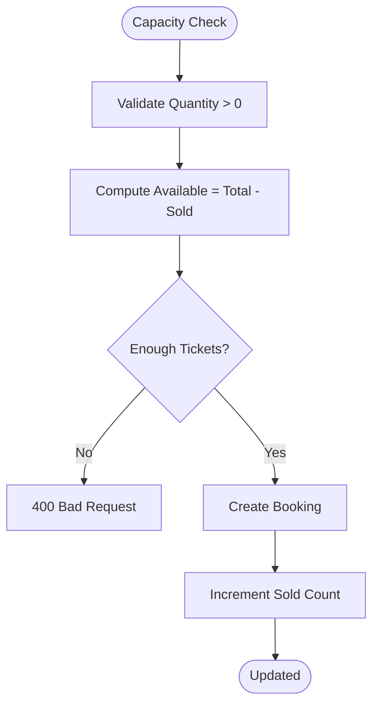

**Diagram sources**
- [eventBookingController.js:377-391](file://backend/controller/eventBookingController.js#L377-L391)

**Section sources**
- [eventBookingController.js:377-391](file://backend/controller/eventBookingController.js#L377-L391)
- [eventBookingController.js:131-144](file://backend/controller/eventBookingController.js#L131-L144)

### Authorization Rules and Role-Based Permissions
- Admin-only routes require the "admin" role.
- Merchant-only approvals restrict updates to bookings owned by the merchant.
- User-only routes bind operations to the authenticated user ID.

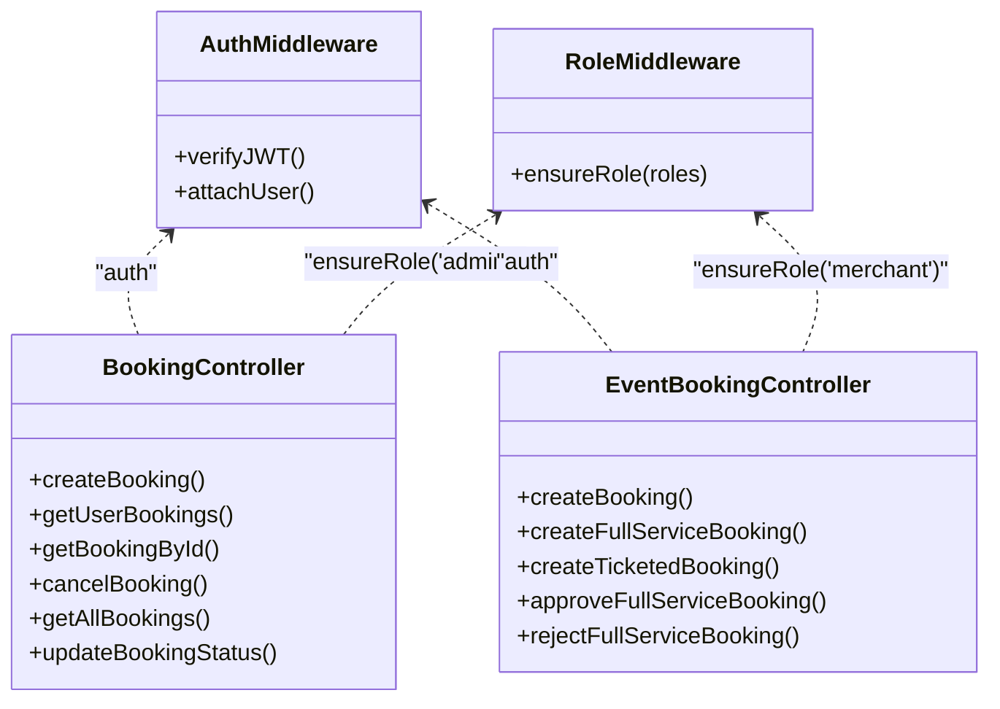

**Diagram sources**
- [bookingRouter.js:15-23](file://backend/router/bookingRouter.js#L15-L23)
- [authMiddleware.js:3-16](file://backend/middleware/authMiddleware.js#L3-L16)
- [roleMiddleware.js:1-9](file://backend/middleware/roleMiddleware.js#L1-L9)
- [bookingController.js:174-191](file://backend/controller/bookingController.js#L174-L191)
- [eventBookingController.js:636-699](file://backend/controller/eventBookingController.js#L636-L699)

**Section sources**
- [bookingRouter.js:21-23](file://backend/router/bookingRouter.js#L21-L23)
- [bookingController.js:174-191](file://backend/controller/bookingController.js#L174-L191)
- [eventBookingController.js:636-699](file://backend/controller/eventBookingController.js#L636-L699)

### Data Integrity and Schema Constraints
- Booking schema enforces required fields, enums for status, and numeric constraints.
- User schema enforces role enums and email validation.
- Database connection includes robust retry logic and DNS overrides for Atlas connectivity.

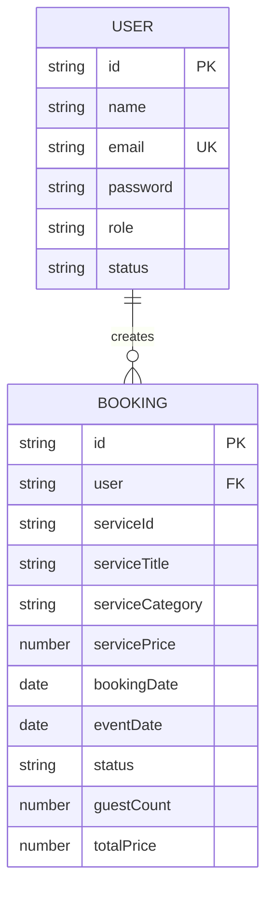

**Diagram sources**
- [bookingSchema.js:5-47](file://backend/models/bookingSchema.js#L5-L47)
- [userSchema.js:6-44](file://backend/models/userSchema.js#L6-L44)

**Section sources**
- [bookingSchema.js:1-53](file://backend/models/bookingSchema.js#L1-L53)
- [userSchema.js:1-55](file://backend/models/userSchema.js#L1-L55)
- [dbConnection.js:19-94](file://backend/database/dbConnection.js#L19-L94)

### Security Measures
- JWT-based authentication with secret and expiration configured via environment variables.
- CORS configured with allowed origin, methods, and credentials.
- Password hashing via bcrypt for secure credential storage.
- Logging of sensitive operations for auditability.

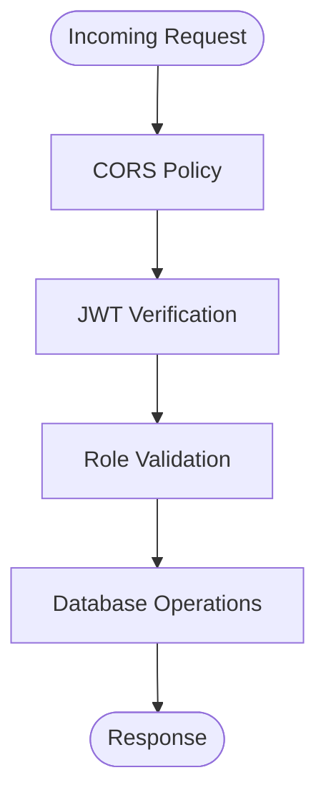

**Diagram sources**
- [app.js:24-30](file://backend/app.js#L24-L30)
- [authMiddleware.js:10-14](file://backend/middleware/authMiddleware.js#L10-L14)
- [authController.js:31-37](file://backend/controller/authController.js#L31-L37)

**Section sources**
- [app.js:24-30](file://backend/app.js#L24-L30)
- [authMiddleware.js:1-17](file://backend/middleware/authMiddleware.js#L1-L17)
- [authController.js:11-52](file://backend/controller/authController.js#L11-L52)

### Error Handling and Validation Feedback
- Centralized error logging for booking operations.
- Structured JSON responses with success flags and messages.
- Explicit HTTP status codes for validation failures, duplicates, and server errors.

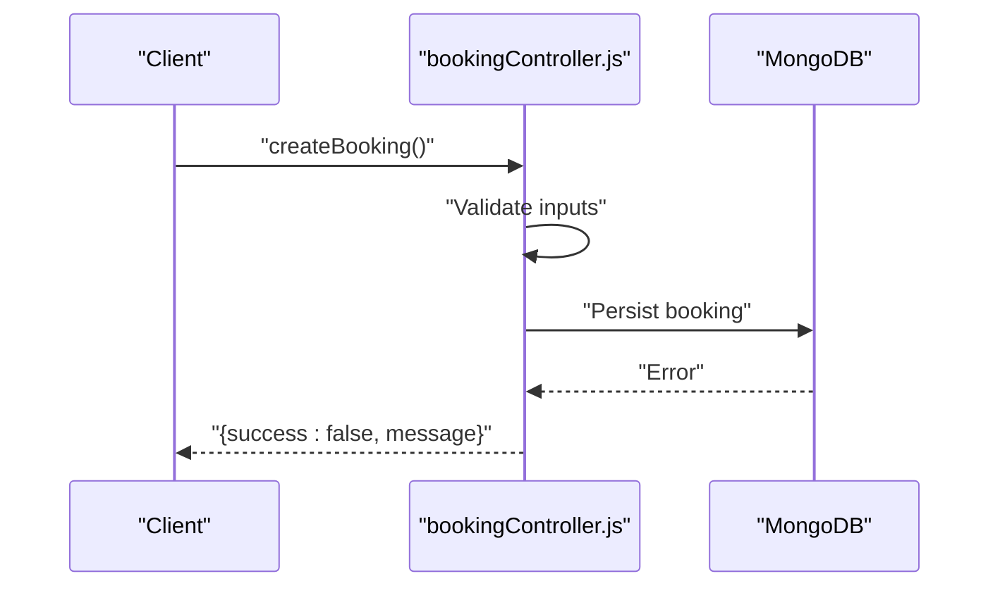

**Diagram sources**
- [bookingController.js:63-69](file://backend/controller/bookingController.js#L63-L69)

**Section sources**
- [bookingController.js:63-69](file://backend/controller/bookingController.js#L63-L69)
- [eventBookingController.js:66-72](file://backend/controller/eventBookingController.js#L66-L72)

### Duplicate Booking Prevention and Conflict Detection
- Active booking check prevents multiple pending/confirmed bookings for the same service/user.
- Full-service duplicate check prevents overlapping active bookings for the same event/user.

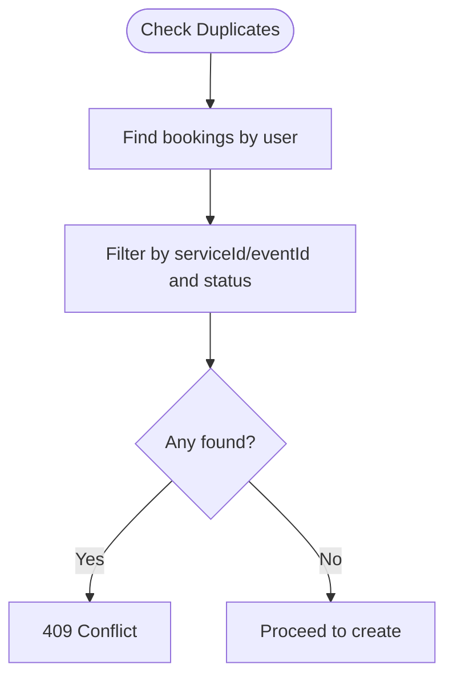

**Diagram sources**
- [bookingController.js:26-38](file://backend/controller/bookingController.js#L26-L38)
- [eventBookingController.js:131-144](file://backend/controller/eventBookingController.js#L131-L144)

**Section sources**
- [bookingController.js:26-38](file://backend/controller/bookingController.js#L26-L38)
- [eventBookingController.js:131-144](file://backend/controller/eventBookingController.js#L131-L144)

### Booking Access Controls and Modification Restrictions
- User-only routes bind operations to the authenticated user ID.
- Merchant-only routes enforce ownership of bookings.
- Admin-only routes bypass user binding and expose administrative views.

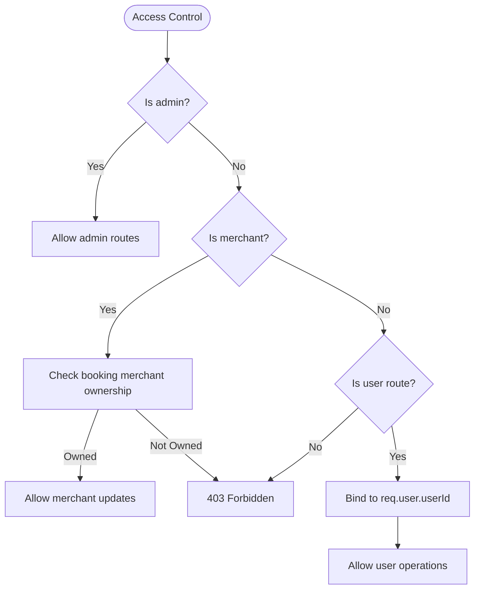

**Diagram sources**
- [bookingRouter.js:15-23](file://backend/router/bookingRouter.js#L15-L23)
- [eventBookingController.js:636-699](file://backend/controller/eventBookingController.js#L636-L699)

**Section sources**
- [bookingRouter.js:15-23](file://backend/router/bookingRouter.js#L15-L23)
- [eventBookingController.js:636-699](file://backend/controller/eventBookingController.js#L636-L699)

### Security Audit Logging
- Controllers log request bodies, user IDs, and outcomes for auditability.
- Database connection logs connectivity events and errors.

**Section sources**
- [eventBookingController.js:12-16](file://backend/controller/eventBookingController.js#L12-L16)
- [dbConnection.js:96-112](file://backend/database/dbConnection.js#L96-L112)

## Dependency Analysis
The booking system exhibits clear separation of concerns:
- Routers depend on middleware for auth and role checks.
- Controllers depend on models for persistence and on middleware for request guarantees.
- Utilities support initialization and admin provisioning.

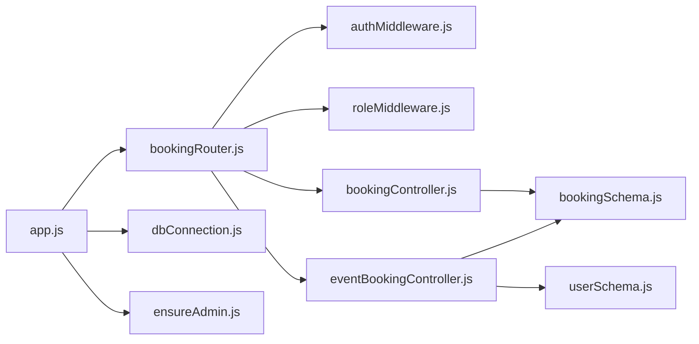

**Diagram sources**
- [bookingRouter.js:1-26](file://backend/router/bookingRouter.js#L1-L26)
- [authMiddleware.js:1-17](file://backend/middleware/authMiddleware.js#L1-L17)
- [roleMiddleware.js:1-9](file://backend/middleware/roleMiddleware.js#L1-L9)
- [bookingController.js:1-233](file://backend/controller/bookingController.js#L1-L233)
- [eventBookingController.js:1-800](file://backend/controller/eventBookingController.js#L1-L800)
- [bookingSchema.js:1-53](file://backend/models/bookingSchema.js#L1-L53)
- [userSchema.js:1-55](file://backend/models/userSchema.js#L1-L55)
- [app.js:1-91](file://backend/app.js#L1-L91)
- [dbConnection.js:1-112](file://backend/database/dbConnection.js#L1-L112)
- [ensureAdmin.js:1-35](file://backend/util/ensureAdmin.js#L1-L35)

**Section sources**
- [bookingRouter.js:1-26](file://backend/router/bookingRouter.js#L1-L26)
- [bookingController.js:1-233](file://backend/controller/bookingController.js#L1-L233)
- [eventBookingController.js:1-800](file://backend/controller/eventBookingController.js#L1-L800)

## Performance Considerations
- Use database indexes on frequently queried fields (e.g., user, serviceId/eventId, status) to optimize duplicate checks and fetches.
- Batch operations for coupon usage updates to reduce write amplification.
- Consider pagination for admin booking listings to limit payload sizes.
- Monitor JWT token expiration and refresh strategies to minimize verification overhead.

## Troubleshooting Guide
- Authentication failures: Verify Authorization header format and JWT secret configuration.
- Role-based access denied: Confirm user role and ensure proper middleware chaining.
- Duplicate booking conflicts: Review active booking queries and ensure status filtering.
- Ticket availability errors: Validate ticket type selection and sold count updates.
- Database connectivity: Check DNS overrides and retry configurations for Atlas.

**Section sources**
- [authMiddleware.js:7-14](file://backend/middleware/authMiddleware.js#L7-L14)
- [roleMiddleware.js:3-6](file://backend/middleware/roleMiddleware.js#L3-L6)
- [bookingController.js:33-38](file://backend/controller/bookingController.js#L33-L38)
- [eventBookingController.js:377-391](file://backend/controller/eventBookingController.js#L377-L391)
- [dbConnection.js:19-94](file://backend/database/dbConnection.js#L19-L94)

## Conclusion
The booking system implements robust validation, authorization, and security controls. Authentication and role middleware protect endpoints, while controllers enforce input validation, duplicate prevention, and capacity checks. Schema constraints and logging support data integrity and auditability. Extending the system with database indexing, structured logging, and explicit error responses will further strengthen reliability and operability.