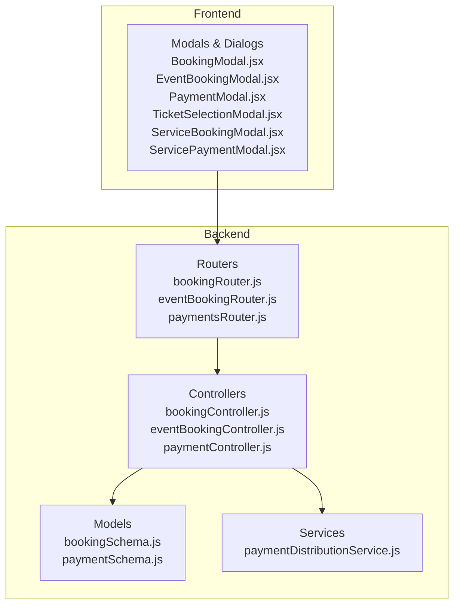
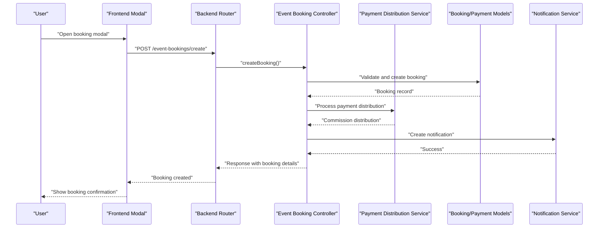
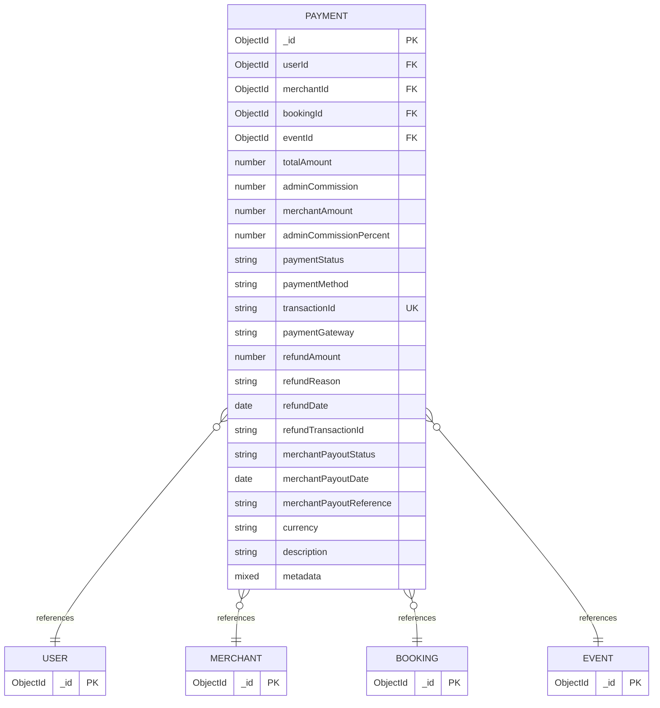
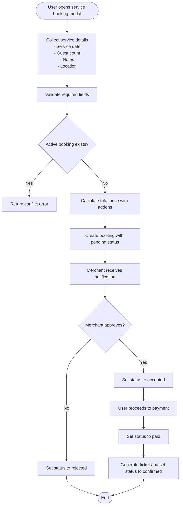
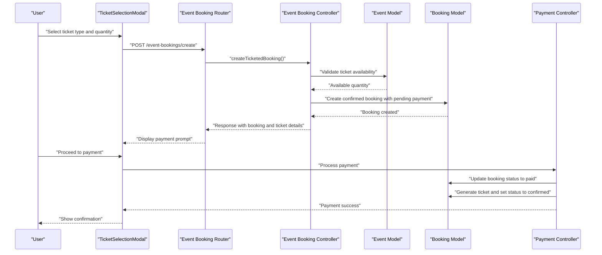
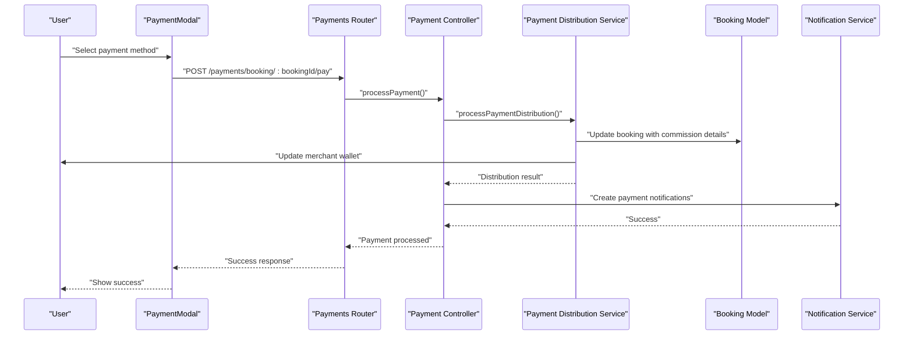
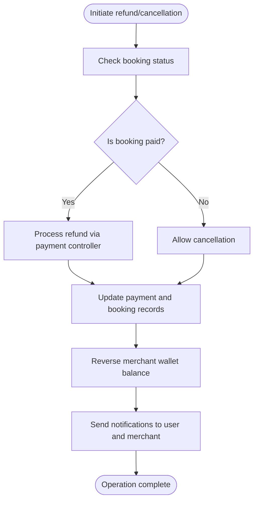
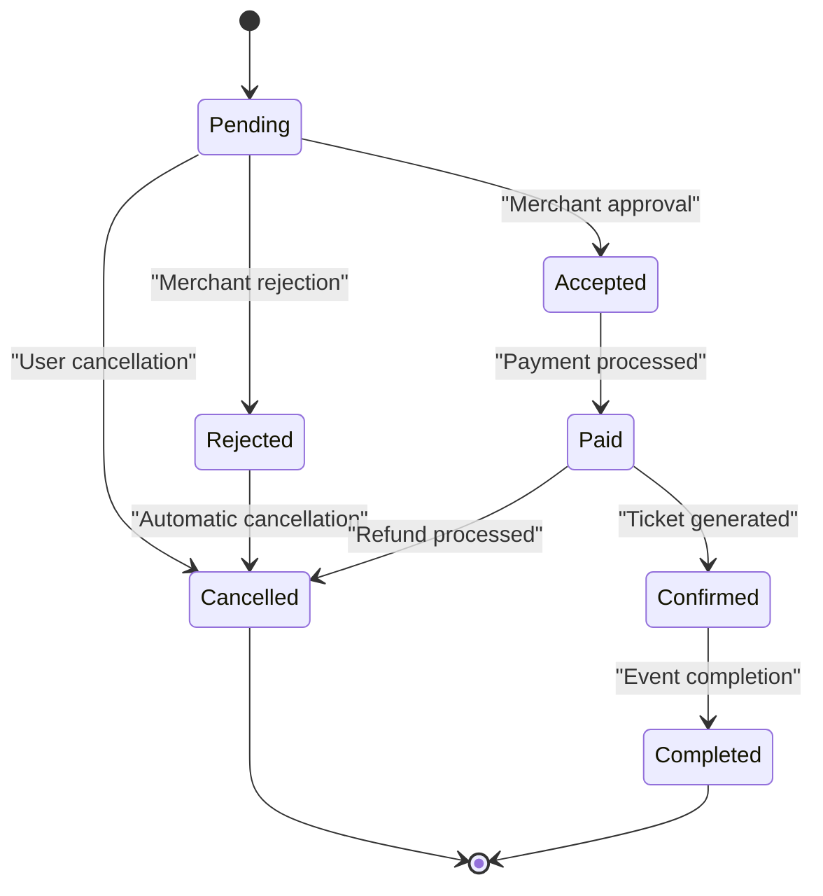
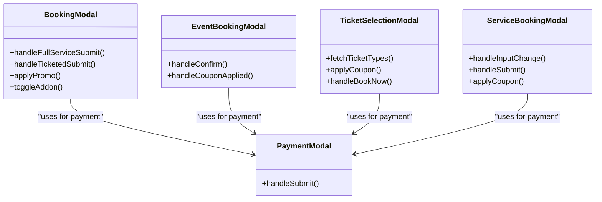
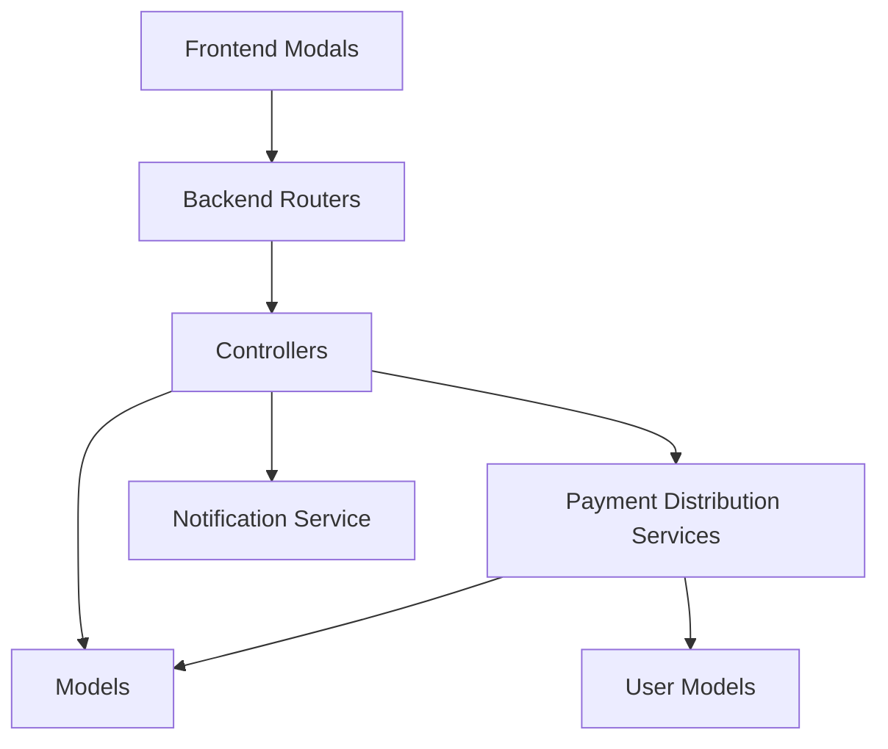

# Booking and Payment System

<cite>
**Referenced Files in This Document**
- [bookingSchema.js](file://backend/models/bookingSchema.js)
- [paymentSchema.js](file://backend/models/paymentSchema.js)
- [bookingController.js](file://backend/controller/bookingController.js)
- [eventBookingController.js](file://backend/controller/eventBookingController.js)
- [paymentController.js](file://backend/controller/paymentController.js)
- [paymentDistributionService.js](file://backend/services/paymentDistributionService.js)
- [bookingRouter.js](file://backend/router/bookingRouter.js)
- [eventBookingRouter.js](file://backend/router/eventBookingRouter.js)
- [paymentsRouter.js](file://backend/router/paymentsRouter.js)
- [BookingModal.jsx](file://frontend/src/components/BookingModal.jsx)
- [EventBookingModal.jsx](file://frontend/src/components/EventBookingModal.jsx)
- [PaymentModal.jsx](file://frontend/src/components/PaymentModal.jsx)
- [TicketSelectionModal.jsx](file://frontend/src/components/TicketSelectionModal.jsx)
- [ServiceBookingModal.jsx](file://frontend/src/components/ServiceBookingModal.jsx)
- [ServicePaymentModal.jsx](file://frontend/src/components/ServicePaymentModal.jsx)
</cite>

## Update Summary
**Changes Made**
- Updated booking schema to support dual event types (full-service and ticketed)
- Redesigned booking workflow with five booking states (pending, accepted, rejected, paid, confirmed)
- Enhanced payment processing with commission distribution and refund handling
- Updated frontend components to support both event types with new modal interfaces
- Added comprehensive booking status management and merchant workflows

## Table of Contents
1. [Introduction](#introduction)
2. [Project Structure](#project-structure)
3. [Core Components](#core-components)
4. [Architecture Overview](#architecture-overview)
5. [Detailed Component Analysis](#detailed-component-analysis)
6. [Dependency Analysis](#dependency-analysis)
7. [Performance Considerations](#performance-considerations)
8. [Troubleshooting Guide](#troubleshooting-guide)
9. [Conclusion](#conclusion)

## Introduction
This document provides comprehensive documentation for the Event Management Platform's redesigned booking and payment system. The system now features a dual event type architecture supporting both full-service events (requiring merchant approval) and ticketed events (immediate booking with payment). The booking workflow has been enhanced with five distinct booking states: pending, accepted, rejected, paid, and confirmed, providing comprehensive lifecycle management for different event types.

## Project Structure
The booking and payment system spans both backend and frontend components with a redesigned dual event type architecture:
- Backend: Models define the booking and payment schemas with dual event type support, controllers implement business logic for both event types, and routers expose API endpoints for comprehensive booking workflows.
- Frontend: Modals and dialogs manage user interactions for both full-service and ticketed event booking, payment processing, and coupon application.



**Diagram sources**
- [bookingSchema.js:1-118](file://backend/models/bookingSchema.js#L1-L118)
- [paymentSchema.js:1-142](file://backend/models/paymentSchema.js#L1-L142)
- [bookingController.js:1-764](file://backend/controller/bookingController.js#L1-L764)
- [eventBookingController.js:1-800](file://backend/controller/eventBookingController.js#L1-L800)
- [paymentController.js:1-577](file://backend/controller/paymentController.js#L1-L577)
- [paymentDistributionService.js:1-340](file://backend/services/paymentDistributionService.js#L1-L340)
- [bookingRouter.js:1-40](file://backend/router/bookingRouter.js#L1-L40)
- [eventBookingRouter.js:1-47](file://backend/router/eventBookingRouter.js#L1-L47)
- [paymentsRouter.js:1-44](file://backend/router/paymentsRouter.js#L1-L44)
- [BookingModal.jsx:1-800](file://frontend/src/components/BookingModal.jsx#L1-L800)
- [EventBookingModal.jsx:1-276](file://frontend/src/components/EventBookingModal.jsx#L1-L276)
- [PaymentModal.jsx:1-364](file://frontend/src/components/PaymentModal.jsx#L1-L364)
- [TicketSelectionModal.jsx:1-448](file://frontend/src/components/TicketSelectionModal.jsx#L1-L448)
- [ServiceBookingModal.jsx:1-440](file://frontend/src/components/ServiceBookingModal.jsx#L1-L440)
- [ServicePaymentModal.jsx:1-246](file://frontend/src/components/ServicePaymentModal.jsx#L1-L246)

**Section sources**
- [bookingSchema.js:1-118](file://backend/models/bookingSchema.js#L1-L118)
- [paymentSchema.js:1-142](file://backend/models/paymentSchema.js#L1-L142)
- [bookingController.js:1-764](file://backend/controller/bookingController.js#L1-L764)
- [eventBookingController.js:1-800](file://backend/controller/eventBookingController.js#L1-L800)
- [paymentController.js:1-577](file://backend/controller/paymentController.js#L1-L577)
- [paymentDistributionService.js:1-340](file://backend/services/paymentDistributionService.js#L1-L340)
- [bookingRouter.js:1-40](file://backend/router/bookingRouter.js#L1-L40)
- [eventBookingRouter.js:1-47](file://backend/router/eventBookingRouter.js#L1-L47)
- [paymentsRouter.js:1-44](file://backend/router/paymentsRouter.js#L1-L44)
- [BookingModal.jsx:1-800](file://frontend/src/components/BookingModal.jsx#L1-L800)
- [EventBookingModal.jsx:1-276](file://frontend/src/components/EventBookingModal.jsx#L1-L276)
- [PaymentModal.jsx:1-364](file://frontend/src/components/PaymentModal.jsx#L1-L364)
- [TicketSelectionModal.jsx:1-448](file://frontend/src/components/TicketSelectionModal.jsx#L1-L448)
- [ServiceBookingModal.jsx:1-440](file://frontend/src/components/ServiceBookingModal.jsx#L1-L440)
- [ServicePaymentModal.jsx:1-246](file://frontend/src/components/ServicePaymentModal.jsx#L1-L246)

## Core Components
This section outlines the core components involved in the redesigned booking and payment system.

- **Booking Schema**: Defines the structure for both full-service and ticketed event bookings, including user reference, service/event details, booking date, event date, notes, status, guest count, total price, event type, merchant responses, addons, payment details, ticket information, selected tickets, discount and promo code information, location details, and rating/review system.
- **Payment Schema**: Defines the structure for payment records with commission distribution, merchant payouts, payment status, payment method, transaction identifiers, refund details, and metadata.
- **Booking Controller**: Manages CRUD operations for bookings with dual event type support, user-specific retrieval, cancellation, merchant approvals, payment processing, and admin-level status updates.
- **Event Booking Controller**: Handles event-specific booking workflows with routing between full-service and ticketed booking types, coupon application, capacity management, and merchant approvals.
- **Payment Controller**: Processes payments with commission distribution, handles refunds, retrieves payment statistics, and manages merchant earnings.
- **Payment Distribution Service**: Provides commission calculation, payment distribution logic, and refund processing with automatic merchant wallet updates.
- **Frontend Modals**: Provide user interfaces for booking creation, payment selection, and coupon application across both full-service and ticketed events.

**Section sources**
- [bookingSchema.js:1-118](file://backend/models/bookingSchema.js#L1-L118)
- [paymentSchema.js:1-142](file://backend/models/paymentSchema.js#L1-L142)
- [bookingController.js:1-764](file://backend/controller/bookingController.js#L1-L764)
- [eventBookingController.js:1-800](file://backend/controller/eventBookingController.js#L1-L800)
- [paymentController.js:1-577](file://backend/controller/paymentController.js#L1-L577)
- [paymentDistributionService.js:1-340](file://backend/services/paymentDistributionService.js#L1-L340)

## Architecture Overview
The system follows a layered architecture with clear separation between frontend modals and backend controllers. The frontend modals collect user input and submit requests to backend endpoints, which enforce business rules, update database records, distribute payments with commission calculations, and notify stakeholders via notifications.



**Diagram sources**
- [eventBookingRouter.js:1-47](file://backend/router/eventBookingRouter.js#L1-L47)
- [eventBookingController.js:1-800](file://backend/controller/eventBookingController.js#L1-L800)
- [paymentDistributionService.js:1-340](file://backend/services/paymentDistributionService.js#L1-L340)
- [bookingSchema.js:1-118](file://backend/models/bookingSchema.js#L1-L118)
- [paymentSchema.js:1-142](file://backend/models/paymentSchema.js#L1-L142)

## Detailed Component Analysis

### Dual Event Type Booking Schema Design
The booking schema now supports both full-service and ticketed event types with comprehensive field definitions for each type. The schema includes event type enumeration, dual workflow status system, merchant response handling, addon management, payment tracking, ticket generation, multiple ticket type selection, discount management, and location details.

```mermaid
erDiagram
BOOKING {
ObjectId _id PK
ObjectId user FK
string serviceId
string serviceTitle
string serviceCategory
number servicePrice
string eventType ENUM["full-service","ticketed"]
date bookingDate
date eventDate
string eventTime
string notes
string status ENUM["pending","pending_payment","accepted","rejected","paid","confirmed","cancelled","completed"]
boolean merchantResponse.accepted
date merchantResponse.responseDate
string merchantResponse.message
Addon addons
boolean payment.paid
string payment.paymentId
date payment.paymentDate
number payment.amount
string ticket.ticketNumber
string ticket.qrCode
date ticket.generatedAt
string ticket.ticketType
number ticket.quantity
number ticket.pricePerTicket
Map selectedTickets
number discount
string promoCode
number guestCount
number totalPrice
string location
string locationType ENUM["event","custom"]
Rating rating
}
USER {
ObjectId _id PK
string name
string email
}
EVENT {
ObjectId _id PK
string title
string category
number price
}
BOOKING }o--|| USER : "references"
BOOKING }o--|| EVENT : "references"
```

**Diagram sources**
- [bookingSchema.js:1-118](file://backend/models/bookingSchema.js#L1-L118)

**Section sources**
- [bookingSchema.js:1-118](file://backend/models/bookingSchema.js#L1-L118)

### Payment Schema Design
The payment schema encapsulates payment details with comprehensive commission distribution, merchant payout tracking, payment status management, and refund handling. It enforces amount validation and provides computed virtual fields for commission percentages.



**Diagram sources**
- [paymentSchema.js:1-142](file://backend/models/paymentSchema.js#L1-L142)

**Section sources**
- [paymentSchema.js:1-142](file://backend/models/paymentSchema.js#L1-L142)

### Full-Service Event Booking Workflow
Full-service event booking requires merchant approval before payment processing. The workflow involves collecting service details (date, guest count, notes), validating uniqueness, calculating totals, creating bookings with pending status, merchant approval/rejection, payment processing, and ticket generation.



**Diagram sources**
- [BookingModal.jsx:1-800](file://frontend/src/components/BookingModal.jsx#L1-L800)
- [bookingController.js:496-659](file://backend/controller/bookingController.js#L496-L659)
- [bookingSchema.js:1-118](file://backend/models/bookingSchema.js#L1-L118)

**Section sources**
- [BookingModal.jsx:1-800](file://frontend/src/components/BookingModal.jsx#L1-L800)
- [bookingController.js:496-659](file://backend/controller/bookingController.js#L496-L659)
- [bookingSchema.js:1-118](file://backend/models/bookingSchema.js#L1-L118)

### Ticketed Event Booking Workflow
Ticketed event booking allows immediate booking with payment processing. The workflow involves selecting ticket types and quantities, applying coupons, validating availability, creating confirmed bookings with pending payment status, processing payments, generating tickets, and marking as completed.



**Diagram sources**
- [TicketSelectionModal.jsx:1-448](file://frontend/src/components/TicketSelectionModal.jsx#L1-L448)
- [eventBookingRouter.js:1-47](file://backend/router/eventBookingRouter.js#L1-L47)
- [eventBookingController.js:321-589](file://backend/controller/eventBookingController.js#L321-L589)
- [bookingSchema.js:1-118](file://backend/models/bookingSchema.js#L1-L118)
- [paymentController.js:1-577](file://backend/controller/paymentController.js#L1-L577)

**Section sources**
- [TicketSelectionModal.jsx:1-448](file://frontend/src/components/TicketSelectionModal.jsx#L1-L448)
- [eventBookingRouter.js:1-47](file://backend/router/eventBookingRouter.js#L1-L47)
- [eventBookingController.js:321-589](file://backend/controller/eventBookingController.js#L321-L589)
- [paymentController.js:1-577](file://backend/controller/paymentController.js#L1-L577)

### Payment Processing Integration
Payment processing integrates with commission distribution services and supports multiple payment methods. The system generates transaction IDs, calculates 5% admin commission, distributes payments between admin and merchant, updates booking and payment records, and manages merchant wallet balances.



**Diagram sources**
- [PaymentModal.jsx:1-364](file://frontend/src/components/PaymentModal.jsx#L1-L364)
- [paymentsRouter.js:1-44](file://backend/router/paymentsRouter.js#L1-L44)
- [paymentController.js:10-141](file://backend/controller/paymentController.js#L10-L141)
- [paymentDistributionService.js:33-159](file://backend/services/paymentDistributionService.js#L33-L159)
- [bookingSchema.js:1-118](file://backend/models/bookingSchema.js#L1-L118)

**Section sources**
- [PaymentModal.jsx:1-364](file://frontend/src/components/PaymentModal.jsx#L1-L364)
- [paymentsRouter.js:1-44](file://backend/router/paymentsRouter.js#L1-L44)
- [paymentController.js:10-141](file://backend/controller/paymentController.js#L10-L141)
- [paymentDistributionService.js:33-159](file://backend/services/paymentDistributionService.js#L33-L159)

### Refund and Cancellation Handling
The system supports refund processing for paid bookings and cancellation for pending bookings. Refund processing triggers distribution adjustments, updates merchant wallets, and notifies users and merchants about refund status.



**Diagram sources**
- [paymentController.js:221-315](file://backend/controller/paymentController.js#L221-L315)
- [bookingController.js:124-171](file://backend/controller/bookingController.js#L124-L171)
- [paymentDistributionService.js:167-251](file://backend/services/paymentDistributionService.js#L167-L251)
- [paymentSchema.js:1-142](file://backend/models/paymentSchema.js#L1-L142)

**Section sources**
- [paymentController.js:221-315](file://backend/controller/paymentController.js#L221-L315)
- [bookingController.js:124-171](file://backend/controller/bookingController.js#L124-L171)
- [paymentDistributionService.js:167-251](file://backend/services/paymentDistributionService.js#L167-L251)

### Enhanced Booking Status Management
Booking status transitions are managed through dedicated endpoints with comprehensive state management for both event types. The system enforces valid status transitions, prevents invalid operations on completed or cancelled bookings, and supports merchant approvals for full-service events.



**Diagram sources**
- [bookingController.js:193-232](file://backend/controller/bookingController.js#L193-L232)
- [eventBookingController.js:635-761](file://backend/controller/eventBookingController.js#L635-L761)
- [bookingSchema.js:45-50](file://backend/models/bookingSchema.js#L45-L50)

**Section sources**
- [bookingController.js:193-232](file://backend/controller/bookingController.js#L193-L232)
- [eventBookingController.js:635-761](file://backend/controller/eventBookingController.js#L635-L761)
- [bookingSchema.js:45-50](file://backend/models/bookingSchema.js#L45-L50)

### Frontend Booking and Payment Components
The frontend provides intuitive modals for both event types with comprehensive booking and payment workflows:
- **Booking Modal**: Supports dual event types with conditional rendering for full-service and ticketed events, addon selection, coupon application, and payment processing.
- **Event Booking Modal**: Handles both full-service and ticketed event booking with dynamic form fields, coupon integration, and booking submission.
- **Ticket Selection Modal**: Manages ticket type selection, quantity validation, coupon application, and booking submission for ticketed events.
- **Service Booking Modal**: Handles full-service event booking with date selection, guest count, notes, coupon application, and booking submission.
- **Payment Modal**: Presents payment method selection, order summary, and secure payment processing for both event types.



**Diagram sources**
- [BookingModal.jsx:1-800](file://frontend/src/components/BookingModal.jsx#L1-L800)
- [EventBookingModal.jsx:1-276](file://frontend/src/components/EventBookingModal.jsx#L1-L276)
- [TicketSelectionModal.jsx:1-448](file://frontend/src/components/TicketSelectionModal.jsx#L1-L448)
- [ServiceBookingModal.jsx:1-440](file://frontend/src/components/ServiceBookingModal.jsx#L1-L440)
- [PaymentModal.jsx:1-364](file://frontend/src/components/PaymentModal.jsx#L1-L364)

**Section sources**
- [BookingModal.jsx:1-800](file://frontend/src/components/BookingModal.jsx#L1-L800)
- [EventBookingModal.jsx:1-276](file://frontend/src/components/EventBookingModal.jsx#L1-L276)
- [TicketSelectionModal.jsx:1-448](file://frontend/src/components/TicketSelectionModal.jsx#L1-L448)
- [ServiceBookingModal.jsx:1-440](file://frontend/src/components/ServiceBookingModal.jsx#L1-L440)
- [PaymentModal.jsx:1-364](file://frontend/src/components/PaymentModal.jsx#L1-L364)

## Dependency Analysis
The system exhibits clear separation of concerns with well-defined dependencies and enhanced dual event type architecture:
- Controllers depend on models for data persistence and business rule enforcement with dual event type support.
- Routers delegate requests to appropriate controllers based on resource types and event types.
- Frontend modals depend on backend endpoints for data synchronization with comprehensive booking workflows.
- Payment processing depends on distribution services with commission calculation and merchant wallet updates.
- Payment distribution service coordinates with booking models, user models, and notification systems.



**Diagram sources**
- [bookingRouter.js:1-40](file://backend/router/bookingRouter.js#L1-L40)
- [eventBookingRouter.js:1-47](file://backend/router/eventBookingRouter.js#L1-L47)
- [paymentsRouter.js:1-44](file://backend/router/paymentsRouter.js#L1-L44)
- [bookingController.js:1-764](file://backend/controller/bookingController.js#L1-L764)
- [eventBookingController.js:1-800](file://backend/controller/eventBookingController.js#L1-L800)
- [paymentController.js:1-577](file://backend/controller/paymentController.js#L1-L577)
- [paymentDistributionService.js:1-340](file://backend/services/paymentDistributionService.js#L1-L340)

**Section sources**
- [bookingRouter.js:1-40](file://backend/router/bookingRouter.js#L1-L40)
- [eventBookingRouter.js:1-47](file://backend/router/eventBookingRouter.js#L1-L47)
- [paymentsRouter.js:1-44](file://backend/router/paymentsRouter.js#L1-L44)
- [bookingController.js:1-764](file://backend/controller/bookingController.js#L1-L764)
- [eventBookingController.js:1-800](file://backend/controller/eventBookingController.js#L1-L800)
- [paymentController.js:1-577](file://backend/controller/paymentController.js#L1-L577)
- [paymentDistributionService.js:1-340](file://backend/services/paymentDistributionService.js#L1-L340)

## Performance Considerations
- Database indexing: Payment schema includes indexes on user, merchant, booking, and transaction identifiers to optimize query performance.
- Amount validation: Pre-save middleware ensures payment amount accuracy, preventing discrepancies and reducing reconciliation overhead.
- Asynchronous operations: Payment processing and notifications are handled asynchronously to maintain responsive user experience.
- Capacity management: Ticketed event booking validates availability before creating bookings, preventing overselling scenarios.
- Commission calculation: Payment distribution service uses efficient aggregation queries for payment statistics and merchant earnings.
- Event type routing: Backend controllers efficiently route requests based on event type, reducing unnecessary processing.

## Troubleshooting Guide
Common issues and resolutions for the redesigned booking system:
- **Booking conflicts**: Users receive errors when attempting to create overlapping bookings. Ensure unique service/event combinations per user for both event types.
- **Payment failures**: Validate payment method selection and amount eligibility. Check transaction logs for failed attempts and commission distribution status.
- **Coupon validation**: Verify coupon codes, expiration dates, and usage limits before applying discounts for both full-service and ticketed events.
- **Capacity errors**: Ticketed events display available quantities; ensure requested quantities do not exceed remaining inventory with proper ticket type validation.
- **Merchant approval**: Full-service events require merchant approval before payment processing; monitor merchant response status and notifications.
- **Commission distribution**: Verify payment distribution results and merchant wallet updates after successful payments.
- **Refund processing**: Confirm booking payment status and authorization before initiating refunds with proper commission reversal.
- **Event type routing**: Ensure proper event type detection and routing between full-service and ticketed booking handlers.

**Section sources**
- [bookingController.js:124-171](file://backend/controller/bookingController.js#L124-L171)
- [eventBookingController.js:321-589](file://backend/controller/eventBookingController.js#L321-L589)
- [paymentController.js:221-315](file://backend/controller/paymentController.js#L221-L315)
- [paymentDistributionService.js:167-251](file://backend/services/paymentDistributionService.js#L167-L251)

## Conclusion
The Event Management Platform's redesigned booking and payment system provides a robust foundation for managing both full-service and ticketed event bookings with comprehensive dual event type support. The modular architecture, enhanced schema designs with five booking states, and comprehensive frontend modals enable seamless user experiences while maintaining strict business rule enforcement. The system supports flexible payment methods with automatic commission distribution, automated notifications, efficient capacity management, and comprehensive merchant workflows. The redesigned architecture ensures reliable operations across diverse event types with enhanced scalability and maintainability.