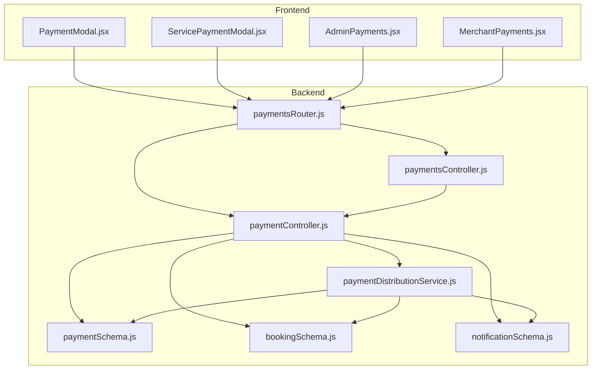
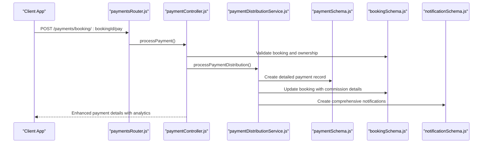
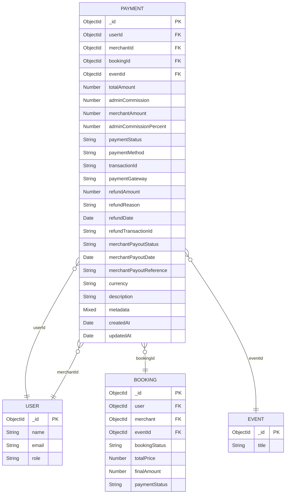
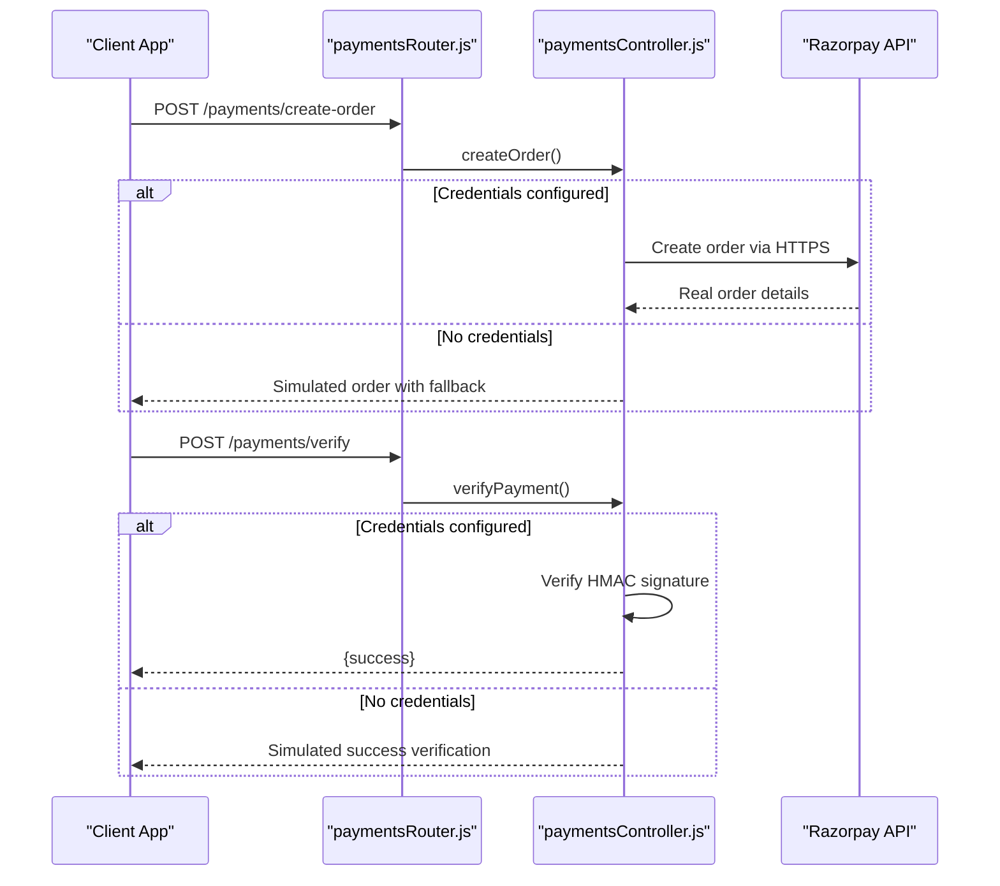
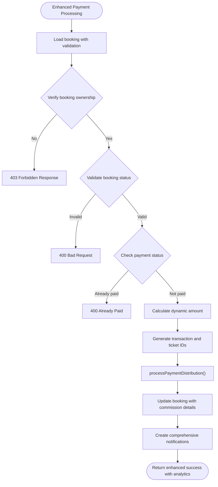
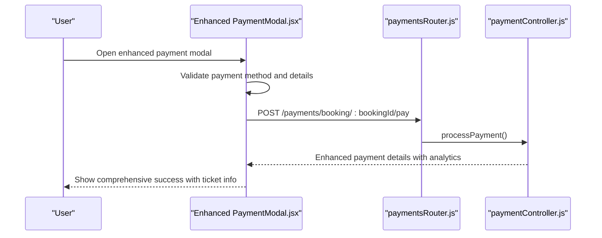
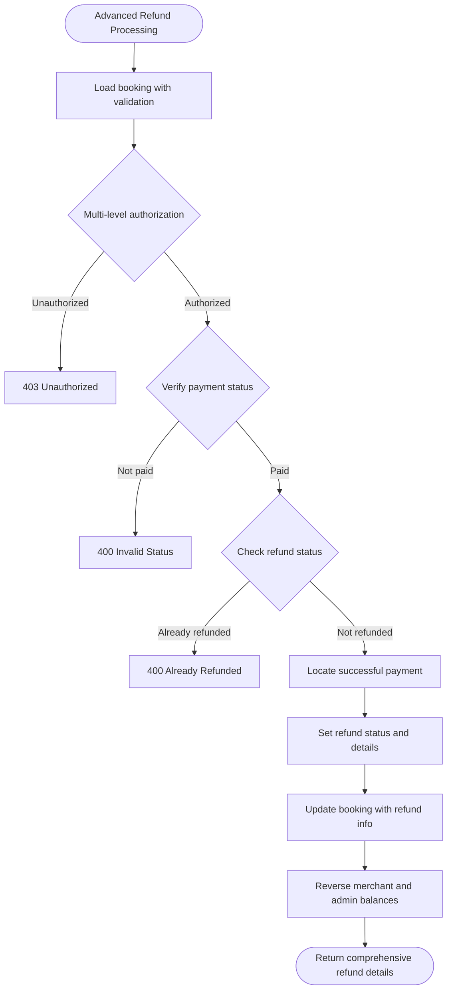
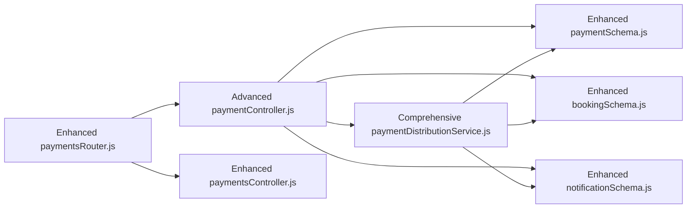

# Payment Processing System

<cite>
**Referenced Files in This Document**
- [paymentSchema.js](file://backend/models/paymentSchema.js)
- [paymentController.js](file://backend/controller/paymentController.js)
- [paymentsController.js](file://backend/controller/paymentsController.js)
- [paymentsRouter.js](file://backend/router/paymentsRouter.js)
- [paymentDistributionService.js](file://backend/services/paymentDistributionService.js)
- [bookingSchema.js](file://backend/models/bookingSchema.js)
- [notificationSchema.js](file://backend/models/notificationSchema.js)
- [PaymentModal.jsx](file://frontend/src/components/PaymentModal.jsx)
- [ServicePaymentModal.jsx](file://frontend/src/components/ServicePaymentModal.jsx)
- [AdminPayments.jsx](file://frontend/src/pages/dashboards/AdminPayments.jsx)
- [MerchantPayments.jsx](file://frontend/src/pages/dashboards/MerchantPayments.jsx)
</cite>

## Update Summary
**Changes Made**
- Enhanced payment distribution service with comprehensive analytics capabilities
- Added advanced payment flows for both direct and merchant-managed payment processing
- Implemented sophisticated payment statistics and merchant earnings reporting
- Updated payment modal implementations with improved user experience
- Expanded admin and merchant dashboard analytics with detailed payment insights

## Table of Contents
1. [Introduction](#introduction)
2. [Project Structure](#project-structure)
3. [Core Components](#core-components)
4. [Architecture Overview](#architecture-overview)
5. [Detailed Component Analysis](#detailed-component-analysis)
6. [Advanced Payment Analytics](#advanced-payment-analytics)
7. [Enhanced Payment Distribution](#enhanced-payment-distribution)
8. [Multi-Flow Payment Processing](#multi-flow-payment-processing)
9. [Dependency Analysis](#dependency-analysis)
10. [Performance Considerations](#performance-considerations)
11. [Troubleshooting Guide](#troubleshooting-guide)
12. [Conclusion](#conclusion)

## Introduction
This document provides comprehensive documentation for the enhanced payment processing system component. The system now features advanced payment distribution capabilities, sophisticated analytics, and comprehensive payment flows supporting both direct and merchant-managed payment processing. It explains payment gateway integration, transaction handling, payment confirmation workflows, and advanced payment analytics with detailed reporting for administrators and merchants.

## Project Structure
The payment system spans backend models/controllers/services, frontend modals, and admin/merchant dashboards with enhanced analytics capabilities. Key areas include:
- Backend models defining payment, booking, and notification schemas with advanced indexing
- Controllers implementing comprehensive payment workflows and detailed analytics
- Services encapsulating distribution logic, refund processing, and advanced statistical analysis
- Frontend modals providing enhanced secure payment UI for different booking types
- Admin and merchant dashboards presenting comprehensive payment analytics and earnings insights

**Diagram sources**
- [paymentsRouter.js:1-44](file://backend/router/paymentsRouter.js#L1-L44)
- [paymentController.js:1-577](file://backend/controller/paymentController.js#L1-L577)
- [paymentsController.js:1-281](file://backend/controller/paymentsController.js#L1-L281)
- [paymentDistributionService.js:1-340](file://backend/services/paymentDistributionService.js#L1-L340)
- [paymentSchema.js:1-142](file://backend/models/paymentSchema.js#L1-L142)
- [bookingSchema.js:1-118](file://backend/models/bookingSchema.js#L1-L118)
- [notificationSchema.js:1-36](file://backend/models/notificationSchema.js#L1-L36)
- [PaymentModal.jsx:1-364](file://frontend/src/components/PaymentModal.jsx#L1-L364)
- [ServicePaymentModal.jsx:1-246](file://frontend/src/components/ServicePaymentModal.jsx#L1-L246)
- [AdminPayments.jsx:1-131](file://frontend/src/pages/dashboards/AdminPayments.jsx#L1-L131)
- [MerchantPayments.jsx:1-123](file://frontend/src/pages/dashboards/MerchantPayments.jsx#L1-L123)

**Section sources**
- [paymentsRouter.js:1-44](file://backend/router/paymentsRouter.js#L1-L44)
- [paymentController.js:1-577](file://backend/controller/paymentController.js#L1-L577)
- [paymentsController.js:1-281](file://backend/controller/paymentsController.js#L1-L281)
- [paymentDistributionService.js:1-340](file://backend/services/paymentDistributionService.js#L1-L340)
- [paymentSchema.js:1-142](file://backend/models/paymentSchema.js#L1-L142)
- [bookingSchema.js:1-118](file://backend/models/bookingSchema.js#L1-L118)
- [notificationSchema.js:1-36](file://backend/models/notificationSchema.js#L1-L36)
- [PaymentModal.jsx:1-364](file://frontend/src/components/PaymentModal.jsx#L1-L364)
- [ServicePaymentModal.jsx:1-246](file://frontend/src/components/ServicePaymentModal.jsx#L1-L246)
- [AdminPayments.jsx:1-131](file://frontend/src/pages/dashboards/AdminPayments.jsx#L1-L131)
- [MerchantPayments.jsx:1-123](file://frontend/src/pages/dashboards/MerchantPayments.jsx#L1-L123)

## Core Components
- **Enhanced Payment Schema**: Defines comprehensive transaction fields, payment status tracking, multiple payment methods, refund details, payout tracking, and advanced analytics metadata with optimized indexing
- **Advanced Payment Controllers**: Implement sophisticated payment processing workflows, detailed analytics, merchant earnings reporting, and comprehensive payment statistics
- **Comprehensive Payment Services**: Encapsulate advanced commission distribution, intelligent refund processing, detailed analytics aggregation, and merchant earnings computation
- **Enhanced Payment Modals**: Provide improved secure UI experiences for different booking types with better user feedback and state management
- **Advanced Admin/Merchant Dashboards**: Present comprehensive payment analytics, detailed statistics, earnings summaries, and real-time transaction insights

**Section sources**
- [paymentSchema.js:1-142](file://backend/models/paymentSchema.js#L1-L142)
- [paymentController.js:1-577](file://backend/controller/paymentController.js#L1-L577)
- [paymentsController.js:1-281](file://backend/controller/paymentsController.js#L1-L281)
- [paymentDistributionService.js:1-340](file://backend/services/paymentDistributionService.js#L1-L340)
- [PaymentModal.jsx:1-364](file://frontend/src/components/PaymentModal.jsx#L1-L364)
- [ServicePaymentModal.jsx:1-246](file://frontend/src/components/ServicePaymentModal.jsx#L1-L246)
- [AdminPayments.jsx:1-131](file://frontend/src/pages/dashboards/AdminPayments.jsx#L1-L131)
- [MerchantPayments.jsx:1-123](file://frontend/src/pages/dashboards/MerchantPayments.jsx#L1-L123)

## Architecture Overview
The system now supports three primary payment flows with enhanced analytics:
- **Direct Payment Flow**: Manual payment processing via booking payment controller with comprehensive distribution service
- **Razorpay Integration**: Advanced order creation and signature verification with fallback simulation
- **Service Payment Flow**: Specialized payment processing for full-service events with merchant-managed workflows

**Diagram sources**
- [paymentsRouter.js:28-28](file://backend/router/paymentsRouter.js#L28-L28)
- [paymentController.js:11-141](file://backend/controller/paymentController.js#L11-L141)
- [paymentDistributionService.js:33-159](file://backend/services/paymentDistributionService.js#L33-L159)
- [paymentSchema.js:1-142](file://backend/models/paymentSchema.js#L1-L142)
- [bookingSchema.js:1-118](file://backend/models/bookingSchema.js#L1-L118)
- [notificationSchema.js:1-36](file://backend/models/notificationSchema.js#L1-L36)

## Detailed Component Analysis

### Enhanced Payment Schema Design
The payment schema now includes comprehensive transaction details, advanced status tracking, multiple payment methods, detailed analytics, and optimized performance features. It encompasses:
- **Identity Fields**: userId, merchantId, bookingId, eventId with proper MongoDB references
- **Advanced Amount Management**: totalAmount, adminCommission, merchantAmount, adminCommissionPercent with validation
- **Comprehensive Status Tracking**: paymentStatus (pending, success, failed, refunded), merchantPayout tracking
- **Detailed Payment Information**: paymentMethod (UPI, Card, NetBanking, Cash, Wallet), transactionId, paymentGateway
- **Refund and Payout Management**: Complete refund tracking, merchant payout status and references
- **Advanced Analytics Metadata**: Currency, description, metadata for comprehensive reporting
- **Performance Optimization**: Comprehensive indexes on user, merchant, booking, transactionId, status for optimal query performance

**Diagram sources**
- [paymentSchema.js:3-109](file://backend/models/paymentSchema.js#L3-L109)
- [bookingSchema.js:3-118](file://backend/models/bookingSchema.js#L3-L118)

**Section sources**
- [paymentSchema.js:1-142](file://backend/models/paymentSchema.js#L1-L142)

### Advanced Payment Gateway Integration
The system now features enhanced payment gateway integration with comprehensive fallback mechanisms:
- **Razorpay Integration**: Advanced order creation with automatic credential detection and fallback simulation
- **Signature Verification**: Robust HMAC-SHA256 verification without external dependencies
- **Multi-Method Support**: Comprehensive payment method support including UPI, Card, NetBanking, Cash, Wallet
- **Fallback Simulation**: Seamless development experience with simulated orders when credentials are unavailable

**Diagram sources**
- [paymentsController.js:8-106](file://backend/controller/paymentsController.js#L8-L106)
- [paymentsRouter.js:18-19](file://backend/router/paymentsRouter.js#L18-L19)

**Section sources**
- [paymentsController.js:1-281](file://backend/controller/paymentsController.js#L1-L281)
- [paymentsRouter.js:1-44](file://backend/router/paymentsRouter.js#L1-L44)

### Enhanced Transaction Handling and Payment Confirmation
The system now implements sophisticated transaction handling with comprehensive validation and enhanced user feedback:
- **Multi-Step Validation**: Comprehensive booking ownership verification, status validation, and duplicate payment prevention
- **Advanced Amount Processing**: Dynamic amount calculation using finalAmount or totalPrice with validation
- **Enhanced Distribution Logic**: Intelligent commission calculation with 5% admin commission and merchant amount distribution
- **Comprehensive Notification System**: Automated notifications for users and merchants with detailed transaction information
- **Ticket Generation**: Automatic ticket creation and management for successful payments

**Diagram sources**
- [paymentController.js:11-141](file://backend/controller/paymentController.js#L11-L141)
- [paymentDistributionService.js:33-159](file://backend/services/paymentDistributionService.js#L33-L159)

**Section sources**
- [paymentController.js:1-577](file://backend/controller/paymentController.js#L1-L577)
- [paymentDistributionService.js:1-340](file://backend/services/paymentDistributionService.js#L1-L340)

### Enhanced Payment Modal Implementation
The frontend payment modals have been significantly improved with better user experience and comprehensive validation:
- **PaymentModal.jsx**: Enhanced ticketed booking payment with improved form validation, better error handling, and comprehensive user feedback
- **ServicePaymentModal.jsx**: Advanced service booking payment with multi-step processing, detailed service information display, and enhanced security indicators
- **Improved User Experience**: Better loading states, enhanced error messaging, and more intuitive payment method selection
- **Security Features**: SSL encryption indicators, secure payment processing simulation, and comprehensive input validation

**Diagram sources**
- [PaymentModal.jsx:21-62](file://frontend/src/components/PaymentModal.jsx#L21-L62)
- [paymentsRouter.js:28-28](file://backend/router/paymentsRouter.js#L28-L28)
- [paymentController.js:11-141](file://backend/controller/paymentController.js#L11-L141)

**Section sources**
- [PaymentModal.jsx:1-364](file://frontend/src/components/PaymentModal.jsx#L1-L364)
- [ServicePaymentModal.jsx:1-246](file://frontend/src/components/ServicePaymentModal.jsx#L1-L246)

### Advanced Payment Validation
The system now implements comprehensive validation with enhanced security measures:
- **Multi-Level Validation**: Booking ownership verification, status validation, amount verification, and duplicate payment prevention
- **Dynamic Amount Processing**: Intelligent amount calculation using finalAmount or totalPrice with validation
- **Enhanced Distribution Validation**: Pre-save middleware ensuring amount consistency and preventing invalid states
- **Comprehensive Error Handling**: Detailed error messages for different validation failure scenarios

**Section sources**
- [paymentController.js:23-64](file://backend/controller/paymentController.js#L23-L64)
- [paymentDistributionService.js:58-66](file://backend/services/paymentDistributionService.js#L58-L66)
- [paymentSchema.js:129-140](file://backend/models/paymentSchema.js#L129-L140)

### Enhanced Refund Processing
The refund system now includes comprehensive processing with detailed analytics:
- **Advanced Authorization**: Multi-level authorization checking for booking owners and administrators
- **Intelligent Validation**: Comprehensive booking status verification and duplicate refund prevention
- **Reversible Distribution**: Complete reversal of payment status, amount calculations, and merchant/admin balance adjustments
- **Detailed Refund Tracking**: Complete refund transaction ID generation and detailed audit trail

**Diagram sources**
- [paymentController.js:222-315](file://backend/controller/paymentController.js#L222-L315)
- [paymentDistributionService.js:167-251](file://backend/services/paymentDistributionService.js#L167-L251)

**Section sources**
- [paymentController.js:221-315](file://backend/controller/paymentController.js#L221-L315)
- [paymentDistributionService.js:161-251](file://backend/services/paymentDistributionService.js#L161-L251)

### Enhanced Payment Security Measures
The system now implements comprehensive security measures:
- **Advanced Razorpay Integration**: Optional integration with robust signature verification using HMAC-SHA256
- **Development Fallback**: Seamless simulation of payment flows when credentials are unavailable
- **Enhanced Frontend Security**: Improved SSL indicators, secure payment processing simulation, and comprehensive input validation
- **Authentication Middleware**: Comprehensive protection for all payment-related endpoints

**Section sources**
- [paymentsController.js:5-106](file://backend/controller/paymentsController.js#L5-L106)
- [PaymentModal.jsx:314-329](file://frontend/src/components/PaymentModal.jsx#L314-L329)
- [paymentsRouter.js:12-13](file://backend/router/paymentsRouter.js#L12-L13)

### Enhanced Payment Status Tracking and Notification Integration
The system now provides comprehensive status tracking with detailed notifications:
- **Advanced Status Tracking**: Comprehensive payment status tracking (pending, success, failed, refunded) with merchant payout status
- **Detailed Analytics**: Enhanced payment analytics with commission tracking, merchant payout monitoring, and transaction insights
- **Comprehensive Notifications**: Automated notifications for users and merchants with detailed transaction information and status updates

**Section sources**
- [paymentSchema.js:48-89](file://backend/models/paymentSchema.js#L48-L89)
- [paymentController.js:89-113](file://backend/controller/paymentController.js#L89-L113)
- [paymentController.js:269-293](file://backend/controller/paymentController.js#L269-L293)
- [notificationSchema.js:1-36](file://backend/models/notificationSchema.js#L1-L36)

## Advanced Payment Analytics
The system now provides comprehensive payment analytics with detailed insights for administrators and merchants:

### Admin Payment Statistics
Administrators can access detailed payment analytics including:
- **Revenue Tracking**: Total revenue, commission earned, merchant payouts, and transaction counts
- **Performance Metrics**: Average transaction values, refund statistics, and monthly trends
- **Comprehensive Reporting**: Real-time payment insights with filtering and pagination capabilities

### Merchant Earnings Analytics
Merchants receive detailed earnings reports with:
- **Earnings Summary**: Total earnings, transaction counts, and average earnings per transaction
- **Wallet Management**: Current wallet balance and lifetime earnings tracking
- **Monthly Insights**: Detailed monthly earnings trends and transaction patterns

**Section sources**
- [paymentController.js:317-399](file://backend/controller/paymentController.js#L317-L399)
- [paymentController.js:401-517](file://backend/controller/paymentController.js#L401-L517)
- [paymentDistributionService.js:257-340](file://backend/services/paymentDistributionService.js#L257-L340)
- [AdminPayments.jsx:14-72](file://frontend/src/pages/dashboards/AdminPayments.jsx#L14-L72)
- [MerchantPayments.jsx:15-74](file://frontend/src/pages/dashboards/MerchantPayments.jsx#L15-L74)

## Enhanced Payment Distribution
The payment distribution system has been significantly enhanced with comprehensive analytics and improved processing:

### Advanced Distribution Logic
The system now implements sophisticated distribution with:
- **Intelligent Commission Calculation**: 5% admin commission with precise merchant amount distribution
- **Duplicate Prevention**: Comprehensive duplicate payment detection and prevention
- **Real-time Updates**: Instant merchant wallet updates and admin commission tracking
- **Audit Trail**: Complete payment distribution logging with detailed transaction records

### Comprehensive Analytics Integration
The distribution service now provides:
- **Payment Statistics**: Real-time revenue, commission, and payout tracking
- **Merchant Earnings**: Detailed merchant earnings computation and reporting
- **Performance Monitoring**: Distribution performance metrics and optimization insights

**Section sources**
- [paymentDistributionService.js:1-340](file://backend/services/paymentDistributionService.js#L1-L340)

## Multi-Flow Payment Processing
The system now supports three distinct payment processing flows:

### Direct Payment Flow
Traditional manual payment processing with comprehensive distribution:
- **Booking Validation**: Complete booking ownership and status verification
- **Amount Processing**: Dynamic amount calculation and validation
- **Distribution Processing**: Intelligent commission distribution and merchant updates

### Service Payment Flow
Specialized payment processing for full-service events:
- **Merchant Approval Required**: Payment only accepted after merchant confirmation
- **Simplified Processing**: Streamlined payment workflow without complex distribution
- **Automatic Status Updates**: Direct booking status updates upon payment

### Ticketed Payment Flow
Automated payment processing for ticketed events:
- **Instant Completion**: Automatic booking completion without merchant approval
- **Ticket Generation**: Immediate ticket creation and management
- **Simplified Workflow**: Straightforward payment-to-completion process

**Section sources**
- [paymentController.js:11-141](file://backend/controller/paymentController.js#L11-L141)
- [paymentsController.js:108-281](file://backend/controller/paymentsController.js#L108-L281)

## Dependency Analysis
The enhanced payment system maintains clear separation of concerns with improved modularity:
- **Router Layer**: Enhanced routing with comprehensive endpoint coverage for all payment flows
- **Controller Layer**: Sophisticated orchestration with advanced analytics and validation
- **Service Layer**: Comprehensive business logic encapsulation with detailed analytics
- **Model Layer**: Optimized data structures with advanced indexing and validation
- **Frontend Integration**: Enhanced user interfaces with comprehensive payment experiences

**Diagram sources**
- [paymentsRouter.js:1-44](file://backend/router/paymentsRouter.js#L1-L44)
- [paymentController.js:1-577](file://backend/controller/paymentController.js#L1-L577)
- [paymentsController.js:1-281](file://backend/controller/paymentsController.js#L1-L281)
- [paymentDistributionService.js:1-340](file://backend/services/paymentDistributionService.js#L1-L340)
- [paymentSchema.js:1-142](file://backend/models/paymentSchema.js#L1-L142)
- [bookingSchema.js:1-118](file://backend/models/bookingSchema.js#L1-L118)
- [notificationSchema.js:1-36](file://backend/models/notificationSchema.js#L1-L36)

**Section sources**
- [paymentsRouter.js:1-44](file://backend/router/paymentsRouter.js#L1-L44)
- [paymentController.js:1-577](file://backend/controller/paymentController.js#L1-L577)
- [paymentDistributionService.js:1-340](file://backend/services/paymentDistributionService.js#L1-L340)

## Performance Considerations
The enhanced payment system includes several performance optimizations:
- **Advanced Indexing**: Comprehensive indexes on Payment model (user, merchant, booking, transactionId, status) for optimal query performance
- **Aggregation Optimization**: Efficient statistical calculations using MongoDB aggregation framework
- **Pre-save Validation**: Client-side validation reduces unnecessary server requests and improves user experience
- **Asynchronous Notifications**: Non-blocking notification system with error handling for high-volume scenarios
- **Pagination Support**: Efficient pagination for admin payment listings and merchant earnings reports

## Troubleshooting Guide
Enhanced troubleshooting for the comprehensive payment system:
- **Payment Amount Mismatches**: Verify finalAmount or totalPrice matches paymentAmount; check for coupon discounts and tax calculations
- **Duplicate Payment Attempts**: Distribution service prevents duplicate payments; check transactionId uniqueness
- **Authorization Issues**: Controllers enforce multi-level authorization (booking owner, merchant, admin) with detailed error messages
- **Razorpay Integration Problems**: Verify credentials configuration and signature verification; use fallback simulation for development
- **Refund Processing Errors**: Ensure booking is paid, not already refunded, and has successful payment record
- **Analytics Data Issues**: Check aggregation pipeline permissions and data consistency for payment statistics

**Section sources**
- [paymentController.js:56-64](file://backend/controller/paymentController.js#L56-L64)
- [paymentDistributionService.js:58-66](file://backend/services/paymentDistributionService.js#L58-L66)
- [paymentController.js:239-245](file://backend/controller/paymentController.js#L239-L245)
- [paymentsController.js:93-105](file://backend/controller/paymentsController.js#L93-L105)
- [paymentController.js:255-261](file://backend/controller/paymentController.js#L255-L261)

## Conclusion
The enhanced payment processing system provides comprehensive, secure, and highly scalable payment solutions with advanced analytics capabilities. The system now supports sophisticated multi-flow payment processing, comprehensive distribution logic, detailed analytics for administrators and merchants, and enhanced user experiences across all payment modalities. With its modular architecture, extensive validation, and comprehensive reporting features, the system delivers robust payment processing capabilities suitable for enterprise-scale event management platforms.