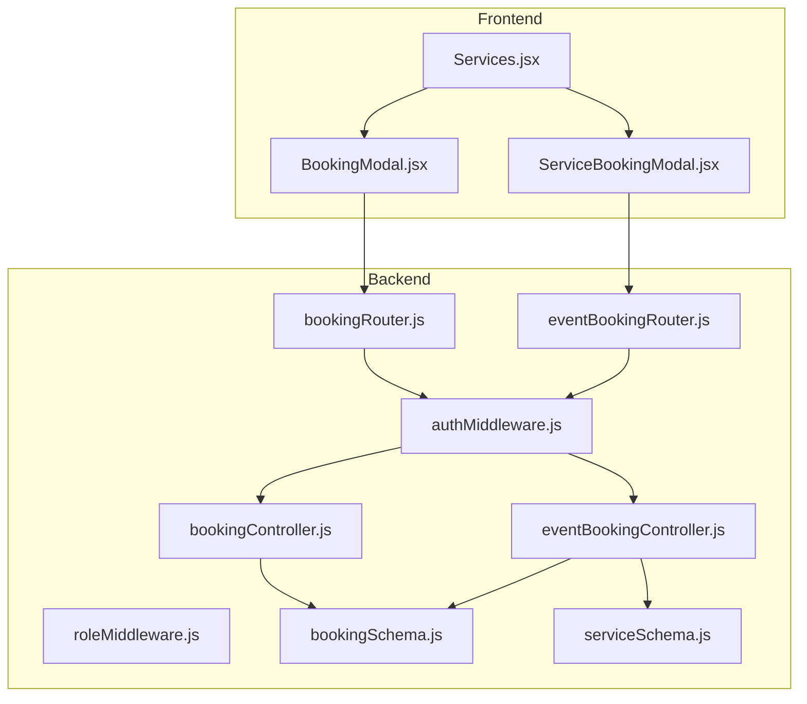
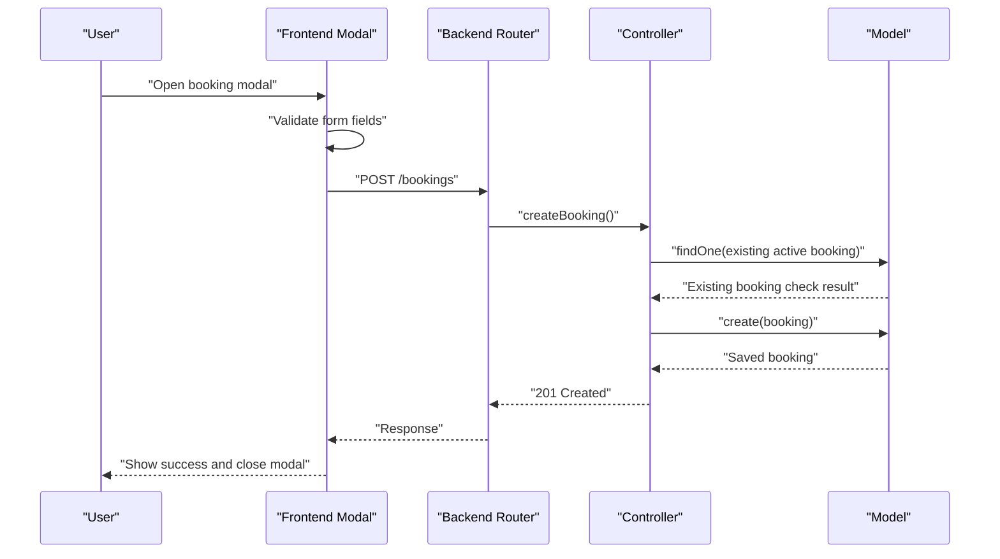
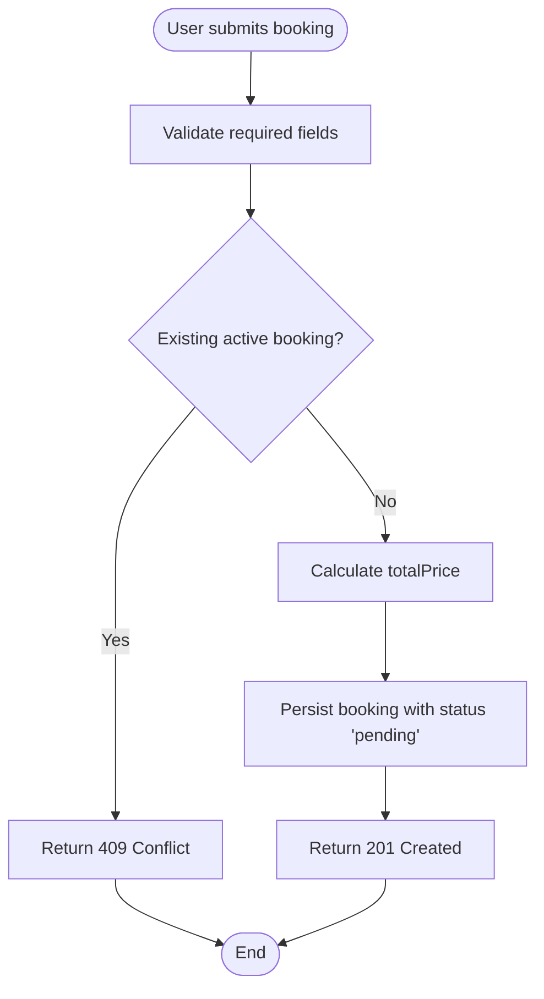
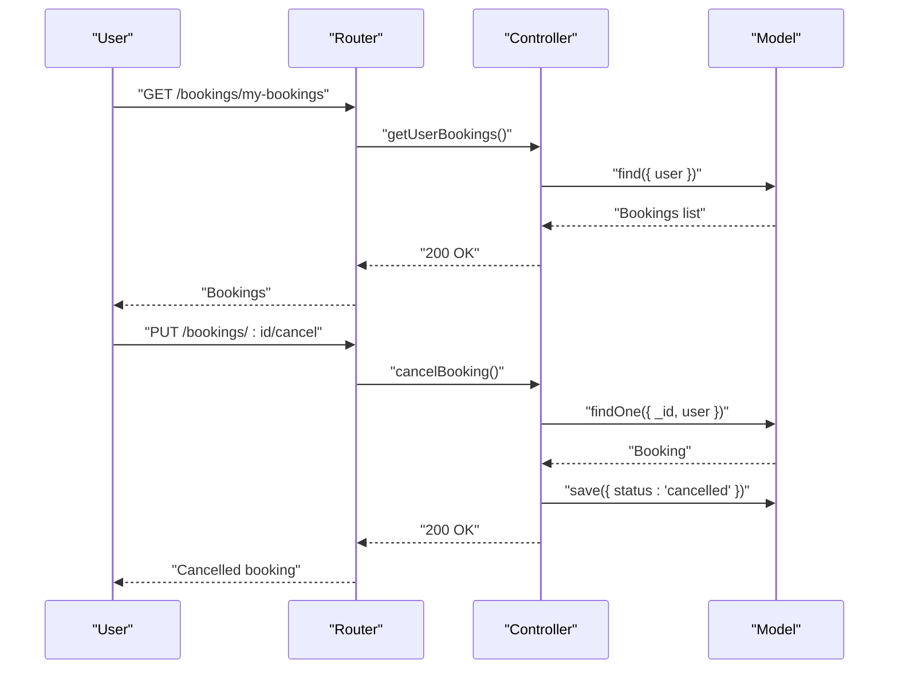
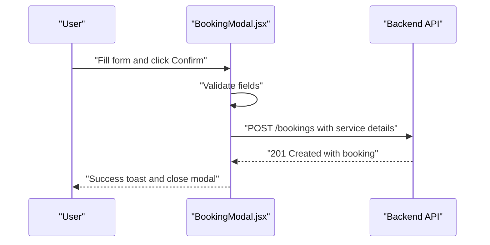
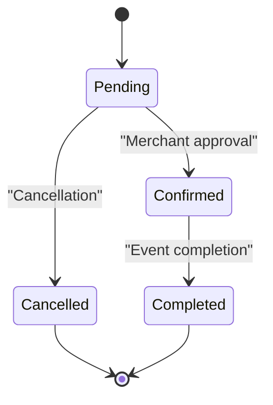
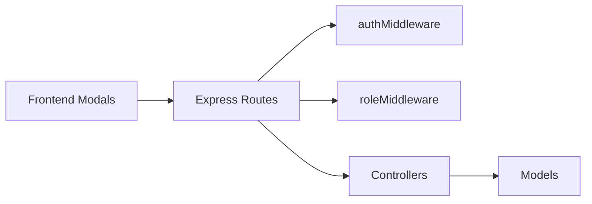

# Service Booking System

<cite>
**Referenced Files in This Document**
- [bookingSchema.js](file://backend/models/bookingSchema.js)
- [bookingController.js](file://backend/controller/bookingController.js)
- [bookingRouter.js](file://backend/router/bookingRouter.js)
- [eventBookingController.js](file://backend/controller/eventBookingController.js)
- [eventBookingRouter.js](file://backend/router/eventBookingRouter.js)
- [serviceSchema.js](file://backend/models/serviceSchema.js)
- [authMiddleware.js](file://backend/middleware/authMiddleware.js)
- [roleMiddleware.js](file://backend/middleware/roleMiddleware.js)
- [BookingModal.jsx](file://frontend/src/components/BookingModal.jsx)
- [ServiceBookingModal.jsx](file://frontend/src/components/ServiceBookingModal.jsx)
- [Services.jsx](file://frontend/src/components/Services.jsx)
- [test-complete-booking-workflow.js](file://backend/test-complete-booking-workflow.js)
</cite>

## Table of Contents
1. [Introduction](#introduction)
2. [Project Structure](#project-structure)
3. [Core Components](#core-components)
4. [Architecture Overview](#architecture-overview)
5. [Detailed Component Analysis](#detailed-component-analysis)
6. [Dependency Analysis](#dependency-analysis)
7. [Performance Considerations](#performance-considerations)
8. [Troubleshooting Guide](#troubleshooting-guide)
9. [Conclusion](#conclusion)

## Introduction
This document describes the service booking system component, focusing on the service-based booking workflow for standalone services. It covers booking creation, validation, management, schema design, modal implementation, form validation, user interactions, API endpoints, parameter validation, error handling, status management, user-specific retrieval, cancellation processes, capacity management, duplicate booking prevention, and confirmation workflows.

## Project Structure
The service booking system spans backend models/controllers/routers and frontend modals/components. The backend handles authentication, role-based access, booking persistence, and business logic. The frontend provides user-facing modals for booking input and submission.

**Diagram sources**
- [bookingRouter.js:1-26](file://backend/router/bookingRouter.js#L1-L26)
- [eventBookingRouter.js:1-47](file://backend/router/eventBookingRouter.js#L1-L47)
- [bookingController.js:1-233](file://backend/controller/bookingController.js#L1-L233)
- [eventBookingController.js:1-800](file://backend/controller/eventBookingController.js#L1-L800)
- [bookingSchema.js:1-53](file://backend/models/bookingSchema.js#L1-L53)
- [serviceSchema.js:1-83](file://backend/models/serviceSchema.js#L1-L83)
- [authMiddleware.js:1-17](file://backend/middleware/authMiddleware.js#L1-L17)
- [roleMiddleware.js:1-9](file://backend/middleware/roleMiddleware.js#L1-L9)
- [ServiceBookingModal.jsx:1-440](file://frontend/src/components/ServiceBookingModal.jsx#L1-L440)
- [BookingModal.jsx:1-317](file://frontend/src/components/BookingModal.jsx#L1-L317)
- [Services.jsx:1-104](file://frontend/src/components/Services.jsx#L1-L104)

**Section sources**
- [bookingRouter.js:1-26](file://backend/router/bookingRouter.js#L1-L26)
- [bookingController.js:1-233](file://backend/controller/bookingController.js#L1-L233)
- [bookingSchema.js:1-53](file://backend/models/bookingSchema.js#L1-L53)
- [ServiceBookingModal.jsx:1-440](file://frontend/src/components/ServiceBookingModal.jsx#L1-L440)
- [BookingModal.jsx:1-317](file://frontend/src/components/BookingModal.jsx#L1-L317)
- [Services.jsx:1-104](file://frontend/src/components/Services.jsx#L1-L104)

## Core Components
- Backend booking model defines service booking fields including user reference, service identifiers, pricing, dates, guest count, and status.
- Controllers implement booking creation, retrieval, cancellation, and administrative status updates with validation and error handling.
- Routers define endpoints for user and admin operations with middleware for authentication and role checks.
- Frontend modals capture booking inputs, validate locally, and submit to backend APIs.

Key capabilities:
- Duplicate prevention for active bookings per user and service.
- Pricing calculation based on guest count.
- Status lifecycle management (pending, confirmed, cancelled, completed).
- User-specific retrieval and admin oversight.

**Section sources**
- [bookingSchema.js:1-53](file://backend/models/bookingSchema.js#L1-L53)
- [bookingController.js:1-233](file://backend/controller/bookingController.js#L1-L233)
- [bookingRouter.js:1-26](file://backend/router/bookingRouter.js#L1-L26)
- [authMiddleware.js:1-17](file://backend/middleware/authMiddleware.js#L1-L17)
- [roleMiddleware.js:1-9](file://backend/middleware/roleMiddleware.js#L1-L9)
- [BookingModal.jsx:1-317](file://frontend/src/components/BookingModal.jsx#L1-L317)
- [ServiceBookingModal.jsx:1-440](file://frontend/src/components/ServiceBookingModal.jsx#L1-L440)

## Architecture Overview
The system follows a layered architecture:
- Presentation layer: React modals collect user input and trigger API calls.
- API layer: Express routers expose endpoints protected by authentication and role middleware.
- Business logic layer: Controllers validate inputs, enforce business rules, and manage persistence.
- Data layer: Mongoose models define schemas and indexes.

**Diagram sources**
- [bookingRouter.js:15-19](file://backend/router/bookingRouter.js#L15-L19)
- [bookingController.js:4-70](file://backend/controller/bookingController.js#L4-L70)
- [bookingSchema.js:1-53](file://backend/models/bookingSchema.js#L1-L53)
- [BookingModal.jsx:17-61](file://frontend/src/components/BookingModal.jsx#L17-L61)

## Detailed Component Analysis

### Booking Schema Design
The booking schema captures essential fields for service bookings:
- Identity: user reference, service identifiers (serviceId, serviceTitle, serviceCategory).
- Pricing: servicePrice, guestCount, totalPrice.
- Dates: bookingDate, eventDate.
- Details: notes.
- Status: status with enum values pending, confirmed, cancelled, completed.
- Timestamps: automatic createdAt/updatedAt via timestamps option.

Complexity considerations:
- Indexing: consider adding compound indexes on user+serviceId+status for efficient duplicate detection queries.
- Validation: required fields ensure data integrity at persistence level.

**Section sources**
- [bookingSchema.js:3-50](file://backend/models/bookingSchema.js#L3-L50)

### Booking Creation Workflow
End-to-end flow:
- Frontend modal collects serviceDate, guestCount, notes, and service metadata.
- Controller validates presence of required service details.
- Duplicate prevention checks for existing pending/confirmed bookings for the same user and service.
- Calculates totalPrice based on guestCount.
- Creates booking with status pending and returns success response.

**Diagram sources**
- [bookingController.js:18-56](file://backend/controller/bookingController.js#L18-L56)
- [BookingModal.jsx:17-61](file://frontend/src/components/BookingModal.jsx#L17-L61)

**Section sources**
- [bookingController.js:4-70](file://backend/controller/bookingController.js#L4-L70)
- [BookingModal.jsx:17-61](file://frontend/src/components/BookingModal.jsx#L17-L61)

### Booking Retrieval and Management
- User-specific retrieval: fetch all bookings for the authenticated user, sorted by creation time.
- Single booking lookup: retrieve a specific booking owned by the user.
- Cancellation: prevent cancellation of already-cancelled or completed bookings; set status to cancelled.
- Administrative oversight: fetch all bookings and update status with strict validation.

**Diagram sources**
- [bookingRouter.js:17-19](file://backend/router/bookingRouter.js#L17-L19)
- [bookingController.js:72-171](file://backend/controller/bookingController.js#L72-L171)

**Section sources**
- [bookingRouter.js:15-23](file://backend/router/bookingRouter.js#L15-L23)
- [bookingController.js:72-191](file://backend/controller/bookingController.js#L72-L191)

### API Endpoints and Parameter Validation
- POST /bookings: creates a booking for a service; requires JWT and includes service metadata, eventDate, guestCount, notes.
- GET /bookings/my-bookings: retrieves user’s bookings.
- GET /bookings/:id: retrieves a specific booking by ID.
- PUT /bookings/:id/cancel: cancels a booking if eligible.
- Admin endpoints: GET /bookings/admin/all and PUT /bookings/admin/:id/status for status updates.

Validation highlights:
- Required fields: serviceId, serviceTitle, serviceCategory, servicePrice.
- Duplicate prevention: existing pending/confirmed booking check.
- Status validation: only specific values allowed for status updates.
- Authentication and roles enforced via middleware.

**Section sources**
- [bookingRouter.js:15-23](file://backend/router/bookingRouter.js#L15-L23)
- [bookingController.js:18-24](file://backend/controller/bookingController.js#L18-L24)
- [bookingController.js:199-205](file://backend/controller/bookingController.js#L199-L205)
- [authMiddleware.js:3-16](file://backend/middleware/authMiddleware.js#L3-L16)
- [roleMiddleware.js:1-9](file://backend/middleware/roleMiddleware.js#L1-L9)

### Frontend Booking Modal Implementation
The frontend provides two primary modals:
- BookingModal.jsx: for standalone service bookings. Captures eventDate, guestCount, notes, calculates total price, and posts to /bookings.
- ServiceBookingModal.jsx: for event-based full-service bookings. Handles coupon application, offers, and posts to event booking endpoints.

Key interactions:
- Local validation ensures required fields are present before submission.
- Uses auth headers for secure requests.
- Displays loading states and user feedback via toast notifications.
- Supports coupon offers and manual coupon code application.

**Diagram sources**
- [BookingModal.jsx:17-61](file://frontend/src/components/BookingModal.jsx#L17-L61)
- [bookingRouter.js:16-16](file://backend/router/bookingRouter.js#L16-L16)
- [bookingController.js:4-70](file://backend/controller/bookingController.js#L4-L70)

**Section sources**
- [BookingModal.jsx:1-317](file://frontend/src/components/BookingModal.jsx#L1-L317)
- [ServiceBookingModal.jsx:1-440](file://frontend/src/components/ServiceBookingModal.jsx#L1-L440)

### Capacity Management and Duplicate Prevention
- Duplicate booking prevention: prevents multiple active bookings (pending/confirmed) for the same user and service.
- Capacity management: while the service booking schema does not include explicit capacity fields, the event-based full-service booking controller demonstrates capacity checks and updates for ticketed events. For service bookings, capacity can be managed at the service level (e.g., serviceSchema) or via external mechanisms.

**Section sources**
- [bookingController.js:26-38](file://backend/controller/bookingController.js#L26-L38)
- [eventBookingController.js:377-391](file://backend/controller/eventBookingController.js#L377-L391)

### Booking Status Management and Confirmation Workflows
- Status lifecycle: pending → confirmed → completed; cancelled is terminal.
- Confirmation workflow: for event-based full-service bookings, merchant approval transitions status to confirmed; payment completion and event completion finalize the lifecycle.
- The standalone service booking controller sets status to pending upon creation.

**Diagram sources**
- [bookingController.js:55-56](file://backend/controller/bookingController.js#L55-L56)
- [eventBookingController.js:636-700](file://backend/controller/eventBookingController.js#L636-L700)
- [test-complete-booking-workflow.js:91-140](file://backend/test-complete-booking-workflow.js#L91-L140)

**Section sources**
- [bookingController.js:36-40](file://backend/controller/bookingController.js#L36-L40)
- [eventBookingController.js:636-700](file://backend/controller/eventBookingController.js#L636-L700)
- [test-complete-booking-workflow.js:91-140](file://backend/test-complete-booking-workflow.js#L91-L140)

### User-Specific Booking Retrieval and Cancellation
- User-specific retrieval: finds all bookings associated with the authenticated user ID.
- Cancellation rules: disallow cancelling already-cancelled or completed bookings; update status and persist.

**Section sources**
- [bookingController.js:72-91](file://backend/controller/bookingController.js#L72-L91)
- [bookingController.js:124-171](file://backend/controller/bookingController.js#L124-L171)

## Dependency Analysis
The booking system exhibits clear separation of concerns:
- Controllers depend on models for persistence and on middleware for security.
- Routers depend on controllers and middleware.
- Frontend modals depend on HTTP utilities and auth context.

**Diagram sources**
- [bookingRouter.js:1-26](file://backend/router/bookingRouter.js#L1-L26)
- [authMiddleware.js:1-17](file://backend/middleware/authMiddleware.js#L1-L17)
- [roleMiddleware.js:1-9](file://backend/middleware/roleMiddleware.js#L1-L9)
- [bookingController.js:1-233](file://backend/controller/bookingController.js#L1-L233)
- [bookingSchema.js:1-53](file://backend/models/bookingSchema.js#L1-L53)

**Section sources**
- [bookingRouter.js:1-26](file://backend/router/bookingRouter.js#L1-L26)
- [bookingController.js:1-233](file://backend/controller/bookingController.js#L1-L233)
- [bookingSchema.js:1-53](file://backend/models/bookingSchema.js#L1-L53)

## Performance Considerations
- Indexing: add compound indexes on user+serviceId+status to optimize duplicate detection and user-specific queries.
- Pagination: implement pagination for user and admin booking lists to avoid large result sets.
- Caching: cache frequently accessed service details to reduce repeated backend calls.
- Validation: keep client-side validation lightweight; rely on server-side validation for correctness.

## Troubleshooting Guide
Common issues and resolutions:
- Unauthorized access: ensure JWT is present and valid; verify role permissions for admin endpoints.
- Duplicate booking errors: inform users about existing active bookings and advise waiting or contacting support.
- Validation failures: check required fields and data types; ensure guestCount is positive.
- Cancellation errors: verify booking exists, is not already cancelled or completed, and belongs to the user.

**Section sources**
- [authMiddleware.js:7-15](file://backend/middleware/authMiddleware.js#L7-L15)
- [bookingController.js:18-24](file://backend/controller/bookingController.js#L18-L24)
- [bookingController.js:135-154](file://backend/controller/bookingController.js#L135-L154)

## Conclusion
The service booking system provides a robust foundation for service-based bookings with clear validation, duplicate prevention, and lifecycle management. The frontend modals offer intuitive user interactions, while the backend enforces security and business rules. Extending capacity management and enhancing indexing would further improve reliability and performance.