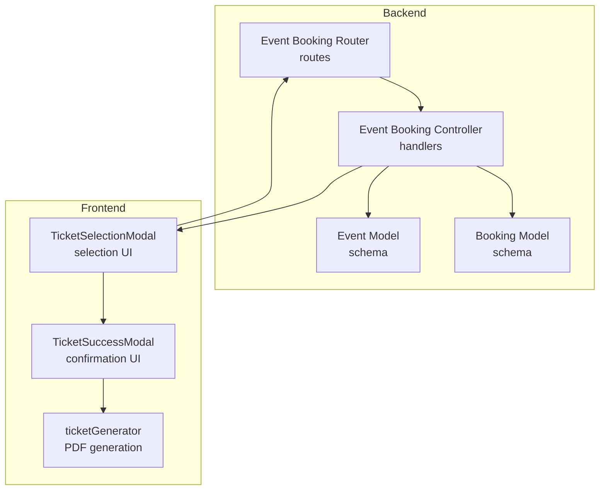
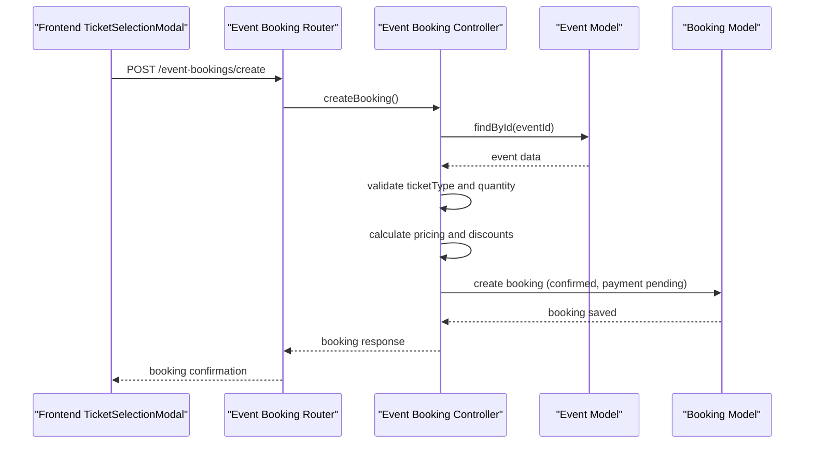
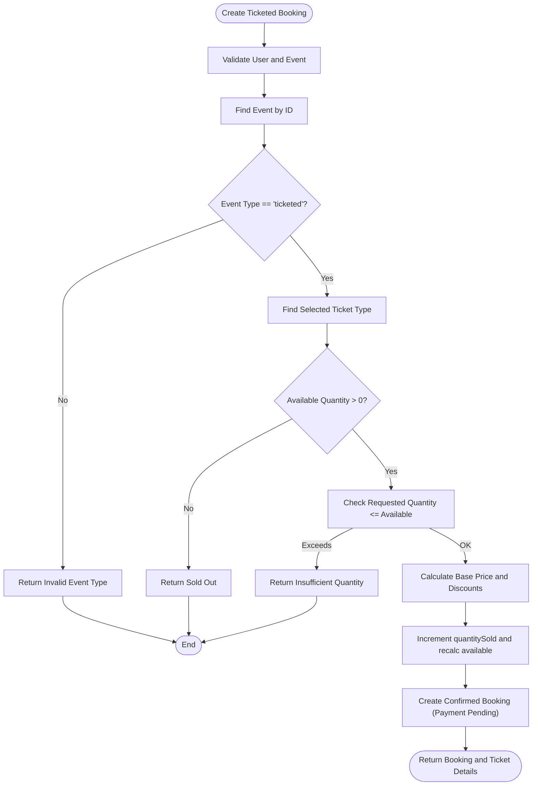
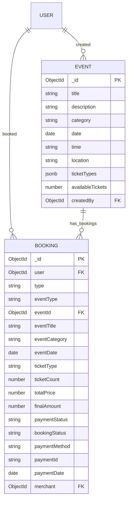
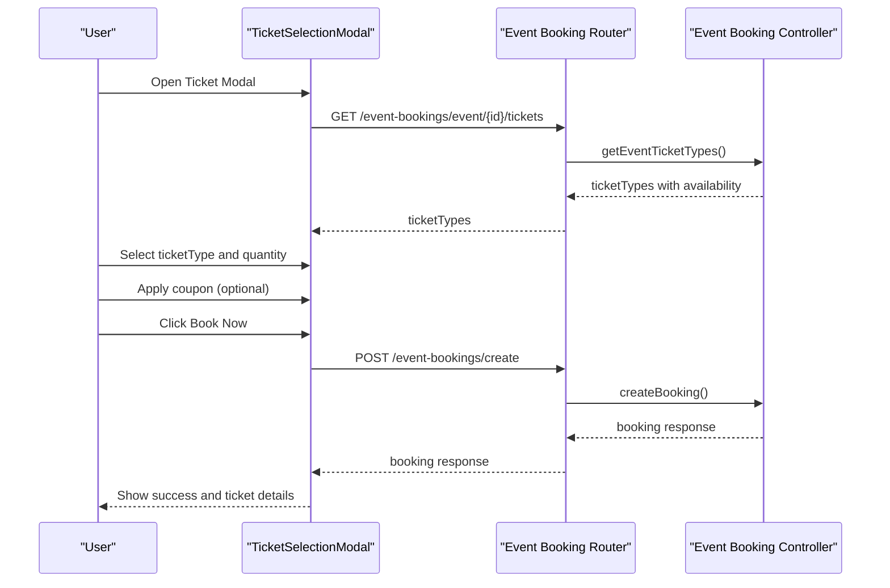
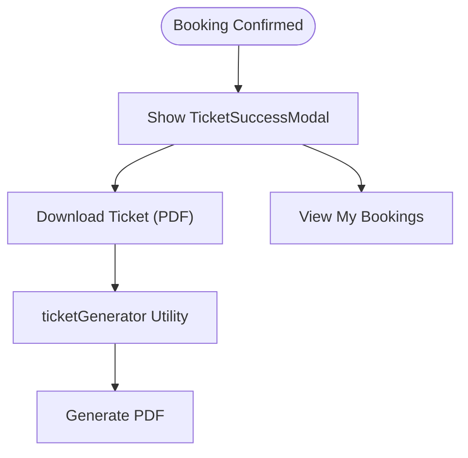
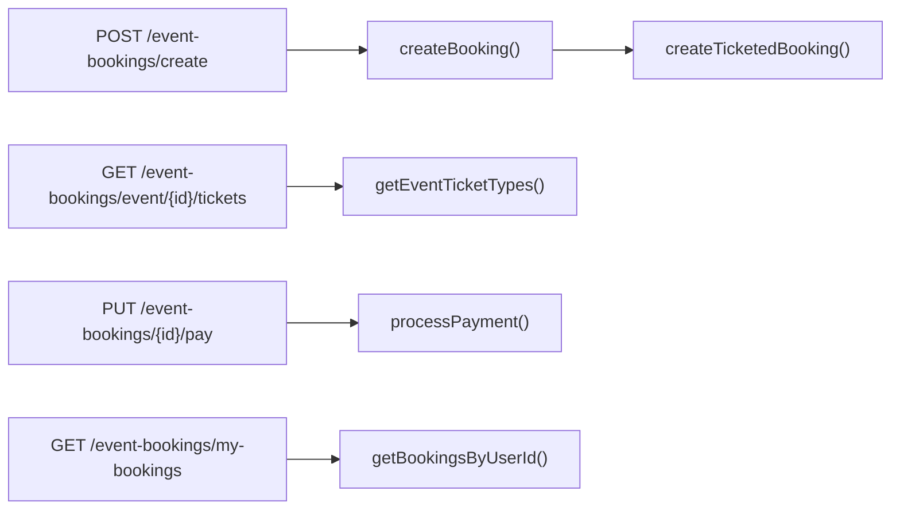
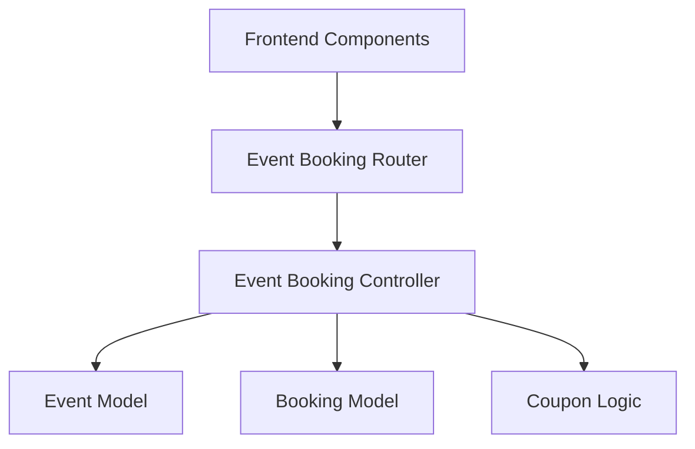

# Ticketed Event Booking

<cite>
**Referenced Files in This Document**
- [eventBookingController.js](file://backend/controller/eventBookingController.js)
- [eventBookingRouter.js](file://backend/router/eventBookingRouter.js)
- [eventSchema.js](file://backend/models/eventSchema.js)
- [bookingSchema.js](file://backend/models/bookingSchema.js)
- [TicketSelectionModal.jsx](file://frontend/src/components/TicketSelectionModal.jsx)
- [TicketSuccessModal.jsx](file://frontend/src/components/TicketSuccessModal.jsx)
- [TicketSuccessModal.jsx](file://frontend/src/components/TicketSuccessModal.jsx)
- [ticketGenerator.js](file://frontend/src/utils/ticketGenerator.js)
- [create-test-ticketed-event-and-booking.js](file://backend/create-test-ticketed-event-and-booking.js)
- [test-ticket-booking-flow.js](file://backend/test-ticket-booking-flow.js)
</cite>

## Table of Contents
1. [Introduction](#introduction)
2. [Project Structure](#project-structure)
3. [Core Components](#core-components)
4. [Architecture Overview](#architecture-overview)
5. [Detailed Component Analysis](#detailed-component-analysis)
6. [Dependency Analysis](#dependency-analysis)
7. [Performance Considerations](#performance-considerations)
8. [Troubleshooting Guide](#troubleshooting-guide)
9. [Conclusion](#conclusion)

## Introduction
This document explains the ticketed event booking system, focusing on the end-to-end workflow for purchasing event tickets. It covers the event-specific booking flow, including ticket selection, quantity management, event date handling, validation logic, capacity restrictions, and the booking confirmation process. It also documents the backend controller implementation, API endpoints, frontend modal interfaces, and inventory management mechanics.

## Project Structure
The ticketed booking system spans both backend and frontend layers:
- Backend: Express routes and controllers manage booking creation, validation, and status updates; Mongoose models define data structures for events and bookings.
- Frontend: React components provide the ticket selection modal, coupon application, and success confirmation with downloadable tickets.

**Diagram sources**
- [eventBookingRouter.js:1-47](file://backend/router/eventBookingRouter.js#L1-L47)
- [eventBookingController.js:1-1607](file://backend/controller/eventBookingController.js#L1-L1607)
- [eventSchema.js:1-23](file://backend/models/eventSchema.js#L1-L23)
- [bookingSchema.js:1-53](file://backend/models/bookingSchema.js#L1-L53)
- [TicketSelectionModal.jsx:1-448](file://frontend/src/components/TicketSelectionModal.jsx#L1-L448)
- [TicketSuccessModal.jsx:1-185](file://frontend/src/components/TicketSuccessModal.jsx#L1-L185)
- [ticketGenerator.js](file://frontend/src/utils/ticketGenerator.js)

**Section sources**
- [eventBookingRouter.js:1-47](file://backend/router/eventBookingRouter.js#L1-L47)
- [eventBookingController.js:1-1607](file://backend/controller/eventBookingController.js#L1-L1607)
- [TicketSelectionModal.jsx:1-448](file://frontend/src/components/TicketSelectionModal.jsx#L1-L448)
- [TicketSuccessModal.jsx:1-185](file://frontend/src/components/TicketSuccessModal.jsx#L1-L185)

## Core Components
- Backend Event Booking Controller: Implements ticketed booking creation, validation, capacity checks, coupon application, and booking confirmation.
- Backend Event and Booking Models: Define the data structures for events (including ticket types) and bookings.
- Frontend TicketSelectionModal: Handles ticket type selection, quantity input, coupon application, and submission to the backend.
- Frontend TicketSuccessModal: Displays booking confirmation, ticket details, and download functionality.

Key responsibilities:
- Ticket validation and capacity enforcement
- Coupon application and discount calculation
- Booking creation with payment linkage
- Inventory updates and availability tracking
- Frontend UX for selection and confirmation

**Section sources**
- [eventBookingController.js:321-589](file://backend/controller/eventBookingController.js#L321-L589)
- [eventSchema.js:1-23](file://backend/models/eventSchema.js#L1-L23)
- [bookingSchema.js:1-53](file://backend/models/bookingSchema.js#L1-L53)
- [TicketSelectionModal.jsx:150-222](file://frontend/src/components/TicketSelectionModal.jsx#L150-L222)

## Architecture Overview
The system follows a RESTful pattern with explicit endpoints for ticketed booking creation and payment processing. The frontend interacts with the backend via authenticated requests, and the backend enforces validation and capacity rules before persisting data.

**Diagram sources**
- [eventBookingRouter.js:27-33](file://backend/router/eventBookingRouter.js#L27-L33)
- [eventBookingController.js:8-73](file://backend/controller/eventBookingController.js#L8-L73)
- [eventBookingController.js:321-589](file://backend/controller/eventBookingController.js#L321-L589)

## Detailed Component Analysis

### Backend Event Booking Controller
The controller orchestrates the ticketed booking flow:
- Routes generic create requests to ticketed handler
- Validates user, event existence, and ticket type
- Enforces quantity limits against available capacity
- Calculates pricing and applies coupons
- Updates inventory and persists booking with payment linkage

**Diagram sources**
- [eventBookingController.js:321-589](file://backend/controller/eventBookingController.js#L321-L589)

Key implementation highlights:
- Ticket availability computed as quantityTotal minus quantitySold
- Event-level availableTickets recalculated after each booking
- Coupon validation performed with expiry, usage limits, and minimum spend checks
- Payment linkage via paymentId and paymentAmount stored on booking

**Section sources**
- [eventBookingController.js:321-589](file://backend/controller/eventBookingController.js#L321-L589)

### Backend Event and Booking Models
- Event Model: Stores event metadata and ticket types for ticketed events. Ticket types include name, price, total quantity, and sold count.
- Booking Model: Stores booking records with status, payment status, and event references.

**Diagram sources**
- [eventSchema.js:1-23](file://backend/models/eventSchema.js#L1-L23)
- [bookingSchema.js:1-53](file://backend/models/bookingSchema.js#L1-L53)

**Section sources**
- [eventSchema.js:1-23](file://backend/models/eventSchema.js#L1-L23)
- [bookingSchema.js:1-53](file://backend/models/bookingSchema.js#L1-L53)

### Frontend TicketSelectionModal
The modal provides:
- Ticket type selection dropdown populated from backend
- Quantity input constrained by available tickets
- Coupon application with validation feedback
- Booking submission with optional coupon data

**Diagram sources**
- [TicketSelectionModal.jsx:37-57](file://frontend/src/components/TicketSelectionModal.jsx#L37-L57)
- [TicketSelectionModal.jsx:81-112](file://frontend/src/components/TicketSelectionModal.jsx#L81-L112)
- [TicketSelectionModal.jsx:150-210](file://frontend/src/components/TicketSelectionModal.jsx#L150-L210)
- [eventBookingRouter.js:30-33](file://backend/router/eventBookingRouter.js#L30-L33)
- [eventBookingController.js:8-73](file://backend/controller/eventBookingController.js#L8-L73)

**Section sources**
- [TicketSelectionModal.jsx:150-222](file://frontend/src/components/TicketSelectionModal.jsx#L150-L222)
- [TicketSelectionModal.jsx:271-289](file://frontend/src/components/TicketSelectionModal.jsx#L271-L289)
- [TicketSelectionModal.jsx:291-377](file://frontend/src/components/TicketSelectionModal.jsx#L291-L377)

### Frontend TicketSuccessModal and Ticket Generation
After successful booking, the success modal displays:
- Event details and ticket summary
- Booking and payment identifiers
- Download ticket functionality using the ticket generator utility

**Diagram sources**
- [TicketSuccessModal.jsx:1-185](file://frontend/src/components/TicketSuccessModal.jsx#L1-L185)
- [ticketGenerator.js](file://frontend/src/utils/ticketGenerator.js)

**Section sources**
- [TicketSuccessModal.jsx:1-185](file://frontend/src/components/TicketSuccessModal.jsx#L1-L185)
- [ticketGenerator.js](file://frontend/src/utils/ticketGenerator.js)

### API Endpoints for Ticketed Booking
- POST /event-bookings/create: Generic booking creation routed to ticketed handler
- POST /event-bookings/ticketed: Direct ticketed booking endpoint
- GET /event-bookings/event/:eventId/tickets: Retrieve ticket types with availability
- PUT /event-bookings/:bookingId/pay: Process payment for a booking
- GET /event-bookings/my-bookings: Fetch user's bookings

**Diagram sources**
- [eventBookingRouter.js:27-34](file://backend/router/eventBookingRouter.js#L27-L34)

**Section sources**
- [eventBookingRouter.js:27-34](file://backend/router/eventBookingRouter.js#L27-L34)

## Dependency Analysis
- Controller depends on Event and Booking models for data persistence and validation.
- Frontend components depend on backend endpoints for ticket types and booking creation.
- Coupon validation is handled centrally in the controller with cross-cutting concerns for discount calculation and usage tracking.

**Diagram sources**
- [eventBookingRouter.js:1-47](file://backend/router/eventBookingRouter.js#L1-L47)
- [eventBookingController.js:321-589](file://backend/controller/eventBookingController.js#L321-L589)

**Section sources**
- [eventBookingController.js:321-589](file://backend/controller/eventBookingController.js#L321-L589)

## Performance Considerations
- Inventory updates: The controller increments quantitySold and recalculates availableTickets per booking, ensuring immediate consistency.
- Coupon processing: Discount calculation occurs client-side in the modal and server-side during booking creation, minimizing redundant computations.
- API calls: Ticket availability is fetched once per modal open, reducing repeated network overhead.

## Troubleshooting Guide
Common issues and resolutions:
- Event not found: Ensure the eventId exists and belongs to a ticketed event.
- Ticket sold out: Verify available tickets and prevent booking attempts exceeding availability.
- Invalid coupon: Check coupon validity, expiry, usage limits, and minimum spend requirements.
- Payment processing errors: Confirm booking ownership and payment status before attempting to process payment.

**Section sources**
- [eventBookingController.js:354-391](file://backend/controller/eventBookingController.js#L354-L391)
- [eventBookingController.js:402-474](file://backend/controller/eventBookingController.js#L402-L474)
- [eventBookingController.js:1096-1159](file://backend/controller/eventBookingController.js#L1096-L1159)

## Conclusion
The ticketed event booking system integrates robust backend validation and inventory management with a user-friendly frontend modal. It supports flexible ticket types, dynamic quantity selection, coupon application, and seamless payment processing, culminating in a downloadable ticket confirmation.